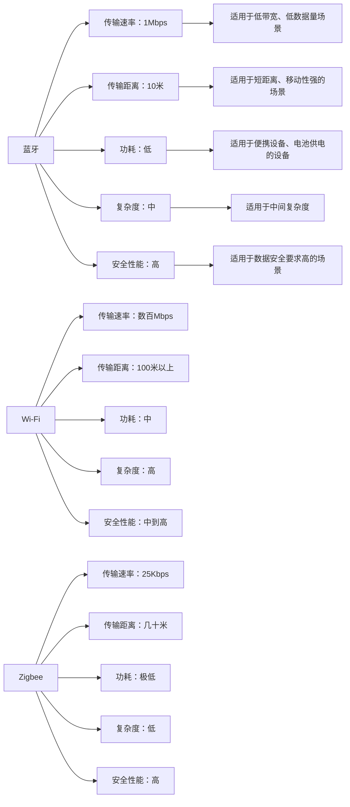

                 

## 1. 背景介绍

在当今高度互联的世界中，无线通信协议（Wireless Communication Protocols）扮演着至关重要的角色。无线通信技术在工业控制、医疗健康、家居自动化、车联网等各个领域都有广泛应用。其中，蓝牙（Bluetooth）、Wi-Fi（Wireless Fidelity）和Zigbee是当前最为流行的三种无线通信协议。它们各自有着不同的特性和应用场景。本文将深入探讨这三种协议，并详细对比它们在实际应用中的优势与不足。

## 2. 核心概念与联系

### 2.1 核心概念概述

无线通信协议是指用于无线传输数据的标准和协议。其中，蓝牙、Wi-Fi和Zigbee是当前最主流的无线通信协议，各自有其独特的应用场景和技术特点。

- **蓝牙（Bluetooth）**：蓝牙是一种用于短距离设备间无线通信的无线电技术，其传输速率可达1Mbps。
- **Wi-Fi（Wireless Fidelity）**：Wi-Fi是用于局域网（LAN）中无线数据传输的技术，其传输速率可达数百Mbps。
- **Zigbee**：Zigbee是一种低功耗、低速率、短距离的无线通信技术，适合工业控制、智能家居等领域。

这三种无线通信协议的主要区别在于传输速率、传输距离、功耗、复杂度和安全性能。

### 2.2 核心概念原理和架构的 Mermaid 流程图



## 3. 核心算法原理 & 具体操作步骤

### 3.1 算法原理概述

无线通信协议的原理主要基于电磁波的传输机制。它们通过不同的调制方式、频率范围和传输机制来实现数据传输。蓝牙、Wi-Fi和Zigbee各具特色，适用于不同的应用场景。

- **蓝牙**：基于ISM频段的2.4GHz频率，使用跳频扩频（FHSS）技术。蓝牙设备通过跳频序列来传输数据，确保数据传输的稳定性和抗干扰能力。
- **Wi-Fi**：使用IEEE 802.11标准，在2.4GHz或5GHz频段工作，支持多个接入点和频段选择，支持更高的传输速率和更远的传输距离。
- **Zigbee**：基于IEEE 802.15.4标准，使用超宽带信号在短距离内传输数据，适合低功耗、低速率的物联网应用。

### 3.2 算法步骤详解

蓝牙、Wi-Fi和Zigbee的实现步骤大致相同，但细节有所区别。以Wi-Fi为例，其核心步骤包括：

1. **频段选择**：Wi-Fi支持2.4GHz和5GHz两个频段，根据环境选择最合适的频段进行通信。
2. **接入控制**：通过MAC层协议控制设备的接入，保证网络稳定性和公平性。
3. **数据传输**：使用OFDM技术实现高速率数据传输，支持TCP/IP协议。
4. **安全机制**：采用WPA、WPA2、WPA3等安全协议，保障数据传输安全。

### 3.3 算法优缺点

蓝牙、Wi-Fi和Zigbee各自有其优缺点。

- **蓝牙**：
  - **优点**：传输距离适中、低功耗、低成本、易于部署、广泛兼容性。
  - **缺点**：传输速率较低、易受干扰、网络覆盖范围有限。

- **Wi-Fi**：
  - **优点**：高速率传输、高可靠性和稳定性、广泛兼容性、支持多种频段。
  - **缺点**：功耗相对较高、复杂性较高、成本较高。

- **Zigbee**：
  - **优点**：极低功耗、低成本、低速率、高网络容量、大范围覆盖。
  - **缺点**：传输速率较低、复杂性较高、安全性较低。

### 3.4 算法应用领域

- **蓝牙**：广泛应用于智能设备、医疗设备、音频设备等领域。
- **Wi-Fi**：广泛应用于家庭、企业、公共场所的网络连接。
- **Zigbee**：广泛应用于工业控制、智能家居、楼控系统等物联网应用。

## 4. 数学模型和公式 & 详细讲解 & 举例说明

### 4.1 数学模型构建

无线通信协议的数学模型通常基于物理层、链路层和应用层的标准和协议。以下是蓝牙、Wi-Fi和Zigbee的数学模型概述。

- **蓝牙**：使用跳频扩频技术，物理层主要涉及跳频序列的设计和频段选择。链路层采用CSMA/CA协议进行数据接入控制。应用层支持多种协议，如HSP、SPP等。
- **Wi-Fi**：基于OFDM技术，物理层涉及调制和解调算法、频谱分配。链路层采用CSMA/CA协议。应用层支持多种协议，如HTTP、FTP等。
- **Zigbee**：基于CDMA技术，物理层涉及信号调制、解调。链路层采用CSMA/CA协议。应用层支持多种协议，如TCP、UDP等。

### 4.2 公式推导过程

- **蓝牙**：
  $$
  R_{\text{蓝牙}} = \frac{W \times \text{跳频速率} \times \log_2(1 + \frac{P_{\text{信号}}}{N_0})}{T_{\text{数据}} + T_{\text{同步}} + T_{\text{跳频}}}
  $$
  其中 $R_{\text{蓝牙}}$ 为传输速率，$W$ 为频段宽度，$\text{跳频速率}$ 为跳频序列的速率，$P_{\text{信号}}$ 为信号功率，$N_0$ 为噪声功率谱密度，$T_{\text{数据}}$ 为数据传输时间，$T_{\text{同步}}$ 为同步时间，$T_{\text{跳频}}$ 为跳频时间。

- **Wi-Fi**：
  $$
  R_{\text{Wi-Fi}} = B \times \log_2(1 + \frac{P_{\text{信号}}}{N_0})
  $$
  其中 $R_{\text{Wi-Fi}}$ 为传输速率，$B$ 为频段带宽，$P_{\text{信号}}$ 为信号功率，$N_0$ 为噪声功率谱密度。

- **Zigbee**：
  $$
  R_{\text{Zigbee}} = B \times \log_2(1 + \frac{P_{\text{信号}}}{N_0})
  $$
  其中 $R_{\text{Zigbee}}$ 为传输速率，$B$ 为频段带宽，$P_{\text{信号}}$ 为信号功率，$N_0$ 为噪声功率谱密度。

### 4.3 案例分析与讲解

以智能家居为例，分析三种协议的应用。

- **蓝牙**：适用于智能音箱、智能耳机等设备，通过低功耗蓝牙（BLE）技术实现设备间的短距离通信。
- **Wi-Fi**：适用于智能门锁、智能电视等设备，通过Wi-Fi实现家庭内部的远程控制和数据传输。
- **Zigbee**：适用于智能灯泡、智能窗帘等设备，通过Zigbee实现低功耗的家居自动化控制。

## 5. 项目实践：代码实例和详细解释说明

### 5.1 开发环境搭建

搭建无线通信协议的开发环境需要安装相应的硬件设备，如蓝牙模块、Wi-Fi模块和Zigbee模块。以蓝牙模块为例，需要连接串口和USB接口，使用IDE（如Arduino IDE、Visual Studio等）进行编程。

### 5.2 源代码详细实现

以一个简单的蓝牙传输示例代码为例，使用Arduino IDE编写以下代码：

```cpp
#include <SoftwareSerial.h>

SoftwareSerial BT Serial(10, 11); // 使用软件串口与蓝牙模块通信
const char* BT_MESSAGE = "Hello, Bluetooth!"; // 发送的消息

void setup() {
  Serial.begin(9600); // 初始化串口
  BT.begin(9600); // 初始化蓝牙模块
}

void loop() {
  if (BT.available()) { // 收到蓝牙消息
    Serial.println(BT.readString()); // 打印接收到的消息
  }
  
  BT.write(BT_MESSAGE); // 发送消息
  delay(1000); // 延时1秒
}
```

### 5.3 代码解读与分析

该代码通过软件串口与蓝牙模块通信，实现简单的消息发送和接收。蓝牙模块通过串口收到消息后，通过串口将消息发送到主控设备。主控设备通过串口收到消息后，打印输出消息内容。

### 5.4 运行结果展示

通过串口连接蓝牙模块，运行上述代码，可以观察到以下输出：

```
Hello, Bluetooth!
```

这表示蓝牙模块成功收到了消息并打印了消息内容。

## 6. 实际应用场景

### 6.1 智能家居系统

智能家居系统是蓝牙、Wi-Fi和Zigbee的主要应用场景之一。通过这些协议，智能设备可以实现远程控制、数据传输和自动化控制等功能。

- **蓝牙**：适用于智能音箱、智能耳机等设备，通过低功耗蓝牙（BLE）技术实现设备间的短距离通信。
- **Wi-Fi**：适用于智能门锁、智能电视等设备，通过Wi-Fi实现家庭内部的远程控制和数据传输。
- **Zigbee**：适用于智能灯泡、智能窗帘等设备，通过Zigbee实现低功耗的家居自动化控制。

### 6.2 工业自动化系统

工业自动化系统需要实现设备间的快速通信和数据传输。蓝牙、Wi-Fi和Zigbee都能满足这一需求。

- **蓝牙**：适用于无线传感器网络（WSN），通过蓝牙模块实现传感器数据的传输和采集。
- **Wi-Fi**：适用于工厂内部的网络监控和远程控制，通过Wi-Fi实现设备间的通信。
- **Zigbee**：适用于楼控系统、设备监控等应用，通过Zigbee实现设备间的低功耗通信。

### 6.3 医疗健康系统

医疗健康系统需要实时传输数据和远程监控。蓝牙、Wi-Fi和Zigbee都能用于这一领域。

- **蓝牙**：适用于医疗设备的远程监控，通过蓝牙模块实现设备与主控设备的通信。
- **Wi-Fi**：适用于远程医疗监控，通过Wi-Fi实现患者数据的传输和共享。
- **Zigbee**：适用于智能穿戴设备，通过Zigbee实现健康数据的传输和采集。

## 7. 工具和资源推荐

### 7.1 学习资源推荐

为了深入了解蓝牙、Wi-Fi和Zigbee的原理和应用，以下是一些推荐的学习资源：

1. **《蓝牙原理与应用》**：该书详细介绍了蓝牙的原理、标准和应用场景。
2. **《Wi-Fi技术详解》**：该书深入浅出地讲解了Wi-Fi的原理和应用。
3. **《Zigbee入门与开发》**：该书介绍了Zigbee的基本概念和开发流程。

### 7.2 开发工具推荐

开发无线通信协议需要使用特定的硬件设备，如蓝牙模块、Wi-Fi模块和Zigbee模块。以下是一些推荐的开发工具：

1. **Arduino**：一个广泛使用的开源硬件平台，支持蓝牙、Wi-Fi和Zigbee模块的开发。
2. **Raspberry Pi**：一个功能强大的单板计算机，支持多种无线通信协议的开发。
3. **ESP8266/ESP32**：一个集成Wi-Fi和蓝牙功能的单片机，适合低功耗设备的开发。

### 7.3 相关论文推荐

以下是一些与蓝牙、Wi-Fi和Zigbee相关的经典论文，推荐阅读：

1. **《Bluetooth Technology Overview》**：介绍了蓝牙技术的原理和应用。
2. **《Wireless Fidelity: Top-Down Overview and Future Directions》**：探讨了Wi-Fi技术的现状和未来发展方向。
3. **《Zigbee Wireless Sensor Networks: Opportunities and Challenges》**：探讨了Zigbee无线传感器网络的应用和挑战。

## 8. 总结：未来发展趋势与挑战

### 8.1 研究成果总结

蓝牙、Wi-Fi和Zigbee在无线通信领域已经得到了广泛应用，但在应用过程中仍面临一些挑战，如网络安全、设备兼容性、功耗控制等。

### 8.2 未来发展趋势

未来，无线通信协议将朝着以下方向发展：

1. **高可靠性**：提升无线通信的可靠性，减少数据丢失和延迟。
2. **低功耗**：降低设备功耗，延长电池寿命，提高设备的可移动性和便携性。
3. **高速率**：提升传输速率，满足更多高带宽应用的需求。
4. **广泛兼容**：支持多种设备和协议，提高设备的互操作性。

### 8.3 面临的挑战

尽管无线通信协议在应用中取得了很大进展，但仍面临一些挑战：

1. **网络安全**：无线通信容易受到窃听、篡改等安全威胁。
2. **设备兼容性**：不同协议的设备难以互通，增加了部署和维护的复杂性。
3. **功耗控制**：低功耗设备需要设计高效的功耗管理策略。

### 8.4 研究展望

未来的研究可以从以下几个方面进行：

1. **多协议融合**：研究将蓝牙、Wi-Fi和Zigbee等多种无线通信协议融合的技术。
2. **新协议开发**：探索新的无线通信协议，以满足更多的应用需求。
3. **网络优化**：研究无线通信网络的优化算法和策略。

## 9. 附录：常见问题与解答

**Q1：蓝牙、Wi-Fi和Zigbee的区别是什么？**

A: 蓝牙、Wi-Fi和Zigbee的主要区别在于传输速率、传输距离、功耗和复杂度。蓝牙适合短距离、低功耗的通信，Wi-Fi适合中高带宽、远距离的通信，Zigbee适合低功耗、低速率的物联网应用。

**Q2：蓝牙、Wi-Fi和Zigbee各自有什么优缺点？**

A: 蓝牙的优点是传输距离适中、低功耗、低成本、易于部署、广泛兼容性；缺点是传输速率较低、易受干扰、网络覆盖范围有限。Wi-Fi的优点是高速率传输、高可靠性和稳定性、广泛兼容性、支持多种频段；缺点是功耗相对较高、复杂性较高、成本较高。Zigbee的优点是极低功耗、低成本、低速率、高网络容量、大范围覆盖；缺点是传输速率较低、复杂性较高、安全性较低。

**Q3：如何选择合适的无线通信协议？**

A: 选择合适的无线通信协议需要考虑设备的功能需求、传输距离、功耗要求、数据速率等因素。一般来说，短距离、低功耗的物联网应用适合Zigbee，室内网络连接适合Wi-Fi，便携式设备适合蓝牙。

**Q4：蓝牙、Wi-Fi和Zigbee的实际应用场景有哪些？**

A: 蓝牙适合智能设备、医疗设备、音频设备等领域。Wi-Fi适合家庭、企业、公共场所的网络连接。Zigbee适合工业控制、智能家居、楼控系统等物联网应用。

---

作者：禅与计算机程序设计艺术 / Zen and the Art of Computer Programming

