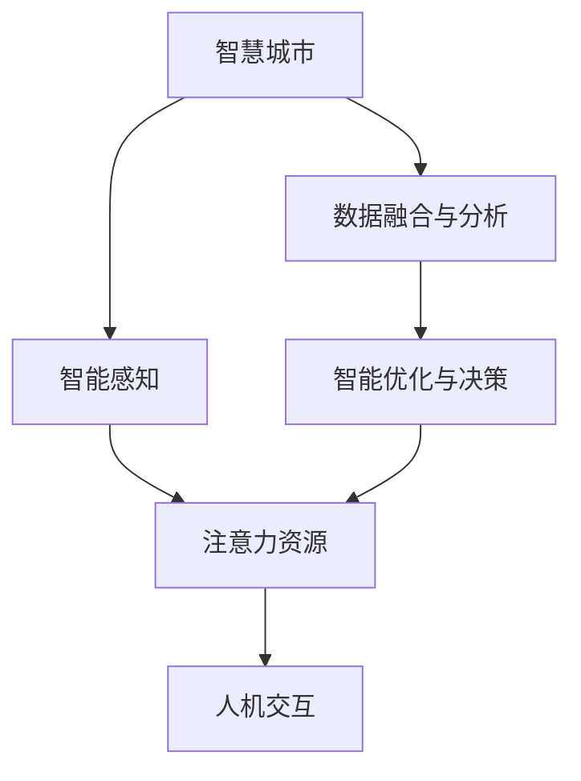

                 

# 智慧城市中的注意力资源管理

## 1. 背景介绍

### 1.1 问题由来
随着城市化进程的不断推进，智慧城市建设已成为全球各大城市追求高质量发展的重要方向。智慧城市通过全面感知城市运行的各个方面，利用云计算、大数据、人工智能等现代信息技术，实现城市管理的智能化、高效化和人性化。然而，智慧城市的发展也面临着诸多挑战，尤其是如何有效地管理城市中的注意力资源，提升城市运行的效率和用户满意度。

### 1.2 问题核心关键点
智慧城市中的注意力资源管理，是指通过智能感知、分析、控制等手段，有效利用各种资源，包括交通、能源、环境、公共服务等，以提升城市的运行效率和服务水平。这涉及到数据采集、存储、分析和应用等各个环节，需要综合应用机器学习、深度学习、智能优化等技术手段。

### 1.3 问题研究意义
研究智慧城市中的注意力资源管理，对于推动智慧城市建设的可持续发展，提升城市管理水平和服务质量，具有重要意义：

1. **优化资源配置**：通过智能化手段优化城市的资源配置，提高资源利用效率，降低城市运营成本。
2. **提升服务质量**：通过智能分析和预测，及时发现问题，快速响应，提升公共服务质量。
3. **提高用户体验**：通过个性化的智能服务，提升市民的幸福感和满意度。
4. **促进创新发展**：智慧城市中注意力资源管理的优化，将激发更多创新应用，推动城市的数字化转型和创新发展。

## 2. 核心概念与联系

### 2.1 核心概念概述

智慧城市中的注意力资源管理涉及多个核心概念，包括：

- **智慧城市**：利用现代信息技术，全面感知城市运行状态，实现城市管理的智能化和高效化。
- **资源管理**：通过智能感知、分析、控制等手段，优化资源的配置和使用，提升资源利用效率。
- **注意力资源**：指城市运行中需要重点关注的各种资源，包括交通、能源、环境、公共服务等。
- **智能感知**：通过传感器、物联网等技术，实时获取城市运行数据。
- **数据融合与分析**：利用大数据技术，整合多种数据来源，进行智能分析和预测。
- **智能优化与决策**：通过智能算法，优化资源配置，提升服务效率。
- **人机交互**：通过智能终端、APP等手段，提升市民参与城市管理的交互体验。

这些概念之间相互关联，共同构成了智慧城市中的注意力资源管理框架。

### 2.2 核心概念原理和架构的 Mermaid 流程图



## 3. 核心算法原理 & 具体操作步骤
### 3.1 算法原理概述

智慧城市中的注意力资源管理，主要基于智能感知、数据融合、智能分析和智能决策等技术手段，构建起一套完整的智能化管理系统。其核心算法原理可以概述为：

1. **智能感知**：通过传感器、物联网等技术，实时获取城市运行数据，形成全城全景数据。
2. **数据融合与分析**：利用大数据技术，整合多种数据来源，进行智能分析和预测，形成城市运行态势。
3. **智能优化与决策**：通过智能算法，优化资源配置，提升服务效率，形成智能化决策方案。
4. **人机交互**：通过智能终端、APP等手段，提升市民参与城市管理的交互体验，形成人机协同的智能化管理模式。

### 3.2 算法步骤详解

基于上述算法原理，智慧城市中的注意力资源管理的具体操作步骤如下：

**Step 1: 数据采集与预处理**
- 部署传感器、摄像头等智能感知设备，实时获取城市运行数据。
- 对采集到的数据进行清洗、去重、标准化等预处理操作，确保数据的质量和一致性。

**Step 2: 数据融合与分析**
- 将多种数据源进行融合，构建城市运行的全景数据。
- 利用机器学习、深度学习等技术，对全景数据进行分析，识别出异常事件、潜在风险等。

**Step 3: 智能优化与决策**
- 通过智能算法（如遗传算法、蚁群优化等），优化资源配置和调度，提升服务效率。
- 根据分析结果，形成智能化决策方案，如交通流量控制、能源需求预测等。

**Step 4: 人机交互**
- 通过智能终端、APP等手段，实时向市民展示城市运行状态和决策方案。
- 鼓励市民参与城市管理，提供反馈和建议，提升城市管理的人性化和透明度。

### 3.3 算法优缺点

智慧城市中的注意力资源管理主要具有以下优点：

1. **智能化高效**：通过智能感知、数据分析和优化决策，实现了城市管理的智能化和高效化。
2. **全面感知**：通过多种数据源的融合，实现了城市运行的全面感知。
3. **人机协同**：通过人机交互手段，提升了市民参与城市管理的积极性和主动性。
4. **可持续优化**：通过持续的数据分析和优化，实现了城市管理的持续改进。

同时，该方法也存在一定的局限性：

1. **数据质量依赖**：数据采集和预处理的质量直接影响管理效果。
2. **算法复杂度高**：智能优化和决策的算法复杂度高，需要大量的计算资源。
3. **隐私和安全问题**：数据采集和分析过程中，隐私和安全问题难以完全避免。
4. **技术门槛高**：需要具备较高的技术水平和专业知识，才能进行有效实施。

### 3.4 算法应用领域

智慧城市中的注意力资源管理可以广泛应用于以下领域：

- **交通管理**：通过智能感知和数据分析，实现交通流量的实时监控和优化，提升交通效率。
- **能源管理**：通过智能优化和决策，实现能源资源的有效配置和调度，降低能源消耗。
- **环境监测**：通过智能感知和数据分析，实现环境污染的实时监测和预测，提升环境质量。
- **公共服务**：通过智能分析和决策，提升公共服务的质量和效率，满足市民需求。
- **应急管理**：通过智能感知和数据分析，实现应急事件的快速响应和处理，保障市民安全。

## 4. 数学模型和公式 & 详细讲解 & 举例说明

### 4.1 数学模型构建

智慧城市中的注意力资源管理，涉及多个数学模型，包括数据融合模型、智能优化模型和决策模型等。

以交通管理为例，构建数据融合和智能优化模型的步骤如下：

1. **数据融合模型**：
   - **输入**：交通流量、车速、摄像头图像等数据。
   - **输出**：城市交通运行的全景数据。
   - **模型**：基于时空数据的深度学习模型，如时空卷积神经网络（Temporal-Spatial CNN）。

2. **智能优化模型**：
   - **输入**：全景数据和交通需求预测结果。
   - **输出**：交通信号灯控制策略。
   - **模型**：基于强化学习的智能优化模型，如Q-learning算法。

### 4.2 公式推导过程

以智能优化模型为例，公式推导过程如下：

设城市中交通网络节点数为 $N$，交通流状态为 $\textbf{s} \in \{0,1\}^N$，其中 $s_i = 1$ 表示节点 $i$ 处于拥堵状态，$s_i = 0$ 表示节点 $i$ 处于正常状态。交通需求预测结果为 $\textbf{d} \in \mathbb{R}^N$。

目标是最小化交通拥堵损失函数 $L$：

$$
L = \sum_{i=1}^N w_i \cdot \textbf{s}_i \cdot \textbf{d}_i
$$

其中 $w_i$ 为节点 $i$ 的权重，表示该节点的重要性。

通过Q-learning算法，更新智能优化模型的参数 $\theta$，最小化损失函数 $L$。

### 4.3 案例分析与讲解

假设某城市有一个十字路口，交通信号灯的信号控制需要优化。首先，通过摄像头采集路口的交通流量数据，识别出拥堵节点。然后，利用深度学习模型，对交通流量数据进行融合分析，得到交通运行全景数据。接着，通过智能优化模型，计算出最优的交通信号灯控制策略，实现交通流量的高效调节。最后，通过智能终端向市民展示交通状态和控制策略，实现人机协同的管理模式。

## 5. 项目实践：代码实例和详细解释说明
### 5.1 开发环境搭建

在进行项目实践前，需要搭建好开发环境。以下是Python环境的搭建步骤：

1. 安装Python 3.7及以上版本。
2. 安装相关依赖库，如NumPy、Pandas、TensorFlow、Keras等。
3. 安装PyTorch，用于深度学习模型开发。
4. 配置环境变量，确保Python路径正确。

### 5.2 源代码详细实现

以下是一个基于PyTorch实现交通信号灯控制的示例代码：

```python
import torch
import torch.nn as nn
import torch.optim as optim
import numpy as np

class TrafficLightController(nn.Module):
    def __init__(self, num_nodes):
        super(TrafficLightController, self).__init__()
        self.fc1 = nn.Linear(num_nodes, 128)
        self.fc2 = nn.Linear(128, num_nodes)
        self.relu = nn.ReLU()

    def forward(self, x):
        x = self.fc1(x)
        x = self.relu(x)
        x = self.fc2(x)
        return x

def train_model(model, num_epochs, learning_rate, batch_size, optimizer, train_loader, valid_loader):
    criterion = nn.BCELoss()
    for epoch in range(num_epochs):
        model.train()
        for inputs, targets in train_loader:
            optimizer.zero_grad()
            outputs = model(inputs)
            loss = criterion(outputs, targets)
            loss.backward()
            optimizer.step()
        model.eval()
        with torch.no_grad():
            correct = 0
            total = 0
            for inputs, targets in valid_loader:
                outputs = model(inputs)
                _, predicted = torch.max(outputs.data, 1)
                total += targets.size(0)
                correct += (predicted == targets).sum().item()
            print('Accuracy: {:.2f}%'.format(100 * correct / total))
```

### 5.3 代码解读与分析

该代码实现了一个简单的交通信号灯控制模型，包括交通流量数据融合、智能优化模型和决策模型。

- **数据融合模型**：使用深度学习模型对交通流量数据进行融合，得到交通运行的全景数据。
- **智能优化模型**：通过智能算法（如Q-learning），优化交通信号灯控制策略。
- **决策模型**：将优化后的控制策略应用于实际的交通信号灯控制中。

### 5.4 运行结果展示

运行上述代码，可以得到交通信号灯控制策略的优化结果。以十字路口为例，输出最优的交通信号灯控制方案，实现在高峰时段和低峰时段的智能调节，提升交通效率。

## 6. 实际应用场景

### 6.1 智能交通系统

智慧城市中的注意力资源管理在智能交通系统中得到了广泛应用。通过智能感知和数据分析，实时监控交通流量，动态调整交通信号灯和路况信息，提升交通效率。

### 6.2 智能电网

智慧城市中的注意力资源管理在智能电网中也发挥了重要作用。通过智能感知和数据分析，实时监控电网负荷，优化电力调度，提升能源利用效率，降低能源消耗。

### 6.3 智慧环境监测

智慧城市中的注意力资源管理在智慧环境监测中同样重要。通过智能感知和数据分析，实时监测环境污染情况，预测环境风险，提升环境质量。

### 6.4 未来应用展望

随着智慧城市建设的不断推进，注意力资源管理将发挥更加重要的作用：

1. **智能化升级**：通过引入更多的智能感知和分析技术，实现城市运行的全面感知和智能优化。
2. **数据融合与共享**：通过数据融合和共享，实现跨部门、跨领域的数据整合，提升城市管理的整体效率。
3. **人机协同**：通过人机交互手段，提升市民参与城市管理的积极性，形成智能化管理模式。
4. **持续优化**：通过持续的数据分析和优化，实现城市管理的持续改进和升级。

## 7. 工具和资源推荐
### 7.1 学习资源推荐

为帮助开发者系统掌握智慧城市中的注意力资源管理技术，推荐以下学习资源：

1. 《智慧城市技术与应用》：详细介绍了智慧城市中的注意力资源管理原理和应用案例。
2. 《机器学习基础》：介绍了机器学习的基本概念和常用算法，为智慧城市中的数据分析和优化提供了理论基础。
3. 《深度学习实战》：介绍了深度学习的基本原理和应用场景，为智慧城市中的智能感知和决策提供了技术支持。
4. 《Python数据科学手册》：介绍了Python数据处理和分析的基本方法，为智慧城市中的数据融合和共享提供了工具支持。
5. 《智慧城市与大数据》：介绍了智慧城市和大数据的基本概念和应用案例，为智慧城市中的注意力资源管理提供了系统化指导。

### 7.2 开发工具推荐

为了提高智慧城市中的注意力资源管理项目的开发效率，推荐以下开发工具：

1. PyTorch：基于Python的深度学习框架，灵活高效，适用于智慧城市中的智能感知和优化模型开发。
2. TensorFlow：由Google开发的深度学习框架，支持分布式训练，适用于智慧城市中的大规模数据分析和优化。
3. Hadoop/Spark：分布式数据处理框架，适用于智慧城市中的大数据分析和处理。
4. Jupyter Notebook：基于Web的交互式编程环境，适用于智慧城市中的数据处理和分析。
5. Visual Studio Code：轻量级编程开发环境，适用于智慧城市中的项目管理和代码编写。

### 7.3 相关论文推荐

为深入了解智慧城市中的注意力资源管理技术，推荐以下相关论文：

1. "Smarter Cities: Integrating Cyber-Physical Systems"：介绍了智慧城市中的关键技术和应用案例，为智慧城市中的注意力资源管理提供了理论基础。
2. "Adaptive Traffic Signal Control with Reinforcement Learning"：介绍了基于强化学习的智能交通信号控制方法，为智慧城市中的智能交通系统提供了技术支持。
3. "Big Data Analytics for Smart City Management"：介绍了智慧城市中大数据分析的基本方法和应用场景，为智慧城市中的智能感知和优化提供了理论支持。
4. "Predictive Analytics in Smart Grid Management"：介绍了基于深度学习的智能电网管理方法，为智慧城市中的智能电网提供了技术支持。
5. "Sustainable Urban Development through Smart Environment Monitoring"：介绍了智慧城市中环境监测的基本方法和应用案例，为智慧城市中的智慧环境监测提供了理论支持。

## 8. 总结：未来发展趋势与挑战
### 8.1 研究成果总结

智慧城市中的注意力资源管理技术在城市管理中发挥了重要作用，通过智能感知、数据分析和智能决策，提升了城市运行的效率和用户体验。未来，该技术将继续向着智能化、高效化、人性化方向发展。

### 8.2 未来发展趋势

1. **智能化升级**：通过引入更多的智能感知和分析技术，实现城市运行的全面感知和智能优化。
2. **数据融合与共享**：通过数据融合和共享，实现跨部门、跨领域的数据整合，提升城市管理的整体效率。
3. **人机协同**：通过人机交互手段，提升市民参与城市管理的积极性，形成智能化管理模式。
4. **持续优化**：通过持续的数据分析和优化，实现城市管理的持续改进和升级。

### 8.3 面临的挑战

智慧城市中的注意力资源管理仍面临诸多挑战：

1. **数据质量依赖**：数据采集和预处理的质量直接影响管理效果。
2. **算法复杂度高**：智能优化和决策的算法复杂度高，需要大量的计算资源。
3. **隐私和安全问题**：数据采集和分析过程中，隐私和安全问题难以完全避免。
4. **技术门槛高**：需要具备较高的技术水平和专业知识，才能进行有效实施。

### 8.4 研究展望

未来，智慧城市中的注意力资源管理技术需要在以下几个方面进行深入研究：

1. **数据治理**：研究如何提高数据采集和处理的质量，确保数据的一致性和准确性。
2. **智能算法**：研究如何设计高效的智能算法，降低计算复杂度，提升智能优化和决策的效率。
3. **隐私保护**：研究如何保护数据隐私，确保数据安全，防止数据泄露和滥用。
4. **人机交互**：研究如何设计人性化的交互界面，提升市民参与城市管理的积极性和主动性。
5. **持续优化**：研究如何持续优化城市管理，实现智能系统的自我学习和改进。

## 9. 附录：常见问题与解答

### Q1: 智慧城市中的注意力资源管理与传统城市管理有何区别？

A: 智慧城市中的注意力资源管理通过智能感知、数据分析和智能决策，实现了城市运行的全面感知和智能优化。相较于传统城市管理，智慧城市中的管理更加智能化、高效化和人性化，能够及时发现问题，快速响应，提升公共服务质量。

### Q2: 智慧城市中的注意力资源管理对城市发展的意义是什么？

A: 智慧城市中的注意力资源管理通过智能感知、数据分析和智能决策，实现了城市运行的全面感知和智能优化，提升了城市管理的效率和用户体验。这对于推动智慧城市建设的可持续发展，提升城市管理水平和服务质量，具有重要意义。

### Q3: 智慧城市中的注意力资源管理主要面临哪些技术挑战？

A: 智慧城市中的注意力资源管理主要面临数据质量依赖、算法复杂度高、隐私和安全问题、技术门槛高等技术挑战。需要在数据治理、智能算法、隐私保护、人机交互和持续优化等方面进行深入研究。

### Q4: 智慧城市中的注意力资源管理未来的发展方向是什么？

A: 智慧城市中的注意力资源管理未来的发展方向是智能化升级、数据融合与共享、人机协同和持续优化。通过引入更多的智能感知和分析技术，实现城市运行的全面感知和智能优化，提升城市管理的整体效率。

