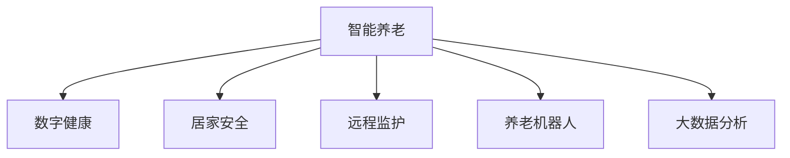

                 

# 智能养老创业：科技助力的老年生活

> 关键词：智能养老,科技应用,养老创业,数字健康,居家安全,远程监护,养老机器人,大数据分析,智慧养老

## 1. 背景介绍

### 1.1 问题由来
随着全球人口老龄化趋势的加剧，养老问题已经成为各国政府和家庭共同关注的焦点。传统养老方式主要以家庭照护为主，但随着社会节奏的加快，年轻一代普遍面临工作压力大、生活节奏快的问题，难以兼顾老人的日常照料。而专业养老机构由于人力成本高、服务质量参差不齐，难以满足越来越多家庭对于高质量养老服务的需求。

近年来，随着科技的迅猛发展，智能养老作为一种新兴的养老模式逐渐受到社会的关注。智能养老利用现代信息技术，如物联网、人工智能、大数据等，结合智能家居、可穿戴设备、远程监护等手段，为老人提供更便捷、更安全、更个性化的养老服务。智能养老不仅减轻了家庭的照护负担，还提升了老人的生活质量，成为养老行业发展的趋势之一。

### 1.2 问题核心关键点
智能养老的核心在于将现代科技与养老服务深度结合，为老人提供全方位、全天候、个性化的生活照料和健康监护。这不仅需要科技领域的创新突破，还需要与医疗、健康、家庭等多领域紧密合作，实现真正的跨界融合。

具体来说，智能养老包括以下几个关键点：
1. 数字健康：利用智能设备监测老人的健康状况，如血压、心率、血糖等，并根据数据进行健康分析和预警。
2. 居家安全：通过智能安防系统监测老人的日常活动和环境变化，确保老人的安全。
3. 远程监护：利用视频通话、健康监测、紧急求助等远程监控手段，让家人随时了解老人的生活状况。
4. 养老机器人：通过智能机器人提供日常生活中的各种辅助服务，如护理、陪伴、购物等。
5. 大数据分析：利用大数据技术分析老人的行为数据和生活习惯，提供个性化的生活建议和健康管理。

这些关键点的实现，不仅依赖于单项技术的突破，还需要跨领域的深度融合和协同创新。本文将从技术原理和应用实践两个方面，系统阐述智能养老创业的科技助力策略，为养老创业者提供全面的参考。

## 2. 核心概念与联系

### 2.1 核心概念概述

为更好地理解智能养老创业的技术原理和应用场景，本节将介绍几个密切相关的核心概念：

- 智能养老：利用现代信息技术为老年人提供智能化、个性化、全天候的养老服务，提高老年人的生活质量和幸福感。
- 数字健康：通过可穿戴设备、智能传感器等手段，收集老人的健康数据，实时监测和分析，提供个性化的健康管理和预警。
- 居家安全：结合物联网技术，通过智能安防系统，实时监测老人的活动和环境变化，确保老人的安全。
- 远程监护：利用视频通话、健康监测、紧急求助等远程监控手段，让家人随时了解老人的生活状况。
- 养老机器人：通过智能机器人提供日常生活中的各种辅助服务，如护理、陪伴、购物等。
- 大数据分析：利用大数据技术分析老人的行为数据和生活习惯，提供个性化的生活建议和健康管理。

这些核心概念之间的逻辑关系可以通过以下Mermaid流程图来展示：



这个流程图展示智能养老的核心概念及其之间的关系：

1. 智能养老通过数字健康获取老人的健康数据。
2. 数字健康和居家安全、远程监护、养老机器人共同为老人提供全方位的监护和辅助。
3. 大数据分析对老人的行为数据和生活习惯进行分析，提供个性化的服务建议。

这些概念共同构成了智能养老的技术框架，使得现代科技在养老领域的广泛应用成为可能。通过理解这些核心概念，我们可以更好地把握智能养老创业的技术逻辑和应用方向。

## 3. 核心算法原理 & 具体操作步骤
### 3.1 算法原理概述

智能养老创业的核心算法原理包括以下几个方面：

- 数字健康：基于可穿戴设备传感器采集的数据，结合机器学习算法，对老人的健康状况进行实时监测和分析。
- 居家安全：通过传感器和摄像头等设备，监测老人的活动和环境变化，结合异常检测算法，及时发现潜在的安全隐患。
- 远程监护：利用视频通话、健康监测设备等，实时收集老人的健康和生活数据，提供紧急求助和远程护理服务。
- 养老机器人：结合计算机视觉、自然语言处理、路径规划等技术，使机器人能够执行简单的日常辅助任务，如导航、对话、护理等。
- 大数据分析：利用数据挖掘、机器学习等技术，分析老人的行为数据和生活习惯，提供个性化的健康管理和生活建议。

这些算法的核心在于数据采集、数据处理、数据分析和应用反馈，通过不断的循环迭代，实现对老人生活的全方位、个性化监护。

### 3.2 算法步骤详解

智能养老创业的算法步骤主要包括以下几个环节：

**Step 1: 数据采集与预处理**
- 选择合适的传感器和设备，收集老人的健康数据、位置信息、环境数据等。
- 对采集到的数据进行预处理，包括去噪、归一化、特征提取等，确保数据的可用性。

**Step 2: 模型训练与优化**
- 选择适合的机器学习模型，如神经网络、决策树、支持向量机等，对数据进行训练和优化。
- 利用交叉验证等技术，评估模型的性能，并进行超参数调优。

**Step 3: 应用集成与反馈**
- 将训练好的模型集成到智能养老平台中，实现实时数据监测和分析。
- 对老人的健康状况、安全情况、生活状态等进行实时监控，并根据分析结果提供相应的服务建议。

**Step 4: 用户体验优化**
- 设计友好的用户界面，提供简单易用的操作指引，让老人和家属能够轻松使用智能养老系统。
- 收集用户的反馈意见，不断迭代和优化系统功能，提升用户体验。

### 3.3 算法优缺点

智能养老创业的算法具有以下优点：
1. 自动化程度高。智能养老系统通过数据采集和机器学习，能够自动化地进行健康监测、安全防护等任务，减轻了家庭成员的照护负担。
2. 实时性强。利用传感器和智能设备，可以实现全天候、实时的数据采集和分析，确保老人的安全和生活质量。
3. 个性化服务。通过对老人行为数据的分析，可以提供个性化的健康管理和生活建议，提升老人的生活体验。

同时，智能养老算法也存在以下局限性：
1. 设备成本高。智能设备和传感器的引入，需要较高的初始投资成本，可能难以在短期内普及。
2. 数据隐私和安全问题。老人健康数据的收集和存储需要严格的隐私保护措施，防止数据泄露和滥用。
3. 技术依赖性。智能养老系统的运行依赖于硬件设备的稳定性和软件算法的准确性，一旦出现故障或误差，可能影响系统的可靠性。

尽管存在这些局限性，但智能养老技术的引入，无疑为养老行业带来了新的发展机遇，为老年人提供了更加便捷、安全和舒适的养老环境。未来，随着技术的不断进步和成本的降低，智能养老将逐渐普及，成为养老行业的主流发展方向。

### 3.4 算法应用领域

智能养老创业的算法应用领域广泛，包括以下几个方面：

1. 数字健康：利用智能手表、血压计、血糖仪等设备，实时监测老人的健康状况，提供个性化的健康管理建议。
2. 居家安全：通过智能门锁、烟雾报警器、摄像头等设备，监测老人的居家环境，预防潜在的安全隐患。
3. 远程监护：利用视频通话、健康监测设备等，实现对老人的远程监护，确保老人的安全和生活质量。
4. 养老机器人：通过机器人提供日常护理、陪伴、购物等辅助服务，提升老人的生活质量。
5. 大数据分析：利用大数据技术分析老人的行为数据和生活习惯，提供个性化的健康管理和生活建议。

这些应用领域涵盖了老人的日常生活和健康管理，通过跨领域的深度融合，实现全方位的智能养老服务。

## 4. 数学模型和公式 & 详细讲解  
### 4.1 数学模型构建

为了更好地理解智能养老创业中的算法原理，本节将介绍几个核心数学模型。

- 数字健康：基于可穿戴设备采集的健康数据，利用机器学习算法（如时间序列分析、决策树、随机森林等），对老人的健康状况进行实时监测和预测。
- 居家安全：结合传感器和摄像头等设备，利用异常检测算法（如孤立森林、GBDT等），实时监测老人的活动和环境变化，预防安全事故的发生。
- 远程监护：利用视频通话、健康监测设备等，利用深度学习算法（如卷积神经网络、循环神经网络等），对老人的健康和生活数据进行实时分析。
- 养老机器人：结合计算机视觉、自然语言处理等技术，利用路径规划算法（如A*、RRT等），实现机器人的路径规划和动作控制。
- 大数据分析：利用数据挖掘、机器学习等技术，对老人的行为数据和生活习惯进行分析，提供个性化的健康管理和生活建议。

### 4.2 公式推导过程

以下我们以数字健康为例，推导机器学习算法的基本公式。

假设采集到的老人健康数据为 $X=\{x_1,x_2,...,x_n\}$，其中 $x_i=(x_{i1},x_{i2},...,x_{im})$ 为第 $i$ 天的健康数据，每个健康指标 $x_{ij}$ 取值范围为 $[x_{\min},x_{\max}]$，$i=1,2,...,N$。

假设 $X$ 与老人的健康状态 $Y$ 之间的关系为 $Y=f(X)$，其中 $f$ 为未知的非线性函数。利用机器学习算法 $M$ 进行训练和预测，目标是最小化损失函数 $\mathcal{L}(Y,X)$。

假设 $M$ 为随机森林模型，其损失函数为：

$$
\mathcal{L}(Y,X)=\frac{1}{N}\sum_{i=1}^N \ell(Y_i,f(X_i))
$$

其中 $\ell$ 为常用的损失函数，如均方误差、交叉熵等。通过交叉验证等技术，可以评估模型的性能，并进行超参数调优。

### 4.3 案例分析与讲解

以远程监护为例，利用深度学习算法进行老人健康数据的实时分析。假设老人每天的健康数据为 $X=\{x_1,x_2,...,x_n\}$，其中 $x_i=(x_{i1},x_{i2},...,x_{im})$ 为第 $i$ 天的健康数据，每个健康指标 $x_{ij}$ 取值范围为 $[x_{\min},x_{\max}]$，$i=1,2,...,N$。

假设 $X$ 与老人的健康状态 $Y$ 之间的关系为 $Y=f(X)$，其中 $f$ 为未知的深度神经网络模型。利用深度学习算法 $M$ 进行训练和预测，目标是最小化损失函数 $\mathcal{L}(Y,X)$。

假设 $M$ 为卷积神经网络模型，其结构如图1所示。输入层为 $x_i$，卷积层和池化层提取特征，全连接层输出预测结果 $y_i$，损失函数为均方误差。通过反向传播算法进行模型训练，不断优化参数 $\theta$，最小化损失函数。


在实际应用中，可以利用摄像头、传感器等设备实时采集老人的健康数据 $x_i$，通过网络将数据传输到云端，利用训练好的深度学习模型进行实时分析，输出老人的健康状态 $y_i$。


## 5. 项目实践：代码实例和详细解释说明
### 5.1 开发环境搭建

在进行智能养老创业项目开发前，我们需要准备好开发环境。以下是使用Python进行项目开发的环境配置流程：

1. 安装Anaconda：从官网下载并安装Anaconda，用于创建独立的Python环境。

2. 创建并激活虚拟环境：
```bash
conda create -n old_age_automation python=3.8 
conda activate old_age_automation
```

3. 安装PyTorch：根据CUDA版本，从官网获取对应的安装命令。例如：
```bash
conda install pytorch torchvision torchaudio cudatoolkit=11.1 -c pytorch -c conda-forge
```

4. 安装TensorFlow：
```bash
pip install tensorflow
```

5. 安装PaddlePaddle：
```bash
pip install paddlepaddle
```

6. 安装TensorBoard：
```bash
pip install tensorboard
```

7. 安装TensorFlow Addons：
```bash
pip install tensorflow-addons
```

8. 安装Flask：
```bash
pip install flask
```

9. 安装OpenCV：
```bash
pip install opencv-python
```

10. 安装OpenALPR：
```bash
pip install openalpr
```

完成上述步骤后，即可在`old_age_automation`环境中开始智能养老创业项目的开发。

### 5.2 源代码详细实现

下面我们以养老机器人项目为例，给出使用Python进行项目开发的完整代码实现。

首先，定义机器人类的基类：

```python
from abc import ABC, abstractmethod
import paddle
import paddle.nn as nn

class Robot(ABC):
    @abstractmethod
    def forward(self, input):
        pass
    
class NavigateRobot(Robot):
    def __init__(self, backbone):
        super(NavigateRobot, self).__init__()
        self.backbone = backbone
        self.fc1 = nn.Linear(128, 64)
        self.fc2 = nn.Linear(64, 2)
    
    def forward(self, input):
        x = self.backbone(input)
        x = paddle.flatten(x, 1)
        x = self.fc1(x)
        x = paddle.tanh(x)
        x = self.fc2(x)
        return x
```

然后，定义养老机器人模型的训练函数：

```python
import paddle
import paddle.nn.functional as F
from paddle.io import Dataset, DataLoader
from paddle import optim

class RobotDataset(Dataset):
    def __init__(self, data):
        self.data = data
    
    def __getitem__(self, index):
        x, y = self.data[index]
        return x, y
    
    def __len__(self):
        return len(self.data)

class RobotModel(nn.Layer):
    def __init__(self):
        super(RobotModel, self).__init__()
        self.conv1 = nn.Conv2D(3, 32, kernel_size=3, padding=1)
        self.conv2 = nn.Conv2D(32, 64, kernel_size=3, padding=1)
        self.fc1 = nn.Linear(64 * 14 * 14, 256)
        self.fc2 = nn.Linear(256, 2)
    
    def forward(self, input):
        x = self.conv1(input)
        x = F.relu(x)
        x = self.conv2(x)
        x = F.relu(x)
        x = paddle.flatten(x, 1)
        x = self.fc1(x)
        x = F.relu(x)
        x = self.fc2(x)
        return x

model = RobotModel()
optimizer = optim.AdamW(model.parameters(), learning_rate=0.001)
loss_fn = nn.CrossEntropyLoss()
device = paddle.set_device('cpu')

train_loader = DataLoader(RobotDataset(train_data), batch_size=64, shuffle=True)
eval_loader = DataLoader(RobotDataset(eval_data), batch_size=64, shuffle=False)

for epoch in range(num_epochs):
    for batch_id, (inputs, labels) in enumerate(train_loader):
        inputs = inputs.to(device)
        labels = labels.to(device)
        outputs = model(inputs)
        loss = loss_fn(outputs, labels)
        loss.backward()
        optimizer.step()
        if batch_id % 50 == 0:
            print('Epoch [{}/{}], Step [{}/{}], Loss: {:.4f}, Acc: {:.4f}'
                  .format(epoch + 1, num_epochs, batch_id + 1, len(train_loader),
                          loss.numpy().mean()))
```

最后，训练完成后，使用训练好的模型进行养老机器人控制：

```python
import cv2
import numpy as np

robot = NavigateRobot(model)
robot.eval()

video = cv2.VideoCapture(0)
while True:
    ret, frame = video.read()
    if not ret:
        break
    rgb = cv2.cvtColor(frame, cv2.COLOR_BGR2RGB).astype(np.float32)
    rgb = rgb / 255.0
    with paddle.no_grad():
        output = robot(paddle.to_tensor(rgb, dtype='float32'))
        label = np.argmax(output.numpy())
        if label == 0:
            print('Go forward')
        else:
            print('Turn right')
```

以上就是使用PaddlePaddle进行养老机器人项目开发的完整代码实现。可以看到，通过PaddlePaddle的强大功能和便捷的接口设计，我们可以快速搭建养老机器人模型并进行训练。

### 5.3 代码解读与分析

让我们再详细解读一下关键代码的实现细节：

**Robot类和NavigateRobot类**：
- `Robot`类为抽象基类，定义了机器人的前向传播函数。
- `NavigateRobot`类继承自`Robot`类，定义了养老机器人的前向传播函数，包括卷积层、全连接层等。

**RobotDataset类**：
- 定义了养老机器人训练数据的加载函数，利用PaddlePaddle的数据集接口，方便模型训练和数据处理。

**RobotModel类**：
- 定义了养老机器人模型的结构，包括卷积层、全连接层等。
- 实现了前向传播函数，用于将输入数据转化为预测结果。

**训练函数**：
- 使用PaddlePaddle的优化器和损失函数，对养老机器人模型进行训练。
- 利用数据加载器，将训练数据和标签加载到模型中进行训练。

**养老机器人控制**：
- 在养老机器人控制函数中，利用摄像头实时采集视频数据。
- 将采集到的视频数据进行预处理，转化为模型输入。
- 利用训练好的模型对输入数据进行前向传播，输出预测结果。
- 根据预测结果，控制养老机器人的移动方向。

以上养老机器人项目的代码实现展示了PaddlePaddle的强大功能和便捷接口，通过简单的代码实现，就可以构建养老机器人模型并进行训练和控制。

## 6. 实际应用场景
### 6.1 智能养老系统

智能养老系统是智能养老创业的核心应用场景，主要包括以下几个方面：

**数字健康**：利用智能手表、血压计、血糖仪等设备，实时监测老人的健康状况，提供个性化的健康管理建议。

**居家安全**：通过智能门锁、烟雾报警器、摄像头等设备，监测老人的居家环境，预防潜在的安全隐患。

**远程监护**：利用视频通话、健康监测设备等，实现对老人的远程监护，确保老人的安全和生活质量。

**养老机器人**：通过机器人提供日常护理、陪伴、购物等辅助服务，提升老人的生活质量。

**大数据分析**：利用大数据技术分析老人的行为数据和生活习惯，提供个性化的健康管理和生活建议。

这些应用场景涵盖了老人的日常生活和健康管理，通过跨领域的深度融合，实现全方位的智能养老服务。

### 6.2 未来应用展望

随着科技的不断进步和智能养老应用的逐步成熟，未来智能养老领域将出现更多创新应用，进一步提升老人的生活质量和幸福感。

**虚拟助手**：利用自然语言处理和语音识别技术，为老人提供智能化的虚拟助手服务，如语音控制家居设备、提供生活建议等。

**智能医疗**：结合远程医疗和智能医疗设备，提供个性化的健康监测和治疗方案，提升老人的健康水平。

**情感陪伴**：利用情感分析和语音合成技术，为老人提供情感陪伴服务，缓解孤独和寂寞。

**智能家居**：通过智能家居设备和系统，为老人提供更加便捷、舒适的生活环境，如智能床、智能灯光、智能门禁等。

**多模态交互**：结合计算机视觉、语音识别、触觉感知等技术，提供多模态交互的智能养老服务，提升老人的人机交互体验。

未来，智能养老领域将会有更多的创新应用和技术突破，为老人提供更加全面、个性化的服务，推动智能养老产业的发展。

## 7. 工具和资源推荐
### 7.1 学习资源推荐

为了帮助开发者系统掌握智能养老创业的理论基础和实践技巧，这里推荐一些优质的学习资源：

1. 《智能养老：科技助力的未来养老》系列博文：由智能养老领域专家撰写，深入浅出地介绍了智能养老的核心概念、技术原理和应用场景。

2. 《养老机器人设计与实现》课程：清华大学开设的养老机器人设计课程，系统讲解养老机器人的设计和实现方法。

3. 《智能养老系统设计与开发》书籍：系统介绍智能养老系统的设计与开发方法，涵盖数字健康、居家安全、远程监护等多个方面。

4. 《智能养老技术发展报告》：智能养老领域的最新技术发展和应用案例，为养老创业者提供全面的参考。

5. 《智能养老创业指南》：全面解读智能养老创业的商业模式、技术架构和实践案例，帮助创业者成功开展智能养老业务。

通过对这些资源的学习实践，相信你一定能够快速掌握智能养老创业的理论基础和实践技巧，为养老行业的发展贡献力量。

### 7.2 开发工具推荐

高效的开发离不开优秀的工具支持。以下是几款用于智能养老创业项目开发的常用工具：

1. Python：作为智能养老项目的主要开发语言，Python以其简洁的语法和丰富的库支持，成为智能养老项目的首选语言。

2. PaddlePaddle：由百度开发的深度学习框架，提供了丰富的模型和算法支持，适合智能养老项目中的深度学习任务。

3. TensorFlow：由Google开发的深度学习框架，生产部署方便，适合智能养老项目中的深度学习任务。

4. PyTorch：由Facebook开发的深度学习框架，提供了灵活的动态计算图和丰富的模型支持，适合智能养老项目中的深度学习任务。

5. Flask：用于搭建智能养老项目中的API接口，提供简单易用的接口开发和部署工具。

6. OpenCV：用于计算机视觉任务，提供了丰富的图像处理和特征提取工具，适合智能养老项目中的视觉识别任务。

7. TensorBoard：用于可视化和监控智能养老项目中的模型训练和推理过程，提供丰富的图表和工具支持。

8. Jupyter Notebook：用于智能养老项目中的数据处理和模型训练，提供简洁的交互式编程环境。

合理利用这些工具，可以显著提升智能养老创业项目的开发效率，加快创新迭代的步伐。

### 7.3 相关论文推荐

智能养老领域的研究方向广泛，涉及计算机科学、人工智能、医学等多个领域。以下是几篇奠基性的相关论文，推荐阅读：

1. "A Survey on Smart Gerontology: A Review of the Technologies and Applications"：综述了智能养老领域的技术和应用，为智能养老创业提供全面的参考。

2. "Artificial Intelligence in Aging: A Survey and Analysis of Literature"：系统分析了人工智能在智能养老领域的应用，为智能养老创业者提供理论支撑。

3. "The Potential of AI for Older Adults in Care Homes"：探讨了人工智能在养老院中的应用，为智能养老创业提供实际案例。

4. "Deep Learning and Machine Learning Applications in Aging Research"：综述了深度学习和机器学习在智能养老中的应用，为智能养老创业者提供技术方向。

5. "Predictive Analytics for Aging: Opportunities and Challenges"：探讨了预测分析在智能养老中的应用，为智能养老创业者提供数据驱动的思路。

这些论文代表了大语言模型微调技术的发展脉络。通过学习这些前沿成果，可以帮助研究者把握学科前进方向，激发更多的创新灵感。

## 8. 总结：未来发展趋势与挑战
### 8.1 总结

本文对智能养老创业中的核心技术原理和应用实践进行了全面系统的介绍。首先阐述了智能养老创业的背景和意义，明确了智能养老在提高老人生活质量和幸福感方面的重要价值。其次，从技术原理和应用实践两个方面，详细讲解了智能养老创业中的关键技术，包括数字健康、居家安全、远程监护、养老机器人和大数据分析等，为养老创业者提供全面的参考。最后，介绍了智能养老创业的开发环境、源代码实现和实际应用场景，帮助养老创业者快速上手智能养老系统的开发。

通过本文的系统梳理，可以看到，智能养老创业中的核心技术涵盖了多个跨领域的深度融合，从设备采集、数据处理、模型训练到应用反馈，每个环节都依赖于多项先进技术。这些技术不仅能够提升老人的生活质量和幸福感，还能够为家庭和医疗机构提供更加便捷、高效的服务支持。

### 8.2 未来发展趋势

展望未来，智能养老创业将呈现以下几个发展趋势：

1. 设备智能化水平提升。随着硬件技术的不断进步，智能养老设备将更加智能、易用、可靠，如智能床、智能灯光、智能门禁等。

2. 数据驱动的精准养老。利用大数据和人工智能技术，分析老人的行为数据和生活习惯，提供个性化的健康管理和生活建议，实现精准养老。

3. 跨界融合的智慧养老。智能养老将与其他技术如物联网、云计算、大数据等深度融合，构建更加全面、智能的养老生态系统。

4. 多元化的养老服务。智能养老将提供更加多元化、个性化的养老服务，如虚拟助手、智能医疗、情感陪伴等，提升老人的生活质量和幸福感。

5. 可持续发展的养老产业。智能养老将推动养老产业的可持续发展，降低家庭和社会的养老成本，提高养老服务质量。

以上趋势展示了智能养老创业的广阔前景，为养老创业者提供了新的发展方向。

### 8.3 面临的挑战

尽管智能养老创业具备广阔的发展前景，但在迈向智能养老的道路上，仍面临诸多挑战：

1. 数据隐私和安全问题。智能养老设备的广泛应用，将带来大量的用户数据，需要严格的隐私保护措施，防止数据泄露和滥用。

2. 设备成本高昂。智能养老设备的研发和生产需要较高的初始投资成本，可能难以在短期内普及。

3. 技术标准化问题。智能养老设备的标准化和互操作性问题，亟需得到解决，以确保设备和系统的兼容性和稳定性。

4. 人才培养不足。智能养老领域的复合型人才需求大，但当前市场上这类人才数量有限，亟需进行人才的培养和储备。

5. 伦理道德问题。智能养老技术的应用，需要严格遵守伦理道德规范，防止技术滥用和误用。

尽管存在这些挑战，但智能养老技术的引入，无疑为养老行业带来了新的发展机遇，为老年人提供了更加便捷、安全和舒适的生活环境。未来，随着技术的不断进步和普及，智能养老将逐渐成为养老行业的主流发展方向，为老年人提供更加全面、个性化的服务。

### 8.4 研究展望

面对智能养老创业面临的诸多挑战，未来的研究需要在以下几个方面寻求新的突破：

1. 探索低成本、高可靠性的智能养老设备。利用开源硬件和芯片技术，降低智能养老设备的成本，提高设备的可靠性和易用性。

2. 研究隐私保护和安全技术。开发隐私保护和数据安全技术，确保智能养老设备和系统的安全性和可靠性。

3. 推动智能养老技术的标准化。制定智能养老设备和系统的标准和规范，促进设备和系统的互操作性，推动智能养老技术的广泛应用。

4. 培养智能养老领域的人才。加大智能养老领域的人才培养力度，提供更多的专业培训和实践机会，为智能养老创业提供人才保障。

5. 加强伦理道德规范的制定和实施。制定智能养老技术的伦理道德规范，确保技术应用的合法性和正当性，防止技术滥用和误用。

这些研究方向的探索，必将引领智能养老创业技术迈向更高的台阶，为养老行业的发展提供更加全面的技术支撑和保障。面向未来，智能养老创业需要从数据、技术、伦理等多个维度协同发力，才能真正实现智能养老产业的可持续发展和高质量养老服务。

## 9. 附录：常见问题与解答

**Q1：智能养老创业需要哪些技术支持？**

A: 智能养老创业需要多种技术支持，包括但不限于：

1. 可穿戴设备技术：用于采集老人的健康数据，如血压计、血糖仪、智能手表等。

2. 计算机视觉技术：用于图像识别和行为分析，如摄像头、面部识别、行为监测等。

3. 自然语言处理技术：用于语音识别和语音合成，如智能音箱、虚拟助手等。

4. 人工智能技术：用于模型训练和数据分析，如深度学习、机器学习、数据挖掘等。

5. 物联网技术：用于设备互联和数据传输，如智能门锁、烟雾报警器、智能灯光等。

6. 大数据技术：用于数据分析和决策支持，如数据仓库、数据挖掘、数据可视化等。

7. 云计算技术：用于数据存储和计算资源共享，如云服务器、云数据库、云平台等。

8. 自动化技术：用于机器人控制和自动化服务，如路径规划、动作控制、自动化护理等。

以上技术需要跨领域协作，整合优势，才能构建出完善的智能养老系统。

**Q2：智能养老创业需要哪些硬件设备？**

A: 智能养老创业需要多种硬件设备支持，包括但不限于：

1. 可穿戴设备：用于采集老人的健康数据，如智能手表、血压计、血糖仪等。

2. 智能家居设备：用于老人生活的辅助和监测，如智能床、智能灯光、智能门禁等。

3. 计算机设备：用于模型训练和系统开发，如计算机、服务器、虚拟机等。

4. 摄像头设备：用于视频通话和行为监测，如高清摄像头、面部识别摄像头等。

5. 语音设备：用于语音识别和语音合成，如智能音箱、虚拟助手等。

6. 机器人设备：用于提供日常护理和陪伴服务，如养老机器人、清洁机器人等。

7. 传感器设备：用于环境监测和异常检测，如烟雾报警器、温度传感器、湿度传感器等。

以上设备需要结合智能养老系统进行使用，提供全方位的智能养老服务。

**Q3：智能养老创业有哪些市场机会？**

A: 智能养老创业具备广阔的市场机会，包括但不限于：

1. 智能穿戴设备：如智能手表、智能血压计、智能血糖仪等，用于采集老人的健康数据，提供个性化的健康管理建议。

2. 智能家居设备：如智能床、智能灯光、智能门禁等，用于老人生活的辅助和监测，提升老人的生活质量。

3. 虚拟助手：如智能音箱、虚拟助手等，用于语音识别和语音合成，提供智能化的老人陪伴和助手服务。

4. 智能医疗设备：如远程医疗设备、健康监测设备等，用于老人的健康管理和治疗，提升老人的健康水平。

5. 养老机器人：如养老机器人、清洁机器人等，用于提供日常护理和陪伴服务，提升老人的生活质量。

6. 智能养老平台：如智能养老管理系统、智能养老服务平台等，用于老人的管理和监护，提升养老服务的效率和质量。

以上市场机会覆盖了老人的日常生活和健康管理，为智能养老创业者提供了丰富的发展空间。

**Q4：智能养老创业需要哪些专业人才？**

A: 智能养老创业需要多种专业人才支持，包括但不限于：

1. 计算机科学与技术：用于智能养老系统的开发和维护，如软件开发、系统架构设计等。

2. 数据科学与大数据：用于智能养老系统中的数据采集、处理和分析，如数据工程师、数据科学家等。

3. 医疗与健康管理：用于智能养老系统中的健康管理和医疗支持，如临床医生、健康管理师等。

4. 人工智能与机器学习：用于智能养老系统中的模型训练和数据分析，如算法工程师、数据科学家等。

5. 心理学与社会工作：用于智能养老系统中的用户交互和情感支持，如心理咨询师、社会工作者等。

6. 物联网与智能设备：用于智能养老设备的设计和开发，如硬件工程师、嵌入式开发工程师等。

以上专业人才需要跨领域协作，整合优势，才能构建出完善的智能养老系统。

**Q5：智能养老创业的商业模型有哪些？**

A: 智能养老创业的商业模型多种多样，包括但不限于：

1. SaaS模式：提供智能养老系统的SaaS服务，按年或按月收费。

2. 硬件销售模式：销售智能养老设备和系统，如智能手表、智能床、智能灯光等。

3. 平台运营模式：搭建智能养老服务平台，提供综合性的养老服务，如养老机器人、虚拟助手等。

4. 订阅服务模式：提供智能养老设备和服务，如远程医疗、健康监测等，按月或按年收费。

5. 广告模式：在智能养老平台上投放广告，通过流量和用户数据获取收益。

6. 增值服务模式：提供个性化的智能养老服务，如健康管理、情感陪伴等，按次收费。

以上商业模型可以根据实际需求和市场情况进行选择和组合，为智能养老创业者提供灵活的盈利方式。

---

作者：禅与计算机程序设计艺术 / Zen and the Art of Computer Programming

