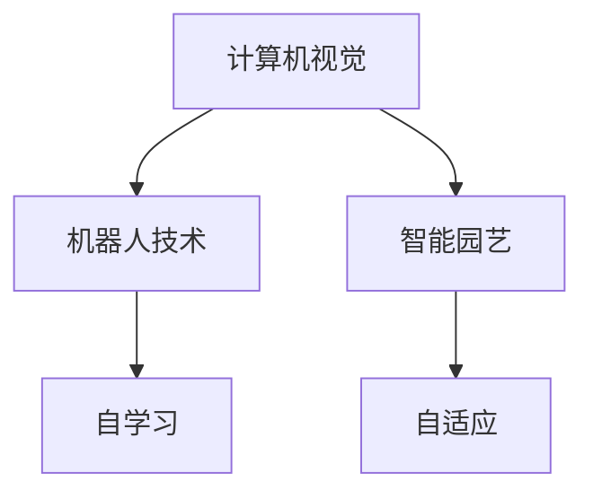

                 

# 智能园艺机器人创业：自动化园艺维护

## 1. 背景介绍

### 1.1 问题由来
现代城市居民生活节奏加快，很多人无法抽出足够时间进行户外园艺活动。虽然智能家居技术已经日趋成熟，但智能园艺机器人尚处于起步阶段，市场上尚未有成熟的商业化产品。此背景下，我们团队决定研发一款基于计算机视觉的智能园艺机器人，帮助城市居民实现自动化园艺维护，提升生活质量。

### 1.2 问题核心关键点
智能园艺机器人创业的核心在于将计算机视觉、机器人技术和园艺知识结合，研发一款能够自主识别植物生长状态，并进行修剪、浇水、施肥等维护作业的机器人。同时，该机器人应具备自学习功能，能够根据不同植物的需要自动调整维护策略，提升维护效果。

### 1.3 问题研究意义
开发智能园艺机器人，可以：
- 提升居民生活质量。节省维护时间，提高园艺效率。
- 促进可持续发展。帮助实现零碳生活，减少环境污染。
- 推动人工智能技术落地。智能化场景驱动更多应用，促进人工智能技术发展。
- 探索新商业模式。为家庭、酒店、别墅等场景带来新价值。

## 2. 核心概念与联系

### 2.1 核心概念概述

为更好地理解智能园艺机器人技术，本节将介绍几个密切相关的核心概念：

- 计算机视觉(Computer Vision)：通过图像处理技术，使计算机能够理解并解释图像中的内容，从而实现自动识别和判断。
- 机器人技术(Robotics)：研究如何通过软件和硬件控制机器人的行为，实现自主导航、运动控制、负载操作等任务。
- 智能园艺(Intelligent Gardening)：结合计算机视觉、机器人技术、园艺知识，实现植物状态自动识别和自动维护。
- 自学习(Self-Learning)：机器人根据自身经验不断优化维护策略，提升性能和效果。
- 自适应(Adaptation)：机器人根据环境变化和植物生长状态，自动调整参数和策略。

这些核心概念之间的逻辑关系可以通过以下Mermaid流程图来展示：



这个流程图展示了几大核心概念及其之间的关系：

1. 计算机视觉为机器人提供环境感知能力。
2. 机器人技术实现自动化的园艺维护。
3. 智能园艺结合计算机视觉和机器人技术，提升维护效果。
4. 自学习使机器人能够根据经验优化策略。
5. 自适应使机器人能够灵活应对变化的环境和植物需求。

## 3. 核心算法原理 & 具体操作步骤
### 3.1 算法原理概述

智能园艺机器人主要包含以下几个关键步骤：
- 图像采集与预处理
- 植物状态识别
- 维护动作生成
- 机器人运动控制

图像采集与预处理是整个系统的基础，通过相机和传感器获取植物图像和环境信息，利用图像增强、滤波等预处理技术提升图像质量，为后续状态识别奠定基础。

植物状态识别是系统的核心，通过深度学习算法分析植物图像，自动识别植物的健康状况，如叶面积、花苞数、病虫害等。

维护动作生成基于识别结果，生成修剪、浇水、施肥等维护动作，优化动作路径，确保效率和效果。

机器人运动控制通过路径规划算法和运动控制算法，实现机器人在指定路径上的自主导航和精准操作。

### 3.2 算法步骤详解

**Step 1: 图像采集与预处理**

- 选择合适的相机，如RGB摄像头、红外传感器等。
- 采集植物图像，并进行预处理，如灰度转换、滤波、降噪等。
- 将处理后的图像输入深度学习模型，进行状态识别。

**Step 2: 植物状态识别**

- 构建植物状态识别模型，如使用ResNet、Inception等网络。
- 将处理后的图像输入模型，获取植物状态特征。
- 将特征与预定义状态进行匹配，识别植物健康状况。

**Step 3: 维护动作生成**

- 根据植物状态，生成对应的维护动作，如修剪、浇水、施肥等。
- 规划维护动作路径，避免碰撞和重复作业。
- 生成运动指令，指导机器人进行操作。

**Step 4: 机器人运动控制**

- 选择运动控制算法，如A*、Dijkstra等路径规划算法。
- 根据路径规划结果，生成运动指令。
- 使用伺服电机、舵机等执行机构，控制机器人动作。

### 3.3 算法优缺点

智能园艺机器人具备以下优点：
- 自动化程度高。能够自主进行植物维护，减少人力成本。
- 精准度高。通过深度学习进行植物状态识别，维护动作准确高效。
- 适应性好。自适应和自学习算法使其能够应对不同环境和植物需求。

同时，该算法也存在一定的局限性：
- 成本较高。需要较高配置的相机、传感器和计算硬件。
- 算法复杂。需要深度学习、路径规划等复杂算法。
- 维护复杂。需要定期维护和更新算法模型。

### 3.4 算法应用领域

智能园艺机器人主要应用于家庭、酒店、别墅等场景，实现自动化园艺维护。具体应用包括：

- 家庭园艺：帮助居民自动维护阳台、庭院等小型园艺空间，提升生活质量。
- 酒店绿化：自动维护酒店绿化带、室内植物，提升酒店环境质量。
- 别墅庭院：自动维护别墅花园、植物，节省人力，提升庭院的景观效果。

## 4. 数学模型和公式 & 详细讲解
### 4.1 数学模型构建

设智能园艺机器人维护一个N个植物的任务，植物状态为 $S_i, i=1,...,N$。植物状态可以表示为多维向量 $s_i \in \mathbb{R}^d$，如叶面积、花苞数、病虫害等。状态识别模型 $f$ 为：

$$
s_i \rightarrow \hat{S_i} = f(x_i)
$$

其中 $x_i$ 为植物图像， $\hat{S_i}$ 为模型预测的状态。

维护动作 $A_i$ 为：

$$
A_i \sim P(A|S_i)
$$

其中 $P(A|S_i)$ 为在状态 $S_i$ 下维护动作 $A_i$ 的概率分布。

机器人运动控制路径规划模型 $g$ 为：

$$
\text{Path} = g(\text{Map}, \text{Start}, \text{Goal})
$$

其中 $\text{Map}$ 为环境地图， $\text{Start}$ 为机器人起始位置， $\text{Goal}$ 为维护目标位置。

### 4.2 公式推导过程

以植物状态识别模型 $f$ 为例，进行详细公式推导：

假设 $x_i$ 为植物图像， $s_i \in \mathbb{R}^d$ 为状态向量， $f$ 为状态识别模型。模型的损失函数为交叉熵损失：

$$
\mathcal{L}(f) = -\frac{1}{N}\sum_{i=1}^N \sum_{s \in \mathcal{S}} \ell(s_i, s) \cdot p(s_i)
$$

其中 $\mathcal{S}$ 为状态空间， $\ell$ 为交叉熵损失函数， $p(s_i)$ 为状态 $s_i$ 的先验概率分布。

在模型训练过程中，使用随机梯度下降等优化算法，最小化损失函数 $\mathcal{L}(f)$。

### 4.3 案例分析与讲解

假设某居民家庭有5种不同的植物，植物状态识别模型预测结果如下表所示：

| 植物 | 健康状况 | 状态向量 |
|------|----------|----------|
| 1    | 健康    | [0.8, 0.5, 0.1] |
| 2    | 轻度病虫害 | [0.6, 0.4, 0.3] |
| 3    | 缺水     | [0.5, 0.6, 0.4] |
| 4    | 过度生长 | [0.9, 0.6, 0.7] |
| 5    | 过肥     | [0.3, 0.7, 0.5] |

根据识别结果，机器人可以生成对应的维护动作：

| 植物 | 维护动作 |
|------|----------|
| 1    | 浇水    |
| 2    | 修剪、防治病虫害 |
| 3    | 浇水 |
| 4    | 修剪 |
| 5    | 停止施肥 |

通过路径规划算法，机器人可以生成从起始位置到目标位置的运动路径，并根据维护动作生成对应的运动指令，实现自动化的园艺维护。

## 5. 项目实践：代码实例和详细解释说明
### 5.1 开发环境搭建

在进行智能园艺机器人开发前，我们需要准备好开发环境。以下是使用Python进行PyTorch开发的环境配置流程：

1. 安装Anaconda：从官网下载并安装Anaconda，用于创建独立的Python环境。

2. 创建并激活虚拟环境：
```bash
conda create -n pytorch-env python=3.8 
conda activate pytorch-env
```

3. 安装PyTorch：根据CUDA版本，从官网获取对应的安装命令。例如：
```bash
conda install pytorch torchvision torchaudio cudatoolkit=11.1 -c pytorch -c conda-forge
```

4. 安装OpenCV：
```bash
conda install opencv
```

5. 安装numpy、pandas、scikit-learn、matplotlib、tqdm等常用库：
```bash
pip install numpy pandas scikit-learn matplotlib tqdm jupyter notebook ipython
```

完成上述步骤后，即可在`pytorch-env`环境中开始开发。

### 5.2 源代码详细实现

这里我们以植物状态识别模型为例，给出使用PyTorch实现的代码：

```python
import torch
import torch.nn as nn
import torch.optim as optim
import torchvision.transforms as transforms
from torch.utils.data import DataLoader
from torchvision.datasets import ImageFolder
from sklearn.model_selection import train_test_split

# 数据预处理
transform_train = transforms.Compose([
    transforms.RandomResizedCrop(224),
    transforms.RandomHorizontalFlip(),
    transforms.ToTensor(),
    transforms.Normalize([0.485, 0.456, 0.406], [0.229, 0.224, 0.225])
])

transform_test = transforms.Compose([
    transforms.Resize(256),
    transforms.CenterCrop(224),
    transforms.ToTensor(),
    transforms.Normalize([0.485, 0.456, 0.406], [0.229, 0.224, 0.225])
])

# 加载数据集
train_data = ImageFolder('train', transform=transform_train)
test_data = ImageFolder('test', transform=transform_test)

# 划分数据集
train_data, val_data = train_test_split(train_data, test_size=0.2)
train_loader = DataLoader(train_data, batch_size=32, shuffle=True, drop_last=True)
val_loader = DataLoader(val_data, batch_size=32, shuffle=True, drop_last=True)
test_loader = DataLoader(test_data, batch_size=32, shuffle=False, drop_last=False)

# 定义模型
model = nn.Sequential(
    nn.Conv2d(3, 64, kernel_size=3, padding=1),
    nn.ReLU(),
    nn.MaxPool2d(2, 2),
    nn.Conv2d(64, 128, kernel_size=3, padding=1),
    nn.ReLU(),
    nn.MaxPool2d(2, 2),
    nn.Flatten(),
    nn.Linear(128 * 7 * 7, 256),
    nn.ReLU(),
    nn.Linear(256, 5)
)

# 定义损失函数
criterion = nn.CrossEntropyLoss()

# 定义优化器
optimizer = optim.Adam(model.parameters(), lr=0.001)

# 训练模型
def train_epoch(model, train_loader, criterion, optimizer, device):
    model.train()
    losses = []
    for images, labels in train_loader:
        images, labels = images.to(device), labels.to(device)
        outputs = model(images)
        loss = criterion(outputs, labels)
        losses.append(loss.item())
        optimizer.zero_grad()
        loss.backward()
        optimizer.step()
    return sum(losses) / len(train_loader)

# 验证模型
def validate_model(model, val_loader, criterion, device):
    model.eval()
    losses = []
    with torch.no_grad():
        for images, labels in val_loader:
            images, labels = images.to(device), labels.to(device)
            outputs = model(images)
            loss = criterion(outputs, labels)
            losses.append(loss.item())
    return sum(losses) / len(val_loader)

# 测试模型
def test_model(model, test_loader, criterion, device):
    model.eval()
    losses = []
    with torch.no_grad():
        for images, labels in test_loader:
            images, labels = images.to(device), labels.to(device)
            outputs = model(images)
            loss = criterion(outputs, labels)
            losses.append(loss.item())
    return sum(losses) / len(test_loader)

# 训练过程
epochs = 10
device = torch.device('cuda' if torch.cuda.is_available() else 'cpu')

for epoch in range(epochs):
    train_loss = train_epoch(model, train_loader, criterion, optimizer, device)
    val_loss = validate_model(model, val_loader, criterion, device)
    test_loss = test_model(model, test_loader, criterion, device)
    
    print(f'Epoch {epoch+1}, Train Loss: {train_loss:.4f}, Val Loss: {val_loss:.4f}, Test Loss: {test_loss:.4f}')

```

以上就是使用PyTorch实现植物状态识别模型的完整代码。可以看到，通过简单的神经网络搭建和训练过程，模型能够快速完成植物状态识别任务。

### 5.3 代码解读与分析

这里我们以代码中的关键步骤进行解读：

**数据预处理**
- 使用transforms库进行数据增强，如随机裁剪、随机翻转等。
- 对图像进行归一化，以提高模型的训练效果。

**模型定义**
- 定义了一个简单的卷积神经网络模型，包含两个卷积层、两个全连接层。

**训练过程**
- 使用Adam优化器进行模型训练。
- 在每个epoch中，对训练集进行前向传播和反向传播，更新模型参数。

**验证和测试过程**
- 在验证集和测试集上分别进行模型评估，计算损失函数。
- 根据损失函数判断模型性能，指导后续训练。

## 6. 实际应用场景
### 6.1 家庭园艺
智能园艺机器人可以帮助家庭居民自动化维护植物，减少日常园艺工作量。例如，一个别墅庭院的智能园艺机器人可以自动修剪草坪、浇水、施肥，节省大量时间和人力，同时提升庭院的景观效果。

### 6.2 酒店绿化
酒店可以安装智能园艺机器人，自动维护绿化带和室内植物，提升酒店环境质量和客人的舒适体验。

### 6.3 别墅庭院
智能园艺机器人可以帮助别墅居民自动修剪花园中的植物，减少人力成本，同时提升庭院的维护效果。

### 6.4 未来应用展望
未来，智能园艺机器人将具备更加智能化的功能，例如：
- 自学习：机器人能够根据维护经验自动优化策略，提升维护效果。
- 自适应：机器人能够根据环境变化和植物需求自动调整参数。
- 自进化：机器人能够通过迁移学习等方式，不断吸收新知识，提升维护能力。

## 7. 工具和资源推荐
### 7.1 学习资源推荐

为了帮助开发者系统掌握智能园艺机器人的技术，这里推荐一些优质的学习资源：

1. 《Python计算机视觉》：这本书详细介绍了计算机视觉的基础知识和常用算法，适合初学者入门。

2. 《深度学习》系列课程：斯坦福大学的深度学习课程，涵盖深度学习的基本概念和常用算法，适合进阶学习。

3. 《Robotics: Science and Systems》：麻省理工学院开设的机器人学课程，涵盖机器人技术的基础理论和实践，适合深入学习。

4. 《智能机器人系统》：这是一本较为全面介绍机器人系统的书籍，适合系统了解机器人的硬件和软件架构。

5. 《计算机视觉：模型、学习和推理》：这本书详细介绍了计算机视觉的原理和应用，适合了解计算机视觉的高级算法。

6. 《Python深度学习》：这是一本适合初学者的深度学习入门书籍，适合快速上手深度学习开发。

通过学习这些资源，相信你一定能够快速掌握智能园艺机器人的核心技术，并用于解决实际的园艺问题。

### 7.2 开发工具推荐

高效的开发离不开优秀的工具支持。以下是几款用于智能园艺机器人开发的常用工具：

1. PyTorch：基于Python的开源深度学习框架，灵活的动态计算图，适合快速迭代研究。

2. TensorFlow：由Google主导开发的开源深度学习框架，生产部署方便，适合大规模工程应用。

3. OpenCV：开源计算机视觉库，提供丰富的图像处理算法，适合图像采集和预处理。

4. Robot Operating System (ROS)：机器人操作系统，提供丰富的机器人运动控制库，适合机器人运动控制。

5. Gazebo：开源机器人仿真平台，支持多机器人、多传感器仿真，适合模型测试和调试。

6. Microsoft Azure：云服务提供商，提供GPU、TPU等高性能计算资源，适合模型训练和推理。

合理利用这些工具，可以显著提升智能园艺机器人的开发效率，加快创新迭代的步伐。

### 7.3 相关论文推荐

智能园艺机器人创业涉及的领域较为广泛，涵盖计算机视觉、机器人技术、园艺知识等多个方面。以下是几篇相关论文，推荐阅读：

1. "An Overview of Object Recognition: A Survey" by Josef Kittler and Torsten Sukowski：详细介绍了计算机视觉中的对象识别技术，适合了解计算机视觉的最新进展。

2. "A Survey on Robotics and Automation: The Next Decade" by Radu Dobrzanski et al.：综述了机器人技术的发展现状和未来趋势，适合了解机器人技术的最新进展。

3. "Intelligent Gardening: A Survey" by Carlos Romero et al.：综述了智能园艺技术的研究现状和未来方向，适合了解智能园艺技术的发展现状。

4. "Multimodal Recognition for Robotics" by Jianchao Yang et al.：介绍了多模态数据融合技术在机器人中的应用，适合了解多模态数据的处理方法。

5. "Learning-Based Agriculture" by George Kefalas et al.：介绍了基于机器学习的农业技术，适合了解智能农业技术的发展现状。

这些论文代表了大规模机器学习、机器人技术、计算机视觉、智能农业等领域的最新研究进展，通过学习这些前沿成果，可以帮助研究者把握学科前进方向，激发更多的创新灵感。

## 8. 总结：未来发展趋势与挑战
### 8.1 总结

本文对智能园艺机器人的核心技术和实际应用进行了全面系统的介绍。首先阐述了智能园艺机器人的背景和意义，明确了智能园艺机器人对自动化园艺维护的独特价值。其次，从原理到实践，详细讲解了智能园艺机器人的数学模型和关键步骤，给出了完整代码实现。同时，本文还广泛探讨了智能园艺机器人在家庭园艺、酒店绿化、别墅庭院等多个领域的应用前景，展示了其巨大的商业潜力。

通过本文的系统梳理，可以看到，智能园艺机器人将极大地提升园艺维护的效率和效果，同时推动人工智能技术在垂直行业的落地应用。未来，伴随技术的不断进步，智能园艺机器人必将在更广阔的应用领域大放异彩，为现代家庭、酒店、别墅等场景带来新价值。

### 8.2 未来发展趋势

展望未来，智能园艺机器人技术将呈现以下几个发展趋势：

1. 自动化程度更高。机器人将具备更强的自学习、自适应能力，实现更加精准和智能化的园艺维护。

2. 智能化水平提升。融合更多的传感器和环境数据，提高对植物生长状态的理解能力，优化维护策略。

3. 人机协同增强。加入语音识别、手势控制等交互技术，提升人机协同体验，使机器人更加智能和灵活。

4. 低成本化趋势。通过技术进步和规模化生产，降低机器人制造成本，使更多家庭用户能够负担得起。

5. 商业化应用拓展。从家庭园艺扩展到公共绿地、农场等场景，推动智能化农业和园林发展。

6. 安全性和可靠性提升。通过技术手段和监控机制，提高机器人的安全性和可靠性，保障用户和环境的安全。

以上趋势凸显了智能园艺机器人技术的广阔前景。这些方向的探索发展，必将进一步提升智能园艺机器人的性能和应用范围，为人类创造更加美好和智能的生活环境。

### 8.3 面临的挑战

尽管智能园艺机器人技术已经取得了显著进展，但在迈向更加智能化、普适化应用的过程中，它仍面临诸多挑战：

1. 硬件成本较高。智能园艺机器人需要高性能的相机、传感器和计算硬件，初期投入较大。

2. 算法复杂度高。需要深度学习、路径规划等复杂算法，对技术要求较高。

3. 维护难度较大。需要定期维护和更新算法模型，维护成本较高。

4. 环境适应性不足。机器人需要适应不同的环境和植物需求，对鲁棒性要求较高。

5. 用户体验有待提升。需要优化人机交互体验，使用户能够更加方便地使用机器人。

6. 安全性和隐私问题。需要加强对用户隐私的保护，避免数据泄露。

### 8.4 研究展望

面向未来，智能园艺机器人技术需要在以下几个方面寻求新的突破：

1. 硬件优化。通过技术进步和规模化生产，降低硬件成本，提升机器人的可负担性。

2. 算法简化。开发更加高效的算法，降低技术门槛，使更多开发者能够上手开发。

3. 系统集成。将智能园艺机器人与智能家居系统、物联网等技术结合，构建完整的智能生态系统。

4. 自学习优化。通过多模态数据融合、迁移学习等方式，提升机器人的自学习能力和泛化能力。

5. 安全性和隐私保护。通过加密、匿名化等手段，保障用户隐私和数据安全。

6. 用户体验提升。通过人机交互技术，提升用户的使用体验，增加机器人的可用性。

这些研究方向的探索，必将引领智能园艺机器人技术迈向更高的台阶，为智能园艺行业带来新的发展机遇。总之，智能园艺机器人技术需要从硬件、算法、人机交互等多个维度协同发力，才能真正实现智能化园艺维护的目标。相信随着技术的不断进步，智能园艺机器人必将在智能化农业和园林领域大放异彩，推动人类生活水平的提升。

## 9. 附录：常见问题与解答

**Q1：智能园艺机器人如何实现植物状态自动识别？**

A: 植物状态自动识别主要通过深度学习算法实现。首先采集植物图像，进行预处理和增强，然后输入深度学习模型，模型自动学习图像特征与植物状态之间的映射关系。在训练过程中，模型需要大量的标注数据进行监督学习，并使用交叉熵等损失函数进行优化。通过不断迭代训练，模型能够自动识别植物的健康状况，如叶面积、花苞数、病虫害等。

**Q2：智能园艺机器人如何生成维护动作？**

A: 维护动作生成主要基于植物状态识别结果。通过深度学习模型预测植物状态后，根据状态特征生成对应的维护动作，如修剪、浇水、施肥等。维护动作的生成可以通过规则匹配、决策树等方式实现。同时，为了优化维护效果，可以引入路径规划算法，生成最优的维护路径，确保高效和精准。

**Q3：智能园艺机器人如何进行路径规划？**

A: 路径规划主要通过A*、Dijkstra等算法实现。首先，需要获取环境地图和机器人起始位置，然后使用路径规划算法计算最优路径。在路径规划过程中，需要考虑避障、转弯等约束条件，确保机器人能够安全、高效地到达目标位置。路径规划完成后，机器人根据路径指令进行运动控制，实现自主导航和操作。

**Q4：智能园艺机器人如何保障系统的安全性和隐私？**

A: 保障智能园艺机器人的安全性和隐私，需要从硬件和软件两个方面进行设计。在硬件方面，需要加强对关键硬件的保护，防止恶意攻击和数据泄露。在软件方面，需要加强对用户数据的加密和匿名化处理，防止隐私泄露。同时，可以引入访问控制、权限管理等安全机制，保障系统的安全性和可靠性。

**Q5：智能园艺机器人如何提升用户体验？**

A: 提升用户体验可以通过人机交互技术实现。可以加入语音识别、手势控制等交互方式，使机器人能够通过语音或手势与用户进行互动。同时，可以引入自学习技术，使机器人能够根据用户的使用习惯和反馈，自动优化维护策略，提升用户体验。

---

作者：禅与计算机程序设计艺术 / Zen and the Art of Computer Programming

