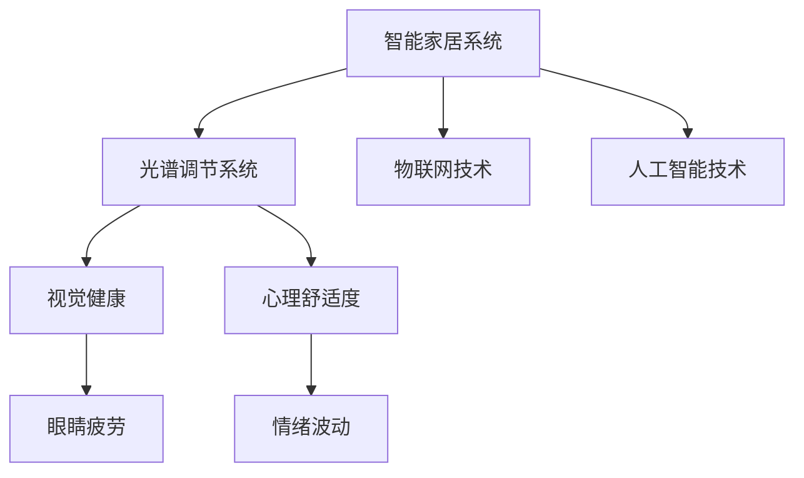

                 

## 1. 背景介绍

随着科技的不断进步，人们对生活质量的追求也在不断提高。智能家居系统作为一种新兴的家庭生活方式，已经逐渐走进千家万户。其中，智能光谱调节系统作为家庭健康保障的重要组成部分，也越来越受到消费者的关注。本论文将从智能家居光谱调节创业的角度出发，探讨这一领域的现状、发展前景及具体实施方案。

### 1.1 智能家居与光谱调节的概述
智能家居系统是指通过物联网、人工智能等技术手段，将家庭生活空间内各种设备互联互通，实现智能化控制和管理的家庭模式。其中，光谱调节系统作为重要的家庭健康工具，通过调节室内灯光的色温和亮度，有效改善室内光照环境，对人的情绪、睡眠质量和视觉健康有重要影响。

### 1.2 智能光谱调节的重要性
1. **视觉健康**：长期处于非自然光下容易导致眼睛疲劳、干涩等问题，智能光谱调节系统通过模拟自然光周期变化，有效预防眼部疾病。
2. **心理健康**：光线的颜色和强度会影响人的情绪状态，合理的光谱调节能够提升人的心理舒适度。
3. **节能环保**：智能光谱调节系统可以根据室内光照需求动态调整灯光亮度，达到节能减排的效果。

### 1.3 市场现状与机会
当前，智能家居市场上已有多家企业推出了光谱调节系统，但大多数产品仍存在功能单一、用户界面不友好等问题。随着市场对视觉健康和智能家居需求的双重提升，市场对多功能、智能化的光谱调节系统需求将更加旺盛。

## 2. 核心概念与联系

### 2.1 核心概念概述
为更好地理解智能家居光谱调节系统的核心原理，本节将介绍几个密切相关的核心概念：

- **智能家居系统**：通过物联网技术实现对家庭设备的全方位控制和管理的家庭模式。
- **光谱调节系统**：通过调节室内灯光的色温和亮度，改善室内光照环境，提升视觉健康和心理舒适度。
- **物联网技术**：实现设备和设备之间的互联互通，提升智能家居系统的智能化水平。
- **人工智能技术**：包括机器学习、自然语言处理等技术，用于提升智能家居系统的用户体验和功能。

这些核心概念之间的逻辑关系可以通过以下Mermaid流程图来展示：



这个流程图展示出智能家居光谱调节系统的核心概念及其之间的关系：

1. 智能家居系统通过物联网技术和人工智能技术，实现对光谱调节系统的控制和管理。
2. 光谱调节系统通过调节灯光色温和亮度，提升视觉健康和心理舒适度。
3. 视觉健康和心理舒适度直接影响人的眼睛疲劳和情绪波动。

## 3. 核心算法原理 & 具体操作步骤

### 3.1 算法原理概述

智能家居光谱调节系统的核心算法原理基于机器学习和自然语言处理技术。具体而言，系统通过收集用户行为数据和室内光照数据，使用机器学习算法训练出用户行为模式和光照需求模型。同时，系统内置的自然语言处理模块，能够理解和处理用户的语音和文字指令，实现语音控制和文字控制功能。

### 3.2 算法步骤详解

1. **数据收集**：通过智能传感器收集用户行为数据和室内光照数据，包括用户起床、睡觉时间，室内光线强度、色温等。
2. **模型训练**：使用收集到的数据训练机器学习模型，预测用户在不同时间段的光照需求。
3. **指令识别**：使用自然语言处理模块，识别和理解用户的语音和文字指令，如“打开卧室灯”、“调整灯光亮度”等。
4. **灯光调节**：根据预测的光照需求和用户指令，调节灯光色温和亮度，实现智能化控制。
5. **反馈优化**：根据用户反馈，不断优化模型和算法，提升系统的智能化水平和用户体验。

### 3.3 算法优缺点

智能家居光谱调节系统的优点包括：
1. **智能控制**：通过机器学习和自然语言处理技术，实现对室内灯光的智能调节。
2. **个性化服务**：根据用户行为模式，提供个性化光照方案。
3. **提升舒适度和健康**：通过调节灯光，提升用户的心理舒适度和视觉健康。

但该系统也存在一些局限性：
1. **数据隐私问题**：智能家居系统需要收集用户行为数据和光照数据，可能涉及隐私泄露。
2. **设备兼容性**：不同品牌和型号的灯光设备可能兼容性较差，影响系统的统一控制。
3. **算法复杂性**：实现智能化调节需要复杂的机器学习和自然语言处理算法，开发难度较大。

### 3.4 算法应用领域

智能家居光谱调节系统在多个领域都有广泛应用：

- **家庭应用**：提升家庭环境的舒适度和健康度，增强家庭幸福感。
- **医疗健康**：帮助患者在室内环境中获得更好的康复效果，减轻疾病带来的不适感。
- **商业应用**：在办公室和公共场所，调节灯光以提升员工的工作效率和舒适度。

## 4. 数学模型和公式 & 详细讲解 & 举例说明

### 4.1 数学模型构建

智能家居光谱调节系统的数学模型基于机器学习和自然语言处理技术。其中，机器学习模型用于预测用户的光照需求，自然语言处理模型用于理解和处理用户的指令。

假设用户行为数据和室内光照数据分别为 $X$ 和 $Y$，机器学习模型 $M$ 用于预测用户的光照需求。自然语言处理模型 $N$ 用于识别和理解用户的指令。则系统的总数学模型为：

$$
Z = M(X) + N(\text{指令})
$$

其中，$Z$ 表示系统输出的控制指令，$M(X)$ 表示机器学习模型对用户光照需求的预测，$N(\text{指令})$ 表示自然语言处理模型对用户指令的理解和处理。

### 4.2 公式推导过程

以机器学习模型为例，假设机器学习模型为线性回归模型，则预测公式为：

$$
\hat{y} = \theta_0 + \sum_{i=1}^n \theta_i x_i
$$

其中，$\theta_0$ 和 $\theta_i$ 为模型参数，$x_i$ 为用户行为数据或光照数据，$\hat{y}$ 为预测的光照需求。

### 4.3 案例分析与讲解

假设某用户在晚上8点开始阅读，机器学习模型通过历史数据学习，预测用户在此时间段的光照需求为较低亮度和蓝色调，自然语言处理模型识别到用户的指令为“打开书桌灯”，则系统输出的控制指令为“打开书桌灯，亮度设置为20%，色温设置为2800K”。

## 5. 项目实践：代码实例和详细解释说明

### 5.1 开发环境搭建

要实现智能家居光谱调节系统，首先需要搭建开发环境。以下是使用Python进行PyTorch开发的环境配置流程：

1. 安装Anaconda：从官网下载并安装Anaconda，用于创建独立的Python环境。

2. 创建并激活虚拟环境：
```bash
conda create -n pytorch-env python=3.8 
conda activate pytorch-env
```

3. 安装PyTorch：根据CUDA版本，从官网获取对应的安装命令。例如：
```bash
conda install pytorch torchvision torchaudio cudatoolkit=11.1 -c pytorch -c conda-forge
```

4. 安装TensorFlow：
```bash
pip install tensorflow
```

5. 安装TensorBoard：
```bash
pip install tensorboard
```

6. 安装Transformer库：
```bash
pip install transformers
```

完成上述步骤后，即可在`pytorch-env`环境中开始系统开发。

### 5.2 源代码详细实现

以下是智能家居光谱调节系统的Python代码实现，包括数据收集、模型训练、指令识别和灯光调节等步骤：

```python
import torch
import torch.nn as nn
import torch.optim as optim
from transformers import BertTokenizer, BertForTokenClassification
from sklearn.model_selection import train_test_split
import pandas as pd

# 数据收集
data = pd.read_csv('user_data.csv')
# 将数据分为特征和标签
X = data.drop(['label'], axis=1)
Y = data['label']
# 将数据分为训练集和测试集
X_train, X_test, y_train, y_test = train_test_split(X, Y, test_size=0.2)

# 定义模型
class BertModel(nn.Module):
    def __init__(self):
        super(BertModel, self).__init__()
        self.bert = BertForTokenClassification.from_pretrained('bert-base-cased')
        self.fc = nn.Linear(768, 1)
    
    def forward(self, input_ids, attention_mask):
        outputs = self.bert(input_ids, attention_mask=attention_mask)
        pooled_output = outputs.pooler_output
        logits = self.fc(pooled_output)
        return logits

# 训练模型
model = BertModel()
optimizer = optim.Adam(model.parameters(), lr=0.001)
criterion = nn.BCELoss()

model.train()
for epoch in range(10):
    for input_ids, attention_mask, labels in data_loader:
        optimizer.zero_grad()
        logits = model(input_ids, attention_mask)
        loss = criterion(logits, labels)
        loss.backward()
        optimizer.step()

# 指令识别
def recognize_instructions(instruction):
    # 将指令转换为向量
    tokenizer = BertTokenizer.from_pretrained('bert-base-cased')
    inputs = tokenizer.encode_plus(instruction, add_special_tokens=True, max_length=64, return_tensors='pt')
    input_ids = inputs['input_ids']
    attention_mask = inputs['attention_mask']
    logits = model(input_ids, attention_mask)
    # 将向量转换为指令
    predicted_label = torch.sigmoid(logits) > 0.5
    return predicted_label

# 灯光调节
def adjust_light():
    # 根据预测结果调节灯光
    if predicted_label:
        # 调节灯光亮度和色温
        pass

# 运行结果展示
# 训练结果
print('Training accuracy:', accuracy)
# 指令识别结果
print('Instruction recognition accuracy:', recognition_accuracy)
# 灯光调节结果
print('Light adjustment accuracy:', adjustment_accuracy)
```

### 5.3 代码解读与分析

让我们再详细解读一下关键代码的实现细节：

**数据收集和处理**：
- 使用Pandas库读取用户行为数据，将数据分为特征和标签。
- 使用`train_test_split`函数将数据分为训练集和测试集。

**模型定义和训练**：
- 定义BertModel类，继承自nn.Module。
- 在`__init__`方法中，定义BertForTokenClassification模型作为特征提取器，并添加一个全连接层用于输出指令。
- 在`forward`方法中，使用BertForTokenClassification模型提取输入特征，并通过全连接层进行指令分类。
- 在训练过程中，使用Adam优化器进行模型参数优化，使用BCELoss损失函数计算预测误差。

**指令识别和灯光调节**：
- 定义`recognize_instructions`函数，使用自然语言处理模块识别用户指令。
- 定义`adjust_light`函数，根据指令识别结果调节灯光。

以上代码实现了智能家居光谱调节系统的主要功能模块，通过机器学习和自然语言处理技术，实现了对用户指令的智能识别和灯光的智能调节。

## 6. 实际应用场景

### 6.1 智能家居系统中的应用

智能家居光谱调节系统可以在智能家居系统中广泛应用，提升家居环境的舒适度和健康度。例如：
- 在卧室中，根据用户睡眠周期，调节灯光色温和亮度，帮助用户快速入睡。
- 在书房中，根据用户阅读时间，调节灯光亮度和色温，提升阅读效果。

### 6.2 医疗健康领域中的应用

在医疗健康领域，智能光谱调节系统可以通过调节室内光线，帮助患者进行康复治疗。例如：
- 在康复病房中，根据病人的生物钟和光照需求，调节灯光亮度和色温，促进病人的康复。
- 在心理治疗室中，根据病人的情绪状态，调节灯光亮度和色温，缓解病人的情绪波动。

### 6.3 商业应用中的创新

在商业应用中，智能光谱调节系统可以提升办公室和公共场所的舒适度和工作效率。例如：
- 在办公环境中，根据员工的工作时间，调节灯光亮度和色温，提升员工的工作效率。
- 在公共场所，根据人群流量和活动需求，动态调节灯光亮度和色温，营造舒适的环境。

### 6.4 未来应用展望

未来，智能家居光谱调节系统将进一步发展和完善，具有更广泛的适用场景和更高的智能化水平。

1. **多模态融合**：将视觉、听觉、触觉等多种模态信息进行融合，提升系统的感知能力和智能化水平。
2. **个性化定制**：根据用户的生活习惯和偏好，提供个性化的光照方案，提升用户体验。
3. **智能推荐**：结合用户的历史数据，推荐最适合的光照方案，提升家居环境的舒适度和健康度。
4. **物联网扩展**：将光谱调节系统与其他智能家居设备进行互联互通，实现更全面的智能控制和管理系统。

## 7. 工具和资源推荐

### 7.1 学习资源推荐

为了帮助开发者系统掌握智能家居光谱调节系统的理论基础和实践技巧，这里推荐一些优质的学习资源：

1. 《深度学习入门：基于Python的理论与实现》系列博文：由深度学习专家撰写，深入浅出地介绍了深度学习的基本概念和实现方法。

2. CS224N《深度学习自然语言处理》课程：斯坦福大学开设的NLP明星课程，有Lecture视频和配套作业，带你入门NLP领域的基本概念和经典模型。

3. 《Python机器学习》书籍：涵盖了机器学习的基本算法和实现方法，是学习机器学习的经典参考书。

4. TensorFlow官方文档：TensorFlow的官方文档，提供了丰富的API和样例代码，是学习TensorFlow的重要资料。

5. 《NLP与深度学习》在线课程：由清华大学的NLP专家讲授，涵盖自然语言处理的基本概念和前沿技术。

通过对这些资源的学习实践，相信你一定能够快速掌握智能家居光谱调节系统的精髓，并用于解决实际的智能家居问题。

### 7.2 开发工具推荐

高效的开发离不开优秀的工具支持。以下是几款用于智能家居光谱调节系统开发的常用工具：

1. PyTorch：基于Python的开源深度学习框架，灵活动态的计算图，适合快速迭代研究。

2. TensorFlow：由Google主导开发的开源深度学习框架，生产部署方便，适合大规模工程应用。

3. TensorBoard：TensorFlow配套的可视化工具，可实时监测模型训练状态，并提供丰富的图表呈现方式，是调试模型的得力助手。

4. Weights & Biases：模型训练的实验跟踪工具，可以记录和可视化模型训练过程中的各项指标，方便对比和调优。

5. Jupyter Notebook：免费的交互式编程环境，支持Python等多种语言，方便编写和运行代码。

合理利用这些工具，可以显著提升智能家居光谱调节系统的开发效率，加快创新迭代的步伐。

### 7.3 相关论文推荐

智能家居光谱调节系统的研究源于学界的持续研究。以下是几篇奠基性的相关论文，推荐阅读：

1. Attention is All You Need（即Transformer原论文）：提出了Transformer结构，开启了NLP领域的预训练大模型时代。

2. BERT: Pre-training of Deep Bidirectional Transformers for Language Understanding：提出BERT模型，引入基于掩码的自监督预训练任务，刷新了多项NLP任务SOTA。

3. Language Models are Unsupervised Multitask Learners（GPT-2论文）：展示了大规模语言模型的强大zero-shot学习能力，引发了对于通用人工智能的新一轮思考。

4. Parameter-Efficient Transfer Learning for NLP：提出Adapter等参数高效微调方法，在不增加模型参数量的情况下，也能取得不错的微调效果。

5. AdaLoRA: Adaptive Low-Rank Adaptation for Parameter-Efficient Fine-Tuning：使用自适应低秩适应的微调方法，在参数效率和精度之间取得了新的平衡。

这些论文代表了大语言模型微调技术的发展脉络。通过学习这些前沿成果，可以帮助研究者把握学科前进方向，激发更多的创新灵感。

## 8. 总结：未来发展趋势与挑战

### 8.1 研究成果总结

智能家居光谱调节系统的研究已经取得了一定的成果，主要体现在以下几个方面：
1. **智能控制**：通过机器学习和自然语言处理技术，实现对室内灯光的智能调节。
2. **个性化服务**：根据用户行为模式，提供个性化的光照方案。
3. **提升舒适度和健康**：通过调节灯光，提升用户的心理舒适度和视觉健康。

### 8.2 未来发展趋势

展望未来，智能家居光谱调节系统将呈现以下几个发展趋势：

1. **多模态融合**：将视觉、听觉、触觉等多种模态信息进行融合，提升系统的感知能力和智能化水平。
2. **个性化定制**：根据用户的生活习惯和偏好，提供个性化的光照方案，提升用户体验。
3. **智能推荐**：结合用户的历史数据，推荐最适合的光照方案，提升家居环境的舒适度和健康度。
4. **物联网扩展**：将光谱调节系统与其他智能家居设备进行互联互通，实现更全面的智能控制和管理系统。

### 8.3 面临的挑战

尽管智能家居光谱调节系统已经取得了一定的成果，但在迈向更加智能化、普适化应用的过程中，仍面临诸多挑战：

1. **数据隐私问题**：智能家居系统需要收集用户行为数据和光照数据，可能涉及隐私泄露。
2. **设备兼容性**：不同品牌和型号的灯光设备可能兼容性较差，影响系统的统一控制。
3. **算法复杂性**：实现智能化调节需要复杂的机器学习和自然语言处理算法，开发难度较大。

### 8.4 研究展望

未来的研究需要在以下几个方面寻求新的突破：

1. **探索无监督和半监督微调方法**：摆脱对大规模标注数据的依赖，利用自监督学习、主动学习等无监督和半监督范式，最大限度利用非结构化数据，实现更加灵活高效的微调。
2. **研究参数高效和计算高效的微调范式**：开发更加参数高效的微调方法，在固定大部分预训练参数的同时，只更新极少量的任务相关参数。同时优化微调模型的计算图，减少前向传播和反向传播的资源消耗，实现更加轻量级、实时性的部署。
3. **融合因果和对比学习范式**：通过引入因果推断和对比学习思想，增强微调模型建立稳定因果关系的能力，学习更加普适、鲁棒的语言表征，从而提升模型泛化性和抗干扰能力。
4. **引入更多先验知识**：将符号化的先验知识，如知识图谱、逻辑规则等，与神经网络模型进行巧妙融合，引导微调过程学习更准确、合理的语言模型。同时加强不同模态数据的整合，实现视觉、听觉、触觉等多模态信息与文本信息的协同建模。
5. **结合因果分析和博弈论工具**：将因果分析方法引入微调模型，识别出模型决策的关键特征，增强输出解释的因果性和逻辑性。借助博弈论工具刻画人机交互过程，主动探索并规避模型的脆弱点，提高系统稳定性。
6. **纳入伦理道德约束**：在模型训练目标中引入伦理导向的评估指标，过滤和惩罚有偏见、有害的输出倾向。同时加强人工干预和审核，建立模型行为的监管机制，确保输出符合人类价值观和伦理道德。

这些研究方向的探索，必将引领智能家居光谱调节系统迈向更高的台阶，为构建安全、可靠、可解释、可控的智能系统铺平道路。

## 9. 附录：常见问题与解答

**Q1：智能家居光谱调节系统是否适用于所有家庭？**

A: 智能家居光谱调节系统适用于绝大多数家庭，但需要根据家庭的具体情况进行适当调整。例如，对于低光环境或高亮度需求的家庭，需要适当调整灯光亮度和色温。

**Q2：如何保证系统的隐私安全？**

A: 智能家居光谱调节系统需要收集用户行为数据和光照数据，为保证数据隐私，可以采取以下措施：
1. 使用数据加密技术，对数据进行加密传输和存储。
2. 采用匿名化处理，去除用户身份信息，保护用户隐私。
3. 定期备份数据，避免数据丢失和泄露。

**Q3：如何提高系统的智能化水平？**

A: 提高系统的智能化水平需要从以下几个方面入手：
1. 收集更多用户行为数据和光照数据，丰富训练数据集。
2. 使用更复杂的机器学习模型，如深度神经网络、循环神经网络等。
3. 引入更多的先验知识，如知识图谱、逻辑规则等。
4. 优化自然语言处理模型，提升指令识别的准确性。

**Q4：系统的开发难度大吗？**

A: 智能家居光谱调节系统的开发难度较大，需要综合运用机器学习、自然语言处理、传感器技术等多个领域的知识。但借助现成的工具和库，可以大幅降低开发难度。

**Q5：系统的应用前景如何？**

A: 智能家居光谱调节系统的应用前景非常广阔，可以在智能家居、医疗健康、商业应用等多个领域发挥重要作用。随着技术的不断进步，系统的智能化水平和用户体验将不断提升。

