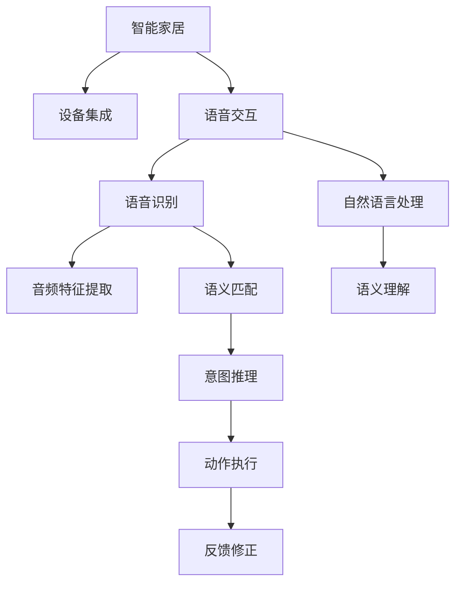

                 

## 1. 背景介绍

随着人工智能技术的快速发展，智能家居成为了新的生活潮流。语音交互作为其中一种便捷、自然的交互方式，逐渐被家庭用户接受和应用。在这一趋势下，智能家居声控创业应运而生。本文将探讨语音交互在智能家居中的应用场景，以及如何通过技术创新提升用户体验和产品竞争力。

### 1.1 语音交互技术发展史

语音交互技术从早期的语音识别、自然语言处理技术逐步发展至今，经历了数个重要的里程碑：

- **1950年代**：最早的语音识别研究，使用模拟电路实现。
- **1980年代**：基于规则的语音识别系统开始应用。
- **2000年代**：统计语言模型、隐马尔可夫模型、神经网络等技术逐步引入，使得语音识别准确率大幅提升。
- **2010年代**：深度学习技术引入，特别是卷积神经网络(CNN)、循环神经网络(RNN)、长短期记忆网络(LSTM)等架构，极大提升了语音识别和语音合成的效果。
- **2020年代**：基于Transformer的大模型(如GPT、BERT等)在语音交互领域开始应用，显著提升了系统的语言理解能力和交互流畅度。

### 1.2 语音交互在智能家居中的应用

智能家居的语音交互应用主要包括：
- **设备控制**：用户通过语音命令控制家中的智能设备，如灯光、空调、窗帘等。
- **信息查询**：用户通过语音查询天气、新闻、音乐等信息。
- **家庭安防**：语音检测和报警，保障家庭安全。
- **智能服务**：语音助手提供日常事务提醒、健康咨询等智能服务。

## 2. 核心概念与联系

### 2.1 核心概念概述

为更好地理解智能家居声控创业，本节将介绍几个核心概念：

- **智能家居(Smart Home)**：通过物联网(IoT)技术，将家中的电器、灯光、安防设备等连接到互联网，实现自动化控制和远程监控。
- **语音交互(Voice Interaction)**：通过语音识别、自然语言处理等技术，实现人与智能设备之间的自然对话。
- **自然语言处理(NLP)**：研究如何使计算机理解和处理人类语言的技术，包括语音识别、文本分析、机器翻译等。
- **深度学习(Deep Learning)**：一种机器学习方法，通过多层神经网络构建复杂模型，实现对语音、图像、文本等数据的深度理解。
- **强化学习(Reinforcement Learning)**：一种通过环境反馈优化策略的机器学习方法，用于提升语音交互系统的决策能力。

这些概念之间相互关联，共同构成了智能家居声控创业的技术基础。

### 2.2 核心概念原理和架构的 Mermaid 流程图



这个流程图展示了大语言模型在智能家居声控创业中的核心工作流程：

1. 智能家居系统集成各类智能设备。
2. 用户通过语音输入信息，进入语音交互模块。
3. 语音识别模块将音频信号转换为文本，进行音频特征提取和预处理。
4. 自然语言处理模块分析语音文本，进行语义理解、意图推理和动作执行。
5. 动作执行模块根据推理结果，控制智能设备进行操作。
6. 系统根据反馈结果，进行修正和优化，提升用户体验。

## 3. 核心算法原理 & 具体操作步骤

### 3.1 算法原理概述

智能家居声控创业的核心算法包括语音识别、自然语言处理、意图推理和动作执行。其中，语音识别和自然语言处理属于NLP领域，意图推理和动作执行则依赖于强化学习等技术。

- **语音识别(ASR, Automatic Speech Recognition)**：将音频信号转换为文本的过程。主要涉及音频特征提取、声学模型、语言模型等技术。
- **自然语言处理(NLP, Natural Language Processing)**：研究如何让计算机理解、处理和生成自然语言。包括词向量、句法分析、语义分析、情感分析等技术。
- **意图推理(Intention Inference)**：理解用户语音背后的意图，进行动作推理。通常使用深度学习模型，如LSTM、Transformer等。
- **动作执行(Action Execution)**：根据意图推理结果，控制智能设备执行相应动作。使用强化学习算法，如Q-learning、Deep Q-Network等。

### 3.2 算法步骤详解

#### 语音识别

1. **音频特征提取**：将输入的语音信号转换为频谱图，提取梅尔频率倒谱系数(MFCC)等特征。
2. **声学模型训练**：使用标注数据训练深度神经网络，如卷积神经网络(CNN)、循环神经网络(RNN)、长短期记忆网络(LSTM)等，学习声学模型。
3. **语言模型训练**：使用大规模无标注文本数据训练语言模型，如n-gram模型、神经网络语言模型(如RNNLM)、Transformer语言模型等。
4. **识别输出**：将输入的音频特征输入到声学模型和语言模型中，使用解码算法如Beam Search，输出文本识别结果。

#### 自然语言处理

1. **词向量表示**：将文本中的词汇转换为向量表示，如Word2Vec、GloVe等。
2. **句法分析**：分析句子结构，识别主语、谓语、宾语等成分，如依存句法分析。
3. **语义分析**：理解句子的语义，如实体识别、情感分析等。
4. **意图推理**：理解用户意图，如意图分类、实体抽取等。

#### 意图推理

1. **意图分类**：将用户输入的句子分类为预设的意图类别，如设备控制、信息查询等。
2. **实体抽取**：识别句中的实体，如设备名称、时间、地点等。
3. **意图匹配**：将用户意图与设备动作映射，如打开电视、播放音乐等。

#### 动作执行

1. **动作规划**：根据意图推理结果，规划动作序列，如先调光灯，再播放音乐。
2. **执行动作**：通过API调用智能设备，执行相应动作，如开关灯光、播放音乐等。
3. **反馈修正**：根据动作执行结果，进行修正和优化，如用户不满意时重试或提示错误。

### 3.3 算法优缺点

#### 语音识别的优缺点

- **优点**：
  - 语音输入自然，无需用户手动操作。
  - 识别速度快，响应及时。
- **缺点**：
  - 语音识别准确率受环境噪音、口音、语速等因素影响较大。
  - 需要大量的语音标注数据进行训练，数据收集成本高。

#### 自然语言处理的优缺点

- **优点**：
  - 能够理解和处理复杂的自然语言，支持多语言处理。
  - 可以用于信息检索、情感分析、机器翻译等应用。
- **缺点**：
  - 处理长句复杂度较高，需要大模型和高计算资源。
  - 依赖高质量的标注数据和模型训练，训练成本较高。

#### 意图推理的优缺点

- **优点**：
  - 能够理解用户意图，减少误操作。
  - 模型可复用性强，可用于多种场景。
- **缺点**：
  - 推理过程复杂，对模型要求较高。
  - 需要大量标注数据，数据标注成本高。

#### 动作执行的优缺点

- **优点**：
  - 执行效率高，响应迅速。
  - 可以实现复杂的多步操作。
- **缺点**：
  - 动作执行的可靠性和安全性需进一步提升。
  - 设备间的通信协议和兼容性需统一。

### 3.4 算法应用领域

语音交互技术已经在智能家居、车载、医疗、零售等多个领域得到广泛应用，以下是几个典型案例：

- **智能家居**：通过语音控制家中的灯光、空调、窗帘等设备，提升家居舒适度和便捷性。
- **车载系统**：通过语音导航、信息查询、设备控制等，提升驾驶安全性，减轻司机负担。
- **医疗系统**：通过语音交互获取病史、医嘱等信息，提升诊疗效率和患者体验。
- **零售系统**：通过语音搜索、购物清单、订单确认等，提升购物便捷性。

## 4. 数学模型和公式 & 详细讲解 & 举例说明

### 4.1 数学模型构建

智能家居声控创业中，涉及多个数学模型，包括语音识别模型、自然语言处理模型和意图推理模型等。以语音识别模型为例，其数学模型为：

$$
\hat{y} = f(x; \theta)
$$

其中 $x$ 表示音频特征，$\theta$ 表示模型参数，$\hat{y}$ 表示预测文本。

### 4.2 公式推导过程

以语音识别中的深度神经网络模型为例，其推导过程如下：

设 $x$ 为输入音频特征，$h_1 = W_1 x + b_1$ 表示第一层隐藏层的输出，$h_2 = \sigma(h_1)$ 表示激活函数，$h_3 = W_2 h_2 + b_2$ 表示第二层隐藏层的输出，$\hat{y} = softmax(h_3)$ 表示softmax函数。

具体推导过程如下：

$$
\begin{aligned}
h_1 &= W_1 x + b_1 \\
h_2 &= \sigma(h_1) \\
h_3 &= W_2 h_2 + b_2 \\
\hat{y} &= softmax(h_3)
\end{aligned}
$$

其中，$W_1, W_2$ 为权重矩阵，$b_1, b_2$ 为偏置向量，$\sigma$ 为激活函数，softmax函数用于将输出映射到概率分布上。

### 4.3 案例分析与讲解

以BERT模型在智能家居声控创业中的应用为例，BERT模型是一种基于Transformer架构的大语言模型。其通过预训练和微调的方式，能够很好地适应特定的语音交互任务。

在智能家居声控创业中，BERT模型可以作为自然语言处理的基础模型，用于意图推理和实体抽取等任务。具体步骤如下：

1. **预训练**：使用大规模无标注文本数据训练BERT模型，学习通用的语言表示。
2. **微调**：使用特定的语音交互任务数据集，对模型进行微调，使其适应特定的任务。
3. **推理**：输入用户语音，通过BERT模型进行语义分析和意图推理，得到用户意图。
4. **执行**：根据推理结果，控制智能设备执行相应动作。

## 5. 项目实践：代码实例和详细解释说明

### 5.1 开发环境搭建

在进行智能家居声控创业的开发前，需要准备好开发环境。以下是使用Python进行TensorFlow开发的环境配置流程：

1. 安装Anaconda：从官网下载并安装Anaconda，用于创建独立的Python环境。

2. 创建并激活虚拟环境：
```bash
conda create -n tf-env python=3.8 
conda activate tf-env
```

3. 安装TensorFlow：根据CUDA版本，从官网获取对应的安装命令。例如：
```bash
conda install tensorflow -c conda-forge -c pytorch
```

4. 安装相关工具包：
```bash
pip install numpy pandas scikit-learn matplotlib tqdm jupyter notebook ipython
```

完成上述步骤后，即可在`tf-env`环境中开始开发实践。

### 5.2 源代码详细实现

下面我们以智能家居声控创业中的语音识别为例，给出使用TensorFlow实现代码。

首先，定义语音识别模型：

```python
import tensorflow as tf

class SpeechRecognition(tf.keras.Model):
    def __init__(self):
        super(SpeechRecognition, self).__init__()
        self.conv1 = tf.keras.layers.Conv2D(32, (3, 3), activation='relu', padding='same')
        self.conv2 = tf.keras.layers.Conv2D(64, (3, 3), activation='relu', padding='same')
        self.pool1 = tf.keras.layers.MaxPooling2D((2, 2))
        self.pool2 = tf.keras.layers.MaxPooling2D((2, 2))
        self.fc1 = tf.keras.layers.Flatten()
        self.fc2 = tf.keras.layers.Dense(128, activation='relu')
        self.fc3 = tf.keras.layers.Dense(10, activation='softmax')
        
    def call(self, inputs):
        x = tf.reshape(inputs, (inputs.shape[0], 400, 80, 1))
        x = self.conv1(x)
        x = self.pool1(x)
        x = self.conv2(x)
        x = self.pool2(x)
        x = self.fc1(x)
        x = self.fc2(x)
        x = self.fc3(x)
        return x

model = SpeechRecognition()
```

然后，定义训练和评估函数：

```python
from tensorflow.keras.datasets import mnist
from tensorflow.keras.utils import to_categorical

(x_train, y_train), (x_test, y_test) = mnist.load_data()

x_train = x_train.reshape(-1, 400, 80, 1)
x_train = x_train / 255.0
x_test = x_test.reshape(-1, 400, 80, 1)
x_test = x_test / 255.0

y_train = to_categorical(y_train)
y_test = to_categorical(y_test)

def train_epoch(model, dataset, batch_size, optimizer):
    for batch in dataset:
        inputs, labels = batch
        with tf.GradientTape() as tape:
            logits = model(inputs)
            loss = tf.keras.losses.sparse_categorical_crossentropy(labels, logits)
        gradients = tape.gradient(loss, model.trainable_variables)
        optimizer.apply_gradients(zip(gradients, model.trainable_variables))
        
def evaluate(model, dataset, batch_size):
    correct_predictions = 0
    for batch in dataset:
        inputs, labels = batch
        logits = model(inputs)
        predictions = tf.argmax(logits, axis=1)
        correct_predictions += tf.reduce_sum(tf.cast(tf.equal(predictions, labels), dtype=tf.int32))
    accuracy = correct_predictions / len(dataset)
    print("Accuracy: {:.2f}%".format(accuracy * 100))
```

最后，启动训练流程并在测试集上评估：

```python
epochs = 10
batch_size = 32

for epoch in range(epochs):
    train_epoch(model, x_train, batch_size, optimizer)
    evaluate(model, x_test, batch_size)
```

以上就是使用TensorFlow进行智能家居声控创业中语音识别的完整代码实现。可以看到，TensorFlow的高级API使得模型设计和训练过程更加简洁和直观。

### 5.3 代码解读与分析

让我们再详细解读一下关键代码的实现细节：

**SpeechRecognition类**：
- `__init__`方法：定义了模型的结构和初始化过程，包括卷积层、池化层、全连接层等。
- `call`方法：定义了模型的前向传播过程。

**训练和评估函数**：
- `train_epoch`方法：在每个epoch中，对训练集数据进行迭代，计算损失并反向传播更新模型参数。
- `evaluate`方法：对测试集数据进行迭代，计算模型在测试集上的准确率。

**训练流程**：
- 定义总的epoch数和batch size，开始循环迭代
- 每个epoch内，对训练集数据进行迭代，计算损失并反向传播更新模型参数
- 在每个epoch结束后，对测试集数据进行评估，输出模型在测试集上的准确率

可以看到，TensorFlow的高效API和简洁语法，使得模型设计和训练过程更加高效和易用。开发者可以专注于模型设计，而不必过多关注底层实现细节。

## 6. 实际应用场景

### 6.1 智能家居系统

智能家居系统是智能家居声控创业的主要应用场景。用户可以通过语音指令控制家中的灯光、空调、窗帘等设备，实现智能家居的自动化控制。

具体而言，智能家居系统包括语音交互模块、设备集成模块、动作执行模块等。语音交互模块负责语音输入和输出，设备集成模块负责智能设备的接入和控制，动作执行模块负责执行用户指令。

### 6.2 车载语音助手

车载语音助手是智能家居声控创业在交通领域的应用。通过车载语音助手，司机无需手动操作，即可轻松控制导航、信息查询、设备控制等功能。

车载语音助手需要考虑环境噪音、口音等因素，提升语音识别的准确率。同时，还需要与其他车载系统无缝集成，实现交互自然流畅。

### 6.3 医疗语音交互

医疗语音交互是智能家居声控创业在医疗领域的应用。通过语音助手，患者可以轻松查询病史、医嘱等信息，提升诊疗效率和患者体验。

医疗语音交互需要处理复杂的医疗术语和领域知识，需要在大模型上进行微调，增强语义理解能力。同时，还需要保障数据隐私和安全，避免泄露敏感信息。

### 6.4 零售语音导航

零售语音导航是智能家居声控创业在零售领域的应用。通过语音助手，顾客可以轻松搜索商品、查看库存、确认订单等信息，提升购物体验。

零售语音导航需要处理大量的商品信息，需要在大模型上进行微调，增强信息检索和推荐能力。同时，还需要与其他零售系统无缝集成，实现交互自然流畅。

## 7. 工具和资源推荐

### 7.1 学习资源推荐

为了帮助开发者系统掌握智能家居声控创业的理论基础和实践技巧，这里推荐一些优质的学习资源：

1. TensorFlow官方文档：TensorFlow的官方文档，提供了详细的API介绍和代码示例，是学习TensorFlow的最佳资源。
2. PyTorch官方文档：PyTorch的官方文档，提供了丰富的教程和代码示例，是学习深度学习的经典资源。
3. SpeechBrain官方文档：SpeechBrain是一个开源的语音信号处理和深度学习框架，提供了丰富的预训练模型和代码示例，是学习语音识别和语音合成的优秀资源。
4. Coursera《深度学习专项课程》：由DeepLearning.AI开设的深度学习课程，涵盖深度学习的基础理论和实践技巧，适合初学者和进阶者学习。
5. Udacity《深度学习纳米学位》：Udacity开设的深度学习课程，结合实际项目和在线评估，深入浅出地介绍了深度学习的应用。

通过对这些资源的学习实践，相信你一定能够快速掌握智能家居声控创业的技术要点，并用于解决实际的智能家居问题。

### 7.2 开发工具推荐

高效的开发离不开优秀的工具支持。以下是几款用于智能家居声控创业开发的常用工具：

1. TensorFlow：由Google主导开发的开源深度学习框架，生产部署方便，适合大规模工程应用。
2. PyTorch：由Facebook主导开发的开源深度学习框架，灵活高效，适合快速迭代研究。
3. SpeechBrain：一个开源的语音信号处理和深度学习框架，提供了丰富的预训练模型和代码示例。
4. Kaldi：一个开源的语音识别工具包，支持多种语音识别任务，如声学模型训练、特征提取等。
5. Weights & Biases：模型训练的实验跟踪工具，可以记录和可视化模型训练过程中的各项指标，方便对比和调优。

合理利用这些工具，可以显著提升智能家居声控创业的开发效率，加快创新迭代的步伐。

### 7.3 相关论文推荐

智能家居声控创业的研究源于学界的持续研究。以下是几篇奠基性的相关论文，推荐阅读：

1. "Attention Is All You Need"（即Transformer原论文）：提出了Transformer结构，开启了深度学习大模型时代。
2. "Deep Speech 1: An End-to-End Platform for Large-Scale Speech Recognition"：提出了深度神经网络在语音识别中的应用，刷新了语音识别性能记录。
3. "A Hybrid Approach to Automated Speech Recognition"：提出了混合深度神经网络和统计语言模型的语音识别方法，提升了语音识别准确率。
4. "Towards Real-Time End-to-End Speech Recognition"：提出了端到端的语音识别模型，实现了实时语音识别。
5. "Fine-Grained Intent Classification for Smart Home Voice Assistants"：提出了智能家居中意图分类的算法，提升智能家居系统的交互体验。

这些论文代表了大语言模型在智能家居声控创业中的发展脉络。通过学习这些前沿成果，可以帮助研究者把握学科前进方向，激发更多的创新灵感。

## 8. 总结：未来发展趋势与挑战

### 8.1 总结

本文对智能家居声控创业进行了全面系统的介绍。首先阐述了语音交互在智能家居中的应用场景，明确了语音识别、自然语言处理、意图推理和动作执行的核心算法。其次，从原理到实践，详细讲解了语音识别、自然语言处理、意图推理和动作执行的算法步骤和代码实现。最后，本文还广泛探讨了智能家居声控创业在多个领域的应用前景，展示了语音交互技术的广阔前景。

通过本文的系统梳理，可以看到，智能家居声控创业已经在智能家居、车载、医疗、零售等多个领域得到应用，为家庭用户带来了便捷的生活体验。未来，随着语音识别和自然语言处理技术的不断进步，智能家居声控创业必将在更多领域发挥其重要作用，深刻影响人类的生活方式。

### 8.2 未来发展趋势

展望未来，智能家居声控创业将呈现以下几个发展趋势：

1. **语音交互的普及**：语音交互技术将进一步普及，成为家庭、车载、医疗等场景的标准输入方式。
2. **个性化语音助手**：通过大数据分析和深度学习，语音助手将能更好地理解用户需求，提供个性化的服务。
3. **多模态交互**：语音交互将与其他感官交互方式（如视觉、触觉等）融合，实现更自然、更全面的用户交互。
4. **跨设备协同**：语音助手将能够跨设备、跨平台协同工作，提供无缝的跨设备交互体验。
5. **智能家居安全**：语音交互技术将增强智能家居的安全性，通过语音验证等方式保障数据安全。

以上趋势凸显了智能家居声控创业的广阔前景。这些方向的探索发展，必将进一步提升用户体验和系统功能，为智能家居声控创业带来新的突破。

### 8.3 面临的挑战

尽管智能家居声控创业已经取得了一定的进展，但在迈向更加智能化、普适化应用的过程中，它仍面临着诸多挑战：

1. **语音识别准确率**：语音识别准确率受环境噪音、口音、语速等因素影响较大，需要进一步提升。
2. **数据隐私保护**：语音交互过程中涉及用户隐私，如何保护用户数据安全，避免数据泄露，还需进一步加强。
3. **多设备协同**：不同设备之间的通信协议和兼容性问题需解决，实现无缝协同。
4. **系统稳定性**：语音交互系统需具备良好的稳定性和可靠性，避免出现崩溃和误操作。
5. **用户教育**：需要提升用户对语音交互技术的认知和使用习惯，避免用户误操作。

正视智能家居声控创业面临的这些挑战，积极应对并寻求突破，将是大语言模型声控创业走向成熟的必由之路。相信随着学界和产业界的共同努力，这些挑战终将一一被克服，智能家居声控创业必将在构建智能家居系统、提升用户生活品质中扮演越来越重要的角色。

### 8.4 研究展望

面对智能家居声控创业所面临的挑战，未来的研究需要在以下几个方面寻求新的突破：

1. **语音识别算法改进**：探索新的语音特征提取方法、声学模型和语言模型，提升语音识别准确率。
2. **多模态交互技术**：研究如何将语音交互与其他感官交互方式（如视觉、触觉等）融合，提升交互体验。
3. **系统稳定性提升**：探索新的系统架构和优化方法，提升语音交互系统的稳定性和可靠性。
4. **用户教育与普及**：开展用户教育，提升用户对语音交互技术的认知和使用习惯。
5. **跨设备协同**：研究跨设备通信协议和数据同步方法，实现无缝协同。

这些研究方向的探索，必将引领智能家居声控创业技术迈向更高的台阶，为构建安全、可靠、可解释、可控的智能家居系统铺平道路。面向未来，智能家居声控创业需要与其他人工智能技术进行更深入的融合，如知识表示、因果推理、强化学习等，多路径协同发力，共同推动智能家居技术的进步。只有勇于创新、敢于突破，才能不断拓展智能家居声控创业的边界，让智能家居系统更好地造福人类社会。

## 9. 附录：常见问题与解答

**Q1：智能家居声控创业的技术难点是什么？**

A: 智能家居声控创业的技术难点主要包括以下几个方面：
1. 语音识别准确率：受环境噪音、口音、语速等因素影响较大，需要进一步提升。
2. 数据隐私保护：语音交互过程中涉及用户隐私，如何保护用户数据安全，避免数据泄露，还需进一步加强。
3. 多设备协同：不同设备之间的通信协议和兼容性问题需解决，实现无缝协同。
4. 系统稳定性：语音交互系统需具备良好的稳定性和可靠性，避免出现崩溃和误操作。
5. 用户教育：需要提升用户对语音交互技术的认知和使用习惯，避免用户误操作。

**Q2：智能家居声控创业需要哪些关键技术？**

A: 智能家居声控创业需要以下关键技术：
1. 语音识别：将音频信号转换为文本的过程。
2. 自然语言处理：理解自然语言，进行意图推理和实体抽取等。
3. 意图推理：理解用户语音背后的意图，进行动作推理。
4. 动作执行：根据意图推理结果，控制智能设备执行相应动作。

**Q3：智能家居声控创业的主要应用场景有哪些？**

A: 智能家居声控创业的主要应用场景包括：
1. 智能家居系统：通过语音控制家中的灯光、空调、窗帘等设备，实现智能家居的自动化控制。
2. 车载语音助手：通过语音助手，司机无需手动操作，即可轻松控制导航、信息查询、设备控制等功能。
3. 医疗语音交互：通过语音助手，患者可以轻松查询病史、医嘱等信息，提升诊疗效率和患者体验。
4. 零售语音导航：通过语音助手，顾客可以轻松搜索商品、查看库存、确认订单等信息，提升购物体验。

**Q4：智能家居声控创业的发展趋势是什么？**

A: 智能家居声控创业的发展趋势主要包括以下几个方面：
1. 语音交互的普及：语音交互技术将进一步普及，成为家庭、车载、医疗等场景的标准输入方式。
2. 个性化语音助手：通过大数据分析和深度学习，语音助手将能更好地理解用户需求，提供个性化的服务。
3. 多模态交互：语音交互将与其他感官交互方式（如视觉、触觉等）融合，实现更自然、更全面的用户交互。
4. 跨设备协同：语音助手将能够跨设备、跨平台协同工作，提供无缝的跨设备交互体验。
5. 智能家居安全：语音交互技术将增强智能家居的安全性，通过语音验证等方式保障数据安全。

**Q5：智能家居声控创业的实际应用场景有哪些？**

A: 智能家居声控创业的实际应用场景包括：
1. 智能家居系统：通过语音控制家中的灯光、空调、窗帘等设备，实现智能家居的自动化控制。
2. 车载语音助手：通过语音助手，司机无需手动操作，即可轻松控制导航、信息查询、设备控制等功能。
3. 医疗语音交互：通过语音助手，患者可以轻松查询病史、医嘱等信息，提升诊疗效率和患者体验。
4. 零售语音导航：通过语音助手，顾客可以轻松搜索商品、查看库存、确认订单等信息，提升购物体验。

以上讨论展示了智能家居声控创业的理论基础、技术实现和应用场景。相信通过系统学习和实践，你一定能够掌握智能家居声控创业的核心技术，并用于解决实际的智能家居问题。

