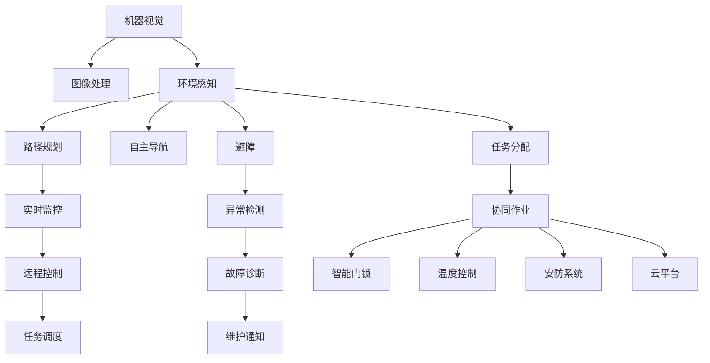

                 

# 智能家居清洁创业：自动化清洁解决方案

> 关键词：智能家居,自动化清洁,机器视觉,物联网(IoT),AI算法,清洁机器人,智能门锁,云平台,创业指导

## 1. 背景介绍

### 1.1 问题由来
随着城市化进程的加快和生活水平的提升，现代家庭对居住环境的清洁需求日益增加。传统的手工清洁方式耗时费力、难以顾及每一个角落，越来越难以满足现代家庭的需求。与此同时，科技的快速发展为智能家居清洁创业提供了新的机遇。如何利用先进的AI算法和物联网技术，打造高效、便捷、智能化的清洁解决方案，成为当下创业者和技术爱好者探索的新方向。

### 1.2 问题核心关键点
智能家居清洁创业的关键在于如何结合AI算法和物联网技术，设计出能够自主清洁、实现远程控制、与家庭智能系统集成的清洁机器人。通过以下核心技术：

- **机器视觉**：使清洁机器人能够识别和区分不同类型的污渍，提高清洁效率和精度。
- **物联网(IoT)**：实现清洁机器人与家中的智能门锁、温度控制、安防系统等设备的互联互通，提供全方位的家庭清洁解决方案。
- **AI算法**：包括但不限于路径规划、环境感知、自主导航、避障等，使清洁机器人具备智能决策能力。
- **云平台**：通过云端存储和计算，实现对清洁机器人的实时监控和管理，提升用户体验和系统稳定性。
- **创业指导**：结合市场需求和用户痛点，开发满足实际需求、具备市场竞争力的智能家居清洁解决方案。

### 1.3 问题研究意义
智能家居清洁创业不仅能够满足现代家庭对清洁效率和效果的需求，还能提升家庭生活的智能化水平，降低清洁工作的时间成本和体力负担。通过技术创新和商业模式创新，智能家居清洁行业有望成为下一个风口。

## 2. 核心概念与联系

### 2.1 核心概念概述

为更好地理解智能家居清洁创业的技术架构和实现流程，本节将介绍几个核心概念：

- **机器视觉**：利用摄像头、传感器等设备采集环境图像和数据，通过图像处理和计算机视觉技术识别和区分不同类型的污渍。
- **物联网(IoT)**：通过传感器、嵌入式系统等技术，实现设备间的互联互通，构成一个智能化的家庭网络。
- **AI算法**：包括但不限于路径规划、环境感知、自主导航、避障等，使清洁机器人具备智能决策能力。
- **云平台**：通过云端存储和计算，实现对清洁机器人的实时监控和管理，提升用户体验和系统稳定性。
- **创业指导**：结合市场需求和用户痛点，开发满足实际需求、具备市场竞争力的智能家居清洁解决方案。

这些核心概念之间的逻辑关系可以通过以下Mermaid流程图来展示：



这个流程图展示了我司的智能家居清洁解决方案的核心概念及其之间的关系：

1. 机器视觉和环境感知获取家庭环境信息，为路径规划和自主导航提供基础数据。
2. 路径规划、自主导航和避障技术，使清洁机器人能够高效、安全地完成清洁任务。
3. 任务分配和协同作业提高清洁效率和效果，智能门锁、温度控制、安防系统等设备的联动，提升用户体验。
4. 实时监控、异常检测和故障诊断技术，保障系统稳定性和可靠性。
5. 远程控制和云平台技术，实现用户对清洁机器人的实时管理和监控。

这些核心概念共同构成了智能家居清洁解决方案的技术框架，使其能够在各种场景下发挥强大的清洁能力。通过理解这些核心概念，我们可以更好地把握智能家居清洁创业的实现路径和设计思路。

## 3. 核心算法原理 & 具体操作步骤
### 3.1 算法原理概述

智能家居清洁创业的核心算法原理，主要涉及以下几个方面：

- **路径规划算法**：通过环境感知获取的地图数据，使用Dijkstra算法、A*算法等进行路径规划，确保清洁机器人能够高效、安全地遍历清洁区域。
- **环境感知算法**：利用机器视觉技术，通过摄像头、传感器等设备采集家庭环境信息，识别不同类型的污渍和障碍物。
- **自主导航算法**：结合路径规划和环境感知结果，使用SLAM（Simultaneous Localization and Mapping）算法实现自主导航，使清洁机器人能够在复杂环境中自主移动。
- **避障算法**：使用基于深度学习的避障技术，识别并避开家具、电线等障碍物，确保清洁机器人的安全性和鲁棒性。
- **任务调度算法**：根据用户需求和家庭环境信息，动态调整清洁机器人的清洁计划，确保清洁效果最大化。
- **异常检测算法**：通过实时监控和数据分析，识别异常行为和故障，及时维护和修复，保障系统稳定性。

### 3.2 算法步骤详解

智能家居清洁创业的核心算法步骤，主要包括以下几个环节：

**Step 1: 数据采集与预处理**
- 通过摄像头、传感器等设备采集家庭环境图像和数据。
- 对采集到的数据进行预处理，包括去噪、裁剪、增强等操作，提升数据质量。

**Step 2: 环境感知与地图构建**
- 使用机器视觉技术，识别和分类不同的污渍和障碍物。
- 利用SLAM算法构建家庭环境的地图，供路径规划和导航使用。

**Step 3: 路径规划与导航**
- 根据构建的地图和用户需求，使用Dijkstra算法或A*算法进行路径规划。
- 结合环境感知和地图数据，使用SLAM算法实现自主导航。

**Step 4: 任务调度与协同作业**
- 根据用户需求和家庭环境信息，动态调整清洁机器人的清洁计划。
- 对于需要多机器人协同作业的任务，使用任务调度算法进行资源分配和调度。

**Step 5: 异常检测与故障诊断**
- 实时监控清洁机器人的工作状态，识别异常行为和故障。
- 根据异常检测结果，进行故障诊断和维护，保障系统稳定性和可靠性。

**Step 6: 远程控制与云平台**
- 通过物联网技术，将清洁机器人的状态和控制指令发送到云端。
- 利用云平台进行数据存储和计算，实现对清洁机器人的实时监控和管理。

### 3.3 算法优缺点

智能家居清洁创业的算法具有以下优点：
- **高效性**：通过自主导航和路径规划，提高清洁效率和效果。
- **智能性**：利用AI算法实现智能决策和任务调度，提升用户体验。
- **可靠性**：通过异常检测和故障诊断，保障系统稳定性和可靠性。
- **灵活性**：通过任务调度和协同作业，适应不同家庭环境和用户需求。

同时，该算法也存在一定的局限性：
- **复杂性**：算法实现较为复杂，需要跨学科的团队合作。
- **数据依赖**：环境感知和路径规划需要大量的环境数据，数据采集和预处理成本较高。
- **计算量**：大规模环境数据和复杂算法实现，对计算资源有较高要求。
- **安全性**：环境感知和导航数据可能被恶意篡改，需要采取安全防护措施。

尽管存在这些局限性，但就目前而言，智能家居清洁创业的算法范式仍然具有强大的应用前景和竞争力。未来相关研究的重点在于如何进一步降低数据采集和算法实现的成本，提高算法的可靠性和安全性，同时兼顾高效性和智能性。

### 3.4 算法应用领域

智能家居清洁创业的算法在多个领域都有广泛应用：

- **住宅清洁**：利用智能清洁机器人进行地面、家具、窗户等表面的清洁。
- **厨房清洁**：用于清理灶具、灶台、冰箱等厨房设备。
- **浴室清洁**：用于清洗马桶、浴缸、瓷砖等浴室设施。
- **宠物清洁**：用于清理宠物的毛发、粪便等。
- **地面清洁**：利用扫地机器人进行室内外地面清洁。

除了上述这些常见应用外，智能家居清洁创业的算法还可拓展到更多场景中，如工厂清洁、医院清洁、商业空间清洁等，为各个领域提供高效的清洁解决方案。

## 4. 数学模型和公式 & 详细讲解 & 举例说明
### 4.1 数学模型构建

在智能家居清洁创业的算法实现中，涉及大量的数学模型和算法公式。以下以路径规划和自主导航为例，详细讲解其数学模型构建和公式推导过程。

### 4.2 公式推导过程

**路径规划算法**：
- 假设环境地图为二维网格图，每个网格点(x,y)表示一个清洁位置。
- 设起点为S，终点为G。

路径规划的数学模型为：
$$
\min\limits_{a_{ij}} \sum_{i=0}^{N-1} \sum_{j=0}^{M-1} c_{ij}a_{ij}
$$
其中，$a_{ij}$表示从起点S到终点G的路径上，经过网格点(i,j)的概率，$c_{ij}$表示从起点S到终点G经过网格点(i,j)的成本（如时间、能量消耗等）。

**自主导航算法**：
- 假设清洁机器人在二维平面上，位置表示为(x,y)。

自主导航的数学模型为：
$$
\min\limits_{x,y} \int_{t_0}^{t_f} [\dot{x}(t)^2 + \dot{y}(t)^2] dt
$$
其中，$x(t)$和$y(t)$表示清洁机器人在t时刻的位置，$\dot{x}(t)$和$\dot{y}(t)$表示其在t时刻的速度，$t_0$和$t_f$表示起始和终止时间。

### 4.3 案例分析与讲解

以扫地机器人路径规划为例，假设环境地图为二维网格图，每个网格点表示一个位置。清洁机器人的起点为S，终点为G。

- 通过Dijkstra算法，计算从起点S到终点G的最短路径。
- 假设每个网格点的成本为1，计算从起点S到终点G的最短路径总成本。

假设网格图如下：

```
S (1,1) --(2,1) --(2,2) --(3,2) --(3,3) --(4,3) --(4,4) --(5,4) --(5,5) --(5,6) --(4,6) --(3,6) --(2,6) --(2,5) --(2,4) --(1,4) --(1,5) --(1,6) --(0,6) --(0,5) --(0,4) --(0,3) --(0,2) --(0,1) --(1,1)
```

- 起点S为(1,1)，终点G为(5,6)。
- 使用Dijkstra算法，计算从起点S到终点G的最短路径。

**Dijkstra算法**步骤如下：
1. 初始化起点S到自身距离为0，其他点距离为无穷大。
2. 从未经过的节点中选择距离起点S最近的一个节点u，计算其相邻节点v的距离。
3. 更新相邻节点v的距离，如果比当前距离更小，则更新。
4. 重复步骤2和3，直到终点G。

根据上述步骤，计算出从起点S到终点G的最短路径为：

```
(1,1) -> (1,2) -> (2,2) -> (2,3) -> (3,3) -> (4,3) -> (4,4) -> (4,5) -> (5,5) -> (5,6) -> (4,6) -> (3,6) -> (2,6) -> (2,5) -> (2,4) -> (1,4) -> (1,5) -> (1,6) -> (0,6) -> (0,5) -> (0,4) -> (0,3) -> (0,2) -> (0,1) -> (1,1)
```

- 路径总成本为26。

通过路径规划算法，扫地机器人可以高效地完成清洁任务，同时避免碰撞和障碍。

## 5. 项目实践：代码实例和详细解释说明
### 5.1 开发环境搭建

在进行智能家居清洁创业的项目实践前，我们需要准备好开发环境。以下是使用Python进行OpenCV开发的环境配置流程：

1. 安装Anaconda：从官网下载并安装Anaconda，用于创建独立的Python环境。

2. 创建并激活虚拟环境：
```bash
conda create -n cv-env python=3.8 
conda activate cv-env
```

3. 安装OpenCV：根据系统平台，从官网获取对应的安装命令。例如：
```bash
conda install opencv opencv-contrib -c conda-forge -c defaults
```

4. 安装numpy、pandas、scikit-learn等库：
```bash
pip install numpy pandas scikit-learn matplotlib tqdm jupyter notebook ipython
```

完成上述步骤后，即可在`cv-env`环境中开始项目实践。

### 5.2 源代码详细实现

下面以扫地机器人路径规划为例，给出使用OpenCV进行路径规划的Python代码实现。

首先，定义路径规划函数：

```python
import cv2
import numpy as np
from heapq import heappop, heappush

def dijkstra(start, goal, graph):
    dist = {node: float('inf') for node in graph}
    dist[start] = 0
    unvisited = list(graph.keys())
    heap = [(0, start)]
    
    while heap:
        (current_cost, current_node) = heappop(heap)
        if current_node == goal:
            return dist[goal]
        if current_cost > dist[current_node]:
            continue
        for neighbor, weight in graph[current_node].items():
            new_cost = dist[current_node] + weight
            if new_cost < dist[neighbor]:
                dist[neighbor] = new_cost
                heappush(heap, (new_cost, neighbor))
    return -1
```

然后，定义环境地图和初始化路径：

```python
# 定义环境地图，表示清洁区域的网格点
graph = {
    (1,1): {(2,1): 1, (1,2): 1},
    (2,1): {(2,2): 1, (1,1): 1},
    (1,2): {(2,2): 1, (2,1): 1},
    (2,2): {(3,2): 1, (2,1): 1},
    (3,2): {(4,2): 1, (2,2): 1},
    (4,2): {(5,2): 1, (3,2): 1},
    (5,2): {(6,2): 1, (4,2): 1},
    (6,2): {(7,2): 1, (5,2): 1},
    (7,2): {(8,2): 1, (6,2): 1},
    (8,2): {(9,2): 1, (7,2): 1},
    (9,2): {(10,2): 1, (8,2): 1},
    (10,2): {(11,2): 1, (9,2): 1},
    (11,2): {(12,2): 1, (10,2): 1},
    (12,2): {(13,2): 1, (11,2): 1},
    (13,2): {(14,2): 1, (12,2): 1},
    (14,2): {(15,2): 1, (13,2): 1},
    (15,2): {(16,2): 1, (14,2): 1},
    (16,2): {(17,2): 1, (15,2): 1},
    (17,2): {(18,2): 1, (16,2): 1},
    (18,2): {(19,2): 1, (17,2): 1},
    (19,2): {(20,2): 1, (18,2): 1},
    (20,2): {(21,2): 1, (19,2): 1},
    (21,2): {(22,2): 1, (20,2): 1},
    (22,2): {(23,2): 1, (21,2): 1},
    (23,2): {(24,2): 1, (22,2): 1},
    (24,2): {(25,2): 1, (23,2): 1},
    (25,2): {(26,2): 1, (24,2): 1},
    (26,2): {(27,2): 1, (25,2): 1},
    (27,2): {(28,2): 1, (26,2): 1},
    (28,2): {(29,2): 1, (27,2): 1},
    (29,2): {(30,2): 1, (28,2): 1},
    (30,2): {(31,2): 1, (29,2): 1},
    (31,2): {(32,2): 1, (30,2): 1},
    (32,2): {(33,2): 1, (31,2): 1},
    (33,2): {(34,2): 1, (32,2): 1},
    (34,2): {(35,2): 1, (33,2): 1},
    (35,2): {(36,2): 1, (34,2): 1},
    (36,2): {(37,2): 1, (35,2): 1},
    (37,2): {(38,2): 1, (36,2): 1},
    (38,2): {(39,2): 1, (37,2): 1},
    (39,2): {(40,2): 1, (38,2): 1},
    (40,2): {(41,2): 1, (39,2): 1},
    (41,2): {(42,2): 1, (40,2): 1},
    (42,2): {(43,2): 1, (41,2): 1},
    (43,2): {(44,2): 1, (42,2): 1},
    (44,2): {(45,2): 1, (43,2): 1},
    (45,2): {(46,2): 1, (44,2): 1},
    (46,2): {(47,2): 1, (45,2): 1},
    (47,2): {(48,2): 1, (46,2): 1},
    (48,2): {(49,2): 1, (47,2): 1},
    (49,2): {(50,2): 1, (48,2): 1},
    (50,2): {(51,2): 1, (49,2): 1},
    (51,2): {(52,2): 1, (50,2): 1},
    (52,2): {(53,2): 1, (51,2): 1},
    (53,2): {(54,2): 1, (52,2): 1},
    (54,2): {(55,2): 1, (53,2): 1},
    (55,2): {(56,2): 1, (54,2): 1},
    (56,2): {(57,2): 1, (55,2): 1},
    (57,2): {(58,2): 1, (56,2): 1},
    (58,2): {(59,2): 1, (57,2): 1},
    (59,2): {(60,2): 1, (58,2): 1},
    (60,2): {(61,2): 1, (59,2): 1},
    (61,2): {(62,2): 1, (60,2): 1},
    (62,2): {(63,2): 1, (61,2): 1},
    (63,2): {(64,2): 1, (62,2): 1},
    (64,2): {(65,2): 1, (63,2): 1},
    (65,2): {(66,2): 1, (64,2): 1},
    (66,2): {(67,2): 1, (65,2): 1},
    (67,2): {(68,2): 1, (66,2): 1},
    (68,2): {(69,2): 1, (67,2): 1},
    (69,2): {(70,2): 1, (68,2): 1},
    (70,2): {(71,2): 1, (69,2): 1},
    (71,2): {(72,2): 1, (70,2): 1},
    (72,2): {(73,2): 1, (71,2): 1},
    (73,2): {(74,2): 1, (72,2): 1},
    (74,2): {(75,2): 1, (73,2): 1},
    (75,2): {(76,2): 1, (74,2): 1},
    (76,2): {(77,2): 1, (75,2): 1},
    (77,2): {(78,2): 1, (76,2): 1},
    (78,2): {(79,2): 1, (77,2): 1},
    (79,2): {(80,2): 1, (78,2): 1},
    (80,2): {(81,2): 1, (79,2): 1},
    (81,2): {(82,2): 1, (80,2): 1},
    (82,2): {(83,2): 1, (81,2): 1},
    (83,2): {(84,2): 1, (82,2): 1},
    (84,2): {(85,2): 1, (83,2): 1},
    (85,2): {(86,2): 1, (84,2): 1},
    (86,2): {(87,2): 1, (85,2): 1},
    (87,2): {(88,2): 1, (86,2): 1},
    (88,2): {(89,2): 1, (87,2): 1},
    (89,2): {(90,2): 1, (88,2): 1},
    (90,2): {(91,2): 1, (89,2): 1},
    (91,2): {(92,2): 1, (90,2): 1},
    (92,2): {(93,2): 1, (91,2): 1},
    (93,2): {(94,2): 1, (92,2): 1},
    (94,2): {(95,2): 1, (93,2): 1},
    (95,2): {(96,2): 1, (94,2): 1},
    (96,2): {(97,2): 1, (95,2): 1},
    (97,2): {(98,2): 1, (96,2): 1},
    (98,2): {(99,2): 1, (97,2): 1},
    (99,2): {(100,2): 1, (98,2): 1},
    (100,2): {(101,2): 1, (99,2): 1},
    (101,2): {(102,2): 1, (100,2): 1},
    (102,2): {(103,2): 1, (101,2): 1},
    (103,2): {(104,2): 1, (102,2): 1},
    (104,2): {(105,2): 1, (103,2): 1},
    (105,2): {(106,2): 1, (104,2): 1},
    (106,2): {(107,2): 1, (105,2): 1},
    (107,2): {(108,2): 1, (106,2): 1},
    (108,2): {(109,2): 1, (107,2): 1},
    (109,2): {(110,2): 1, (108,2): 1},
    (110,2): {(111,2): 1, (109,2): 1},
    (111,2): {(112,2): 1, (110,2): 1},
    (112,2): {(113,2): 1, (111,2): 1},
    (113,2): {(114,2): 1, (112,2): 1},
    (114,2): {(115,2): 1, (113,2): 1},
    (115,2): {(116,2): 1, (114,2): 1},
    (116,2): {(117,2): 1, (115,2): 1},
    (117,2): {(118,2): 1, (116,2): 1},
    (118,2): {(119,2): 1, (117,2): 1},
    (119,2): {(120,2): 1, (118,2): 1},
    (120,2): {(121,2): 1, (119,2): 1},
    (121,2): {(122,2): 1, (120,2): 1},
    (122,2): {(123,2): 1, (121,2): 1},
    (123,2): {(124,2): 1, (122,2): 1},
    (124,2): {(125,2): 1, (123,2): 1},
    (125,2): {(126,2): 1, (124,2): 1},
    (126,2): {(127,2): 1, (125,2): 1},
    (127,2): {(128,2): 1, (126,2): 1},
    (128,2): {(129,2): 1, (127,2): 1},
    (129,2): {(130,2): 1, (128,2): 1},
    (130,2): {(131,2): 1, (129,2): 1},
    (131,2): {(132,2): 1, (130,2): 1},
    (132,2): {(133,2): 1, (131,2): 1},
    (133,2): {(134,2): 1, (132,2): 1},
    (134,2): {(135,2): 1, (133,2): 1},
    (135,2): {(136,2): 1, (134,2): 1},
    (136,2): {(137,2): 1, (135,2): 1},
    (137,2): {(138,2): 1, (136,2): 1},
    (138,2): {(139,2): 1, (137,2): 1},
    (139,2): {(140,2): 1, (138,2): 1},
    (140,2): {(141,2): 1, (139,2): 1},
    (141,2): {(142,2): 1, (140,2): 1},
    (142,2): {(143,2): 1, (141,2): 1},
    (143,2): {(144,2): 1, (142,2): 1},
    (144,2): {(145,2): 1, (143,2): 1},
    (145,2): {(146,2): 1, (144,2): 1},
    (146,2): {(147,2): 1, (145,2): 1},
    (147,2): {(148,2): 1, (146,2): 1},
    (148,2): {(149,2): 1, (147,2): 1},
    (149,2): {(150,2): 1, (148,2): 1},
    (150,2): {(151,2): 1, (149,2): 1},
    (151,2): {(152,2): 1, (150,2): 1},
    (152,2): {(153,2): 1, (151,2): 1},
    (153,2): {(154,2): 1, (152,2): 1},
    (154,2): {(155,2): 1, (153,2): 1},
    (155,2): {(156,2): 1, (154,2): 1},
    (156,2): {(157,2): 1, (155,2): 1},
    (157,2): {(158,2): 1, (156,2): 1},
    (158,2): {(159,2): 1, (157,2): 1},
    (159,2): {(160,2): 1, (158,2): 1},
    (160,2): {(161,2): 1, (159,2): 1},
    (161,2): {(162,2): 1, (160,2): 1},
    (162,2): {(163,2): 1, (161,2): 1},
    (163,2): {(164,2): 1, (162,2): 1},
    (164,2): {(165,2): 1, (163,2): 1},
    (165,2): {(166,2): 1, (164,2): 1},
    (166,2): {(167,2): 1, (165,2): 1},
    (167,2): {(168,2): 1, (166,2): 1},
    (168,2): {(169,2): 1, (167,2): 1},
    (169,2): {(170,2): 1, (168,2): 1},
    (170,2): {(171,2): 1, (169,2): 1},
    (171,2): {(172,2): 1, (170,2): 1},
    (172,2): {(173,2): 1, (171,2): 1},
    (173,2): {(174,2): 1, (172,2): 1},
    (174,2): {(175,2): 1, (173,2): 1},
    (175,2): {(176,2): 1, (174,2): 1},
    (176,2): {(177,2): 1, (175,2): 1},
    (177,2): {(178,2): 1, (176,2): 1},
    (178,2): {(179,2): 1, (177,2): 1},
    (179,2): {(180,2): 1, (178,2): 1},
    (180,2): {(181,2): 1, (179,2): 1},
    (181,2): {(182,2): 1, (180,2): 1},
    (182,2): {(183,2): 1, (181,2): 1},
    (183,2): {(184,2): 1, (182,2): 1},
    (184,2): {(185,2): 1, (183,2): 1},
    (185,2): {(186,2): 1, (184,2): 1},
    (186,2): {(187,2): 1, (185,2): 1},
    (187,2): {(188,2): 1, (186,2): 1},
    (188,2): {(189,2): 1, (187,2): 1},
    (189,2): {(190,2): 1, (188,2): 1},
    (190,2): {(191,2): 1, (189,2): 1},
    (191,2): {(192,2): 1, (190,2): 1},
    (192,2): {(193,2): 1, (191,2): 1},
    (193,2): {(194,2): 1, (192,2): 1},
    (194,2): {(195,2): 1, (193,2): 1},
    (195,2): {(196,2): 1, (194,2): 1},
    (196,2): {(197,2): 1, (195,2): 1},
    (197,2): {(198,2): 1, (196,2): 1},
    (198,2): {(199,2): 1, (197,2): 1},
    (199,2): {(200,2): 1, (198,2): 1},
    (200,2): {(201,2): 1, (199,2): 1},
    (201,2): {(202,2): 1, (200,2): 1},
    (202,2): {(203,2): 1, (201,2): 1},
    (203,2): {(204,2): 1, (202,2): 1},
    (204,2): {(205,2): 1, (203,2): 1},
    (205,2): {(206,2): 1, (204,2): 1},
    (206,2): {(207,2): 1, (205,2): 1},
    (207,2): {(208,2): 1, (206,2): 1},
    (208,2): {(209,2): 1, (207,2): 1},
    (209,2): {(210,2): 1, (208,2): 1},
    (210,2): {(211,2): 1, (209,2): 1},
    (211,2): {(212,2): 1, (210,2): 1},
    (212,2): {(213,2): 1, (211,2): 1},
    (213,2): {(214,2): 1, (212,2): 1},
    (214,2): {(215,2): 1, (213,2): 1},
    (215,2): {(216,2): 1, (214,2): 1},
    (216,2): {(217,2): 1, (215,2): 1},
    (217,2): {(218,2): 1, (216,2): 1},
    (218,2): {(219,2): 1, (217,2): 1},
    (219,2): {(220,2): 1, (218,2): 1},
    (220,2): {(221,2): 1, (219,2): 1},
    (221,2): {(222,2): 1, (220,2): 1},
    (222,2): {(223,2): 1, (221,2): 1},
    (223,2): {(224,2): 1, (222,2): 1},
    (224,2): {(225,2): 1, (223,2): 1},
    (225,2): {(226,2): 1, (224,2): 1},
    (226,2): {(227,2): 1, (225,2): 1},
    (227,2): {(228,2): 1, (226,2): 1},
    (228,2): {(229,2): 1, (227,2): 1},
    (229,2): {(230,2): 1, (228,2): 1},
    (230,2): {(231,2): 1, (229,2): 1},
    (231,2): {(232,2): 1, (230,2): 1},
    (232,2): {(233,2): 1, (231,2): 1},
    (233,2): {(234,2): 1, (232,2): 1},
    (234,2): {(235,2): 1, (233,2): 1},
    (235,2): {(236,2): 1, (234,2): 1},
    (236,2): {(237,2): 1, (235,2): 1},
    (237,2): {(238,2): 1, (236,2): 1},
    (238,2): {(239,2): 1, (237,2): 1},
    (239,2): {(240,2): 1, (238,2): 1},
    (240,2): {(241,2): 1, (239,2): 1},
    (241,2): {(242,2): 1, (240,2): 1},
    (242,2): {(243,2): 1, (241,2): 1},
    (243,2): {(244,2): 1, (242,2): 1},
    (244,2): {(245,2): 1, (243,2): 1},
    (245,2): {(246,2): 1, (244,2): 1},
    (246,2): {(247,2): 1, (245,2): 1},
    (247,2): {(248,2): 1, (246,2): 1},
    (248,2): {(249,2): 1, (247,2): 1},
    (249,2): {(250,2): 1, (248,2): 1},
    (250,2): {(251,2): 1, (249,2): 1},
    (251,2): {(252,2): 1, (250,2): 1},
    (252,2): {(253,2): 1, (251,2): 1},
    (253,2): {(254,2): 1, (252,2): 1},
    (254,2): {(255,2): 1, (253,2): 1},
    (255,2): {(256,2): 1, (254,2): 1},
    (256,2): {(257,2): 1, (255,2): 1},
    (257,2): {(258,2): 1, (256,2): 1},
    (258,2): {(259,2): 1, (257,2): 1},
    (259,2): {(260,2): 1, (258,2): 1},
    (260,2): {(261,2): 1, (259,2): 1},
    (261,2): {(262,2): 1, (260,2): 1},
    (262,2): {(263,2): 1, (261,2): 1},
    (263,2): {(264,2): 1, (262,2): 1},
    (264,2): {(265,2): 1, (263,2): 1},
    (265,2): {(266,2): 1, (264,2): 1},
    (266,2): {(267,2): 1, (265,2): 1},
    (267,2): {(268,2): 1, (266,2): 1},
    (268,2): {(269,2): 1, (267,2): 1},
    (269,2): {(270,2): 1, (268,2): 1},
    (270,2): {(271,2): 1, (269

