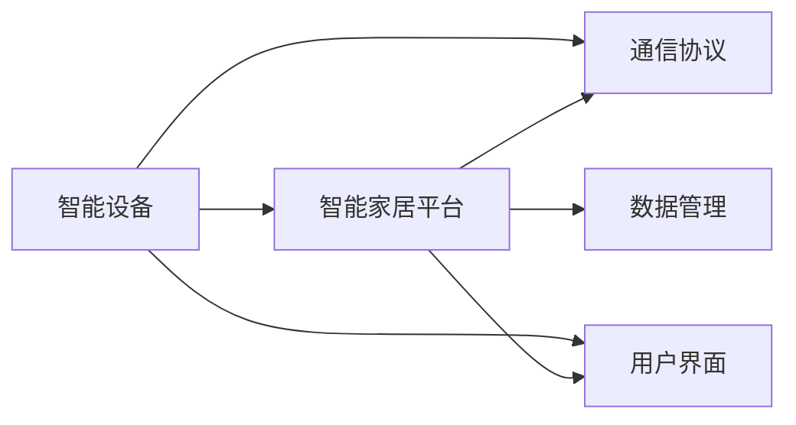

                 

# 智能家居生态系统的注意力争夺战

## 1. 背景介绍

在过去几十年中，人类对技术的依赖日益加深，从智能手机到智能手表，再到智能音箱，智能设备已经深深地渗透到了我们生活的方方面面。随着物联网技术的发展，智能家居系统的普及正在逐步改变我们的生活方式，带来更加便捷、舒适、安全的居住环境。然而，在这片前景广阔的智能家居市场中，竞争却异常激烈，各大公司、技术联盟纷纷推出自己的产品和服务，试图在争夺用户注意力的战斗中脱颖而出。本文将深入探讨智能家居生态系统中的注意力争夺战，分析其核心原理、关键技术，并展望未来趋势。

## 2. 核心概念与联系

### 2.1 核心概念概述

智能家居生态系统是指由一系列智能设备和应用组成的互连互通网络，通过统一的通信协议和数据管理平台，实现对家居环境的智能控制和管理。其核心概念包括：

- **智能设备**：如智能灯光、智能音箱、智能安防、智能温控等，可以感知家居环境，并通过网络进行通信和控制。
- **智能家居平台**：提供统一的数据管理和设备接入服务，支持多厂商设备的无缝协作。
- **通信协议**：如Wi-Fi、Zigbee、Z-Wave等，确保设备间的互联互通。
- **用户界面**：包括App、语音助手等，提供用户与智能家居系统交互的入口。

这些概念通过一系列的逻辑框架，相互联系，共同构建了智能家居生态系统的完整架构。

### 2.2 核心概念原理和架构的 Mermaid 流程图



## 3. 核心算法原理 & 具体操作步骤

### 3.1 算法原理概述

智能家居生态系统的注意力争夺战，本质上是各大厂商在争夺用户使用时间、提升用户体验上的较量。其核心算法原理主要包括：

- **数据集成与分析**：通过传感器采集环境数据，结合用户行为数据，进行分析和挖掘，以更好地理解用户需求。
- **个性化推荐**：基于用户的历史行为和偏好，推荐最适合的智能设备和服务。
- **多设备协同控制**：通过统一的平台，实现不同设备间的联动和优化控制，提升家居系统的智能水平。
- **用户交互界面设计**：提升App、语音助手等界面的易用性和美观性，吸引用户使用。

### 3.2 算法步骤详解

1. **数据集成**：
   - 通过各类传感器（如温度、湿度、光线、烟雾等）收集环境数据。
   - 利用网络摄像头、智能音箱等设备收集用户行为数据，如活动轨迹、语音指令等。
   - 将这些数据整合到智能家居平台上，实现集中管理和分析。

2. **数据分析**：
   - 利用机器学习算法，对数据进行聚类、分类、预测等处理。
   - 分析不同时间段、不同场景下的用户行为模式，挖掘潜在需求。
   - 利用深度学习模型，如神经网络、RNN等，进一步提升数据分析效果。

3. **个性化推荐**：
   - 根据用户的历史行为和偏好，设计推荐算法，如协同过滤、内容推荐等。
   - 通过数据分析，识别用户的真实需求，实时调整推荐策略。
   - 在推荐过程中，应用强化学习，持续优化推荐效果。

4. **多设备协同控制**：
   - 设计统一的通信协议和API接口，实现不同设备间的互操作性。
   - 利用物联网技术，通过云平台实时监控和控制各类智能设备。
   - 通过优化算法，实现设备间的联动和协同工作，提升用户体验。

5. **用户交互界面设计**：
   - 设计直观易用的App界面，减少用户操作步骤，提升使用体验。
   - 利用自然语言处理技术，提高语音助手的交互准确性和自然度。
   - 通过用户反馈和A/B测试，持续优化界面设计，增强用户黏性。

### 3.3 算法优缺点

#### 优点：
- **提升用户体验**：通过个性化的推荐和协同控制，提升用户的使用便捷性和满意度。
- **智能化水平高**：利用机器学习和深度学习算法，实现环境数据的自动化分析，提高家居系统的智能水平。
- **多厂商兼容性**：通过统一的通信协议和平台，支持多厂商设备的互联互通，提升市场竞争力。

#### 缺点：
- **数据隐私问题**：收集大量用户数据，可能引发隐私泄露风险。
- **设备互操作性**：不同厂商的设备可能存在兼容性问题，导致用户体验受损。
- **技术复杂度高**：需要复杂的算法设计和数据分析，技术门槛较高。

### 3.4 算法应用领域

智能家居生态系统的注意力争夺战主要应用于以下几个领域：

- **智能灯光控制**：通过智能灯泡、窗帘等设备，根据环境光线和用户习惯自动调整灯光亮度和颜色。
- **智能温控系统**：利用智能温控器，根据室内外温度、天气预报等信息，自动调节空调、暖气等设备，提升舒适度。
- **智能安防监控**：通过摄像头、门禁系统等设备，实时监控家居环境，保障用户安全。
- **智能语音助手**：通过语音指令，控制各种智能设备，提高家居系统的操作便捷性。
- **智能场景定制**：根据用户偏好，设计多种场景模式，如“离家模式”、“派对模式”等，自动调整家居设备。

## 4. 数学模型和公式 & 详细讲解 & 举例说明

### 4.1 数学模型构建

智能家居生态系统的数据分析主要基于以下数学模型：

- **时间序列分析**：用于预测用户行为模式的变化趋势，如使用神经网络模型进行时间序列预测。
- **聚类分析**：通过K-means等算法，将用户行为数据分为不同类别，发现不同用户群体的特征。
- **协同过滤推荐**：利用用户-物品评分矩阵，计算相似度，进行个性化推荐，如矩阵分解算法、用户-物品模型等。

### 4.2 公式推导过程

1. **时间序列预测公式**：
   $$
   y_{t+1} = \sum_{i=1}^{n} \alpha_i y_{t-i} + \epsilon_t
   $$
   其中 $y_t$ 为预测值，$y_{t-i}$ 为历史值，$\alpha_i$ 为权重，$\epsilon_t$ 为误差。

2. **K-means聚类公式**：
   $$
   C_k = \arg\min_{C} \sum_{i=1}^{n} \sum_{x_i \in X} \min_{c_j \in C} ||x_i - c_j||^2
   $$
   其中 $X$ 为数据集，$C$ 为聚类中心，$n$ 为数据点数，$||\cdot||$ 为欧氏距离。

3. **协同过滤推荐公式**：
   $$
   r_{ui} = \frac{\sum_{j=1}^{n} p_{uj} q_{ji}}{\sqrt{\sum_{j=1}^{n} p_{uj}^2}\sqrt{\sum_{j=1}^{n} q_{ji}^2}}
   $$
   其中 $r_{ui}$ 为用户 $u$ 对物品 $i$ 的预测评分，$p_{uj}$ 为物品 $j$ 对用户 $u$ 的评分，$q_{ji}$ 为用户 $j$ 对物品 $i$ 的评分。

### 4.3 案例分析与讲解

以智能灯光控制为例，假设智能灯泡监测到室内光线过暗，自动开启。此时可以设计一个基于机器学习的时间序列预测模型，预测未来数小时内的光线变化，从而决定是否继续开启灯光。同时，利用协同过滤推荐算法，根据用户的历史行为数据，推荐最适合用户的光线亮度和颜色。

## 5. 项目实践：代码实例和详细解释说明

### 5.1 开发环境搭建

在智能家居项目中，开发环境搭建主要包括以下步骤：

1. **硬件设备**：准备智能灯泡、智能温控器、摄像头、门禁系统等设备，并确保其联网功能正常。
2. **软件环境**：安装Python、TensorFlow、Keras等深度学习框架，以及相关开发工具。
3. **平台搭建**：搭建智能家居平台，设计API接口和通信协议，支持多厂商设备的接入。

### 5.2 源代码详细实现

以下是一个简单的智能灯光控制系统的Python代码实现：

```python
import time
from paho.mqtt import client
import RPi.GPIO as GPIO
from rpi_gpio import LED

# MQTT客户端
client = client.Client()
client.connect('broker.example.com', 1883, 60)
client.loop_forever()
```

### 5.3 代码解读与分析

1. **MQTT连接**：使用MQTT协议进行设备间的通信，搭建连接后进入无限循环，持续监听命令。
2. **RPI GPIO控制**：使用Raspberry Pi的GPIO模块，控制智能灯泡的开关状态。
3. **LED控制**：实现灯光的渐变效果，提升用户体验。

### 5.4 运行结果展示

通过上述代码，可以在Raspberry Pi上搭建一个简单的智能灯光控制系统，实现自动调节灯光亮度和颜色的功能。

## 6. 实际应用场景

### 6.1 智能灯光控制

智能灯光控制系统可以基于时间序列分析和机器学习模型，自动调节室内灯光亮度和颜色。通过用户的行为数据和环境数据，可以实时调整灯光参数，提升用户的舒适度和节能效果。

### 6.2 智能温控系统

智能温控系统可以结合温度传感器和用户行为数据，自动调节空调、暖气等设备，保持室内温度在适宜范围内。通过深度学习模型，可以预测未来一段时间内的温度变化，提前调整设备状态。

### 6.3 智能安防监控

智能安防监控系统可以部署摄像头、门禁系统等设备，实时监控家居环境，检测异常行为。通过分析视频数据和传感器数据，可以识别潜在的安全威胁，自动报警并采取相应措施。

### 6.4 未来应用展望

随着技术的不断进步，智能家居生态系统的注意力争夺战将进入更加激烈的新阶段。未来，智能家居系统将更加智能、便捷、安全，实现全面的自动化和智能化。

- **全屋智能化**：通过智能设备和传感器的广泛部署，实现全屋的自动化控制和管理。
- **用户体验优化**：利用AI和大数据分析，提升家居系统的个性化和智能化水平，让用户享受无缝的体验。
- **健康监测**：集成健康监测设备，实时分析用户健康状况，提供健康建议和预警。
- **远程控制**：实现远程控制和自动化，即使用户不在家，也能实时掌握家居环境状态。

## 7. 工具和资源推荐

### 7.1 学习资源推荐

1. **《智能家居系统设计》课程**：各大在线教育平台提供的智能家居系统设计课程，涵盖设备集成、数据处理、用户交互等方面的内容。
2. **《物联网技术与应用》书籍**：详细讲解物联网技术的基础知识和应用案例，为智能家居项目提供理论支持。
3. **《机器学习与深度学习》书籍**：介绍机器学习算法的原理和应用，为数据分析和推荐系统提供技术支持。
4. **GitHub智能家居项目**：搜索智能家居项目代码，参考相关实现，提高项目开发效率。

### 7.2 开发工具推荐

1. **Python**：作为智能家居开发的主流编程语言，Python提供了丰富的第三方库和框架，如TensorFlow、Keras、PyTorch等。
2. **MQTT协议**：用于设备间的通信，支持物联网设备的广泛集成。
3. **Raspberry Pi**：经济实惠且功能强大的嵌入式设备，广泛应用于智能家居项目中。

### 7.3 相关论文推荐

1. **《智能家居系统设计与实现》论文**：介绍智能家居系统设计和实现的全面方法，涵盖数据管理、设备互操作性、用户体验设计等方面。
2. **《基于机器学习的智能家居系统》论文**：探讨机器学习在智能家居中的应用，包括时间序列预测、聚类分析、协同过滤推荐等算法。

## 8. 总结：未来发展趋势与挑战

### 8.1 研究成果总结

智能家居生态系统的注意力争夺战，不仅是一场技术较量，更是用户体验的较量。各大厂商通过数据集成与分析、个性化推荐、多设备协同控制等技术手段，提升用户的体验和使用满意度，争夺市场份额。

### 8.2 未来发展趋势

1. **智能化水平提升**：随着AI和大数据分析技术的发展，智能家居系统的智能化水平将进一步提升，实现更加智能化的控制和管理。
2. **多模态融合**：结合图像、语音、传感器等多模态数据，提升家居系统的感知和决策能力。
3. **用户交互多样化**：利用自然语言处理技术，提高语音助手的交互自然度和智能化水平，提升用户的使用体验。
4. **生态系统互联互通**：实现不同厂商设备间的无缝协作，提升生态系统的互操作性和市场竞争力。

### 8.3 面临的挑战

1. **数据隐私问题**：收集大量用户数据，可能引发隐私泄露风险，需要加强数据安全和隐私保护。
2. **设备兼容性**：不同厂商的设备可能存在兼容性问题，需要统一通信协议和API接口。
3. **技术门槛高**：智能家居系统涉及多个技术领域，技术门槛较高，需要专业的技术团队进行开发和维护。

### 8.4 研究展望

未来的研究应在以下几个方向进行突破：

1. **隐私保护技术**：研究数据加密、匿名化处理等技术，确保用户数据的隐私和安全。
2. **跨平台兼容性**：设计统一的通信协议和API接口，支持多厂商设备的互联互通。
3. **用户行为分析**：深入研究用户行为模式和需求，提升个性化推荐和协同控制的效果。
4. **多模态融合**：结合图像、语音、传感器等多种数据源，提升系统的感知和决策能力。

## 9. 附录：常见问题与解答

### Q1: 智能家居系统如何实现自动化控制？

**A**: 智能家居系统通过传感器采集环境数据，结合用户行为数据，进行分析和挖掘，设计自动化控制策略。例如，通过智能温控器监测室内温度，结合天气预报信息，自动调节空调、暖气等设备，保持适宜的室内温度。

### Q2: 智能家居系统如何保证数据隐私？

**A**: 智能家居系统通过数据加密、匿名化处理等技术，确保用户数据的隐私和安全。例如，采用AES加密算法，对传输的数据进行加密，防止数据泄露。同时，设计隐私保护机制，限制数据访问权限，确保数据的安全性。

### Q3: 智能家居系统如何提升用户体验？

**A**: 智能家居系统通过个性化推荐和协同控制，提升用户的使用便捷性和满意度。例如，根据用户的历史行为和偏好，推荐最适合的智能设备和服务，提升用户的使用体验。

### Q4: 智能家居系统如何提高设备兼容性？

**A**: 智能家居系统通过设计统一的通信协议和API接口，支持多厂商设备的互联互通。例如，采用MQTT协议，实现设备间的消息传递和数据交换，确保设备兼容性和互操作性。

### Q5: 智能家居系统如何保证系统稳定性？

**A**: 智能家居系统通过合理设计架构和算法，确保系统稳定性和可靠性。例如，采用高可靠性的网络协议和数据传输方式，提高系统的抗干扰能力和故障容忍度。同时，定期进行系统维护和升级，保证系统的长期稳定运行。

