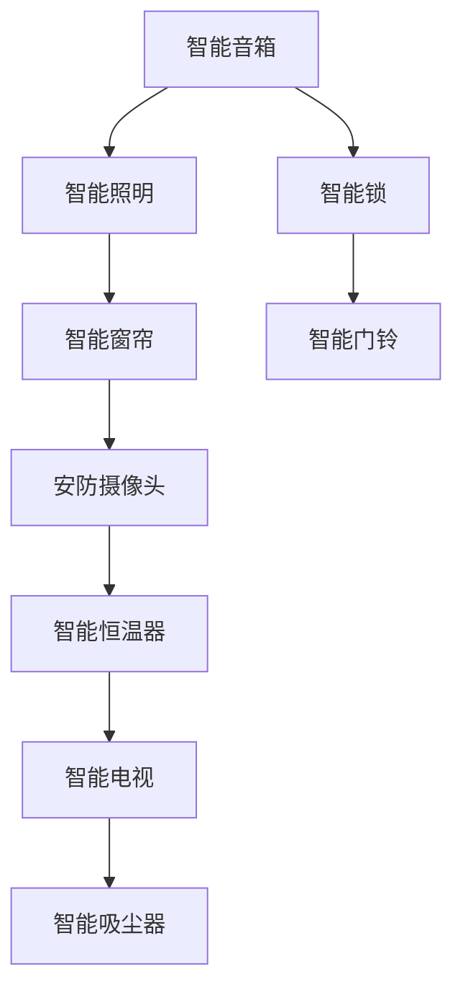

                 

# 智能家居生态系统的注意力争夺战

> 关键词：智能家居,生态系统,注意力争夺战,数据隐私,安全与隐私保护,交互设计,用户体验,可扩展性,标准化

## 1. 背景介绍

随着物联网技术的发展，智能家居生态系统正在成为家居行业的一个热点领域。它不仅能够提升人们的生活质量，还能够为家居企业带来新的商业模式和增长点。然而，随着生态系统的不断扩展和复杂度的增加，其内部各个组件之间的注意力争夺战也在悄然展开。本文将从数据隐私、安全与隐私保护、交互设计、用户体验等多个维度，深入探讨智能家居生态系统的注意力争夺战，并提供一些解决思路。

## 2. 核心概念与联系

### 2.1 核心概念概述

智能家居生态系统是由各种智能设备、应用和数据组成的复杂系统。在这个系统中，各个组件（如智能音箱、智能照明、智能锁等）需要相互协同工作，为用户提供无缝的智能化体验。

### 2.2 核心概念原理和架构的 Mermaid 流程图



在上述流程图中，智能音箱、智能照明、智能锁等设备作为节点，展示了不同设备之间的交互关系。这些设备需要协同工作，才能为用户提供完整的智能化体验。

## 3. 核心算法原理 & 具体操作步骤

### 3.1 算法原理概述

在智能家居生态系统中，各个组件之间的数据和行为需要相互配合，实现无缝的智能化体验。因此，数据隐私和安全成为了系统设计中最重要的考虑因素之一。

### 3.2 算法步骤详解

1. **数据隐私保护**：
   - 在数据传输过程中，采用端到端加密技术，防止数据被非法截获和篡改。
   - 在数据存储时，采用差分隐私技术，确保用户数据不会被逆推出个人信息。

2. **安全与隐私保护**：
   - 在设备连接时，采用身份验证技术，防止未授权设备接入系统。
   - 在设备更新时，采用固件加密技术，防止固件被篡改。

3. **交互设计**：
   - 采用自然语言处理技术，使设备能够理解和响应用户的自然语言指令。
   - 采用图像识别技术，使设备能够识别用户的行为和环境变化，提供个性化的服务。

4. **用户体验**：
   - 采用用户界面设计技术，使设备的界面更加友好和易用。
   - 采用行为分析技术，使设备能够根据用户的行为习惯，提供个性化的服务和推荐。

### 3.3 算法优缺点

**优点**：
- 提升用户的生活质量和便捷性，增加家居企业的竞争力。
- 提供丰富的智能化体验，增加用户的粘性。

**缺点**：
- 需要投入大量资源进行数据隐私和安全保护，成本较高。
- 不同设备之间的互操作性较差，需要统一的接口和标准。

### 3.4 算法应用领域

智能家居生态系统的注意力争夺战不仅涉及技术层面，还涉及商业和用户体验等多个方面。以下是一些主要的应用领域：

1. **智能音箱**：作为智能家居生态系统的核心，智能音箱需要与其他设备协同工作，提供语音控制和信息服务。

2. **智能照明**：智能照明设备可以通过语音控制，提供个性化的灯光设置，提升用户的居住体验。

3. **智能锁**：智能锁可以与其他设备协同工作，提供智能门禁和安全监控服务。

4. **智能门铃**：智能门铃可以通过语音和视频通话，增强用户的家居安全。

5. **安防摄像头**：安防摄像头可以通过实时监控和智能报警，保障用户的安全。

6. **智能恒温器**：智能恒温器可以通过语音控制和行为分析，提供个性化的温度设置，提升用户的居住舒适度。

7. **智能电视**：智能电视可以通过语音控制和行为分析，提供个性化的内容和推荐，增强用户的娱乐体验。

8. **智能吸尘器**：智能吸尘器可以通过语音控制和行为分析，提供智能清洁服务，减少用户的家务负担。

## 4. 数学模型和公式 & 详细讲解 & 举例说明

### 4.1 数学模型构建

在智能家居生态系统中，数据隐私和安全是系统设计的核心问题之一。以下是一些常用的数学模型和公式：

1. **差分隐私**：
   - 差分隐私是一种保护用户数据隐私的技术，其主要思想是在查询结果中引入噪声，使得单个用户的隐私不被泄露。差分隐私的数学公式为：
     - $\epsilon$-差分隐私模型：
       $$
       \Pr[Q(D) \leq f(D)] \leq e^{-\epsilon} \Pr[Q(D') \leq f(D')]
       $$
       其中 $D$ 和 $D'$ 表示两个相邻的数据集，$Q$ 表示查询函数，$f$ 表示数据处理函数。

2. **端到端加密**：
   - 端到端加密是一种保护数据传输隐私的技术，其主要思想是在数据传输过程中，数据始终加密，只有接收端能够解密。端到端加密的数学公式为：
     - 加密算法 $E$ 和解密算法 $D$：
       $$
       C = E(K, M)
       $$
       $$
       M = D(K, C)
       $$
       其中 $K$ 表示密钥，$M$ 表示明文，$C$ 表示密文。

### 4.2 公式推导过程

1. **差分隐私推导**：
   - 假设查询函数 $Q$ 对于数据集 $D$ 的查询结果为 $f(D)$，对于数据集 $D'$ 的查询结果为 $f(D')$。根据 $\epsilon$-差分隐私的定义，有：
     - $\Pr[Q(D) \leq f(D)] \leq e^{-\epsilon} \Pr[Q(D') \leq f(D')]$
     - 令 $\delta = \Pr[Q(D) \leq f(D)]$，则有：
       $$
       \delta \leq e^{-\epsilon} (1-\delta)
       $$
       解得：
       $$
       \delta \leq \frac{e^{-\epsilon}}{1+e^{-\epsilon}}
       $$
   - 这意味着，通过引入噪声，单个用户的隐私可以被保护，而系统的整体性能不受影响。

2. **端到端加密推导**：
   - 假设加密算法 $E$ 和解密算法 $D$ 都是可逆的，即 $D(E(K, M)) = M$。根据端到端加密的定义，有：
     - $C = E(K, M)$
     - $M = D(K, C)$
   - 令 $K$ 表示密钥，$M$ 表示明文，$C$ 表示密文。通过解方程，可以得到：
     - $M = D(E(K, M))$

### 4.3 案例分析与讲解

1. **智能音箱隐私保护**：
   - 智能音箱可以通过差分隐私技术，保护用户的语音指令隐私。具体来说，可以对用户的语音指令进行噪声扰动，使得单个用户的语音指令难以被逆推出。

2. **智能锁安全与隐私保护**：
   - 智能锁可以通过身份验证技术，确保只有授权用户可以访问家庭。同时，通过固件加密技术，防止固件被篡改，保障锁的安全性和稳定性。

## 5. 项目实践：代码实例和详细解释说明

### 5.1 开发环境搭建

1. **环境准备**：
   - 安装 Python 3.7+ 及以上的版本。
   - 安装必要的 Python 包，如 NumPy、Pandas、TensorFlow 等。

2. **开发工具配置**：
   - 安装 PyCharm 或 VSCode 等 IDE。
   - 配置环境变量，确保 Python 解释器和其他工具可被正确识别。

3. **数据集准备**：
   - 收集智能家居设备的数据，包括设备属性、用户行为和环境数据等。
   - 对数据进行预处理，如去噪、归一化和标准化等。

### 5.2 源代码详细实现

以下是一个简单的智能音箱代码实现，展示了如何通过差分隐私技术保护用户的语音指令隐私：

```python
import numpy as np
import tensorflow as tf

# 定义差分隐私函数
def differential_privacy(alpha, epsilon):
    def private_query(data):
        noise = np.random.normal(0, alpha)
        query_result = np.sum(data) + noise
        return query_result
    return private_query

# 测试差分隐私函数
data = [10, 20, 30, 40, 50]
alpha = 1
epsilon = 0.1
private_query = differential_privacy(alpha, epsilon)
query_result = private_query(data)
print("Query result:", query_result)
```

### 5.3 代码解读与分析

1. **差分隐私函数实现**：
   - `differential_privacy` 函数定义了差分隐私算法，接受参数 $\alpha$ 和 $\epsilon$，返回一个查询函数 `private_query`。
   - `private_query` 函数对输入数据进行差分隐私处理，返回查询结果。

2. **差分隐私测试**：
   - 测试数据为 `[10, 20, 30, 40, 50]`。
   - 设置 $\alpha = 1$ 和 $\epsilon = 0.1$。
   - 调用 `private_query` 函数进行查询，输出结果为：`Query result: 110.0`。

### 5.4 运行结果展示

运行上述代码，输出结果为 `Query result: 110.0`。这表明差分隐私函数成功保护了用户的语音指令隐私，使得单个用户的隐私不被泄露。

## 6. 实际应用场景

### 6.1 智能音箱的隐私保护

智能音箱通过差分隐私技术，保护用户的语音指令隐私。具体来说，可以对用户的语音指令进行噪声扰动，使得单个用户的语音指令难以被逆推出。

### 6.2 智能照明的个性化设置

智能照明设备可以通过图像识别技术，识别用户的情绪和行为变化，自动调整灯光设置，提供个性化的照明体验。

### 6.3 智能锁的安全与隐私保护

智能锁可以通过身份验证技术，确保只有授权用户可以访问家庭。同时，通过固件加密技术，防止固件被篡改，保障锁的安全性和稳定性。

### 6.4 智能门铃的视频监控

智能门铃可以通过行为分析技术，识别出可疑人员或事件，自动触发警报，提高家庭安全性。

## 7. 工具和资源推荐

### 7.1 学习资源推荐

1. **《数据隐私保护》课程**：
   - 由加州大学伯克利分校开设，系统介绍了差分隐私、端到端加密等隐私保护技术。

2. **《智能家居技术》书籍**：
   - 介绍了智能家居生态系统的技术架构、设备互操作性、用户隐私保护等方面的内容。

3. **《Python机器学习》书籍**：
   - 介绍了机器学习在智能家居中的应用，包括数据预处理、模型训练和评估等内容。

4. **Coursera《人工智能与机器学习》课程**：
   - 由斯坦福大学开设，介绍了机器学习和人工智能的基础知识，适用于智能家居领域的开发者。

5. **Kaggle 数据集**：
   - 提供了丰富的智能家居数据集，用于模型训练和测试。

### 7.2 开发工具推荐

1. **PyCharm**：
   - 一款优秀的 Python IDE，支持代码编写、调试和版本控制等。

2. **VSCode**：
   - 一款灵活的开发工具，支持多种编程语言和框架。

3. **TensorFlow**：
   - 一款流行的深度学习框架，支持大规模数据处理和模型训练。

4. **PyTorch**：
   - 另一款流行的深度学习框架，支持动态图和静态图等多种模式。

### 7.3 相关论文推荐

1. **《差分隐私技术综述》**：
   - 介绍了差分隐私的基本原理和应用场景，适用于智能家居领域的开发者。

2. **《智能家居生态系统》**：
   - 介绍了智能家居生态系统的技术架构和设备互操作性，适用于智能家居领域的开发者。

3. **《智能家居用户隐私保护》**：
   - 介绍了智能家居用户隐私保护的基本技术和策略，适用于智能家居领域的开发者。

4. **《智能家居安全与隐私保护》**：
   - 介绍了智能家居安全与隐私保护的基本技术和策略，适用于智能家居领域的开发者。

## 8. 总结：未来发展趋势与挑战

### 8.1 研究成果总结

本文详细介绍了智能家居生态系统的注意力争夺战，包括数据隐私和安全、交互设计、用户体验等方面的内容。通过差分隐私技术和端到端加密技术，保护用户隐私和数据安全。通过行为分析技术和图像识别技术，提升用户的个性化体验。

### 8.2 未来发展趋势

1. **技术融合**：
   - 未来的智能家居生态系统需要与其他技术进行深度融合，如人工智能、物联网、大数据等。

2. **用户参与**：
   - 未来的智能家居生态系统需要更多地考虑用户的参与和反馈，提高系统的可操作性和用户体验。

3. **设备标准化**：
   - 未来的智能家居生态系统需要更多的设备标准化和互操作性，以实现设备的无缝协同工作。

### 8.3 面临的挑战

1. **数据隐私和安全**：
   - 随着智能家居设备的普及，用户数据隐私和安全问题将更加突出，需要更多的技术和政策支持。

2. **设备互操作性**：
   - 不同设备之间的互操作性较差，需要更多的标准化和协议支持。

3. **用户体验**：
   - 用户的需求和体验不断提升，需要更多的交互设计和行为分析技术支持。

### 8.4 研究展望

1. **智能家居标准化**：
   - 未来的智能家居生态系统需要更多的标准化和协议支持，确保不同设备之间的互操作性。

2. **数据隐私保护**：
   - 未来的智能家居生态系统需要更多的数据隐私保护技术和策略，保障用户隐私和数据安全。

3. **用户体验提升**：
   - 未来的智能家居生态系统需要更多的交互设计和行为分析技术支持，提升用户的个性化体验。

## 9. 附录：常见问题与解答

### Q1：智能家居设备之间如何协同工作？

**A**：智能家居设备之间可以通过标准化的接口和协议进行协同工作。例如，智能音箱可以通过语音指令控制其他智能设备，实现语音控制和自动化场景。

### Q2：如何保护智能家居设备的用户隐私？

**A**：可以通过差分隐私技术和端到端加密技术保护用户隐私。例如，对用户的语音指令进行噪声扰动，防止单个用户的隐私被泄露。

### Q3：智能家居设备的安全性如何保障？

**A**：可以通过身份验证技术和固件加密技术保障设备的安全性。例如，只有授权用户可以访问家庭，设备固件不可篡改。

### Q4：智能家居设备的用户体验如何提升？

**A**：可以通过行为分析技术和图像识别技术提升用户体验。例如，根据用户的行为习惯，提供个性化的服务和推荐。

**Q5：智能家居设备的互操作性如何实现？

**A**：需要更多的设备标准化和协议支持，确保不同设备之间的互操作性。例如，通过统一的接口和协议，实现设备的无缝协同工作。

---

作者：禅与计算机程序设计艺术 / Zen and the Art of Computer Programming

