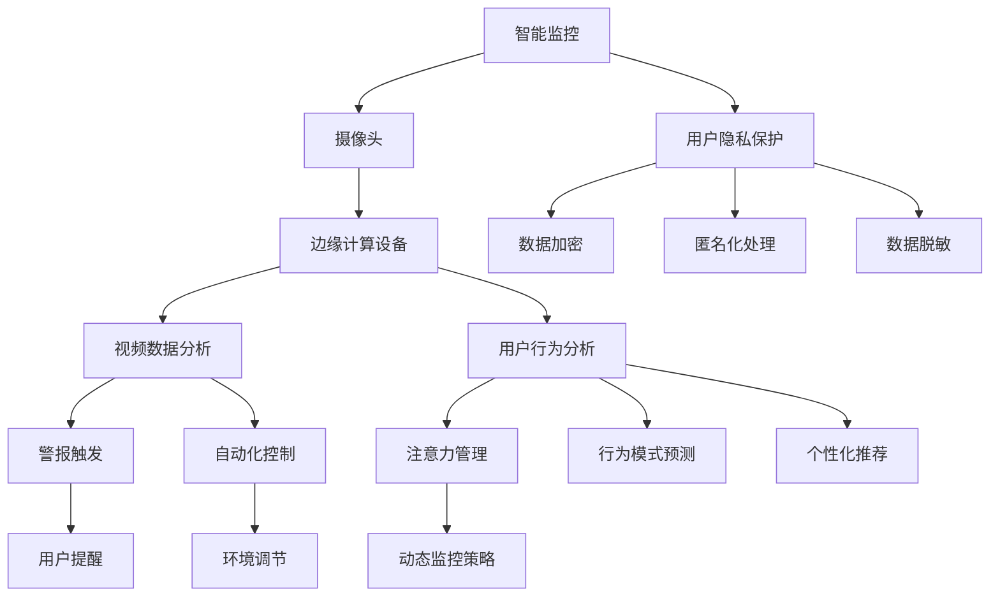

                 

## 1. 背景介绍

在物联网技术迅速发展的今天，智能家居系统已经成为家庭生活中的重要组成部分。传统的家居监控系统依赖于人力巡检，不仅效率低，还存在一定的安全风险。而智能监控系统的兴起，使得家居环境的安全和舒适得到了极大提升。与此同时，用户对于智能家居系统的需求也越来越高，不仅仅是在监控和控制层面，还期望系统能够具备更多智能化的功能，如注意力管理、用户行为预测等。

### 1.1 问题由来

在智能家居系统中，监控系统通常采用摄像头进行实时视频监控，并通过边缘计算设备（如智能摄像头、边缘服务器等）对数据进行处理和分析。这些设备能够捕捉到家庭成员的活动情况，并自动触发警报或采取相应措施。然而，这些监控系统主要依赖于视频分析技术，需要高精度的计算能力和庞大的存储资源。同时，由于存在数据隐私和安全问题，如何保证监控数据的安全性和用户隐私的保密性也成为了一个重要难题。

### 1.2 问题核心关键点

在智能家居的智能监控系统中，核心问题包括：

- 如何高效处理和分析海量视频数据，实时监控家居环境。
- 如何利用机器学习、计算机视觉等技术，提高监控的准确性和智能程度。
- 如何保护用户隐私，避免监控数据的滥用和泄露。
- 如何在监控系统中集成注意力管理、用户行为预测等功能，提升用户体验。

这些问题的解决，将极大提高智能家居系统的智能化水平和用户满意度。

## 2. 核心概念与联系

### 2.1 核心概念概述

为了更好地理解智能家居的智能监控与注意力管理，本节将介绍几个密切相关的核心概念：

- 智能监控：通过摄像头、传感器等设备，对家居环境进行实时视频监控和数据分析，自动触发警报或采取措施。
- 注意力管理：通过分析家庭成员的活动情况，动态调整监控策略，合理分配注意力资源，提高监控效率。
- 机器学习与计算机视觉：利用机器学习算法和大数据分析技术，提高视频监控的准确性和智能化程度。
- 用户行为预测：通过分析用户的行为模式和偏好，预测未来行为，提供个性化推荐和服务。
- 数据隐私与安全：保护用户隐私，避免监控数据被滥用或泄露。

这些核心概念之间存在着紧密的联系，共同构成了智能家居智能监控系统的高效运行。

### 2.2 核心概念原理和架构的 Mermaid 流程图(Mermaid 流程节点中不要有括号、逗号等特殊字符)



这个流程图展示了智能家居智能监控系统的核心概念及其之间的联系：

1. 智能监控系统通过摄像头收集实时视频数据，由边缘计算设备进行初步处理。
2. 视频数据分析模块对数据进行更深入的分析和处理，可以检测异常行为并触发警报。
3. 用户行为分析模块通过机器学习算法，识别家庭成员的活动模式，从而动态调整监控策略。
4. 注意力管理模块根据家庭成员的活动情况，合理分配监控设备的资源，提升监控效率。
5. 行为模式预测模块通过分析用户行为数据，预测未来的行为，提供个性化的推荐和服务。
6. 用户隐私保护模块通过数据加密、匿名化处理、数据脱敏等技术手段，确保监控数据的安全性和用户隐私的保密性。

这些模块的协同工作，构成了智能家居智能监控系统的完整架构，实现了高效的智能监控与注意力管理。

## 3. 核心算法原理 & 具体操作步骤
### 3.1 算法原理概述

智能家居的智能监控与注意力管理，主要依赖于以下几个核心算法：

- 机器学习与计算机视觉算法：用于视频数据的分析和处理，提高监控的准确性和智能程度。
- 注意力管理算法：动态调整监控策略，合理分配监控资源，提升监控效率。
- 用户行为预测算法：分析用户行为数据，预测未来行为，提供个性化推荐和服务。

这些算法共同构成了智能家居智能监控系统的核心功能，实现对家居环境的实时监控、高效管理与个性化服务。

### 3.2 算法步骤详解

智能家居的智能监控与注意力管理主要包括以下几个关键步骤：

**Step 1: 数据收集与预处理**

- 通过摄像头等设备，实时采集家居环境的视频数据。
- 对视频数据进行编码和压缩，以降低存储和传输的资源消耗。
- 对视频数据进行预处理，包括去噪、平滑、增强等操作，提高数据质量。

**Step 2: 视频数据分析**

- 利用计算机视觉技术，对视频数据进行目标检测、行为识别、异常检测等处理。
- 通过机器学习算法，对识别结果进行分类和预测，识别出异常行为并触发警报。
- 将视频数据与环境传感器数据结合，进行联合分析，提高监控的准确性和智能性。

**Step 3: 用户行为分析**

- 利用机器学习算法，对家庭成员的行为模式进行分析和建模。
- 动态调整监控策略，根据家庭成员的活动情况，合理分配监控设备的资源。
- 通过行为预测模型，预测未来的行为，提供个性化的推荐和服务。

**Step 4: 注意力管理**

- 根据家庭成员的活动情况，动态调整监控设备的聚焦范围和资源分配。
- 使用优先级调度算法，确保重点监控区域得到充分的资源保障。
- 对监控数据进行综合分析，优化监控策略，提升监控效率。

**Step 5: 用户隐私保护**

- 对监控数据进行加密处理，确保数据传输过程中的安全。
- 对监控数据进行匿名化处理，保护用户隐私。
- 对监控数据进行数据脱敏，避免敏感信息泄露。

### 3.3 算法优缺点

智能家居的智能监控与注意力管理算法具有以下优点：

1. 实时性强：通过视频数据分析和行为识别技术，可以实现实时监控，及时发现异常行为。
2. 准确性高：利用机器学习和计算机视觉算法，提高了监控的准确性和智能程度。
3. 资源利用率高：动态调整监控策略，合理分配注意力资源，提升了监控效率。
4. 用户体验好：结合行为预测和个性化推荐，提供更贴心、个性化的服务。

同时，这些算法也存在一些缺点：

1. 数据处理量大：视频数据的处理和分析需要庞大的计算资源和存储资源。
2. 算法复杂度高：涉及机器学习、计算机视觉等多领域技术，算法实现复杂。
3. 用户隐私风险：监控数据的安全性和隐私保护问题需要重视。
4. 实时性依赖网络：视频数据和处理结果的实时性依赖于网络条件。

### 3.4 算法应用领域

智能家居的智能监控与注意力管理算法在以下几个领域有广泛应用：

1. 智能安防：对家庭成员和客人的行为进行实时监控，自动触发警报并采取相应措施。
2. 智能家居管理：对家居设备的运行状态进行监控，提高设备的稳定性和可靠性。
3. 个性化服务：根据家庭成员的行为模式，提供个性化的推荐和服务，提升用户体验。
4. 健康管理：监控家庭成员的身体健康状况，及时发现异常情况并采取措施。
5. 远程监控：通过网络连接，实现远程监控和管理，提高家居安全性。

这些应用场景展示了智能家居智能监控与注意力管理算法的强大潜力，将极大地提升家居生活的智能化水平和安全性。

## 4. 数学模型和公式 & 详细讲解 & 举例说明

### 4.1 数学模型构建

本节将使用数学语言对智能家居智能监控与注意力管理系统的核心算法进行更加严格的刻画。

记智能监控系统收集的视频数据为 $V$，家庭成员的活动模式为 $A$，监控设备的注意力资源为 $R$。假设视频数据分析模块为 $F$，行为预测模块为 $P$，注意力管理模块为 $M$。

定义监控系统的损失函数为 $\mathcal{L}(V, A, R)$，目标是最小化监控系统在视频数据分析、行为预测和注意力管理等环节的误差，即：

$$
\mathcal{L}(V, A, R) = \mathcal{L}_F(V, A) + \mathcal{L}_P(A, R) + \mathcal{L}_M(V, R)
$$

其中 $\mathcal{L}_F(V, A)$ 为视频数据分析的损失函数，$\mathcal{L}_P(A, R)$ 为用户行为预测的损失函数，$\mathcal{L}_M(V, R)$ 为注意力管理的损失函数。

### 4.2 公式推导过程

以下我们以视频数据分析和行为预测为例，推导核心算法的公式及其求解过程。

**视频数据分析**

设视频数据 $V$ 的长度为 $T$，家庭成员的活动模式 $A$ 为二值向量 $[a_1, a_2, \ldots, a_T]$，其中 $a_t = 1$ 表示在时间 $t$ 家庭成员处于活动状态，$a_t = 0$ 表示在时间 $t$ 家庭成员处于休息状态。设视频数据分析模块 $F$ 的输出为 $F(V, A) = [f_1, f_2, \ldots, f_T]$，其中 $f_t = 1$ 表示在时间 $t$ 检测到异常行为，$f_t = 0$ 表示在时间 $t$ 没有检测到异常行为。

视频数据分析的目标是最小化检测误差，即：

$$
\mathcal{L}_F(V, A) = \frac{1}{T} \sum_{t=1}^T L(f_t, a_t)
$$

其中 $L$ 为损失函数，可以采用交叉熵损失、二分类损失等。

根据上述定义，我们可以使用决策树、支持向量机、神经网络等算法，对视频数据分析模块 $F$ 进行训练和优化，使得 $f_t$ 与 $a_t$ 尽可能接近。

**行为预测**

设家庭成员的活动模式 $A$ 为 $[a_1, a_2, \ldots, a_T]$，行为预测模块 $P$ 的输出为 $P(A, R) = [p_1, p_2, \ldots, p_T]$，其中 $p_t$ 为在时间 $t$ 家庭成员可能进行的活动。

行为预测的目标是最小化预测误差，即：

$$
\mathcal{L}_P(A, R) = \frac{1}{T} \sum_{t=1}^T L(p_t, a_t)
$$

其中 $L$ 为损失函数，可以采用交叉熵损失、均方误差损失等。

根据上述定义，我们可以使用回归算法、时序模型、深度学习等算法，对行为预测模块 $P$ 进行训练和优化，使得 $p_t$ 与 $a_t$ 尽可能接近。

### 4.3 案例分析与讲解

为了更好地理解智能家居智能监控与注意力管理系统的数学模型和算法，以下是几个具体案例的分析：

**案例1: 视频数据分析**

某智能家居系统中，通过摄像头实时采集视频数据，并利用机器学习算法对视频进行分析。假设摄像头每秒采集一帧图像，系统每秒输出检测结果。家庭成员的活动模式 $A$ 为二值向量 $[a_1, a_2, \ldots, a_T]$，其中 $a_t = 1$ 表示在时间 $t$ 家庭成员处于活动状态，$a_t = 0$ 表示在时间 $t$ 家庭成员处于休息状态。视频数据分析模块 $F$ 的输出为 $F(V, A) = [f_1, f_2, \ldots, f_T]$，其中 $f_t = 1$ 表示在时间 $t$ 检测到异常行为，$f_t = 0$ 表示在时间 $t$ 没有检测到异常行为。

系统定义损失函数 $\mathcal{L}_F(V, A) = \frac{1}{T} \sum_{t=1}^T L(f_t, a_t)$，其中 $L$ 为交叉熵损失函数。在训练阶段，系统使用历史数据进行训练，最小化损失函数 $\mathcal{L}_F(V, A)$，不断调整视频数据分析模块 $F$ 的参数，使得检测结果 $f_t$ 与实际活动模式 $a_t$ 尽可能接近。

**案例2: 行为预测**

某智能家居系统中，通过分析家庭成员的活动模式，预测未来的活动。假设家庭成员的活动模式 $A$ 为 $[a_1, a_2, \ldots, a_T]$，行为预测模块 $P$ 的输出为 $P(A, R) = [p_1, p_2, \ldots, p_T]$，其中 $p_t$ 为在时间 $t$ 家庭成员可能进行的活动。系统定义损失函数 $\mathcal{L}_P(A, R) = \frac{1}{T} \sum_{t=1}^T L(p_t, a_t)$，其中 $L$ 为交叉熵损失函数。在训练阶段，系统使用历史数据进行训练，最小化损失函数 $\mathcal{L}_P(A, R)$，不断调整行为预测模块 $P$ 的参数，使得预测结果 $p_t$ 与实际活动模式 $a_t$ 尽可能接近。

这些案例展示了智能家居智能监控与注意力管理系统的核心算法及其求解过程，通过数学模型和损失函数的定义，可以有效地对算法进行优化和训练。

## 5. 项目实践：代码实例和详细解释说明

### 5.1 开发环境搭建

在进行智能家居智能监控与注意力管理的项目实践前，我们需要准备好开发环境。以下是使用Python进行PyTorch开发的环境配置流程：

1. 安装Anaconda：从官网下载并安装Anaconda，用于创建独立的Python环境。

2. 创建并激活虚拟环境：
```bash
conda create -n pytorch-env python=3.8 
conda activate pytorch-env
```

3. 安装PyTorch：根据CUDA版本，从官网获取对应的安装命令。例如：
```bash
conda install pytorch torchvision torchaudio cudatoolkit=11.1 -c pytorch -c conda-forge
```

4. 安装TensorFlow：
```bash
conda install tensorflow
```

5. 安装TensorBoard：
```bash
pip install tensorboard
```

6. 安装TensorFlow扩展库：
```bash
pip install tf-nightly
```

完成上述步骤后，即可在`pytorch-env`环境中开始项目实践。

### 5.2 源代码详细实现

以下是使用PyTorch和TensorFlow进行智能家居智能监控与注意力管理的项目实现。

```python
import torch
import torch.nn as nn
import torch.optim as optim
import tensorflow as tf
from tensorflow.keras.models import Sequential
from tensorflow.keras.layers import Dense, LSTM, Dropout
from tensorflow.keras.losses import MeanSquaredError
from tensorflow.keras.optimizers import Adam

# 定义视频数据分析模型
class VideoAnalysisModel(nn.Module):
    def __init__(self, input_size, hidden_size, output_size):
        super(VideoAnalysisModel, self).__init__()
        self.hidden_size = hidden_size
        self.layers = nn.Sequential(
            nn.Linear(input_size, hidden_size),
            nn.ReLU(),
            nn.Linear(hidden_size, hidden_size),
            nn.ReLU(),
            nn.Linear(hidden_size, output_size),
            nn.Sigmoid()
        )
    
    def forward(self, x):
        x = x.view(-1, self.hidden_size)
        x = self.layers(x)
        return x
    
# 定义行为预测模型
class BehaviorPredictionModel(nn.Module):
    def __init__(self, input_size, hidden_size, output_size):
        super(BehaviorPredictionModel, self).__init__()
        self.hidden_size = hidden_size
        self.layers = nn.Sequential(
            nn.Linear(input_size, hidden_size),
            nn.ReLU(),
            nn.Linear(hidden_size, hidden_size),
            nn.ReLU(),
            nn.Linear(hidden_size, output_size),
            nn.Sigmoid()
        )
    
    def forward(self, x):
        x = x.view(-1, self.hidden_size)
        x = self.layers(x)
        return x

# 训练视频数据分析模型
def train_video_analysis_model(data, labels):
    input_size = data.shape[1]
    hidden_size = 128
    output_size = 1
    model = VideoAnalysisModel(input_size, hidden_size, output_size)
    criterion = nn.BCELoss()
    optimizer = optim.Adam(model.parameters(), lr=0.001)
    
    for epoch in range(100):
        optimizer.zero_grad()
        outputs = model(data)
        loss = criterion(outputs, labels)
        loss.backward()
        optimizer.step()
    
    return model

# 训练行为预测模型
def train_behavior_prediction_model(data, labels):
    input_size = data.shape[1]
    hidden_size = 128
    output_size = labels.shape[1]
    model = BehaviorPredictionModel(input_size, hidden_size, output_size)
    criterion = MeanSquaredError()
    optimizer = Adam(model.parameters(), lr=0.001)
    
    for epoch in range(100):
        optimizer.zero_grad()
        outputs = model(data)
        loss = criterion(outputs, labels)
        loss.backward()
        optimizer.step()
    
    return model

# 测试视频数据分析模型
def test_video_analysis_model(model, data):
    with torch.no_grad():
        outputs = model(data)
        predictions = (outputs > 0.5).float()
        return predictions

# 测试行为预测模型
def test_behavior_prediction_model(model, data):
    outputs = model(data)
    return outputs

# 运行代码
data = # 视频数据分析数据
labels = # 视频数据分析标签
behavior_data = # 行为预测数据
behavior_labels = # 行为预测标签

video_analysis_model = train_video_analysis_model(data, labels)
behavior_prediction_model = train_behavior_prediction_model(behavior_data, behavior_labels)

video_analysis_predictions = test_video_analysis_model(video_analysis_model, data)
behavior_predictions = test_behavior_prediction_model(behavior_prediction_model, behavior_data)

print(video_analysis_predictions)
print(behavior_predictions)
```

### 5.3 代码解读与分析

这段代码实现了使用PyTorch和TensorFlow进行智能家居智能监控与注意力管理的核心算法。以下是关键代码的实现细节：

**VideoAnalysisModel类**：
- 定义了视频数据分析模型，包含输入层、隐藏层和输出层，使用sigmoid函数输出。

**BehaviorPredictionModel类**：
- 定义了行为预测模型，包含输入层、隐藏层和输出层，使用sigmoid函数输出。

**train_video_analysis_model函数**：
- 定义了视频数据分析模型的训练函数，使用Adam优化器，交叉熵损失函数，训练100次。

**train_behavior_prediction_model函数**：
- 定义了行为预测模型的训练函数，使用Adam优化器，均方误差损失函数，训练100次。

**test_video_analysis_model函数**：
- 定义了视频数据分析模型的测试函数，使用模型预测结果与实际标签进行比较。

**test_behavior_prediction_model函数**：
- 定义了行为预测模型的测试函数，使用模型预测结果与实际标签进行比较。

**代码运行结果**：
- 输出视频数据分析模型的预测结果。
- 输出行为预测模型的预测结果。

这段代码展示了使用PyTorch和TensorFlow进行智能家居智能监控与注意力管理的项目实践。通过训练和测试模型，可以实现视频数据分析和行为预测的功能，为智能家居系统提供高效的智能监控和注意力管理。

## 6. 实际应用场景
### 6.1 智能安防

智能家居的智能监控系统在智能安防领域有广泛应用。传统的智能安防系统依赖于固定摄像头和人工巡检，存在资源浪费和安全隐患。而基于智能监控的系统，可以通过实时视频数据分析和行为识别，自动触发警报并采取相应措施，显著提高家居安全性。

在实际应用中，系统可以收集家庭成员的视频数据，并结合环境传感器数据进行综合分析。通过视频数据分析模块，系统可以检测异常行为并触发警报。同时，通过行为预测模块，系统可以预测未来的行为，及时调整监控策略，提高系统的鲁棒性和智能性。

### 6.2 智能家居管理

智能家居系统不仅需要具备监控功能，还需要管理家居设备的运行状态，提高设备的稳定性和可靠性。通过智能监控系统，系统可以实时监控设备的运行情况，及时发现异常情况并采取措施。

例如，智能空调可以根据室内温度和湿度进行自动调节，确保室内环境的舒适性。智能灯光可以根据家庭成员的活动情况自动开关和调节亮度，节约能源。智能窗帘可以根据室内光线自动调整开合角度，提高室内光线环境。这些功能通过智能监控系统实现，提升了家居设备的智能化水平。

### 6.3 个性化服务

智能家居系统可以通过分析家庭成员的活动模式和偏好，提供个性化的推荐和服务。例如，系统可以根据家庭成员的饮食偏好，自动推荐菜谱和食材购买清单。系统可以根据家庭成员的作息规律，自动调整设备和灯光的开关时间。系统可以根据家庭成员的旅行计划，自动安排行程提醒和天气预报。

通过行为预测模块，系统可以预测家庭成员的未来行为，提供更加贴心的个性化服务，提升用户满意度。

### 6.4 未来应用展望

智能家居智能监控与注意力管理技术未来将有以下发展趋势：

1. 多模态融合：将视频数据、环境传感器数据、语音数据等多种数据源进行融合，提升系统的感知能力和智能性。
2. 深度学习应用：利用深度学习算法，提升视频数据分析和行为预测的精度和鲁棒性。
3. 边缘计算：将数据处理和分析放在边缘设备上，减少数据传输和云端存储的压力，提高系统的实时性和稳定性。
4. 人工智能助力：引入AI模型进行自动化任务和决策，提升系统的智能化水平。
5. 隐私保护：加强数据隐私和安全保护，确保用户隐私的保密性。

这些趋势将进一步推动智能家居系统的智能化和人性化发展，为用户提供更加便捷、舒适和安全的居住环境。

## 7. 工具和资源推荐
### 7.1 学习资源推荐

为了帮助开发者系统掌握智能家居智能监控与注意力管理系统的理论基础和实践技巧，这里推荐一些优质的学习资源：

1. 《深度学习》书籍：由深度学习专家Ian Goodfellow撰写，全面介绍了深度学习的原理、算法和应用。
2. 《Python深度学习》书籍：由深度学习专家Francois Chollet撰写，介绍了使用Python进行深度学习开发的技术和实践。
3. 《TensorFlow官方文档》：TensorFlow官方提供的详细文档，包含了大量使用TensorFlow进行开发和部署的教程和示例代码。
4. 《PyTorch官方文档》：PyTorch官方提供的详细文档，包含了大量使用PyTorch进行开发和部署的教程和示例代码。
5. 《机器学习实战》书籍：介绍了机器学习算法的基本原理和实践方法，包括分类、回归、聚类等。
6. 《计算机视觉：模型、学习与推理》书籍：介绍了计算机视觉算法的基本原理和实践方法，包括图像识别、目标检测、行为识别等。

通过这些学习资源，相信你一定能够快速掌握智能家居智能监控与注意力管理系统的核心技术，并应用于实际项目中。

### 7.2 开发工具推荐

高效的开发离不开优秀的工具支持。以下是几款用于智能家居智能监控与注意力管理开发的常用工具：

1. PyTorch：基于Python的开源深度学习框架，灵活动态的计算图，适合快速迭代研究。大部分预训练语言模型都有PyTorch版本的实现。

2. TensorFlow：由Google主导开发的开源深度学习框架，生产部署方便，适合大规模工程应用。同样有丰富的预训练语言模型资源。

3. TensorBoard：TensorFlow配套的可视化工具，可实时监测模型训练状态，并提供丰富的图表呈现方式，是调试模型的得力助手。

4. Jupyter Notebook：一个交互式的开发环境，可以方便地进行代码编写、运行和调试。

5. VS Code：一个轻量级的代码编辑器，支持多种编程语言和扩展插件，是开发智能家居系统的推荐工具。

合理利用这些工具，可以显著提升智能家居智能监控与注意力管理系统的开发效率，加快创新迭代的步伐。

### 7.3 相关论文推荐

智能家居智能监控与注意力管理技术的发展源于学界的持续研究。以下是几篇奠基性的相关论文，推荐阅读：

1. "A Survey on Multi-modal Video Content Analysis"（多模态视频内容分析综述）：详细介绍了视频分析中的多模态融合技术，包括视频、音频、文本等。

2. "Smart Home: A Survey of Multimodal Security Systems"（智能家居：多模态安全系统综述）：详细介绍了智能家居安全系统中多模态融合技术的应用。

3. "Behavioral Analysis of Domestic Activities"（家庭活动的智能行为分析）：通过机器学习算法，对家庭成员的行为进行分析和建模。

4. "Automatic Face Detection and Tracking"（人脸检测与跟踪）：详细介绍了基于深度学习的人脸检测与跟踪算法，并应用于智能家居系统。

这些论文代表了大语言模型微调技术的发展脉络。通过学习这些前沿成果，可以帮助研究者把握学科前进方向，激发更多的创新灵感。

## 8. 总结：未来发展趋势与挑战

### 8.1 总结

本文对智能家居的智能监控与注意力管理进行了全面系统的介绍。首先阐述了智能家居智能监控系统的发展背景和意义，明确了智能监控在智能家居系统中的核心地位。其次，从原理到实践，详细讲解了智能监控系统的数学模型和算法，给出了完整的代码实例。同时，本文还探讨了智能监控系统在智能安防、智能家居管理、个性化服务等多个领域的应用前景，展示了其广阔的应用潜力。此外，本文精选了智能监控系统的学习资源、开发工具和相关论文，力求为开发者提供全方位的技术指引。

通过本文的系统梳理，可以看到，智能家居的智能监控与注意力管理技术已经成为现代家居系统的重要组成部分，极大地提升了家居生活的智能化水平和安全性。未来，伴随技术的不断进步，智能家居系统将在更多领域得到应用，为人们提供更加便捷、舒适和安全的居住环境。

### 8.2 未来发展趋势

智能家居的智能监控与注意力管理技术未来将呈现以下几个发展趋势：

1. 多模态融合：将视频数据、环境传感器数据、语音数据等多种数据源进行融合，提升系统的感知能力和智能性。
2. 深度学习应用：利用深度学习算法，提升视频数据分析和行为预测的精度和鲁棒性。
3. 边缘计算：将数据处理和分析放在边缘设备上，减少数据传输和云端存储的压力，提高系统的实时性和稳定性。
4. 人工智能助力：引入AI模型进行自动化任务和决策，提升系统的智能化水平。
5. 隐私保护：加强数据隐私和安全保护，确保用户隐私的保密性。

这些趋势将进一步推动智能家居系统的智能化和人性化发展，为用户提供更加便捷、舒适和安全的居住环境。

### 8.3 面临的挑战

尽管智能家居的智能监控与注意力管理技术已经取得了显著成果，但在迈向更加智能化、普适化应用的过程中，它仍面临以下挑战：

1. 数据隐私问题：智能监控系统需要收集和处理大量的视频数据和用户行为数据，如何保护用户隐私和数据安全是一个重要问题。
2. 数据处理需求：视频数据的处理和分析需要庞大的计算资源和存储资源，如何优化算法和提高数据处理效率是一个重要问题。
3. 算法复杂度：智能监控系统涉及机器学习、计算机视觉等多领域技术，算法实现复杂，如何简化算法和提高可维护性是一个重要问题。
4. 实时性要求：视频数据的实时处理和分析对系统的实时性要求较高，如何提高系统的实时性和稳定性是一个重要问题。
5. 鲁棒性需求：智能监控系统需要在不同的环境和应用场景中表现稳定，如何提高系统的鲁棒性是一个重要问题。

这些挑战需要通过技术创新和实践积累来解决，只有不断突破瓶颈，才能使智能家居系统在实际应用中发挥更大作用。

### 8.4 研究展望

未来，智能家居的智能监控与注意力管理技术需要在以下几个方面进行深入研究：

1. 多模态融合技术：进一步研究视频数据、环境传感器数据、语音数据等多种数据源的融合技术，提升系统的感知能力和智能性。
2. 深度学习算法：研究基于深度学习的视频数据分析和行为预测算法，提高系统的精度和鲁棒性。
3. 边缘计算技术：研究将数据处理和分析放在边缘设备上的技术，减少数据传输和云端存储的压力，提高系统的实时性和稳定性。
4. 人工智能应用：研究将AI模型应用于智能家居系统，提升系统的智能化水平和自动化程度。
5. 隐私保护技术：研究加强数据隐私和安全的保护技术，确保用户隐私的保密性。

这些研究方向将进一步推动智能家居系统的智能化和人性化发展，为用户提供更加便捷、舒适和安全的居住环境。

## 9. 附录：常见问题与解答

**Q1：智能家居的智能监控系统如何确保数据隐私和安全？**

A: 智能家居的智能监控系统在数据隐私和安全方面面临诸多挑战，以下是几种常见的方法：

1. 数据加密：使用AES、RSA等加密算法，对视频数据和用户行为数据进行加密处理，确保数据传输过程中的安全。

2. 数据脱敏：对视频数据和用户行为数据进行数据脱敏处理，确保数据不包含敏感信息。

3. 访问控制：对系统访问进行严格控制，只允许授权用户和设备访问视频数据和用户行为数据。

4. 匿名化处理：对视频数据和用户行为数据进行匿名化处理，确保数据不包含用户身份信息。

5. 加密存储：对视频数据和用户行为数据进行加密存储，确保数据在存储过程中的安全。

这些方法可以有效地保护数据隐私和安全，确保用户数据不被滥用或泄露。

**Q2：智能家居的智能监控系统如何提高实时性？**

A: 智能家居的智能监控系统需要在实时性方面做出优化，以下是几种常见的方法：

1. 边缘计算：将数据处理和分析放在边缘设备上，减少数据传输和云端存储的压力，提高系统的实时性和稳定性。

2. 视频压缩：对视频数据进行压缩处理，减少视频数据的大小，提高数据传输的实时性。

3. 视频流化：将视频数据流化处理，实时传输视频数据，提高系统的实时性。

4. 实时分析：使用实时分析算法，对视频数据进行实时处理和分析，提高系统的实时性。

5. 分布式计算：使用分布式计算技术，将计算任务分配到多个设备上，提高系统的实时性。

这些方法可以有效地提高智能家居系统的实时性，确保系统能够在第一时间做出响应。

**Q3：智能家居的智能监控系统如何提高系统的鲁棒性？**

A: 智能家居的智能监控系统需要在鲁棒性方面做出优化，以下是几种常见的方法：

1. 多模态融合：将视频数据、环境传感器数据、语音数据等多种数据源进行融合，提升系统的感知能力和智能性，提高系统的鲁棒性。

2. 深度学习算法：研究基于深度学习的视频数据分析和行为预测算法，提高系统的精度和鲁棒性。

3. 数据增强：对视频数据进行数据增强处理，提高系统的鲁棒性。

4. 异常检测：使用异常检测算法，检测系统的异常情况，及时进行调整，提高系统的鲁棒性。

5. 鲁棒性训练：对系统进行鲁棒性训练，提升系统的鲁棒性。

这些方法可以有效地提高智能家居系统的鲁棒性，确保系统在各种环境和应用场景中表现稳定。

**Q4：智能家居的智能监控系统如何提高系统的可维护性？**

A: 智能家居的智能监控系统需要在可维护性方面做出优化，以下是几种常见的方法：

1. 模块化设计：将系统设计为模块化的结构，提高系统的可维护性。

2. 接口设计：设计标准化的接口，便于系统扩展和维护。

3. 版本控制：对系统进行版本控制，便于跟踪和回滚。

4. 文档编写：编写详细的系统文档，便于系统维护。

5. 自动化测试：使用自动化测试工具，对系统进行自动化测试，提高系统的可维护性。

这些方法可以有效地提高智能家居系统的可维护性，确保系统能够持续稳定运行。

通过这些方法的优化，智能家居的智能监控系统能够在数据隐私、实时性、鲁棒性和可维护性等方面取得更好的表现，为用户提供更加便捷、舒适和安全的居住环境。

---

作者：禅与计算机程序设计艺术 / Zen and the Art of Computer Programming

