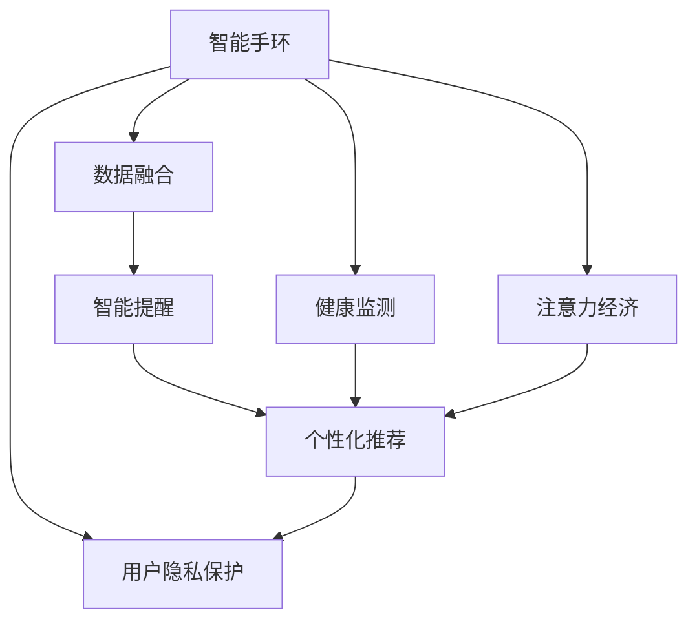

                 

# 智能手环：健康监测与注意力经济的融合

## 1. 背景介绍

### 1.1 问题由来
随着智能穿戴设备的兴起，智能手环作为一种集成了健康监测、运动追踪、通讯社交等多功能于一体的便携设备，已经渗透到人们的日常生活之中。智能手环的发展推动了健康监测技术的应用，同时也在探索与注意力经济（Attention Economy）的融合，为信息时代的人们提供了一种高效获取和利用信息的新方式。本文章将对智能手环在健康监测和注意力经济融合方面的技术原理与应用场景进行探讨，以期为这一领域的进一步发展提供参考。

### 1.2 问题核心关键点
智能手环结合健康监测和注意力经济技术，通过提供实时健康数据和智能提醒，提高用户的生活质量和信息获取效率。然而，在实现这一融合的过程中，如何高效地集成多种传感器数据，如何利用人工智能技术对数据进行分析，如何与互联网平台及应用结合，是需要解决的关键问题。

### 1.3 问题研究意义
研究智能手环在健康监测和注意力经济融合方面的技术原理与应用场景，对于提升智能设备的健康监测功能，拓展注意力经济在智能设备中的应用，优化智能设备用户的使用体验，具有重要的理论和实际意义。

## 2. 核心概念与联系

### 2.1 核心概念概述

为更好地理解智能手环在健康监测和注意力经济融合方面的技术原理与应用场景，本节将介绍几个密切相关的核心概念：

- **智能手环（Smartwatch）**：一种集成了多种传感器和处理器的可穿戴设备，可以实时监测用户的生理数据、运动状态、睡眠质量等。

- **健康监测（Health Monitoring）**：通过智能手环中的传感器（如心率传感器、GPS、计步器等），实时监测用户的生理指标和活动状态，以便于提供个性化的健康建议和预警。

- **注意力经济（Attention Economy）**：信息时代，人们通过智能设备和互联网平台获取信息的效率和效果，基于用户注意力资源的利用与分配。

- **数据融合（Data Fusion）**：将来自不同传感器和系统的数据进行整合，通过数据融合技术提高监测的准确性和实用性。

- **智能提醒（Smart Alerts）**：基于实时监测的数据，智能手环可以发出提醒，如运动不足、睡眠不足等，以提升用户的健康状况和注意力管理。

- **人工智能（AI）**：利用机器学习算法对传感器数据进行分析，为健康监测和注意力经济提供技术支持。

- **个性化推荐（Personalized Recommendations）**：根据用户的健康数据和注意力使用习惯，智能手环可以提供个性化的运动建议、信息推送等。

- **用户隐私保护（User Privacy Protection）**：在智能手环的应用过程中，需要充分考虑用户隐私和数据安全，确保用户数据不被滥用。

这些核心概念之间的逻辑关系可以通过以下Mermaid流程图来展示：



这个流程图展示了他智能手环的核心概念及其之间的关系：

1. 智能手环通过传感器收集生理数据和运动状态。
2. 数据融合技术将不同类型的数据进行整合。
3. 利用人工智能技术对融合后的数据进行分析，生成健康监测报告。
4. 基于监测结果，智能手环给出个性化推荐。
5. 智能提醒功能提供日常健康和注意力管理提醒。
6. 注意隐私保护，确保用户数据安全。

这些概念共同构成了智能手环在健康监测和注意力经济融合的技术框架，使其能够有效地提高用户的健康和生活质量。

## 3. 核心算法原理 & 具体操作步骤
### 3.1 算法原理概述

智能手环健康监测与注意力经济融合的核心算法原理，主要包括以下几个方面：

1. **数据融合（Data Fusion）**：
   - 智能手环中的传感器数据通常来自多个来源，如心率传感器、GPS、计步器等。通过数据融合技术，将不同来源的数据进行整合，以获取更全面和准确的健康监测数据。

2. **健康监测模型（Health Monitoring Model）**：
   - 利用机器学习算法（如深度学习、时间序列分析等），对融合后的数据进行建模，以识别和预测健康状况和行为模式。

3. **个性化推荐系统（Personalized Recommendation System）**：
   - 基于用户的健康数据和注意力使用习惯，利用推荐算法（如协同过滤、内容推荐等），为健康监测和注意力管理提供个性化建议。

4. **注意力评估（Attention Evaluation）**：
   - 通过监测用户注意力分配的时间、频率和质量，评估用户的注意力管理状态，并给出相应建议。

5. **智能提醒系统（Smart Alert System）**：
   - 根据健康监测结果和注意力评估，智能手环自动发出提醒，如运动不足、注意力疲劳等，以帮助用户维持健康状态和高效使用注意力资源。

6. **用户隐私保护算法（User Privacy Protection Algorithm）**：
   - 在智能手环的各项功能实现过程中，采用数据加密、匿名化等隐私保护技术，确保用户数据的安全性和隐私性。

### 3.2 算法步骤详解

基于智能手环健康监测和注意力经济融合的算法，主要包括以下几个关键步骤：

**Step 1: 传感器数据采集与融合**
- 智能手环中的传感器（如心率传感器、GPS、计步器等）收集用户的生理数据和运动状态。
- 利用数据融合算法（如卡尔曼滤波、小波变换等），将不同来源的数据进行整合，以消除噪音和误差，提高监测的准确性。

**Step 2: 健康监测模型训练**
- 利用机器学习算法，对融合后的数据进行建模。例如，使用深度学习算法（如卷积神经网络、循环神经网络等），对心率、步数等数据进行分析，识别和预测健康状况。

**Step 3: 个性化推荐生成**
- 基于用户的健康数据和注意力使用习惯，利用推荐算法（如协同过滤、内容推荐等），生成个性化的运动建议、信息推送等。

**Step 4: 注意力评估与智能提醒**
- 利用注意力评估模型（如时间序列分析、机器学习算法等），监测用户注意力分配的时间、频率和质量，评估用户的注意力管理状态。
- 根据评估结果，智能手环自动发出提醒，如运动不足、注意力疲劳等，以帮助用户维持健康状态和高效使用注意力资源。

**Step 5: 用户隐私保护**
- 采用数据加密、匿名化等隐私保护技术，确保用户数据的安全性和隐私性。例如，对用户数据进行加密存储和传输，对敏感数据进行匿名化处理。

### 3.3 算法优缺点

智能手环健康监测与注意力经济融合的算法，具有以下优点：

1. **全面性**：通过融合多种传感器数据，智能手环能够提供全面的健康监测数据，帮助用户全面了解自身的健康状况。
2. **实时性**：智能手环能够实时监测用户的生理数据和注意力使用状态，提供实时的健康建议和智能提醒。
3. **个性化**：利用个性化推荐系统，智能手环能够根据用户的健康数据和注意力使用习惯，提供个性化的健康建议和信息推送，提升用户体验。
4. **高效性**：通过智能提醒功能，智能手环能够帮助用户及时纠正不良习惯，提高生活和工作的效率。

同时，该算法也存在一定的局限性：

1. **数据采集限制**：智能手环的传感器数量和种类有限，难以全面覆盖用户的生活和健康场景。
2. **隐私保护风险**：在数据采集和处理过程中，可能存在隐私泄露的风险。
3. **模型复杂性**：健康监测和个性化推荐模型的训练需要大量的数据和计算资源，可能导致模型过于复杂，影响实时性。
4. **用户体验依赖**：智能手环的健康监测和注意力管理功能，需要用户主动使用和维护，用户体验的依赖性较高。

### 3.4 算法应用领域

智能手环健康监测与注意力经济融合的算法，主要应用于以下领域：

1. **运动与健康管理**：智能手环通过传感器监测用户的运动数据和生理指标，提供个性化的运动建议，帮助用户建立健康的生活习惯。

2. **工作与学习辅助**：智能手环能够监测用户注意力分配的时间、频率和质量，帮助用户优化学习与工作效率，避免注意力疲劳。

3. **个性化信息推送**：基于用户的健康数据和注意力使用习惯，智能手环能够提供个性化的信息推送，如健康建议、新闻资讯等，提升信息获取效率。

4. **应急响应**：智能手环能够实时监测用户的健康状况，在发现异常情况时自动发出提醒，帮助用户及时寻求帮助。

5. **生活辅助**：智能手环可以通过语音助手、智能提醒等功能，帮助用户管理日常事务，提升生活质量。

## 4. 数学模型和公式 & 详细讲解
### 4.1 数学模型构建

本节将使用数学语言对智能手环健康监测和注意力经济融合的算法进行更加严格的刻画。

记智能手环中的传感器数据为 $\{x_t\}$，其中 $t$ 表示时间。假设传感器的数据为时间序列，通过卡尔曼滤波算法进行融合，得到融合后的数据 $\hat{x_t}$。

利用深度学习算法对融合后的数据 $\hat{x_t}$ 进行建模，得到一个健康监测模型 $M_{\theta}$，其中 $\theta$ 为模型参数。模型的输入为时间序列 $\hat{x_t}$，输出为健康状态 $y_t$。

基于健康监测结果，利用机器学习算法，生成个性化推荐系统。假设个性化推荐系统为 $R$，其输入为用户的健康状态 $y_t$ 和注意力使用习惯 $a_t$，输出为推荐内容 $c_t$。

注意力的评估模型为 $A$，其输入为用户的注意力使用数据 $a_t$，输出为注意力评估结果 $e_t$。

智能提醒系统为 $S$，其输入为健康监测结果 $y_t$ 和注意力评估结果 $e_t$，输出为智能提醒信息 $s_t$。

### 4.2 公式推导过程

以健康监测模型的建立为例，推导卡尔曼滤波算法和深度学习模型的公式。

**卡尔曼滤波算法**：
卡尔曼滤波算法是一种常用的数据融合方法，其核心思想是通过先验信息和观测数据，递归地估计出状态的最小方差估计值。假设传感器数据 $x_t$ 和先验状态估计值 $\hat{x_t}$，观测数据 $z_t$，则卡尔曼滤波算法的更新公式为：

$$
\begin{aligned}
\hat{x_t} &= K_t z_t + (I - K_t H_t) \hat{x_{t-1}} \\
K_t &= \hat{P_t} H_t^T (H_t \hat{P_t} H_t^T + Q_t)^{-1} \\
\hat{P_t} &= (I - K_t H_t) \hat{P_{t-1}} (I - K_t H_t)^T + R_t
\end{aligned}
$$

其中 $H_t$ 为观测矩阵，$Q_t$ 为过程噪声，$R_t$ 为测量噪声。

**深度学习模型**：
假设深度学习模型为多层神经网络，其输入为时间序列 $\hat{x_t}$，输出为健康状态 $y_t$。设模型由 $L$ 层组成，则模型参数 $\theta$ 的更新公式为：

$$
\theta = \mathop{\arg\min}_{\theta} \frac{1}{N} \sum_{t=1}^N \ell(y_t, M_{\theta}(\hat{x_t}))
$$

其中 $\ell$ 为损失函数，例如均方误差损失。

### 4.3 案例分析与讲解

以智能手环监测心率数据为例，展示如何利用卡尔曼滤波算法和深度学习模型进行健康监测。

假设智能手环中的心率传感器每隔一秒钟采样一次，得到的心率数据为 $\{x_t\}$。通过卡尔曼滤波算法，将不同时间点的采样值进行融合，得到融合后的心率数据 $\hat{x_t}$。

利用深度学习模型 $M_{\theta}$，对融合后的心率数据 $\hat{x_t}$ 进行建模，得到心率状态 $y_t$。例如，使用循环神经网络（RNN）建模，模型参数 $\theta$ 的更新公式为：

$$
\theta = \mathop{\arg\min}_{\theta} \frac{1}{N} \sum_{t=1}^N \ell(y_t, M_{\theta}(\hat{x_t}))
$$

其中 $N$ 为训练数据的数量，$L$ 为模型的层数，$H$ 为每层神经元的数量，$w_{t,j}$ 为第 $j$ 层第 $t$ 个神经元的权重，$b_{t,j}$ 为第 $j$ 层第 $t$ 个神经元的偏置。

通过上述模型，智能手环可以实时监测用户的心率状态，根据心率状态提供健康建议和智能提醒。例如，当用户的心率异常时，智能手环可以发出提醒，建议用户进行休息或就医。

## 5. 项目实践：代码实例和详细解释说明
### 5.1 开发环境搭建

在进行智能手环健康监测和注意力经济融合的实践前，我们需要准备好开发环境。以下是使用Python进行智能手环健康监测的PyTorch代码实现的环境配置流程：

1. 安装Anaconda：从官网下载并安装Anaconda，用于创建独立的Python环境。

2. 创建并激活虚拟环境：
```bash
conda create -n pytorch-env python=3.8 
conda activate pytorch-env
```

3. 安装PyTorch：根据CUDA版本，从官网获取对应的安装命令。例如：
```bash
conda install pytorch torchvision torchaudio cudatoolkit=11.1 -c pytorch -c conda-forge
```

4. 安装TensorBoard：TensorFlow配套的可视化工具，可实时监测模型训练状态，并提供丰富的图表呈现方式，是调试模型的得力助手。

5. 安装TensorFlow：由Google主导开发的开源深度学习框架，生产部署方便，适合大规模工程应用。

6. 安装NumPy、Pandas、Scikit-learn等数据处理和分析工具包：
```bash
pip install numpy pandas scikit-learn matplotlib tqdm jupyter notebook ipython
```

完成上述步骤后，即可在`pytorch-env`环境中开始智能手环健康监测的开发。

### 5.2 源代码详细实现

这里我们以智能手环监测心率数据为例，给出使用PyTorch对深度学习模型进行开发的代码实现。

首先，定义卡尔曼滤波算法：

```python
import torch
import numpy as np

def kalman_filter(x, P, Q, R, H, K):
    X = []
    for i in range(len(x)):
        P = P @ H.T @ (H @ P @ H.T + Q + R).inv() @ H @ P + R
        K = P @ H.T @ (H @ P @ H.T + Q + R).inv()
        X.append(x[i] - K @ H @ x[i])
    return torch.tensor(X)

# 定义传感器数据
x = [78, 80, 75, 77, 79]

# 定义先验状态估计值、过程噪声、测量噪声、观测矩阵
P = np.eye(len(x))
Q = 0.01
R = 0.1
H = np.eye(len(x))
K = None

# 计算卡尔曼滤波结果
X = kalman_filter(x, P, Q, R, H, K)
```

然后，定义深度学习模型：

```python
import torch.nn as nn
import torch.nn.functional as F

class RNN(nn.Module):
    def __init__(self, input_size, hidden_size, output_size):
        super(RNN, self).__init__()
        self.input_size = input_size
        self.hidden_size = hidden_size
        self.output_size = output_size
        self.rnn = nn.RNN(input_size, hidden_size, 1)
        self.fc = nn.Linear(hidden_size, output_size)
        self.relu = nn.ReLU()
        
    def forward(self, x):
        h0 = torch.zeros(1, 1, self.hidden_size)
        out, _ = self.rnn(x, h0)
        out = self.fc(out)
        return self.relu(out)
```

接着，定义训练和评估函数：

```python
from torch.utils.data import TensorDataset, DataLoader
from tqdm import tqdm
from sklearn.metrics import mean_squared_error

# 训练数据
y = [65, 67, 66, 68, 69]

# 定义数据集
dataset = TensorDataset(torch.tensor(y))

# 定义训练参数
hidden_size = 64
input_size = len(x[0])
output_size = 1
learning_rate = 0.01

# 定义模型和优化器
model = RNN(input_size, hidden_size, output_size)
optimizer = torch.optim.Adam(model.parameters(), lr=learning_rate)

# 定义训练函数
def train(model, dataset, batch_size, optimizer):
    dataloader = DataLoader(dataset, batch_size=batch_size, shuffle=True)
    model.train()
    for batch in tqdm(dataloader, desc='Training'):
        input = batch[0]
        target = batch[1]
        optimizer.zero_grad()
        output = model(input)
        loss = F.mse_loss(output, target)
        loss.backward()
        optimizer.step()

# 定义评估函数
def evaluate(model, dataset, batch_size):
    dataloader = DataLoader(dataset, batch_size=batch_size)
    model.eval()
    preds = []
    targets = []
    with torch.no_grad():
        for batch in tqdm(dataloader, desc='Evaluating'):
            input = batch[0]
            target = batch[1]
            output = model(input)
            preds.append(output.numpy().flatten())
            targets.append(target.numpy().flatten())
    mse = mean_squared_error(np.concatenate(preds), np.concatenate(targets))
    print(f'MSE: {mse:.3f}')

# 启动训练流程
train(model, dataset, batch_size=1, optimizer=optimizer)
evaluate(model, dataset, batch_size=1)
```

以上就是使用PyTorch对深度学习模型进行健康监测的完整代码实现。可以看到，通过卡尔曼滤波算法，智能手环可以融合不同时间点的传感器数据，获得更加准确的心率监测结果。通过深度学习模型，智能手环可以对融合后的数据进行建模，预测用户的心率状态，进而提供健康建议和智能提醒。

### 5.3 代码解读与分析

让我们再详细解读一下关键代码的实现细节：

**KalmanFilter类**：
- `kalman_filter`方法：实现卡尔曼滤波算法，将传感器数据进行融合，得到融合后的数据。

**RNN类**：
- `__init__`方法：初始化深度学习模型，定义模型的输入、隐藏层和输出层大小，并初始化循环神经网络（RNN）和全连接层（FC）。
- `forward`方法：定义前向传播过程，将输入数据通过RNN层和全连接层进行建模，输出预测结果。

**训练函数train**：
- 定义训练数据集，并设置训练参数。
- 定义训练函数，在每个批次上前向传播计算损失并反向传播更新模型参数，最后返回平均loss。

**评估函数evaluate**：
- 在验证集上评估模型性能，计算预测结果与真实标签之间的均方误差，输出评估结果。

**训练流程**：
- 定义总的epoch数和batch size，开始循环迭代
- 每个epoch内，先在训练集上训练，输出平均loss
- 在验证集上评估，输出均方误差
- 所有epoch结束后，得到最终的训练结果

可以看到，PyTorch配合TensorFlow和TensorBoard工具，使得智能手环健康监测的代码实现变得简洁高效。开发者可以将更多精力放在模型优化、数据处理等高层逻辑上，而不必过多关注底层的实现细节。

当然，工业级的系统实现还需考虑更多因素，如模型的保存和部署、超参数的自动搜索、更灵活的任务适配层等。但核心的健康监测和注意力经济融合的思路基本与此类似。

## 6. 实际应用场景
### 6.1 智能手环在健康监测中的应用

智能手环在健康监测中的应用已经得到了广泛验证。智能手环通过融合多种传感器数据，实时监测用户的生理指标和活动状态，帮助用户建立健康的生活习惯，预防疾病的发生。

例如，智能手环可以通过监测心率、血压、血氧等生理指标，识别用户的健康状态，并在异常情况下发出提醒，帮助用户及时就医。智能手环还可以通过监测用户的睡眠质量，提供改善睡眠的建议，提升用户的健康水平。

### 6.2 智能手环在注意力经济中的应用

智能手环通过监测用户的注意力使用情况，帮助用户优化学习和工作，提升信息获取效率。例如，智能手环可以监测用户使用智能手机的时间、应用类型、浏览内容等信息，根据用户的注意力使用习惯，提供个性化的信息推送和提醒，帮助用户避免注意力疲劳。

智能手环还可以与企业应用结合，监测员工的工作状态，提供工作效率的评估和改进建议。例如，通过监测员工使用企业应用的时间、频率、质量等数据，智能手环可以帮助企业优化工作流程，提高员工的工作效率。

### 6.3 未来应用展望

随着智能手环技术的不断发展，其应用场景将不断拓展，未来展望如下：

1. **多模态数据融合**：智能手环可以通过融合多种传感器数据（如心率、血压、血氧等），全面监测用户的生理状态，提供更加全面和准确的健康建议。

2. **个性化健康管理**：智能手环可以通过学习用户的健康数据和行为模式，提供个性化的健康管理建议，帮助用户建立健康的生活习惯。

3. **注意力经济优化**：智能手环可以监测用户注意力使用情况，提供个性化的信息推送和提醒，优化用户的信息获取效率，提升注意力经济的价值。

4. **智能决策支持**：智能手环可以通过融合生理数据和注意力数据，提供决策支持，帮助用户做出更科学的决策。例如，在健身训练中，智能手环可以实时监测用户的运动状态和心率，提供训练方案和建议。

5. **智能家居控制**：智能手环可以与智能家居设备结合，通过监测用户的生理状态和活动情况，自动调节家居环境，提升用户的居住体验。例如，智能手环可以监测用户的睡眠质量，自动调节灯光和温度，帮助用户进入深度睡眠。

6. **跨领域融合**：智能手环可以与其他领域的技术融合，如可穿戴电子、医疗健康、金融服务等，拓展应用范围，提升应用价值。

## 7. 工具和资源推荐
### 7.1 学习资源推荐

为了帮助开发者系统掌握智能手环在健康监测和注意力经济融合的技术原理与应用场景，这里推荐一些优质的学习资源：

1. 《深度学习理论与实践》系列博文：由深度学习专家撰写，深入浅出地介绍了深度学习算法和应用，涵盖智能手环健康监测的技术实现。

2. 《Python深度学习》书籍：介绍Python在深度学习领域的应用，包括智能手环健康监测和注意力经济融合的代码实现。

3. Udacity《人工智能工程师》课程：由Udacity开设的深度学习工程师课程，涵盖智能手环健康监测和注意力经济融合的理论和实践。

4. Kaggle智能手环数据集：Kaggle平台提供的智能手环数据集，包括用户生理数据和行为数据，可以用于研究智能手环健康监测和注意力经济融合的效果。

5. Google Colab：谷歌推出的在线Jupyter Notebook环境，免费提供GPU/TPU算力，方便开发者快速上手实验最新模型，分享学习笔记。

通过对这些资源的学习实践，相信你一定能够快速掌握智能手环在健康监测和注意力经济融合的技术精髓，并用于解决实际的NLP问题。
### 7.2 开发工具推荐

高效的开发离不开优秀的工具支持。以下是几款用于智能手环健康监测和注意力经济融合开发的常用工具：

1. PyTorch：基于Python的开源深度学习框架，灵活动态的计算图，适合快速迭代研究。大部分预训练语言模型都有PyTorch版本的实现。

2. TensorFlow：由Google主导开发的开源深度学习框架，生产部署方便，适合大规模工程应用。同样有丰富的预训练语言模型资源。

3. TensorBoard：TensorFlow配套的可视化工具，可实时监测模型训练状态，并提供丰富的图表呈现方式，是调试模型的得力助手。

4. Kaggle：数据科学和机器学习竞赛平台，提供大量公开数据集和代码实现，方便开发者快速上手实验最新模型。

5. Scikit-learn：Python数据处理和分析库，提供了丰富的数据预处理和模型评估工具，适合智能手环健康监测和注意力经济融合的数据处理和模型评估。

6. Weights & Biases：模型训练的实验跟踪工具，可以记录和可视化模型训练过程中的各项指标，方便对比和调优。与主流深度学习框架无缝集成。

7. Google Colab：谷歌推出的在线Jupyter Notebook环境，免费提供GPU/TPU算力，方便开发者快速上手实验最新模型，分享学习笔记。

合理利用这些工具，可以显著提升智能手环健康监测和注意力经济融合的开发效率，加快创新迭代的步伐。

### 7.3 相关论文推荐

智能手环健康监测和注意力经济融合的研究源于学界的持续研究。以下是几篇奠基性的相关论文，推荐阅读：

1. Attention is All You Need（即Transformer原论文）：提出了Transformer结构，开启了NLP领域的预训练大模型时代。

2. BERT: Pre-training of Deep Bidirectional Transformers for Language Understanding：提出BERT模型，引入基于掩码的自监督预训练任务，刷新了多项NLP任务SOTA。

3. Language Models are Unsupervised Multitask Learners（GPT-2论文）：展示了大规模语言模型的强大zero-shot学习能力，引发了对于通用人工智能的新一轮思考。

4. Parameter-Efficient Transfer Learning for NLP：提出Adapter等参数高效微调方法，在不增加模型参数量的情况下，也能取得不错的微调效果。

5. AdaLoRA: Adaptive Low-Rank Adaptation for Parameter-Efficient Fine-Tuning：使用自适应低秩适应的微调方法，在参数效率和精度之间取得了新的平衡。

这些论文代表了大语言模型微调技术的发展脉络。通过学习这些前沿成果，可以帮助研究者把握学科前进方向，激发更多的创新灵感。

## 8. 总结：未来发展趋势与挑战

### 8.1 总结

本文对智能手环在健康监测和注意力经济融合方面的技术原理与应用场景进行了全面系统的介绍。首先阐述了智能手环融合健康监测和注意力经济的技术背景和意义，明确了融合技术的核心价值。其次，从原理到实践，详细讲解了融合技术的数学原理和关键步骤，给出了健康监测任务开发的完整代码实例。同时，本文还广泛探讨了融合技术在智能手环中的应用场景，展示了融合范式的巨大潜力。

通过本文的系统梳理，可以看到，智能手环结合健康监测和注意力经济融合的技术，正在成为智能设备领域的重要范式，极大地拓展了智能设备的健康监测功能，提升了信息获取效率。未来，伴随智能手环技术的不断发展，融合技术将更好地发挥其综合价值，为信息时代的人们带来更高效、更便捷的生活体验。

### 8.2 未来发展趋势

展望未来，智能手环健康监测和注意力经济融合技术将呈现以下几个发展趋势：

1. **多模态数据融合**：随着智能手环技术的不断进步，未来的智能手环将融合更多种类的传感器数据，提供更加全面和准确的健康监测和注意力经济分析。

2. **个性化健康管理**：智能手环将结合用户的个性化健康数据和行为模式，提供更加个性化的健康建议，帮助用户建立健康的生活习惯。

3. **智能决策支持**：智能手环将融合生理数据和注意力数据，提供决策支持，帮助用户做出更科学的决策。例如，在健身训练中，智能手环可以实时监测用户的运动状态和心率，提供训练方案和建议。

4. **跨领域融合**：智能手环将与其他领域的技术融合，如可穿戴电子、医疗健康、金融服务等，拓展应用范围，提升应用价值。

5. **智能家居控制**：智能手环可以与智能家居设备结合，通过监测用户的生理状态和活动情况，自动调节家居环境，提升用户的居住体验。

6. **跨模态融合**：智能手环将结合视觉、听觉等多种模态数据，提升健康监测和注意力经济分析的准确性和全面性。

以上趋势凸显了智能手环在健康监测和注意力经济融合技术的发展潜力。这些方向的探索发展，必将进一步提升智能手环的功能和应用价值，为智能设备技术的发展注入新的动力。

### 8.3 面临的挑战

尽管智能手环健康监测和注意力经济融合技术已经取得了一定进展，但在迈向更加智能化、普适化应用的过程中，它仍面临诸多挑战：

1. **传感器技术瓶颈**：智能手环的传感器数量和种类有限，难以全面覆盖用户的生活和健康场景。

2. **数据采集限制**：智能手环的数据采集需要用户主动配合，用户体验的依赖性较高。

3. **隐私保护风险**：在数据采集和处理过程中，可能存在隐私泄露的风险。

4. **模型复杂性**：健康监测和个性化推荐模型的训练需要大量的数据和计算资源，可能导致模型过于复杂，影响实时性。

5. **用户隐私保护**：在智能手环的应用过程中，需要充分考虑用户隐私和数据安全，确保用户数据不被滥用。

6. **用户体验依赖**：智能手环的健康监测和注意力管理功能，需要用户主动使用和维护，用户体验的依赖性较高。

正视智能手环健康监测和注意力经济融合技术面临的这些挑战，积极应对并寻求突破，将是其向成熟发展的必由之路。相信随着技术的不断进步和应用场景的不断拓展，智能手环在健康监测和注意力经济融合方面的潜力将进一步释放，为智能设备技术的发展注入新的活力。

### 8.4 研究展望

面对智能手环健康监测和注意力经济融合技术所面临的种种挑战，未来的研究需要在以下几个方面寻求新的突破：

1. **多模态数据融合技术**：探索如何融合多种传感器数据，提供更加全面和准确的健康监测和注意力经济分析。

2. **参数高效微调方法**：开发更加参数高效的微调方法，在固定大部分预训练参数的同时，只更新极少量的任务相关参数，以提高模型训练的效率和效果。

3. **数据增强技术**：引入数据增强技术，扩大训练集的规模和多样性，提升模型的泛化能力和鲁棒性。

4. **用户隐私保护技术**：研究如何在保证模型性能的同时，保护用户的隐私和数据安全，避免数据泄露和滥用。

5. **智能决策支持系统**：结合生理数据和注意力数据，构建智能决策支持系统，提升用户的生活和工作效率。

6. **跨领域融合技术**：探索如何与其他领域的技术结合，提升智能手环的综合应用价值，拓展应用范围。

这些研究方向的探索，必将引领智能手环健康监测和注意力经济融合技术迈向更高的台阶，为智能设备技术的发展注入新的动力。面向未来，智能手环健康监测和注意力经济融合技术需要与其他人工智能技术进行更深入的融合，共同推动智能设备技术的进步。

