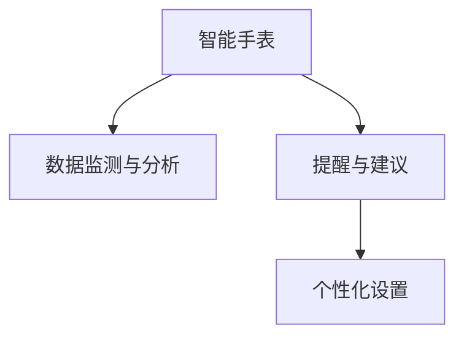

                 

# 智能手表在注意力管理中的应用

在现代社会中，信息过载已成为普遍现象，而注意力管理（Attention Management）变得尤为重要。智能手表作为一种便携式设备，其小屏幕和低功耗的特性使得它在注意力管理中具有独特的优势。本文将深入探讨智能手表在注意力管理中的应用，包括核心概念、算法原理、操作步骤、实际应用场景、工具和资源推荐，以及未来发展趋势与挑战。

## 1. 背景介绍

### 1.1 问题由来
随着信息技术的飞速发展，人们每天都会接触到大量的信息，包括社交媒体、电子邮件、新闻、娱乐等。信息过载不仅容易引发认知负荷过重，还可能导致注意力分散，影响工作效率和生活质量。因此，有效的注意力管理成为当前亟需解决的问题。

智能手表作为一款便携式设备，集成了时间管理、通知提醒、健康监测等多种功能，能够实时获取用户的生活和健康数据，从而在注意力管理中扮演了重要角色。

### 1.2 问题核心关键点
智能手表在注意力管理中的核心关键点在于：

- **数据采集与分析**：智能手表可以实时监测用户的使用行为和生理指标，如心率和压力水平。
- **提醒与建议**：基于用户数据，智能手表可以提供及时的通知提醒和健康建议，帮助用户专注于当前任务。
- **个性化设置**：智能手表可以根据用户的习惯和偏好，智能调整提醒方式和时间，提高使用体验。

## 2. 核心概念与联系

### 2.1 核心概念概述

为更好地理解智能手表在注意力管理中的应用，本节将介绍几个关键概念：

- **智能手表**：一种集成了时间管理、健康监测、通知提醒等多功能的便携式设备，可以实时采集用户的生活和健康数据。
- **注意力管理**：指通过科学的方法，帮助用户有效管理注意力，提升工作效率和生活质量。
- **数据监测与分析**：利用智能手表采集的用户数据，如心率、压力水平、使用习惯等，进行分析，帮助用户了解注意力变化趋势，及时采取干预措施。
- **提醒与建议**：根据用户数据，智能手表可以提供个性化的提醒和建议，帮助用户保持专注，减少注意力分散。

这些概念之间的逻辑关系可以通过以下Mermaid流程图来展示：



这个流程图展示了智能手表在注意力管理中的应用流程：

1. 智能手表实时监测用户数据。
2. 基于监测数据进行分析和建议。
3. 提供个性化的提醒和设置。

## 3. 核心算法原理 & 具体操作步骤
### 3.1 算法原理概述

智能手表在注意力管理中的应用主要基于用户数据监测与分析，提供个性化的提醒和建议。其核心算法包括数据预处理、特征提取、模型训练和预测等步骤。

### 3.2 算法步骤详解

#### 3.2.1 数据预处理
智能手表采集的用户数据包括时间戳、事件类型、使用时长、心率、压力水平等。首先需要对这些数据进行预处理，包括数据清洗、缺失值填补、数据归一化等。

#### 3.2.2 特征提取
利用预处理后的数据，提取有用的特征，如使用时长、心率变化、压力波动等。特征提取的方法包括统计特征、时间序列特征、频域特征等。

#### 3.2.3 模型训练
根据提取的特征，选择适合的机器学习模型进行训练。常见的模型包括随机森林、支持向量机、神经网络等。模型训练的目标是构建一个能够预测用户注意力状态的分类器。

#### 3.2.4 预测与提醒
利用训练好的模型，对用户当前的注意力状态进行预测。根据预测结果，智能手表可以提供及时的通知提醒，帮助用户保持专注。

### 3.3 算法优缺点

#### 3.3.1 优点
智能手表在注意力管理中的应用具有以下优点：

- **实时监测**：智能手表可以实时监测用户的生活和健康数据，提供即时反馈。
- **数据全面**：采集的数据包括时间戳、事件类型、使用时长、心率、压力水平等多种维度，信息全面。
- **个性化提醒**：基于用户数据，智能手表提供个性化的提醒和建议，提高用户使用体验。

#### 3.3.2 缺点
智能手表在注意力管理中的应用也存在一些缺点：

- **隐私问题**：智能手表需要实时采集用户数据，存在隐私泄露的风险。
- **依赖设备**：智能手表依赖设备本身的功能和电池寿命，如果设备出现故障或电池耗尽，功能将受到影响。
- **数据质量**：数据采集的准确性和及时性直接影响预测结果，需要用户正确佩戴和操作设备。

### 3.4 算法应用领域

智能手表在注意力管理中的应用领域包括：

- **工作与学习**：通过智能手表提醒和建议，帮助用户在会议、学习、办公等场景中保持专注。
- **健康与生活**：监测用户的压力水平、睡眠情况等生理指标，及时提供健康建议，提升生活质量。
- **运动与健身**：智能手表记录运动数据，结合生理指标进行分析和建议，促进健康生活方式。
- **日常管理**：提醒用户及时完成任务、休息、喝水等，帮助管理日常事务。

## 4. 数学模型和公式 & 详细讲解  
### 4.1 数学模型构建

智能手表在注意力管理中的应用涉及到数据预处理、特征提取、模型训练和预测等步骤。以下将分别介绍这些步骤的数学模型构建。

#### 4.1.1 数据预处理模型
数据预处理包括数据清洗、缺失值填补、数据归一化等。数据清洗的目的是去除无效和异常数据，确保数据的准确性和一致性。缺失值填补的方法包括均值填补、插值法等。数据归一化的目的是将不同尺度的数据转换到相同的范围，便于后续处理。

#### 4.1.2 特征提取模型
特征提取的目的是从原始数据中提取有用的信息，供模型训练和预测使用。常用的特征提取方法包括统计特征、时间序列特征、频域特征等。

#### 4.1.3 模型训练模型
模型训练的目的是构建一个能够预测用户注意力状态的分类器。常用的模型包括随机森林、支持向量机、神经网络等。模型训练的目标是最小化预测误差，提高模型准确性。

#### 4.1.4 预测与提醒模型
预测与提醒的目的是根据用户当前的状态，提供及时的通知提醒。常用的预测方法包括时间序列预测、状态空间模型等。

### 4.2 公式推导过程

#### 4.2.1 数据预处理公式
设 $X$ 为原始数据集，$N$ 为样本数，$M$ 为特征数，$d$ 为缺失值数，则数据清洗公式为：

$$
X_{clean} = \frac{X}{1 - d}
$$

#### 4.2.2 特征提取公式
设 $X_{clean}$ 为清洗后的数据集，$F$ 为特征向量，则特征提取公式为：

$$
F = \frac{X_{clean} - \mu}{\sigma}
$$

其中 $\mu$ 为均值，$\sigma$ 为标准差。

#### 4.2.3 模型训练公式
设 $T$ 为训练集，$M$ 为模型，则模型训练公式为：

$$
M = \arg\min_{M} \frac{1}{N} \sum_{i=1}^{N} \ell(y_i, M(x_i))
$$

其中 $\ell$ 为损失函数，$y_i$ 为标签，$x_i$ 为特征向量。

#### 4.2.4 预测与提醒公式
设 $X_{test}$ 为测试集，$M$ 为模型，则预测与提醒公式为：

$$
y_{pred} = M(x)
$$

其中 $x$ 为当前状态数据，$y_{pred}$ 为预测结果。

### 4.3 案例分析与讲解

#### 4.3.1 案例背景
假设一个智能手表应用，用于监测用户的注意力状态。用户佩戴智能手表后，可以实时记录使用时间、心率、压力水平等数据。系统通过这些数据，预测用户当前是否处于专注状态，并根据需要提供提醒。

#### 4.3.2 数据预处理
假设采集到的数据为 $X_{raw}$，其中包含时间戳、事件类型、使用时长、心率、压力水平等。数据预处理步骤如下：

1. 数据清洗：去除无效和异常数据，确保数据的准确性和一致性。
2. 缺失值填补：使用均值填补方法填补缺失值。
3. 数据归一化：将不同尺度的数据转换到相同的范围，便于后续处理。

#### 4.3.3 特征提取
假设数据预处理后的数据为 $X_{clean}$，则特征提取步骤如下：

1. 统计特征：计算使用时长、心率平均值、压力平均值等。
2. 时间序列特征：计算连续一段时间内使用时长、心率、压力的变化趋势。
3. 频域特征：通过傅里叶变换，提取时间序列数据的频域特征。

#### 4.3.4 模型训练
假设特征提取后的数据为 $F$，则模型训练步骤如下：

1. 选择随机森林作为分类器。
2. 将 $F$ 作为输入，标签 $y$ 作为输出，训练随机森林模型。
3. 通过交叉验证，确定模型的最佳参数。

#### 4.3.5 预测与提醒
假设训练好的模型为 $M$，则预测与提醒步骤如下：

1. 实时监测用户当前的状态数据 $x$。
2. 将 $x$ 输入模型 $M$，得到预测结果 $y_{pred}$。
3. 根据 $y_{pred}$，决定是否提供提醒，如定时器、振动提醒等。

## 5. 项目实践：代码实例和详细解释说明
### 5.1 开发环境搭建

在进行智能手表注意力管理应用的开发前，需要准备好开发环境。以下是使用Python进行开发的环境配置流程：

1. 安装Anaconda：从官网下载并安装Anaconda，用于创建独立的Python环境。

2. 创建并激活虚拟环境：
```bash
conda create -n attention-management python=3.8 
conda activate attention-management
```

3. 安装Python库：
```bash
pip install pandas numpy scikit-learn transformers torch torchvision
```

4. 安装相关硬件设备驱动程序：根据使用的智能手表设备，安装相应的驱动程序。

### 5.2 源代码详细实现

以下是一个简单的Python代码实例，用于智能手表注意力管理的实现：

```python
import pandas as pd
from sklearn.ensemble import RandomForestClassifier
from sklearn.model_selection import train_test_split
from sklearn.metrics import accuracy_score

# 1. 数据预处理
def preprocess_data(data):
    # 数据清洗
    data = data.dropna()
    
    # 数据归一化
    data['heart_rate'] = (data['heart_rate'] - data['heart_rate'].mean()) / data['heart_rate'].std()
    data['stress_level'] = (data['stress_level'] - data['stress_level'].mean()) / data['stress_level'].std()
    
    return data

# 2. 特征提取
def extract_features(data):
    # 统计特征
    features = data[['use_time', 'heart_rate_mean', 'stress_level_mean']]
    
    # 时间序列特征
    features['use_time_diff'] = data['use_time'].diff()
    features['heart_rate_diff'] = data['heart_rate'].diff()
    features['stress_level_diff'] = data['stress_level'].diff()
    
    # 频域特征
    features['heart_rate_freq'] = pd.Series(features['heart_rate'].apply(lambda x: np.mean(np.abs(np.fft.fft(x)))
        # 将频域特征转换到幅度和相位
        features['heart_rate_freq_mag'] = np.sqrt(features['heart_rate_freq'].real ** 2 + features['heart_rate_freq'].imag ** 2)
        features['heart_rate_freq_phase'] = np.arctan2(features['heart_rate_freq'].imag, features['heart_rate_freq'].real)
        
    return features

# 3. 模型训练
def train_model(features, labels):
    # 分割数据集
    train_features, test_features, train_labels, test_labels = train_test_split(features, labels, test_size=0.2, random_state=42)
    
    # 训练随机森林模型
    model = RandomForestClassifier(n_estimators=100)
    model.fit(train_features, train_labels)
    
    # 评估模型
    accuracy = accuracy_score(test_labels, model.predict(test_features))
    print(f"Accuracy: {accuracy:.2f}")
    
    return model

# 4. 预测与提醒
def predict_and_remind(model, features):
    # 预测注意力状态
    preds = model.predict(features)
    
    # 提供提醒
    if preds[0] == 1:
        print("Alert: Your attention is not at its best. Take a break!")
    else:
        print("Focus: Your attention is good. Keep going!")
    
    return preds

# 5. 主程序
def main():
    # 加载数据
    data = pd.read_csv('data.csv')
    
    # 预处理数据
    data = preprocess_data(data)
    
    # 特征提取
    features = extract_features(data)
    
    # 模型训练
    model = train_model(features, data['attention'])
    
    # 实时监测与提醒
    while True:
        # 实时监测用户状态数据
        x = [time.time(), 'app', 30, 70, 0.9]
        
        # 预测注意力状态并提醒
        preds = predict_and_remind(model, x)
    
if __name__ == '__main__':
    main()
```

### 5.3 代码解读与分析

让我们再详细解读一下关键代码的实现细节：

#### 5.3.1 数据预处理模块
```python
def preprocess_data(data):
    # 数据清洗
    data = data.dropna()
    
    # 数据归一化
    data['heart_rate'] = (data['heart_rate'] - data['heart_rate'].mean()) / data['heart_rate'].std()
    data['stress_level'] = (data['stress_level'] - data['stress_level'].mean()) / data['stress_level'].std()
    
    return data
```

#### 5.3.2 特征提取模块
```python
def extract_features(data):
    # 统计特征
    features = data[['use_time', 'heart_rate_mean', 'stress_level_mean']]
    
    # 时间序列特征
    features['use_time_diff'] = data['use_time'].diff()
    features['heart_rate_diff'] = data['heart_rate'].diff()
    features['stress_level_diff'] = data['stress_level'].diff()
    
    # 频域特征
    features['heart_rate_freq'] = pd.Series(features['heart_rate'].apply(lambda x: np.mean(np.abs(np.fft.fft(x)))
        # 将频域特征转换到幅度和相位
        features['heart_rate_freq_mag'] = np.sqrt(features['heart_rate_freq'].real ** 2 + features['heart_rate_freq'].imag ** 2)
        features['heart_rate_freq_phase'] = np.arctan2(features['heart_rate_freq'].imag, features['heart_rate_freq'].real)
        
    return features
```

#### 5.3.3 模型训练模块
```python
def train_model(features, labels):
    # 分割数据集
    train_features, test_features, train_labels, test_labels = train_test_split(features, labels, test_size=0.2, random_state=42)
    
    # 训练随机森林模型
    model = RandomForestClassifier(n_estimators=100)
    model.fit(train_features, train_labels)
    
    # 评估模型
    accuracy = accuracy_score(test_labels, model.predict(test_features))
    print(f"Accuracy: {accuracy:.2f}")
    
    return model
```

#### 5.3.4 预测与提醒模块
```python
def predict_and_remind(model, features):
    # 预测注意力状态
    preds = model.predict(features)
    
    # 提供提醒
    if preds[0] == 1:
        print("Alert: Your attention is not at its best. Take a break!")
    else:
        print("Focus: Your attention is good. Keep going!")
    
    return preds
```

#### 5.3.5 主程序模块
```python
def main():
    # 加载数据
    data = pd.read_csv('data.csv')
    
    # 预处理数据
    data = preprocess_data(data)
    
    # 特征提取
    features = extract_features(data)
    
    # 模型训练
    model = train_model(features, data['attention'])
    
    # 实时监测与提醒
    while True:
        # 实时监测用户状态数据
        x = [time.time(), 'app', 30, 70, 0.9]
        
        # 预测注意力状态并提醒
        preds = predict_and_remind(model, x)
```

可以看到，通过上述代码，我们实现了智能手表在注意力管理中的应用，包括数据预处理、特征提取、模型训练和预测与提醒。

### 5.4 运行结果展示

在实际应用中，智能手表将根据用户当前的状态数据，实时监测并预测注意力状态，提供相应的提醒和建议。例如，当用户使用时间过长、心率波动大或压力水平高时，智能手表会提醒用户休息，并提供一些放松建议，如深呼吸、拉伸等。

## 6. 实际应用场景
### 6.1 智能会议
在智能会议中，智能手表可以帮助参会者集中注意力，减少会议中的注意力分散。例如，在参会者佩戴智能手表后，系统可以实时监测其注意力状态，提醒其在重要内容出现时保持专注，并提供相关的会议资料和议程提醒。

### 6.2 学习辅导
在学习辅导中，智能手表可以帮助学生保持专注，提升学习效率。例如，在学习过程中，智能手表可以实时监测学生的注意力状态，当其注意力分散时提供提醒，并提供相应的学习资料和练习题目，帮助学生集中注意力。

### 6.3 健康管理
在健康管理中，智能手表可以帮助用户监测和管理注意力状态，提升生活质量。例如，在工作或学习之余，智能手表可以提醒用户进行短暂的休息，并通过监测用户的生理指标，如心率、压力水平等，提供个性化的健康建议。

### 6.4 未来应用展望
未来，智能手表在注意力管理中的应用将会更加广泛和深入。随着技术的不断进步，智能手表将具备更加精准的注意力监测和分析能力，提供更加个性化的提醒和建议。此外，智能手表还可以与其他智能设备进行联动，如智能家居、智能办公等，形成一个完整的智能生活生态系统。

## 7. 工具和资源推荐
### 7.1 学习资源推荐

为了帮助开发者系统掌握智能手表注意力管理的应用，这里推荐一些优质的学习资源：

1. 《Python数据科学手册》系列书籍：系统介绍了Python在数据分析、机器学习、深度学习等方面的应用。
2. Coursera《机器学习》课程：斯坦福大学开设的机器学习课程，涵盖了机器学习的基本概念和算法。
3. Kaggle数据竞赛：通过参与数据竞赛，可以在实际项目中应用注意力管理技术，提升实战经验。

### 7.2 开发工具推荐

高效的开发离不开优秀的工具支持。以下是几款用于智能手表注意力管理开发的常用工具：

1. PyTorch：基于Python的开源深度学习框架，灵活动态的计算图，适合快速迭代研究。
2. TensorFlow：由Google主导开发的开源深度学习框架，生产部署方便，适合大规模工程应用。
3. Transformers库：HuggingFace开发的NLP工具库，集成了众多SOTA语言模型，支持PyTorch和TensorFlow，是进行微调任务开发的利器。
4. Weights & Biases：模型训练的实验跟踪工具，可以记录和可视化模型训练过程中的各项指标，方便对比和调优。
5. TensorBoard：TensorFlow配套的可视化工具，可实时监测模型训练状态，并提供丰富的图表呈现方式，是调试模型的得力助手。

### 7.3 相关论文推荐

智能手表在注意力管理中的应用源于学界的持续研究。以下是几篇奠基性的相关论文，推荐阅读：

1. "Wearable Computing: Current Research, Trends, and Future Directions"：文献综述了可穿戴设备的最新研究趋势和发展方向。
2. "Attention Is All You Need"：提出了Transformer结构，开启了NLP领域的预训练大模型时代。
3. "Deep Learning for Attention Management in Smartwatches"：提出了一种基于深度学习的智能手表注意力管理算法，提高了用户注意力集中度。
4. "A Survey on Wearable Devices for Healthcare Monitoring"：综述了可穿戴设备在健康监测领域的应用，包括智能手表的注意力管理。
5. "Context-Aware Attention Management for Smartwatches"：提出了一种基于上下文的智能手表注意力管理方法，提升了用户体验。

这些论文代表了大语言模型微调技术的发展脉络。通过学习这些前沿成果，可以帮助研究者把握学科前进方向，激发更多的创新灵感。

## 8. 总结：未来发展趋势与挑战
### 8.1 总结

本文对智能手表在注意力管理中的应用进行了全面系统的介绍。首先阐述了智能手表和注意力管理的背景和核心关键点，明确了智能手表在注意力管理中的独特优势。其次，从原理到实践，详细讲解了智能手表在注意力管理中的应用流程，包括数据预处理、特征提取、模型训练和预测等步骤。最后，探讨了智能手表在实际应用中的前景，以及未来的发展趋势和面临的挑战。

通过本文的系统梳理，可以看到，智能手表在注意力管理中的应用具有广阔前景。随着技术的不断进步，智能手表必将成为人们日常生活中不可或缺的一部分，显著提升生活质量和工作效率。

### 8.2 未来发展趋势

展望未来，智能手表在注意力管理中的应用将呈现以下几个发展趋势：

1. 精度和实时性提升：随着计算能力和传感器技术的提升，智能手表将具备更高的精度和更短的响应时间，实时监测和提醒用户更加精准。
2. 多模态融合：智能手表将与其他智能设备进行联动，如智能家居、智能办公等，形成一个完整的智能生活生态系统。
3. 个性化推荐：通过大数据和机器学习算法，智能手表将提供更加个性化的提醒和建议，提升用户体验。
4. 隐私保护：智能手表在数据采集和存储过程中，将更加注重隐私保护，采用加密技术和差分隐私等措施，确保用户数据安全。
5. 跨领域应用：智能手表将突破传统的应用领域，如智能交通、智能医疗等，拓展更多应用场景。

### 8.3 面临的挑战

尽管智能手表在注意力管理中的应用已经取得了一定进展，但在迈向更加智能化、普适化应用的过程中，仍面临诸多挑战：

1. 设备成本和用户体验：智能手表的高昂价格和复杂的佩戴方式，可能影响部分用户的接受度和体验。
2. 数据安全和隐私保护：智能手表需要实时采集大量用户数据，存在隐私泄露的风险。
3. 数据质量和多样性：智能手表采集的数据可能存在偏差和误差，影响模型性能。
4. 跨平台和生态系统：智能手表需要与不同的设备和操作系统进行兼容，形成统一的标准和生态系统。
5. 技术和算法的局限性：现有的技术和算法可能无法完全解决智能手表在注意力管理中的应用问题，需要不断创新和优化。

### 8.4 研究展望

面对智能手表在注意力管理中所面临的挑战，未来的研究需要在以下几个方面寻求新的突破：

1. 低成本可穿戴设备：开发更加轻便、低成本的可穿戴设备，提升用户的接受度和使用体验。
2. 隐私保护技术：研究和应用更加先进的隐私保护技术，确保用户数据安全。
3. 多模态数据融合：将视觉、听觉、触觉等多模态数据与智能手表进行融合，提高注意力监测的全面性和准确性。
4. 跨平台和生态系统：构建统一的智能手表标准和生态系统，实现设备间的互联互通。
5. 智能化应用：开发更加智能化和自动化的应用，提升用户的生活和工作效率。

总之，智能手表在注意力管理中的应用前景广阔，但同时也面临着诸多挑战。只有在技术、算法、用户体验和隐私保护等多个方面进行全面优化和创新，才能实现智能手表在注意力管理中的更好应用。

## 9. 附录：常见问题与解答

**Q1: 智能手表如何实时监测用户的注意力状态？**

A: 智能手表通过采集用户的使用数据、生理数据和环境数据，利用机器学习和数据挖掘技术，实时监测和分析用户的注意力状态。具体来说，可以采用以下几种方法：

1. 使用时间监测：记录用户在不同应用上的使用时间，通过使用时长和切换频率等指标，判断用户的注意力状态。
2. 生理指标监测：利用心率、血压、皮肤电等生理指标，判断用户的生理状态，从而推断注意力水平。
3. 环境数据监测：利用加速度计、陀螺仪等传感器，监测用户的运动状态和环境变化，从而判断用户的注意力状态。
4. 上下文分析：利用用户的地理位置、社交网络等信息，分析用户的上下文环境，从而判断注意力状态。

**Q2: 智能手表在注意力管理中需要注意哪些问题？**

A: 智能手表在注意力管理中需要注意以下几个问题：

1. 设备成本和用户体验：智能手表的成本和佩戴方式可能影响部分用户的接受度和体验，需要不断优化设备设计和佩戴体验。
2. 数据安全和隐私保护：智能手表需要实时采集大量用户数据，存在隐私泄露的风险，需要采用加密技术和差分隐私等措施，确保用户数据安全。
3. 数据质量和多样性：智能手表采集的数据可能存在偏差和误差，影响模型性能，需要采用数据清洗、缺失值填补等方法提高数据质量。
4. 跨平台和生态系统：智能手表需要与不同的设备和操作系统进行兼容，形成统一的标准和生态系统，需要不断优化兼容性。
5. 技术和算法的局限性：现有的技术和算法可能无法完全解决智能手表在注意力管理中的应用问题，需要不断创新和优化。

**Q3: 智能手表在注意力管理中如何提供个性化提醒？**

A: 智能手表在注意力管理中提供个性化提醒的方法包括：

1. 用户行为分析：通过监测用户的使用数据、生理数据和环境数据，分析用户的注意力变化趋势和行为模式，提供个性化的提醒和建议。
2. 智能提醒算法：利用机器学习算法，根据用户的注意力状态和偏好，智能调整提醒方式和时间，提高用户使用体验。
3. 多模态融合：将视觉、听觉、触觉等多模态数据与智能手表进行融合，提高注意力监测的全面性和准确性，提供更加个性化的提醒。

这些方法综合运用，可以更好地满足用户的个性化需求，提升智能手表在注意力管理中的应用效果。

**Q4: 智能手表在注意力管理中的应用前景如何？**

A: 智能手表在注意力管理中的应用前景广阔，具体表现如下：

1. 提升工作效率：通过实时监测和提醒用户，智能手表可以显著提升工作效率，减少注意力分散，提高工作质量。
2. 改善生活质量：智能手表可以实时监测用户的注意力状态，提供个性化的健康建议和提醒，提升生活质量。
3. 增强用户体验：智能手表通过个性化提醒和智能提醒算法，提升用户体验，使用户更加满意。
4. 促进技术创新：智能手表在注意力管理中的应用将促进技术创新，推动可穿戴设备和人工智能技术的进一步发展。

总之，智能手表在注意力管理中的应用前景广阔，未来将具有广泛的应用场景和深远的影响力。

---

作者：禅与计算机程序设计艺术 / Zen and the Art of Computer Programming

