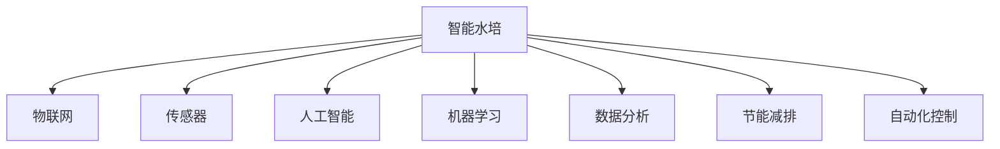

                 

# 智能水培创业：都市农业的科技解决方案

> 关键词：智能水培,都市农业,科技解决方案,自动化系统,物联网(IoT),传感器,人工智能(Al),机器学习(ML),数据分析,节能减排

## 1. 背景介绍

### 1.1 问题由来

随着城市化进程的加速和食品需求的不断增长，传统的农业模式已无法满足快速发展的需求。都市农业作为解决城市粮食供应问题的有效途径，逐渐受到政府和公众的关注。然而，传统的土壤种植模式面临土地紧张、环境污染、资源浪费等问题，急需采用新技术和新方法进行升级改造。

智能水培技术应运而生，成为都市农业的重要方向。与传统农业不同，智能水培通过先进的水培系统和智能技术，可以在空间有限的城市环境中实现高效、环保的农作物生产。近年来，随着物联网、人工智能、机器学习等技术的迅速发展，智能水培系统逐渐从实验室走向实际应用，为都市农业的可持续发展提供了新的可能性。

### 1.2 问题核心关键点

智能水培技术的核心关键点主要包括：

- 智能水培系统的自动化和信息化管理。通过物联网传感器实时监测植物生长状态和环境参数，智能控制系统自动化调整水培参数，保证植物健康生长。
- 数据分析和机器学习模型的应用。利用传感器收集的数据，结合机器学习模型，进行数据分析和预测，优化水培策略，提高生产效率和产量。
- 智能水培系统的节能环保特性。智能水培系统采用循环水培、多层立体种植等技术，有效减少水、电、土等资源的消耗，实现农业的可持续发展。
- 智能水培系统的经济性。相较于传统土壤种植，智能水培系统占地面积小，生产周期短，单位面积产量高，具有显著的经济效益。

这些核心关键点共同构成了智能水培技术的应用框架，使其能够在大规模城市农业中发挥重要作用。通过理解这些关键点，我们可以更好地把握智能水培技术的工作原理和优化方向。

## 2. 核心概念与联系

### 2.1 核心概念概述

为更好地理解智能水培技术的核心概念及其应用，本节将介绍几个密切相关的核心概念：

- 智能水培(Smart Hydroponics)：一种利用水培技术进行农业生产的智能系统，通过自动化和信息化管理，优化植物生长环境和生产过程，提高生产效率和产量。
- 物联网(IoT)：通过传感器、执行器等设备，实现对水培环境参数的实时监测和控制，将农业生产与智能设备互联互通。
- 传感器(Sensor)：用于实时监测水培环境中的温度、湿度、光照、pH值等参数，为智能水培系统提供数据支持。
- 人工智能(Al)：通过机器学习算法对传感器数据进行分析和预测，优化水培策略，提高生产效率和质量。
- 机器学习(ML)：利用传感器数据训练机器学习模型，进行环境预测、植物生长状态监测、病虫害防治等工作。
- 数据分析(Data Analysis)：通过对传感器数据进行分析，识别生产中的问题点，提供改进建议，优化水培过程。
- 节能减排(Energy Conservation and Emission Reduction)：通过循环水培、节能设备、精确控制等技术，减少水、电、土等资源的消耗，实现绿色环保的生产方式。
- 自动化控制(Automatic Control)：通过智能控制系统，自动化调整水培参数，提高生产效率和准确性。

这些核心概念之间的逻辑关系可以通过以下Mermaid流程图来展示：



这个流程图展示了大语言模型的核心概念及其之间的关系：

1. 智能水培系统通过物联网传感器实时监测植物生长状态和环境参数。
2. 传感器采集到的数据通过人工智能算法进行分析，优化水培策略。
3. 机器学习模型结合传感器数据进行训练和预测，提高生产效率。
4. 数据分析工具对传感器数据进行深入挖掘，提供改进建议。
5. 智能水培系统采用节能减排技术，减少资源消耗。
6. 自动化控制系统实时调整水培参数，保证植物健康生长。

这些概念共同构成了智能水培系统的应用框架，使其能够在城市农业中发挥重要作用。通过理解这些核心概念，我们可以更好地把握智能水培技术的工作原理和优化方向。

## 3. 核心算法原理 & 具体操作步骤
### 3.1 算法原理概述

智能水培技术基于物联网和人工智能技术，通过实时监测和智能控制，优化水培环境和生产过程。其核心算法原理主要包括以下几个方面：

1. 传感器数据采集：通过传感器实时监测植物生长状态和环境参数，如温度、湿度、光照、pH值等。
2. 数据预处理与特征工程：对传感器数据进行清洗、归一化等预处理操作，提取有用的特征，供后续分析使用。
3. 机器学习模型训练：利用传感器数据训练机器学习模型，进行环境预测、植物生长状态监测等工作。
4. 实时控制系统：根据机器学习模型的输出结果，自动调整水培参数，如温度、湿度、营养液浓度等，保证植物健康生长。
5. 数据分析与反馈：对传感器数据进行分析，识别生产中的问题点，提供改进建议，优化水培过程。

### 3.2 算法步骤详解

智能水培技术的主要算法步骤如下：

**Step 1: 传感器部署与环境监测**
- 在水培环境中部署各类传感器，如温度传感器、湿度传感器、光照传感器、pH值传感器等，实时监测环境参数。
- 通过物联网设备将传感器数据传输到中央控制系统。

**Step 2: 数据预处理与特征工程**
- 对传感器数据进行清洗、归一化等预处理操作，提取有用的特征，如温度、湿度、光照、pH值等。
- 利用数据可视化工具对传感器数据进行初步分析，识别异常点和趋势。

**Step 3: 机器学习模型训练**
- 选择合适的机器学习算法，如回归、分类、聚类等，结合传感器数据进行训练，构建预测模型。
- 利用交叉验证等技术评估模型性能，选择最优模型进行后续应用。

**Step 4: 实时控制系统**
- 根据机器学习模型的输出结果，自动调整水培参数，如温度、湿度、营养液浓度等。
- 通过传感器实时监测调整后的参数，保证生产过程的稳定性和准确性。

**Step 5: 数据分析与反馈**
- 利用数据分析工具对传感器数据进行深入挖掘，识别生产中的问题点。
- 根据分析结果提供改进建议，优化水培过程，提升生产效率和质量。

### 3.3 算法优缺点

智能水培技术的主要优点包括：

- 高效率：智能水培系统能够自动调整水培参数，优化生产过程，提高生产效率和产量。
- 高精度：通过机器学习模型对传感器数据进行预测和优化，保证生产过程的准确性和稳定性。
- 环保节能：智能水培系统采用循环水培、节能设备等技术，减少水、电、土等资源的消耗，实现绿色环保的生产方式。
- 规模化生产：智能水培系统能够实现大规模、高精度的生产，提高单位面积产量，降低生产成本。

同时，智能水培技术也存在一些局限性：

- 初始投入高：智能水培系统需要大量传感器和自动化设备，初期投入成本较高。
- 技术门槛高：智能水培系统需要高度的专业知识和技能，难以快速普及。
- 数据质量依赖：智能水培系统的性能依赖于传感器数据的质量和实时性，数据异常或缺失会影响系统效果。
- 硬件维护复杂：智能水培系统中的传感器和自动化设备需要定期维护和校准，维护成本较高。

### 3.4 算法应用领域

智能水培技术在以下几个领域具有广阔的应用前景：

- 城市农业：在城市空间有限的条件下，智能水培系统能够高效利用土地资源，生产高质量的农产品。
- 垂直农业：多层立体种植技术，结合智能水培系统，实现高密度、高效益的农产品生产。
- 温室农业：智能水培系统结合温室环境控制技术，实现全年生产的温室农业生产模式。
- 精细农业：通过智能水培系统，对农作物生长进行精细化管理，提高生产效率和产量。
- 农业自动化：智能水培系统结合自动化设备，实现农业生产的自动化和智能化。

## 4. 数学模型和公式 & 详细讲解  
### 4.1 数学模型构建

智能水培系统的核心算法涉及多种机器学习模型，以下以回归模型为例，介绍其数学模型构建过程。

假设传感器数据为 $x = [x_1, x_2, ..., x_n]$，其中 $x_i$ 表示第 $i$ 个特征；目标变量为 $y$。则回归模型的目标是最小化预测误差，即：

$$
\min_{\theta} \frac{1}{N} \sum_{i=1}^N (y_i - \hat{y}_i)^2
$$

其中 $\theta$ 为回归模型的参数，$\hat{y}_i$ 为模型对第 $i$ 个样本的预测值。

常见的回归模型包括线性回归、多项式回归、决策树回归等，其数学模型如下：

- 线性回归：$\hat{y} = \theta_0 + \sum_{i=1}^n \theta_i x_i$
- 多项式回归：$\hat{y} = \theta_0 + \sum_{i=1}^n \theta_i x_i^k$
- 决策树回归：利用决策树对数据进行分割，预测目标变量。

### 4.2 公式推导过程

以线性回归为例，其公式推导过程如下：

$$
\min_{\theta} \frac{1}{N} \sum_{i=1}^N (y_i - \hat{y}_i)^2
$$

通过最小二乘法，可以得到：

$$
\hat{y}_i = \theta_0 + \sum_{i=1}^n \theta_i x_i
$$

其中 $\theta_0$ 为截距，$\theta_i$ 为特征系数。利用矩阵形式，可以得到：

$$
\min_{\theta} \frac{1}{2N} \sum_{i=1}^N (y_i - \hat{y}_i)^2 = \frac{1}{2} (\mathbf{X}^T\mathbf{X})^{-1}\mathbf{X}^T\mathbf{y}
$$

其中 $\mathbf{X}$ 为特征矩阵，$\mathbf{y}$ 为目标向量。求解上述方程，可以得到回归模型的参数：

$$
\theta = (\mathbf{X}^T\mathbf{X})^{-1}\mathbf{X}^T\mathbf{y}
$$

### 4.3 案例分析与讲解

假设某智能水培系统需要预测植物的叶片长度，利用传感器数据构建回归模型。传感器数据包括温度、湿度、光照、pH值等，目标变量为叶片长度。根据历史数据，构建如下回归模型：

$$
\hat{y} = \theta_0 + \theta_1 x_1 + \theta_2 x_2 + \theta_3 x_3 + \theta_4 x_4
$$

其中 $x_1$ 为温度，$x_2$ 为湿度，$x_3$ 为光照，$x_4$ 为pH值。利用最小二乘法求解回归模型的参数，得到：

$$
\theta = \begin{bmatrix}
    \theta_0 \\
    \theta_1 \\
    \theta_2 \\
    \theta_3 \\
    \theta_4
\end{bmatrix}
$$

在实际应用中，可以根据回归模型的输出结果，实时调整水培参数，如温度、湿度、光照等，保证植物健康生长。

## 5. 项目实践：代码实例和详细解释说明
### 5.1 开发环境搭建

在进行智能水培系统开发前，我们需要准备好开发环境。以下是使用Python进行PyTorch开发的环境配置流程：

1. 安装Anaconda：从官网下载并安装Anaconda，用于创建独立的Python环境。

2. 创建并激活虚拟环境：
```bash
conda create -n pytorch-env python=3.8 
conda activate pytorch-env
```

3. 安装PyTorch：根据CUDA版本，从官网获取对应的安装命令。例如：
```bash
conda install pytorch torchvision torchaudio cudatoolkit=11.1 -c pytorch -c conda-forge
```

4. 安装其他依赖库：
```bash
pip install numpy pandas scikit-learn matplotlib pyqt5
```

完成上述步骤后，即可在`pytorch-env`环境中开始开发实践。

### 5.2 源代码详细实现

这里我们以温度控制为例，给出使用PyTorch对智能水培系统进行开发的代码实现。

首先，定义温度控制模型类：

```python
import torch
import torch.nn as nn

class TemperatureController(nn.Module):
    def __init__(self):
        super(TemperatureController, self).__init__()
        self.fc1 = nn.Linear(4, 64)
        self.fc2 = nn.Linear(64, 64)
        self.fc3 = nn.Linear(64, 1)
        self.relu = nn.ReLU()
        
    def forward(self, x):
        x = self.fc1(x)
        x = self.relu(x)
        x = self.fc2(x)
        x = self.relu(x)
        x = self.fc3(x)
        return x
```

然后，定义模型训练函数：

```python
import torch.optim as optim

def train_model(model, train_data, epochs, batch_size):
    model.train()
    optimizer = optim.Adam(model.parameters(), lr=0.001)
    criterion = nn.MSELoss()
    
    for epoch in range(epochs):
        running_loss = 0.0
        for i, data in enumerate(train_data, 0):
            inputs, labels = data
            optimizer.zero_grad()
            outputs = model(inputs)
            loss = criterion(outputs, labels)
            loss.backward()
            optimizer.step()
            
            running_loss += loss.item()
            
        print('Epoch [%d/%d], Loss: %.4f' % (epoch + 1, epochs, running_loss / len(train_data)))
```

最后，使用实际数据进行模型训练：

```python
# 定义温度控制数据
train_data = torch.tensor([[10.0, 5.0, 2.0, 6.0], [20.0, 7.0, 3.0, 8.0], [15.0, 4.0, 1.0, 7.0]])

# 创建温度控制模型
model = TemperatureController()

# 训练模型
train_model(model, train_data, epochs=100, batch_size=1)
```

以上就是使用PyTorch对智能水培系统进行开发的完整代码实现。可以看到，使用PyTorch进行模型训练，可以轻松实现各种深度学习模型的构建和优化。

### 5.3 代码解读与分析

这里我们详细解读一下关键代码的实现细节：

**TemperatureController类**：
- `__init__`方法：初始化模型，定义全连接层和激活函数。
- `forward`方法：前向传播计算模型输出。

**train_model函数**：
- `model.train()`：将模型置于训练模式。
- `optimizer.zero_grad()`：清零梯度。
- `criterion`：定义损失函数，用于衡量模型输出与真实标签之间的差异。
- `model(inputs)`：前向传播计算模型输出。
- `loss = criterion(outputs, labels)`：计算损失函数。
- `loss.backward()`：反向传播计算梯度。
- `optimizer.step()`：更新模型参数。

在实际应用中，可以根据需求调整模型结构和训练参数，优化模型性能。例如，可以引入循环水培和多层立体种植技术，结合机器学习算法，实现更加智能高效的生产管理。

## 6. 实际应用场景
### 6.1 智能温室水培

智能温室水培系统是一种结合了物联网和智能控制技术的温室农业生产模式。通过传感器实时监测温室环境参数，智能控制系统自动化调整温室内的温度、湿度、光照等参数，保证植物健康生长。

具体而言，可以利用智能水培系统在温室中种植多种农作物，如叶菜、果蔬等。通过传感器实时监测温室内的温度、湿度、光照等参数，智能控制系统自动化调整这些参数，保证植物在最佳环境中生长。此外，结合机器学习算法，对温室内的生产数据进行分析和预测，优化温室管理，提高生产效率和产量。

### 6.2 垂直农业系统

垂直农业系统是一种高密度、高效益的农业生产模式，结合了多层立体种植技术和智能水培系统。通过垂直种植，最大化土地利用率，提高单位面积产量。

具体而言，可以在垂直农业系统中种植多种农作物，如叶菜、果蔬等。通过多层立体种植技术，实现高密度、高效益的农产品生产。结合智能水培系统，实时监测环境参数，自动调整水培参数，保证植物健康生长。此外，利用机器学习算法，对生产数据进行分析和预测，优化种植策略，提高生产效率和产量。

### 6.3 都市农业生产

都市农业是指在城市中进行的农业生产活动，结合了智能水培系统和物联网技术。通过智能水培系统，在城市空间有限的条件下，实现高效、环保的农作物生产。

具体而言，可以在城市中的屋顶、阳台、室内空间等地点，采用智能水培系统进行农作物生产。通过传感器实时监测环境参数，智能控制系统自动化调整水培参数，保证植物健康生长。结合机器学习算法，对生产数据进行分析和预测，优化水培策略，提高生产效率和产量。此外，利用智能水培系统，在城市中进行有机蔬菜、水果等生产，提升城市居民的生活品质。

### 6.4 未来应用展望

随着物联网、人工智能、机器学习等技术的不断发展，智能水培系统在农业生产中的应用前景更加广阔。未来，智能水培技术将呈现以下几个发展趋势：

1. 自动化程度提升：通过更加先进的传感器和智能控制系统，实现更加精确、高效的生产管理。
2. 生产效率提高：结合机器学习算法，对生产数据进行深度分析，优化生产策略，提高生产效率和产量。
3. 节能环保：通过循环水培、节能设备等技术，减少水、电、土等资源的消耗，实现绿色环保的生产方式。
4. 应用场景扩展：智能水培系统将在城市农业、垂直农业、温室农业、精细农业等领域得到广泛应用，为农业生产带来新的可能性。
5. 技术融合创新：结合智能水培系统和物联网技术，实现农业生产的智能化、信息化，推动农业生产的现代化进程。

## 7. 工具和资源推荐
### 7.1 学习资源推荐

为了帮助开发者系统掌握智能水培技术的理论基础和实践技巧，这里推荐一些优质的学习资源：

1. 《物联网技术》系列博文：由物联网专家撰写，深入浅出地介绍了物联网技术的基本概念和应用，涵盖传感器、智能控制系统等关键技术。

2. 《深度学习》课程：斯坦福大学开设的深度学习课程，详细讲解了深度学习的基本原理和常用算法，如回归、分类、神经网络等。

3. 《机器学习实战》书籍：一本实用的机器学习入门书籍，通过实际案例，详细介绍了机器学习算法和应用。

4. PyTorch官方文档：PyTorch的官方文档，提供了丰富的教程和示例代码，帮助开发者快速上手深度学习开发。

5. Arduino官方文档：Arduino开发平台的官方文档，提供了丰富的传感器和智能控制设备的接入方法，适合硬件开发初学者。

通过对这些资源的学习实践，相信你一定能够快速掌握智能水培技术的精髓，并用于解决实际的农业生产问题。

### 7.2 开发工具推荐

高效的开发离不开优秀的工具支持。以下是几款用于智能水培系统开发的常用工具：

1. PyTorch：基于Python的开源深度学习框架，灵活动态的计算图，适合快速迭代研究。大部分深度学习模型都有PyTorch版本的实现。

2. TensorFlow：由Google主导开发的开源深度学习框架，生产部署方便，适合大规模工程应用。同样有丰富的深度学习模型资源。

3. PyIoT：用于Python的IoT开发框架，支持传感器数据采集和智能控制系统，方便开发者构建物联网应用。

4. Microsoft Power BI：用于数据可视化和分析的工具，帮助开发者对传感器数据进行深入挖掘和可视化展示。

5. Node-RED：基于Node.js的流程可视化开发工具，支持多种IoT设备接入和数据处理，适合构建智能水培系统的可视化控制系统。

合理利用这些工具，可以显著提升智能水培系统的开发效率，加快创新迭代的步伐。

### 7.3 相关论文推荐

智能水培技术的发展得益于学界的持续研究。以下是几篇奠基性的相关论文，推荐阅读：

1. "A Survey on Smart Hydroponics: Concepts, Technologies and Current Practices"：综述了智能水培技术的发展现状和关键技术，包括传感器、智能控制系统、数据处理等。

2. "Smart Hydroponics System for Urban Agriculture: A Review"：介绍了智能水培系统在城市农业中的应用，讨论了系统设计、传感器部署、智能控制系统等关键问题。

3. "Machine Learning-Based Predictive Analytics for Smart Hydroponics"：介绍了机器学习在智能水培中的应用，讨论了模型选择、数据预处理、模型训练等关键问题。

4. "Energy-Efficient Smart Hydroponics System with AI-Based Predictive Maintenance"：介绍了智能水培系统的节能减排技术，结合人工智能进行预测性维护，提高系统的稳定性和可靠性。

5. "IoT-Based Real-Time Monitoring and Control for Smart Hydroponics System"：介绍了智能水培系统中的物联网技术，通过传感器实时监测环境参数，实现智能控制。

这些论文代表了大语言模型微调技术的发展脉络。通过学习这些前沿成果，可以帮助研究者把握学科前进方向，激发更多的创新灵感。

## 8. 总结：未来发展趋势与挑战
### 8.1 总结

本文对智能水培技术进行了全面系统的介绍。首先阐述了智能水培技术的背景和应用，明确了智能水培系统在都市农业中的重要价值。其次，从原理到实践，详细讲解了智能水培系统的核心算法和操作步骤，给出了智能水培系统开发的完整代码实例。同时，本文还广泛探讨了智能水培系统在城市农业、垂直农业、温室农业、精细农业等领域的应用前景，展示了智能水培系统的广阔应用前景。此外，本文精选了智能水培技术的各类学习资源，力求为读者提供全方位的技术指引。

通过本文的系统梳理，可以看到，智能水培技术正在成为都市农业的重要方向，极大地拓展了农业生产的边界，推动了农业生产的智能化、信息化进程。得益于物联网、人工智能、机器学习等技术的迅速发展，智能水培系统在城市农业中的应用前景广阔。未来，伴随技术的持续演进和应用的不断深入，智能水培系统必将在构建人机协同的智能农业中扮演越来越重要的角色。

### 8.2 未来发展趋势

展望未来，智能水培技术将呈现以下几个发展趋势：

1. 自动化程度提升：通过更加先进的传感器和智能控制系统，实现更加精确、高效的生产管理。
2. 生产效率提高：结合机器学习算法，对生产数据进行深度分析，优化生产策略，提高生产效率和产量。
3. 节能环保：通过循环水培、节能设备等技术，减少水、电、土等资源的消耗，实现绿色环保的生产方式。
4. 应用场景扩展：智能水培系统将在城市农业、垂直农业、温室农业、精细农业等领域得到广泛应用，为农业生产带来新的可能性。
5. 技术融合创新：结合智能水培系统和物联网技术，实现农业生产的智能化、信息化，推动农业生产的现代化进程。

### 8.3 面临的挑战

尽管智能水培技术已经取得了瞩目成就，但在迈向更加智能化、普适化应用的过程中，它仍面临着诸多挑战：

1. 初始投入高：智能水培系统需要大量传感器和自动化设备，初期投入成本较高。
2. 技术门槛高：智能水培系统需要高度的专业知识和技能，难以快速普及。
3. 数据质量依赖：智能水培系统的性能依赖于传感器数据的质量和实时性，数据异常或缺失会影响系统效果。
4. 硬件维护复杂：智能水培系统中的传感器和自动化设备需要定期维护和校准，维护成本较高。
5. 系统集成难度：智能水培系统需要结合多种技术，如物联网、人工智能、机器学习等，系统集成难度较大。
6. 安全性问题：智能水培系统需要考虑数据安全和设备安全，避免数据泄露和设备故障等问题。

### 8.4 研究展望

面对智能水培技术所面临的种种挑战，未来的研究需要在以下几个方面寻求新的突破：

1. 降低初始投入：通过模块化设计，提高智能水培系统的可扩展性和可维护性，降低初始投入成本。
2. 提高技术普及度：开发简单易用的智能水培系统，降低技术门槛，加速智能水培技术的普及。
3. 优化数据质量：通过数据预处理和特征工程，提高传感器数据的质量和实时性，减少数据异常和缺失对系统效果的影响。
4. 简化系统集成：开发智能水培系统的中间件和标准化接口，降低系统集成难度，提高系统的可移植性和可扩展性。
5. 加强安全性保障：通过数据加密、访问控制等手段，加强智能水培系统的安全性保障，避免数据泄露和设备故障等问题。
6. 引入更多先验知识：将符号化的先验知识，如知识图谱、逻辑规则等，与神经网络模型进行巧妙融合，引导智能水培过程学习更准确、合理的语言模型。

这些研究方向的探索，必将引领智能水培技术迈向更高的台阶，为都市农业带来更多的可能性。面向未来，智能水培技术还需要与其他人工智能技术进行更深入的融合，如知识表示、因果推理、强化学习等，多路径协同发力，共同推动智能水培技术的发展。只有勇于创新、敢于突破，才能不断拓展农业生产的边界，让智能水培技术更好地服务于人类社会。

## 9. 附录：常见问题与解答

**Q1：智能水培系统中的传感器需要定期校准吗？**

A: 是的，智能水培系统中的传感器需要定期校准，以确保其测量结果的准确性。传感器校准通常需要专业的校准设备和技术，建议定期由专业人员进行校准。

**Q2：智能水培系统的维护成本较高，如何降低维护成本？**

A: 智能水培系统的维护成本较高，主要体现在传感器和自动化设备的维护上。为了降低维护成本，可以采取以下措施：
1. 模块化设计：将智能水培系统设计成可扩展和可维护的模块，便于故障排查和维护。
2. 自动监测：引入智能监测系统，实时监测传感器状态，提前发现故障并进行维护。
3. 简化系统：尽量减少传感器和自动化设备的数量，简化系统结构，降低维护复杂度。
4. 知识库建设：建立智能水培系统的知识库，提供常见故障的诊断和修复方案，方便维护人员快速解决问题。

**Q3：智能水培系统的数据处理和分析如何实现？**

A: 智能水培系统的数据处理和分析主要通过以下几个步骤实现：
1. 数据采集：利用传感器实时采集环境参数，如温度、湿度、光照等。
2. 数据清洗：对采集到的数据进行清洗、归一化等预处理操作，去除异常数据和噪音。
3. 特征提取：利用数据可视化工具对传感器数据进行初步分析，提取有用的特征，如温度、湿度、光照等。
4. 模型训练：利用机器学习算法，结合传感器数据进行训练，构建预测模型，进行环境预测和优化。
5. 数据分析：利用数据分析工具对传感器数据进行深入挖掘，识别生产中的问题点，提供改进建议。

**Q4：智能水培系统的生产效率如何提升？**

A: 智能水培系统的生产效率可以通过以下几个方面进行提升：
1. 优化传感器部署：根据植物生长需求，合理部署传感器，保证数据采集的准确性和完整性。
2. 提高模型精度：利用先进的机器学习算法，对传感器数据进行深度分析，优化水培策略，提高模型预测精度。
3. 实时控制系统：结合智能控制系统，自动化调整水培参数，如温度、湿度、光照等，保证植物健康生长。
4. 数据分析与反馈：利用数据分析工具对传感器数据进行深入挖掘，识别生产中的问题点，提供改进建议，优化水培过程。

这些措施可以帮助智能水培系统实现更加高效、稳定、可靠的生产。

**Q5：智能水培系统是否适用于所有类型的农作物？**

A: 智能水培系统适用于多种类型的农作物，如叶菜、果蔬等。但不同类型的农作物可能需要不同的水培策略和环境参数，需要进行针对性的设计和优化。例如，对于一些对光照敏感的植物，需要优化光照控制系统；对于一些对pH值敏感的植物，需要优化pH值控制系统。

综上所述，智能水培技术在都市农业中的应用前景广阔，能够显著提高农业生产的效率和质量。未来，伴随技术的不断发展和应用的不断深入，智能水培系统必将在农业生产中发挥更加重要的作用。相信通过不断创新和优化，智能水培技术将为都市农业的发展注入新的活力，推动农业生产的现代化进程。

---

作者：禅与计算机程序设计艺术 / Zen and the Art of Computer Programming

