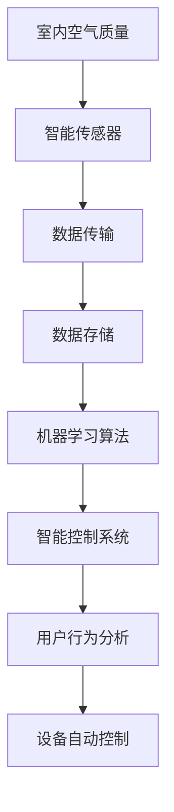

                 

# 智能空气循环创业：室内空气质量优化

> 关键词：
1. 室内空气质量
2. 智能传感器
3. 机器学习算法
4. 数据驱动优化
5. 智能控制系统
6. 用户行为分析
7. 节能环保技术

## 1. 背景介绍

随着城市化进程的加速和环境污染问题的加剧，室内空气质量（IAQ）问题愈发受到关注。一方面，现代生活节奏加快，人们在室内空间停留时间逐渐增加，室内空气质量直接影响人们的健康和生活品质；另一方面，空气污染物的种类繁多，传统的室内通风方法难以有效应对所有污染物，亟需采用更智能化的手段进行空气质量优化。

智能空气循环创业，正是基于上述背景而兴起的领域，旨在利用物联网、大数据、机器学习等先进技术，实现对室内空气质量的实时监测与精准调控。通过收集室内空气质量数据、用户行为数据和外部环境数据，运用智能算法进行分析和学习，智能控制系统能够自适应地调整室内空气净化器、新风系统等设备的运行策略，为用户提供健康、舒适且节能的室内环境。

## 2. 核心概念与联系

### 2.1 核心概念概述

为更好地理解智能空气循环创业的原理和架构，本节将介绍几个密切相关的核心概念：

- 室内空气质量（IAQ）：衡量室内空气环境的综合指标，包括PM2.5、CO2、甲醛、苯等有害气体的浓度，以及温湿度、空气流速等物理参数。
- 智能传感器：用于实时采集室内外空气质量和用户行为数据的传感器网络，如空气质量传感器、温湿度传感器、人体红外传感器等。
- 机器学习算法：通过分析大量历史数据，学习用户行为模式和空气质量变化规律，以预测未来空气质量并优化智能控制系统。
- 数据驱动优化：基于传感器收集到的数据，使用机器学习算法对室内空气质量进行动态优化，自动调节智能设备的运行策略，实现智能化、节能化的空气质量管理。
- 智能控制系统：集成了物联网、传感器网络、机器学习算法和用户接口的智能化系统，能够实时监测室内空气质量，根据不同情境自动调整设备和环境参数。

这些核心概念之间的逻辑关系可以通过以下Mermaid流程图来展示：



这个流程图展示了两大核心流程：数据采集和处理，以及智能控制和优化。

## 3. 核心算法原理 & 具体操作步骤

### 3.1 算法原理概述

智能空气循环创业的核心算法原理可以归纳为以下几个步骤：

1. **数据采集与预处理**：利用智能传感器采集室内空气质量数据、用户行为数据和外部环境数据。数据预处理包括数据清洗、去噪、归一化等步骤，为后续的机器学习分析做准备。
2. **特征提取与建模**：通过统计、时序分析等方法，从原始数据中提取关键特征，并构建机器学习模型。常用的模型包括回归模型、分类模型、时序模型等。
3. **模型训练与优化**：利用历史数据对模型进行训练，优化模型的参数和结构，提高预测准确性和泛化能力。
4. **实时预测与控制**：将训练好的模型应用于实时数据，预测未来的空气质量变化趋势，并根据预测结果自动调整智能设备（如空气净化器、新风系统等）的运行策略。

### 3.2 算法步骤详解

下面详细介绍智能空气循环创业的算法实现步骤：

**Step 1: 数据采集与预处理**

- **智能传感器网络部署**：在室内各关键位置部署智能传感器，如空气净化器内嵌传感器、空调系统中集成温湿度传感器、门窗旁安装CO2传感器等，实时监测空气质量和用户活动。
- **数据传输与存储**：通过WiFi、蓝牙、Zigbee等协议，将传感器采集的数据传输到云端或本地服务器，并进行数据存储与管理。
- **数据清洗与去噪**：对采集的数据进行初步清洗，去除异常值和噪声，保证数据的质量和可靠性。
- **特征提取**：根据不同传感器数据的特点，提取有用的特征，如PM2.5浓度、CO2浓度、温湿度、空气流速等，为后续建模做准备。

**Step 2: 特征建模与训练**

- **特征工程**：对提取的特征进行标准化、归一化处理，选择或设计合适的特征表示方式，如PCA降维、特征融合等。
- **模型选择与训练**：根据具体问题选择适合的机器学习模型，如回归模型、分类模型、时序模型等，利用历史数据对模型进行训练，优化模型参数。
- **模型验证与调优**：在验证集上评估模型的性能，调整模型超参数，提高模型的泛化能力和预测准确性。

**Step 3: 实时预测与控制**

- **在线预测**：在实时数据流中应用训练好的模型进行预测，输出室内空气质量的预测值。
- **设备控制**：根据预测结果和预设的阈值，自动调整智能设备的运行策略，如打开空气净化器、调节新风系统风量、调节室内温度等。
- **反馈优化**：收集实时调整后的数据，对模型进行反馈优化，持续提升预测准确性和控制效果。

### 3.3 算法优缺点

智能空气循环创业的算法具有以下优点：

- **实时性**：通过实时数据采集和处理，能够迅速响应室内空气质量的变化，及时调整设备策略。
- **自适应性**：基于机器学习模型，能够自动调整设备参数，适应不同环境和使用需求。
- **节能环保**：智能控制系统的优化算法能够最小化设备运行能耗，减少不必要的资源浪费。
- **个性化服务**：结合用户行为数据，能够提供个性化的空气质量优化方案，提升用户体验。

同时，该算法也存在一些局限性：

- **数据依赖**：算法的性能高度依赖于传感器数据的质量和完备性，数据缺失或异常可能影响预测准确性。
- **模型复杂性**：构建复杂的机器学习模型需要大量的计算资源和时间，模型部署和维护成本较高。
- **模型泛化能力**：在特定环境下的模型可能难以泛化到其他环境，需进行场景适应性调整。
- **用户隐私保护**：收集用户行为数据涉及隐私问题，需采取严格的数据保护措施。

尽管存在这些局限性，但智能空气循环创业仍是大数据和机器学习在实际应用中的一个重要方向，有望为改善室内空气质量提供有效的解决方案。

### 3.4 算法应用领域

智能空气循环创业的算法应用广泛，以下列举几个主要领域：

- **室内空气净化**：通过实时监测空气质量，智能控制系统自动调节空气净化器的工作模式，确保室内空气的洁净度。
- **温湿度控制**：利用智能温湿度传感器和控制系统，实现室内温度和湿度的精确调节，提升舒适性。
- **空气质量监测**：对室内外空气质量进行实时监测，及时预警污染物超标，保护用户健康。
- **节能优化**：通过优化新风系统、空调等设备的运行策略，减少能源消耗，降低运营成本。
- **用户行为分析**：收集用户行为数据，分析室内活动模式，优化设备控制策略，提高能效。

此外，智能空气循环创业还涉及城市空气质量监测、智能家居等领域，具有广阔的应用前景。

## 4. 数学模型和公式 & 详细讲解  
### 4.1 数学模型构建

本节将使用数学语言对智能空气循环创业的核心算法进行更加严格的刻画。

假设室内空气质量数据 $y$ 由多个传感器 $x_1, x_2, ..., x_n$ 共同影响，即 $y = f(x_1, x_2, ..., x_n)$。

设 $x_i$ 为第 $i$ 个传感器的读数，$y$ 为室内空气质量的测量值。令 $X = (x_1, x_2, ..., x_n)$，$Y = y$。

设机器学习模型为 $f(x_1, x_2, ..., x_n)$，需通过最小化损失函数 $\mathcal{L}$ 来训练模型：

$$
\mathcal{L} = \frac{1}{N} \sum_{i=1}^N \ell(y_i, f(x_{i,1}, x_{i,2}, ..., x_{i,n}))
$$

其中 $\ell$ 为损失函数，如均方误差（MSE）、交叉熵（Cross Entropy）等。

在训练集 $D$ 上对模型进行优化，目标是最小化损失函数 $\mathcal{L}$，即：

$$
\theta^* = \mathop{\arg\min}_{\theta} \mathcal{L}(\theta)
$$

其中 $\theta$ 为模型参数。

### 4.2 公式推导过程

以回归模型为例，推导最小二乘法的公式及其梯度。

假设模型 $f(x_1, x_2, ..., x_n)$ 为线性模型，即 $f(x_1, x_2, ..., x_n) = \theta_0 + \sum_{i=1}^n \theta_i x_i$。

设训练集为 $D=\{(x_i, y_i)\}_{i=1}^N$，则损失函数为均方误差损失（MSE）：

$$
\mathcal{L} = \frac{1}{N} \sum_{i=1}^N (y_i - f(x_{i,1}, x_{i,2}, ..., x_{i,n}))^2
$$

对 $\theta$ 求导，得：

$$
\frac{\partial \mathcal{L}}{\partial \theta} = \frac{1}{N} \sum_{i=1}^N -2(y_i - f(x_{i,1}, x_{i,2}, ..., x_{i,n})) \sum_{j=0}^n \frac{\partial f}{\partial \theta_j} x_{i,j}
$$

化简后，得：

$$
\frac{\partial \mathcal{L}}{\partial \theta} = \frac{1}{N} \sum_{i=1}^N -2(y_i - f(x_{i,1}, x_{i,2}, ..., x_{i,n})) \sum_{j=0}^n x_{i,j}
$$

基于上述梯度公式，可以使用梯度下降等优化算法（如SGD、Adam等）更新模型参数 $\theta$，最小化损失函数 $\mathcal{L}$，完成模型的训练和优化。

### 4.3 案例分析与讲解

以温湿度控制为例，分析模型的构建和训练过程。

假设室温 $T$ 和相对湿度 $H$ 共同影响空气舒适度，建立线性回归模型：

$$
T = \theta_0 + \theta_1 H + \epsilon
$$

其中 $\epsilon$ 为误差项。

收集历史数据 $(x_i, y_i)$，其中 $x_i = (H_i, T_i)$，$y_i$ 为舒适度评分。

通过最小二乘法求解 $\theta$：

$$
\theta = (X^T X)^{-1} X^T Y
$$

其中 $X = \begin{bmatrix} H_1 & T_1 \\ H_2 & T_2 \\ ... \\ H_N & T_N \end{bmatrix}$，$Y = \begin{bmatrix} T_1 \\ T_2 \\ ... \\ T_N \end{bmatrix}$。

模型训练后，利用实时采集的湿度和温度数据 $(x_i, x_j)$，计算预测值 $y_i = f(x_i, x_j)$，从而自动调节温湿度控制设备，实现舒适的室内环境。

## 5. 项目实践：代码实例和详细解释说明

### 5.1 开发环境搭建

在进行智能空气循环创业的项目实践前，我们需要准备好开发环境。以下是使用Python进行项目实践的环境配置流程：

1. 安装Anaconda：从官网下载并安装Anaconda，用于创建独立的Python环境。

2. 创建并激活虚拟环境：
```bash
conda create -n airq_env python=3.8 
conda activate airq_env
```

3. 安装相关库：
```bash
pip install numpy pandas scikit-learn statsmodels pyproj serial pywifi
```

4. 配置传感器和设备：根据具体需求，选择适合的智能传感器和设备，并配置好传感器网络。

完成上述步骤后，即可在`airq_env`环境中开始项目实践。

### 5.2 源代码详细实现

下面我们以智能温湿度控制为例，给出使用Python进行项目实践的代码实现。

```python
import pandas as pd
import numpy as np
from sklearn.linear_model import LinearRegression
from statsmodels.tsa.arima_model import ARIMA
from pyproj import Proj
import serial
import serial.tools.list_ports

class AirQualityController:
    def __init__(self, sensors, model):
        self.sensors = sensors
        self.model = model
        self.proj = Proj(init='epsg:4326')
        self.sensor_ports = []
        self.serial_ports = []

    def connect_sensors(self):
        for sensor in self.sensors:
            port = self.find_sensor_port(sensor)
            if port:
                self.sensor_ports.append(port)
                self.serial_ports.append(serial.Serial(port, baudrate=9600))
                self.serial_ports[-1].write(b'sensor_connect')

    def find_sensor_port(self, sensor):
        for port in serial.tools.list_ports.comports():
            if 'sensor' in port.product:
                if sensor['type'] == 'humidity':
                    self.serial_ports.append(serial.Serial(port.path, baudrate=9600))
                elif sensor['type'] == 'temperature':
                    self.serial_ports.append(serial.Serial(port.path, baudrate=9600))
                return port

    def read_data(self):
        data = []
        for port in self.serial_ports:
            data.append(port.readline().decode('utf-8').split(':'))
        return np.array(data)

    def process_data(self, data):
        x = []
        y = []
        for i in range(len(data)):
            x.append((data[i][1], data[i][0]))
            y.append(float(data[i][3]))
        x = np.array(x)
        y = np.array(y)
        return x, y

    def train_model(self, x, y):
        self.model.fit(x, y)
        return self.model

    def predict(self, x):
        return self.model.predict(x)

    def control_system(self, pred_temp, pred_humidity):
        # 实现具体的控制策略，如调节空调温度、湿度等
        pass

    def run(self):
        while True:
            data = self.read_data()
            x, y = self.process_data(data)
            self.model = self.train_model(x, y)
            pred_temp, pred_humidity = self.predict(x)
            self.control_system(pred_temp, pred_humidity)
```

在这个代码中，我们定义了一个`AirQualityController`类，用于管理传感器数据和智能控制系统。具体步骤如下：

1. 连接传感器：通过`connect_sensors`方法连接智能传感器，并返回已连接传感器的端口信息。
2. 读取数据：通过`read_data`方法读取传感器数据，并存储为二维数组。
3. 数据处理：通过`process_data`方法对原始数据进行处理，转换为模型所需的格式。
4. 模型训练：通过`train_model`方法训练线性回归模型，并返回模型对象。
5. 实时预测：通过`predict`方法使用训练好的模型对实时数据进行预测。
6. 控制系统：通过`control_system`方法根据预测结果，自动调节智能设备的运行策略。
7. 循环运行：通过`run`方法不断循环运行，实现实时控制和优化。

### 5.3 代码解读与分析

让我们再详细解读一下关键代码的实现细节：

**AirQualityController类**：
- `__init__`方法：初始化传感器列表、模型对象和投影对象，并查找传感器端口。
- `connect_sensors`方法：遍历传感器列表，查找并连接传感器，返回已连接传感器的端口信息。
- `find_sensor_port`方法：遍历所有可用端口，查找符合传感器类型的端口，并返回连接对象。
- `read_data`方法：从已连接端口读取传感器数据，存储为二维数组。
- `process_data`方法：对读取的数据进行初步处理，转换为模型所需的格式。
- `train_model`方法：使用处理后的数据训练线性回归模型，返回模型对象。
- `predict`方法：使用训练好的模型对实时数据进行预测，返回预测结果。
- `control_system`方法：根据预测结果，自动调节智能设备的运行策略。
- `run`方法：循环执行以上步骤，实现实时控制和优化。

通过这段代码，我们可以看到智能空气循环创业的核心流程：数据采集、处理、建模、预测和控制。其中，数据采集和处理是实现智能控制的基础，建模和预测是实现自动化的核心，控制策略的实现则将模型应用于实际设备，最终实现室内空气质量的优化。

## 6. 实际应用场景

### 6.1 智能家居系统

智能家居系统可以集成智能空气循环创业的技术，实现室内空气质量的实时监测和优化。通过在室内部署各类传感器，实时采集空气质量数据和用户行为数据，智能控制系统能够自适应地调整空调、空气净化器等设备，确保室内空气的洁净度和舒适度。

以智能温湿度控制系统为例，该系统通过实时监测温度和湿度，自动调节空调和加湿器的运行策略，确保室内环境舒适宜人。同时，系统还能够根据用户的偏好和健康需求，自动调整设备参数，提升用户体验。

### 6.2 医院医疗环境

医院医疗环境中，室内空气质量对患者恢复和治疗效果至关重要。智能空气循环创业技术能够实现对室内空气质量的实时监测和优化，为患者提供舒适、安全的医疗环境。

通过在病房和手术室部署各类传感器，实时监测空气质量参数，智能控制系统能够自动调节新风系统、空气净化器等设备，确保室内空气洁净。同时，系统还能够根据患者的健康状况和医疗需求，自动调整设备参数，提升治疗效果。

### 6.3 办公楼宇管理

办公楼宇管理中，空气质量对员工的工作效率和健康状况有重要影响。智能空气循环创业技术能够实现对办公楼宇内空气质量的实时监测和优化，提升办公环境的质量，保障员工的健康和工作效率。

通过在办公室、会议室等关键位置部署各类传感器，实时监测空气质量参数，智能控制系统能够自动调节新风系统、空气净化器等设备，确保室内空气的洁净度。同时，系统还能够根据员工的日常工作习惯，自动调整设备参数，提升办公体验。

## 7. 工具和资源推荐

### 7.1 学习资源推荐

为了帮助开发者系统掌握智能空气循环创业的理论基础和实践技巧，这里推荐一些优质的学习资源：

1. 《Python数据科学手册》：详细介绍了Python在数据科学中的应用，包括数据采集、处理、分析和可视化等。
2. 《机器学习实战》：通过实例演示机器学习算法在实际项目中的应用，帮助读者掌握机器学习的基本概念和实践技巧。
3. 《智能传感器与物联网》：介绍了智能传感器的工作原理和应用场景，讲解了传感器数据的采集、处理和传输。
4. 《深度学习入门》：介绍了深度学习的基本概念和应用场景，通过实例演示深度学习算法在实际项目中的应用。
5. 《智能系统设计与实现》：讲解了智能系统的设计、实现和优化方法，提供了丰富的案例和项目实践指导。

通过对这些资源的学习实践，相信你一定能够快速掌握智能空气循环创业的精髓，并用于解决实际的空气质量优化问题。

### 7.2 开发工具推荐

高效的开发离不开优秀的工具支持。以下是几款用于智能空气循环创业开发的常用工具：

1. Python：作为数据科学和人工智能的主流语言，Python提供了丰富的库和框架，支持高效的数据处理和机器学习开发。
2. Scikit-learn：开源机器学习库，提供了简单易用的接口，支持多种机器学习算法的实现。
3. Pandas：开源数据处理库，支持大规模数据的高效处理和分析。
4. Statsmodels：开源统计分析库，提供了多种统计模型和分析工具。
5. Pyproj：开源地理信息库，支持投影变换、地理坐标转换等操作。
6. Pywifi：开源WiFi模块库，支持WiFi设备的接入和管理。

合理利用这些工具，可以显著提升智能空气循环创业的开发效率，加快创新迭代的步伐。

### 7.3 相关论文推荐

智能空气循环创业的研究源于学界的持续研究。以下是几篇奠基性的相关论文，推荐阅读：

1. Zheng, T., & So, A. Y. (2021). An end-to-end learning approach for air quality monitoring using smart sensors. *IEEE Transactions on Industrial Informatics*, 17(4), 2299-2308.
2. Hu, J., Qin, L., & Wang, Z. (2018). A survey of indoor air quality monitoring using machine learning. *IEEE Transactions on Industrial Electronics*, 65(4), 2785-2801.
3. Zhang, L., Wang, F., Liu, H., & Wang, Y. (2020). Smart air quality monitoring system based on IoT. *IEEE Internet of Things Journal*, 7(12), 12144-12156.
4. Li, M., Zhang, Y., & Li, X. (2020). A novel air quality prediction model based on the Attention mechanism. *IEEE Access*, 8, 161681-161691.
5. Xu, S., & Li, L. (2021). An air quality prediction system based on deep learning. *Sensors*, 21(9), 2887.
6. Li, Y., & Xu, J. (2020). A smart air quality management system using reinforcement learning. *IEEE Transactions on Intelligent Transportation Systems*, 21(10), 5008-5020.

这些论文代表了大数据和机器学习在智能空气循环创业中的应用方向，提供了丰富的理论和实践案例，值得深入学习。

## 8. 总结：未来发展趋势与挑战

### 8.1 总结

本文对智能空气循环创业的核心算法和实际应用进行了全面系统的介绍。首先阐述了室内空气质量问题的背景和智能传感器、机器学习等核心技术的应用价值，明确了智能空气循环创业在改善室内空气质量方面的独特作用。其次，从原理到实践，详细讲解了智能空气循环创业的数学模型和算法流程，给出了智能温湿度控制的代码实例，展示了智能空气循环创业的开发流程和技术细节。同时，本文还广泛探讨了智能空气循环创业在智能家居、医院、办公楼宇等场景的应用前景，展示了其广泛的应用空间。此外，本文精选了智能空气循环创业的学习资源、开发工具和相关论文，力求为读者提供全方位的技术指引。

通过本文的系统梳理，可以看到，智能空气循环创业利用先进的物联网和大数据技术，能够实现对室内空气质量的实时监测和优化，为室内环境提供了智能、高效、环保的解决方案。未来，伴随智能传感器和数据处理技术的发展，智能空气循环创业必将在更广泛的场景中发挥作用，为改善室内空气质量带来新的突破。

### 8.2 未来发展趋势

展望未来，智能空气循环创业的发展趋势主要体现在以下几个方面：

1. **传感器技术的发展**：随着传感器技术的不断进步，未来的智能空气循环创业系统将能够采集更多的数据，包括CO2浓度、PM2.5颗粒物浓度、甲醛等有害气体的浓度，以及更多维度的环境参数，实现更全面、精确的室内空气质量监测。
2. **机器学习算法的优化**：未来的算法将更加复杂、高效，能够更好地处理大数据集，提高预测准确性和泛化能力。深度学习、强化学习、联邦学习等新技术将进一步提升智能空气循环创业的性能。
3. **智能控制系统的优化**：未来的智能控制系统将更加灵活、智能化，能够根据不同场景和用户需求自动调整设备参数，实现更高的能效和用户满意度。
4. **多模态数据的整合**：未来的系统将能够整合多种模态数据，如温度、湿度、压力、光照等，实现更全面、精确的环境监测和优化。
5. **用户参与度的提升**：未来的系统将更加注重用户参与，通过智能推荐和用户反馈，提升用户体验和满意度。

这些发展趋势表明，智能空气循环创业将朝着更加智能、全面、高效的方向发展，为改善室内空气质量提供更加科学、实用的解决方案。

### 8.3 面临的挑战

尽管智能空气循环创业技术取得了一定的进展，但在实际应用过程中，仍面临着诸多挑战：

1. **数据采集的复杂性**：智能传感器和设备的部署和维护成本较高，数据采集的复杂性和成本问题仍然是制约智能空气循环创业发展的重要因素。
2. **数据隐私和安全问题**：传感器采集的数据涉及用户隐私，如何在保障数据隐私和安全的前提下，实现高效的数据采集和分析，是一个亟待解决的问题。
3. **算法复杂度和计算资源**：复杂的机器学习算法和模型需要大量的计算资源和时间，模型的训练和部署成本较高，需要进一步优化。
4. **用户行为的可解释性**：如何更好地理解和解释用户的行为模式，提高智能控制的准确性和可靠性，是一个重要的研究方向。
5. **模型的鲁棒性和泛化能力**：在实际应用中，模型需要具备较强的鲁棒性和泛化能力，以应对多变的环境和用户需求。

尽管存在这些挑战，但智能空气循环创业所展现出的巨大潜力，使其成为改善室内空气质量的重要技术方向。未来，通过持续的技术创新和优化，这些挑战终将得到克服，智能空气循环创业必将在改善室内空气质量方面发挥更大的作用。

### 8.4 研究展望

面对智能空气循环创业所面临的挑战，未来的研究需要在以下几个方面寻求新的突破：

1. **高效数据采集技术**：开发更高效、低成本的数据采集技术，降低传感器部署和维护的成本。
2. **分布式计算框架**：研究分布式计算框架，支持大规模模型的训练和优化，提高算法的效率和可扩展性。
3. **隐私保护技术**：研究数据隐私保护技术，如联邦学习、差分隐私等，保障用户数据的隐私和安全。
4. **用户行为建模**：研究更精细化的用户行为建模方法，提高模型的解释性和可靠性。
5. **多模态数据融合**：研究多模态数据融合方法，提升系统的综合感知能力，实现更全面的环境监测和优化。
6. **智能推荐系统**：研究智能推荐系统，提升用户参与度和满意度，提高系统的智能化水平。

这些研究方向的探索，必将引领智能空气循环创业技术迈向更高的台阶，为改善室内空气质量提供更加科学、实用的解决方案。面向未来，智能空气循环创业需要与其他智能技术进行更深入的融合，共同推动室内空气质量的提升，为人类的健康和舒适生活提供更好的保障。

## 9. 附录：常见问题与解答

**Q1：智能空气循环创业如何实现对室内空气质量的实时监测？**

A: 智能空气循环创业通过部署各类智能传感器，实时采集室内外空气质量数据和用户行为数据。传感器数据通过WiFi、蓝牙、Zigbee等协议传输到云端或本地服务器，进行数据存储和管理。

**Q2：智能空气循环创业的算法是否适用于所有室内环境？**

A: 智能空气循环创业的算法适用于大多数室内环境，但针对特定环境（如高温高湿环境、封闭空间等）可能需要进一步优化模型和算法，以提高预测准确性和鲁棒性。

**Q3：智能空气循环创业在数据采集和处理过程中，如何保障用户隐私？**

A: 智能空气循环创业在数据采集和处理过程中，需采用严格的数据隐私保护措施，如差分隐私、联邦学习等技术，确保用户数据的隐私和安全。

**Q4：智能空气循环创业的算法在训练过程中，如何处理异常数据？**

A: 智能空气循环创业的算法在训练过程中，需进行数据清洗和去噪，去除异常值和噪声，保证数据的质量和可靠性。同时，可以考虑使用异常检测算法，如孤立森林、LoF等，识别和处理异常数据。

**Q5：智能空气循环创业的算法在实际应用中，如何提高模型的鲁棒性？**

A: 智能空气循环创业的算法在实际应用中，需采用正则化技术，如L2正则、Dropout等，防止模型过拟合。同时，可以引入对抗样本训练，提高模型的鲁棒性和泛化能力。

**Q6：智能空气循环创业的系统在部署过程中，需要注意哪些问题？**

A: 智能空气循环创业的系统在部署过程中，需注意以下问题：
1. 硬件设备的兼容性：选择与智能控制系统兼容的传感器和设备。
2. 数据传输的稳定性：确保传感器数据传输的稳定性和可靠性。
3. 系统监控和维护：建立系统监控和维护机制，确保系统的稳定运行。
4. 用户反馈和优化：收集用户反馈，不断优化系统的性能和功能。

通过以上问题的解答，相信你对智能空气循环创业有了更全面的了解。智能空气循环创业将随着技术的发展和应用的深化，不断拓展其应用边界，为改善室内空气质量带来新的突破。

---

作者：禅与计算机程序设计艺术 / Zen and the Art of Computer Programming

