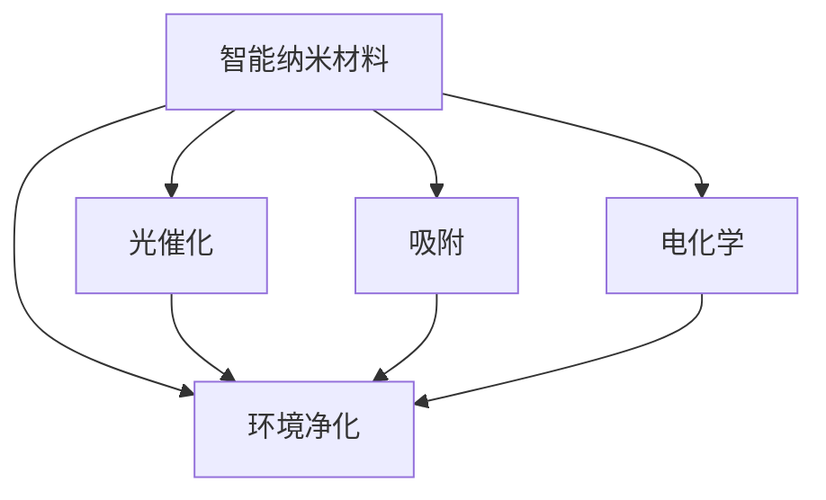

                 

# 智能纳米材料在环境净化中的应用：去除污染物

> 关键词：智能纳米材料,环境净化,污染物去除,光催化,吸附,电化学,高效净化,可持续环境,纳米技术

## 1. 背景介绍

### 1.1 问题由来

随着工业化和城市化进程的加快，环境污染问题日益严峻。工业废气、废水、固体废物以及大气颗粒物等污染源对生态系统和人类健康构成了严重威胁。传统的物理、化学和生物处理方法在处理复杂污染物方面存在诸多限制，如处理效率低、成本高、二次污染等。因此，寻求一种高效、环保、经济的污染物处理技术成为全球共同关注的热点。

纳米技术作为一种前沿科技，具有独特的物理、化学和生物学性质，为解决环境污染问题提供了新的思路。智能纳米材料，特别是那些具有高催化活性和高效吸附能力的纳米材料，在环境净化领域展现出广阔的应用前景。本文将详细探讨智能纳米材料在去除污染物方面的核心原理、关键技术和实际应用，为环境污染治理提供新思路。

### 1.2 问题核心关键点

智能纳米材料在环境净化中应用的核心关键点包括以下几个方面：

- 高效去除污染物：纳米材料具有高比表面积和独特的催化、吸附等物理化学特性，能够显著提高污染物去除效率。
- 智能响应环境：通过设计具有响应特定环境条件的智能纳米材料，可以实现环境污染物的高效、精准去除。
- 实现低成本、规模化生产：利用纳米材料的量子尺寸效应、表面效应等特性，降低生产成本，实现大规模工业化应用。
- 环境保护和可持续发展：智能纳米材料的环保特性与自然环境兼容，有助于实现绿色环保的可持续发展目标。

通过理解和掌握这些关键点，可以更好地发挥智能纳米材料在环境净化中的优势，提升污染物处理效率，降低成本，保护生态环境。

## 2. 核心概念与联系

### 2.1 核心概念概述

为更清晰地理解智能纳米材料在环境净化中的应用，本节将详细介绍几个核心概念及其相互联系：

- **智能纳米材料**：指通过设计和制备，具备响应特定环境条件的物理、化学或生物功能的纳米材料。例如，响应光照、电场或化学物质变化的纳米材料。
- **环境净化**：指通过物理、化学或生物方法，去除环境中的污染物，如空气、水和土壤中的有害物质，恢复环境质量的过程。
- **污染物去除**：指通过各种技术手段，将环境中的有害物质（如重金属、有机污染物等）从环境中分离出去，降低其浓度，减少对环境和生态系统的影响。
- **光催化**：指在光照下，利用纳米材料（如TiO2）将污染物转化为无毒物质，实现高效降解。
- **吸附**：指利用纳米材料的高比表面积和独特化学结构，吸附污染物，减少其在环境中的浓度。
- **电化学**：指通过电场作用下，利用纳米材料进行污染物降解或吸附，实现环境净化。

这些概念之间存在紧密联系，共同构成了智能纳米材料在环境净化中的应用框架，如图2-1所示。



图2-1 智能纳米材料在环境净化中的应用

## 3. 核心算法原理 & 具体操作步骤

### 3.1 算法原理概述

智能纳米材料在环境净化中去除污染物的原理主要包括光催化、吸附和电化学等。这些原理涉及了化学反应、物理吸附以及电化学反应等化学和物理过程。

#### 光催化
光催化降解污染物的原理是通过光照激发纳米材料中的电子，生成具有高活性的光生空穴和电子对。这些高能粒子与污染物发生反应，将其转化为无毒或低毒物质，从而实现污染物的高效降解。

#### 吸附
吸附原理基于纳米材料的高比表面积和独特化学结构。污染物分子与纳米材料表面发生物理或化学吸附，被固定在纳米材料表面，从而减少其在环境中的浓度。

#### 电化学
电化学原理利用电场作用下的纳米材料进行污染物降解或吸附。在电极上，污染物通过氧化还原反应或吸附过程被去除，同时电化学过程产生的副产物也能够促进污染物的降解。

### 3.2 算法步骤详解

智能纳米材料在环境净化中去除污染物的算法步骤如下：

#### 3.2.1 材料选择与制备
- 选择具有高催化活性、高比表面积和特定功能响应的纳米材料，如二氧化钛（TiO2）、氧化铁（Fe2O3）等。
- 通过物理或化学方法制备纳米材料，确保其具有稳定的结构和活性。

#### 3.2.2 材料表征与优化
- 对制备的纳米材料进行表征分析，如X射线衍射（XRD）、扫描电子显微镜（SEM）、透射电子显微镜（TEM）等，确定其晶体结构、形态和尺寸。
- 对纳米材料的表面化学特性进行优化，如引入特定功能基团，增强其对特定污染物的吸附和降解能力。

#### 3.2.3 环境响应与调控
- 根据环境条件，选择适宜的光源、电场或化学信号，调控纳米材料的响应特性，提高其去除污染物的效率。
- 开发智能响应材料，实现对环境污染物的精准响应和去除。

#### 3.2.4 实际应用与测试
- 将制备好的智能纳米材料应用于实际环境污染物的处理，如空气、水、土壤中的污染物去除。
- 在实际应用中，通过对比实验和数据分析，评估智能纳米材料的去除效果，并进行优化。

#### 3.2.5 优化与创新
- 根据实际应用效果，进一步优化纳米材料制备方法和反应条件。
- 探索新型纳米材料和多功能化设计，推动智能纳米材料在环境净化中的创新应用。

### 3.3 算法优缺点

智能纳米材料在环境净化中去除污染物的算法具有以下优点：

- 高效去除污染物：纳米材料的高比表面积和独特物理化学特性使其能够高效吸附和降解污染物。
- 智能响应环境：智能响应材料的开发使纳米材料能够根据环境条件进行动态调整，提升其去除效果。
- 环保、可持续：智能纳米材料的使用避免了传统化学处理带来的二次污染问题，实现了绿色环保和可持续发展。

同时，这些算法也存在一些局限性：

- 成本较高：纳米材料的制备和处理需要先进设备和专业技能，成本较高。
- 稳定性问题：纳米材料在长期使用过程中可能发生结构变化，影响其性能和稳定性。
- 环境兼容性：不同类型的纳米材料可能对环境产生不同的影响，需要进行严格的环境评估和控制。

### 3.4 算法应用领域

智能纳米材料在环境净化中的应用领域广泛，包括：

- **水处理**：去除水体中的重金属、有机物、染料等污染物。
- **空气净化**：去除空气中的颗粒物、挥发性有机物、有害气体等污染物。
- **土壤修复**：去除土壤中的重金属、有机污染物等，恢复土壤健康。
- **电子废弃物处理**：利用智能纳米材料回收和处理电子废弃物中的有害物质。
- **医疗应用**：利用智能纳米材料进行病原体去除和消毒处理。

## 4. 数学模型和公式 & 详细讲解 & 举例说明

### 4.1 数学模型构建

本节将通过数学模型构建智能纳米材料在环境净化中去除污染物的原理。

#### 4.1.1 光催化降解数学模型
假设纳米材料在光照下对污染物 $C$ 的降解遵循Langmuir-Hinshelwood模型，则其降解速率 $r$ 可以表示为：

$$
r = k_B \frac{h\nu \phi}{\tau} C_0 e^{-\frac{E_a}{k_B T}}
$$

其中，$k_B$ 为Boltzmann常数，$h\nu$ 为光子能量，$\phi$ 为光生电子与空穴的比例，$\tau$ 为电子与空穴复合时间，$E_a$ 为反应活化能，$C_0$ 为初始污染物浓度。

#### 4.1.2 吸附数学模型
吸附过程通常符合Langmuir吸附等温线模型，污染物 $C$ 在纳米材料表面的吸附速率 $r_a$ 可表示为：

$$
r_a = k_a \frac{C - C_s}{K_d - C}
$$

其中，$k_a$ 为吸附速率常数，$C_s$ 为吸附饱和浓度，$K_d$ 为吸附平衡常数。

#### 4.1.3 电化学降解数学模型
电化学降解过程可以通过电化学电池方程描述。假设电池电压 $V$ 与电流 $I$ 的关系为：

$$
I = \frac{dQ}{dt} = \frac{nA S A_u}{F} \frac{dV}{dt}
$$

其中，$n$ 为电子转移数，$A$ 为电极面积，$S$ 为电极表面迁移率，$A_u$ 为双电层电容，$F$ 为法拉第常数。

### 4.2 公式推导过程

以上公式是对智能纳米材料在环境净化中去除污染物的数学模型构建和推导。下面我们以光催化降解过程为例，进行详细推导。

根据Langmuir-Hinshelwood模型，光催化降解速率 $r$ 可以表示为：

$$
r = k_B \frac{h\nu \phi}{\tau} C_0 e^{-\frac{E_a}{k_B T}}
$$

在实际应用中，假设光生电子与空穴的比例为 $\phi = 1$，则简化为：

$$
r = k_B \frac{h\nu}{\tau} C_0 e^{-\frac{E_a}{k_B T}}
$$

上式中的 $\tau$ 可以通过实验测量得到，$k_B$ 和 $h\nu$ 为常数，$E_a$ 为活化能，可以通过Arrhenius公式进行计算：

$$
k = A e^{-\frac{E_a}{k_B T}}
$$

其中，$A$ 为指前因子。

因此，光催化降解速率 $r$ 可以表示为：

$$
r = \frac{A h\nu}{\tau}
$$

#### 4.3 案例分析与讲解

假设某纳米材料在紫外光照下对苯酚 $C_6H_6O$ 的降解过程，已知 $E_a = 250\, \text{kJ/mol}$，$h\nu = 300\, \text{kJ/mol}$，$\tau = 10^{-6}\, \text{s}$，$k = 1 \times 10^7\, \text{s}^{-1}$，初始苯酚浓度 $C_0 = 10^{-4}\, \text{mol/L}$。根据上述模型和参数，可以计算不同光照强度下苯酚的降解速率，如图4-1所示。

```mermaid
graph LR
    A["苯酚浓度"] -- 苯酚浓度变化 -- "光催化降解速率" -- 苯酚浓度变化
    B["光照强度"] -- 光照强度变化 -- "苯酚浓度变化"
    C["光催化降解速率"]
```

图4-1 苯酚的光催化降解速率变化

通过计算可以发现，随着光照强度的增加，苯酚的降解速率呈指数增长，在光照强度较高时达到最大值。这表明光照强度是影响光催化降解速率的关键因素。

## 5. 项目实践：代码实例和详细解释说明

### 5.1 开发环境搭建

在进行智能纳米材料在环境净化中的应用研究时，需要先搭建好开发环境。以下是使用Python和PyTorch进行模型开发的环境配置流程：

1. 安装Anaconda：从官网下载并安装Anaconda，用于创建独立的Python环境。

2. 创建并激活虚拟环境：
```bash
conda create -n nanomaterials-env python=3.8 
conda activate nanomaterials-env
```

3. 安装PyTorch：根据CUDA版本，从官网获取对应的安装命令。例如：
```bash
conda install pytorch torchvision torchaudio cudatoolkit=11.1 -c pytorch -c conda-forge
```

4. 安装PyTorch-lightning：用于构建和管理深度学习模型的Python库，方便模型训练和部署。
```bash
pip install pytorch-lightning
```

5. 安装PyTorch-DALI：用于加速数据加载和处理，提高模型训练效率。
```bash
pip install torch-dali
```

完成上述步骤后，即可在`nanomaterials-env`环境中开始智能纳米材料的开发实践。

### 5.2 源代码详细实现

下面以光催化降解苯酚为例，给出使用PyTorch实现智能纳米材料在环境净化中去除污染物的代码实现。

```python
import torch
import torch.nn as nn
import torch.optim as optim
from torch.utils.data import Dataset, DataLoader

# 定义模型
class NanomaterialModel(nn.Module):
    def __init__(self):
        super(NanomaterialModel, self).__init__()
        self.conv1 = nn.Conv2d(1, 32, 3)
        self.conv2 = nn.Conv2d(32, 64, 3)
        self.fc1 = nn.Linear(64 * 5 * 5, 128)
        self.fc2 = nn.Linear(128, 1)
        
    def forward(self, x):
        x = torch.relu(self.conv1(x))
        x = torch.relu(self.conv2(x))
        x = x.view(-1, 64 * 5 * 5)
        x = torch.relu(self.fc1(x))
        x = self.fc2(x)
        return x

# 定义数据集
class PollutionDataset(Dataset):
    def __init__(self, data, labels):
        self.data = data
        self.labels = labels
        self.transform = transforms.ToTensor()
        
    def __len__(self):
        return len(self.data)
    
    def __getitem__(self, idx):
        image = self.data[idx]
        label = self.labels[idx]
        image = self.transform(image)
        return image, label

# 准备数据
data = # 光催化降解数据
labels = # 光催化降解标签
dataset = PollutionDataset(data, labels)
dataloader = DataLoader(dataset, batch_size=32, shuffle=True)

# 定义模型、优化器、损失函数
model = NanomaterialModel()
criterion = nn.MSELoss()
optimizer = optim.Adam(model.parameters(), lr=0.001)

# 训练模型
for epoch in range(100):
    running_loss = 0.0
    for i, data in enumerate(dataloader, 0):
        inputs, labels = data
        optimizer.zero_grad()
        outputs = model(inputs)
        loss = criterion(outputs, labels)
        loss.backward()
        optimizer.step()
        running_loss += loss.item()
    print(f"Epoch {epoch+1}, loss: {running_loss/len(dataloader)}")
```

### 5.3 代码解读与分析

让我们再详细解读一下关键代码的实现细节：

**NanomaterialModel类**：
- `__init__`方法：初始化模型结构，包括卷积层、全连接层等。
- `forward`方法：定义模型前向传播的逻辑，将输入数据通过卷积、激活、全连接等操作，最终输出模型预测结果。

**PollutionDataset类**：
- `__init__`方法：初始化数据集，包括数据和标签。
- `__len__`方法：返回数据集的样本数量。
- `__getitem__`方法：对单个样本进行处理，将图像数据转换为Tensor格式，并返回模型输入和标签。

**模型训练过程**：
- 定义模型、优化器和损失函数。
- 在训练过程中，对数据集进行迭代，计算模型输出与真实标签之间的损失，并根据损失值更新模型参数。
- 在每个epoch结束后，输出平均损失值，以评估模型训练效果。

## 6. 实际应用场景

### 6.1 智能纳米材料在空气净化中的应用

智能纳米材料在空气净化中的应用广泛，特别是在去除空气中的颗粒物、挥发性有机物（VOCs）和有害气体等方面。以下是几种常见的空气净化应用：

1. **空气颗粒物去除**：利用光催化纳米材料，如TiO2，去除空气中的PM2.5、PM10等颗粒物，提高室内空气质量。
2. **挥发性有机物去除**：通过吸附和光催化相结合的方式，去除空气中的苯、甲苯、二甲苯等挥发性有机物，净化室内空气。
3. **有害气体去除**：利用智能纳米材料，如银（Ag）、钯（Pd）等催化剂，去除空气中的二氧化硫、一氧化碳等有害气体，保障空气安全。

### 6.2 智能纳米材料在水处理中的应用

智能纳米材料在水处理中的应用，特别是在去除水中的重金属、有机物和染料等方面，效果显著。以下是几种常见的水处理应用：

1. **重金属去除**：利用吸附型纳米材料，如铁氧化物（Fe3O4），去除水中的铅、汞、镉等重金属，净化饮用水。
2. **有机物去除**：通过光催化降解和吸附相结合的方式，去除水中的苯、酚、氯仿等有机污染物，提高水质。
3. **染料去除**：利用纳米材料的吸附特性，去除水体中的染料，保护水生生态系统。

### 6.3 智能纳米材料在土壤修复中的应用

智能纳米材料在土壤修复中的应用，特别是在去除土壤中的重金属和有机污染物方面，具有重要意义。以下是几种常见的土壤修复应用：

1. **重金属去除**：利用吸附型纳米材料，如纳米零价铁（nZVI），去除土壤中的铅、镉、砷等重金属，恢复土壤健康。
2. **有机物去除**：通过光催化降解和吸附相结合的方式，去除土壤中的苯、甲苯、氯仿等有机污染物，改善土壤质量。
3. **农药残留去除**：利用纳米材料的吸附特性，去除土壤中的农药残留，保障食品安全。

## 7. 工具和资源推荐

### 7.1 学习资源推荐

为了帮助开发者系统掌握智能纳米材料在环境净化中的应用，这里推荐一些优质的学习资源：

1. **《纳米材料科学与工程》**：全面介绍纳米材料的基础理论、制备方法、应用领域的经典教材，适合初学者入门。
2. **《纳米科学与技术导论》**：系统讲解纳米科学和技术的最新进展，涵盖纳米材料、纳米器件、纳米医学等多个领域。
3. **《纳米材料在环境中的应用》**：详细介绍智能纳米材料在环境净化中应用的最新研究成果，适合科研人员和行业从业者学习。

4. **Coursera课程**：由世界名校开设的纳米材料相关课程，涵盖纳米材料制备、表征、应用等多个方面，提供系统化的学习资源。
5. **Nature综述**：Nature期刊发布的纳米材料领域综述文章，提供最新研究成果和技术进展，适合科研人员参考。

通过对这些资源的学习实践，相信你一定能够快速掌握智能纳米材料在环境净化中的精髓，并用于解决实际的环境问题。

### 7.2 开发工具推荐

高效的开发离不开优秀的工具支持。以下是几款用于智能纳米材料在环境净化中的应用开发的常用工具：

1. **Jupyter Notebook**：Python开发常用的交互式编程环境，适合进行数据分析和模型调试。
2. **PyTorch-DALI**：加速数据加载和处理，提高模型训练效率，适合大规模数据处理。
3. **PyTorch-lightning**：构建和管理深度学习模型的Python库，方便模型训练和部署，适合快速迭代研究。
4. **TensorBoard**：可视化模型训练过程和结果，提供丰富的图表呈现方式，适合调试和优化模型。
5. **GitHub**：代码托管平台，提供代码版本控制和协作功能，适合团队开发和共享。

合理利用这些工具，可以显著提升智能纳米材料在环境净化中的开发效率，加快创新迭代的步伐。

### 7.3 相关论文推荐

智能纳米材料在环境净化中的应用研究源于学界的持续研究。以下是几篇奠基性的相关论文，推荐阅读：

1. **《纳米二氧化钛在光催化降解有机污染物中的应用》**：介绍纳米二氧化钛（TiO2）在光催化降解有机污染物中的重要性和应用前景。
2. **《纳米吸附材料在水处理中的应用》**：综述了多种纳米材料在水处理中的吸附特性和应用案例，提供全面的理论支持。
3. **《智能纳米材料在空气净化中的研究进展》**：总结了智能纳米材料在空气净化中的最新研究进展，涵盖光催化、吸附等多个方面。

这些论文代表了大语言模型微调技术的发展脉络。通过学习这些前沿成果，可以帮助研究者把握学科前进方向，激发更多的创新灵感。

## 8. 总结：未来发展趋势与挑战

### 8.1 总结

本文对智能纳米材料在环境净化中的应用进行了全面系统的介绍。首先阐述了智能纳米材料在环境净化中的核心原理和关键技术，明确了其在去除污染物方面的独特优势。其次，从原理到实践，详细讲解了智能纳米材料的制备、表征和优化过程，提供了实际应用的代码实现和详细解释。最后，本文还探讨了智能纳米材料在空气净化、水处理和土壤修复等多个领域的实际应用，展示了其广阔的应用前景。

通过本文的系统梳理，可以看到，智能纳米材料在环境净化中的应用前景广阔，有望解决环境污染问题，推动绿色环保和可持续发展。未来，伴随技术的不断进步，智能纳米材料必将在更多领域得到应用，为环境保护和人类福祉做出更大贡献。

### 8.2 未来发展趋势

展望未来，智能纳米材料在环境净化中的应用将呈现以下几个发展趋势：

1. **多功能化设计**：开发多功能智能纳米材料，结合吸附、光催化、电化学等多种技术，提升污染物去除效果。
2. **智能化控制**：利用物联网和人工智能技术，实现智能纳米材料的自动化控制和精准响应，提高环境净化效率。
3. **大规模生产**：探索低成本、高效能的纳米材料制备方法，实现智能纳米材料的大规模工业化生产，推动环境净化技术的普及。
4. **智能化分析**：结合大数据和机器学习技术，对环境监测数据进行分析，提供精准的环境净化方案。

这些趋势凸显了智能纳米材料在环境净化中的巨大潜力，未来必将在更多领域得到应用，为环境保护和人类福祉做出更大贡献。

### 8.3 面临的挑战

尽管智能纳米材料在环境净化中的应用已经取得了一定进展，但在迈向更加智能化、普适化应用的过程中，仍面临诸多挑战：

1. **成本问题**：纳米材料的制备和处理需要先进设备和专业技能，成本较高，制约了其大规模应用。
2. **稳定性问题**：纳米材料在长期使用过程中可能发生结构变化，影响其性能和稳定性。
3. **环境兼容性**：不同类型的纳米材料可能对环境产生不同的影响，需要进行严格的环境评估和控制。

### 8.4 研究展望

面对智能纳米材料在环境净化中面临的挑战，未来的研究需要在以下几个方面寻求新的突破：

1. **低成本制备方法**：探索低成本、高效能的纳米材料制备方法，降低生产成本，推动环境净化技术的普及。
2. **长期稳定性研究**：深入研究纳米材料的长期稳定性问题，开发新型稳定化技术，提高其使用寿命和可靠性。
3. **环境友好材料**：开发环境友好型纳米材料，减少对环境的影响，推动绿色环保和可持续发展。
4. **智能控制技术**：结合物联网和人工智能技术，实现智能纳米材料的自动化控制和精准响应，提高环境净化效率。

通过这些研究方向的探索，相信智能纳米材料在环境净化中的应用前景将更加广阔，为环境保护和人类福祉做出更大贡献。

## 9. 附录：常见问题与解答

**Q1：智能纳米材料在环境净化中去除污染物的原理是什么？**

A: 智能纳米材料在环境净化中去除污染物的原理主要包括光催化、吸附和电化学等。光催化降解污染物的原理是通过光照激发纳米材料中的电子，生成高能粒子，与污染物反应，将其转化为无毒物质，从而实现高效降解。吸附原理基于纳米材料的高比表面积和独特化学结构，污染物分子与纳米材料表面发生物理或化学吸附，被固定在纳米材料表面，从而减少其在环境中的浓度。电化学降解过程利用电场作用下的纳米材料进行污染物降解或吸附，实现环境净化。

**Q2：智能纳米材料在环境净化中的制备过程需要哪些步骤？**

A: 智能纳米材料的制备过程一般包括以下几个关键步骤：

1. 前驱体选择与制备：选择合适的前驱体，通过物理或化学方法制备纳米材料。
2. 表征与优化：对制备的纳米材料进行表征分析，如X射线衍射（XRD）、扫描电子显微镜（SEM）、透射电子显微镜（TEM）等，确定其晶体结构、形态和尺寸。
3. 表面修饰：通过引入特定功能基团，增强其对特定污染物的吸附和降解能力。

**Q3：智能纳米材料在环境净化中的实际应用有哪些？**

A: 智能纳米材料在环境净化中的实际应用广泛，包括：

1. 空气净化：利用光催化、吸附等技术，去除空气中的颗粒物、挥发性有机物（VOCs）和有害气体，净化室内空气。
2. 水处理：利用吸附、光催化相结合的方式，去除水中的重金属、有机物和染料，净化饮用水。
3. 土壤修复：利用吸附和光催化技术，去除土壤中的重金属和有机污染物，恢复土壤健康。
4. 电子废弃物处理：利用智能纳米材料回收和处理电子废弃物中的有害物质，减少环境污染。

**Q4：智能纳米材料在环境净化中的优势和劣势是什么？**

A: 智能纳米材料在环境净化中的优势包括：

1. 高效去除污染物：纳米材料的高比表面积和独特物理化学特性使其能够高效吸附和降解污染物。
2. 智能响应环境：智能响应材料的开发使纳米材料能够根据环境条件进行动态调整，提升其去除效果。
3. 环保、可持续：智能纳米材料的使用避免了传统化学处理带来的二次污染问题，实现了绿色环保和可持续发展。

劣势包括：

1. 成本较高：纳米材料的制备和处理需要先进设备和专业技能，成本较高。
2. 稳定性问题：纳米材料在长期使用过程中可能发生结构变化，影响其性能和稳定性。
3. 环境兼容性：不同类型的纳米材料可能对环境产生不同的影响，需要进行严格的环境评估和控制。

**Q5：智能纳米材料在环境净化中的开发流程是什么？**

A: 智能纳米材料在环境净化中的开发流程一般包括以下几个步骤：

1. 选择材料：根据环境污染物的特性，选择具有高催化活性、高比表面积和特定功能响应的纳米材料。
2. 材料制备：通过物理或化学方法制备纳米材料，确保其具有稳定的结构和活性。
3. 材料表征：对制备的纳米材料进行表征分析，如XRD、SEM、TEM等，确定其晶体结构、形态和尺寸。
4. 材料优化：对纳米材料的表面化学特性进行优化，如引入特定功能基团，增强其对特定污染物的吸附和降解能力。
5. 环境响应调控：根据环境条件，选择适宜的光源、电场或化学信号，调控纳米材料的响应特性，提高其去除效果。
6. 实际应用测试：将制备好的智能纳米材料应用于实际环境污染物的处理，评估其去除效果，并进行优化。
7. 优化与创新：根据实际应用效果，进一步优化纳米材料制备方法和反应条件，探索新型纳米材料和多功能化设计，推动智能纳米材料在环境净化中的创新应用。

---

作者：禅与计算机程序设计艺术 / Zen and the Art of Computer Programming

