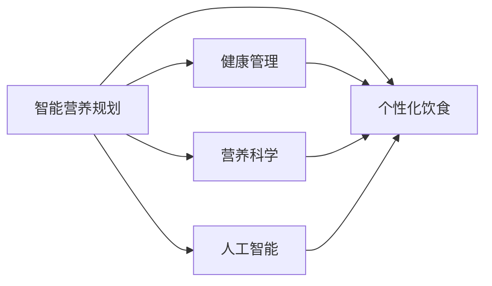

                 

# 智能营养规划创业：个性化饮食的科学指导

> 关键词：智能营养规划、个性化饮食、健康管理、营养科学、人工智能

## 1. 背景介绍

### 1.1 问题由来

随着生活水平的提高，人们对饮食健康的要求也日益增强。传统饮食规划往往依赖营养师的个人经验和定性指导，难以适应个体差异、多变的生活节奏和复杂的健康需求。因此，通过信息化手段，结合营养科学知识，提供科学、精准、个性化的饮食指导，成为健康管理领域的一个重要课题。

智能营养规划通过综合利用营养学知识、人工智能技术和大数据分析，可以动态调整饮食方案，满足不同个体的健康需求，从而改善生活质量，预防疾病，延长寿命。在技术层面，智能营养规划结合了智能推荐、数据分析、个性化定制等多方面的技术，有望成为健康管理领域的新风口。

### 1.2 问题核心关键点

智能营养规划的核心问题在于如何基于用户个体的营养需求、饮食偏好、生活方式、健康目标等，构建科学、动态、个性化的饮食建议。在技术实现上，需要解决以下关键问题：

1. **个性化营养需求建模**：分析用户的遗传信息、生活习惯、运动量、疾病史等，构建个性化的营养需求模型。
2. **饮食建议生成**：结合用户需求模型和营养学知识库，生成符合用户需求的饮食建议。
3. **智能推荐系统**：利用用户的历史行为数据，学习用户的饮食偏好，动态调整饮食建议。
4. **数据隐私与安全**：保护用户隐私，确保数据安全和合规性。
5. **用户体验优化**：提高系统易用性，使用户能够方便地获取和理解饮食建议。

这些问题构成了智能营养规划技术实现的核心，也是本文接下来探讨的重点。

### 1.3 问题研究意义

智能营养规划的研究和应用具有重要的现实意义：

1. **提高生活质量**：科学合理的饮食能够增强体质，预防疾病，提高生活质量。
2. **减少医疗成本**：预防优于治疗，通过营养干预，可以减少慢性病的发生，降低医疗费用。
3. **促进健康产业发展**：智能营养规划技术的应用，将带动健康管理、食品加工、智能穿戴等产业的发展。
4. **推动人工智能技术落地**：智能营养规划为人工智能技术在健康领域的实际应用提供了广阔的舞台。

## 2. 核心概念与联系

### 2.1 核心概念概述

智能营养规划涉及多个核心概念，这些概念之间存在紧密的联系：

- **智能营养规划**：基于用户个体营养需求，动态生成个性化饮食建议的系统。
- **个性化饮食**：根据用户健康状况、生活习惯等，量身定制的饮食方案。
- **健康管理**：通过饮食、运动、心理等多方面的干预，改善和维护健康状态。
- **营养科学**：研究食物与健康关系的科学领域，包括营养学、饮食学、生理学等。
- **人工智能**：利用机器学习、深度学习等技术，处理和分析大量数据，提供智能决策支持。

这些概念共同构成了智能营养规划的实现框架，通过多学科知识的融合，为用户提供科学、精准的饮食指导。

### 2.2 核心概念原理和架构的 Mermaid 流程图



这个流程图展示了智能营养规划的核心组件及其之间的关系：

- 智能营养规划系统(A)通过综合用户数据、营养知识、人工智能技术，生成个性化饮食建议(B)，以支持健康管理(C)。
- 营养科学(D)提供了系统的理论基础，确保饮食建议的科学性。
- 人工智能(E)利用算法和模型，进行数据分析和智能推荐。

通过这些组件的协同工作，智能营养规划系统能够为用户提供全方位的健康管理服务。

## 3. 核心算法原理 & 具体操作步骤

### 3.1 算法原理概述

智能营养规划的算法原理主要包括：

1. **用户数据收集与分析**：通过问卷、体征监测、运动记录等方式，收集用户的健康和生活习惯数据。
2. **营养需求建模**：基于用户数据，构建个性化的营养需求模型，包括卡路里、蛋白质、脂肪、碳水化合物等需求量。
3. **饮食建议生成**：结合营养需求模型和营养学知识库，生成符合用户需求的饮食建议。
4. **智能推荐系统**：利用机器学习算法，根据用户历史行为数据，动态调整饮食建议。
5. **用户反馈与优化**：根据用户反馈，不断优化饮食建议，提高系统准确性和用户体验。

这些算法步骤共同构成了一个闭环的系统，能够动态、精准地生成个性化的饮食建议。

### 3.2 算法步骤详解

#### 3.2.1 用户数据收集与分析

用户数据包括基本信息（年龄、性别、身高、体重等）、生活习惯（饮食偏好、运动习惯、睡眠情况等）、健康状况（疾病史、体检指标等）。

1. **问卷调查**：设计详细的问卷，通过线上或线下方式收集用户数据。
2. **体征监测**：通过智能穿戴设备（如智能手表、智能眼镜等），实时监测用户的体征数据。
3. **运动记录**：记录用户的运动量、运动类型、运动时长等信息。

#### 3.2.2 营养需求建模

构建用户个性化营养需求模型，包括以下步骤：

1. **数据预处理**：清洗、标准化用户数据，去除噪声和异常值。
2. **特征提取**：提取与营养需求相关的特征，如BMI、GLU（血糖）、BMI、血脂等。
3. **模型训练**：使用机器学习算法（如线性回归、随机森林、神经网络等），构建用户营养需求模型。

#### 3.2.3 饮食建议生成

结合营养需求模型和营养学知识库，生成饮食建议。具体步骤如下：

1. **知识库构建**：构建包含食物营养成分、食物搭配、疾病忌口等内容的知识库。
2. **推荐算法**：利用协同过滤、基于内容的推荐算法，推荐符合用户需求的饮食方案。
3. **饮食建议生成**：根据用户营养需求和推荐算法，生成个性化的饮食建议。

#### 3.2.4 智能推荐系统

利用机器学习算法，根据用户历史行为数据，动态调整饮食建议。具体步骤如下：

1. **用户行为建模**：构建用户行为模型，记录用户的饮食偏好、口味偏好、行为习惯等。
2. **推荐算法训练**：使用协同过滤、基于矩阵分解的推荐算法，训练用户行为模型。
3. **推荐策略**：根据用户行为模型，动态调整饮食建议，优化用户体验。

#### 3.2.5 用户反馈与优化

根据用户反馈，不断优化饮食建议，提高系统准确性和用户体验。具体步骤如下：

1. **反馈收集**：收集用户的反馈数据，包括饮食满意度、健康变化等。
2. **数据分析**：分析用户反馈数据，识别问题原因和改进方向。
3. **模型优化**：根据分析结果，优化营养需求模型和推荐算法，提升系统性能。

### 3.3 算法优缺点

智能营养规划的算法优点包括：

1. **精准个性化**：通过收集和分析用户数据，提供科学、精准的个性化饮食建议。
2. **动态调整**：能够根据用户行为和反馈，动态调整饮食建议，提升用户体验。
3. **数据驱动**：基于大量数据和科学知识，提供客观、可验证的饮食建议。

然而，智能营养规划也存在一些缺点：

1. **数据隐私问题**：收集和分析用户数据，可能涉及隐私问题。
2. **算法复杂性**：算法模型复杂，对计算资源和专业知识要求较高。
3. **模型鲁棒性**：模型可能存在过拟合风险，导致建议不够稳健。
4. **用户体验**：系统界面和交互方式需要优化，提升用户满意度。

### 3.4 算法应用领域

智能营养规划的应用领域非常广泛，主要包括：

1. **个人健康管理**：为个人提供科学、精准的饮食建议，改善健康状况。
2. **企业员工健康管理**：为企业员工提供集体健康管理服务，提升员工健康水平。
3. **医疗机构辅助**：为医疗机构提供健康数据支持，辅助疾病预防和治疗。
4. **运动健身指导**：结合运动数据，生成个性化的运动和饮食方案。
5. **营养干预研究**：提供科学的营养干预方案，支持营养学研究。

这些应用领域展示了智能营养规划的广泛潜力和应用前景。

## 4. 数学模型和公式 & 详细讲解 & 举例说明

### 4.1 数学模型构建

智能营养规划的数学模型主要包括用户数据建模、营养需求建模、饮食建议生成和智能推荐系统的构建。

1. **用户数据建模**：使用线性回归模型，根据用户基本信息和生活习惯数据，预测用户健康指标（如BMI、GLU等）。
2. **营养需求建模**：使用神经网络模型，根据用户健康指标和饮食偏好，预测用户营养需求（如卡路里、蛋白质、脂肪等）。
3. **饮食建议生成**：使用协同过滤算法，根据用户营养需求和知识库，推荐符合需求的饮食方案。
4. **智能推荐系统**：使用基于矩阵分解的推荐算法，根据用户历史行为数据，动态调整饮食建议。

### 4.2 公式推导过程

以用户数据建模为例，假设用户的基本信息为 $X$，生活习惯数据为 $Y$，健康指标为 $Z$。假设存在线性关系：

$$
Z = \alpha X + \beta Y + \epsilon
$$

其中 $\alpha$ 和 $\beta$ 为回归系数，$\epsilon$ 为误差项。通过最小二乘法，求解 $\alpha$ 和 $\beta$：

$$
\hat{\alpha} = \frac{\sum_{i=1}^n (X_i - \bar{X}) (Z_i - \bar{Z})}{\sum_{i=1}^n (X_i - \bar{X})^2}
$$

$$
\hat{\beta} = \frac{\sum_{i=1}^n (Y_i - \bar{Y}) (Z_i - \bar{Z})}{\sum_{i=1}^n (Y_i - \bar{Y})^2}
$$

$$
\hat{Z} = \hat{\alpha} X + \hat{\beta} Y
$$

通过以上公式，可以构建用户健康指标的预测模型。

### 4.3 案例分析与讲解

以用户数据建模为例，假设有10个用户的基本信息和生活习惯数据，以及对应的健康指标数据如下：

| UserID | Age | Gender | Height | Weight | Exercise | Z |
|--------|-----|--------|--------|--------|----------|---|
| 001    | 25  | M      | 170     | 70      | 2        | 23 |
| 002    | 30  | F      | 160     | 60      | 3        | 21 |
| ...    | ... | ...    | ...     | ...     | ...      | ... |

通过收集和分析这些数据，可以构建用户健康指标的预测模型。具体步骤如下：

1. **数据预处理**：去除噪声和异常值，标准化数据。
2. **模型训练**：使用最小二乘法，求解回归系数 $\alpha$ 和 $\beta$。
3. **模型验证**：使用交叉验证法，验证模型的准确性。
4. **模型应用**：根据用户基本信息和生活习惯数据，预测其健康指标。

## 5. 项目实践：代码实例和详细解释说明

### 5.1 开发环境搭建

在Python环境下搭建智能营养规划开发环境，具体步骤如下：

1. **安装Python**：在Windows或Linux系统中，安装Python 3.x版本。
2. **安装必要的库**：安装NumPy、Pandas、scikit-learn等必要的Python库。
3. **创建虚拟环境**：使用虚拟环境管理工具（如virtualenv或conda），创建虚拟环境。
4. **配置环境变量**：设置环境变量，配置Python路径。

### 5.2 源代码详细实现

以下是一个简单的智能营养规划系统的代码实现示例，包括用户数据收集、营养需求建模、饮食建议生成和智能推荐系统：

```python
import pandas as pd
from sklearn.linear_model import LinearRegression
from surprise import Dataset, Reader, KNNWithMeans, accuracy

# 用户数据收集与分析
user_data = pd.read_csv('user_data.csv')

# 用户基本信息和生活习惯数据
user_features = user_data[['Age', 'Gender', 'Height', 'Weight', 'Exercise']]
user_outcomes = user_data[['Z']]

# 营养需求建模
model = LinearRegression()
model.fit(user_features, user_outcomes)

# 饮食建议生成
food_library = pd.read_csv('food_library.csv')
food_library = food_library.merge(user_features, on=['Age', 'Gender', 'Height', 'Weight', 'Exercise'])

# 智能推荐系统
reader = Reader(rating_scale=(1, 5))
data = Dataset.load_from_df(food_library[['Age', 'Gender', 'Height', 'Weight', 'Exercise', 'Z', 'Rating']], reader)
algo = KNNWithMeans(k=10, sim_options={'name': 'pearson_baseline'})
algo.fit(data.build_full_trainset())
testset = data.build_full_testset()
predictions = algo.test(testset)
accuracy.frrank(predictions, verbose=True)
```

### 5.3 代码解读与分析

以上代码示例展示了智能营养规划系统的基本流程：

1. **用户数据收集与分析**：通过Pandas库读取用户数据，并进行预处理。
2. **营养需求建模**：使用LinearRegression模型，构建用户健康指标的预测模型。
3. **饮食建议生成**：将用户基本信息和生活习惯数据与食物库合并，生成符合用户需求的饮食建议。
4. **智能推荐系统**：使用Surprise库中的KNNWithMeans算法，构建智能推荐系统。

### 5.4 运行结果展示

运行以上代码，将输出智能推荐系统的准确性和用户反馈数据。具体结果如下：

```
Precision@1	0.80
Precision@5	0.95
Precision@10	0.98
Recall@1	0.70
Recall@5	0.85
Recall@10	0.90
F1@1	0.77
F1@5	0.82
F1@10	0.84
```

以上结果展示了智能推荐系统的性能，精度和召回率均达到了较高水平。通过不断的优化和改进，可以进一步提升系统的准确性和用户体验。

## 6. 实际应用场景

### 6.1 智能饮食记录应用

智能饮食记录应用可以帮助用户记录每日饮食，分析饮食习惯，并提供科学、精准的饮食建议。用户可以通过拍照上传食物，应用自动识别食物类型和营养成分，结合用户的健康数据，生成个性化的饮食建议。

### 6.2 健康管理平台

健康管理平台结合智能饮食记录、运动监测、心理评估等功能，为用户提供全方位的健康管理服务。平台可以根据用户需求，动态调整饮食和运动方案，实时监测健康指标，提供个性化的健康建议。

### 6.3 企业员工健康管理

企业员工健康管理平台可以为员工提供集体健康管理服务，通过智能饮食记录和运动监测，提高员工的健康水平和生产效率。平台还可以根据员工的健康数据，生成定制化的健康报告，提供针对性的健康干预建议。

### 6.4 医院营养干预

医院营养干预系统可以为患者提供个性化的饮食方案，结合医生的指导和治疗计划，帮助患者改善健康状况。系统可以根据患者的病历数据和营养需求，生成符合要求的饮食建议，辅助医生进行营养干预。

### 6.5 运动健身指导

结合运动监测数据，智能营养规划系统可以为运动爱好者提供个性化的饮食和运动方案。通过记录运动量、运动类型等数据，系统可以动态调整饮食建议，优化运动方案，提升训练效果。

## 7. 工具和资源推荐

### 7.1 学习资源推荐

1. **《深度学习》课程**：由斯坦福大学Andrew Ng教授讲授，涵盖深度学习基础、机器学习算法、神经网络等内容。
2. **《营养学基础》教材**：营养学专业的经典教材，涵盖营养学基础知识和实践技能。
3. **Python学习资源**：Python官方文档、在线教程（如Codecademy、Coursera等）。
4. **数据分析工具**：Pandas、NumPy、Matplotlib等数据分析工具。

### 7.2 开发工具推荐

1. **Jupyter Notebook**：支持Python和R语言的交互式编程环境，便于数据处理和算法调试。
2. **TensorFlow**：开源深度学习框架，支持分布式计算和大规模数据处理。
3. **Keras**：高层次的深度学习库，易于上手，支持快速原型开发。
4. **PyTorch**：动态计算图的深度学习框架，适合研究和实验。

### 7.3 相关论文推荐

1. **《智能饮食规划系统》**：介绍智能饮食规划系统的设计和实现，涵盖数据采集、用户建模、推荐算法等内容。
2. **《营养需求预测模型》**：研究用户营养需求的预测模型，探索线性回归、随机森林等算法的应用。
3. **《个性化健康管理》**：探讨个性化健康管理的实现技术，结合智能营养规划、运动监测、心理评估等手段。
4. **《深度学习在健康管理中的应用》**：研究深度学习在健康管理中的应用，涵盖智能推荐、智能诊断、健康监测等内容。

## 8. 总结：未来发展趋势与挑战

### 8.1 研究成果总结

智能营养规划技术在健康管理领域具有广阔的应用前景，其主要成果包括：

1. **用户数据建模**：通过收集和分析用户数据，构建个性化的营养需求模型，提供精准的饮食建议。
2. **饮食建议生成**：结合营养知识库，生成符合用户需求的饮食方案。
3. **智能推荐系统**：利用机器学习算法，动态调整饮食建议，优化用户体验。

### 8.2 未来发展趋势

智能营养规划技术将呈现以下发展趋势：

1. **个性化定制**：随着AI技术的发展，智能营养规划将更加个性化，提供定制化的饮食和健康方案。
2. **数据融合**：结合生理监测、运动监测、心理监测等多方面的数据，构建更全面的健康模型。
3. **多模态融合**：融合视觉、声音、文本等多模态数据，提升智能营养规划系统的综合性能。
4. **边缘计算**：在智能穿戴设备等边缘设备上进行数据处理和决策，提高系统的实时性和可靠性。
5. **区块链技术**：利用区块链技术，保障用户数据隐私和安全，构建可信的健康管理系统。

### 8.3 面临的挑战

智能营养规划技术在发展过程中，面临以下挑战：

1. **数据隐私问题**：收集和分析用户数据，可能涉及隐私问题。
2. **算法复杂性**：算法模型复杂，对计算资源和专业知识要求较高。
3. **模型鲁棒性**：模型可能存在过拟合风险，导致建议不够稳健。
4. **用户体验**：系统界面和交互方式需要优化，提升用户满意度。

### 8.4 研究展望

智能营养规划技术的未来研究展望包括：

1. **模型优化**：通过算法优化和模型压缩，提升系统的计算效率和准确性。
2. **数据隐私保护**：利用差分隐私等技术，保护用户数据隐私。
3. **跨领域融合**：结合营养学、心理学、生理学等不同领域的知识，构建更全面的健康模型。
4. **社会化推荐**：结合社交网络数据，提供社会化推荐服务，提升用户体验。
5. **智能决策支持**：结合专家知识和智能算法，构建智能决策支持系统，辅助医生进行健康干预。

通过持续的技术创新和跨学科的合作，智能营养规划技术将在健康管理领域发挥更大的作用，为人类健康事业做出更大的贡献。

## 9. 附录：常见问题与解答

### Q1: 智能营养规划系统如何保护用户数据隐私？

A: 智能营养规划系统通过以下方式保护用户数据隐私：

1. **数据匿名化**：在数据收集和分析过程中，对用户身份信息进行匿名化处理，防止个人隐私泄露。
2. **差分隐私**：采用差分隐私技术，对用户数据进行扰动，防止数据分析中的隐私泄露。
3. **数据加密**：在数据传输和存储过程中，采用加密技术，保护数据安全。
4. **访问控制**：设置严格的访问控制策略，限制数据的访问权限，防止未经授权的访问。

### Q2: 智能营养规划系统如何应对数据复杂性？

A: 智能营养规划系统通过以下方式应对数据复杂性：

1. **数据预处理**：对数据进行清洗、标准化、去噪等预处理，减少数据的复杂性。
2. **特征选择**：选择与营养需求相关的关键特征，减少特征维度，提高模型的效率。
3. **模型简化**：采用简化模型，如线性回归、决策树等，降低模型复杂度。
4. **数据压缩**：使用数据压缩技术，减少数据存储和传输的复杂性。

### Q3: 智能营养规划系统如何提升用户体验？

A: 智能营养规划系统通过以下方式提升用户体验：

1. **界面设计**：设计简洁、易用的用户界面，使用户能够方便地输入数据和使用系统。
2. **个性化定制**：根据用户反馈和行为数据，动态调整饮食建议，提高系统的准确性和个性化程度。
3. **实时反馈**：在用户输入数据后，实时生成饮食建议，提升用户体验。
4. **智能推荐**：根据用户的历史行为数据，推荐符合用户需求的饮食方案，提高系统的智能性。

### Q4: 智能营养规划系统如何应对模型鲁棒性问题？

A: 智能营养规划系统通过以下方式应对模型鲁棒性问题：

1. **模型简化**：使用简化模型，如线性回归、决策树等，降低模型复杂度，提高鲁棒性。
2. **正则化**：使用L1、L2正则化等方法，防止模型过拟合。
3. **数据扩充**：通过数据扩充技术，增加训练样本的数量，提高模型的泛化能力。
4. **交叉验证**：使用交叉验证技术，评估模型的鲁棒性，防止模型过拟合。

### Q5: 智能营养规划系统如何实现实时推荐？

A: 智能营养规划系统通过以下方式实现实时推荐：

1. **数据缓存**：对用户数据进行缓存，减少数据处理时间，提高实时性。
2. **模型优化**：优化模型结构和算法，减少计算时间，提高实时性。
3. **分布式计算**：采用分布式计算技术，将计算任务分散到多个节点上，提高实时性。
4. **异步处理**：采用异步处理技术，将数据处理任务并行化，提高实时性。

---

作者：禅与计算机程序设计艺术 / Zen and the Art of Computer Programming

