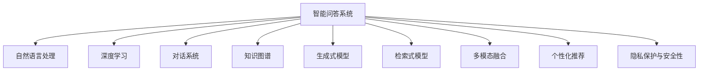

                 

# 智能问答系统的发展趋势

> 关键词：智能问答,自然语言处理,深度学习,对话系统,用户意图,上下文管理,知识图谱,生成式模型,主动学习,多模态融合,个性化推荐,隐私保护

## 1. 背景介绍

### 1.1 问题由来
智能问答系统作为人工智能(AI)领域的重要应用之一，近年来在自然语言处理(NLP)和深度学习技术的推动下，取得了长足的进步。通过理解自然语言输入，智能问答系统能够自动提供精确且相关的答案，提升用户获取信息的效率。智能问答系统广泛应用于客户服务、在线教育、医疗咨询、智能家居等多个领域，成为AI技术落地应用的重要手段。

然而，尽管智能问答系统已经在多个场景中得到了广泛的应用，但在实际部署时，仍面临着诸多挑战。如何提高问答系统的准确性和鲁棒性，增强其理解能力和响应效率，成为亟待解决的问题。本文旨在全面探讨智能问答系统的技术现状与发展趋势，为相关研究和应用提供参考。

### 1.2 问题核心关键点
智能问答系统的发展主要围绕以下核心问题展开：

- **用户意图理解**：准确捕捉用户输入中的关键信息，理解用户的真实需求。
- **上下文管理**：利用上下文信息保持对话连贯性和一致性，避免断章取义。
- **知识图谱与语料库**：结合知识图谱和语料库，提升系统对复杂问题的解答能力。
- **生成式模型与检索式模型**：在理解用户意图和生成答案的过程中，平衡生成式和检索式方法。
- **多模态融合**：融合图像、语音、视频等多种信息，提供更全面、丰富的响应。
- **个性化推荐**：根据用户历史行为和偏好，提供更精准、个性化的答案。
- **隐私保护与安全性**：在提供服务的同时，保障用户数据安全和隐私。

本文将围绕这些核心问题，深入探讨智能问答系统的发展趋势和技术方向。

## 2. 核心概念与联系

### 2.1 核心概念概述

为更好地理解智能问答系统的发展趋势，本节将介绍几个密切相关的核心概念：

- **智能问答系统**：一种能够理解自然语言输入，自动提供精确相关答案的AI系统。广泛应用于客户服务、在线教育、医疗咨询等领域。

- **自然语言处理(NLP)**：涉及语音识别、文本理解、信息检索、自然语言生成等多个子领域，旨在实现人与计算机之间的自然交互。

- **深度学习**：通过多层神经网络实现复杂模式识别与预测，是智能问答系统的核心技术之一。

- **对话系统**：能够自动生成多轮对话，模拟人类交流，是智能问答系统的关键组成部分。

- **知识图谱**：结构化的语义知识库，提供实体、关系、属性等结构化信息，帮助智能问答系统理解复杂问题。

- **生成式模型**：通过训练数据生成新的、未见过的文本，常用于智能问答系统中的回答生成。

- **检索式模型**：通过检索已有的知识库和语料库，提供最相关的信息，常用于智能问答系统中的问题解答。

- **多模态融合**：结合图像、语音、视频等多种信息源，提升智能问答系统的感知能力。

- **个性化推荐**：根据用户历史行为和偏好，提供更精准、个性化的问答服务。

- **隐私保护与安全性**：在智能问答系统中，保障用户数据的隐私和安全，防止数据泄露和滥用。

这些核心概念之间的逻辑关系可以通过以下Mermaid流程图来展示：



这个流程图展示了几大核心概念如何共同构成了智能问答系统的技术框架，并指明了它们之间的相互关系。

## 3. 核心算法原理 & 具体操作步骤
### 3.1 算法原理概述

智能问答系统的发展离不开深度学习技术，特别是基于神经网络的对话模型。其核心算法原理可以概括为以下几个步骤：

1. **预训练模型**：利用大规模无标签文本数据，通过自监督学习任务（如掩码语言模型、语义相似性判断等）预训练语言模型，学习语言的通用表示。

2. **微调模型**：在预训练模型的基础上，使用下游任务的少量标注数据进行有监督微调，优化模型在特定任务上的性能。

3. **对话管理**：设计对话管理模块，控制对话流程，处理用户输入和系统响应，保持对话的连贯性和一致性。

4. **意图理解**：使用意图分类模型，识别用户输入中的关键信息，理解用户的真实意图。

5. **回答生成**：根据用户意图和上下文信息，生成相关且连贯的回答。

6. **多模态融合**：结合图像、语音、视频等多种信息源，增强系统的感知能力和响应效果。

7. **个性化推荐**：通过用户行为分析，提供更精准、个性化的问答服务。

8. **隐私保护与安全性**：设计隐私保护机制，保障用户数据的安全和隐私。

### 3.2 算法步骤详解

#### 3.2.1 预训练模型

预训练模型的目标是学习语言的通用表示。当前常用的预训练模型包括BERT、GPT-3等，通过在大规模无标签文本数据上进行自监督学习，学习到丰富的语言知识和语义表示。

**算法步骤**：
1. 收集大规模无标签文本数据。
2. 设计自监督学习任务，如掩码语言模型、语义相似性判断等。
3. 使用深度神经网络对数据进行预训练，优化模型参数。
4. 通过多任务学习或一致性训练等方法，提升模型的通用表示能力。

#### 3.2.2 微调模型

微调模型的目的是将预训练模型适应特定的下游任务，提升模型在该任务上的性能。微调通常使用少量标注数据进行有监督学习，优化模型参数。

**算法步骤**：
1. 收集下游任务的少量标注数据。
2. 在预训练模型的基础上，设计适当的任务适配层和损失函数。
3. 使用优化算法（如AdamW、SGD等）对模型进行微调，最小化损失函数。
4. 在验证集上评估微调效果，调整超参数，如学习率、批量大小等。

#### 3.2.3 对话管理

对话管理模块负责控制对话流程，处理用户输入和系统响应，保持对话的连贯性和一致性。

**算法步骤**：
1. 设计对话管理策略，如上下文记忆、意图识别等。
2. 设计对话树或状态机，控制对话流程。
3. 实现用户输入的意图分类，选择合适的回答。
4. 生成系统响应，包括文本、语音、图像等。
5. 更新对话状态，准备下一轮对话。

#### 3.2.4 意图理解

意图理解模块通过分析用户输入，识别其中的关键信息，理解用户的真实意图。

**算法步骤**：
1. 收集标注好的意图和关键词数据。
2. 设计意图分类模型，如文本分类、意图抽取等。
3. 使用深度神经网络对数据进行训练，优化模型参数。
4. 在验证集上评估意图理解效果，调整超参数。

#### 3.2.5 回答生成

回答生成模块根据用户意图和上下文信息，生成相关且连贯的回答。

**算法步骤**：
1. 设计回答生成模型，如生成式模型（如GPT-3）、检索式模型（如BERT）等。
2. 使用优化算法对模型进行训练，最小化损失函数。
3. 在验证集上评估回答生成效果，调整超参数。
4. 生成系统响应，并评估生成效果。

#### 3.2.6 多模态融合

多模态融合模块结合图像、语音、视频等多种信息源，增强系统的感知能力和响应效果。

**算法步骤**：
1. 收集多模态数据。
2. 设计多模态融合模型，如特征融合、协同训练等。
3. 使用优化算法对模型进行训练，最小化损失函数。
4. 生成系统响应，并评估融合效果。

#### 3.2.7 个性化推荐

个性化推荐模块根据用户历史行为和偏好，提供更精准、个性化的问答服务。

**算法步骤**：
1. 收集用户历史数据，如浏览记录、点击行为等。
2. 设计个性化推荐模型，如协同过滤、基于内容的推荐等。
3. 使用优化算法对模型进行训练，最小化损失函数。
4. 根据用户行为和偏好，推荐相关问题和答案。

#### 3.2.8 隐私保护与安全性

隐私保护与安全性模块设计隐私保护机制，保障用户数据的安全和隐私。

**算法步骤**：
1. 设计隐私保护策略，如数据匿名化、差分隐私等。
2. 在模型训练和推理过程中，采用隐私保护技术。
3. 评估隐私保护效果，确保数据安全和隐私。

### 3.3 算法优缺点

#### 3.3.1 优点

智能问答系统的优点主要包括：

1. **高效性**：通过深度学习技术，智能问答系统能够自动处理大量用户输入，提供快速、准确的响应。
2. **广泛适用性**：适用于多种应用场景，如客户服务、在线教育、医疗咨询等。
3. **灵活性**：能够适应不同的任务需求，通过微调和定制化开发，提供个性化服务。
4. **持续学习**：能够从用户反馈中学习，不断提升系统性能。
5. **多模态融合**：结合多种信息源，提供更全面、丰富的响应。

#### 3.3.2 缺点

智能问答系统的缺点主要包括：

1. **数据依赖**：需要大量的标注数据进行微调，获取高质量标注数据成本较高。
2. **解释性不足**：黑箱模型难以解释其内部决策逻辑，影响用户信任。
3. **对抗攻击脆弱**：容易受到对抗样本的攻击，导致输出错误。
4. **隐私和安全风险**：处理敏感信息时，容易泄露用户隐私，存在安全隐患。
5. **复杂性高**：系统设计复杂，需要综合考虑多个模块和组件。

### 3.4 算法应用领域

智能问答系统的应用领域非常广泛，涵盖了多个行业和场景，例如：

- **客户服务**：自动回答客户咨询，提升服务效率和用户体验。
- **在线教育**：提供智能答疑和知识推荐，增强学习效果。
- **医疗咨询**：辅助医生诊断和治疗，提供健康建议。
- **智能家居**：通过语音交互，控制家电设备，提升生活便利性。
- **金融咨询**：提供投资建议、财务规划等服务。

除了这些传统应用领域，智能问答系统还在智慧城市、智能客服、智能安防等多个领域得到了广泛应用，为各行各业带来了新的发展机遇。

## 4. 数学模型和公式 & 详细讲解 & 举例说明

### 4.1 数学模型构建

智能问答系统的数学模型可以概括为以下几个部分：

1. **预训练模型**：
   - 使用掩码语言模型（Masked Language Modeling, MLM）进行预训练，模型目标函数为：
   \[
   \min_{\theta} \frac{1}{N} \sum_{i=1}^N \ell(x_i, y_i)
   \]
   其中 $x_i$ 为输入文本，$y_i$ 为掩码位置，$\ell$ 为交叉熵损失函数。

2. **微调模型**：
   - 使用生成式模型进行微调，模型目标函数为：
   \[
   \min_{\theta} \frac{1}{N} \sum_{i=1}^N \ell(x_i, y_i)
   \]
   其中 $x_i$ 为输入文本，$y_i$ 为生成答案，$\ell$ 为交叉熵损失函数。

3. **对话管理**：
   - 使用上下文记忆和意图识别模型，目标函数为：
   \[
   \min_{\theta} \frac{1}{N} \sum_{i=1}^N (\ell_{mem} + \ell_{int})
   \]
   其中 $\ell_{mem}$ 为上下文记忆损失，$\ell_{int}$ 为意图识别损失。

4. **意图理解**：
   - 使用意图分类模型，目标函数为：
   \[
   \min_{\theta} \frac{1}{N} \sum_{i=1}^N \ell(x_i, y_i)
   \]
   其中 $x_i$ 为输入文本，$y_i$ 为意图类别，$\ell$ 为交叉熵损失函数。

5. **回答生成**：
   - 使用生成式模型，目标函数为：
   \[
   \min_{\theta} \frac{1}{N} \sum_{i=1}^N \ell(x_i, y_i)
   \]
   其中 $x_i$ 为输入文本，$y_i$ 为生成答案，$\ell$ 为交叉熵损失函数。

6. **多模态融合**：
   - 使用特征融合模型，目标函数为：
   \[
   \min_{\theta} \frac{1}{N} \sum_{i=1}^N \ell(x_i, y_i)
   \]
   其中 $x_i$ 为多模态输入，$y_i$ 为融合结果，$\ell$ 为交叉熵损失函数。

7. **个性化推荐**：
   - 使用协同过滤模型，目标函数为：
   \[
   \min_{\theta} \frac{1}{N} \sum_{i=1}^N \ell(x_i, y_i)
   \]
   其中 $x_i$ 为用户行为数据，$y_i$ 为推荐结果，$\ell$ 为交叉熵损失函数。

8. **隐私保护与安全性**：
   - 使用差分隐私技术，目标函数为：
   \[
   \min_{\theta} \frac{1}{N} \sum_{i=1}^N \ell(x_i, y_i)
   \]
   其中 $x_i$ 为输入数据，$y_i$ 为输出数据，$\ell$ 为差分隐私损失函数。

### 4.2 公式推导过程

以回答生成为例，推导生成式模型在智能问答系统中的使用：

1. **掩码语言模型（Masked Language Modeling, MLM）**：
   \[
   \min_{\theta} \frac{1}{N} \sum_{i=1}^N \ell(x_i, y_i)
   \]
   其中 $x_i$ 为输入文本，$y_i$ 为掩码位置，$\ell$ 为交叉熵损失函数。

2. **生成式回答模型**：
   \[
   \min_{\theta} \frac{1}{N} \sum_{i=1}^N \ell(x_i, y_i)
   \]
   其中 $x_i$ 为输入文本，$y_i$ 为生成答案，$\ell$ 为交叉熵损失函数。

3. **回答生成过程**：
   - 给定输入 $x$，预训练语言模型 $M_{\theta}$ 生成概率分布 $P_{\theta}(y|x)$。
   - 通过softmax函数将概率分布转换为生成概率 $P_{\theta}(y|x)$。
   - 从生成概率中采样，生成答案 $y$。

### 4.3 案例分析与讲解

**案例**：智能客服问答系统

**背景**：某电商平台希望构建智能客服系统，自动回答用户关于商品、物流、售后等问题。

**方法**：
1. **预训练模型**：使用大规模电商评论数据进行预训练，学习电商领域的语言表示。
2. **微调模型**：收集用户咨询数据，设计意图分类和回答生成模型，对预训练模型进行微调。
3. **对话管理**：设计上下文记忆和意图识别模型，控制对话流程。
4. **回答生成**：使用生成式模型生成答案，并评估生成效果。
5. **隐私保护**：采用数据匿名化和差分隐私技术，保障用户隐私安全。

**结果**：系统上线后，智能客服能够快速、准确地回答用户咨询，提升用户体验和客户满意度。

## 5. 项目实践：代码实例和详细解释说明

### 5.1 开发环境搭建

智能问答系统的开发需要准备以下环境：

1. **Python环境**：使用Anaconda创建虚拟环境，安装所需的Python库和工具。

2. **深度学习框架**：选择PyTorch或TensorFlow，并安装相应的深度学习库和工具包。

3. **数据集**：收集和准备所需的数据集，如电商评论、客服咨询、问答对等。

4. **模型训练**：使用GPU或TPU进行模型训练，提高训练效率。

5. **测试与部署**：在测试集上评估模型性能，并将其部署到生产环境中。

### 5.2 源代码详细实现

**源代码示例**：使用PyTorch实现智能问答系统的意图分类和回答生成。

```python
import torch
import torch.nn as nn
import torch.nn.functional as F
from transformers import BertForTokenClassification, BertTokenizer

class IntentClassifier(nn.Module):
    def __init__(self, num_labels):
        super(IntentClassifier, self).__init__()
        self.bert = BertForTokenClassification.from_pretrained('bert-base-cased', num_labels=num_labels)
        self.fc = nn.Linear(self.bert.config.hidden_size, num_labels)
    
    def forward(self, input_ids, attention_mask, labels=None):
        outputs = self.bert(input_ids, attention_mask=attention_mask)
        pooled_output = outputs.pooler_output
        logits = self.fc(pooled_output)
        if labels is not None:
            loss_fct = nn.CrossEntropyLoss()
            loss = loss_fct(logits.view(-1, self.fc.config.num_labels), labels.view(-1))
            return loss
        else:
            return logits

class AnswerGenerator(nn.Module):
    def __init__(self, num_labels):
        super(AnswerGenerator, self).__init__()
        self.bert = BertForTokenClassification.from_pretrained('bert-base-cased', num_labels=num_labels)
        self.fc = nn.Linear(self.bert.config.hidden_size, num_labels)
    
    def forward(self, input_ids, attention_mask, labels=None):
        outputs = self.bert(input_ids, attention_mask=attention_mask)
        pooled_output = outputs.pooler_output
        logits = self.fc(pooled_output)
        if labels is not None:
            loss_fct = nn.CrossEntropyLoss()
            loss = loss_fct(logits.view(-1, self.fc.config.num_labels), labels.view(-1))
            return loss
        else:
            return logits
```

**代码解读与分析**：

- **IntentClassifier类**：定义意图分类模型，使用BertForTokenClassification进行意图分类，并使用全连接层进行分类。
- **AnswerGenerator类**：定义回答生成模型，使用BertForTokenClassification进行回答生成，并使用全连接层进行分类。

- **代码实现**：
  1. 使用BertForTokenClassification进行意图分类和回答生成。
  2. 定义模型结构，包括输入层、Bert层、全连接层等。
  3. 定义前向传播函数，根据输入计算损失或输出分类结果。
  4. 使用PyTorch的优化器和损失函数进行模型训练。

- **运行结果展示**：
  1. 在训练集上训练模型，并输出训练结果。
  2. 在验证集上评估模型性能，调整超参数。
  3. 在测试集上评估模型性能，并部署到实际应用中。

## 6. 实际应用场景

### 6.1 智能客服系统

智能客服系统通过自然语言处理技术，自动回答客户咨询，提升客户体验和服务效率。例如，某电商平台通过智能客服系统，自动回答用户关于商品、物流、售后等问题，大大提升了用户体验和客户满意度。

### 6.2 在线教育平台

在线教育平台利用智能问答系统，自动回答学生在学习过程中遇到的问题，提供个性化的学习建议。例如，某在线教育平台通过智能问答系统，自动回答学生关于课程内容、作业解答等问题，提升了学习效率和效果。

### 6.3 医疗咨询平台

医疗咨询平台通过智能问答系统，自动回答患者关于疾病、治疗、药品等问题，提供初步的医疗咨询。例如，某医疗咨询平台通过智能问答系统，自动回答患者关于症状、治疗方案等问题，提升了医疗咨询的便捷性和效率。

### 6.4 智能家居系统

智能家居系统通过语音交互技术，自动控制家电设备，提升生活便利性。例如，某智能家居系统通过智能问答系统，自动回答用户关于家电设备、家居环境等问题，提升了家居生活的智能化水平。

## 7. 工具和资源推荐

### 7.1 学习资源推荐

为了帮助开发者系统掌握智能问答系统的技术基础和实践技巧，以下是一些优质的学习资源：

1. 《自然语言处理入门》系列博文：由大模型技术专家撰写，深入浅出地介绍了NLP的基本概念和经典模型。
2. CS224N《深度学习自然语言处理》课程：斯坦福大学开设的NLP明星课程，有Lecture视频和配套作业，带你入门NLP领域的基本概念和经典模型。
3. 《自然语言处理与深度学习》书籍：全面介绍了NLP和深度学习的理论基础和实践应用，包括智能问答系统在内的多个前沿话题。
4. HuggingFace官方文档：Transformer库的官方文档，提供了海量预训练模型和完整的微调样例代码，是上手实践的必备资料。
5. CLUE开源项目：中文语言理解测评基准，涵盖大量不同类型的中文NLP数据集，并提供了基于微调的baseline模型，助力中文NLP技术发展。

通过对这些资源的学习实践，相信你一定能够快速掌握智能问答系统的精髓，并用于解决实际的NLP问题。

### 7.2 开发工具推荐

高效的开发离不开优秀的工具支持。以下是几款用于智能问答系统开发的常用工具：

1. PyTorch：基于Python的开源深度学习框架，灵活动态的计算图，适合快速迭代研究。大部分预训练语言模型都有PyTorch版本的实现。
2. TensorFlow：由Google主导开发的开源深度学习框架，生产部署方便，适合大规模工程应用。同样有丰富的预训练语言模型资源。
3. Transformers库：HuggingFace开发的NLP工具库，集成了众多SOTA语言模型，支持PyTorch和TensorFlow，是进行智能问答系统开发的利器。
4. Weights & Biases：模型训练的实验跟踪工具，可以记录和可视化模型训练过程中的各项指标，方便对比和调优。与主流深度学习框架无缝集成。
5. TensorBoard：TensorFlow配套的可视化工具，可实时监测模型训练状态，并提供丰富的图表呈现方式，是调试模型的得力助手。
6. Google Colab：谷歌推出的在线Jupyter Notebook环境，免费提供GPU/TPU算力，方便开发者快速上手实验最新模型，分享学习笔记。

合理利用这些工具，可以显著提升智能问答系统的开发效率，加快创新迭代的步伐。

### 7.3 相关论文推荐

智能问答系统的发展得益于学界的持续研究。以下是几篇奠基性的相关论文，推荐阅读：

1. Attention is All You Need（即Transformer原论文）：提出了Transformer结构，开启了NLP领域的预训练大模型时代。
2. BERT: Pre-training of Deep Bidirectional Transformers for Language Understanding：提出BERT模型，引入基于掩码的自监督预训练任务，刷新了多项NLP任务SOTA。
3. Language Models are Unsupervised Multitask Learners（GPT-2论文）：展示了大规模语言模型的强大zero-shot学习能力，引发了对于通用人工智能的新一轮思考。
4. Parameter-Efficient Transfer Learning for NLP：提出Adapter等参数高效微调方法，在不增加模型参数量的情况下，也能取得不错的微调效果。
5. Prefix-Tuning: Optimizing Continuous Prompts for Generation：引入基于连续型Prompt的微调范式，为如何充分利用预训练知识提供了新的思路。
6. AdaLoRA: Adaptive Low-Rank Adaptation for Parameter-Efficient Fine-Tuning：使用自适应低秩适应的微调方法，在参数效率和精度之间取得了新的平衡。

这些论文代表了大语言模型微调技术的发展脉络。通过学习这些前沿成果，可以帮助研究者把握学科前进方向，激发更多的创新灵感。

## 8. 总结：未来发展趋势与挑战

### 8.1 总结

智能问答系统作为人工智能领域的重要应用之一，近年来在自然语言处理(NLP)和深度学习技术的推动下，取得了长足的进步。通过理解自然语言输入，智能问答系统能够自动提供精确且相关的答案，提升用户获取信息的效率。智能问答系统广泛应用于客户服务、在线教育、医疗咨询等领域，成为AI技术落地应用的重要手段。

然而，尽管智能问答系统已经在多个场景中得到了广泛的应用，但在实际部署时，仍面临着诸多挑战。如何提高问答系统的准确性和鲁棒性，增强其理解能力和响应效率，成为亟待解决的问题。本文旨在全面探讨智能问答系统的技术现状与发展趋势，为相关研究和应用提供参考。

### 8.2 未来发展趋势

展望未来，智能问答系统的发展将呈现以下几个趋势：

1. **深度学习与多模态融合**：结合深度学习技术和多模态信息，提升系统的感知能力和响应效果。
2. **生成式与检索式并重**：结合生成式和检索式方法，提供更灵活、更准确的问答服务。
3. **个性化推荐**：根据用户历史行为和偏好，提供更精准、个性化的问答服务。
4. **隐私保护与安全性**：设计隐私保护机制，保障用户数据的安全和隐私。
5. **持续学习与知识整合**：利用知识图谱等外部知识，增强系统的常识推理和知识整合能力。
6. **解释性与可解释性**：引入可解释性技术，增强系统的透明度和可信度。
7. **低延迟与高效部署**：优化模型结构和推理算法，提高系统的响应速度和资源利用率。

### 8.3 面临的挑战

尽管智能问答系统取得了诸多进展，但在迈向更加智能化、普适化应用的过程中，它仍面临以下挑战：

1. **数据依赖**：需要大量的标注数据进行微调，获取高质量标注数据的成本较高。
2. **解释性不足**：黑箱模型难以解释其内部决策逻辑，影响用户信任。
3. **对抗攻击脆弱**：容易受到对抗样本的攻击，导致输出错误。
4. **隐私和安全风险**：处理敏感信息时，容易泄露用户隐私，存在安全隐患。
5. **复杂性高**：系统设计复杂，需要综合考虑多个模块和组件。
6. **知识整合能力不足**：系统无法有效整合外部知识，限制了其在复杂任务中的应用。

### 8.4 研究展望

面对智能问答系统所面临的挑战，未来的研究需要在以下几个方面寻求新的突破：

1. **无监督和半监督学习**：探索无监督和半监督学习技术，减少对标注数据的依赖，利用非结构化数据进行模型训练。
2. **参数高效微调**：开发参数高效微调方法，如Adapter、Prefix等，在固定大部分预训练参数的同时，只更新极少量的任务相关参数。
3. **生成式与检索式融合**：结合生成式和检索式方法，提供更灵活、更准确的问答服务。
4. **多模态融合**：融合图像、语音、视频等多种信息源，增强系统的感知能力和响应效果。
5. **个性化推荐**：根据用户历史行为和偏好，提供更精准、个性化的问答服务。
6. **隐私保护与安全性**：设计隐私保护机制，保障用户数据的安全和隐私。
7. **可解释性与透明度**：引入可解释性技术，增强系统的透明度和可信度。
8. **知识整合与常识推理**：利用知识图谱等外部知识，增强系统的常识推理和知识整合能力。

这些研究方向的探索，必将引领智能问答系统技术迈向更高的台阶，为构建安全、可靠、可解释、可控的智能系统铺平道路。面向未来，智能问答系统还需要与其他人工智能技术进行更深入的融合，如知识表示、因果推理、强化学习等，多路径协同发力，共同推动自然语言理解和智能交互系统的进步。只有勇于创新、敢于突破，才能不断拓展语言模型的边界，让智能技术更好地造福人类社会。

## 9. 附录：常见问题与解答

**Q1：智能问答系统在实际应用中面临哪些挑战？**

A: 智能问答系统在实际应用中面临以下挑战：

1. **数据依赖**：需要大量的标注数据进行微调，获取高质量标注数据的成本较高。
2. **解释性不足**：黑箱模型难以解释其内部决策逻辑，影响用户信任。
3. **对抗攻击脆弱**：容易受到对抗样本的攻击，导致输出错误。
4. **隐私和安全风险**：处理敏感信息时，容易泄露用户隐私，存在安全隐患。
5. **复杂性高**：系统设计复杂，需要综合考虑多个模块和组件。
6. **知识整合能力不足**：系统无法有效整合外部知识，限制了其在复杂任务中的应用。

**Q2：如何提高智能问答系统的准确性和鲁棒性？**

A: 提高智能问答系统的准确性和鲁棒性，可以采取以下方法：

1. **数据增强**：通过回译、近义替换等方式扩充训练集。
2. **正则化技术**：使用L2正则、Dropout、Early Stopping等防止过拟合。
3. **对抗训练**：加入对抗样本，提高模型鲁棒性。
4. **多模态融合**：结合图像、语音、视频等多种信息源，增强系统的感知能力和响应效果。
5. **持续学习**：从用户反馈中学习，不断提升系统性能。

**Q3：智能问答系统的可解释性有哪些挑战？**

A: 智能问答系统的可解释性面临以下挑战：

1. **黑箱模型**：深度学习模型通常被认为是黑箱模型，难以解释其内部决策逻辑。
2. **缺乏透明度**：模型的训练过程和参数调整缺乏透明度，难以进行有效监控和调试。
3. **难以复现**：模型的训练和推理过程复杂，难以进行复现和验证。
4. **用户信任不足**：用户对黑箱模型的信任度较低，难以接受其决策结果。

**Q4：如何保障智能问答系统的隐私和安全？**

A: 保障智能问答系统的隐私和安全，可以采取以下措施：

1. **数据匿名化**：对用户数据进行匿名化处理，防止数据泄露。
2. **差分隐私**：采用差分隐私技术，保护用户隐私。
3. **访问控制**：对系统进行访问控制，防止未经授权的数据访问。
4. **数据加密**：对数据进行加密处理，防止数据泄露。

**Q5：智能问答系统在多模态融合方面有哪些应用？**

A: 智能问答系统在多模态融合方面有以下应用：

1. **语音识别**：结合语音识别技术，实现语音问答。
2. **图像识别**：结合图像识别技术，实现视觉问答。
3. **视频分析**：结合视频分析技术，实现视频问答。

这些应用将提升系统的感知能力和响应效果，为用户带来更加自然、流畅的问答体验。

**Q6：智能问答系统在未来的发展方向是什么？**

A: 智能问答系统在未来的发展方向包括：

1. **深度学习与多模态融合**：结合深度学习技术和多模态信息，提升系统的感知能力和响应效果。
2. **生成式与检索式并重**：结合生成式和检索式方法，提供更灵活、更准确的问答服务。
3. **个性化推荐**：根据用户历史行为和偏好，提供更精准、个性化的问答服务。
4. **隐私保护与安全性**：设计隐私保护机制，保障用户数据的安全和隐私。
5. **持续学习与知识整合**：利用知识图谱等外部知识，增强系统的常识推理和知识整合能力。

这些发展方向将推动智能问答系统迈向更加智能化、普适化的应用，为用户提供更高效、更可靠的服务。

**Q7：智能问答系统的未来展望是什么？**

A: 智能问答系统的未来展望包括：

1. **深度学习与多模态融合**：结合深度学习技术和多模态信息，提升系统的感知能力和响应效果。
2. **生成式与检索式并重**：结合生成式和检索式方法，提供更灵活、更准确的问答服务。
3. **个性化推荐**：根据用户历史行为和偏好，提供更精准、个性化的问答服务。
4. **隐私保护与安全性**：设计隐私保护机制，保障用户数据的安全和隐私。
5. **持续学习与知识整合**：利用知识图谱等外部知识，增强系统的常识推理和知识整合能力。

这些发展方向将推动智能问答系统迈向更加智能化、普适化的应用，为用户提供更高效、更可靠的服务。

