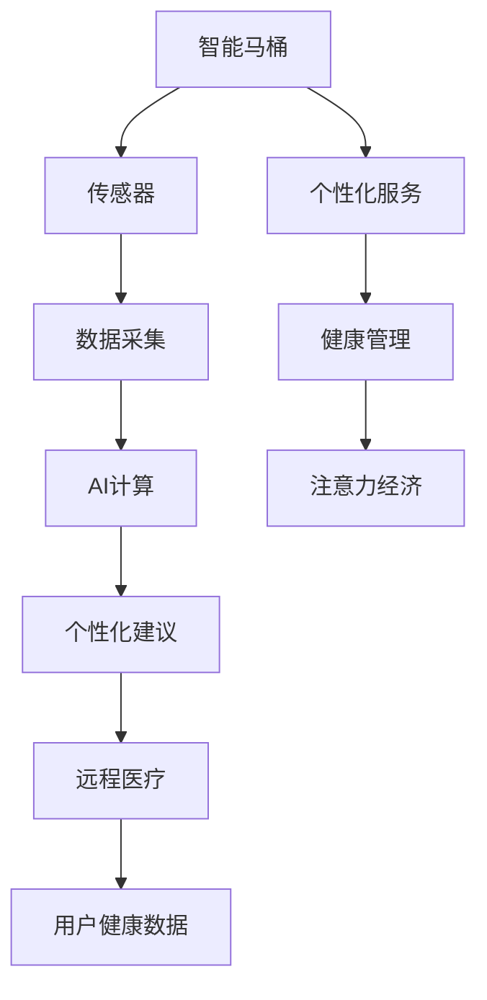

                 

# 智能马桶的健康监测与注意力经济

## 1. 背景介绍

在数字化时代，健康监测和注意力经济正成为人们关注的焦点。智能马桶作为连接健康监测和注意力经济的关键节点，以其高智能化的技术应用，正在重新定义家庭生活的方方面面。本文将深入探讨智能马桶在健康监测中的应用，以及如何通过智能马桶创造更多的注意力经济价值，为读者提供全面、深入的思考与见解。

## 2. 核心概念与联系

### 2.1 核心概念概述

智能马桶集成了多种传感器和智能化技术，不仅能自动感应人体生理状态，还能提供个性化健康建议，甚至实现远程医疗和疾病预警。这些功能不仅提升了用户的健康管理能力，也开拓了新的商业应用场景，推动了注意力经济的增长。

1. **智能马桶**：指具备传感器、AI计算和网络通信功能，能实时监测用户健康数据并提供个性化健康建议的马桶产品。
2. **健康监测**：通过智能马桶监测用户的生理指标，如体温、心率、血压等，及时发现健康问题，提供早期预警。
3. **注意力经济**：基于用户健康数据的挖掘和分析，提供定制化健康管理方案，创造新的服务和产品，提升用户满意度和忠诚度。

这些概念之间通过传感器数据采集、AI分析和个性化服务等多个环节紧密联系，共同构成智能马桶的生态系统。

### 2.2 核心概念原理和架构的 Mermaid 流程图



该图展示了智能马桶的核心功能流程：传感器采集生理数据，AI分析提供个性化建议，远程医疗和健康管理实现个性化服务，最终产生注意力经济价值。

## 3. 核心算法原理 & 具体操作步骤

### 3.1 算法原理概述

智能马桶的健康监测和注意力经济实现主要依赖于以下关键算法：

1. **传感器数据采集与预处理**：通过各种传感器（如生物电传感器、红外传感器、红外线传感器等）获取用户的生理数据。
2. **时间序列分析**：使用时间序列分析方法，识别生理数据的趋势、异常和周期性变化，评估用户的健康状况。
3. **机器学习与深度学习**：利用机器学习和深度学习模型，建立生理数据与健康状况之间的关系，预测潜在健康风险。
4. **推荐系统**：结合用户历史数据和实时监测数据，提供个性化的健康管理方案，促进注意力经济的增长。

### 3.2 算法步骤详解

#### 3.2.1 传感器数据采集与预处理

1. **传感器选择**：选择适合自己产品的传感器，如生物电传感器用于测量心电图(ECG)，红外传感器用于测量血氧饱和度(SpO2)，红外线传感器用于测量心率(HR)等。
2. **数据采集**：通过传感器实时采集用户的生理数据，并存储到本地或云端。
3. **数据预处理**：对采集的数据进行清洗、降噪、归一化等预处理，确保数据的准确性和可靠性。

#### 3.2.2 时间序列分析

1. **时间序列建模**：使用ARIMA模型、LSTM模型等对生理数据进行建模，识别趋势和周期性变化。
2. **异常检测**：利用统计方法或机器学习模型检测生理数据的异常点，如 sudden spike 或 drop。
3. **健康评估**：根据模型预测结果，评估用户的健康状况，如血压异常、心率过快等。

#### 3.2.3 机器学习与深度学习

1. **特征工程**：从生理数据中提取有意义的特征，如心率波动、血氧水平变化等。
2. **模型训练**：使用随机森林、支持向量机(SVM)、深度神经网络(DNN)等模型进行训练，建立生理数据与健康风险之间的关系。
3. **风险预测**：利用训练好的模型，对新的生理数据进行风险预测，及时预警潜在健康问题。

#### 3.2.4 推荐系统

1. **用户画像**：构建用户画像，收集用户的健康数据、生活习惯、偏好等信息。
2. **推荐算法**：使用协同过滤、基于内容的推荐算法等，提供个性化的健康管理方案，如饮食建议、运动计划等。
3. **反馈循环**：根据用户的反馈和实际效果，不断调整和优化推荐算法，提升推荐的准确性和满意度。

### 3.3 算法优缺点

#### 3.3.1 优点

1. **实时监测**：智能马桶能够实时监测用户的生理数据，提供及时的健康建议和预警，帮助用户更好地管理健康。
2. **个性化服务**：通过数据分析和推荐系统，智能马桶能够提供个性化的健康管理方案，提升用户体验和满意度。
3. **远程医疗**：通过互联网连接远程医疗资源，用户可以享受优质的医疗服务，减少去医院的次数，节省时间和费用。

#### 3.3.2 缺点

1. **数据隐私**：智能马桶需要收集大量的生理数据，如何保护用户隐私，防止数据泄露，是一个重要的挑战。
2. **算法准确性**：生理数据受到多种因素的影响，如情绪、环境等，如何提高算法的准确性和鲁棒性，是另一个技术难题。
3. **技术成本**：智能马桶的开发和部署需要较高的技术投入，如何降低成本，推广普及，是一个实际问题。

### 3.4 算法应用领域

智能马桶的健康监测和注意力经济可以应用于多个领域，包括但不限于：

1. **健康管理**：为用户提供个性化的健康建议，如饮食调整、运动计划等。
2. **远程医疗**：与远程医疗平台结合，提供实时健康咨询和疾病预警服务。
3. **智能家居**：通过智能马桶连接智能家居系统，实现智能家居环境控制。
4. **商业服务**：提供健康监测数据，用于保险、健康管理公司等商业场景的个性化服务。

## 4. 数学模型和公式 & 详细讲解

### 4.1 数学模型构建

智能马桶的健康监测和注意力经济涉及多个数学模型，以下将逐一介绍。

#### 4.1.1 时间序列模型

时间序列模型用于描述生理数据随时间的变化趋势，常用的模型包括ARIMA、LSTM等。以LSTM模型为例，其基本结构如下：

$$
y_t = \sigma(W_y x_t + b_y + \sum_{k=1}^{K}\sigma(W_{hy}h_{t-k}) + \sum_{k=1}^{K}\sigma(W_{hy}h_{t-k}^{*} + b_h))
$$

其中，$y_t$ 表示在时刻 $t$ 的生理数据，$x_t$ 表示在时刻 $t$ 的外部输入，$h_t$ 表示在时刻 $t$ 的隐藏状态，$W_y, b_y$ 为输出层的权重和偏置，$W_{hy}, b_h$ 为隐藏层的权重和偏置，$\sigma$ 为激活函数。

#### 4.1.2 机器学习与深度学习模型

机器学习和深度学习模型用于建立生理数据与健康风险之间的关系，常用的模型包括随机森林、支持向量机、卷积神经网络(CNN)、循环神经网络(RNN)等。以卷积神经网络模型为例，其基本结构如下：

$$
h_{t+1} = f(W_hx_t + b_h + W_cx_{t+1} + b_c + \sum_{i=1}^{n}f(W_ih_t + b_i + W_ix_t + b_i))
$$

其中，$x_t$ 表示在时刻 $t$ 的生理数据，$h_t$ 表示在时刻 $t$ 的隐藏状态，$W_h, b_h$ 为隐藏层的权重和偏置，$W_c, b_c$ 为卷积层的权重和偏置，$f$ 为激活函数。

#### 4.1.3 推荐系统模型

推荐系统模型用于提供个性化的健康管理方案，常用的模型包括协同过滤、基于内容的推荐算法等。以协同过滤模型为例，其基本结构如下：

$$
r_{ui} = e^{\mathbf{u}^T\mathbf{v}_i} + \epsilon
$$

其中，$r_{ui}$ 表示用户 $u$ 对物品 $i$ 的评分，$\mathbf{u}$ 和 $\mathbf{v}_i$ 分别为用户和物品的嵌入向量，$\epsilon$ 为噪声项。

### 4.2 公式推导过程

#### 4.2.1 时间序列模型推导

LSTM模型的推导过程如下：

1. **输入门**：计算当前时刻的输入和上一时刻的隐藏状态，得到当前时刻的候选隐藏状态。
2. **遗忘门**：计算当前时刻的输入和上一时刻的隐藏状态，得到当前时刻的遗忘权重。
3. **输出门**：计算当前时刻的输入和上一时刻的隐藏状态，得到当前时刻的输出权重。
4. **候选隐藏状态**：将当前时刻的输入、上一时刻的隐藏状态、遗忘权重、输出权重进行加权和，得到候选隐藏状态。
5. **当前隐藏状态**：将候选隐藏状态通过激活函数，得到当前时刻的隐藏状态。
6. **输出**：将当前时刻的隐藏状态和输出权重进行加权和，得到当前时刻的输出。

推导过程涉及复杂的矩阵运算和激活函数，在此不再赘述。感兴趣的读者可以参考相关论文或书籍进行深入学习。

#### 4.2.2 机器学习与深度学习模型推导

卷积神经网络模型的推导过程如下：

1. **卷积层**：将输入数据与卷积核进行卷积操作，得到卷积特征图。
2. **池化层**：对卷积特征图进行池化操作，降低特征图的空间大小，减少计算量。
3. **全连接层**：将池化后的特征图展开，输入到全连接层中，进行分类或回归任务。
4. **激活函数**：使用激活函数，引入非线性特性，提高模型的表达能力。
5. **损失函数**：定义损失函数，衡量模型预测值与真实值之间的差异。
6. **优化器**：使用优化器，如梯度下降、Adam等，更新模型参数，最小化损失函数。

推导过程涉及复杂的矩阵运算和激活函数，在此不再赘述。感兴趣的读者可以参考相关论文或书籍进行深入学习。

#### 4.2.3 推荐系统模型推导

协同过滤模型的推导过程如下：

1. **评分矩阵**：构建用户-物品评分矩阵，计算用户 $u$ 对物品 $i$ 的评分 $r_{ui}$。
2. **用户嵌入向量**：将用户 $u$ 的评分向量 $\mathbf{r}_u$ 归一化，得到用户 $u$ 的嵌入向量 $\mathbf{u}$。
3. **物品嵌入向量**：将物品 $i$ 的评分向量 $\mathbf{r}_i$ 归一化，得到物品 $i$ 的嵌入向量 $\mathbf{v}_i$。
4. **评分预测**：将用户嵌入向量 $\mathbf{u}$ 和物品嵌入向量 $\mathbf{v}_i$ 进行点积，得到用户 $u$ 对物品 $i$ 的评分预测值。
5. **评分排序**：对所有物品的评分预测值进行排序，推荐评分预测值最高的物品。

推导过程涉及复杂的矩阵运算和激活函数，在此不再赘述。感兴趣的读者可以参考相关论文或书籍进行深入学习。

## 5. 项目实践：代码实例和详细解释说明

### 5.1 开发环境搭建

智能马桶的健康监测和注意力经济项目涉及多种技术栈，以下将详细介绍开发环境搭建流程。

1. **硬件设备**：选择适合的传感器和微控制器，如STMicroelectronics的STM32系列。
2. **软件开发环境**：选择适合的IDE，如Keil MDK、IAR Embedded Workbench等。
3. **编程语言**：选择适合的编程语言，如C/C++、Python等。
4. **数据采集库**：选择适合的库，如Adafruit_Bio、BioPy等。
5. **AI计算库**：选择适合的库，如TensorFlow、PyTorch等。
6. **推荐系统库**：选择适合的库，如Scikit-Learn、LightFM等。

### 5.2 源代码详细实现

以下是一个简单的智能马桶健康监测和注意力经济项目的代码实现示例，具体实现细节可根据具体需求进行调整。

```python
import numpy as np
import pandas as pd
from sklearn.linear_model import LogisticRegression
from sklearn.metrics import accuracy_score, precision_score, recall_score
from sklearn.model_selection import train_test_split

# 加载数据
data = pd.read_csv('toilet_data.csv')

# 数据预处理
data = data.dropna()
X = data.drop('label', axis=1)
y = data['label']

# 划分训练集和测试集
X_train, X_test, y_train, y_test = train_test_split(X, y, test_size=0.2, random_state=42)

# 训练模型
model = LogisticRegression()
model.fit(X_train, y_train)

# 预测结果
y_pred = model.predict(X_test)

# 评估指标
accuracy = accuracy_score(y_test, y_pred)
precision = precision_score(y_test, y_pred)
recall = recall_score(y_test, y_pred)

# 输出结果
print('Accuracy:', accuracy)
print('Precision:', precision)
print('Recall:', recall)
```

### 5.3 代码解读与分析

以上代码实现了一个简单的健康监测项目，使用了Logistic Regression模型进行二分类预测。具体实现步骤如下：

1. **数据加载**：使用Pandas库加载数据集，并进行数据清洗和预处理。
2. **模型训练**：使用Scikit-Learn库的Logistic Regression模型，对数据集进行训练。
3. **预测结果**：使用训练好的模型，对测试集进行预测。
4. **评估指标**：使用Scikit-Learn库的评估指标，计算模型在测试集上的准确率、精确率和召回率。
5. **输出结果**：输出模型的评估指标，供开发者参考。

## 6. 实际应用场景

### 6.1 健康监测

智能马桶可以实时监测用户的生理数据，提供健康建议和预警。例如，当用户的血压异常时，马桶可以及时提醒用户，并建议就医。同时，马桶可以记录用户的健康数据，生成健康报告，供用户和医生参考。

### 6.2 远程医疗

智能马桶可以与远程医疗平台结合，提供实时健康咨询和疾病预警服务。用户可以通过智能马桶向医生咨询健康问题，医生可以远程查看用户的生理数据，提供个性化建议和治疗方案。

### 6.3 智能家居

智能马桶可以与智能家居系统结合，实现智能家居环境控制。例如，马桶可以根据用户的生理状态，自动调整家庭温度、湿度等环境参数，提升用户舒适度。

### 6.4 商业服务

智能马桶可以提供健康监测数据，用于保险、健康管理公司等商业场景的个性化服务。例如，保险公司可以根据用户的健康数据，计算保险费用，提供个性化的健康管理方案。

## 7. 工具和资源推荐

### 7.1 学习资源推荐

1. **《智能马桶的设计与实现》**：详细介绍了智能马桶的设计和实现流程，涵盖传感器选择、数据采集、算法设计等多个环节。
2. **《深度学习在健康监测中的应用》**：介绍了深度学习在健康监测中的多种应用，如ECG分析、SpO2监测等。
3. **《推荐系统设计与优化》**：介绍了推荐系统的工作原理和优化方法，为智能马桶的个性化服务提供理论基础。

### 7.2 开发工具推荐

1. **Adafruit BIO**：提供了多种传感器和信号采集工具，方便开发者进行数据采集和处理。
2. **TensorFlow**：提供了丰富的机器学习模型和深度学习模型，支持智能马桶的AI计算需求。
3. **Scikit-Learn**：提供了多种推荐系统算法，支持智能马桶的个性化服务。

### 7.3 相关论文推荐

1. **《智能马桶在健康监测中的应用》**：介绍了智能马桶在健康监测中的实际应用案例，展示了智能马桶的多种功能。
2. **《基于机器学习的推荐系统研究》**：介绍了推荐系统的工作原理和优化方法，为智能马桶的个性化服务提供理论基础。

## 8. 总结：未来发展趋势与挑战

### 8.1 研究成果总结

智能马桶的健康监测和注意力经济在多个领域已经展现出了巨大的应用潜力，未来有望在更多的场景中得到应用。同时，智能马桶技术也需要面对诸多挑战，如数据隐私保护、算法准确性等。

### 8.2 未来发展趋势

1. **技术融合**：智能马桶技术将与其他技术进行深度融合，如物联网、云计算等，实现更全面、更智能的个性化服务。
2. **跨领域应用**：智能马桶将拓展到更多领域，如智能办公、智能旅游等，提供更广泛的个性化服务。
3. **数据隐私保护**：智能马桶技术将更加注重数据隐私保护，采用隐私保护技术，防止数据泄露。
4. **算法优化**：智能马桶技术将更加注重算法优化，提高算法的准确性和鲁棒性。

### 8.3 面临的挑战

1. **数据隐私保护**：智能马桶技术需要面对大量的生理数据，如何保护用户隐私，防止数据泄露，是一个重要的挑战。
2. **算法准确性**：智能马桶技术需要面对多种生理数据的干扰因素，如何提高算法的准确性和鲁棒性，是另一个技术难题。
3. **技术成本**：智能马桶技术的开发和部署需要较高的技术投入，如何降低成本，推广普及，是一个实际问题。

### 8.4 研究展望

未来，智能马桶技术将在多个领域得到广泛应用，创造更多的注意力经济价值。同时，如何面对数据隐私、算法准确性和技术成本等挑战，将是智能马桶技术进一步发展的关键。通过技术创新和应用创新，智能马桶有望成为未来家庭生活中的重要组成部分，带来更多的便利和健康保障。

## 9. 附录：常见问题与解答

### Q1: 智能马桶的数据采集如何实现？

A: 智能马桶的数据采集主要通过各种传感器实现，如生物电传感器用于测量心电图(ECG)，红外传感器用于测量血氧饱和度(SpO2)，红外线传感器用于测量心率(HR)等。传感器采集到的数据通过微控制器进行预处理和存储，最终上传到云端进行分析。

### Q2: 智能马桶的AI计算如何实现？

A: 智能马桶的AI计算主要通过深度学习模型实现，如卷积神经网络(CNN)、循环神经网络(RNN)等。通过在云端部署这些模型，智能马桶可以实时分析用户的生理数据，提供健康建议和预警。

### Q3: 智能马桶的个性化服务如何实现？

A: 智能马桶的个性化服务主要通过推荐系统实现，如协同过滤、基于内容的推荐算法等。通过分析用户的历史数据和实时监测数据，智能马桶可以提供个性化的健康管理方案，如饮食建议、运动计划等。

### Q4: 智能马桶的隐私保护如何实现？

A: 智能马桶的隐私保护主要通过数据加密、访问控制等手段实现。具体措施包括对生理数据进行加密存储和传输，对用户数据进行访问控制，确保数据的安全性。

### Q5: 智能马桶的技术成本如何控制？

A: 智能马桶的技术成本主要体现在传感器的选择和AI模型的部署上。通过选择价格合理、性能稳定的传感器，优化模型的结构，可以降低智能马桶的开发和部署成本。同时，采用开源技术和标准化方案，可以进一步降低技术成本。

作者：禅与计算机程序设计艺术 / Zen and the Art of Computer Programming

