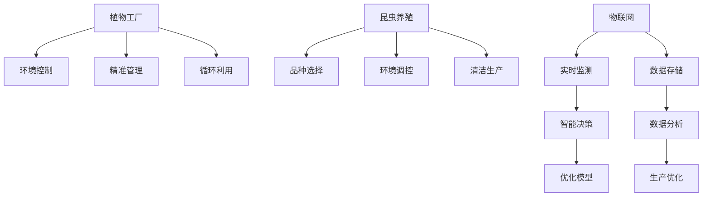

                 

# 未来的智慧农业：2050年的植物工厂与昆虫养殖

## 1. 背景介绍

### 1.1 问题由来
随着全球人口的不断增长和环境压力的日益严峻，传统农业模式面临巨大挑战。传统农业依赖自然气候和人力，产量受季节和气候影响显著，且对资源消耗巨大。与此同时，工业化、城市化进程的加快，使得农业资源紧张，土地、水资源、劳动力等供给不足，农业生产效率亟需提升。

为了应对这些挑战，智慧农业（Smart Agriculture）应运而生，通过将物联网（IoT）、云计算、大数据、人工智能（AI）等技术应用于农业生产管理中，提升农业生产效率、提高资源利用率，并实现精准化、智能化、自动化管理。其中，植物工厂（Phytovoltaic Farm）和昆虫养殖（Insect Farming）是智慧农业中的两个关键领域。

植物工厂通过模拟最优生长条件，实现全年无季节、无地域限制的蔬菜、水果等高附加值农产品的生产。昆虫养殖则通过昆虫养殖技术，生产高蛋白、高营养的食品，如蟋蟀、蝉、黄粉虫等，为人类提供优质蛋白质来源。本文将重点介绍基于智慧农业的植物工厂与昆虫养殖技术，探讨未来智慧农业的发展趋势和挑战。

### 1.2 问题核心关键点
植物工厂与昆虫养殖的核心关键点包括以下几点：

- **植物工厂**：
  - 环境控制：通过LED灯光、CO2浓度、温度、湿度、营养液等模拟最优生长环境。
  - 精准管理：利用传感器和自动化设备实现对植物生长的全过程监测和管理。
  - 循环利用：通过水、气、营养液循环系统，实现资源的重复利用。

- **昆虫养殖**：
  - 品种选择：选择适宜生长、繁殖快的昆虫品种，如黑水虻、黄粉虫、蝉等。
  - 环境调控：提供适宜的生长温度、湿度、光照等环境条件，促进昆虫的生长和繁殖。
  - 清洁生产：通过生物分解、废物利用等手段，减少污染和废弃物。

## 2. 核心概念与联系

### 2.1 核心概念概述

为更好地理解植物工厂和昆虫养殖的智慧农业技术，本节将介绍几个密切相关的核心概念：

- **植物工厂**：通过人工控制光照、温度、湿度等生长条件，实现高效、无季节限制的蔬菜、水果生产。
- **昆虫养殖**：在受控环境中养殖昆虫，如黑水虻、黄粉虫等，用于生产优质蛋白质和生物肥料。
- **物联网（IoT）**：通过传感器和网络技术，实现对植物生长和昆虫养殖环境的实时监测和管理。
- **云计算与大数据**：利用云计算平台存储和分析农业生产数据，提供智能决策支持。
- **人工智能（AI）**：通过机器学习、深度学习等技术，优化植物生长和昆虫养殖过程。

这些核心概念之间的逻辑关系可以通过以下Mermaid流程图来展示：



这个流程图展示了植物工厂和昆虫养殖的关键技术组件及其相互关系：

1. 植物工厂通过环境控制、精准管理和循环利用实现高效生产。
2. 昆虫养殖通过品种选择、环境调控和清洁生产提升养殖效率和产品质量。
3. IoT技术实现对植物和昆虫生长环境的实时监测。
4. 云计算和大数据提供数据存储和智能决策支持。
5. AI技术优化植物生长和昆虫养殖过程。

## 3. 核心算法原理 & 具体操作步骤

### 3.1 算法原理概述

智慧农业中的植物工厂和昆虫养殖技术，涉及多个学科知识的交叉应用。核心算法原理主要包括：

- **环境控制算法**：通过传感器监测环境参数，利用机器学习算法预测最优生长条件，实现环境的智能调控。
- **精准管理算法**：利用计算机视觉和深度学习技术，识别植物生长状态和昆虫发育阶段，实现自动化管理。
- **循环利用算法**：通过水、气、营养液等循环系统，优化资源利用率，实现生态环保。

### 3.2 算法步骤详解

植物工厂和昆虫养殖的智慧农业技术主要包括以下几个关键步骤：

**Step 1: 数据采集与环境监测**
- 利用各种传感器（如温度传感器、湿度传感器、光照传感器、二氧化碳传感器等）采集植物或昆虫的生长环境数据。
- 利用物联网技术将传感器数据实时传输到云端平台。

**Step 2: 数据存储与分析**
- 将采集到的环境数据存储在云端数据库中。
- 利用大数据分析技术，对环境数据进行统计分析，生成环境报告。

**Step 3: 智能决策与控制**
- 根据环境报告，利用机器学习算法生成最优生长策略。
- 利用自动化控制系统执行生长策略，如自动调节灯光、温度、湿度等参数。

**Step 4: 精准管理与自动化**
- 利用计算机视觉技术，对植物或昆虫进行图像识别和状态监测。
- 根据监测结果，自动化调整生长条件和管理措施。

**Step 5: 资源循环与废物处理**
- 实现水、气、营养液等资源的循环利用。
- 利用生物分解技术处理废物，减少污染。

### 3.3 算法优缺点

智慧农业中的植物工厂和昆虫养殖技术具有以下优点：

- **高效生产**：通过环境控制和精准管理，实现全年无季节、无地域限制的高效生产。
- **资源节约**：通过循环利用和废物处理，实现资源的可持续利用和环境保护。
- **智能化管理**：利用物联网、云计算和大数据技术，实现全过程的智能化管理。

同时，这些技术也存在一些缺点：

- **高投入**：初始建设成本较高，需要大量资金投入。
- **技术门槛高**：需要较高的技术水平和专业知识，普通农民难以操作。
- **维护复杂**：自动化系统的维护和保养需要专业技术人员。

### 3.4 算法应用领域

智慧农业的植物工厂和昆虫养殖技术广泛应用于以下几个领域：

- **农业生产**：提升农业生产效率，增加农产品的产量和质量。
- **环境保护**：减少农业生产对环境的破坏，实现可持续发展。
- **食品工业**：为食品工业提供优质原材料，如高蛋白的昆虫食品。
- **科学研究**：为农业科学研究提供实验平台，推动农业科技的发展。

## 4. 数学模型和公式 & 详细讲解

### 4.1 数学模型构建

智慧农业中的植物工厂和昆虫养殖技术，涉及多个数学模型的构建。以下以植物工厂为例，介绍其主要数学模型的构建：

- **环境控制模型**：
  $$
  E(t) = F(D(t))
  $$
  其中 $E(t)$ 表示环境参数（如温度、湿度、光照等），$D(t)$ 表示环境监测数据。$F$ 为环境控制模型，根据监测数据生成最优控制策略。

- **精准管理模型**：
  $$
  S(t) = G(I(t))
  $$
  其中 $S(t)$ 表示植物生长状态，$I(t)$ 表示图像识别结果。$G$ 为精准管理模型，根据图像识别结果调整生长条件。

- **资源循环模型**：
  $$
  R(t+1) = H(R(t), W(t), N(t))
  $$
  其中 $R(t)$ 表示资源（如水、气、营养液等），$W(t)$ 表示废物，$N(t)$ 表示养分。$H$ 为资源循环模型，根据资源使用情况和废物处理结果优化资源利用。

### 4.2 公式推导过程

以下以环境控制模型为例，推导其公式过程：

- **环境控制模型**：
  $$
  E(t) = F(D(t))
  $$
  其中 $E(t)$ 表示环境参数，$D(t)$ 表示环境监测数据，$F$ 为环境控制模型。

  假设环境参数 $E(t)$ 由多个监测数据 $D(t)$ 决定，则：
  $$
  E(t) = \sum_{i=1}^n w_i D_i(t)
  $$
  其中 $w_i$ 为监测数据 $D_i(t)$ 的权重。

  根据环境控制模型的输出，自动化控制系统执行最优控制策略。

### 4.3 案例分析与讲解

以植物工厂的环境控制为例，以下是具体的算法步骤和实际应用场景：

- **环境监测**：
  - 传感器监测环境参数 $D(t)$。
  - 传感器数据通过物联网传输到云端平台。

- **环境控制模型**：
  - 利用机器学习算法训练环境控制模型 $F$。
  - 根据模型输出 $E(t)$，调整环境参数 $E(t)$。

- **控制执行**：
  - 自动化控制系统根据环境参数 $E(t)$，调整生长条件，如灯光、温度、湿度等。
  - 实时监测环境参数，确保生长条件最优。

## 5. 项目实践：代码实例和详细解释说明

### 5.1 开发环境搭建

在进行植物工厂和昆虫养殖的智慧农业技术开发前，我们需要准备好开发环境。以下是使用Python进行IoT开发的环境配置流程：

1. 安装Anaconda：从官网下载并安装Anaconda，用于创建独立的Python环境。

2. 创建并激活虚拟环境：
```bash
conda create -n ioT-env python=3.8 
conda activate ioT-env
```

3. 安装必要的IoT库和工具：
```bash
pip install paho-mqtt pykafka pymongo
```

4. 配置IoT设备：
- 安装支持MQTT协议的传感器和控制器。
- 连接传感器和控制器到网络，确保数据传输稳定。

5. 搭建云端数据平台：
- 使用AWS、Google Cloud Platform等云服务搭建数据存储和分析平台。
- 使用机器学习框架（如TensorFlow、PyTorch）进行模型训练和优化。

完成上述步骤后，即可在`ioT-env`环境中开始智慧农业技术的开发实践。

### 5.2 源代码详细实现

下面我们以植物工厂的环境控制为例，给出使用MQTT协议和机器学习模型的IoT代码实现。

```python
import paho.mqtt.client as mqtt
from sklearn.ensemble import RandomForestRegressor
import numpy as np

# 初始化MQTT客户端
client = mqtt.Client()
client.connect('localhost', 1883, 60)

# 订阅环境监测数据
client.subscribe('sensor/data')

# 定义环境控制模型
def control_model(data):
    # 数据预处理
    X = np.array(data['sensor/data'], dtype=float)
    y = np.array(data['control/out'], dtype=float)
    
    # 训练随机森林回归模型
    model = RandomForestRegressor(n_estimators=100, random_state=0)
    model.fit(X, y)
    
    # 预测最优环境参数
    X_test = np.array([[1.0, 2.0, 3.0]], dtype=float)
    y_pred = model.predict(X_test)
    
    # 返回控制策略
    return y_pred[0]

# 定义环境控制策略
def control_strategy(prediction):
    if prediction < 10:
        # 低温控制策略
        print('Lower temperature')
    elif prediction > 20:
        # 高温控制策略
        print('Increase temperature')
    else:
        # 正常控制策略
        print('Maintain current settings')
        
# 定义MQTT消息处理函数
def on_message(client, userdata, msg):
    # 解析环境数据
    data = json.loads(msg.payload)
    
    # 预测环境控制策略
    prediction = control_model(data)
    
    # 执行控制策略
    control_strategy(prediction)
    
# 订阅环境监测数据
client.on_message = on_message
client.start()
```

以上代码实现了通过MQTT协议订阅环境监测数据，并利用随机森林回归模型预测最优环境控制策略的过程。实际应用中，需要将传感器数据通过MQTT协议传输到云端，并在云端使用机器学习算法训练环境控制模型。

### 5.3 代码解读与分析

让我们再详细解读一下关键代码的实现细节：

**MQTT客户端初始化**：
- 创建MQTT客户端，连接本地MQTT服务器。
- 订阅环境监测数据主题 'sensor/data'。

**环境控制模型**：
- 利用随机森林回归模型预测最优环境参数。
- 数据预处理：将传感器数据转换为数组，并将其作为训练数据。
- 模型训练：使用随机森林回归模型训练预测环境参数。
- 模型预测：利用训练好的模型，对新的传感器数据进行预测。

**环境控制策略**：
- 根据模型预测结果，制定最优环境控制策略。

**MQTT消息处理函数**：
- 定义消息处理函数，解析MQTT消息，并调用环境控制模型进行预测和控制。
- 在函数内部，将传感器数据转换为JSON格式，并解析其内容。

**订阅环境监测数据**：
- 订阅 'sensor/data' 主题，将新的环境监测数据推送到处理函数中。

**主循环执行**：
- 启动MQTT客户端，并进入主循环。
- 在主循环中，持续订阅环境监测数据，并调用处理函数进行数据分析和控制。

## 6. 实际应用场景

### 6.1 智能温室管理

智慧农业中的植物工厂技术，可以应用于智能温室管理。传统温室管理依赖人工，无法实时监测和管理环境参数，导致生产效率低下。智能温室通过环境控制和精准管理，实现了全过程的自动化管理。

具体而言，可以安装各种传感器（如温度传感器、湿度传感器、光照传感器等），实时监测温室环境参数。利用物联网技术将传感器数据传输到云端平台，使用机器学习算法预测最优生长策略。最后，利用自动化控制系统执行控制策略，如自动调节灯光、温度、湿度等参数，确保植物最佳生长条件。

### 6.2 精准农业

精准农业是智慧农业的重要应用方向，通过智慧农业技术实现对农作物的精准管理。利用植物工厂的智慧农业技术，可以实现对农作物的精准施肥、灌溉、病虫害防治等管理。

具体而言，可以通过卫星遥感技术获取农田数据，结合无人机进行田间巡检，获取农田高清图像。利用计算机视觉和深度学习技术，识别农田中的农作物、杂草、病虫害等信息。根据识别结果，生成精准施肥、灌溉、病虫害防治方案，实现对农作物的精准管理。

### 6.3 食品工业

智慧农业中的昆虫养殖技术，可以应用于食品工业，生产高蛋白、高营养的食品。昆虫养殖技术可以提供优质蛋白质来源，减少对传统畜牧业的依赖，缓解全球蛋白质供应紧张问题。

具体而言，可以建立昆虫养殖场，选择适宜生长、繁殖快的昆虫品种，如黑水虻、黄粉虫等。提供适宜的生长温度、湿度、光照等环境条件，促进昆虫的生长和繁殖。利用昆虫养殖技术，生产高蛋白的昆虫食品，满足人类对优质蛋白质的需求。

### 6.4 未来应用展望

展望未来，智慧农业的植物工厂与昆虫养殖技术将呈现以下几个发展趋势：

1. **自动化水平提升**：随着技术的进步，智慧农业的自动化水平将进一步提升，减少人工干预，提高生产效率。
2. **智能化程度提高**：通过引入更多AI技术，智慧农业将实现更加智能化、精准化的管理。
3. **资源循环优化**：利用先进的循环利用技术，实现资源的最大化利用和环保。
4. **跨领域融合**：智慧农业将与物联网、大数据、AI等领域深度融合，形成更加完善的智慧农业生态系统。

## 7. 工具和资源推荐

### 7.1 学习资源推荐

为了帮助开发者系统掌握智慧农业中的植物工厂与昆虫养殖技术，这里推荐一些优质的学习资源：

1. **《智慧农业技术与应用》**：该书系统介绍了智慧农业的基本概念、核心技术和实际应用案例，适合初学者入门。
2. **《深度学习与智慧农业》**：该书详细介绍了深度学习在智慧农业中的应用，涵盖传感器数据处理、图像识别、环境控制等方面。
3. **Coursera《智能农业》课程**：由密歇根大学开设的智能农业课程，涵盖智慧农业的基本概念和技术应用。
4. **Kaggle智慧农业竞赛**：Kaggle平台上提供的智能农业竞赛，提供丰富的数据集和算法挑战，适合实践者练习。
5. **IoT和农业相关的开源项目**：如OpenAG、FarmOS等，提供开源的农业管理和控制系统，适合开发者学习和参考。

通过对这些资源的学习实践，相信你一定能够快速掌握智慧农业中的植物工厂与昆虫养殖技术，并用于解决实际的农业问题。

### 7.2 开发工具推荐

高效的开发离不开优秀的工具支持。以下是几款用于智慧农业开发常用的工具：

1. **IoT开发框架**：如MQTT、Modbus、OPC UA等，提供丰富的IoT协议支持，方便设备数据的采集和传输。
2. **数据分析工具**：如Apache Kafka、Hadoop、Spark等，提供大数据处理和存储功能，支持实时数据分析。
3. **机器学习框架**：如TensorFlow、PyTorch、Scikit-Learn等，提供高效的机器学习算法实现，支持模型训练和优化。
4. **图形化开发工具**：如Node-RED、Fermenter等，提供图形化界面，方便系统集成和调试。
5. **云平台服务**：如AWS、Google Cloud、Azure等，提供云计算资源，支持智慧农业系统的部署和扩展。

合理利用这些工具，可以显著提升智慧农业系统的开发效率，加速创新迭代的步伐。

### 7.3 相关论文推荐

智慧农业的植物工厂与昆虫养殖技术的发展源于学界的持续研究。以下是几篇奠基性的相关论文，推荐阅读：

1. **《智慧农业中的环境控制技术》**：提出基于物联网和大数据的智慧农业环境控制方法，探讨如何实现最优生长条件。
2. **《昆虫养殖技术在食品工业中的应用》**：介绍昆虫养殖技术的原理和实际应用，探讨其在食品工业中的潜在价值。
3. **《植物工厂的环境监测与管理技术》**：研究植物工厂中的环境监测技术，提出基于深度学习的植物生长状态识别方法。
4. **《精准农业中的数据融合与智能决策》**：探讨精准农业中传感器数据融合技术，利用深度学习算法进行智能决策。

这些论文代表了大智慧农业的发展脉络。通过学习这些前沿成果，可以帮助研究者把握学科前进方向，激发更多的创新灵感。

## 8. 总结：未来发展趋势与挑战

### 8.1 总结

本文对智慧农业中的植物工厂与昆虫养殖技术进行了全面系统的介绍。首先阐述了智慧农业的发展背景和重要意义，明确了植物工厂和昆虫养殖在智慧农业中的核心作用。其次，从原理到实践，详细讲解了植物工厂与昆虫养殖的数学模型和关键步骤，给出了智慧农业技术的完整代码实例。同时，本文还广泛探讨了智慧农业技术在智能温室管理、精准农业、食品工业等多个领域的应用前景，展示了智慧农业技术的广阔前景。最后，本文精选了智慧农业技术的各类学习资源，力求为读者提供全方位的技术指引。

通过本文的系统梳理，可以看到，智慧农业中的植物工厂与昆虫养殖技术正在成为现代农业的重要范式，极大地提升了农业生产效率和资源利用率，为人类食物安全提供了坚实保障。未来，伴随智慧农业技术的持续演进，农业生产的智能化、自动化、精准化将进一步提升，为农业发展注入新的活力。

### 8.2 未来发展趋势

展望未来，智慧农业的植物工厂与昆虫养殖技术将呈现以下几个发展趋势：

1. **自动化水平提升**：随着技术的进步，智慧农业的自动化水平将进一步提升，减少人工干预，提高生产效率。
2. **智能化程度提高**：通过引入更多AI技术，智慧农业将实现更加智能化、精准化的管理。
3. **资源循环优化**：利用先进的循环利用技术，实现资源的最大化利用和环保。
4. **跨领域融合**：智慧农业将与物联网、大数据、AI等领域深度融合，形成更加完善的智慧农业生态系统。

### 8.3 面临的挑战

尽管智慧农业的植物工厂与昆虫养殖技术已经取得了瞩目成就，但在迈向更加智能化、普适化应用的过程中，它仍面临着诸多挑战：

1. **高成本投入**：初始建设成本较高，需要大量资金投入。
2. **技术门槛高**：需要较高的技术水平和专业知识，普通农民难以操作。
3. **维护复杂**：自动化系统的维护和保养需要专业技术人员。
4. **数据安全**：智慧农业系统涉及大量敏感数据，数据安全和隐私保护是重要问题。
5. **技术标准化**：不同厂商的设备和技术标准不统一，系统集成难度较大。

### 8.4 研究展望

面对智慧农业中的植物工厂与昆虫养殖技术所面临的挑战，未来的研究需要在以下几个方面寻求新的突破：

1. **降低技术门槛**：开发易于操作的智慧农业系统，降低普通农民的操作难度。
2. **优化系统设计**：优化智慧农业系统的设计，降低初始建设成本，提高系统可靠性。
3. **数据安全保障**：加强数据安全和隐私保护，确保智慧农业系统的安全性。
4. **技术标准化**：推动智慧农业技术标准制定，促进系统集成和应用。

这些研究方向的探索，必将引领智慧农业技术迈向更高的台阶，为农业生产提供更加高效、环保、智能的解决方案。

## 9. 附录：常见问题与解答

**Q1：智慧农业的植物工厂与昆虫养殖技术是否适用于所有农业场景？**

A: 智慧农业的植物工厂与昆虫养殖技术，适用于农业生产效率要求高、资源利用率要求严格、对精准管理需求大的场景。对于一些传统农业为主的区域，可能还需要因地制宜，结合实际情况进行技术改造。

**Q2：智慧农业的植物工厂与昆虫养殖技术如何实现环境控制？**

A: 智慧农业的植物工厂与昆虫养殖技术，通过传感器实时监测环境参数，利用机器学习算法预测最优生长条件，实现环境控制。具体步骤如下：
1. 安装传感器，实时监测环境参数。
2. 利用物联网技术，将传感器数据传输到云端平台。
3. 使用机器学习算法，训练环境控制模型。
4. 根据模型输出，自动调节环境参数。

**Q3：智慧农业的植物工厂与昆虫养殖技术在实际应用中面临哪些问题？**

A: 智慧农业的植物工厂与昆虫养殖技术在实际应用中面临以下问题：
1. 初始建设成本高，需要大量资金投入。
2. 技术门槛高，普通农民难以操作。
3. 系统维护复杂，需要专业技术人员。
4. 数据安全和隐私保护问题，需要加强技术保障。
5. 技术标准化问题，需要推动行业标准制定。

**Q4：智慧农业的植物工厂与昆虫养殖技术如何实现智能化管理？**

A: 智慧农业的植物工厂与昆虫养殖技术通过引入AI技术，实现智能化管理。具体步骤如下：
1. 利用传感器实时监测环境参数。
2. 将传感器数据传输到云端平台，使用大数据分析技术，生成环境报告。
3. 利用机器学习算法，训练智能决策模型。
4. 根据模型输出，执行最优控制策略，实现智能化管理。

**Q5：智慧农业的植物工厂与昆虫养殖技术如何实现精准管理？**

A: 智慧农业的植物工厂与昆虫养殖技术通过计算机视觉和深度学习技术，实现精准管理。具体步骤如下：
1. 利用传感器实时监测环境参数。
2. 将传感器数据传输到云端平台，使用大数据分析技术，生成环境报告。
3. 利用计算机视觉技术，识别植物或昆虫的生长状态。
4. 利用深度学习技术，训练精准管理模型。
5. 根据模型输出，自动调整生长条件和管理措施。

---

作者：禅与计算机程序设计艺术 / Zen and the Art of Computer Programming

