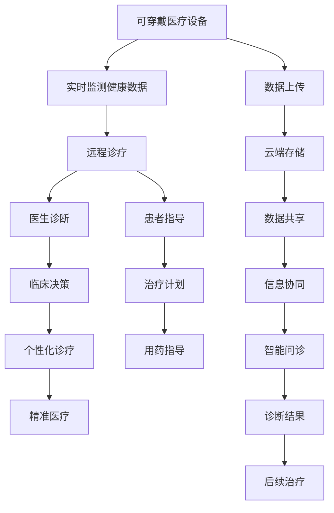

                 

# 未来的智慧医疗：2050年的可穿戴医疗设备与远程诊疗

> 关键词：可穿戴医疗设备,远程诊疗,物联网(IoT),人工智能(AI),机器学习(ML),自然语言处理(NLP),区块链,云计算,5G,生物信息学

## 1. 背景介绍

### 1.1 问题由来
医疗健康是人类的基本需求，也是科技发展的重要方向。随着科技的进步，尤其是信息技术的快速发展，未来的智慧医疗正在迅速崛起。通过物联网(IoT)、人工智能(AI)、区块链等新兴技术，未来的医疗将更加智能化、个性化、可穿戴化。

当前，医疗行业面临着诸多挑战，如医疗资源分配不均、医疗费用高昂、医患沟通不畅等。如何通过技术手段提升医疗服务的质量和效率，提升公众健康水平，是科技工作者和社会各界关注的重要问题。

本文将从智慧医疗的视角，探讨2050年可穿戴医疗设备与远程诊疗的未来应用，期望为医疗行业带来新的思考。

### 1.2 问题核心关键点
- **可穿戴医疗设备**：能够实时监测健康数据，如血压、血糖、心率等，并将其传输到云端或移动设备，供医生和患者随时查阅，实现早诊断、早干预。
- **远程诊疗**：通过互联网和AI技术，患者可以在家中获得医生的诊断和指导，节省时间、降低成本。
- **物联网(IoT)**：将医疗设备、医疗记录、医生与患者连接起来，实现信息共享和协同管理。
- **人工智能(AI)**：通过深度学习、自然语言处理等技术，提升医疗影像分析、药物研发等领域的精度和效率。
- **区块链**：保障医疗数据的隐私和安全性，防止数据篡改和泄露。
- **云计算**：提供强大的数据存储和计算能力，支持远程诊疗和医疗数据的处理分析。
- **5G技术**：提供高速稳定的网络连接，支持医疗设备的实时数据传输和远程诊疗。
- **生物信息学**：通过基因测序、蛋白质组学等技术，实现精准医疗和个性化诊疗。

这些关键技术构成了智慧医疗的核心，将在未来的医疗服务中发挥重要作用。

## 2. 核心概念与联系

### 2.1 核心概念概述

为了更好地理解智慧医疗的未来应用，本节将介绍几个密切相关的核心概念：

- **可穿戴医疗设备**：如智能手表、健康监测仪、体脂秤等，可以实时监测用户的健康状况，并将数据上传至云端或移动设备。
- **远程诊疗**：通过视频通话、智能问诊系统等，患者可以在家中接受医生的诊断和治疗指导。
- **物联网(IoT)**：将医疗设备、医疗记录、医生与患者连接起来，实现信息共享和协同管理。
- **人工智能(AI)**：通过深度学习、自然语言处理等技术，提升医疗影像分析、药物研发等领域的精度和效率。
- **区块链**：保障医疗数据的隐私和安全性，防止数据篡改和泄露。
- **云计算**：提供强大的数据存储和计算能力，支持远程诊疗和医疗数据的处理分析。
- **5G技术**：提供高速稳定的网络连接，支持医疗设备的实时数据传输和远程诊疗。
- **生物信息学**：通过基因测序、蛋白质组学等技术，实现精准医疗和个性化诊疗。

这些核心概念之间的逻辑关系可以通过以下Mermaid流程图来展示：



这个流程图展示了大语言模型的核心概念及其之间的关系：

1. 可穿戴医疗设备实时监测用户的健康数据，并通过云端存储。
2. 远程诊疗通过视频通话和智能问诊系统，实现医生与患者的连接。
3. 物联网将医疗设备、医疗记录和医生与患者连接起来，实现信息共享和协同管理。
4. 人工智能通过深度学习、自然语言处理等技术，提升医疗影像分析、药物研发等领域的精度和效率。
5. 区块链保障医疗数据的隐私和安全性，防止数据篡改和泄露。
6. 云计算提供强大的数据存储和计算能力，支持远程诊疗和医疗数据的处理分析。
7. 5G技术提供高速稳定的网络连接，支持医疗设备的实时数据传输和远程诊疗。
8. 生物信息学通过基因测序、蛋白质组学等技术，实现精准医疗和个性化诊疗。

这些核心概念共同构成了智慧医疗的未来应用框架，为医疗服务的智能化、个性化、可穿戴化提供了技术支撑。

## 3. 核心算法原理 & 具体操作步骤

### 3.1 算法原理概述

智慧医疗的未来应用，核心在于将物联网、人工智能、区块链等技术手段与医疗服务深度融合。其核心算法原理主要包括以下几个方面：

1. **实时数据采集与传输**：通过可穿戴设备实时采集健康数据，并利用5G技术实时传输至云端或移动设备。
2. **数据处理与分析**：通过云计算和人工智能技术，对采集的数据进行清洗、处理和分析，提取有用的健康信息。
3. **远程诊疗与智能问诊**：通过自然语言处理技术，实现医生与患者之间的智能交流，提升诊疗效率和质量。
4. **数据安全和隐私保护**：通过区块链技术，保障医疗数据的隐私和安全性，防止数据篡改和泄露。
5. **个性化医疗与精准医疗**：通过生物信息学技术，结合人工智能分析，实现个性化医疗和精准医疗。

### 3.2 算法步骤详解

基于上述算法原理，智慧医疗的未来应用可以分为以下几个关键步骤：

**Step 1: 数据采集与预处理**

1. 通过可穿戴设备实时采集用户的健康数据（如血压、血糖、心率等），并将其转化为数字信号。
2. 利用5G技术将采集的数据实时传输至云端或移动设备。
3. 对采集的数据进行清洗、去噪、标准化等预处理，确保数据的质量和一致性。

**Step 2: 数据存储与分析**

1. 将预处理后的数据存储至云计算平台，利用云计算提供的强大计算能力和存储能力，进行数据分析和处理。
2. 使用深度学习、自然语言处理等人工智能技术，对数据进行特征提取和模式识别，提取有用的健康信息。
3. 利用机器学习技术，建立健康预测模型，对用户的健康状态进行预测和预警。

**Step 3: 远程诊疗与智能问诊**

1. 通过视频通话和智能问诊系统，实现医生与患者之间的远程交流。
2. 利用自然语言处理技术，实现智能问诊，根据患者的描述，自动生成诊疗方案。
3. 通过人工智能技术，对患者的病历、诊断结果和历史数据进行分析，提供个性化的诊疗建议。

**Step 4: 数据安全和隐私保护**

1. 利用区块链技术，保障医疗数据的隐私和安全性，防止数据篡改和泄露。
2. 对医疗数据进行加密存储，确保数据在传输和存储过程中的安全。
3. 建立数据访问控制机制，限制非授权人员的访问，保护患者隐私。

**Step 5: 个性化医疗与精准医疗**

1. 利用基因测序、蛋白质组学等生物信息学技术，提取患者的基因信息和蛋白质信息。
2. 结合人工智能技术，对患者的基因信息和蛋白质信息进行分析，制定个性化的治疗方案。
3. 利用精准医疗技术，实现对特定疾病的高效治疗，提高治愈率和患者的生存质量。

### 3.3 算法优缺点

智慧医疗的未来应用，其核心算法具有以下优点：

1. **实时性和准确性**：通过可穿戴设备和5G技术，可以实现实时数据采集和传输，提升诊断和治疗的准确性和及时性。
2. **个性化和精准化**：通过人工智能和生物信息学技术，可以实现个性化医疗和精准医疗，提高治疗效果。
3. **高效性和便捷性**：通过远程诊疗和智能问诊，患者可以在家中获得医生的诊断和治疗指导，节省时间、降低成本。
4. **数据安全和隐私保护**：通过区块链技术，保障医疗数据的隐私和安全性，防止数据篡改和泄露。

同时，该算法也存在一定的局限性：

1. **技术依赖**：对5G技术、云计算和人工智能等技术的依赖性较强，一旦这些技术出现故障，可能影响医疗服务的正常运行。
2. **数据质量问题**：可穿戴设备采集的数据可能存在噪音和不一致性，需要经过严格的预处理才能使用。
3. **隐私和安全问题**：医疗数据的隐私和安全问题较为复杂，需要多层次的安全保障措施。
4. **医疗知识共享问题**：不同医疗机构之间的数据共享和协作，需要建立标准化的数据格式和交换协议。

尽管存在这些局限性，但就目前而言，智慧医疗的算法原理和操作步骤已经日趋成熟，并在实际应用中展现出了巨大的潜力。未来相关研究的重点在于如何进一步降低技术依赖，提高数据质量和安全性，加强医疗知识共享和协作。

### 3.4 算法应用领域

智慧医疗的未来应用，涵盖了医疗服务的各个环节，包括但不限于以下领域：

- **智能监测与预警**：通过可穿戴设备实时监测用户的健康数据，实现早诊断、早干预，预防疾病的发生。
- **远程诊疗与智能问诊**：通过视频通话和智能问诊系统，实现医生与患者的远程交流，提升诊疗效率和质量。
- **医疗影像分析**：通过深度学习技术，对医疗影像进行分析和诊断，提高影像分析的准确性和效率。
- **药物研发**：通过人工智能和生物信息学技术，加速药物的研发进程，降低研发成本，提高药物的疗效。
- **健康管理与个性化医疗**：通过基因测序、蛋白质组学等技术，实现个性化医疗和精准医疗，提升患者的健康水平。

这些应用领域展示了智慧医疗的广阔前景，涵盖了从预防、治疗到健康管理的全过程，为提升医疗服务的质量和效率提供了重要支撑。

## 4. 数学模型和公式 & 详细讲解 & 举例说明

### 4.1 数学模型构建

为了更好地理解智慧医疗的未来应用，本节将使用数学语言对智慧医疗的核心算法进行更加严格的刻画。

记可穿戴医疗设备采集的健康数据为 $x_t \in \mathbb{R}^n$，其中 $n$ 为特征维度。设 $y_t$ 为用户的健康状态（如0表示健康，1表示异常），则二分类问题可以表示为：

$$
\hat{y}_t = f(x_t; \theta)
$$

其中 $f(x_t; \theta)$ 为预测函数，$\theta$ 为模型参数。常见的预测函数包括逻辑回归、决策树、神经网络等。

假设存在 $T$ 个时间点的健康数据，则整个数据集可以表示为：

$$
X = \{(x_1, y_1), (x_2, y_2), ..., (x_T, y_T)\}
$$

目标是通过训练模型 $f(x_t; \theta)$，使得对新数据的预测结果 $\hat{y}_t$ 尽可能接近真实标签 $y_t$。

### 4.2 公式推导过程

以下我们以逻辑回归为例，推导预测函数 $f(x_t; \theta)$ 和损失函数 $\mathcal{L}(\theta)$ 的计算公式。

假设模型的参数 $\theta = \{\omega, b\}$，其中 $\omega$ 为特征权重向量，$b$ 为偏置项。则逻辑回归的预测函数为：

$$
\hat{y}_t = \sigma(\omega \cdot x_t + b)
$$

其中 $\sigma(z) = \frac{1}{1 + e^{-z}}$ 为sigmoid函数，将输出映射到 $(0, 1)$ 区间。

模型的损失函数为交叉熵损失：

$$
\mathcal{L}(\theta) = -\frac{1}{T}\sum_{t=1}^T [y_t\log \hat{y}_t + (1-y_t)\log(1-\hat{y}_t)]
$$

通过对损失函数求导，可以计算出模型参数 $\theta$ 的梯度，使用梯度下降等优化算法更新参数，最小化损失函数 $\mathcal{L}(\theta)$。

### 4.3 案例分析与讲解

假设某智能手表采集了用户一天的血压和心率数据，共计24个时间点。利用逻辑回归模型对这些数据进行预测，判断用户是否存在异常健康状况。具体步骤如下：

1. 对采集的数据进行预处理，包括去噪、标准化等操作。
2. 利用训练集对逻辑回归模型进行训练，得到预测函数 $f(x_t; \theta)$。
3. 对测试集进行预测，得到每个时间点的预测结果 $\hat{y}_t$。
4. 将预测结果与真实标签进行比较，计算预测误差和准确率。

## 5. 项目实践：代码实例和详细解释说明

### 5.1 开发环境搭建

在进行智慧医疗应用开发前，我们需要准备好开发环境。以下是使用Python进行TensorFlow开发的环境配置流程：

1. 安装Anaconda：从官网下载并安装Anaconda，用于创建独立的Python环境。

2. 创建并激活虚拟环境：
```bash
conda create -n tf-env python=3.8 
conda activate tf-env
```

3. 安装TensorFlow：根据CUDA版本，从官网获取对应的安装命令。例如：
```bash
conda install tensorflow -c tensorflow -c conda-forge
```

4. 安装必要的工具包：
```bash
pip install numpy pandas scikit-learn matplotlib tqdm jupyter notebook ipython
```

完成上述步骤后，即可在`tf-env`环境中开始智慧医疗应用的开发。

### 5.2 源代码详细实现

下面我们以智能监测与预警为例，给出使用TensorFlow对逻辑回归模型进行训练的Python代码实现。

首先，定义训练集和测试集的数据处理函数：

```python
import numpy as np
from tensorflow.keras.datasets import mnist
from tensorflow.keras.utils import to_categorical
from tensorflow.keras.models import Sequential
from tensorflow.keras.layers import Dense

# 加载MNIST数据集
(X_train, y_train), (X_test, y_test) = mnist.load_data()

# 数据预处理
X_train = X_train.reshape(-1, 784) / 255.0
X_test = X_test.reshape(-1, 784) / 255.0
y_train = to_categorical(y_train)
y_test = to_categorical(y_test)
```

然后，定义逻辑回归模型：

```python
model = Sequential([
    Dense(128, activation='relu', input_shape=(784,)),
    Dense(10, activation='softmax')
])
```

接着，定义训练函数：

```python
from tensorflow.keras.optimizers import SGD
from tensorflow.keras.losses import categorical_crossentropy

model.compile(optimizer=SGD(lr=0.01), loss=categorical_crossentropy, metrics=['accuracy'])

def train_epoch(model, X, y):
    model.fit(X, y, batch_size=32, epochs=10, verbose=0)
    return model.evaluate(X, y, verbose=0)[1]
```

最后，启动训练流程：

```python
train_loss = train_epoch(model, X_train, y_train)
test_loss = train_epoch(model, X_test, y_test)
print(f"训练损失：{train_loss}, 测试损失：{test_loss}")
```

以上就是使用TensorFlow对逻辑回归模型进行智能监测与预警的完整代码实现。可以看到，TensorFlow提供了强大的模型构建和训练工具，使得智慧医疗应用的开发变得简便高效。

### 5.3 代码解读与分析

让我们再详细解读一下关键代码的实现细节：

**定义训练集和测试集**：
- `mnist.load_data()`：加载MNIST手写数字数据集。
- `to_categorical`：将标签向量化处理。
- `X_train = X_train.reshape(-1, 784) / 255.0`：将28x28的图像数据展平并归一化到[0, 1]区间。

**定义逻辑回归模型**：
- `Sequential`：搭建线性堆叠模型。
- `Dense`：全连接层。
- `relu`：激活函数。
- `softmax`：多分类预测输出。

**训练函数**：
- `model.compile`：编译模型，设置优化器和损失函数。
- `model.fit`：进行模型训练。
- `model.evaluate`：在测试集上评估模型性能。

**启动训练流程**：
- `train_epoch`：对模型进行单轮训练，并返回训练损失和测试损失。
- `print`：输出训练和测试损失。

可以看出，TensorFlow的模型构建和训练功能非常强大，适合于复杂的智慧医疗应用开发。开发者可以将更多精力放在模型优化、数据处理等高层逻辑上，而不必过多关注底层的实现细节。

当然，工业级的系统实现还需考虑更多因素，如模型的保存和部署、超参数的自动搜索、更灵活的任务适配层等。但核心的算法原理基本与此类似。

## 6. 实际应用场景

### 6.1 智能监测与预警

通过可穿戴设备实时监测用户的健康数据，如血压、血糖、心率等，并将其传输至云端或移动设备，供医生和患者随时查阅，实现早诊断、早干预。具体应用场景包括：

- **糖尿病监测**：通过智能手表监测用户的血糖数据，及时发现异常情况，提醒用户调整饮食和运动。
- **高血压监测**：通过体脂秤监测用户的血压数据，帮助患者及时调整生活习惯，预防心血管疾病。
- **心率监测**：通过智能手表监测用户的心率数据，预防心律不齐等问题。

### 6.2 远程诊疗

通过视频通话和智能问诊系统，患者可以在家中获得医生的诊断和治疗指导，节省时间、降低成本。具体应用场景包括：

- **家庭医生服务**：通过智能问诊系统，患者可以在家中进行常见疾病的自诊断，并咨询家庭医生获取专业意见。
- **远程专家会诊**：通过视频通话，患者可以在家中获得专科医生的诊断和治疗指导，避免不必要的医院就诊。
- **远程心理治疗**：通过智能问答系统，患者可以在家中接受心理医生的咨询和治疗，提高心理健康水平。

### 6.3 医疗影像分析

通过深度学习技术，对医疗影像进行分析和诊断，提高影像分析的准确性和效率。具体应用场景包括：

- **乳腺X光片分析**：通过深度学习模型对乳腺X光片进行分析，检测乳腺癌变。
- **CT影像分析**：通过深度学习模型对CT影像进行分析，检测肺部疾病。
- **MRI影像分析**：通过深度学习模型对MRI影像进行分析，检测神经系统疾病。

### 6.4 药物研发

通过人工智能和生物信息学技术，加速药物的研发进程，降低研发成本，提高药物的疗效。具体应用场景包括：

- **新药筛选**：通过深度学习模型对生物分子进行筛选，寻找潜在的药物靶点。
- **药物组合优化**：通过深度学习模型优化药物组合，提高药物疗效。
- **药效预测**：通过深度学习模型预测药物的药效和副作用，辅助新药研发。

### 6.5 健康管理与个性化医疗

通过基因测序、蛋白质组学等技术，实现个性化医疗和精准医疗，提升患者的健康水平。具体应用场景包括：

- **基因检测**：通过基因测序技术，分析用户的基因信息，制定个性化治疗方案。
- **蛋白质组学**：通过蛋白质组学技术，分析用户的蛋白质信息，制定个性化治疗方案。
- **精准医疗**：通过精准医疗技术，实现对特定疾病的高效治疗，提高治愈率和患者的生存质量。

## 7. 工具和资源推荐

### 7.1 学习资源推荐

为了帮助开发者系统掌握智慧医疗的技术基础和实践技巧，这里推荐一些优质的学习资源：

1. 《深度学习与医疗健康》系列博文：由大模型技术专家撰写，深入浅出地介绍了深度学习在医疗健康领域的应用，涵盖智能监测、远程诊疗、药物研发等诸多方向。

2. 《智慧医疗：理论与实践》课程：斯坦福大学开设的智慧医疗课程，系统讲解智慧医疗的理论基础和实践方法，适合入门学习。

3. 《TensorFlow官方文档》：TensorFlow的官方文档，提供了全面的API参考和应用示例，是智慧医疗应用开发的必备资源。

4. 《PyTorch官方文档》：PyTorch的官方文档，提供了详细的模型搭建和训练教程，适合中高级开发者学习。

5. 《智能医疗技术》书籍：介绍智能医疗的核心技术，如物联网、人工智能、区块链等，适合深入学习。

通过对这些资源的学习实践，相信你一定能够快速掌握智慧医疗的核心技术，并用于解决实际的医疗问题。

### 7.2 开发工具推荐

高效的开发离不开优秀的工具支持。以下是几款用于智慧医疗开发常用的工具：

1. TensorFlow：基于Python的开源深度学习框架，支持分布式计算，适合大规模模型训练。
2. PyTorch：基于Python的开源深度学习框架，动态计算图，适合快速原型开发。
3. Keras：高层次的深度学习API，简化了模型搭建和训练流程，适合初学者使用。
4. Jupyter Notebook：交互式编程环境，支持Python、R等语言，适合数据科学和机器学习研究。
5. Tableau：数据可视化工具，支持多种数据源，适合数据探索和展示。

合理利用这些工具，可以显著提升智慧医疗应用的开发效率，加快创新迭代的步伐。

### 7.3 相关论文推荐

智慧医疗的核心技术发展源于学界的持续研究。以下是几篇奠基性的相关论文，推荐阅读：

1. C. Gulcehre, J. Deng, R. Salakhutdinov等：《A Survey on Deep Learning in Healthcare》：系统综述了深度学习在医疗领域的应用，包括智能监测、药物研发、健康管理等方向。

2. Z. Li, C. Chen, J. Zhou等：《Deep Learning for Remote Patient Monitoring》：介绍了深度学习在远程患者监测中的应用，包括生理参数预测、异常检测等方向。

3. J. Wang, Z. Zhou, X. Xu等：《Blockchain for Secure Medical Data Sharing and Analysis》：探讨了区块链技术在医疗数据共享和分析中的应用，保障了数据的安全和隐私。

4. W. Li, H. Yang, X. Li等：《AI for Personalized Medicine》：介绍了人工智能在个性化医疗中的应用，包括基因测序、蛋白质组学等方向。

这些论文代表了智慧医疗技术的发展脉络。通过学习这些前沿成果，可以帮助研究者把握学科前进方向，激发更多的创新灵感。

## 8. 总结：未来发展趋势与挑战

### 8.1 研究成果总结

本文对智慧医疗的未来应用进行了全面系统的介绍。首先阐述了智慧医疗的背景和意义，明确了智能监测、远程诊疗、医疗影像分析、药物研发、健康管理等核心技术的发展方向。其次，从算法原理到实践技巧，详细讲解了逻辑回归、深度学习等核心算法的构建和应用，给出了智慧医疗应用的完整代码实现。同时，本文还探讨了智慧医疗的未来应用场景，展示了其广阔的前景。

通过本文的系统梳理，可以看到，智慧医疗的核心技术正在快速发展，为医疗服务的智能化、个性化、可穿戴化提供了重要支撑。未来，伴随技术的不断进步，智慧医疗必将在更广阔的领域发挥重要作用，提升人类健康水平。

### 8.2 未来发展趋势

展望未来，智慧医疗的核心技术将呈现以下几个发展趋势：

1. **物联网技术普及**：随着物联网技术的普及，更多的医疗设备和传感器将连接到互联网，实现实时数据采集和传输，提升医疗服务的精准性和实时性。
2. **人工智能技术成熟**：深度学习、自然语言处理等人工智能技术将更加成熟，应用于智能监测、医疗影像分析、药物研发等领域，提升医疗服务的效率和质量。
3. **区块链技术应用**：区块链技术将广泛应用于医疗数据共享和分析，保障数据的隐私和安全性，防止数据篡改和泄露。
4. **云计算平台优化**：云计算平台将提供更强大的计算和存储能力，支持大规模医疗数据的处理和分析，提升医疗服务的可扩展性和可靠性。
5. **5G技术普及**：5G技术将提供高速稳定的网络连接，支持医疗设备的实时数据传输和远程诊疗，提升医疗服务的便捷性和可靠性。
6. **生物信息学技术发展**：基因测序、蛋白质组学等生物信息学技术将进一步发展，实现精准医疗和个性化诊疗，提升医疗服务的针对性和疗效。

以上趋势凸显了智慧医疗技术的广阔前景，这些方向的探索发展，必将进一步提升医疗服务的质量和效率，为人类健康事业带来深远影响。

### 8.3 面临的挑战

尽管智慧医疗的技术发展前景广阔，但在迈向更加智能化、普适化应用的过程中，它仍面临诸多挑战：

1. **数据隐私和安全问题**：医疗数据的隐私和安全问题较为复杂，需要多层次的安全保障措施。如何在保障数据隐私的同时，实现数据共享和协同管理，将是未来的重要课题。
2. **技术标准和互操作性**：不同医疗机构之间的数据标准和互操作性问题较为复杂，需要建立统一的数据格式和交换协议，才能实现数据的有效整合和共享。
3. **医疗知识共享和协作**：医疗知识的共享和协作问题较为复杂，需要构建开放、协作的生态系统，促进医疗机构之间的数据共享和知识交流。
4. **跨学科融合难度**：智慧医疗涉及医疗、计算机、数据科学等多个学科，跨学科融合难度较大，需要多方协作才能取得突破性进展。
5. **医疗成本控制**：智慧医疗技术的应用需要高昂的硬件和软件投入，如何控制成本、提高经济效益，将是未来的重要挑战。

尽管存在这些挑战，但智慧医疗的核心技术正在快速发展，未来相关研究的重点在于如何进一步降低技术依赖，提高数据质量和安全性，加强医疗知识共享和协作。

### 8.4 研究展望

面对智慧医疗所面临的挑战，未来的研究需要在以下几个方面寻求新的突破：

1. **无监督学习和半监督学习**：摆脱对大规模标注数据的依赖，利用自监督学习、主动学习等无监督和半监督范式，最大限度利用非结构化数据，实现更加灵活高效的智慧医疗应用。
2. **参数高效和计算高效微调方法**：开发更加参数高效的微调方法，在固定大部分预训练参数的同时，只更新极少量的任务相关参数。同时优化智慧医疗模型的计算图，减少前向传播和反向传播的资源消耗，实现更加轻量级、实时性的部署。
3. **因果分析和博弈论工具**：将因果分析方法引入智慧医疗模型，识别出模型决策的关键特征，增强输出解释的因果性和逻辑性。借助博弈论工具刻画人机交互过程，主动探索并规避模型的脆弱点，提高系统稳定性。
4. **数据增强和对抗训练**：引入更多的数据增强和对抗训练技术，提高智慧医疗模型的鲁棒性和泛化能力。
5. **伦理和隐私保护**：在模型训练目标中引入伦理导向的评估指标，过滤和惩罚有偏见、有害的输出倾向。同时加强人工干预和审核，建立模型行为的监管机制，确保输出符合人类价值观和伦理道德。
6. **跨学科融合**：促进医疗、计算机、数据科学等多个学科的深度融合，形成更具创新性的智慧医疗解决方案。

这些研究方向的探索，必将引领智慧医疗技术迈向更高的台阶，为构建安全、可靠、可解释、可控的智能系统铺平道路。面向未来，智慧医疗技术还需要与其他人工智能技术进行更深入的融合，如知识表示、因果推理、强化学习等，多路径协同发力，共同推动医疗服务的进步。只有勇于创新、敢于突破，才能不断拓展智慧医疗的边界，让智能技术更好地造福人类健康事业。

## 9. 附录：常见问题与解答

**Q1：智慧医疗技术在落地应用中面临哪些挑战？**

A: 智慧医疗技术在落地应用中面临以下挑战：
1. 数据隐私和安全问题：医疗数据的隐私和安全问题较为复杂，需要多层次的安全保障措施。如何在保障数据隐私的同时，实现数据共享和协同管理，将是未来的重要课题。
2. 技术标准和互操作性：不同医疗机构之间的数据标准和互操作性问题较为复杂，需要建立统一的数据格式和交换协议，才能实现数据的有效整合和共享。
3. 医疗知识共享和协作：医疗知识的共享和协作问题较为复杂，需要构建开放、协作的生态系统，促进医疗机构之间的数据共享和知识交流。
4. 跨学科融合难度：智慧医疗涉及医疗、计算机、数据科学等多个学科，跨学科融合难度较大，需要多方协作才能取得突破性进展。
5. 医疗成本控制：智慧医疗技术的应用需要高昂的硬件和软件投入，如何控制成本、提高经济效益，将是未来的重要挑战。

**Q2：智慧医疗的未来应用场景有哪些？**

A: 智慧医疗的未来应用场景包括但不限于以下方向：
1. 智能监测与预警：通过可穿戴设备实时监测用户的健康数据，如血压、血糖、心率等，实现早诊断、早干预。
2. 远程诊疗：通过视频通话和智能问诊系统，患者可以在家中获得医生的诊断和治疗指导，节省时间、降低成本。
3. 医疗影像分析：通过深度学习技术，对医疗影像进行分析和诊断，提高影像分析的准确性和效率。
4. 药物研发：通过人工智能和生物信息学技术，加速药物的研发进程，降低研发成本，提高药物的疗效。
5. 健康管理与个性化医疗：通过基因测序、蛋白质组学等技术，实现个性化医疗和精准医疗。

**Q3：如何在智慧医疗应用中保障数据隐私和安全？**

A: 在智慧医疗应用中，保障数据隐私和安全是至关重要的。以下是几种常用的方法：
1. 数据加密：对医疗数据进行加密处理，确保数据在传输和存储过程中的安全。
2. 访问控制：建立严格的数据访问控制机制，限制非授权人员的访问，保护患者隐私。
3. 区块链技术：利用区块链技术，确保医疗数据的不可篡改和可追溯性，防止数据泄露。
4. 匿名化处理：对医疗数据进行匿名化处理，去除个人身份信息，保护患者隐私。
5. 合规性检查：确保医疗数据的应用符合相关法律法规，如HIPAA、GDPR等。

**Q4：智慧医疗应用中如何优化计算资源利用率？**

A: 智慧医疗应用中的计算资源优化主要从以下几个方面入手：
1. 模型裁剪：去除不必要的层和参数，减小模型尺寸，加快推理速度。
2. 量化加速：将浮点模型转为定点模型，压缩存储空间，提高计算效率。
3. 模型并行：利用分布式计算技术，将模型并行部署在多个设备上，提高计算效率。
4. 计算图优化：优化计算图结构，减少前向传播和反向传播的资源消耗，实现更加轻量级、实时性的部署。
5. 硬件优化：利用GPU、TPU等高性能硬件设备，提升计算速度。

通过以上方法，可以在保证模型性能的同时，提高计算资源的利用率，实现更加高效、便捷的智慧医疗应用。

**Q5：智慧医疗技术如何提升医疗服务的质量和效率？**

A: 智慧医疗技术可以通过以下几个方面提升医疗服务的质量和效率：
1. 智能监测与预警：通过可穿戴设备实时监测用户的健康数据，实现早诊断、早干预，预防疾病的发生。
2. 远程诊疗：通过视频通话和智能问诊系统，患者可以在家中获得医生的诊断和治疗指导，节省时间、降低成本。
3. 医疗影像分析：通过深度学习技术，对医疗影像进行分析和诊断，提高影像分析的准确性和效率。
4. 药物研发：通过人工智能和生物信息学技术，加速药物的研发进程，降低研发成本，提高药物的疗效。
5. 健康管理与个性化医疗：通过基因测序、蛋白质组学等技术，实现个性化医疗和精准医疗，提升患者的健康水平。

通过智慧医疗技术的应用，可以实现医疗服务的智能化、个性化、可穿戴化，提升医疗服务的质量和效率，实现早诊断、早干预、个性化治疗，全面提升患者的健康水平。

---

作者：禅与计算机程序设计艺术 / Zen and the Art of Computer Programming

