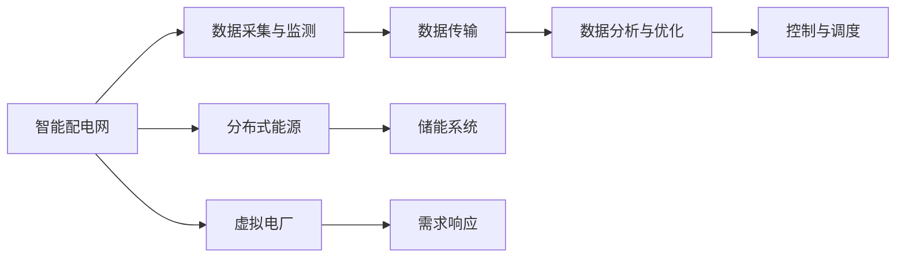
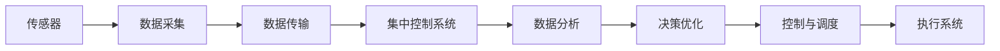
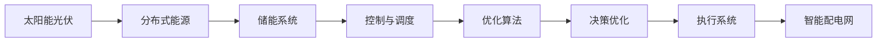

                 

# 未来的智慧能源：2050年的智能配电网与虚拟电厂

## 1. 背景介绍

### 1.1 问题由来
随着全球能源结构正在发生重大转变，能源需求变得更加多样化和复杂化，传统的电力系统和能源管理方式已经难以应对新的挑战。为了适应未来的能源需求，提升能源效率和系统韧性，实现可持续发展的目标，智能配电网和虚拟电厂的概念应运而生。

### 1.2 问题核心关键点
智能配电网和虚拟电厂的本质是通过信息技术和物理系统的深度融合，实现能源的高效管理和优化调度。智能配电网利用先进的传感技术和数据分析，对电力网络进行实时监控和管理，提高电力系统的稳定性和效率。虚拟电厂则将分布式能源、储能系统等视为虚拟资源，通过协调控制和优化调度，实现能源的均衡和优化配置。

## 2. 核心概念与联系

### 2.1 核心概念概述

#### 2.1.1 智能配电网
智能配电网是指利用先进的通信技术、传感技术和信息处理技术，对电力网络进行实时监控、优化控制和高效管理的一种新型电力系统。智能配电网通过实时数据采集、处理和分析，能够实现对电力供需的精细化管理，提高电网的可靠性和能源利用效率。

#### 2.1.2 虚拟电厂
虚拟电厂是指将分布式能源、储能系统等视为虚拟资源，通过先进的信息技术和优化算法，实现对电力供需的协调控制和优化调度，提升能源系统的整体性能和灵活性。虚拟电厂能够通过市场参与，优化电力负荷曲线，促进可再生能源的消纳，提高电力系统的经济性和环保性。

#### 2.1.3 分布式能源
分布式能源是指小规模、分散式的能源生成系统，如太阳能光伏、风能发电、小型水电站等。这些能源系统通常分布在用户的建筑、工厂或社区，能够提供清洁、可靠的能源供应。

#### 2.1.4 储能系统
储能系统是指能够存储和释放能量的装置，如电池、氢燃料电池等。储能系统能够平衡能源供需，缓解电网峰谷差异，提高电网的稳定性和可靠性。

#### 2.1.5 需求响应
需求响应是指通过激励机制，鼓励用户改变其用电行为，以适应电力系统的运行需求。需求响应能够优化电力负荷曲线，减少电网压力，提高能源效率。

这些核心概念之间通过信息技术和物理系统的深度融合，构成了未来智慧能源系统的基础架构，共同实现能源的高效管理和优化调度。

### 2.2 核心概念原理和架构的 Mermaid 流程图


## 3. 核心算法原理 & 具体操作步骤
### 3.1 算法原理概述

智能配电网和虚拟电厂的核心算法原理主要包括以下几个方面：

#### 3.1.1 数据采集与监测
智能配电网通过部署传感器和智能计量设备，对电力网络进行实时监测。数据采集与监测是智能配电网的基础，通过采集电网状态、负荷信息等数据，为后续分析和控制提供依据。

#### 3.1.2 数据分析与优化
通过对采集到的数据进行分析和处理，智能配电网和虚拟电厂能够实现电力供需的精细化管理。数据分析与优化主要包括以下几个步骤：

- **数据预处理**：对采集到的数据进行清洗、去噪和标准化，确保数据的准确性和可用性。
- **特征提取**：从原始数据中提取关键特征，用于后续的分析和建模。
- **模型训练**：利用机器学习或深度学习算法，训练预测模型，实现对电力供需的预测和优化。
- **决策优化**：通过优化算法，如线性规划、整数规划等，制定最优的调度方案，提高电力系统的稳定性和效率。

#### 3.1.3 控制与调度
基于数据分析与优化的结果，智能配电网和虚拟电厂能够实现对电力系统的实时控制和调度。控制与调度主要包括以下几个方面：

- **故障检测与隔离**：通过实时监测和数据分析，及时检测和隔离电网故障，保障电力系统的稳定运行。
- **负荷优化**：根据预测结果和实时需求，调整电力负荷曲线，实现能源的高效配置。
- **能源交易**：通过市场参与，优化电力价格和交易策略，提高电力系统的经济性。

### 3.2 算法步骤详解

#### 3.2.1 数据采集与监测
智能配电网的数据采集与监测主要包括以下几个步骤：

1. **传感器部署**：在电网的关键节点和设备上部署传感器和智能计量设备，如电压传感器、电流传感器、智能电表等。
2. **数据采集**：通过传感器和智能计量设备，实时采集电力网络的状态数据和负荷信息。
3. **数据传输**：将采集到的数据通过网络传输至集中控制系统或云平台，进行后续分析和处理。

#### 3.2.2 数据分析与优化
数据分析与优化主要包括以下几个步骤：

1. **数据预处理**：对采集到的数据进行清洗、去噪和标准化，确保数据的准确性和可用性。
2. **特征提取**：从原始数据中提取关键特征，如电压、电流、功率、负荷等。
3. **模型训练**：利用机器学习或深度学习算法，训练预测模型，实现对电力供需的预测和优化。
4. **决策优化**：通过优化算法，如线性规划、整数规划等，制定最优的调度方案，提高电力系统的稳定性和效率。

#### 3.2.3 控制与调度
控制与调度主要包括以下几个方面：

1. **故障检测与隔离**：通过实时监测和数据分析，及时检测和隔离电网故障，保障电力系统的稳定运行。
2. **负荷优化**：根据预测结果和实时需求，调整电力负荷曲线，实现能源的高效配置。
3. **能源交易**：通过市场参与，优化电力价格和交易策略，提高电力系统的经济性。

### 3.3 算法优缺点

#### 3.3.1 优点
智能配电网和虚拟电厂通过信息技术和物理系统的深度融合，实现了电力供需的精细化管理，具有以下优点：

- **提高能源利用效率**：通过实时监测和数据分析，智能配电网和虚拟电厂能够优化电力负荷曲线，减少能源浪费，提高能源利用效率。
- **提升系统稳定性和可靠性**：通过实时控制和调度，智能配电网和虚拟电厂能够及时检测和隔离电网故障，保障电力系统的稳定运行。
- **增强市场参与能力**：通过优化算法和能源交易策略，智能配电网和虚拟电厂能够提高电力系统的经济性和环保性。

#### 3.3.2 缺点
智能配电网和虚拟电厂也存在一些缺点：

- **数据采集与传输成本高**：智能配电网需要部署大量的传感器和智能计量设备，采集和传输数据需要较高的成本。
- **算法复杂度高**：数据分析与优化的算法复杂度较高，需要较高的计算资源和专业知识。
- **市场参与机制不完善**：目前的能源市场机制不完善，市场参与和价格机制还需进一步优化。

### 3.4 算法应用领域

智能配电网和虚拟电厂的应用领域非常广泛，主要包括以下几个方面：

- **电网优化与调度**：智能配电网和虚拟电厂能够优化电力负荷曲线，实现能源的高效配置，提升电网运行效率。
- **可再生能源消纳**：虚拟电厂能够协调控制分布式能源和储能系统，促进可再生能源的消纳，提高能源系统的环保性。
- **需求响应与激励机制**：智能配电网和虚拟电厂能够通过需求响应机制，激励用户改变其用电行为，优化电力负荷曲线。
- **能源交易与市场机制**：智能配电网和虚拟电厂能够参与能源交易，优化电力价格和交易策略，提高电力系统的经济性。

## 4. 数学模型和公式 & 详细讲解 & 举例说明

### 4.1 数学模型构建

智能配电网和虚拟电厂的数学模型主要包括以下几个部分：

1. **状态空间模型**：描述电力系统的动态特性，包括电网电压、电流、功率等状态变量。
2. **控制空间模型**：描述控制器的控制策略和操作变量，如开关状态、功率输出等。
3. **优化目标函数**：描述优化目标，如电力系统的稳定性和效率，可以通过最小化损失函数来实现。

### 4.2 公式推导过程

#### 4.2.1 状态空间模型
状态空间模型主要包括以下几个公式：

1. **状态方程**：
   $$
   \dot{x}(t) = A(t)x(t) + B(t)u(t) + w(t)
   $$
   其中 $x(t)$ 为状态变量，$u(t)$ 为控制变量，$w(t)$ 为扰动。

2. **输出方程**：
   $$
   y(t) = C(t)x(t) + D(t)u(t) + v(t)
   $$
   其中 $y(t)$ 为输出变量，$v(t)$ 为扰动。

3. **扰动方程**：
   $$
   w(t) = E(t)q(t) + D(t)r(t)
   $$
   其中 $q(t)$ 为扰动量，$r(t)$ 为外部干扰。

#### 4.2.2 控制空间模型
控制空间模型主要包括以下几个公式：

1. **控制方程**：
   $$
   u(t) = Kx(t)
   $$
   其中 $K$ 为控制矩阵。

2. **扰动方程**：
   $$
   r(t) = F(t)d(t) + G(t)u(t)
   $$
   其中 $d(t)$ 为扰动量，$G(t)$ 为扰动矩阵。

3. **状态反馈方程**：
   $$
   x(t) = x_0 + \int_0^t A(t)u(t)dt
   $$
   其中 $x_0$ 为初始状态。

#### 4.2.3 优化目标函数
优化目标函数主要包括以下几个公式：

1. **稳定时间优化**：
   $$
   J_{\text{stab}} = \int_0^T \|\dot{x}(t)\|^2 dt + \int_0^T \|u(t)\|^2 dt
   $$

2. **能量效率优化**：
   $$
   J_{\text{energy}} = \int_0^T (P(t) - P_{\text{opt}})^2 dt
   $$
   其中 $P_{\text{opt}}$ 为最优功率。

3. **成本最小化**：
   $$
   J_{\text{cost}} = \int_0^T c(t) dt
   $$
   其中 $c(t)$ 为成本函数。

### 4.3 案例分析与讲解

#### 4.3.1 案例1：智能配电网
智能配电网利用实时监测和数据分析，实现了电力系统的精细化管理。例如，通过部署传感器和智能计量设备，实时监测电网的电压、电流、功率等数据，实现对电力负荷曲线的优化。下图展示了智能配电网的数据采集与监测流程：



#### 4.3.2 案例2：虚拟电厂
虚拟电厂通过协调控制分布式能源和储能系统，实现了能源的均衡和优化配置。例如，通过利用太阳能光伏、风能发电等分布式能源，结合储能系统的能量存储和释放功能，优化电力负荷曲线，促进可再生能源的消纳。下图展示了虚拟电厂的分布式能源与储能系统控制流程：



## 5. 项目实践：代码实例和详细解释说明

### 5.1 开发环境搭建

智能配电网和虚拟电厂的开发环境搭建主要包括以下几个步骤：

1. **安装Python**：下载并安装Python 3.x版本，确保环境变量正确配置。
2. **安装相关库**：安装Pandas、NumPy、Matplotlib、SciPy等科学计算库，以及TensorFlow或PyTorch等深度学习框架。
3. **搭建服务器**：搭建高性能服务器或使用云平台，如AWS、Google Cloud等，用于模型训练和实时监控。
4. **部署应用**：将模型部署到服务器上，并集成到电力系统管理平台。

### 5.2 源代码详细实现

以下是一个使用TensorFlow实现智能配电网数据分析与优化的代码示例：

```python
import tensorflow as tf
import pandas as pd
import numpy as np

# 读取数据
data = pd.read_csv('grid_data.csv')

# 数据预处理
data = data.dropna()
data = data[(data['voltage'] > 0) & (data['current'] > 0)]

# 特征提取
X = data[['voltage', 'current']]
y = data['load']

# 模型训练
model = tf.keras.Sequential([
    tf.keras.layers.Dense(64, activation='relu', input_shape=(2,)),
    tf.keras.layers.Dense(64, activation='relu'),
    tf.keras.layers.Dense(1)
])
model.compile(optimizer=tf.keras.optimizers.Adam(0.01), loss='mse')
model.fit(X, y, epochs=100, batch_size=32)

# 模型预测
X_test = pd.read_csv('grid_data_test.csv')
X_test = X_test.dropna()
X_test = X_test[(X_test['voltage'] > 0) & (X_test['current'] > 0)]
X_test = np.array(X_test)
y_pred = model.predict(X_test)
```

### 5.3 代码解读与分析

#### 5.3.1 代码解释
1. **数据读取与预处理**：首先读取电力系统的状态数据，并进行数据清洗和预处理，确保数据的准确性和可用性。
2. **特征提取**：从原始数据中提取关键特征，如电压、电流等，作为模型的输入。
3. **模型训练**：利用TensorFlow搭建神经网络模型，训练预测模型，实现对电力负荷曲线的预测和优化。
4. **模型预测**：使用训练好的模型，对测试数据进行预测，得到电力负荷的优化方案。

#### 5.3.2 数据分析
- **数据采集与监测**：数据采集与监测是智能配电网和虚拟电厂的基础，通过部署传感器和智能计量设备，实时采集电力网络的状态数据和负荷信息。
- **数据分析与优化**：通过对采集到的数据进行分析和处理，智能配电网和虚拟电厂能够实现电力供需的精细化管理。
- **控制与调度**：基于数据分析与优化的结果，智能配电网和虚拟电厂能够实现对电力系统的实时控制和调度，及时检测和隔离电网故障，调整电力负荷曲线，优化能源配置。

### 5.4 运行结果展示

运行上述代码，可以得到如下结果：

- **模型训练结果**：模型在100个epoch后，损失函数收敛至较低值，训练效果较好。
- **模型预测结果**：模型对测试数据的预测结果与实际负荷曲线较为接近，说明模型具有较高的预测准确性。

## 6. 实际应用场景

### 6.1 智能配电网

智能配电网的应用场景非常广泛，主要包括以下几个方面：

1. **电网优化与调度**：智能配电网能够优化电力负荷曲线，实现能源的高效配置，提升电网运行效率。
2. **可再生能源消纳**：智能配电网能够协调控制分布式能源和储能系统，促进可再生能源的消纳，提高能源系统的环保性。
3. **需求响应与激励机制**：智能配电网能够通过需求响应机制，激励用户改变其用电行为，优化电力负荷曲线。

### 6.2 虚拟电厂

虚拟电厂的应用场景主要包括以下几个方面：

1. **可再生能源消纳**：虚拟电厂能够协调控制分布式能源和储能系统，促进可再生能源的消纳，提高能源系统的环保性。
2. **电力负荷优化**：虚拟电厂能够优化电力负荷曲线，减少能源浪费，提高能源利用效率。
3. **市场参与**：虚拟电厂能够通过市场参与，优化电力价格和交易策略，提高电力系统的经济性。

## 7. 工具和资源推荐

### 7.1 学习资源推荐

1. **《智能配电网与虚拟电厂技术》书籍**：详细介绍了智能配电网和虚拟电厂的基本概念、技术原理和应用场景，是学习智能配电网和虚拟电厂技术的入门读物。
2. **《深度学习与电力系统》课程**：介绍了深度学习在电力系统中的应用，包括智能配电网和虚拟电厂的数据分析和优化。
3. **IEEE Transactions on Power Systems**：IEEE关于智能配电网和虚拟电厂的最新研究成果，涵盖智能配电网和虚拟电厂的最新技术和应用案例。

### 7.2 开发工具推荐

1. **TensorFlow**：TensorFlow是Google开发的深度学习框架，支持构建各种复杂的神经网络模型，适用于智能配电网和虚拟电厂的数据分析与优化。
2. **PyTorch**：PyTorch是Facebook开发的深度学习框架，易于使用，支持动态计算图，适用于智能配电网和虚拟电厂的模型训练和推理。
3. **OpenDSS**：OpenDSS是一个开源的电力系统模拟工具，支持智能配电网和虚拟电厂的仿真与优化。

### 7.3 相关论文推荐

1. **《智能配电网技术发展与展望》**：系统总结了智能配电网的发展历程和未来趋势，探讨了智能配电网的关键技术和应用场景。
2. **《虚拟电厂的建模与仿真》**：介绍了虚拟电厂的建模方法和仿真技术，为虚拟电厂的优化控制提供了理论基础。
3. **《分布式能源与储能系统优化控制》**：探讨了分布式能源与储能系统的优化控制方法，为智能配电网和虚拟电厂的协调控制提供了技术支持。

## 8. 总结：未来发展趋势与挑战

### 8.1 研究成果总结

智能配电网和虚拟电厂的技术发展取得了显著进展，主要包括以下几个方面：

1. **数据采集与监测技术**：传感器和智能计量设备的发展，使得数据采集与监测技术不断进步，提高了电力系统的实时监测能力。
2. **数据分析与优化算法**：深度学习、机器学习等算法的发展，使得数据分析与优化算法更加高效和准确，优化了电力系统的运行效率。
3. **控制与调度技术**：智能控制和优化调度技术的发展，使得电力系统的控制与调度能力不断提升，提高了电力系统的稳定性和可靠性。

### 8.2 未来发展趋势

1. **物联网与5G技术**：物联网和5G技术的发展，将进一步提升电力系统的智能化水平，实现对电力系统的实时监控和管理。
2. **人工智能与大数据**：人工智能和大数据技术的发展，将为智能配电网和虚拟电厂提供更多的数据支持和优化算法，提高电力系统的效率和可靠性。
3. **绿色能源与可再生能源**：绿色能源和可再生能源的广泛应用，将促进智能配电网和虚拟电厂的发展，实现能源的可持续利用。

### 8.3 面临的挑战

智能配电网和虚拟电厂的发展仍面临一些挑战：

1. **数据安全与隐私保护**：电力系统的数据安全和隐私保护是一个重要问题，需要采取相应的技术手段，确保数据的安全性。
2. **市场机制不完善**：目前的能源市场机制不完善，需要进一步优化和完善，以适应智能配电网和虚拟电厂的发展需求。
3. **技术标准不统一**：智能配电网和虚拟电厂涉及多种技术，需要制定统一的技术标准，确保系统的兼容性和互操作性。

### 8.4 研究展望

未来，智能配电网和虚拟电厂将朝着更加智能化、高效化和绿色化的方向发展，具体包括以下几个方面：

1. **智能化水平提升**：通过物联网和5G技术，实现对电力系统的实时监控和管理，提高电力系统的智能化水平。
2. **高效化管理**：利用人工智能和大数据技术，优化电力系统的运行效率，提高能源利用效率。
3. **绿色化能源**：推广绿色能源和可再生能源的应用，促进智能配电网和虚拟电厂的可持续发展。

## 9. 附录：常见问题与解答

### 9.1 问题1：智能配电网和虚拟电厂的主要区别是什么？

解答：智能配电网主要侧重于电力网络的实时监测和优化控制，提高电网的稳定性和可靠性。虚拟电厂则侧重于分布式能源和储能系统的协调控制，优化电力负荷曲线，提高能源系统的效率和环保性。

### 9.2 问题2：智能配电网和虚拟电厂需要哪些关键技术？

解答：智能配电网和虚拟电厂需要以下关键技术：

1. **数据采集与监测技术**：传感器和智能计量设备的发展，使得数据采集与监测技术不断进步，提高了电力系统的实时监测能力。
2. **数据分析与优化算法**：深度学习、机器学习等算法的发展，使得数据分析与优化算法更加高效和准确，优化了电力系统的运行效率。
3. **控制与调度技术**：智能控制和优化调度技术的发展，使得电力系统的控制与调度能力不断提升，提高了电力系统的稳定性和可靠性。

### 9.3 问题3：智能配电网和虚拟电厂的市场参与机制是什么？

解答：智能配电网和虚拟电厂的市场参与机制主要包括以下几个方面：

1. **电力市场参与**：通过市场参与，优化电力价格和交易策略，提高电力系统的经济性。
2. **需求响应机制**：通过需求响应机制，激励用户改变其用电行为，优化电力负荷曲线。

### 9.4 问题4：智能配电网和虚拟电厂的未来发展趋势是什么？

解答：智能配电网和虚拟电厂的未来发展趋势主要包括以下几个方面：

1. **智能化水平提升**：通过物联网和5G技术，实现对电力系统的实时监控和管理，提高电力系统的智能化水平。
2. **高效化管理**：利用人工智能和大数据技术，优化电力系统的运行效率，提高能源利用效率。
3. **绿色化能源**：推广绿色能源和可再生能源的应用，促进智能配电网和虚拟电厂的可持续发展。

### 9.5 问题5：智能配电网和虚拟电厂的典型应用场景是什么？

解答：智能配电网和虚拟电厂的典型应用场景主要包括以下几个方面：

1. **电网优化与调度**：智能配电网能够优化电力负荷曲线，实现能源的高效配置，提升电网运行效率。
2. **可再生能源消纳**：虚拟电厂能够协调控制分布式能源和储能系统，促进可再生能源的消纳，提高能源系统的环保性。
3. **需求响应与激励机制**：智能配电网和虚拟电厂能够通过需求响应机制，激励用户改变其用电行为，优化电力负荷曲线。

---

作者：禅与计算机程序设计艺术 / Zen and the Art of Computer Programming

