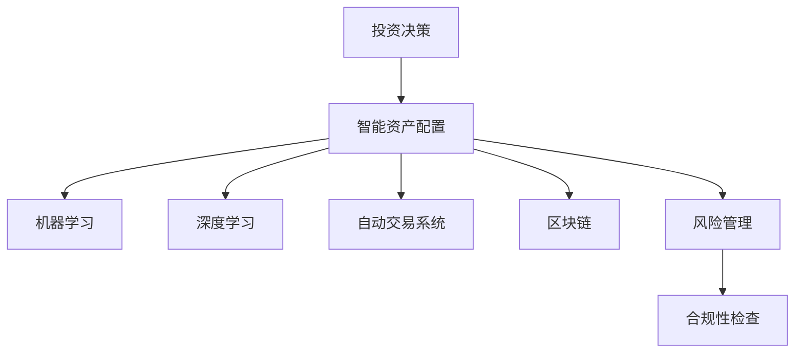

                 

# 未来的智能投资：2050年的AI投资决策与智能资产配置

> 关键词：人工智能,投资决策,智能资产配置,机器学习,深度学习,自动交易系统,风险管理,区块链

## 1. 背景介绍

### 1.1 问题由来

随着全球经济数字化、网络化、智能化水平的不断提升，传统的投资决策和资产配置方式正在发生根本性变革。金融科技的兴起，尤其是人工智能技术在金融领域的广泛应用，正逐步改变着投资行业的运作模式。在2050年，基于AI的投资决策和智能资产配置有望成为主流，为投资者提供更加精准、高效、稳健的投资服务。

### 1.2 问题核心关键点

当前，投资决策和资产配置过程中面临的核心问题主要包括：
- **数据规模和维度增加**：数据已经成为投资决策的关键驱动力，如何高效处理、分析和利用海量数据成为难题。
- **投资策略多样性**：不同市场、不同行业、不同时间尺度的投资策略，要求系统具备灵活适应性。
- **投资风险管理**：如何利用AI技术提升风险预测和控制能力，保障投资组合的安全性和稳定性。
- **投资合规性**：在快速变化的市场环境中，如何确保合规性，避免法律风险。

### 1.3 问题研究意义

研究2050年基于AI的投资决策与智能资产配置，对于推动金融科技发展、提升投资者体验、优化资产配置策略具有重要意义：

1. **提升投资效率**：AI技术能够自动分析大量市场数据，快速生成投资建议，大幅提升投资决策的速度和效率。
2. **优化资产配置**：AI模型可以识别市场趋势、风险因素，并实时调整资产配置，确保投资组合与市场环境匹配。
3. **风险控制**：利用机器学习模型进行风险预测，及时识别并控制投资风险，保障投资组合稳健性。
4. **增强合规性**：智能系统能持续监测合规要求，避免违规行为，确保投资活动符合法律法规。

## 2. 核心概念与联系

### 2.1 核心概念概述

为更好地理解2050年基于AI的投资决策和智能资产配置，本节将介绍几个密切相关的核心概念：

- **投资决策**：根据市场数据、历史表现、投资者偏好等因素，制定投资策略和操作计划的过程。
- **智能资产配置**：利用AI技术，自动分析市场数据、预测资产表现，动态调整资产分配比例，优化投资组合。
- **机器学习**：通过数据驱动的算法，自动发现数据中的模式和规律，用于投资策略构建和模型训练。
- **深度学习**：一种基于神经网络的机器学习范式，能够处理非线性关系和高维数据，适用于复杂投资场景。
- **自动交易系统**：一种基于AI的算法交易系统，能够根据预设规则或模型自动执行买卖操作。
- **区块链**：一种分布式账本技术，提供透明、安全、不可篡改的数据存储和交易机制，应用于智能合约和去中心化金融。
- **风险管理**：识别、评估、控制投资风险的过程，旨在确保投资组合的稳健性和安全性。

这些核心概念之间的逻辑关系可以通过以下Mermaid流程图来展示：



这个流程图展示了一系列关键概念及其之间的关系：

1. 投资决策和智能资产配置是核心，依赖于机器学习和深度学习技术。
2. 自动交易系统作为投资决策和资产配置的执行工具。
3. 区块链技术提供数据存储和交易的安全保障。
4. 风险管理与合规性检查是投资决策和资产配置的重要支撑。

## 3. 核心算法原理 & 具体操作步骤
### 3.1 算法原理概述

基于AI的投资决策和智能资产配置，核心算法包括**回归分析**、**分类算法**、**聚类分析**和**强化学习**等。其中，回归分析和分类算法用于预测市场数据和资产表现，聚类分析用于资产的分类和组合优化，强化学习用于动态调整投资策略。

这些算法共同构成了投资决策和资产配置的数学基础，通过数据驱动的方法，实现了对市场的精准分析和预测，提升了投资决策的科学性和系统性。

### 3.2 算法步骤详解

基于AI的投资决策和智能资产配置，通常包括以下几个关键步骤：

**Step 1: 数据准备**
- 收集历史市场数据、新闻信息、经济指标、公司财报等数据源。
- 进行数据清洗、处理，确保数据的完整性和一致性。

**Step 2: 模型构建**
- 选择合适的机器学习或深度学习模型，如线性回归、决策树、神经网络等。
- 设计训练目标函数和优化算法，如梯度下降、Adam等。

**Step 3: 模型训练**
- 使用历史数据训练模型，调整模型参数，使其能够准确预测市场趋势和资产表现。
- 使用交叉验证技术，评估模型性能，确保模型泛化能力。

**Step 4: 风险评估**
- 利用模型预测市场波动和资产风险，评估投资组合的风险水平。
- 进行敏感性分析和压力测试，确保投资组合在不同市场环境下的稳健性。

**Step 5: 资产配置**
- 根据风险评估结果，优化资产配置比例，构建投资组合。
- 实时监控市场变化，动态调整投资组合，确保与市场环境匹配。

**Step 6: 交易执行**
- 根据投资策略和模型输出，自动执行交易操作。
- 进行回测和验证，确保交易策略的有效性和稳健性。

### 3.3 算法优缺点

基于AI的投资决策和智能资产配置方法具有以下优点：
1. **高效性**：AI模型能够快速处理和分析大量数据，大幅提升投资决策的速度和效率。
2. **精准性**：通过机器学习和深度学习技术，预测市场趋势和资产表现具有较高的准确性。
3. **灵活性**：能够根据市场变化，动态调整投资策略和资产配置，适应性强。
4. **稳健性**：通过风险管理，确保投资组合的稳健性和安全性。

同时，该方法也存在一定的局限性：
1. **数据依赖**：模型的准确性和性能很大程度上依赖于数据的质量和完整性。
2. **模型复杂性**：深度学习模型参数众多，训练复杂，需要较高的计算资源。
3. **解释性不足**：AI模型的决策过程缺乏可解释性，难以进行深入分析。
4. **合规风险**：智能系统可能出现操作错误或违规行为，需加强合规性审查。

尽管存在这些局限性，但AI在投资决策和资产配置中的应用前景广阔，未来将不断提升模型的可靠性和适用性。

### 3.4 算法应用领域

基于AI的投资决策和智能资产配置方法，在金融科技领域已经得到了广泛的应用，覆盖了以下领域：

- **量化投资**：利用AI模型进行市场分析和预测，自动执行交易操作，实现高精度和高频交易。
- **资产管理**：根据市场趋势和风险评估，动态调整资产配置，优化投资组合。
- **风险控制**：通过AI技术预测市场波动和风险，实现有效的风险管理和控制。
- **金融科技平台**：集成AI算法和自动交易系统，提供智能投顾和机器人理财等服务。
- **区块链金融**：利用区块链技术进行资产登记、交易和结算，提高金融交易的透明性和安全性。

此外，AI技术还应用于财务预测、信用评估、反欺诈等多个金融领域，为金融科技发展提供了强大的技术支撑。

## 4. 数学模型和公式 & 详细讲解
### 4.1 数学模型构建

本节将使用数学语言对基于AI的投资决策和智能资产配置过程进行更加严格的刻画。

设市场数据为 $X = \{x_1, x_2, ..., x_n\}$，其中 $x_i = [x_{i1}, x_{i2}, ..., x_{im}]$ 为第 $i$ 个样本的第 $m$ 个特征向量。设投资组合价值为 $Y$，其中 $y_i$ 为第 $i$ 个样本的投资组合价值。设 $W = [w_1, w_2, ..., w_m]$ 为特征权重向量，目标函数为：

$$
\min_{W} \sum_{i=1}^N (y_i - \sum_{j=1}^m w_j x_{ij})^2
$$

其中 $N$ 为样本数量，$||W||^2$ 为 $W$ 的 $L_2$ 范数。

### 4.2 公式推导过程

考虑一个简单的线性回归模型，用于预测投资组合的价值 $Y$：

$$
Y = \beta_0 + \sum_{j=1}^m \beta_j x_{ij} + \epsilon
$$

其中 $\beta_j$ 为第 $j$ 个特征的回归系数，$\epsilon$ 为误差项。利用最小二乘法，求解 $\beta$ 的值为：

$$
\hat{\beta} = (X^T X)^{-1} X^T Y
$$

代入 $Y = \beta_0 + \sum_{j=1}^m \beta_j x_{ij}$，得到：

$$
\hat{\beta} = (X^T X)^{-1} X^T (Y - \hat{Y})
$$

其中 $\hat{Y} = X \hat{\beta}$ 为预测值。

### 4.3 案例分析与讲解

以股票市场的投资组合价值预测为例，我们可以使用线性回归模型来构建投资决策模型。首先，选择一些与市场相关的特征，如市盈率、市净率、股息率等，作为模型的输入 $X$。然后，使用历史数据进行模型训练，得到 $\hat{\beta}$。在预测时，输入当前市场的特征 $x$，利用 $\hat{Y} = X \hat{\beta}$ 计算出投资组合的预测价值。

在实际应用中，为了提升模型的鲁棒性和预测能力，可以引入非线性变换和特征工程，如对数变换、归一化、特征组合等。此外，还可以使用更复杂的模型，如随机森林、神经网络等，进一步提高模型的准确性和泛化能力。

## 5. 项目实践：代码实例和详细解释说明
### 5.1 开发环境搭建

在进行AI投资决策和智能资产配置实践前，我们需要准备好开发环境。以下是使用Python进行TensorFlow和Keras开发的环境配置流程：

1. 安装Anaconda：从官网下载并安装Anaconda，用于创建独立的Python环境。

2. 创建并激活虚拟环境：
```bash
conda create -n ai-env python=3.8 
conda activate ai-env
```

3. 安装TensorFlow：根据CUDA版本，从官网获取对应的安装命令。例如：
```bash
conda install tensorflow tensorflow-gpu -c conda-forge -c pypi
```

4. 安装Keras：
```bash
pip install keras
```

5. 安装各类工具包：
```bash
pip install numpy pandas scikit-learn matplotlib tqdm jupyter notebook ipython
```

完成上述步骤后，即可在`ai-env`环境中开始AI投资决策和智能资产配置的实践。

### 5.2 源代码详细实现

下面我们以基于线性回归的股票市场投资组合价值预测为例，给出使用TensorFlow和Keras进行模型训练和预测的Python代码实现。

首先，定义模型和数据：

```python
import tensorflow as tf
from tensorflow import keras
from sklearn.model_selection import train_test_split
from sklearn.preprocessing import StandardScaler

# 加载数据
data = pd.read_csv('stock_data.csv')

# 特征和标签
features = data[['pe_ratio', 'pb_ratio', 'dividend_yield']]
targets = data['price']

# 数据标准化
scaler = StandardScaler()
features = scaler.fit_transform(features)

# 分割数据集
train_features, test_features, train_targets, test_targets = train_test_split(features, targets, test_size=0.2, random_state=42)
```

然后，构建模型：

```python
# 定义线性回归模型
model = keras.Sequential([
    keras.layers.Dense(64, activation='relu', input_shape=(features.shape[1],)),
    keras.layers.Dense(64, activation='relu'),
    keras.layers.Dense(1)
])

# 编译模型
model.compile(optimizer='adam', loss='mse', metrics=['mae'])

# 训练模型
model.fit(train_features, train_targets, epochs=100, batch_size=32, validation_data=(test_features, test_targets))
```

最后，进行预测和评估：

```python
# 预测
test_predictions = model.predict(test_features)

# 评估
mae = tf.keras.metrics.mean_absolute_error(test_targets, test_predictions)
rmse = tf.keras.metrics.root_mean_squared_error(test_targets, test_predictions)
print('MAE:', mae.numpy())
print('RMSE:', rmse.numpy())
```

以上就是使用TensorFlow和Keras进行股票市场投资组合价值预测的完整代码实现。可以看到，TensorFlow和Keras提供了强大的模型构建和训练功能，使得构建和训练复杂模型变得简单高效。

### 5.3 代码解读与分析

让我们再详细解读一下关键代码的实现细节：

**特征选择和数据标准化**：
- 选择了市盈率、市净率和股息率等特征，作为模型的输入。
- 使用sklearn的StandardScaler进行数据标准化，确保数据在不同特征尺度上的可比性。

**模型构建和编译**：
- 使用keras的Sequential模型定义线性回归模型，包括两个全连接层和一个输出层。
- 使用Adam优化器和均方误差损失函数进行模型编译。

**模型训练**：
- 使用训练集数据进行模型训练，设置100个epochs和32个样本批量。
- 利用validation_data参数进行模型评估，确保模型在测试集上的泛化能力。

**预测和评估**：
- 使用模型对测试集进行预测，并计算MAE和RMSE等评估指标。
- 输出MAE和RMSE的值，评估模型的预测性能。

可以看到，TensorFlow和Keras提供了灵活、高效的模型构建和训练工具，使得AI投资决策和智能资产配置的实现变得更加简单。开发者可以将更多精力放在特征选择、模型优化和预测策略的创新上。

## 6. 实际应用场景

### 6.1 智能投顾系统

基于AI的投资决策和智能资产配置，可以构建智能投顾系统，为个人投资者提供定制化的投资建议。智能投顾系统通过分析市场数据和用户偏好，自动生成个性化的投资组合，并实时调整投资策略。

在技术实现上，智能投顾系统通常由数据采集、模型训练、策略生成和交易执行等模块组成。通过用户输入的基本信息和风险偏好，系统自动进行市场分析和资产配置，生成推荐组合和操作建议。用户可以在系统中实时查看资产表现和风险评估，根据推荐结果进行投资操作。

### 6.2 风险管理平台

投资决策中的风险管理是关键，AI技术能够帮助投资者更好地识别和管理风险。基于AI的风险管理平台，可以实时监测市场波动，预测潜在风险，提供风险控制策略。

平台通常利用历史数据和实时数据，构建风险预测模型，输出风险评分和预警信息。投资者可以根据风险评分，动态调整投资组合，规避高风险资产。同时，平台还提供敏感性分析和压力测试功能，评估不同市场环境下的投资风险。

### 6.3 区块链金融应用

区块链技术为金融交易提供了透明、安全、不可篡改的保障，结合AI技术，可以实现更智能的金融应用。基于AI的投资决策和资产配置，可以嵌入到智能合约中，自动执行投资策略和资产管理。

例如，在智能合约中集成股票市场预测模型，根据市场数据自动买卖股票。投资者可以设置触发条件和操作规则，平台自动执行交易操作。此外，平台还可以利用区块链技术进行资产登记和交易，确保交易的透明性和安全性。

### 6.4 未来应用展望

随着AI技术的不断进步，基于AI的投资决策和智能资产配置将具备更强的适应性和预测能力，为投资者提供更精准、稳健的投资服务。未来可能的突破包括：

1. **多模态数据融合**：利用自然语言处理、图像识别、语音识别等多模态数据，提升市场分析的全面性和深度。
2. **联邦学习**：分布式计算环境下，保护数据隐私的前提下，利用跨机构数据进行模型训练和优化。
3. **图神经网络**：利用图结构分析市场数据，捕捉资产之间的关联关系，提升投资决策的精准性。
4. **深度强化学习**：结合强化学习技术，实现动态调整投资策略，优化资产配置。
5. **区块链与AI结合**：结合区块链技术和AI算法，实现更加安全、透明的金融交易。

这些方向的探索，将推动AI在投资决策和资产配置中的应用进一步深入，为投资者带来更安全、高效的投资体验。

## 7. 工具和资源推荐
### 7.1 学习资源推荐

为了帮助开发者系统掌握AI在投资决策和智能资产配置的理论基础和实践技巧，这里推荐一些优质的学习资源：

1. **TensorFlow官方文档**：TensorFlow的官方文档，提供了丰富的API文档和教程，适合快速上手TensorFlow的开发实践。
2. **Keras官方文档**：Keras的官方文档，提供了简洁易用的API接口和教程，适合初学者和高级开发者使用。
3. **《深度学习入门》**：李沐老师所著，介绍了深度学习的理论基础和实践技巧，适合入门读者快速上手。
4. **《Python金融机器学习》**：袁洋老师所著，系统介绍了金融领域的机器学习和深度学习应用，适合金融领域的开发者。
5. **《金融工程与风险管理》**：本书系统介绍了金融工程和风险管理的理论和实践，适合金融行业的从业人员阅读。

通过对这些资源的学习实践，相信你一定能够快速掌握AI在投资决策和智能资产配置的精髓，并用于解决实际的投资问题。

### 7.2 开发工具推荐

高效的开发离不开优秀的工具支持。以下是几款用于AI投资决策和智能资产配置开发的常用工具：

1. **TensorFlow**：基于Python的开源深度学习框架，灵活动态的计算图，适合快速迭代研究。支持多GPU和TPU加速，适合大规模模型训练。
2. **Keras**：Keras是一个高层次的神经网络API，可在TensorFlow、Theano和CNTK上运行，提供简洁易用的接口，适合快速原型开发。
3. **Jupyter Notebook**：Jupyter Notebook是一个交互式的Web应用，支持多种编程语言和科学计算库，适合数据探索和模型验证。
4. **PyTorch**：基于Python的开源深度学习框架，灵活的动态计算图，适合快速迭代研究。支持多GPU和TPU加速，适合大规模模型训练。
5. **Scikit-learn**：Scikit-learn是一个Python机器学习库，提供多种机器学习算法和工具，适合数据预处理和模型评估。

合理利用这些工具，可以显著提升AI投资决策和智能资产配置任务的开发效率，加快创新迭代的步伐。

### 7.3 相关论文推荐

AI在投资决策和智能资产配置领域的研究已经取得了显著进展。以下是几篇奠基性的相关论文，推荐阅读：

1. **Deep Learning for Asset Pricing: A Comprehensive Review**：深入综述了深度学习在资产定价中的应用，探讨了深度神经网络模型的性能和特点。
2. **AI in Investment Management: A Review**：系统介绍了AI在投资管理中的应用，包括投资决策、资产配置、风险管理等方面。
3. **Machine Learning in Asset Management: A Survey**：全面综述了机器学习在资产管理中的应用，涵盖了分类、回归、聚类等多种机器学习算法。
4. **Smart Beta and Factor Investing**：探讨了智能贝塔和因子投资的理论基础和应用实践，介绍了基于机器学习的因子筛选和组合优化方法。
5. **Blockchain-based Decentralized Finance**：介绍了区块链在去中心化金融中的应用，探讨了基于AI的智能合约和自动交易系统的构建。

这些论文代表了大规模投资决策和智能资产配置的研究前沿，通过学习这些前沿成果，可以帮助研究者把握学科前进方向，激发更多的创新灵感。

## 8. 总结：未来发展趋势与挑战
### 8.1 总结

本文对2050年基于AI的投资决策和智能资产配置方法进行了全面系统的介绍。首先阐述了AI在投资决策和资产配置中的重要作用，明确了其在提升投资效率、优化资产配置策略、增强风险控制能力等方面的独特价值。其次，从原理到实践，详细讲解了回归分析、分类算法、聚类分析和强化学习等核心算法，给出了AI投资决策和智能资产配置的完整代码实例。同时，本文还广泛探讨了AI技术在智能投顾、风险管理、区块链金融等多个领域的应用前景，展示了AI技术的巨大潜力。此外，本文精选了AI投资决策和智能资产配置的各类学习资源，力求为读者提供全方位的技术指引。

通过本文的系统梳理，可以看到，基于AI的投资决策和智能资产配置技术正在成为金融科技的重要支撑，极大地提升了投资决策的科学性和系统性。未来，伴随AI技术的不断进步，智能投资和资产配置必将在更多领域得到广泛应用，为金融市场带来新的变革。

### 8.2 未来发展趋势

展望未来，基于AI的投资决策和智能资产配置技术将呈现以下几个发展趋势：

1. **深度学习模型的普及**：深度学习技术在金融领域的应用将更加广泛，进一步提升模型预测的准确性和泛化能力。
2. **多模态数据的融合**：融合自然语言处理、图像识别、语音识别等多模态数据，提升市场分析的全面性和深度。
3. **联邦学习的应用**：分布式计算环境下，利用跨机构数据进行模型训练和优化，保护数据隐私的同时提升模型性能。
4. **图神经网络的应用**：利用图结构分析市场数据，捕捉资产之间的关联关系，提升投资决策的精准性。
5. **区块链与AI结合**：结合区块链技术和AI算法，实现更加安全、透明的金融交易。

以上趋势凸显了AI在投资决策和资产配置领域的广阔前景。这些方向的探索发展，必将进一步提升AI在金融科技中的应用价值，推动金融市场的智能化和高效化。

### 8.3 面临的挑战

尽管基于AI的投资决策和智能资产配置技术已经取得了显著进展，但在应用过程中仍面临诸多挑战：

1. **数据质量和隐私保护**：AI模型的预测性能很大程度上依赖于数据的质量和完整性，数据隐私保护也是重要的法律和道德问题。
2. **模型复杂性和可解释性**：深度学习模型参数众多，训练复杂，模型的可解释性也存在挑战。
3. **投资策略的风险性**：AI投资策略可能会存在操作错误或违规行为，需加强合规性审查。
4. **市场变化和波动**：市场环境的不确定性和波动性，要求AI模型具备灵活适应性和鲁棒性。
5. **技术与业务的融合**：将AI技术与实际业务进行有效融合，需要跨学科协作和深入理解。

这些挑战需要通过技术创新和跨学科合作，逐步克服，才能将AI技术在投资决策和资产配置中的应用推向新的高度。

### 8.4 研究展望

面对基于AI的投资决策和智能资产配置所面临的诸多挑战，未来的研究需要在以下几个方面寻求新的突破：

1. **无监督学习和半监督学习**：摆脱对大规模标注数据的依赖，利用自监督学习、主动学习等方法，最大限度利用非结构化数据。
2. **参数高效和计算高效的模型**：开发更加参数高效的模型，减少计算资源消耗，提升模型的实时性和稳定性。
3. **因果分析和博弈论结合**：引入因果分析方法和博弈论工具，增强模型的稳定性和适应性。
4. **跨领域和多模态融合**：融合不同领域的知识和数据，提升AI模型的全面性和深度。
5. **区块链与AI结合**：结合区块链技术和AI算法，实现更加安全、透明的金融交易。

这些研究方向的探索，必将引领AI在投资决策和资产配置中的应用进一步深入，为投资者带来更安全、高效的投资体验。

## 9. 附录：常见问题与解答

**Q1：基于AI的投资决策和智能资产配置是否适用于所有投资场景？**

A: 基于AI的投资决策和智能资产配置方法适用于大多数投资场景，特别是对于数据量较大、特征多样、变化频繁的市场。但对于某些特殊领域，如高频交易、算法博弈等，仍需要结合其他技术和策略。

**Q2：AI投资决策和智能资产配置是否会带来合规风险？**

A: AI投资决策和智能资产配置系统需要严格遵守法律法规，避免违规操作。引入合规性审查机制，定期进行模型和系统审计，确保其合规性。

**Q3：如何保证AI投资决策和智能资产配置的透明性和可解释性？**

A: 利用可解释性模型，如决策树、线性回归等，替代深度学习模型，提升模型的透明性和可解释性。引入专家知识和规则，辅助AI决策，增强系统的可解释性。

**Q4：AI投资决策和智能资产配置的实际应用中需要注意哪些问题？**

A: 实际应用中，需注意数据质量、模型训练、系统集成和合规性审查等问题。确保数据完整性和一致性，避免模型过拟合，加强系统与业务的无缝集成，严格遵守法律法规。

**Q5：未来AI在投资决策和资产配置中面临的主要挑战是什么？**

A: 数据质量和隐私保护、模型复杂性和可解释性、投资策略的风险性、市场变化和波动、技术与业务的融合等问题仍将是未来面临的主要挑战。需要不断进行技术创新和跨学科合作，逐步克服这些挑战。

这些回答解决了可能出现的主要疑问，帮助读者更好地理解基于AI的投资决策和智能资产配置的应用和实践。

---

作者：禅与计算机程序设计艺术 / Zen and the Art of Computer Programming

