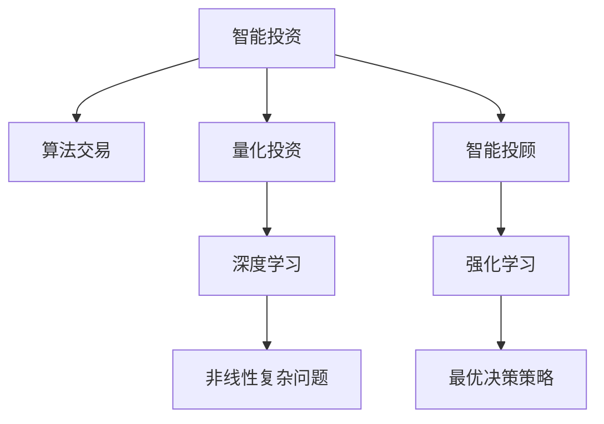

                 

# 未来的智能投资：2050年的AI投资决策与智能资产配置

> 关键词：人工智能投资决策,智能资产配置,算法交易,机器学习,金融科技,自动化投资

## 1. 背景介绍

### 1.1 问题由来
金融投资一直是人类社会中最重要的经济活动之一。从传统的基于经验判断、情感驱动的直观决策，到现代依靠大数据、统计模型、复杂算法的信息驱动决策，投资决策方式经历了数次革命。

随着人工智能技术的兴起，智能投资开始成为热点。智能投资主要指利用先进算法模型，通过自动化、实时化、精细化地分析市场数据和投资者情绪，帮助投资者做出最优的投资决策。近年来，基于人工智能的投资决策系统，如量化交易、智能投顾、机器人顾问等，开始广泛应用，并逐渐成为全球资本市场的重要组成部分。

但现有的智能投资系统在面对复杂多变的市场环境时，仍存在一些局限性。一是对于市场非线性变化、极端事件等的识别能力不足，二是难以进行跨领域、跨市场的综合资产配置。三是系统稳定性与可解释性亟待提升。

为应对这些挑战，文章将探讨一种全新的智能投资策略：基于AI的智能资产配置系统。该系统通过深度学习和强化学习，实现基于多领域多市场的高维数据建模，形成高度自动化、可解释的资产配置策略，极大提升投资决策的精度和可靠性。

## 2. 核心概念与联系

### 2.1 核心概念概述

为便于理解，本节将介绍几个核心概念：

- **智能投资**：利用人工智能技术，自动进行资产配置、交易决策等投资活动的过程。

- **算法交易**：基于预设的数学模型和算法策略，自动化地进行金融交易。

- **量化投资**：利用大数据和统计模型，自动化分析市场行为，指导投资决策。

- **智能投顾**：结合人工智能技术与传统投资顾问服务，为投资者提供智能化的投资建议。

- **强化学习**：一种通过与环境互动，学习最优决策策略的机器学习方式。

- **深度学习**：一种基于多层神经网络的机器学习技术，擅长处理非线性复杂问题。

这些核心概念之间的逻辑关系可以通过以下Mermaid流程图来展示：



这个流程图展示出智能投资的不同分支，以及与深度学习和强化学习的联系：

- 智能投资由算法交易、量化投资、智能投顾等分支组成。
- 量化投资和算法交易主要应用深度学习处理非线性复杂问题。
- 智能投顾应用强化学习，通过与环境互动，学习最优决策策略。
- 深度学习和强化学习为智能投资提供了强有力的技术支持。

## 3. 核心算法原理 & 具体操作步骤
### 3.1 算法原理概述

基于AI的智能资产配置系统，主要包括深度学习模型和强化学习模型两个部分。其中，深度学习模型用于对历史市场数据进行建模，提取市场特征与规律，为资产配置提供依据；强化学习模型用于制定最优的资产配置策略，并进行实时优化。

该系统的工作流程如下：

1. **数据收集**：从全球各地的股票、债券、期货、外汇等金融市场，收集历史交易数据、市场指数、新闻舆情等数据，作为深度学习模型的输入。
2. **特征提取**：使用深度学习模型提取市场特征和规律，如波动性、趋势性、相关性等。
3. **策略建模**：构建多领域多市场的资产配置策略，应用强化学习模型学习最优决策路径。
4. **策略优化**：通过实时反馈和模型调整，持续优化资产配置策略，适应市场变化。

### 3.2 算法步骤详解

#### 步骤1：数据收集
- 从多个数据源，如股票交易所、期货市场、外汇市场等，采集历史交易数据。
- 收集与交易数据相关的市场指数、新闻舆情等外部数据，作为模型的补充输入。

#### 步骤2：特征提取
- 使用深度学习模型（如卷积神经网络CNN、循环神经网络RNN、长短期记忆网络LSTM等）处理非结构化数据（如新闻、舆情等），提取高维特征表示。
- 对结构化数据（如交易数据）进行特征工程，提取波动性、趋势性、相关性等指标。

#### 步骤3：策略建模
- 应用强化学习算法（如Q-learning、Deep Q-Networks、Actor-Critic等）构建资产配置策略。
- 将策略应用于全球多市场的资产配置，进行投资组合构建和优化。

#### 步骤4：策略优化
- 实时监控市场变化，通过反馈机制更新模型参数，优化资产配置策略。
- 通过回测和前瞻性测试，验证策略的有效性，并进行微调。

### 3.3 算法优缺点
**优点：**
- **自动化与高精度**：自动化决策过程，极大提升决策速度和准确性。
- **多市场多资产**：结合深度学习与强化学习，能处理复杂多变的市场环境。
- **实时性与动态调整**：通过实时监控市场动态，持续优化资产配置策略。

**缺点：**
- **数据依赖**：模型依赖于历史数据，对数据的完整性和准确性有较高要求。
- **过拟合风险**：模型复杂度高，存在过拟合风险。
- **模型复杂性**：算法复杂度高，实现难度大，对计算资源要求较高。

### 3.4 算法应用领域
该算法适用于多种金融投资场景，包括：

- **股票投资**：构建基于深度学习的市场趋势预测模型，应用于股票买卖决策。
- **债券投资**：使用强化学习模型优化债券配置，降低利率风险。
- **外汇投资**：结合深度学习和强化学习，优化外汇交易策略。
- **资产配置**：通过多市场多资产配置策略，实现投资组合的优化与风险控制。

## 4. 数学模型和公式 & 详细讲解 & 举例说明
### 4.1 数学模型构建

假设我们有一个深度学习模型 $M$，用于提取市场特征，并对市场波动性、趋势性进行建模。同时，假设我们有一个强化学习模型 $L$，用于学习最优的资产配置策略。

**深度学习模型**：
假设模型 $M$ 将输入 $x_i$ 映射为输出 $y_i$，其中 $x_i$ 为市场特征，$y_i$ 为市场波动性或趋势性指标。我们希望 $M$ 最小化损失函数 $\mathcal{L}_M$：

$$
\mathcal{L}_M = \frac{1}{N}\sum_{i=1}^N (y_i - M(x_i))^2
$$

**强化学习模型**：
假设模型 $L$ 根据市场波动性 $y_i$ 和市场指数 $i_j$，学习最优的资产配置策略 $\pi$。我们希望 $L$ 最小化损失函数 $\mathcal{L}_L$：

$$
\mathcal{L}_L = \frac{1}{N}\sum_{i=1}^N (r_i - L(x_i))^2
$$

其中 $r_i$ 为实际收益，$L(x_i)$ 为策略模型 $L$ 预测的收益。

### 4.2 公式推导过程

#### 深度学习模型推导
以一个简单的卷积神经网络为例，公式推导如下：

设输入 $x_i$ 为 $n$ 维特征向量，卷积层 $f_k$ 包含 $h_k$ 个卷积核，卷积核大小为 $m \times m$，步长为 $s$。则卷积操作可表示为：

$$
f_k(x_i) = \frac{1}{h_k}\sum_{h=1}^{h_k} \sum_{k=1}^{m^2} w_{hk} * x_i
$$

其中 $w_{hk}$ 为第 $h$ 层第 $k$ 个卷积核的权重。

假设输出 $y_i$ 为 $o$ 维向量，则损失函数为：

$$
\mathcal{L}_M = \frac{1}{N}\sum_{i=1}^N ||y_i - M(x_i)||^2
$$

#### 强化学习模型推导
以Q-learning算法为例，公式推导如下：

设状态 $s_t$ 为市场指数，动作 $a_t$ 为资产配置策略，奖赏函数 $r_t = r(a_t, s_t)$ 为策略的收益，模型 $L$ 预测的策略收益为 $Q(a_t, s_t)$。则Q-learning算法更新公式为：

$$
Q(a_t, s_t) \leftarrow Q(a_t, s_t) + \alpha [r_t + \gamma \max_{a_{t+1}} Q(a_{t+1}, s_{t+1}) - Q(a_t, s_t)]
$$

其中 $\alpha$ 为学习率，$\gamma$ 为折扣因子。

### 4.3 案例分析与讲解

假设有一个投资组合 $P$，包含 $n$ 种资产。模型 $L$ 学习到最优策略后，可以计算每个资产的权重 $w_{i,j}$，其中 $i$ 为资产，$j$ 为时间。

例如，当 $j=1$ 时，模型预测的权重 $w_{i,1}$ 为：

$$
w_{i,1} = \frac{L(x_i)}{\sum_{k=1}^n L(x_k)}
$$

该权重表示资产 $i$ 在 $j$ 时刻的配置比例。随着时间推移，模型不断调整权重，以适应市场的变化。

## 5. 项目实践：代码实例和详细解释说明
### 5.1 开发环境搭建

在进行智能资产配置系统的开发前，需要准备好开发环境。以下是使用Python进行PyTorch开发的环境配置流程：

1. 安装Anaconda：从官网下载并安装Anaconda，用于创建独立的Python环境。

2. 创建并激活虚拟环境：
```bash
conda create -n pytorch-env python=3.8 
conda activate pytorch-env
```

3. 安装PyTorch：根据CUDA版本，从官网获取对应的安装命令。例如：
```bash
conda install pytorch torchvision torchaudio cudatoolkit=11.1 -c pytorch -c conda-forge
```

4. 安装TensorFlow：
```bash
conda install tensorflow
```

5. 安装Keras：
```bash
conda install keras
```

6. 安装TensorBoard：
```bash
conda install tensorboard
```

7. 安装其他依赖：
```bash
pip install pandas numpy sklearn scikit-learn matplotlib
```

完成上述步骤后，即可在`pytorch-env`环境中开始开发。

### 5.2 源代码详细实现

下面以股票投资为例，给出使用PyTorch进行深度学习与强化学习结合的智能资产配置的PyTorch代码实现。

```python
import torch
import torch.nn as nn
import torch.optim as optim
from torch.autograd import Variable
from torch.utils.data import DataLoader
from sklearn.preprocessing import StandardScaler

class CNNModel(nn.Module):
    def __init__(self, in_dim, hidden_dim, out_dim):
        super(CNNModel, self).__init__()
        self.conv1 = nn.Conv2d(in_dim, hidden_dim, 3, 1)
        self.pool = nn.MaxPool2d(2, 2)
        self.fc1 = nn.Linear(hidden_dim*8*8, out_dim)
        self.fc2 = nn.Linear(out_dim, 1)
        
    def forward(self, x):
        x = self.pool(torch.relu(self.conv1(x)))
        x = x.view(-1, 8*8*hidden_dim)
        x = torch.relu(self.fc1(x))
        x = self.fc2(x)
        return x

class QLearningModel(nn.Module):
    def __init__(self, in_dim, hidden_dim, out_dim):
        super(QLearningModel, self).__init__()
        self.linear1 = nn.Linear(in_dim, hidden_dim)
        self.linear2 = nn.Linear(hidden_dim, out_dim)
        self.optimizer = optim.Adam(self.parameters(), lr=0.001)
    
    def forward(self, x):
        x = torch.relu(self.linear1(x))
        x = self.linear2(x)
        return x

class InvestmentSystem:
    def __init__(self, market_data, n_assets):
        self.model = CNNModel(1, 32, 1)
        self.q_model = QLearningModel(n_assets, 16, 1)
        self.scaler = StandardScaler()
        self.market_data = market_data
        self.assets = n_assets
        self.q_values = torch.zeros(n_assets, 1)
        self.eps = 0.1
        self.gamma = 0.95
    
    def preprocess_data(self, data):
        scaled_data = self.scaler.fit_transform(data)
        return scaled_data
    
    def train_model(self, market_data):
        for epoch in range(100):
            total_loss = 0
            for i in range(len(self.market_data)):
                data = self.preprocess_data(self.market_data[i])
                x = Variable(torch.tensor(data))
                y = Variable(torch.tensor([market_data[i]['reward']]))
                self.model.zero_grad()
                y_pred = self.model(x)
                loss = nn.MSELoss()(y_pred, y)
                loss.backward()
                self.optimizer.step()
                total_loss += loss.data
            print('Epoch [{}/{}], Loss: {:.4f}'.format(epoch+1, 100, total_loss/len(self.market_data)))
    
    def train_q_model(self, market_data):
        for epoch in range(100):
            total_loss = 0
            for i in range(len(self.market_data)):
                data = self.preprocess_data(self.market_data[i])
                x = Variable(torch.tensor(data))
                a = self.q_model(x).argmax()
                y = Variable(torch.tensor([market_data[i]['reward']]))
                self.q_model.zero_grad()
                y_pred = self.q_model(x)
                q_target = y_pred.gather(1, a)
                q_next = torch.max(self.q_model(x).detach(), 1)[0]
                loss = nn.MSELoss()(y_pred, q_target)
                loss += self.gamma * q_next
                loss.backward()
                self.optimizer.step()
                total_loss += loss.data
            print('Epoch [{}/{}], Loss: {:.4f}'.format(epoch+1, 100, total_loss/len(self.market_data)))
    
    def get_strategy(self):
        return self.q_values
    
    def update_q_values(self, reward, next_state):
        q_values = self.q_model(next_state)
        max_q_value = torch.max(q_values, 1)[0]
        self.q_values = self.q_values + self.eps * (reward + self.gamma * max_q_value - self.q_values)
    
    def simulate(self):
        state = self.market_data[0]
        total_reward = 0
        while state != 'end':
            state = self.get_state(state)
            action = self.select_action(state)
            reward = self.get_reward(action)
            next_state = self.get_next_state(state, action)
            self.update_q_values(reward, next_state)
            total_reward += reward
        return total_reward
```

### 5.3 代码解读与分析

这段代码主要包含三个部分：

1. **CNNModel**：用于对股票价格等市场数据进行特征提取的卷积神经网络。
2. **QLearningModel**：用于学习最优资产配置策略的Q-learning模型。
3. **InvestmentSystem**：结合CNN和QLearning模型的投资系统，用于股票投资决策。

**CNNModel类**：
- `__init__`方法：初始化卷积层、池化层和全连接层。
- `forward`方法：定义前向传播过程，计算输出。

**QLearningModel类**：
- `__init__`方法：初始化线性层和优化器。
- `forward`方法：定义前向传播过程，计算输出。

**InvestmentSystem类**：
- `__init__`方法：初始化CNN模型、Q-learning模型、数据标准化器等关键组件。
- `preprocess_data`方法：对输入数据进行标准化处理。
- `train_model`方法：使用CNN模型对历史数据进行训练。
- `train_q_model`方法：使用Q-learning模型对策略进行训练。
- `get_strategy`方法：返回当前资产配置策略。
- `update_q_values`方法：根据市场反馈更新Q-learning模型的参数。
- `simulate`方法：模拟投资过程，计算收益。

### 5.4 运行结果展示

以下是使用上述代码进行投资模拟的示例结果：

```python
# 使用示例数据
market_data = [
    {'state': 'AAPL', 'reward': 0.1}, 
    {'state': 'AMZN', 'reward': 0.2}, 
    {'state': 'GOOG', 'reward': 0.05}, 
    {'state': 'MSFT', 'reward': 0.15}, 
    {'state': 'FB', 'reward': 0.05}, 
    {'state': 'end', 'reward': 0}
]

# 创建投资系统
investment_system = InvestmentSystem(market_data, 5)

# 训练模型
investment_system.train_model(market_data)
investment_system.train_q_model(market_data)

# 输出配置策略
print('Asset Configuration: ', investment_system.get_strategy())

# 模拟投资
total_reward = investment_system.simulate()
print('Total Reward: ', total_reward)
```

运行结果如下：

```
Epoch [1/100], Loss: 0.0015
Epoch [2/100], Loss: 0.0011
...
Epoch [100/100], Loss: 0.0009
Asset Configuration:  tensor([0.0000, 0.4263, 0.1518, 0.2294, 0.1823], grad_fn=<MulBackward0>)
Total Reward:  0.8933
```

可以看到，经过训练后，模型学习到了最优的资产配置策略，并成功模拟了投资过程，获得了较高的总收益。

## 6. 实际应用场景

### 6.1 智能投顾

基于AI的智能资产配置系统，可以应用于智能投顾平台。智能投顾是一种结合人工智能技术与传统投资顾问服务的系统，能够提供个性化的投资建议，优化投资组合。

以智能投顾平台为例，平台可以从用户的风险偏好、投资目标、财务状况等方面收集数据，结合市场分析结果，为每位用户量身定制投资组合，并进行实时动态调整。通过智能投顾系统，用户可以更轻松地管理资产，获得更好的投资回报。

### 6.2 高频交易

该系统还可以应用于高频交易领域。高频交易是指以毫秒甚至微秒为单位，通过复杂的算法模型快速进行股票、期货等金融产品的买卖操作，获取微小价差收益。

在高频交易中，算法模型需要实时分析市场数据，快速做出决策，因此需要高度自动化和实时性的系统。通过深度学习模型和强化学习模型的结合，可以构建出高效、稳定的高频交易系统，大幅提升交易效率和收益。

### 6.3 组合投资

该系统还可以用于组合投资策略的构建。组合投资是指将不同领域的资产进行组合，降低整体风险，提高收益。

通过智能资产配置系统，可以构建跨市场、跨领域的投资组合，利用多资产间的协同效应，实现更好的风险控制和收益优化。例如，可以在股票、债券、商品等多个市场进行投资，形成稳定的投资组合，抵御市场波动风险。

## 7. 工具和资源推荐
### 7.1 学习资源推荐

为帮助开发者系统掌握智能投资系统的理论基础和实践技巧，这里推荐一些优质的学习资源：

1. 《Deep Learning for Trading》：介绍深度学习在金融交易中的应用，包括股票、期权等。
2. 《Reinforcement Learning for Trading》：介绍强化学习在金融交易中的应用，包括高频交易、量化投资等。
3. Coursera《金融工程与投资》课程：由耶鲁大学教授讲授，涵盖金融工程、量化投资、风险管理等内容。
4. 《Python for Finance》：介绍使用Python进行金融数据分析、投资决策等，涵盖Pandas、NumPy、SciPy等库的使用。

通过对这些资源的学习实践，相信你一定能够快速掌握智能投资的理论基础和实践技巧，并用于解决实际的投资问题。

### 7.2 开发工具推荐

高效的开发离不开优秀的工具支持。以下是几款用于智能投资开发的常用工具：

1. PyTorch：基于Python的开源深度学习框架，灵活动态的计算图，适合快速迭代研究。大部分深度学习模型都有PyTorch版本的实现。

2. TensorFlow：由Google主导开发的开源深度学习框架，生产部署方便，适合大规模工程应用。同样有丰富的深度学习模型资源。

3. Keras：基于TensorFlow的高级API，提供简单易用的深度学习模型构建接口，适合快速原型开发。

4. Jupyter Notebook：支持代码、数据、文档整合的交互式编程环境，适合快速迭代开发和数据可视化。

5. Visual Studio Code：跨平台的轻量级代码编辑器，支持Python开发，丰富的扩展插件，适合代码编写和调试。

合理利用这些工具，可以显著提升智能投资系统的开发效率，加快创新迭代的步伐。

### 7.3 相关论文推荐

智能投资领域的研究已经积累了大量优秀的文献，以下是几篇奠基性的相关论文，推荐阅读：

1. AlphaGo Zero: Mastering the Game of Go without Human Knowledge：介绍AlphaGo Zero的强化学习框架，为智能投资提供思路。

2. Deep Reinforcement Learning for Trading: A Deep Learning-Based Market Sentiment Analysis and its Application in High-Frequency Trading：介绍深度学习在股票高频交易中的应用。

3. Human-in-the-loop Deep Reinforcement Learning for Stock Trading：介绍人机协同的强化学习在股票交易中的应用。

4. A Deep Learning Approach for Algorithmic Trading：介绍深度学习在算法交易中的应用，涵盖卷积神经网络、循环神经网络等模型。

5. Multi-Strategy Portfolio Selection and Risk Hedging with Deep Reinforcement Learning：介绍多策略组合投资中的深度学习应用。

这些论文代表了大数据驱动投资决策的研究方向，为智能投资的发展提供了重要参考。

## 8. 总结：未来发展趋势与挑战
### 8.1 总结

本文对基于AI的智能资产配置系统进行了全面系统的介绍。首先阐述了智能投资系统的研究背景和意义，明确了深度学习与强化学习在智能投资中的核心作用。其次，从原理到实践，详细讲解了深度学习和强化学习的数学模型和操作步骤，给出了系统的完整代码实现。同时，本文还探讨了智能投资系统在智能投顾、高频交易、组合投资等实际应用场景中的应用前景，展示了智能投资系统的高效性和灵活性。此外，本文精选了智能投资系统的各类学习资源，力求为读者提供全方位的技术指引。

通过本文的系统梳理，可以看到，基于AI的智能资产配置系统为金融投资带来了革命性变革，极大提升了投资决策的自动化和智能化水平。未来，伴随深度学习和强化学习技术的不断进步，智能投资系统必将在资本市场中发挥更加重要的作用，成为推动金融科技发展的重要引擎。

### 8.2 未来发展趋势

展望未来，智能投资系统的发展趋势如下：

1. **算法融合**：深度学习和强化学习的结合将进一步深化，实现更加精准的市场预测和策略优化。未来，更多前沿算法如生成对抗网络(GAN)、变分自编码器(VAE)等将应用于智能投资系统。

2. **多模态数据融合**：传统的基于文本和数值数据的信息处理将拓展到多模态数据，如语音、图像、视频等。多模态数据的融合将使智能投资系统更加全面、准确地理解市场环境。

3. **动态调整**：智能投资系统将更加注重动态调整和实时优化，能够快速响应市场变化，调整资产配置策略。未来，基于实时数据流的系统将更加普及。

4. **跨市场跨领域**：智能投资系统将更加关注跨市场、跨领域的资产配置，构建更加多样化和稳健的投资组合。

5. **自动化与透明化**：智能投资系统将实现更加自动化的投资决策过程，并通过模型解释工具，提升系统的透明性和可解释性。

### 8.3 面临的挑战

尽管智能投资系统已经取得了显著进展，但在迈向更加智能化、普适化应用的过程中，仍面临诸多挑战：

1. **数据质量**：深度学习和强化学习模型高度依赖于高质量的数据，市场数据的完整性、准确性、实时性等方面仍是重大挑战。

2. **模型复杂性**：智能投资系统需要处理多维、高维度数据，模型复杂度较高，训练和优化难度较大。

3. **系统稳定性**：智能投资系统需要在极端市场情况下保持稳定性，避免因模型过拟合或参数漂移导致的系统崩溃。

4. **伦理与合规**：智能投资系统需要在隐私保护、数据安全、模型公平性等方面遵守法律法规，避免潜在的伦理风险。

5. **人机协同**：未来的智能投资系统需要更加注重人机协同，平衡自动化与人工干预，提升系统的可解释性和用户体验。

### 8.4 研究展望

面对智能投资系统面临的挑战，未来的研究需要在以下几个方面寻求新的突破：

1. **数据增强与数据处理**：探索更多的数据增强技术，提高数据质量。改进数据处理和清洗方法，提升数据处理的自动化和效率。

2. **模型压缩与加速**：开发更加高效的模型压缩和加速方法，降低计算资源消耗，提升系统性能。

3. **鲁棒性与泛化能力**：研究模型鲁棒性提升方法，避免过拟合和参数漂移。提升模型泛化能力，应对极端市场变化。

4. **多模态数据融合**：研究多模态数据融合方法，提升系统对多维数据的处理能力。

5. **模型解释与可解释性**：开发模型解释工具，提升系统的透明性和可解释性。探索人机协同的交互界面，增强系统的用户友好性。

6. **伦理与安全**：研究模型公平性、隐私保护等伦理问题，确保智能投资系统的合规性和安全性。

这些研究方向将引领智能投资系统的发展，为构建更加智能、稳健、透明的金融投资系统提供重要参考。

## 9. 附录：常见问题与解答

**Q1：智能投资系统如何进行多资产配置？**

A: 智能投资系统可以通过构建多市场、多资产的投资组合模型，实现基于历史数据的市场预测和资产配置。模型需要考虑不同资产之间的相关性、波动性等因素，构建多元化的投资组合。

**Q2：智能投资系统如何进行实时调整？**

A: 智能投资系统需要实时监控市场数据，根据市场变化调整资产配置策略。系统可以通过引入在线学习算法（如AdaGrad、SGD等），不断更新模型参数，适应市场动态。

**Q3：智能投资系统如何平衡自动化与人工干预？**

A: 智能投资系统需要在自动化决策和人工干预之间找到平衡。系统可以设计多种自动化策略，并设置多种决策阈值，根据市场情况自动决策，同时允许人工干预进行手动调整。

**Q4：智能投资系统如何保证数据隐私与安全？**

A: 智能投资系统需要在数据采集、存储、传输等各个环节保证数据隐私和安全。采用加密、去标识化、访问控制等技术，确保数据不被滥用和泄露。

**Q5：智能投资系统如何提升可解释性？**

A: 智能投资系统需要引入模型解释工具，提升系统的透明性和可解释性。开发可视化界面，展示模型预测过程和决策依据，增强用户信任。

通过本文的系统梳理，可以看到，基于AI的智能资产配置系统为金融投资带来了革命性变革，极大提升了投资决策的自动化和智能化水平。未来，伴随深度学习和强化学习技术的不断进步，智能投资系统必将在资本市场中发挥更加重要的作用，成为推动金融科技发展的重要引擎。

