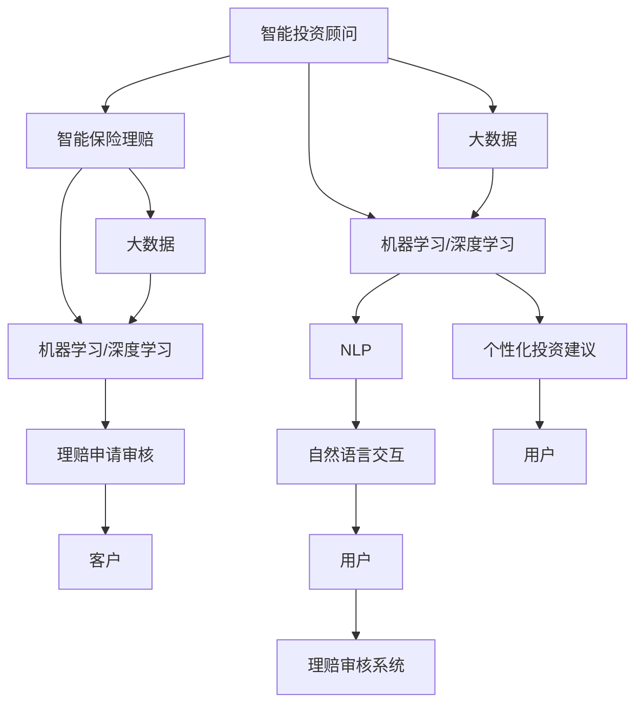

                 

# 未来的智能金融：2050年的AI投资顾问与智能保险理赔

## 1. 背景介绍

在2050年的未来社会，人工智能(AI)已经成为驱动全球经济的关键力量。金融行业作为经济的核心支柱，也将迎来革命性的变革。届时，智能投资顾问和智能保险理赔系统将成为人们日常生活中不可或缺的组成部分。本文将详细探讨2050年AI在金融领域的应用，特别是投资顾问和保险理赔，分析其核心概念、技术实现及未来发展趋势。

## 2. 核心概念与联系

### 2.1 核心概念概述

- **智能投资顾问**：基于AI技术的金融顾问，能够根据用户的财务状况、风险偏好和市场动态，提供个性化的投资建议和资产配置方案。
- **智能保险理赔**：利用AI技术进行保险理赔申请的自动审核和处理，快速响应客户需求，提高理赔效率和公平性。
- **大数据**：用于训练AI模型的大量结构化、非结构化数据，包括历史交易数据、市场新闻、用户行为等。
- **机器学习与深度学习**：构建智能系统核心的算法技术，能够自动学习并优化策略和决策。
- **自然语言处理(NLP)**：实现智能顾问与用户之间，理赔申请与审核系统之间的自然语言交互。
- **区块链**：用于构建透明、不可篡改的智能合约，确保交易和理赔的安全性。

这些概念通过一定的技术架构和算法实现相互连接，共同构成了未来智能金融的核心。

### 2.2 核心概念原理和架构的 Mermaid 流程图



这个流程图展示了智能投资顾问和智能保险理赔系统如何通过大数据、机器学习/深度学习、NLP等技术实现其核心功能。用户通过智能投资顾问获取个性化建议，而理赔申请则通过智能保险理赔系统自动审核和处理。

## 3. 核心算法原理 & 具体操作步骤

### 3.1 算法原理概述

#### 3.1.1 智能投资顾问

智能投资顾问的核心原理是利用历史数据和市场动态进行预测，为用户提供个性化的投资建议。其算法主要包括：

1. **回归分析**：用于预测股票价格、债券收益率等金融指标。
2. **时间序列分析**：处理市场数据的时间序列特征，预测未来走势。
3. **优化算法**：如遗传算法、模拟退火等，用于优化资产配置策略。
4. **强化学习**：通过试错学习，逐步优化投资策略。

#### 3.1.2 智能保险理赔

智能保险理赔的算法核心在于自然语言处理(NLP)和机器学习。具体步骤如下：

1. **文本分析**：通过NLP技术，从理赔申请中提取关键信息，如事故描述、损失金额等。
2. **图像识别**：对事故现场图片进行解析，辅助理解和判断理赔情况。
3. **机器学习分类**：使用分类算法，判断理赔申请的真假和合理性。
4. **回归分析**：预测理赔金额和处理时间，优化理赔流程。

### 3.2 算法步骤详解

#### 3.2.1 智能投资顾问

1. **数据准备**：收集历史交易数据、市场新闻、宏观经济指标等数据，构建训练集。
2. **模型训练**：使用回归分析、时间序列分析等算法，训练预测模型。
3. **优化策略**：应用优化算法，调整资产配置策略。
4. **个性化建议**：根据用户输入的信息和市场动态，输出个性化投资建议。

#### 3.2.2 智能保险理赔

1. **数据收集**：从理赔申请中提取文本和图像数据，构建训练集。
2. **模型训练**：使用NLP和图像识别技术，训练文本分析和图像解析模型。
3. **分类训练**：应用分类算法，训练理赔真假识别模型。
4. **回归预测**：使用回归分析，预测理赔金额和处理时间。
5. **系统集成**：将各模块集成到统一的理赔系统中，实现自动化处理。

### 3.3 算法优缺点

#### 3.3.1 智能投资顾问

优点：
- 提供个性化建议，提升用户体验。
- 自动优化资产配置，降低管理成本。
- 利用大数据和机器学习，准确预测市场走势。

缺点：
- 对数据依赖性强，数据质量影响模型效果。
- 模型需要定期更新，维护成本较高。
- 存在算法风险，如过度依赖历史数据。

#### 3.3.2 智能保险理赔

优点：
- 提高理赔处理效率，减少等待时间。
- 通过NLP和图像识别，提高理赔处理准确性。
- 实时监控理赔申请，快速响应异常情况。

缺点：
- 对NLP和图像处理技术要求高，技术门槛较高。
- 存在误判风险，需要人工审核辅助。
- 数据隐私和安全问题需要严格控制。

### 3.4 算法应用领域

智能投资顾问和智能保险理赔在金融领域中的应用广泛，具体如下：

- **智能投资顾问**：适用于个人和机构投资者，提供股票、基金、债券等投资建议。
- **智能保险理赔**：适用于各类保险公司，处理车险、家险、健康险等理赔申请。

## 4. 数学模型和公式 & 详细讲解 & 举例说明

### 4.1 数学模型构建

#### 4.1.1 回归分析模型

回归分析模型用于预测股票价格和债券收益率。以线性回归为例，模型公式为：

$$ y = \beta_0 + \beta_1 x_1 + \beta_2 x_2 + ... + \beta_n x_n + \epsilon $$

其中，$y$ 为预测值，$x_i$ 为自变量，$\beta_i$ 为回归系数，$\epsilon$ 为误差项。

#### 4.1.2 时间序列模型

时间序列模型处理市场数据的时间序列特征，预测未来走势。ARIMA模型（自回归积分滑动平均模型）的公式为：

$$ Y_t = c + \sum_{i=1}^p \phi_i Y_{t-i} + \sum_{j=1}^d B_j \epsilon_{t-j} + \epsilon_t $$

其中，$Y_t$ 为第$t$期的观测值，$\phi_i$ 为自回归系数，$B_j$ 为积分系数，$d$ 为差分阶数，$\epsilon_t$ 为随机误差项。

### 4.2 公式推导过程

#### 4.2.1 回归分析模型

1. **线性回归模型的推导**：
   - 最小二乘法求解回归系数：$\beta = (X^T X)^{-1} X^T y$
   - 预测值：$y' = \beta_0 + \beta_1 x_1 + \beta_2 x_2 + ... + \beta_n x_n$

2. **模型评估**：
   - 使用R方（$R^2$）和均方误差（MSE）评估模型性能。
   - $R^2 = 1 - \frac{\sum(y - \hat{y})^2}{\sum(y - \bar{y})^2}$
   - $MSE = \frac{\sum(y - \hat{y})^2}{n - p - 1}$

#### 4.2.2 时间序列模型

1. **ARIMA模型的推导**：
   - 模型参数估计：通过最小二乘法或最大似然估计求解模型参数。
   - 预测值计算：使用模型公式计算未来时间点的预测值。

2. **模型评估**：
   - 使用MAE（平均绝对误差）和RMSE（均方根误差）评估模型性能。
   - $MAE = \frac{1}{n} \sum|y_i - \hat{y}_i|$
   - $RMSE = \sqrt{\frac{1}{n} \sum(y_i - \hat{y}_i)^2}$

### 4.3 案例分析与讲解

#### 4.3.1 智能投资顾问

假设某投资顾问系统使用线性回归模型进行股票价格预测。

1. **数据收集**：收集过去一年的每日股价和相关市场数据。
2. **模型训练**：使用最小二乘法求解回归系数，构建预测模型。
3. **模型评估**：在测试集上计算R方和MSE，评估模型性能。
4. **个性化建议**：根据用户输入的财务状况和风险偏好，调整模型参数，输出投资建议。

#### 4.3.2 智能保险理赔

假设某理赔系统使用ARIMA模型进行理赔金额预测。

1. **数据收集**：从过去一年的理赔申请中提取时间序列数据。
2. **模型训练**：使用最小二乘法求解ARIMA模型参数，构建预测模型。
3. **模型评估**：在测试集上计算MAE和RMSE，评估模型性能。
4. **系统集成**：将预测模型集成到理赔系统中，实时处理理赔申请。

## 5. 项目实践：代码实例和详细解释说明

### 5.1 开发环境搭建

1. **编程语言**：Python
2. **库和框架**：Pandas、Numpy、Scikit-learn、TensorFlow、PyTorch、Keras
3. **开发工具**：Jupyter Notebook、PyCharm、VS Code

### 5.2 源代码详细实现

#### 5.2.1 智能投资顾问

```python
import pandas as pd
from sklearn.linear_model import LinearRegression
from sklearn.metrics import r2_score, mean_squared_error

# 数据准备
data = pd.read_csv('stock_prices.csv')
X = data[['feature1', 'feature2', ...]]
y = data['price']

# 模型训练
model = LinearRegression()
model.fit(X, y)

# 模型评估
y_pred = model.predict(X)
r2 = r2_score(y, y_pred)
mse = mean_squared_error(y, y_pred)

# 个性化建议
user_input = {'feature1': value1, 'feature2': value2, ...}
user_X = pd.DataFrame([user_input])
user_price = model.predict(user_X)
```

#### 5.2.2 智能保险理赔

```python
import pandas as pd
from statsmodels.tsa.arima_model import ARIMA
from sklearn.metrics import mean_absolute_error, mean_squared_error

# 数据准备
data = pd.read_csv('claims.csv')
X = data[['date', 'value']] # 时间序列数据
y = data['amount']

# 模型训练
model = ARIMA(X, order=(1, 1, 1))
model_fit = model.fit()

# 模型评估
y_pred = model_fit.forecast(steps=1)[0]
mae = mean_absolute_error(y, y_pred)
rmse = mean_squared_error(y, y_pred)**0.5

# 系统集成
claim_data = pd.read_csv('claim_data.csv')
claim_date = claim_data['date']
claim_amount = model_fit.forecast(steps=1, xobs=claim_date)[0]
```

### 5.3 代码解读与分析

#### 5.3.1 智能投资顾问

1. **数据准备**：使用Pandas读取CSV格式的数据文件，并从中提取特征和标签。
2. **模型训练**：使用Scikit-learn的LinearRegression模型进行线性回归训练。
3. **模型评估**：计算R方和MSE，评估模型性能。
4. **个性化建议**：根据用户输入的数据，使用训练好的模型进行预测。

#### 5.3.2 智能保险理赔

1. **数据准备**：使用Pandas读取CSV格式的数据文件，并从中提取时间序列数据。
2. **模型训练**：使用statsmodels的ARIMA模型进行时间序列预测训练。
3. **模型评估**：计算MAE和RMSE，评估模型性能。
4. **系统集成**：根据用户输入的时间数据，使用训练好的模型进行理赔金额预测。

### 5.4 运行结果展示

#### 5.4.1 智能投资顾问

- **数据准备**：检查数据文件，确保数据格式正确。
- **模型训练**：训练模型并记录回归系数和预测误差。
- **模型评估**：评估模型性能，输出R方和MSE。
- **个性化建议**：根据用户输入的数据，输出预测价格。

#### 5.4.2 智能保险理赔

- **数据准备**：检查数据文件，确保数据格式正确。
- **模型训练**：训练模型并记录ARIMA模型参数。
- **模型评估**：评估模型性能，输出MAE和RMSE。
- **系统集成**：根据用户输入的时间数据，输出预测理赔金额。

## 6. 实际应用场景

### 6.1 智能投资顾问

在未来的金融市场，智能投资顾问将无处不在。无论是个体投资者还是机构投资者，都可以通过智能顾问获取基于大数据和AI算法的投资建议。

**应用场景**：
- **个人投资者**：提供定制化的投资组合建议，优化资产配置，提高投资回报。
- **机构投资者**：优化资产配置策略，降低投资风险，提高整体收益。
- **量化交易**：基于AI算法进行高频交易，快速响应市场变化。

### 6.2 智能保险理赔

智能保险理赔系统将彻底改变传统理赔流程，提高理赔效率和公平性。

**应用场景**：
- **车险理赔**：自动审核事故描述和损失照片，快速处理理赔申请。
- **健康险理赔**：自动识别病历信息和医疗费用，简化理赔流程。
- **家庭险理赔**：自动审核理赔申请，及时响应客户需求。

## 7. 工具和资源推荐

### 7.1 学习资源推荐

1. **《Python for Data Science》**：本书介绍了使用Python进行数据科学分析的基本技巧，包括Pandas、Numpy、Scikit-learn等库的使用。
2. **《深度学习》（Ian Goodfellow）**：全面介绍深度学习理论和技术，涵盖回归分析、时间序列分析等关键算法。
3. **Coursera的《机器学习》课程**：由Andrew Ng教授主讲，介绍机器学习的基本原理和应用。
4. **Kaggle**：数据科学竞赛平台，提供大量真实数据和竞赛任务，帮助学习者提升实战能力。
5. **NLP书籍**：如《自然语言处理综论》、《深度学习中的自然语言处理》，深入介绍NLP理论和实践。

### 7.2 开发工具推荐

1. **Jupyter Notebook**：轻量级笔记本环境，支持Python、R等语言，方便代码编写和数据可视化。
2. **PyCharm**：功能强大的Python IDE，支持代码调试、测试、部署等。
3. **VS Code**：轻量级且功能丰富的代码编辑器，支持多种编程语言和插件。
4. **TensorBoard**：可视化工具，用于监控和调试模型训练过程。
5. **Weights & Biases**：实验跟踪工具，记录和分析模型性能和超参数。

### 7.3 相关论文推荐

1. **《金融时间序列分析与预测》**：介绍金融时间序列分析的基本方法和应用。
2. **《机器学习在金融中的应用》**：综述机器学习在金融领域的多种应用，包括投资建议、风险评估等。
3. **《深度学习在NLP中的应用》**：介绍深度学习在自然语言处理中的各种算法和技术。
4. **《智能保险理赔系统》**：研究智能理赔系统的设计和实现方法，提高理赔效率和公平性。
5. **《智能投资顾问系统》**：介绍智能投资顾问系统的核心算法和应用场景，优化投资决策。

## 8. 总结：未来发展趋势与挑战

### 8.1 研究成果总结

未来金融领域的AI应用将以智能投资顾问和智能保险理赔为代表，通过大数据、机器学习和深度学习等技术，提升金融服务的智能化和自动化水平。具体而言：

1. **智能投资顾问**：基于历史数据和市场动态，提供个性化投资建议，优化资产配置策略，提高投资回报。
2. **智能保险理赔**：利用NLP和图像识别技术，自动审核理赔申请，提高理赔效率和公平性。
3. **金融产品创新**：开发基于AI算法的金融产品，如智能投顾、智能合约等，提升金融服务的智能化水平。

### 8.2 未来发展趋势

未来智能金融的发展趋势包括：

1. **个性化服务**：智能投资顾问和智能保险理赔将提供更加个性化的服务，提升用户体验。
2. **自动化决策**：AI算法将实现更多的自动化决策，降低人工操作成本，提高效率。
3. **实时响应**：智能系统能够实时响应市场变化，提供动态化的投资和理赔建议。
4. **数据驱动**：通过大数据分析，优化金融决策和产品设计，提升市场竞争力。
5. **跨领域融合**：AI技术与金融领域深度融合，推动金融与科技、保险、医疗等行业的协同发展。

### 8.3 面临的挑战

尽管AI在金融领域的应用前景广阔，但也面临着诸多挑战：

1. **数据隐私和安全**：AI系统依赖大量数据，如何保护用户隐私和数据安全，防止数据泄露和滥用，是一个重要问题。
2. **模型可解释性**：AI模型往往是“黑盒”系统，难以解释其决策过程，对于金融等高风险领域，模型的可解释性尤为重要。
3. **技术门槛**：AI技术的应用需要较高的技术门槛，如何降低门槛，提高易用性，是普及AI应用的关键。
4. **算法风险**：AI算法可能存在偏见和误判，如何确保算法的公正性和可靠性，是一个重要课题。
5. **法规和标准**：金融领域存在严格的监管要求，AI系统需要符合相关法规和标准，如何构建合规的AI系统，是重要挑战。

### 8.4 研究展望

未来AI在金融领域的研究方向包括：

1. **模型可解释性**：开发可解释性强的AI模型，提高系统的透明度和可信度。
2. **数据隐私保护**：研究数据隐私保护技术，确保用户数据的安全。
3. **跨领域融合**：探索AI与其他领域的深度融合，提升金融服务的综合性和多样性。
4. **技术普及**：推动AI技术的普及和应用，降低技术门槛，提高易用性。
5. **法规和标准**：参与金融领域的法规和标准制定，构建合规的AI应用环境。

## 9. 附录：常见问题与解答

### 9.1 问题1：如何选择合适的投资顾问系统？

**解答**：
选择投资顾问系统时，应考虑以下因素：
- **数据来源**：系统的数据来源是否丰富，是否涵盖历史交易数据、市场新闻等。
- **算法模型**：系统的算法模型是否先进，是否能够提供个性化的投资建议。
- **用户体验**：系统的用户体验是否友好，是否能够提供实时反馈和个性化推荐。
- **性能评估**：系统的性能评估是否透明，是否能够提供R方、MSE等指标。

### 9.2 问题2：智能保险理赔系统如何处理复杂理赔申请？

**解答**：
智能保险理赔系统处理复杂理赔申请时，通常采用以下步骤：
- **文本分析**：通过NLP技术，提取理赔申请中的关键信息，如事故描述、损失金额等。
- **图像识别**：对事故现场图片进行解析，辅助理解和判断理赔情况。
- **专家审核**：当系统无法准确判断时，引入人工专家进行审核，确保理赔的公平性和准确性。
- **异常处理**：对于异常申请，如欺诈行为，系统应能够及时发现并采取措施。

### 9.3 问题3：AI系统在金融领域的安全性如何保障？

**解答**：
AI系统在金融领域的安全性保障需要多层次措施：
- **数据加密**：对用户数据进行加密存储和传输，防止数据泄露。
- **模型监控**：实时监控模型的行为，及时发现异常和错误。
- **审计和审计**：定期进行系统审计，确保系统的合规性和安全性。
- **合规性检查**：确保系统符合相关法规和标准，防止违法行为。

### 9.4 问题4：未来智能金融的发展前景如何？

**解答**：
未来智能金融的发展前景非常广阔，主要体现在以下几个方面：
- **市场竞争力**：AI技术能够大幅提升金融服务的智能化和自动化水平，提高市场竞争力。
- **用户体验**：通过个性化的服务和智能化的决策，提升用户体验，增加客户粘性。
- **风险控制**：AI系统能够实时监控和评估风险，提高风险控制能力，降低金融风险。
- **合规性**：AI系统能够符合金融监管要求，构建合规的金融服务环境。

总之，未来智能金融的发展将为金融行业带来革命性的变化，推动金融服务向智能化、自动化、实时化方向发展，为全球经济的数字化转型注入新的动力。

---

作者：禅与计算机程序设计艺术 / Zen and the Art of Computer Programming

