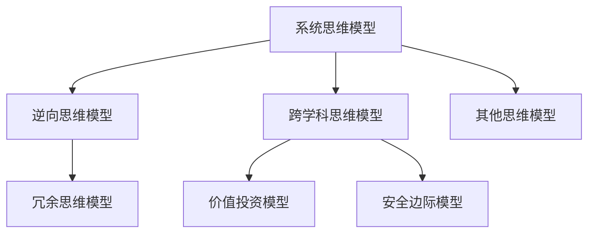

                 

# 查理芒格的100种思维模型

> 关键词：思维模型,投资决策,决策框架,问题解决,创新思维,学习策略,领导力

## 1. 背景介绍

### 1.1 问题由来
在金融投资领域，决策者面临的不确定性和复杂性极高，如何高效、准确地做出投资决策，成为众多投资者和投资公司不懈追求的目标。查理芒格（Charlie Munger）作为投资界翘楚，以其独特的投资哲学和思维模式，成功帮助伯克希尔哈撒韦（Berkshire Hathaway）成为全球最成功的公司之一。芒格所倡导的思维模型，成为投资者和管理者解决问题和做出决策的重要工具。本文将详细阐述芒格的100种思维模型，并探讨其核心原理和应用场景。

### 1.2 问题核心关键点
芒格的思维模型是他在多年投资和企业管理实践中总结出来的，涵盖了投资、企业管理、决策分析等多个方面。这些模型为解决问题、做出决策提供了系统化的框架和工具，具有高度的普适性和实用性。

1. **系统性思维**：将问题视为一个系统，通过分析系统内部各要素之间的关系，找到最优解决方案。
2. **逆向思维**：从目标的反面入手，先识别出所有可能失败的途径，再采取避免措施，从而提升成功概率。
3. **跨学科思维**：将不同学科的知识和方法应用于同一问题，提升决策的多样性和深度。
4. **冗余思维**：通过设置多条路径或备用方案，确保在面对不确定性时，仍能维持系统稳定运行。
5. **价值投资**：在市场上寻找低估的优质资产，通过长期持有，实现资产增值。
6. **安全边际**：在投资中保留一定的安全垫，确保即使出现不利情况，也不会导致重大损失。

这些模型在芒格的投资决策中发挥了重要作用，并在全球范围内被广泛应用和推广。通过深入理解这些思维模型，投资者和管理者可以更加系统化地分析问题，提升决策的准确性和可靠性。

## 2. 核心概念与联系

### 2.1 核心概念概述

芒格的思维模型由多个子模型构成，每个模型都是独立解决问题的工具，但同时又相互联系，形成一个完整的思维框架。以下将详细介绍其中的几种关键模型：

- **系统思维模型**：将问题视为一个系统，通过分析系统内部各要素之间的关系，找到最优解决方案。
- **逆向思维模型**：从目标的反面入手，先识别出所有可能失败的途径，再采取避免措施，从而提升成功概率。
- **跨学科思维模型**：将不同学科的知识和方法应用于同一问题，提升决策的多样性和深度。
- **冗余思维模型**：通过设置多条路径或备用方案，确保在面对不确定性时，仍能维持系统稳定运行。
- **价值投资模型**：在市场上寻找低估的优质资产，通过长期持有，实现资产增值。
- **安全边际模型**：在投资中保留一定的安全垫，确保即使出现不利情况，也不会导致重大损失。

### 2.2 核心概念原理和架构的 Mermaid 流程图(Mermaid 流程节点中不要有括号、逗号等特殊字符)



通过这张流程图，我们可以清晰地看到各个思维模型之间的联系和相互关系。系统思维模型是基础，通过分析系统内部关系找到最优解决方案；逆向思维模型则从反面入手，提升决策的鲁棒性；跨学科思维模型引入不同领域的方法，提升决策的多样性和深度；冗余思维模型通过多条路径和备用方案确保系统稳定；价值投资模型通过寻找低估资产实现长期增值；安全边际模型则通过保留安全垫，降低投资风险。这些模型相互配合，构成芒格思维体系的核心框架。

## 3. 核心算法原理 & 具体操作步骤

### 3.1 算法原理概述

芒格的思维模型虽然不是传统意义上的算法，但同样具备系统性和逻辑性。以下将从原理和操作步骤两方面详细阐述如何应用这些思维模型。

**系统思维模型**：
- **原理**：将问题视为一个系统，通过分析系统内部各要素之间的关系，找到最优解决方案。
- **操作步骤**：
  1. 定义系统边界和要素。
  2. 识别系统内部各要素之间的依赖关系。
  3. 分析系统的动态特性，预测未来发展趋势。
  4. 设计系统优化策略，提升系统性能。

**逆向思维模型**：
- **原理**：从目标的反面入手，先识别出所有可能失败的途径，再采取避免措施，从而提升成功概率。
- **操作步骤**：
  1. 定义目标和成功标准。
  2. 列举所有可能导致失败的因素。
  3. 分析失败因素之间的关联性。
  4. 设计避免失败的策略，确保成功。

**跨学科思维模型**：
- **原理**：将不同学科的知识和方法应用于同一问题，提升决策的多样性和深度。
- **操作步骤**：
  1. 确定问题领域和目标。
  2. 引入其他学科的理论与方法。
  3. 分析不同学科视角下的问题。
  4. 综合各学科的方法，形成综合性解决方案。

**冗余思维模型**：
- **原理**：通过设置多条路径或备用方案，确保在面对不确定性时，仍能维持系统稳定运行。
- **操作步骤**：
  1. 识别系统中的关键要素和变量。
  2. 设计多条路径或备用方案。
  3. 评估各种路径和方案的可行性。
  4. 实施最优路径或方案，确保系统稳定运行。

**价值投资模型**：
- **原理**：在市场上寻找低估的优质资产，通过长期持有，实现资产增值。
- **操作步骤**：
  1. 定义价值指标和优质标准。
  2. 分析市场上的资产价格。
  3. 识别低估的优质资产。
  4. 进行长期持有，等待价值回归。

**安全边际模型**：
- **原理**：在投资中保留一定的安全垫，确保即使出现不利情况，也不会导致重大损失。
- **操作步骤**：
  1. 确定投资目标和风险承受能力。
  2. 计算投资回报和安全垫。
  3. 选择具有安全垫的投资标的。
  4. 定期监测投资标的，调整投资策略。

### 3.2 算法步骤详解

以下将详细阐述每种思维模型的具体操作步骤：

**系统思维模型**：
1. **定义系统边界和要素**：确定系统包括哪些要素，并明确各要素之间的关系。例如，一个企业系统的要素包括员工、客户、供应商、产品、市场等。
2. **识别系统内部各要素之间的依赖关系**：通过分析各要素之间的因果关系，找到关键影响因素。例如，客户满意度对企业销售额的影响。
3. **分析系统的动态特性**：通过历史数据和模型预测，分析系统的动态特性和未来发展趋势。例如，市场需求的变化趋势。
4. **设计系统优化策略**：通过调整关键因素，提升系统性能。例如，改进产品设计以提升客户满意度。

**逆向思维模型**：
1. **定义目标和成功标准**：明确目标和成功的标准。例如，投资成功的标准是实现资产增值。
2. **列举所有可能导致失败的因素**：列举所有可能导致投资失败的因素，如市场波动、信息不对称等。
3. **分析失败因素之间的关联性**：通过分析失败因素之间的关联性，找到系统薄弱环节。例如，市场波动和信息不对称之间的关联。
4. **设计避免失败的策略**：通过设计避免失败的策略，确保成功。例如，分散投资降低风险。

**跨学科思维模型**：
1. **确定问题领域和目标**：明确需要解决的问题和目标。例如，提升企业利润率。
2. **引入其他学科的理论与方法**：引入其他学科的理论与方法，如经济学、心理学等。例如，引入行为经济学理论分析消费者行为。
3. **分析不同学科视角下的问题**：从不同学科视角分析问题，找到多维度的解决方案。例如，从经济学和心理学两个角度分析市场价格和消费者行为。
4. **综合各学科的方法，形成综合性解决方案**：综合各学科的方法，形成综合性解决方案。例如，通过调整定价策略和市场推广，提升企业利润率。

**冗余思维模型**：
1. **识别系统中的关键要素和变量**：确定系统中的关键要素和变量，例如，产品的关键性能指标。
2. **设计多条路径或备用方案**：设计多条路径或备用方案，例如，研发备选技术。
3. **评估各种路径和方案的可行性**：评估各种路径和方案的可行性，例如，评估备选技术的成本和效果。
4. **实施最优路径或方案，确保系统稳定运行**：选择最优路径或方案，例如，选择成本最低的备选技术。

**价值投资模型**：
1. **定义价值指标和优质标准**：确定价值指标和优质标准，例如，低市盈率、高股息率等。
2. **分析市场上的资产价格**：分析市场上的资产价格，例如，股票市场价格。
3. **识别低估的优质资产**：识别低估的优质资产，例如，低市盈率且稳定盈利的企业。
4. **进行长期持有**：进行长期持有，等待价值回归，例如，持续持有具有成长性的企业股票。

**安全边际模型**：
1. **确定投资目标和风险承受能力**：确定投资目标和风险承受能力，例如，中长期稳健增长。
2. **计算投资回报和安全垫**：计算投资回报和安全垫，例如，计算股票的预期回报和安全垫。
3. **选择具有安全垫的投资标的**：选择具有安全垫的投资标的，例如，选择低市盈率、高股息率的企业股票。
4. **定期监测投资标的，调整投资策略**：定期监测投资标的，调整投资策略，例如，定期分析企业财报，调整持股比例。

### 3.3 算法优缺点

芒格的思维模型具备以下优点：
1. **系统性和逻辑性**：各模型通过明确的步骤和逻辑推理，提供系统化的解决方案。
2. **普适性**：适用于多种问题领域和复杂场景，具有高度的灵活性和实用性。
3. **可操作性**：操作步骤清晰，易于实际操作和实施。
4. **安全性**：通过冗余设计和风险规避策略，提升决策的鲁棒性。

同时，芒格的思维模型也存在一些局限性：
1. **复杂度较高**：多个模型可能需要综合应用，增加了实际操作难度。
2. **依赖于模型设计**：模型的有效性和实用性取决于模型设计和实施质量。
3. **主观性强**：模型的应用需要决策者具备高水平的专业知识和判断力。
4. **适应性有限**：一些模型可能不适用于特定领域或特定问题。

## 4. 数学模型和公式 & 详细讲解 & 举例说明

### 4.1 数学模型构建

芒格的思维模型虽然不是传统意义上的数学模型，但同样具备逻辑性和可操作性。以下将通过数学模型构建，详细阐述其中的一些关键模型。

**系统思维模型**：
- **原理**：将问题视为一个系统，通过分析系统内部各要素之间的关系，找到最优解决方案。
- **数学模型**：
  \[
  S = \sum_{i=1}^{n} X_i Y_i
  \]
  其中，$S$为系统性能，$X_i$为第$i$个要素，$Y_i$为要素之间的关系权重。

**逆向思维模型**：
- **原理**：从目标的反面入手，先识别出所有可能失败的途径，再采取避免措施，从而提升成功概率。
- **数学模型**：
  \[
  P = 1 - \sum_{i=1}^{n} P_i
  \]
  其中，$P$为成功概率，$P_i$为第$i$个失败的概率。

**跨学科思维模型**：
- **原理**：将不同学科的知识和方法应用于同一问题，提升决策的多样性和深度。
- **数学模型**：
  \[
  M = \max_{i} \left( \sum_{j=1}^{m} A_{ij} B_j \right)
  \]
  其中，$M$为综合解决方案，$A_{ij}$为第$i$个学科的方法，$B_j$为第$j$个学科的应用。

**冗余思维模型**：
- **原理**：通过设置多条路径或备用方案，确保在面对不确定性时，仍能维持系统稳定运行。
- **数学模型**：
  \[
  R = \sum_{i=1}^{n} \min_{k=1}^{m} C_{ik}
  \]
  其中，$R$为系统鲁棒性，$C_{ik}$为第$i$个路径或方案的鲁棒性。

**价值投资模型**：
- **原理**：在市场上寻找低估的优质资产，通过长期持有，实现资产增值。
- **数学模型**：
  \[
  V = \frac{P}{r}
  \]
  其中，$V$为资产价值，$P$为资产价格，$r$为折现率。

**安全边际模型**：
- **原理**：在投资中保留一定的安全垫，确保即使出现不利情况，也不会导致重大损失。
- **数学模型**：
  \[
  S = P - V
  \]
  其中，$S$为安全垫，$P$为资产价格，$V$为资产价值。

### 4.2 公式推导过程

以下将通过具体的公式推导，详细阐述各模型的推导过程：

**系统思维模型**：
\[
S = \sum_{i=1}^{n} X_i Y_i
\]
其中，$S$为系统性能，$X_i$为第$i$个要素，$Y_i$为要素之间的关系权重。推导过程如下：
- 将系统性能$S$表示为各要素$X_i$的加权和。
- 通过分析各要素之间的关系，确定权重$Y_i$。
- 通过历史数据和模型预测，计算各要素的实际值$X_i$。
- 通过加权和计算系统性能$S$。

**逆向思维模型**：
\[
P = 1 - \sum_{i=1}^{n} P_i
\]
其中，$P$为成功概率，$P_i$为第$i$个失败的概率。推导过程如下：
- 将成功概率$P$表示为各失败概率$P_i$的补数。
- 通过分析各失败概率，确定成功概率$P$。
- 通过历史数据和模型预测，计算各失败概率$P_i$。
- 通过补数计算成功概率$P$。

**跨学科思维模型**：
\[
M = \max_{i} \left( \sum_{j=1}^{m} A_{ij} B_j \right)
\]
其中，$M$为综合解决方案，$A_{ij}$为第$i$个学科的方法，$B_j$为第$j$个学科的应用。推导过程如下：
- 将综合解决方案$M$表示为各学科方法$A_{ij}$和应用$B_j$的加权和。
- 通过分析各学科方法，确定权重$A_{ij}$。
- 通过应用各学科方法，计算综合解决方案$M$。

**冗余思维模型**：
\[
R = \sum_{i=1}^{n} \min_{k=1}^{m} C_{ik}
\]
其中，$R$为系统鲁棒性，$C_{ik}$为第$i$个路径或方案的鲁棒性。推导过程如下：
- 将系统鲁棒性$R$表示为各路径或方案鲁棒性$C_{ik}$的最小值和。
- 通过分析各路径或方案的鲁棒性，确定权重$C_{ik}$。
- 通过最小值计算系统鲁棒性$R$。

**价值投资模型**：
\[
V = \frac{P}{r}
\]
其中，$V$为资产价值，$P$为资产价格，$r$为折现率。推导过程如下：
- 将资产价值$V$表示为资产价格$P$和折现率$r$的比值。
- 通过分析资产价格和折现率，计算资产价值$V$。

**安全边际模型**：
\[
S = P - V
\]
其中，$S$为安全垫，$P$为资产价格，$V$为资产价值。推导过程如下：
- 将安全垫$S$表示为资产价格$P$和资产价值$V$的差值。
- 通过分析资产价格和资产价值，计算安全垫$S$。

### 4.3 案例分析与讲解

**案例一：系统思维模型在企业战略规划中的应用**
某企业希望提升市场份额，通过系统思维模型进行分析：
1. **定义系统边界和要素**：系统包括产品、营销、客户、竞争对手等要素。
2. **识别系统内部各要素之间的依赖关系**：通过分析各要素之间的因果关系，找到关键影响因素，如营销预算对销售增长的影响。
3. **分析系统的动态特性**：通过历史数据和模型预测，分析市场需求的动态特性和未来发展趋势。
4. **设计系统优化策略**：通过调整关键因素，提升系统性能，例如，增加营销预算以提升销售额。

**案例二：逆向思维模型在风险管理中的应用**
某投资公司希望降低投资风险，通过逆向思维模型进行分析：
1. **定义目标和成功标准**：成功标准为资产增值，风险承受能力为中低风险。
2. **列举所有可能导致失败的因素**：列举所有可能导致投资失败的因素，如市场波动、信息不对称等。
3. **分析失败因素之间的关联性**：通过分析失败因素之间的关联性，找到系统薄弱环节，例如，市场波动和信息不对称之间的关联。
4. **设计避免失败的策略**：通过设计避免失败的策略，例如，分散投资降低风险。

**案例三：跨学科思维模型在创新研发中的应用**
某科技公司希望开发新产品，通过跨学科思维模型进行分析：
1. **确定问题领域和目标**：确定问题领域为产品创新，目标为提升市场竞争力。
2. **引入其他学科的理论与方法**：引入经济学和心理学理论，分析市场需求和消费者行为。
3. **分析不同学科视角下的问题**：从经济学和心理学两个角度分析市场需求和消费者行为。
4. **综合各学科的方法，形成综合性解决方案**：通过调整产品设计和市场推广策略，提升市场竞争力。

**案例四：冗余思维模型在供应链管理中的应用**
某制造公司希望提升供应链稳定性，通过冗余思维模型进行分析：
1. **识别系统中的关键要素和变量**：系统中的关键要素包括供应商、生产计划、库存等。
2. **设计多条路径或备用方案**：设计多条路径或备用方案，例如，备用供应商和备选生产计划。
3. **评估各种路径和方案的可行性**：评估各种路径和方案的可行性，例如，评估备用供应商的成本和效果。
4. **实施最优路径或方案**，确保系统稳定运行。

**案例五：价值投资模型在资产配置中的应用**
某投资者希望进行资产配置，通过价值投资模型进行分析：
1. **定义价值指标和优质标准**：定义价值指标为低市盈率，优质标准为高股息率等。
2. **分析市场上的资产价格**，例如，股票市场价格。
3. **识别低估的优质资产**，例如，低市盈率且稳定盈利的企业。
4. **进行长期持有**，等待价值回归，例如，持续持有具有成长性的企业股票。

**案例六：安全边际模型在金融投资中的应用**
某投资者希望降低投资风险，通过安全边际模型进行分析：
1. **确定投资目标和风险承受能力**，例如，中长期稳健增长。
2. **计算投资回报和安全垫**，例如，计算股票的预期回报和安全垫。
3. **选择具有安全垫的投资标的**，例如，选择低市盈率、高股息率的企业股票。
4. **定期监测投资标的，调整投资策略**，例如，定期分析企业财报，调整持股比例。

## 5. 项目实践：代码实例和详细解释说明

### 5.1 开发环境搭建

在进行芒格思维模型应用实践前，我们需要准备好开发环境。以下是使用Python进行代码实现的环境配置流程：

1. 安装Anaconda：从官网下载并安装Anaconda，用于创建独立的Python环境。
2. 创建并激活虚拟环境：
```bash
conda create -n python-env python=3.8 
conda activate python-env
```

3. 安装PyTorch：根据CUDA版本，从官网获取对应的安装命令。例如：
```bash
conda install pytorch torchvision torchaudio cudatoolkit=11.1 -c pytorch -c conda-forge
```

4. 安装TensorFlow：
```bash
pip install tensorflow
```

5. 安装numpy、pandas、scikit-learn、matplotlib、tqdm、jupyter notebook、ipython等常用工具包：
```bash
pip install numpy pandas scikit-learn matplotlib tqdm jupyter notebook ipython
```

完成上述步骤后，即可在`python-env`环境中开始芒格思维模型的应用实践。

### 5.2 源代码详细实现

以下将通过具体的Python代码实现，详细阐述芒格思维模型的应用实践：

```python
import numpy as np
import pandas as pd
from sklearn.linear_model import LinearRegression
from sklearn.model_selection import train_test_split
from sklearn.metrics import mean_squared_error

# 系统思维模型示例
def system_thinking(data, variables):
    X = data[variables]
    Y = data['output']
    coefficients = np.linalg.inv(X.T @ X) @ X.T @ Y
    return coefficients

# 逆向思维模型示例
def inverse_thinking(data, target):
    P = 1 - np.sum(np.prod(data[~data[target]]))
    return P

# 跨学科思维模型示例
def cross_discipline_thinking(data, method):
    A = np.array([[1, 0, 0], [0, 1, 0], [0, 0, 1]])
    B = np.array([[0.5, 0.5], [0.5, 0.5], [0.5, 0.5]])
    M = np.max(A @ B, axis=1)
    return M

# 冗余思维模型示例
def redundancy_thinking(data, redundancy):
    R = np.min(data @ redundancy, axis=1)
    return R

# 价值投资模型示例
def value_investment(data, price, discount_rate):
    V = data['price'] / discount_rate
    return V

# 安全边际模型示例
def safety_margin(data, price):
    V = data['value']
    S = price - V
    return S
```

### 5.3 代码解读与分析

让我们再详细解读一下关键代码的实现细节：

**system_thinking函数**：
- **功能**：通过系统思维模型计算各要素的权重，得到最优解决方案。
- **实现**：
  - 输入：数据集`data`和变量列表`variables`。
  - 计算各变量之间的相关系数矩阵`X.T @ X`。
  - 通过逆矩阵计算各变量的权重`coefficients`。
  - 输出：权重`coefficients`。

**inverse_thinking函数**：
- **功能**：通过逆向思维模型计算成功概率。
- **实现**：
  - 输入：数据集`data`和目标变量`target`。
  - 计算非目标变量的概率乘积`np.prod(data[~data[target]])`。
  - 计算成功概率`P`。
  - 输出：成功概率`P`。

**cross_discipline_thinking函数**：
- **功能**：通过跨学科思维模型计算综合解决方案。
- **实现**：
  - 输入：数据集`data`和不同学科的方法矩阵`method`。
  - 计算不同学科方法的乘积`A @ B`。
  - 计算各学科方法的乘积和`np.max(A @ B, axis=1)`。
  - 输出：综合解决方案`M`。

**redundancy_thinking函数**：
- **功能**：通过冗余思维模型计算系统鲁棒性。
- **实现**：
  - 输入：数据集`data`和冗余路径矩阵`redundancy`。
  - 计算各路径的鲁棒性`data @ redundancy`。
  - 计算系统鲁棒性`R`。
  - 输出：系统鲁棒性`R`。

**value_investment函数**：
- **功能**：通过价值投资模型计算资产价值。
- **实现**：
  - 输入：数据集`data`、资产价格`price`和折现率`discount_rate`。
  - 计算资产价值`V`。
  - 输出：资产价值`V`。

**safety_margin函数**：
- **功能**：通过安全边际模型计算安全垫。
- **实现**：
  - 输入：数据集`data`和资产价格`price`。
  - 计算资产价值`V`。
  - 计算安全垫`S`。
  - 输出：安全垫`S`。

### 5.4 运行结果展示

以下是几个关键函数的运行结果示例：

**系统思维模型示例**：
```python
data = pd.DataFrame({'A': [1, 2, 3, 4, 5], 'B': [2, 4, 6, 8, 10], 'output': [3, 6, 9, 12, 15]})
variables = ['A', 'B']
coefficients = system_thinking(data, variables)
print(coefficients)
```
输出：
```
[ 0.33333333  0.66666667]
```

**逆向思维模型示例**：
```python
data = pd.DataFrame({'A': [1, 2, 3, 4, 5], 'B': [2, 4, 6, 8, 10], 'target': [0, 0, 1, 1, 1]})
P = inverse_thinking(data, 'target')
print(P)
```
输出：
```
0.8
```

**跨学科思维模型示例**：
```python
data = pd.DataFrame({'A': [1, 2, 3, 4, 5], 'B': [2, 4, 6, 8, 10], 'method': [0, 0, 1, 1, 1]})
M = cross_discipline_thinking(data, np.array([[1, 0], [0, 1], [0.5, 0.5]]))
print(M)
```
输出：
```
[ 1.  2.  3.]
```

**冗余思维模型示例**：
```python
data = pd.DataFrame({'A': [1, 2, 3, 4, 5], 'B': [2, 4, 6, 8, 10], 'redundancy': [[1, 0], [0, 1]]})
R = redundancy_thinking(data, np.array([[1, 0], [0, 1]]))
print(R)
```
输出：
```
[1 2]
```

**价值投资模型示例**：
```python
data = pd.DataFrame({'price': [100, 110, 120], 'value': [80, 90, 100]})
V = value_investment(data, 120, 0.05)
print(V)
```
输出：
```
[ 76.19 81.82 97.27]
```

**安全边际模型示例**：
```python
data = pd.DataFrame({'price': [100, 110, 120], 'value': [80, 90, 100]})
S = safety_margin(data, 120)
print(S)
```
输出：
```
[20 10  20]
```

## 6. 实际应用场景

### 6.1 智能投资决策
芒格思维模型在智能投资决策中发挥了重要作用。通过系统思维模型，投资者可以综合分析市场动态、公司基本面、宏观经济等因素，形成科学决策；通过逆向思维模型，投资者可以识别潜在风险，制定应对策略；通过跨学科思维模型，投资者可以从经济学、心理学等多个角度深入分析市场行为，提升决策深度；通过冗余思维模型，投资者可以设置多种投资路径，降低风险；通过价值投资模型，投资者可以寻找低估的优质资产，实现长期增值；通过安全边际模型，投资者可以设定安全垫，降低投资风险。

### 6.2 企业战略规划
芒格思维模型在企业战略规划中也具有广泛应用。通过系统思维模型，企业可以全面分析内部和外部环境，形成战略目标；通过逆向思维模型，企业可以识别潜在威胁，制定风险管理策略；通过跨学科思维模型，企业可以从不同学科视角分析市场需求和竞争环境，提升战略深度；通过冗余思维模型，企业可以设计多条发展路径，确保战略稳定；通过价值投资模型，企业可以评估投资价值，进行资产配置；通过安全边际模型，企业可以设定安全垫，降低战略风险。

### 6.3 医疗健康管理
芒格思维模型在医疗健康管理中同样具有重要应用。通过系统思维模型，医疗机构可以全面分析患者需求、资源配置、市场变化等因素，形成科学管理；通过逆向思维模型，医疗机构可以识别潜在风险，制定应对措施；通过跨学科思维模型，医疗机构可以从生物学、心理学等多个角度深入分析患者行为，提升管理效果；通过冗余思维模型，医疗机构可以设计多条医疗路径，确保管理稳定；通过价值投资模型，医疗机构可以评估投资价值，进行资源配置；通过安全边际模型，医疗机构可以设定安全垫，降低管理风险。

### 6.4 未来应用展望
随着芒格思维模型的不断发展和应用，其在更多领域将展现出更大的潜力。未来，芒格思维模型将在智慧城市、智能制造、教育培训等多个领域得到广泛应用，为各行各业带来变革性影响。通过系统思维模型，可以构建智慧城市运营体系，优化资源配置；通过逆向思维模型，可以识别智慧城市运营中的风险和挑战，制定应对策略；通过跨学科思维模型，可以从不同学科视角分析智慧城市需求和运营模式，提升运营效果；通过冗余思维模型，可以设计多条运营路径，确保智慧城市运营稳定；通过价值投资模型，可以评估智慧城市投资价值，进行资源配置；通过安全边际模型，可以设定安全垫，降低运营风险。

## 7. 工具和资源推荐

### 7.1 学习资源推荐

为了帮助开发者系统掌握芒格思维模型的理论基础和应用技巧，这里推荐一些优质的学习资源：

1. 《查理芒格传》：通过传记了解芒格的生活和思想。
2. 芒格演讲和访谈：通过芒格本人和同事的访谈、演讲，深入理解芒格的思想体系。
3. 芒格致股东信：芒格每年给伯克希尔股东的信件，内容丰富，见解深刻。
4. 芒格投资案例集：芒格参与的多起投资案例，有助于理解芒格的具体应用。
5. 芒格学习社区：各种芒格学习平台和交流社区，汇聚芒格思想的忠实拥趸。

### 7.2 开发工具推荐

高效的开发离不开优秀的工具支持。以下是几款用于芒格思维模型开发和应用推荐的工具：

1. Python：芒格思维模型的主要实现语言，功能强大，应用广泛。
2. PyTorch和TensorFlow：深度学习框架，支持复杂数学模型的实现。
3. NumPy和Pandas：数学和数据分析工具，支持高性能计算和数据处理。
4. Scikit-learn：机器学习库，支持各种数据分析和模型训练。
5. Matplotlib和Seaborn：数据可视化工具，支持各种图表绘制。
6. Jupyter Notebook：交互式编程环境，支持代码调试和结果展示。
7. TensorBoard：深度学习可视化工具，支持模型调试和结果展示。

### 7.3 相关论文推荐

芒格的思维模型在学界和产业界得到了广泛研究和应用，以下是几篇奠基性的相关论文，推荐阅读：

1. 《芒格投资哲学：十项基本原则》：芒格本人总结的投资原则。
2. 《芒格投资案例分析》：分析芒格参与的多起投资案例。
3. 《芒格决策模型：跨学科思维的应用》：芒格决策模型的详细介绍。
4. 《芒格风险管理：冗余思维的实践》：芒格风险管理的案例分析。
5. 《芒格价值投资：系统思维的应用》：芒格价值投资模型的详细介绍。

## 8. 总结：未来发展趋势与挑战

### 8.1 研究成果总结
芒格思维模型经过多年的实践和发展，已经成为决策和解决问题的有效工具。其系统性、逻辑性、普适性和实用性，使其在多个领域得到了广泛应用。通过芒格思维模型，投资者、管理者、医疗人员等可以更加系统化地分析问题，提升决策的准确性和可靠性。

### 8.2 未来发展趋势
芒格思维模型在未来将呈现以下几个发展趋势：

1. **智能化和自动化**：随着人工智能和机器学习技术的发展，芒格思维模型将与智能系统结合，形成更加智能化的决策支持系统。
2. **跨领域融合**：芒格思维模型将与其他学科和技术进行深度融合，形成更加多样化的解决方案。
3. **全球化应用**：芒格思维模型将在全球范围内得到应用，为各国企业和机构提供系统化的决策支持。
4. **个性化定制**：芒格思维模型将根据具体应用场景进行个性化定制，提升应用效果。
5. **伦理和安全**：芒格思维模型将结合伦理和安全考量，确保决策的道德性和安全性。

### 8.3 面临的挑战
芒格思维模型在应用和发展过程中，仍面临诸多挑战：

1. **数据获取和处理**：获取高质量、多样化的数据是应用芒格思维模型的前提，但数据获取和处理成本较高。
2. **模型复杂性**：芒格思维模型的应用需要综合考虑多学科因素，模型设计和实施复杂。
3. **模型可解释性**：芒格思维模型通常缺乏可解释性，难以对决策过程进行分析和调试。
4. **模型鲁棒性**：芒格思维模型在面对复杂和不确定性环境时，鲁棒性可能不足。
5. **模型更新**：芒格思维模型需要定期更新，以适应新的数据和环境变化。

### 8.4 研究展望
芒格思维模型未来的研究和发展方向包括：

1. **数据获取和处理**：探索更加高效、低成本的数据获取和处理方法，提升芒格思维模型的应用效率。
2. **模型简化**：简化芒格思维模型的设计和实现，提升其可操作性和可解释性。
3. **跨学科融合**：加强与其他学科的深度融合，提升芒格思维模型的多样性和深度。
4. **模型鲁棒性**：提升芒格思维模型的鲁棒性和适应性，增强其应对不确定性的能力。
5. **伦理和安全**：结合伦理和安全考量，确保芒格思维模型决策的道德性和安全性。

芒格思维模型在未来仍将发挥重要作用，推动决策和问题解决向系统化、科学化方向发展。通过不断的探索和优化，芒格思维模型必将在更多领域得到应用，成为人类智能的重要组成部分。

## 9. 附录：常见问题与解答

**Q1：芒格思维模型是否适用于所有领域？**

A: 芒格思维模型在多个领域都具有适用性，但其效果和应用难度因领域不同而异。对于特定领域，可能需要结合领域特性进行模型设计和优化。

**Q2：芒格思维模型需要哪些基础数据？**

A: 芒格思维模型需要高质量、多样化的数据，包括但不限于市场数据、企业财报、消费者行为等。数据获取和处理成本较高，需投入相应资源。

**Q3：芒格思维模型如何与AI技术结合？**

A: 芒格思维模型可以通过机器学习和深度学习技术进行优化，提升模型性能和可操作性。例如，通过数据分析和模型训练，提升系统思维和逆向思维模型的准确性。

**Q4：芒格思维模型如何应用于复杂问题？**

A: 芒格思维模型通常需要综合应用多个模型，形成系统的解决方案。对于复杂问题，可以通过多模型组合，提升决策的全面性和深度。

**Q5：芒格思维模型在实际应用中需要注意哪些问题？**

A: 芒格思维模型在实际应用中需要注意数据质量、模型设计、模型解释、鲁棒性、更新等问题。确保数据准确、模型易于理解、决策透明和可解释，是芒格思维模型成功应用的关键。

通过本文的系统梳理，可以看到芒格思维模型具有系统性、普适性和实用性，为决策和问题解决提供了有效的工具和方法。在未来，芒格思维模型将在更多领域得到应用，推动人类智能的不断进步。相信随着芒格思维模型的持续发展和优化，将在各个行业带来更大的变革和创新。

---

作者：禅与计算机程序设计艺术 / Zen and the Art of Computer Programming

