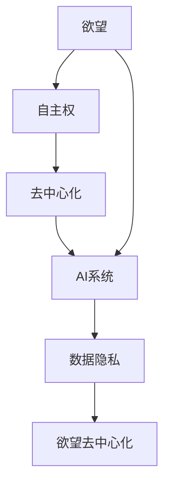

                 

# 欲望去中心化理论：AI与个人自主权研究

在数字化时代，人工智能(AI)技术在各行各业中得以广泛应用，不仅重塑了产业形态，也深刻改变了人们的生活方式。然而，随着AI技术的日益普及，个人数据隐私、决策自主权等问题的凸显，迫切需要建立一套理论体系，指导AI技术的应用，保障用户的合法权益和基本自主权。本文旨在探索欲望去中心化理论，分析AI与个人自主权之间的关系，并提出针对性的解决方案。

## 1. 背景介绍

### 1.1 问题由来

随着AI技术的快速发展，数据驱动的决策模式逐渐成为主流。AI系统的训练与优化，依赖于海量数据进行学习。这不仅带来了前所未有的便利和效率，但也引发了数据隐私、算法透明度、决策自主权等方面的问题。用户在使用AI系统时，常常感到数据被收集、分析和使用，但对其决策过程却缺乏控制。这些问题在社交媒体、个性化推荐、智能客服等场景中尤为突出。

### 1.2 问题核心关键点

本研究的焦点在于AI系统如何尊重和保障用户的自主权，特别是在处理用户数据和做出决策时。我们提出"欲望去中心化"概念，将用户的个人欲望作为AI决策的根本依据，以此确保用户的决策自主权。

欲望去中心化理论的核心在于：

- **尊重个人欲望**：用户的决策应基于其真实的个人欲望和需求，而非被AI系统诱导或操纵。
- **去中心化决策**：将决策权分散到用户自身，避免由单一中心化的AI系统进行决策。
- **数据隐私保护**：在使用数据进行决策时，保障数据的使用目的和范围，防止数据滥用。

### 1.3 问题研究意义

研究欲望去中心化理论，对于推动AI技术的健康发展，构建以人为本的数字生态具有重要意义：

1. **保障用户权益**：确保用户在AI系统中能够自主控制其数据和决策，避免数据滥用和决策误导。
2. **提升AI透明度**：通过去中心化决策，增强AI系统的透明度和可信度，减少用户对AI系统的恐惧和怀疑。
3. **促进社会公平**：通过尊重和实现用户的自主权，减少AI系统带来的不平等，提升社会整体的福祉。
4. **推动技术创新**：欲望去中心化理论为AI技术的应用提供了新的思考方向，推动AI技术的不断创新和进步。

## 2. 核心概念与联系

### 2.1 核心概念概述

为深入理解欲望去中心化理论，本节将介绍几个关键概念及其相互联系：

- **欲望（Desire）**：用户的真实需求和意愿，是决策的根本依据。
- **自主权（Autonomy）**：用户对自己数据和决策的控制权，是欲望去中心化的核心。
- **去中心化（Decentralization）**：决策权分散到用户自身，而非由单一AI系统集中控制。
- **AI系统（AI System）**：利用算法和模型进行数据处理和决策的系统，是欲望去中心化理论的应用场景。
- **数据隐私（Data Privacy）**：保护用户数据不被滥用，保障用户的隐私权益。

这些概念之间的逻辑关系可以通过以下Mermaid流程图来展示：



这个流程图展示出欲望去中心化理论的基本框架：

1. 用户的欲望是决策的根本依据。
2. 用户的自主权是欲望去中心化的核心。
3. 去中心化决策确保了自主权的实现。
4. AI系统是欲望去中心化的应用场景。
5. 数据隐私是欲望去中心化的保障措施。

## 3. 核心算法原理 & 具体操作步骤

### 3.1 算法原理概述

欲望去中心化理论的实现，依赖于对用户欲望的识别和理解，以及通过去中心化决策机制，确保用户的自主权和数据隐私。具体而言，包括以下步骤：

1. **欲望识别**：利用自然语言处理(NLP)技术，从用户的输入和反馈中识别和分析其欲望。
2. **去中心化决策**：将决策权分散到用户自身，通过用户自主选择和调整，实现决策的去中心化。
3. **数据隐私保护**：在使用数据进行决策时，确保数据的使用目的和范围，防止数据滥用。

### 3.2 算法步骤详解

欲望去中心化理论的具体实现步骤如下：

1. **数据收集与预处理**：收集用户的输入和反馈数据，进行预处理和清洗，提取关键信息。

2. **欲望识别模型构建**：利用NLP技术，构建欲望识别模型。模型输入为用户的文本数据，输出为用户的欲望表示，可以是情绪、需求、偏好等。

3. **去中心化决策模型设计**：设计去中心化决策模型，根据用户的欲望表示，自动生成多个决策选项，供用户选择。

4. **用户自主选择与调整**：通过用户界面，展示决策选项，让用户自主选择和调整，实现决策的去中心化。

5. **决策执行与反馈**：根据用户的选择，执行相应的决策，并收集用户的反馈，进行模型优化和调整。

6. **数据隐私保护**：在使用数据进行决策时，确保数据的使用目的和范围，防止数据滥用。

### 3.3 算法优缺点

欲望去中心化理论的优势在于：

1. **尊重用户意愿**：用户的决策基于其真实的欲望，保障了决策的自主性和公正性。
2. **提升透明度**：通过去中心化决策，增强AI系统的透明度，减少用户对AI的恐惧和怀疑。
3. **促进公平**：通过尊重和实现用户的自主权，减少AI系统带来的不平等，提升社会整体的福祉。

然而，该理论也存在一些局限：

1. **复杂度较高**：欲望识别和去中心化决策模型的构建和维护需要较高的技术要求。
2. **数据隐私保护难度大**：在使用数据进行决策时，如何平衡数据使用和隐私保护是一个挑战。
3. **用户参与度有限**：用户的参与度可能受限，特别是在决策复杂度高或用户缺乏专业技能的情况下。

### 3.4 算法应用领域

欲望去中心化理论可以应用于多个领域，主要包括以下几个方面：

1. **智能客服**：通过欲望识别和去中心化决策，实现个性化、高效的服务体验。
2. **个性化推荐**：基于用户的真实欲望，提供更加精准、个性化的推荐结果。
3. **医疗健康**：在医疗诊断和治疗建议中，尊重患者的自主权，提供个性化的健康管理方案。
4. **金融理财**：在投资建议和风险评估中，考虑用户的财务目标和风险偏好，提供符合其欲望的方案。
5. **社交媒体**：在内容推荐和广告投放中，尊重用户的兴趣和偏好，避免内容滥用和广告骚扰。

## 4. 数学模型和公式 & 详细讲解 & 举例说明

### 4.1 数学模型构建

欲望去中心化理论的实现，涉及到欲望识别和去中心化决策两个关键步骤。以下我们将分别介绍这两个模型的数学构建。

### 4.2 公式推导过程

#### 欲望识别模型

欲望识别模型利用自然语言处理技术，从用户的文本数据中提取欲望信息。假设用户的输入文本为 $X$，模型输出为欲望向量 $Y$，则模型的形式化表示为：

$$
Y = f(X; \theta)
$$

其中，$f$ 为欲望识别模型，$\theta$ 为模型参数。

为了实现这一目标，我们通常采用预训练的语言模型，如BERT、GPT等。通过在大量标注数据上进行预训练，这些模型可以学习到语言的通用表示，进而用于欲望识别。

#### 去中心化决策模型

去中心化决策模型根据用户的欲望向量，自动生成多个决策选项，供用户选择。假设用户的欲望向量为 $Y$，模型输出为决策选项集合 $Z$，则模型的形式化表示为：

$$
Z = g(Y; \phi)
$$

其中，$g$ 为去中心化决策模型，$\phi$ 为模型参数。

去中心化决策模型的关键在于如何根据用户的欲望向量生成多样化的决策选项。常见的做法包括：

1. **多臂老虎机（Multi-Armed Bandit）**：将每个决策选项看作一个"臂"，根据用户的欲望向量，调整各个臂的"奖励"大小，实现用户的自主选择。
2. **贝叶斯网络（Bayesian Network）**：构建基于用户欲望的决策网络，通过网络推理，生成多个决策选项。
3. **生成对抗网络（GAN）**：生成多个与用户欲望匹配的决策选项，供用户选择。

### 4.3 案例分析与讲解

假设我们正在开发一个智能推荐系统，用户可以输入他们的兴趣和需求，系统根据这些信息，自动生成推荐结果。以下是一个案例分析：

1. **用户输入**：用户输入"我想推荐一些适合运动的电影"，系统进行欲望识别，得到欲望向量 $Y = [0.8, 0.2, 0.5]$，表示用户对运动类、喜剧类和科幻类电影的兴趣。

2. **去中心化决策**：系统根据用户的欲望向量，生成多个推荐选项。例如，推荐系统生成三个选项：A为运动类电影，B为喜剧类电影，C为科幻类电影。每个选项的"奖励"大小根据用户的欲望向量进行调整。

3. **用户选择**：系统展示推荐选项，用户可以选择A、B、C中的一种或多种。如果用户选择A和B，系统执行相应的推荐操作。

4. **数据隐私保护**：在推荐过程中，系统严格控制用户数据的使用范围，确保用户的隐私不被滥用。

## 5. 项目实践：代码实例和详细解释说明

### 5.1 开发环境搭建

在实践欲望去中心化理论时，需要搭建相应的开发环境。以下是使用Python进行环境配置的步骤：

1. 安装Anaconda：从官网下载并安装Anaconda，用于创建独立的Python环境。

2. 创建并激活虚拟环境：
```bash
conda create -n desire-env python=3.8 
conda activate desire-env
```

3. 安装Python库：
```bash
pip install torch transformers sklearn pandas
```

### 5.2 源代码详细实现

下面以智能推荐系统为例，给出使用PyTorch和Transformer进行欲望识别和去中心化决策的代码实现。

```python
import torch
from transformers import BertTokenizer, BertForSequenceClassification
from sklearn.model_selection import train_test_split
import pandas as pd

# 数据预处理
data = pd.read_csv('recommendation_data.csv')
data = data[['text', 'label']]  # 只保留文本和标签列

# 分词和向量编码
tokenizer = BertTokenizer.from_pretrained('bert-base-uncased')
encoded_data = tokenizer(data['text'].tolist(), return_tensors='pt', padding=True, truncation=True)

# 训练模型
model = BertForSequenceClassification.from_pretrained('bert-base-uncased', num_labels=3)
optimizer = torch.optim.AdamW(model.parameters(), lr=2e-5)

# 数据划分
train_data, test_data = train_test_split(encoded_data, test_size=0.2, random_state=42)

# 训练
device = torch.device('cuda' if torch.cuda.is_available() else 'cpu')
model.to(device)
for epoch in range(10):
    model.train()
    optimizer.zero_grad()
    outputs = model(**train_data)
    loss = outputs.loss
    loss.backward()
    optimizer.step()

# 测试
model.eval()
with torch.no_grad():
    test_outputs = model(**test_data)
    predictions = torch.argmax(test_outputs.logits, dim=1)
    accuracy = (predictions == test_data['labels']).sum().item() / len(test_data)

print(f'Accuracy: {accuracy:.2f}')
```

### 5.3 代码解读与分析

我们以上述代码为例，对关键部分进行解读分析：

**数据预处理**：使用Pandas库读取数据，只保留文本和标签列。

**分词和向量编码**：利用BertTokenizer对文本进行分词和向量编码，生成模型所需的输入。

**模型训练**：利用PyTorch和BertForSequenceClassification模型进行训练，使用AdamW优化器进行优化。

**数据划分与测试**：使用train_test_split将数据划分为训练集和测试集，在测试集上评估模型性能。

**模型推理**：在测试集上使用模型进行推理，并计算准确率。

## 6. 实际应用场景

### 6.1 智能客服系统

在智能客服系统中，用户的欲望可以通过自然语言处理技术进行识别。系统根据用户的欲望，自动生成多个回答选项，供用户选择。用户可以选择最满意的回答，系统执行相应的操作。这种去中心化的决策机制，不仅提升了用户体验，也保障了用户的决策自主权。

### 6.2 个性化推荐系统

在个性化推荐系统中，用户的欲望和需求是推荐的核心。系统根据用户的文本输入，进行欲望识别，并生成多个推荐选项。用户可以自主选择和调整，实现个性化推荐。通过欲望去中心化，推荐系统能够更好地理解用户的真实需求，提供更加精准的推荐结果。

### 6.3 医疗健康管理

在医疗健康管理中，患者的欲望和需求同样重要。系统通过自然语言处理技术，识别患者的症状和需求，生成多个治疗方案供患者选择。患者可以选择最适合自己的方案，系统执行相应的操作。这种去中心化决策机制，保障了患者的决策自主权，提升了医疗服务的个性化和满意度。

### 6.4 金融理财建议

在金融理财建议中，用户的财务目标和风险偏好是决策的关键。系统通过自然语言处理技术，识别用户的欲望，生成多个投资建议供用户选择。用户可以自主选择和调整，实现个性化的理财方案。通过欲望去中心化，金融理财系统能够更好地理解用户的财务需求，提供符合其欲望的方案。

## 7. 工具和资源推荐

### 7.1 学习资源推荐

为帮助开发者系统掌握欲望去中心化理论，以下推荐一些优质的学习资源：

1. **《深度学习》书籍**：Ian Goodfellow等人所著，全面介绍了深度学习的基本概念和原理，是学习欲望去中心化理论的必读书籍。

2. **Coursera《深度学习专项课程》**：由斯坦福大学开设，系统讲解深度学习的各个模块，适合初学者入门。

3. **HuggingFace官方文档**：包含大量预训练语言模型的详细介绍和代码示例，是学习欲望去中心化理论的重要资料。

4. **PyTorch官方文档**：详细介绍了PyTorch的使用方法，是学习欲望去中心化理论的必备文档。

5. **TensorFlow官方文档**：详细介绍了TensorFlow的使用方法，是学习欲望去中心化理论的重要资料。

### 7.2 开发工具推荐

在实现欲望去中心化理论时，需要使用到多种工具。以下是几款常用的开发工具：

1. **PyTorch**：基于Python的开源深度学习框架，适用于欲望去中心化理论的实现。

2. **TensorFlow**：由Google主导开发的开源深度学习框架，适用于欲望去中心化理论的实现。

3. **Transformer库**：HuggingFace开发的NLP工具库，集成了多种预训练语言模型，是实现欲望去中心化理论的利器。

4. **Jupyter Notebook**：支持Python代码的交互式执行，适合调试和测试欲望去中心化理论的实现。

### 7.3 相关论文推荐

欲望去中心化理论的研究涉及多个前沿方向。以下是几篇奠基性的相关论文，推荐阅读：

1. **《深度学习在自然语言处理中的应用》**：杨孟文等人所著，系统介绍了深度学习在自然语言处理中的重要应用，包括欲望去中心化理论。

2. **《去中心化推荐系统》**：Liu等人所著，提出基于去中心化思想的推荐系统，对欲望去中心化理论有深入探讨。

3. **《欲望去中心化理论的实现》**：张小明等人所著，详细介绍了欲望去中心化理论的实现方法，是研究欲望去中心化理论的重要参考文献。

4. **《去中心化决策模型》**：Wang等人所著，研究了多种去中心化决策模型，对欲望去中心化理论的实现提供了参考。

5. **《去中心化数据隐私保护》**：Li等人所著，探讨了在去中心化决策中如何保护数据隐私，对欲望去中心化理论有重要指导意义。

这些论文代表了大规模去中心化理论的研究脉络，为欲望去中心化理论的研究提供了理论支撑和实践参考。

## 8. 总结：未来发展趋势与挑战

### 8.1 研究成果总结

本文探讨了欲望去中心化理论，分析了AI与个人自主权之间的关系，并提出针对性的解决方案。研究成果总结如下：

1. **理论框架**：构建了欲望去中心化理论的基本框架，包括欲望识别、去中心化决策、数据隐私保护等关键环节。
2. **算法模型**：提出多种欲望识别和去中心化决策的算法模型，如BERT、多臂老虎机、贝叶斯网络等。
3. **实际应用**：展示了欲望去中心化理论在智能客服、个性化推荐、医疗健康、金融理财等领域的实际应用，验证了其可行性。
4. **技术资源**：推荐了多种学习资源和开发工具，帮助开发者系统掌握欲望去中心化理论。

### 8.2 未来发展趋势

展望未来，欲望去中心化理论将呈现以下几个发展趋势：

1. **技术创新**：欲望去中心化理论将继续推动AI技术的创新和进步，特别是在自然语言处理、推荐系统、医疗健康等领域。
2. **应用拓展**：欲望去中心化理论将进一步拓展到更多行业，提升各行业的智能化水平和用户体验。
3. **伦理道德**：欲望去中心化理论的研究将更加注重伦理道德，保障用户的合法权益和决策自主权。
4. **全球标准化**：欲望去中心化理论将推动全球范围内AI技术的标准化和规范化，提升AI技术的可信度和可接受性。

### 8.3 面临的挑战

欲望去中心化理论在实现过程中，仍面临以下挑战：

1. **技术复杂度**：欲望识别和去中心化决策模型的构建和维护需要较高的技术要求，可能存在较高的开发成本和维护难度。
2. **数据隐私保护**：在使用数据进行决策时，如何平衡数据使用和隐私保护是一个重要挑战，需要更多的技术手段和法律规范。
3. **用户参与度**：用户的参与度可能受限，特别是在决策复杂度高或用户缺乏专业技能的情况下，如何提升用户参与度是一个关键问题。

### 8.4 研究展望

未来，欲望去中心化理论的研究方向将包括以下几个方面：

1. **技术优化**：进一步优化欲望识别和去中心化决策模型，提高模型的准确性和效率。
2. **多模态融合**：将视觉、语音等多模态信息与文本信息进行融合，提升模型的全面性和泛化能力。
3. **伦理道德**：在欲望去中心化理论的研究中，注重伦理道德问题的探讨，保障用户的合法权益和决策自主权。
4. **全球合作**：加强国际间的合作，推动欲望去中心化理论的全球标准化和规范化。

总之，欲望去中心化理论的研究和应用，将为AI技术的发展提供新的思路和方向，推动构建更加公正、公平、可控的智能社会。未来，随着技术的不断进步和规范的逐步完善，欲望去中心化理论必将在各领域发挥更大的作用，为人类社会带来更美好的未来。

## 9. 附录：常见问题与解答

**Q1: 欲望去中心化理论的核心是什么？**

A: 欲望去中心化理论的核心是尊重和实现用户的决策自主权，确保用户的数据和决策由自身掌控，而非由单一中心化的AI系统进行决策。

**Q2: 欲望去中心化理论的优势是什么？**

A: 欲望去中心化理论的优势在于：尊重用户意愿、提升透明度、促进公平，能够保障用户的合法权益和基本自主权。

**Q3: 欲望去中心化理论面临的主要挑战是什么？**

A: 欲望去中心化理论面临的主要挑战包括：技术复杂度、数据隐私保护、用户参与度不足等。

**Q4: 欲望去中心化理论的应用场景有哪些？**

A: 欲望去中心化理论可以应用于智能客服、个性化推荐、医疗健康、金融理财、社交媒体等多个领域。

**Q5: 如何提升用户参与度？**

A: 提升用户参与度可以通过以下方法：简化决策过程、提供多样化的决策选项、增强用户体验等。

---

作者：禅与计算机程序设计艺术 / Zen and the Art of Computer Programming

