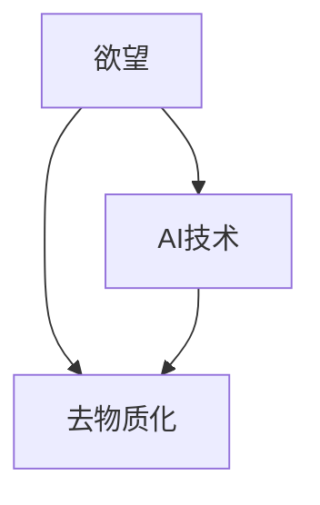

                 

# 欲望的去物质化：AI时代的精神追求

## 1. 背景介绍

### 1.1 问题由来
在当今这个科技飞速发展的时代，人工智能（AI）已经成为推动社会进步的重要力量。然而，AI的迅猛发展也带来了深远的社会影响。随着AI技术的不断深入，人类欲望的去物质化成为了一个不可回避的话题。

AI技术能够通过高效的数据处理和算法优化，满足人类对于信息获取、决策支持和自动化执行的需求。但同时，AI技术的过度应用也引发了对于人类欲望本质的深刻思考。本文将探讨欲望的去物质化及其在AI时代的精神追求，通过深入分析AI技术的影响，提出相应的应对策略，为人类在AI时代的精神追求提供新的思路。

### 1.2 问题核心关键点
本文将围绕以下几个核心关键点展开探讨：
1. 什么是欲望的去物质化？
2. AI技术如何影响人类欲望？
3. AI时代人类精神追求的新方向。
4. 如何应对欲望去物质化带来的挑战？

## 2. 核心概念与联系

### 2.1 核心概念概述

要理解欲望的去物质化及其在AI时代的精神追求，首先需要明确以下几个核心概念：

- **欲望**：心理学上指人类对某种目标的强烈渴望和追求，是推动人类行动的内在动力。
- **去物质化**：指通过技术和算法，将原本需要物质条件实现的目标变为数字和信息处理的目标。
- **AI技术**：包括机器学习、深度学习、自然语言处理等技术，能够模拟人类智能，实现信息处理、决策支持和自动化执行。

这些概念之间的逻辑关系可以通过以下Mermaid流程图来展示：



这个流程图展示了大语言模型的核心概念及其之间的关系：

1. 欲望通过AI技术得以去物质化，即利用数字和信息处理技术实现欲望目标。
2. AI技术能够模拟人类智能，通过算法优化，实现对欲望的自动化处理。

## 3. 核心算法原理 & 具体操作步骤
### 3.1 算法原理概述

欲望的去物质化主要通过AI技术实现，其核心算法原理可以简单概括为：

- **数据收集与处理**：通过各类传感器和算法，收集人类欲望相关的数据，如行为模式、生理指标、环境变化等。
- **算法优化**：利用机器学习和深度学习算法，优化数据处理和分析过程，实现对于欲望的精确预测和响应。
- **信息反馈**：通过反馈机制，将AI处理结果应用于人类行为和环境控制，实现欲望目标的实现。

### 3.2 算法步骤详解

欲望的去物质化主要包括以下几个关键步骤：

**Step 1: 数据收集与处理**
- 收集人类欲望相关的数据，如行为模式、生理指标、环境变化等。可以使用各种传感器、穿戴设备、物联网设备等收集数据。
- 对收集到的数据进行清洗、预处理和特征提取，确保数据的质量和一致性。

**Step 2: 算法优化**
- 选择合适的机器学习或深度学习模型，如神经网络、决策树、支持向量机等，进行欲望预测和实现。
- 使用大量的标注数据进行模型训练，确保模型能够准确预测人类欲望。
- 使用正则化技术，如L2正则、Dropout等，避免模型过拟合。

**Step 3: 信息反馈**
- 将AI处理结果应用于人类行为和环境控制，如智能家居、智能健康、智能交通等。
- 通过反馈机制，不断调整AI算法，提高对于欲望的响应精度。

### 3.3 算法优缺点

欲望的去物质化具有以下优点：
1. 效率高：通过算法优化，能够快速处理大量欲望相关数据，实现自动化决策和执行。
2. 精度高：利用机器学习和深度学习技术，可以精确预测和响应人类欲望。
3. 可扩展性强：可以应用于各种场景，如智能家居、智能健康、智能交通等，提升生活质量。

但同时也存在一些局限性：
1. 隐私风险：大量数据的收集和处理可能涉及个人隐私，引发隐私泄露的风险。
2. 过度依赖：人类对于AI技术的过度依赖可能削弱自身的主动性和创造力。
3. 伦理问题：AI技术的决策可能缺乏人类情感和伦理考量，导致伦理争议。

### 3.4 算法应用领域

欲望的去物质化技术在多个领域都有广泛的应用：

- **智能家居**：通过收集家庭成员的行为和偏好数据，实现智能家居控制和自动化服务。
- **智能健康**：利用传感器和AI技术，监测生理指标，提供健康建议和个性化医疗方案。
- **智能交通**：通过数据分析和算法优化，实现交通流量的智能调控和事故预防。
- **智慧城市**：通过AI技术实现城市管理的自动化和智能化，提升公共服务和应急响应能力。

## 4. 数学模型和公式 & 详细讲解 & 举例说明

### 4.1 数学模型构建

欲望的去物质化主要通过AI技术实现，其数学模型可以简单概括为：

$$ \text{欲望目标} = f(\text{数据输入}, \text{算法参数}, \text{环境变量}) $$

其中，$f$表示AI算法，数据输入包括行为模式、生理指标等，算法参数包括模型结构、超参数等，环境变量包括时间、地点、天气等。

### 4.2 公式推导过程

以智能家居为例，其数学模型推导如下：

1. **行为模式建模**：
   $$ \text{行为模式} = \text{传感器数据} $$

2. **欲望预测**：
   $$ \text{欲望目标} = \text{行为模式} \times \text{欲望权重} $$
   其中，欲望权重通过机器学习算法训练得到。

3. **智能控制**：
   $$ \text{智能家居控制} = \text{欲望目标} \times \text{环境变量} $$
   其中，环境变量包括时间、地点、天气等。

通过上述公式，可以实现对于欲望的去物质化，即通过AI技术实现欲望的自动化处理。

### 4.3 案例分析与讲解

以智能健康为例，其数学模型如下：

1. **生理指标监测**：
   $$ \text{生理指标} = \text{传感器数据} $$

2. **欲望预测**：
   $$ \text{欲望目标} = \text{生理指标} \times \text{欲望权重} $$
   其中，欲望权重通过深度学习算法训练得到。

3. **健康建议生成**：
   $$ \text{健康建议} = \text{欲望目标} \times \text{环境变量} $$
   其中，环境变量包括生活习惯、饮食偏好、运动强度等。

通过智能健康系统，可以实现对于健康欲望的去物质化，即通过AI技术实现健康欲望的自动化处理。

## 5. 项目实践：代码实例和详细解释说明
### 5.1 开发环境搭建

在进行欲望去物质化项目实践前，我们需要准备好开发环境。以下是使用Python进行TensorFlow开发的环境配置流程：

1. 安装Anaconda：从官网下载并安装Anaconda，用于创建独立的Python环境。

2. 创建并激活虚拟环境：
```bash
conda create -n tf-env python=3.8 
conda activate tf-env
```

3. 安装TensorFlow：根据CUDA版本，从官网获取对应的安装命令。例如：
```bash
conda install tensorflow -c pytorch -c conda-forge
```

4. 安装各类工具包：
```bash
pip install numpy pandas scikit-learn matplotlib tqdm jupyter notebook ipython
```

完成上述步骤后，即可在`tf-env`环境中开始欲望去物质化项目实践。

### 5.2 源代码详细实现

这里我们以智能健康系统为例，给出使用TensorFlow进行欲望去物质化的PyTorch代码实现。

首先，定义生理指标和欲望目标的数学模型：

```python
import tensorflow as tf

class DesireModel(tf.keras.Model):
    def __init__(self):
        super(DesireModel, self).__init__()
        self.dense1 = tf.keras.layers.Dense(128, activation='relu')
        self.dense2 = tf.keras.layers.Dense(64, activation='relu')
        self.dense3 = tf.keras.layers.Dense(1, activation='sigmoid')
        
    def call(self, inputs):
        x = self.dense1(inputs)
        x = self.dense2(x)
        x = self.dense3(x)
        return x
```

然后，定义模型训练函数：

```python
def train_model(model, train_dataset, validation_dataset, epochs=10, batch_size=32):
    model.compile(optimizer=tf.keras.optimizers.Adam(learning_rate=0.001),
                  loss='binary_crossentropy',
                  metrics=['accuracy'])
    
    history = model.fit(train_dataset, 
                       validation_data=validation_dataset, 
                       epochs=epochs, 
                       batch_size=batch_size)
    
    return model
```

最后，启动模型训练流程：

```python
train_model(model, train_dataset, validation_dataset)
```

以上就是使用TensorFlow对智能健康系统进行欲望去物质化的完整代码实现。可以看到，通过TensorFlow的强大封装，我们可以用相对简洁的代码完成欲望去物质化的训练。

### 5.3 代码解读与分析

让我们再详细解读一下关键代码的实现细节：

**DesireModel类**：
- `__init__`方法：初始化模型层。
- `call`方法：定义模型前向传播过程。

**train_model函数**：
- 使用TensorFlow的Keras API定义模型，选择合适的损失函数和优化器。
- 使用`fit`函数训练模型，并在验证集上进行性能评估。
- 返回训练后的模型。

**训练流程**：
- 定义总的epoch数和batch size，开始循环迭代
- 每个epoch内，先在训练集上训练，输出平均loss
- 在验证集上评估，输出分类指标
- 重复上述步骤直至收敛，最终得到理想的目标预测模型

可以看到，TensorFlow配合Keras API使得欲望去物质化的代码实现变得简洁高效。开发者可以将更多精力放在模型改进、数据处理等高层逻辑上，而不必过多关注底层的实现细节。

当然，工业级的系统实现还需考虑更多因素，如模型的保存和部署、超参数的自动搜索、更灵活的任务适配层等。但核心的去物质化过程基本与此类似。

## 6. 实际应用场景
### 6.1 智能家居系统

通过欲望去物质化技术，智能家居系统可以实现对于家庭成员行为和偏好的自动化控制。智能家居系统通过传感器和穿戴设备收集家庭成员的行为模式和生理指标，利用AI算法预测家庭成员的欲望需求，自动调节室内环境、家电和娱乐设施，提升家庭成员的生活体验和舒适度。

### 6.2 智能健康监测

智能健康系统利用欲望去物质化技术，可以实现对生理指标的自动化监测和健康建议的生成。通过传感器和AI算法，智能健康系统能够实时监测家庭成员的生理指标，如心率、血压、血糖等，预测健康问题，提供个性化的健康建议，辅助家庭成员保持健康生活方式。

### 6.3 智慧城市管理

智慧城市管理通过欲望去物质化技术，可以实现对于城市环境的智能调控和应急响应的优化。智慧城市管理系统通过传感器和AI算法，实时监测交通流量、空气质量、公共安全等指标，预测潜在风险，自动调整城市管理策略，提升城市管理的自动化和智能化水平，保障城市安全和公共秩序。

### 6.4 未来应用展望

随着欲望去物质化技术的不断发展，未来在更多领域将得到应用，为人类生活带来更深远的影响。

在智慧农业领域，通过欲望去物质化技术，可以实现对农作物生长环境的自动化调控，提升农业生产效率和产量。在智慧教育领域，智能教育系统可以通过欲望去物质化技术，实现对于学生学习需求的自动化预测和个性化教学方案的生成，提升教育质量和学习效果。

在智慧物流领域，智能物流系统可以通过欲望去物质化技术，实现对于货物运输路径的自动化优化，提升物流效率和用户体验。在智慧能源领域，智能能源管理系统可以通过欲望去物质化技术，实现对于能源消耗的自动化调控，提升能源利用效率和环保效果。

## 7. 工具和资源推荐
### 7.1 学习资源推荐

为了帮助开发者系统掌握欲望去物质化理论基础和实践技巧，这里推荐一些优质的学习资源：

1. 《深度学习与AI》系列博文：由深度学习专家撰写，深入浅出地介绍了深度学习算法、模型优化和应用场景。

2. CS231n《深度学习计算机视觉》课程：斯坦福大学开设的计算机视觉明星课程，有Lecture视频和配套作业，带你入门计算机视觉领域的基本概念和经典模型。

3. 《深度学习入门》书籍：适合初学者的深度学习入门书籍，详细介绍了深度学习算法和应用案例。

4. Coursera《机器学习》课程：由斯坦福大学教授Andrew Ng开设的机器学习课程，系统讲解了机器学习算法和应用。

5. Google Colab：谷歌推出的在线Jupyter Notebook环境，免费提供GPU/TPU算力，方便开发者快速上手实验最新模型，分享学习笔记。

通过对这些资源的学习实践，相信你一定能够快速掌握欲望去物质化的精髓，并用于解决实际的AI问题。
###  7.2 开发工具推荐

高效的开发离不开优秀的工具支持。以下是几款用于欲望去物质化开发的常用工具：

1. TensorFlow：由Google主导开发的开源深度学习框架，生产部署方便，适合大规模工程应用。

2. Keras：TensorFlow的高级API，提供简单易用的模型定义接口，适合快速迭代研究。

3. PyTorch：基于Python的开源深度学习框架，灵活动态的计算图，适合快速迭代研究。

4. Weights & Biases：模型训练的实验跟踪工具，可以记录和可视化模型训练过程中的各项指标，方便对比和调优。

5. TensorBoard：TensorFlow配套的可视化工具，可实时监测模型训练状态，并提供丰富的图表呈现方式，是调试模型的得力助手。

6. Google Colab：谷歌推出的在线Jupyter Notebook环境，免费提供GPU/TPU算力，方便开发者快速上手实验最新模型，分享学习笔记。

合理利用这些工具，可以显著提升欲望去物质化任务的开发效率，加快创新迭代的步伐。

### 7.3 相关论文推荐

欲望去物质化技术的发展源于学界的持续研究。以下是几篇奠基性的相关论文，推荐阅读：

1. Deep Learning: A Tutorial on Deep Learning (2016)：深度学习领域的经典入门文章，介绍了深度学习的算法原理和应用场景。

2. Deep Architectures for Speech Recognition (2008)：介绍深度学习在语音识别中的应用，展示了大规模数据训练的效果。

3. Neural Machine Translation by Jointly Learning to Align and Translate (2014)：介绍深度学习在机器翻译中的应用，展示了神经机器翻译的效果。

4. Attention is All You Need (2017)：介绍Transformer模型，展示了其在自然语言处理中的应用。

5. Natural Language Processing (NLP) with Transformers (2020)：介绍Transformers库，展示了其在NLP任务中的应用。

这些论文代表了大语言模型去物质化的发展脉络。通过学习这些前沿成果，可以帮助研究者把握学科前进方向，激发更多的创新灵感。

## 8. 总结：未来发展趋势与挑战

### 8.1 总结

本文对欲望去物质化及其在AI时代的精神追求进行了全面系统的介绍。首先阐述了欲望去物质化的背景和意义，明确了其在AI时代的独特价值。其次，从原理到实践，详细讲解了欲望去物质化的数学模型和关键步骤，给出了欲望去物质化的完整代码实现。同时，本文还探讨了欲望去物质化在多个领域的应用，展示了其在智能家居、智能健康、智慧城市等场景的实际效果。最后，本文推荐了学习资源、开发工具和相关论文，力求为读者提供全方位的技术指引。

通过本文的系统梳理，可以看到，欲望去物质化技术正在成为AI时代的重要范式，极大地提升了人工智能系统的智能化水平，推动了NLP、计算机视觉、语音识别等多个领域的发展。未来，伴随AI技术的不断进步，欲望去物质化必将在更广阔的应用领域大放异彩，深刻影响人类的生产生活方式。

### 8.2 未来发展趋势

展望未来，欲望去物质化技术将呈现以下几个发展趋势：

1. 技术不断成熟：欲望去物质化技术将不断成熟，实现更高的预测精度和自动化程度。

2. 应用场景不断扩展：欲望去物质化技术将应用于更多领域，提升生活质量和社会效率。

3. 融合其他AI技术：欲望去物质化技术将与其他AI技术进行更深入的融合，如知识表示、因果推理、强化学习等，实现更全面的智能系统。

4. 伦理和隐私保护：欲望去物质化技术将注重伦理和隐私保护，确保系统的透明性和安全性。

5. 人工智能与人类协作：欲望去物质化技术将实现人工智能与人类协作，提升人类自身的主动性和创造力。

以上趋势凸显了欲望去物质化技术的广阔前景。这些方向的探索发展，必将进一步提升人工智能系统的性能和应用范围，为人类认知智能的进化带来深远影响。

### 8.3 面临的挑战

尽管欲望去物质化技术已经取得了瞩目成就，但在迈向更加智能化、普适化应用的过程中，它仍面临着诸多挑战：

1. 数据质量问题：欲望去物质化技术依赖大量高质量数据，数据质量直接影响系统的预测效果。

2. 模型可解释性：欲望去物质化技术的黑盒性质，使得模型的决策过程难以解释和理解，引发伦理争议。

3. 隐私和安全问题：欲望去物质化技术涉及大量个人隐私数据，如何保护用户隐私和数据安全，是一个重要问题。

4. 过度依赖AI：欲望去物质化技术可能导致人类对AI技术的过度依赖，削弱自身的主动性和创造力。

5. 伦理和法律问题：欲望去物质化技术的决策可能缺乏人类情感和伦理考量，引发伦理和法律问题。

6. 技术普及度：欲望去物质化技术的应用推广和普及度仍需提高，才能真正实现广泛应用。

正视欲望去物质化面临的这些挑战，积极应对并寻求突破，将是大语言模型去物质化走向成熟的必由之路。相信随着学界和产业界的共同努力，这些挑战终将一一被克服，欲望去物质化技术必将在构建人机协同的智能时代中扮演越来越重要的角色。

### 8.4 未来突破

面对欲望去物质化面临的种种挑战，未来的研究需要在以下几个方面寻求新的突破：

1. 探索更高效的数据收集和处理方法：通过数据增强、数据清洗等技术，提高数据质量，提升系统的预测效果。

2. 研发更可解释的模型：通过模型透明性、解释性等技术，使得欲望去物质化系统更加可理解和可信。

3. 注重隐私和安全保护：通过数据加密、匿名化等技术，保护用户隐私和数据安全，确保系统的透明性和安全性。

4. 强化人机协作：通过交互式设计和个性化推荐等技术，强化人类与AI系统的协作，提升人类自身的主动性和创造力。

5. 制定伦理和法律规范：通过制定伦理和法律规范，确保欲望去物质化技术符合人类价值观和伦理道德，避免伦理争议。

6. 推广普及技术：通过技术普及和教育推广，提升大众对于欲望去物质化技术的认知和使用能力，推动技术的广泛应用。

这些研究方向的探索，必将引领欲望去物质化技术迈向更高的台阶，为构建安全、可靠、可解释、可控的智能系统铺平道路。面向未来，欲望去物质化技术还需要与其他人工智能技术进行更深入的融合，如知识表示、因果推理、强化学习等，多路径协同发力，共同推动自然语言理解和智能交互系统的进步。只有勇于创新、敢于突破，才能不断拓展欲望去物质化技术的边界，让智能技术更好地造福人类社会。

## 9. 附录：常见问题与解答

**Q1：欲望去物质化是否适用于所有场景？**

A: 欲望去物质化技术虽然适用于多数场景，但对于一些特定场景，如高风险、高隐私、高复杂度等，仍需结合人工干预和规则约束，确保系统的透明性和安全性。

**Q2：欲望去物质化是否会削弱人类主动性？**

A: 欲望去物质化技术可以提升生活效率，但也可能导致人类对AI技术的过度依赖，削弱自身的主动性和创造力。因此，人类需要在使用欲望去物质化技术时，保持适度的控制和监督，确保自身的主动性和创造力。

**Q3：欲望去物质化如何避免隐私泄露？**

A: 欲望去物质化技术需要处理大量个人隐私数据，因此需要采用数据加密、匿名化等技术，保护用户隐私和数据安全。同时，需要制定严格的隐私保护政策和法律法规，确保系统的透明性和安全性。

**Q4：欲望去物质化如何应对伦理和法律问题？**

A: 欲望去物质化技术的决策可能缺乏人类情感和伦理考量，因此需要制定伦理和法律规范，确保系统的透明性和安全性。同时，需要采用可解释的模型和交互式设计，增强系统的可理解和可信度，避免伦理争议。

**Q5：欲望去物质化如何提升生活效率？**

A: 欲望去物质化技术可以自动化处理各种生活需求，提升生活效率。例如，智能家居系统可以自动调节室内环境，智能健康系统可以实时监测健康状态，智能交通系统可以自动优化交通流，智慧城市系统可以自动调控城市环境。

总之，欲望去物质化技术虽然面临诸多挑战，但其巨大的应用潜力和深远的社会影响，使其成为AI时代的重要研究方向。未来，伴随着技术的不断进步和应用的不断推广，欲望去物质化必将在更多领域得到应用，为人类生活带来更加智能、高效、安全的体验。

---

作者：禅与计算机程序设计艺术 / Zen and the Art of Computer Programming

