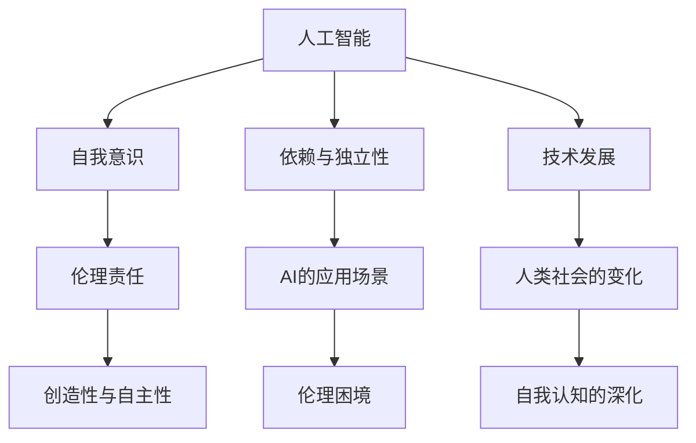

                 

# 欲望的反思：AI时代的自我认知

## 1. 背景介绍

### 1.1 问题由来
在快速发展的AI时代，人类社会正经历着前所未有的变革。AI技术的应用已经渗透到各个领域，从医疗、教育、金融到娱乐、交通、工业，几乎无处不在。然而，随着AI技术的深入应用，也带来了诸多社会和伦理问题，如隐私保护、就业替代、道德责任等。这些问题不仅影响着AI技术的可持续发展，也考验着人类对自我认知的深度和广度。

### 1.2 问题核心关键点
人工智能的崛起，不仅推动了技术进步，也挑战了人类对自我的理解和认知。以下是从AI时代自我认知角度出发，探讨的五个核心关键点：

1. **AI与人类关系**：AI技术的快速发展，使得人类在处理信息、决策等方面拥有了更强大的辅助工具，但也引发了对人类与AI关系重新定义的讨论。
2. **自我意识与AI**：随着AI技术在多个领域的深入应用，人类是否需要重新定义自我意识，以及如何实现自我与AI的和谐共存，成为亟待解决的问题。
3. **AI伦理责任**：在AI应用中，如何界定AI的伦理责任，确保AI技术的应用符合人类的价值观和道德规范，是AI发展中不可忽视的重要议题。
4. **AI的创造性与自主性**：AI在不断自我学习和改进的过程中，是否会逐渐具备创造性和自主性，这对人类社会将产生怎样的影响？
5. **人类对AI的依赖**：随着AI技术在各个领域的广泛应用，人类是否会过度依赖AI，失去自主思考和创造的能力？

### 1.3 问题研究意义
深入探讨AI时代的自我认知，有助于理解AI技术的本质，把握其在不同领域的应用方向，并制定相应的政策和伦理规范，确保AI技术的发展与人类社会的和谐共进。这不仅有助于推动AI技术的可持续发展，也能为人类提供更广阔的思考空间和自我反省的机会。

## 2. 核心概念与联系

### 2.1 核心概念概述
为更好地理解AI时代的自我认知，本文将介绍几个密切相关的核心概念：

1. **人工智能(AI)**：通过模拟人类智能行为，实现信息处理、决策支持、自然语言理解等功能的计算机系统。AI的核心在于“模拟人脑”，通过算法、模型和数据的学习，使机器具备类人智能。

2. **自我意识**：指人类对自己存在、思维、情感、行为的认知和反省能力。在AI时代，自我意识的内涵和外延都可能发生变化。

3. **伦理责任**：指AI系统在执行任务过程中，应承担的伦理道德责任。包括对数据隐私的保护、对决策结果的透明性、对社会公平的维护等。

4. **创造性与自主性**：指AI系统在学习和应用过程中，能否主动提出新思想、新方法，甚至具有独立思考和判断的能力。

5. **依赖与独立性**：指人类对AI的依赖程度，以及在AI辅助下，人类是否仍能保持独立思考和行动的能力。

这些核心概念之间的逻辑关系可以通过以下Mermaid流程图来展示：



这个流程图展示了几大核心概念之间的关系：

1. AI技术的发展推动了人类社会的变革。
2. 自我意识在AI时代可能面临重定义。
3. AI系统的伦理责任成为新的研究焦点。
4. 创造性和自主性是AI未来发展的方向。
5. 依赖与独立性关系影响着AI应用的广度和深度。

这些概念共同构成了AI时代自我认知的研究框架，有助于深入探讨AI技术与人类社会的关系。

## 3. 核心算法原理 & 具体操作步骤
### 3.1 算法原理概述
AI时代的自我认知，涉及多个维度的技术和哲学思考。以下从AI技术的角度，探讨其算法原理和操作步骤：

**算法原理**：
AI的自我认知能力，很大程度上取决于其算法设计和技术实现。目前，AI的核心算法包括神经网络、深度学习、强化学习等。这些算法通过大量的数据训练和模型调整，逐渐具备了类人智能的特征。然而，如何确保AI系统在具备智能的同时，也具备正确的伦理判断和自我反省能力，是算法设计中的重要考量。

**操作步骤**：
1. **数据收集与预处理**：收集与AI应用相关的数据，包括文本、图像、声音等，对其进行清洗和标注，为模型训练提供基础。
2. **模型训练与优化**：使用神经网络、深度学习等算法，对数据进行训练，优化模型参数，提高AI系统的智能水平。
3. **模型评估与验证**：通过各类评估指标和测试集，验证AI系统的性能和效果，确保其智能水平达到预期。
4. **伦理与责任考量**：在设计AI系统时，加入伦理和责任考量，确保AI系统在应用过程中，能够遵循人类的价值观和道德规范。
5. **自我反省与迭代**：通过不断的自我反省，识别AI系统的局限和缺陷，进行迭代优化，提升其自我认知能力。

### 3.2 算法步骤详解
以下是基于AI技术的自我认知算法步骤的详细介绍：

1. **数据收集与预处理**：
   - 数据收集：从不同的应用场景中，收集与AI系统相关的数据，如医疗数据、教育数据、金融数据等。
   - 数据清洗：去除噪声和异常值，确保数据质量。
   - 数据标注：为数据添加标签，用于模型的训练和验证。

2. **模型训练与优化**：
   - 选择合适的算法：根据任务需求，选择适合的算法，如卷积神经网络、循环神经网络、深度信念网络等。
   - 训练模型：使用训练集对模型进行训练，调整参数，提高准确率。
   - 模型优化：通过正则化、Dropout等技术，防止模型过拟合，提高泛化能力。

3. **模型评估与验证**：
   - 设定评估指标：如准确率、召回率、F1分数等，评估模型性能。
   - 测试集验证：使用测试集对模型进行验证，确保其在不同数据上的表现一致。
   - 结果分析：分析模型结果，识别改进空间。

4. **伦理与责任考量**：
   - 伦理评估：在设计模型时，加入伦理评估指标，确保模型不会产生有害结果。
   - 责任机制：建立责任机制，明确AI系统的决策责任，确保其行为符合伦理规范。
   - 可解释性：确保模型具备可解释性，使人类能够理解AI系统的决策过程。

5. **自我反省与迭代**：
   - 自我反省：通过不断的数据反馈和用户反馈，识别AI系统的局限和缺陷。
   - 迭代优化：基于反馈信息，调整模型参数，进行迭代优化，提升AI系统的自我认知能力。

### 3.3 算法优缺点
基于AI技术的自我认知算法，具有以下优点：

- **智能水平高**：通过深度学习和神经网络等算法，AI系统能够处理大规模数据，具备高智能水平。
- **决策速度快**：AI系统能够快速处理和分析数据，提供即时决策支持。
- **可扩展性强**：AI系统具备良好的可扩展性，可以根据需求进行快速迭代和优化。

同时，该算法也存在一些缺点：

- **依赖数据质量**：AI系统的性能依赖于数据质量，数据标注和清洗过程复杂且耗时。
- **伦理和责任问题**：AI系统的决策过程难以完全理解和解释，可能引发伦理和责任问题。
- **过度依赖风险**：过度依赖AI系统，可能使人类失去自主思考和决策能力。

### 3.4 算法应用领域
基于AI技术的自我认知算法，在多个领域都有广泛应用，具体如下：

1. **医疗诊断**：通过分析医学影像和病历数据，AI系统能够辅助医生进行疾病诊断和治疗方案制定，提升医疗水平。
2. **教育辅助**：利用AI技术，提供个性化学习方案，提升教育质量和效率。
3. **金融风控**：通过分析金融数据，AI系统能够识别风险点，提供风控建议，保护投资者利益。
4. **智能客服**：通过自然语言处理和机器学习技术，AI系统能够提供智能客服支持，提升客户体验。
5. **自动驾驶**：利用AI技术，实现自动驾驶功能，提升交通安全性。

以上应用领域展示了AI技术的强大潜力，也提示了其在不同场景下的自我认知需求。

## 4. 数学模型和公式 & 详细讲解 & 举例说明
### 4.1 数学模型构建
本节将使用数学语言对基于AI技术的自我认知算法进行更加严格的刻画。

假设AI系统在处理数据时，使用的模型为$f(x, \theta)$，其中$x$为输入数据，$\theta$为模型参数。模型的输出为$y$，表示对数据$x$的预测或决策结果。模型的损失函数为$\ell(y, \hat{y})$，其中$\hat{y}$为模型预测结果，$y$为真实结果。

在训练过程中，目标是最小化损失函数$\mathcal{L}(\theta)$，即：

$$
\theta^* = \mathop{\arg\min}_{\theta} \mathcal{L}(\theta) = \mathop{\arg\min}_{\theta} \frac{1}{N}\sum_{i=1}^N \ell(y_i, f(x_i, \theta))
$$

其中$N$为数据集大小。

### 4.2 公式推导过程
以医疗诊断为例，进行具体的公式推导：

1. **输入数据**：医疗影像数据$x$，标注为疾病类型$y$。
2. **模型定义**：使用卷积神经网络模型$f(x, \theta)$，其中$\theta$为模型参数。
3. **损失函数**：选择交叉熵损失函数$\ell(y, \hat{y}) = -\sum_i y_i \log \hat{y}_i$。
4. **训练目标**：最小化损失函数$\mathcal{L}(\theta)$，即$\mathop{\arg\min}_{\theta} \frac{1}{N}\sum_{i=1}^N \ell(y_i, f(x_i, \theta))$。

### 4.3 案例分析与讲解
以医疗影像识别为例，分析模型的训练和优化过程：

1. **数据集准备**：准备医疗影像数据集，并对其进行标注。
2. **模型选择**：选择适合的卷积神经网络模型，并进行初始化。
3. **训练过程**：使用训练集对模型进行前向传播和反向传播，调整模型参数，减小损失函数。
4. **模型评估**：使用验证集对模型进行验证，评估模型性能。
5. **结果优化**：根据评估结果，调整模型参数，进行迭代优化，提升模型准确率。

## 5. 项目实践：代码实例和详细解释说明
### 5.1 开发环境搭建

在进行AI自我认知算法实践前，我们需要准备好开发环境。以下是使用Python进行TensorFlow开发的环境配置流程：

1. 安装Anaconda：从官网下载并安装Anaconda，用于创建独立的Python环境。

2. 创建并激活虚拟环境：
```bash
conda create -n ai-env python=3.8 
conda activate ai-env
```

3. 安装TensorFlow：根据CUDA版本，从官网获取对应的安装命令。例如：
```bash
conda install tensorflow tensorflow-gpu=cuda11.1 -c pytorch -c conda-forge
```

4. 安装各类工具包：
```bash
pip install numpy pandas scikit-learn matplotlib tqdm jupyter notebook ipython
```

完成上述步骤后，即可在`ai-env`环境中开始AI自我认知算法的实践。

### 5.2 源代码详细实现

这里我们以医疗影像识别为例，给出使用TensorFlow对卷积神经网络进行训练的代码实现。

首先，定义模型结构和损失函数：

```python
import tensorflow as tf
from tensorflow.keras import layers

model = tf.keras.Sequential([
    layers.Conv2D(32, (3, 3), activation='relu', input_shape=(64, 64, 3)),
    layers.MaxPooling2D((2, 2)),
    layers.Conv2D(64, (3, 3), activation='relu'),
    layers.MaxPooling2D((2, 2)),
    layers.Flatten(),
    layers.Dense(64, activation='relu'),
    layers.Dense(10, activation='softmax')
])

loss_fn = tf.keras.losses.CategoricalCrossentropy()

# 定义模型优化器
optimizer = tf.keras.optimizers.Adam(learning_rate=0.001)
```

然后，定义训练和评估函数：

```python
def train_model(model, train_dataset, val_dataset, epochs):
    model.compile(optimizer=optimizer, loss=loss_fn, metrics=['accuracy'])
    
    history = model.fit(train_dataset, validation_data=val_dataset, epochs=epochs)
    
    return history

def evaluate_model(model, test_dataset):
    test_loss, test_acc = model.evaluate(test_dataset)
    print(f'Test accuracy: {test_acc:.2f}')
```

最后，启动训练流程并在测试集上评估：

```python
# 准备数据集
train_dataset = ...
val_dataset = ...
test_dataset = ...

# 训练模型
history = train_model(model, train_dataset, val_dataset, epochs=10)

# 在测试集上评估模型
evaluate_model(model, test_dataset)
```

以上就是使用TensorFlow对医疗影像识别卷积神经网络进行训练的完整代码实现。可以看到，通过TensorFlow的封装，模型的定义、训练和评估变得简洁高效。

### 5.3 代码解读与分析

让我们再详细解读一下关键代码的实现细节：

**模型结构**：
- `Sequential`模型：按顺序堆叠多个层，形成卷积神经网络。
- `Conv2D`层：定义卷积核大小和激活函数。
- `MaxPooling2D`层：对特征图进行最大池化，减小参数量。
- `Dense`层：定义全连接层，进行分类预测。

**损失函数**：
- `CategoricalCrossentropy`：用于多分类问题的损失函数。

**训练函数**：
- `train_model`函数：定义模型编译、训练和验证过程。

**评估函数**：
- `evaluate_model`函数：定义模型在测试集上的评估过程。

**训练流程**：
- 准备数据集，使用`train_model`函数训练模型，并在验证集上评估。
- 使用`evaluate_model`函数在测试集上评估模型性能。

可以看到，TensorFlow提供了强大的模型构建和训练功能，使得AI自我认知算法的实践变得更加高效和便捷。

## 6. 实际应用场景
### 6.1 智能医疗
AI技术在医疗领域的应用，极大地提升了医疗服务的效率和精准度。通过自我认知算法，AI系统可以更加准确地理解和处理医疗数据，辅助医生进行诊断和治疗。

具体而言，AI系统可以通过分析医疗影像、病历记录等数据，识别疾病特征，预测疾病发展趋势，提供个性化的治疗方案。例如，在乳腺癌筛查中，AI系统通过分析乳腺影像数据，可以识别早期病变，提高诊断准确率。在心电图分析中，AI系统通过分析心电图数据，可以识别心律失常，预测心脏病风险。

### 6.2 教育辅助
AI技术在教育领域的应用，为个性化学习提供了可能。通过自我认知算法，AI系统可以更好地理解学生的学习需求和进度，提供个性化的学习方案。

具体而言，AI系统可以通过分析学生的学习行为、测试成绩等数据，识别学生的学习难点，提供针对性的学习建议和资源。例如，在英语学习中，AI系统通过分析学生的阅读习惯和词汇量，推荐适合的阅读材料和练习题目。在数学学习中，AI系统通过分析学生的解题过程和错误，提供解题思路和解析。

### 6.3 金融风控
AI技术在金融领域的应用，提升了风险管理的精准度和效率。通过自我认知算法，AI系统可以更好地识别风险点和异常行为，提供及时的风险预警和防控建议。

具体而言，AI系统可以通过分析交易数据、用户行为等数据，识别潜在的欺诈行为和风险点，及时进行预警和处理。例如，在信用卡交易中，AI系统通过分析交易金额、时间、地点等信息，识别可疑交易行为，防止信用卡盗刷。在信用评分中，AI系统通过分析用户的历史信用记录和行为数据，预测信用风险，提供个性化的信用评分建议。

### 6.4 未来应用展望
随着AI技术的不断进步，基于自我认知算法的应用场景将更加广泛。未来，AI系统不仅能够处理结构化数据，还能理解自然语言，具备更加全面的自我认知能力。这将为各行各业带来更多的机遇和挑战。

在智慧城市治理中，AI系统可以更好地理解城市运行状态，提供智能决策支持。例如，在交通管理中，AI系统可以通过分析交通数据，优化交通信号灯，减少交通拥堵。在环境监测中，AI系统可以通过分析环境数据，提供智能预警和建议。

在智慧农业中，AI系统可以更好地理解作物生长周期，提供精准的农技指导。例如，在病虫害防治中，AI系统可以通过分析作物生长数据和病虫害数据，预测病虫害趋势，提供科学的防治建议。在精准农业中，AI系统可以通过分析土壤数据和气象数据，提供精准的种植方案。

## 7. 工具和资源推荐
### 7.1 学习资源推荐

为了帮助开发者系统掌握AI自我认知的理论基础和实践技巧，这里推荐一些优质的学习资源：

1. **深度学习**：斯坦福大学李飞飞教授的《深度学习》课程，涵盖深度学习的基础理论和技术实现。
2. **自然语言处理**：斯坦福大学李亚洲教授的《自然语言处理与深度学习》课程，涵盖自然语言处理的基本概念和应用实例。
3. **强化学习**：斯坦福大学David Silver教授的《强化学习》课程，涵盖强化学习的基本理论和技术实现。
4. **TensorFlow官方文档**：TensorFlow官方文档，提供全面的API文档和案例分析，是学习和实践TensorFlow的最佳资源。
5. **PyTorch官方文档**：PyTorch官方文档，提供丰富的API文档和案例分析，是学习和实践PyTorch的最佳资源。
6. **Kaggle**：Kaggle平台提供了大量的数据集和竞赛，有助于实践和提升AI自我认知算法的能力。

通过学习这些资源，相信你一定能够系统掌握AI自我认知算法的理论基础和实践技巧，为未来的研究和发展打下坚实的基础。

### 7.2 开发工具推荐

高效的开发离不开优秀的工具支持。以下是几款用于AI自我认知算法开发的常用工具：

1. **TensorFlow**：由Google主导开发的开源深度学习框架，生产部署方便，适合大规模工程应用。
2. **PyTorch**：Facebook开发的开源深度学习框架，灵活动态，适合研究和实验。
3. **Keras**：高层次的深度学习API，适合快速原型开发。
4. **Jupyter Notebook**：交互式的编程环境，支持代码块的实时展示和运行，便于研究和实验。
5. **GitHub**：代码托管平台，便于版本控制和协作开发。
6. **Git**：分布式版本控制系统，便于代码的备份和版本管理。

合理利用这些工具，可以显著提升AI自我认知算法的开发效率，加快创新迭代的步伐。

### 7.3 相关论文推荐

AI自我认知技术的发展源于学界的持续研究。以下是几篇奠基性的相关论文，推荐阅读：

1. **《深度学习》**：Ian Goodfellow等著，涵盖深度学习的基础理论和技术实现。
2. **《神经网络与深度学习》**：Michael Nielsen著，详细介绍了神经网络的基本原理和实现。
3. **《人工智能：一种现代方法》**：Stuart Russell和Peter Norvig著，涵盖人工智能的基本概念和应用实例。
4. **《人工智能简史》**：AI历史专家Pearson教授的著作，详细介绍了AI的发展历程和重要里程碑。

这些论文代表了大AI自我认知技术的发展脉络。通过学习这些前沿成果，可以帮助研究者把握学科前进方向，激发更多的创新灵感。

## 8. 总结：未来发展趋势与挑战
### 8.1 总结

本文对基于AI技术的自我认知算法进行了全面系统的介绍。首先阐述了AI技术在各个领域的应用现状和前景，明确了AI技术与人类社会的关系。其次，从AI技术的角度，详细讲解了自我认知算法的数学模型和操作步骤，给出了具体案例分析。最后，讨论了AI自我认知算法在实际应用中的潜在风险和挑战，并提出了相应的对策和未来展望。

通过本文的系统梳理，可以看到，AI自我认知算法在各个领域的应用前景广阔，但也面临诸多挑战和风险。只有不断探索和创新，才能真正实现AI技术与人类社会的和谐共进，推动人类社会的持续进步。

### 8.2 未来发展趋势

展望未来，AI自我认知算法将呈现以下几个发展趋势：

1. **智能水平提升**：随着深度学习和神经网络等算法的发展，AI系统的智能水平将不断提升，具备更加全面和深刻的自我认知能力。
2. **伦理和责任规范**：在AI系统的应用过程中，伦理和责任规范将成为重要的研究课题，确保AI系统的行为符合人类的价值观和道德规范。
3. **跨领域应用**：AI系统将跨越各个领域，实现更加全面和高效的应用，为人类社会的各个方面提供有力支持。
4. **人机协同**：AI系统将与人协同工作，发挥各自优势，共同解决复杂问题。
5. **隐私保护**：随着数据隐私问题的日益凸显，如何保护个人隐私将成为AI系统的重要研究方向。

以上趋势展示了AI自我认知算法的广阔前景，同时也提示了其在不同场景下的应用需求和挑战。

### 8.3 面临的挑战

尽管AI自我认知算法在多个领域取得了显著进展，但在迈向更加智能化、普适化应用的过程中，仍面临诸多挑战：

1. **数据隐私问题**：AI系统在处理数据时，如何保护个人隐私和数据安全，是当前面临的主要挑战之一。
2. **伦理和责任问题**：AI系统在执行任务时，如何界定其伦理责任，确保其行为符合人类的价值观和道德规范，是另一个重要课题。
3. **模型可解释性**：AI系统的决策过程难以完全理解和解释，可能导致用户对AI系统的不信任。
4. **模型泛化能力**：AI系统在不同数据集上的泛化能力有限，可能出现"过拟合"现象，导致在特定场景下性能不佳。
5. **模型依赖性**：过度依赖AI系统，可能使人类失去自主思考和决策能力，带来新的风险。

这些挑战需要研究者不断探索和解决，确保AI技术的健康发展和广泛应用。

### 8.4 研究展望

面向未来，AI自我认知技术的研究方向包括：

1. **隐私保护**：开发更加安全的隐私保护技术，确保数据在处理和使用过程中，不被滥用或泄露。
2. **伦理和责任**：建立AI系统的伦理评估机制，明确其行为责任，确保其行为符合人类的价值观和道德规范。
3. **模型可解释性**：开发更加可解释的AI模型，使人类能够理解其决策过程，增强信任感。
4. **泛化能力**：研究更加通用的模型，提升其在不同数据集上的泛化能力，确保在多个场景下的稳定表现。
5. **人机协同**：探索人机协同的交互方式，使人类与AI系统能够更好地协作，共同解决复杂问题。

这些研究方向将推动AI自我认知技术的不断进步，为人类社会的各个方面提供更加全面和高效的支持。

## 9. 附录：常见问题与解答

**Q1：AI系统的自我认知能力是否等同于人类自我认知？**

A: AI系统的自我认知能力与人类自我认知能力存在显著差异。AI系统通过算法和数据训练，具备一定的自我认知能力，但其认知深度和广度有限，难以与人类相提并论。人类自我认知能力不仅包括逻辑推理、情感识别等方面，还包括自我反省、道德判断等复杂过程。

**Q2：AI系统是否会逐步具备创造性和自主性？**

A: 目前AI系统尚未具备真正的创造性和自主性。虽然一些AI系统能够自主学习并改进算法，但其决策过程仍然依赖于人类设定的目标和规则。在未来，随着AI技术的不断进步，AI系统有望具备更加全面和深入的自我认知能力，但其是否具备真正的创造性和自主性，还需进一步研究和探索。

**Q3：人类是否会过度依赖AI系统？**

A: 过度依赖AI系统可能导致人类失去自主思考和决策能力。AI系统虽然能够提供强有力的辅助，但其决策过程难以完全理解和解释，可能存在潜在的风险和问题。因此，人类在依赖AI系统时，应保持理性和批判性，不断提升自我认知能力，确保在关键问题上仍能做出自主判断。

**Q4：AI系统的伦理和责任如何界定？**

A: AI系统的伦理和责任界定是一个复杂的议题。目前，国际社会尚未达成一致的伦理和责任规范，不同国家和地区有不同的法律和规范。在设计和应用AI系统时，应遵循当地的法律法规，确保AI系统的行为符合伦理规范。同时，应建立透明的决策机制，明确AI系统的责任主体，确保其在应用过程中，能够遵循人类的价值观和道德规范。

**Q5：如何保护数据隐私和安全性？**

A: 保护数据隐私和安全性是AI系统应用中的重要课题。目前，有多种隐私保护技术可供选择，如数据匿名化、差分隐私、联邦学习等。此外，应建立严格的数据访问和处理规范，确保数据在使用过程中，不被滥用或泄露。

通过回答这些常见问题，可以更好地理解AI自我认知算法的潜在风险和挑战，确保其健康发展和广泛应用。

