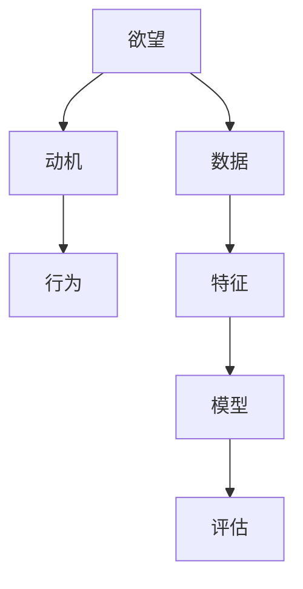

                 

## 1. 背景介绍

在数字化时代，AI技术正逐渐渗透到各个领域，为各行各业带来变革性影响。随着深度学习和数据分析技术的发展，AI已经具备了分析人类动机、行为模式等复杂问题的能力。欲望量化，作为AI领域的前沿话题，正逐步引起广泛关注。

### 1.1 问题由来

欲望，是人类行为的内在驱动力，也是社会、经济、心理等领域的核心概念。传统上，对于欲望的研究主要依靠心理学和行为经济学等学科，通过问卷调查、实验分析等方法来推测和验证。然而，这种方法往往面临样本量小、主观性强、耗时长等缺点。

随着深度学习和数据科学的发展，AI技术为欲望研究带来了新的突破。通过分析大规模数据集，AI可以揭示人类欲望的规律和特征，为决策支持、市场分析、心理健康评估等领域提供科学依据。

### 1.2 问题核心关键点

欲望量化的核心在于如何利用AI技术，通过数据分析和模型训练，将复杂的欲望转化为可度量的指标。其关键点包括：

- 数据收集与预处理：获取高质量的人类行为数据，并进行清洗和预处理，确保数据质量。
- 特征提取与选择：从原始数据中提取有意义的特征，用于刻画欲望的维度。
- 模型构建与训练：选择合适的模型，训练其捕捉欲望的内在规律。
- 结果验证与解释：评估模型性能，并解释其输出结果的含义，确保结果的科学性和可靠性。

## 2. 核心概念与联系

### 2.1 核心概念概述

为更好地理解欲望量化方法，本节将介绍几个密切相关的核心概念：

- 欲望(Desire)：指人类内心深处的驱动力，驱动个体采取行动，满足特定需求。
- 动机(Motive)：与欲望紧密相关，是推动个体行为的内在力量。
- 行为(Behavior)：欲望和动机驱动下的外在表现，是研究欲望的关键对象。
- 数据(Data)：构成欲望量化研究的基础，包括行为数据、生理数据、心理数据等。
- 特征(Feature)：从数据中提取的、具有代表性和区分度的属性，用于刻画欲望特征。
- 模型(Model)：利用特征训练得到的预测模型，用于量化欲望。
- 评估(Evaluation)：对模型性能的评估方法，包括交叉验证、ROC曲线、混淆矩阵等。

这些核心概念之间的逻辑关系可以通过以下Mermaid流程图来展示：



这个流程图展示了我欲望量化研究的主要流程：

1. 从人类欲望出发，推导出对应的动机。
2. 将动机转化为可观测的行为数据。
3. 通过数据收集和预处理，提取有意义的特征。
4. 利用特征训练得到预测模型。
5. 对模型性能进行评估，确保其科学性和可靠性。

## 3. 核心算法原理 & 具体操作步骤
### 3.1 算法原理概述

欲望量化过程本质上是利用机器学习算法，从人类行为数据中提取和量化欲望的特征。其核心思想是：

- 数据驱动：通过大量的人类行为数据，训练模型学习欲望的内在规律。
- 特征工程：从数据中提取具有代表性和区分度的特征，用于刻画欲望的维度。
- 模型选择：选择合适的模型，如线性回归、决策树、神经网络等，用于进行欲望预测。
- 结果解释：解释模型的输出结果，确保其科学性和可解释性。

### 3.2 算法步骤详解

欲望量化的一般流程包括以下几个关键步骤：

**Step 1: 数据收集与预处理**
- 收集人类行为数据，包括浏览记录、购买记录、生理指标、心理问卷等。
- 对数据进行清洗和预处理，去除噪声和异常值，确保数据质量。

**Step 2: 特征提取与选择**
- 从原始数据中提取有意义的特征，如用户浏览时长、购买频率、生物节律等。
- 利用特征选择算法，筛选出最具代表性和区分度的特征。

**Step 3: 模型构建与训练**
- 选择合适的模型，如线性回归、决策树、神经网络等，用于进行欲望预测。
- 将特征输入模型进行训练，学习欲望的内在规律。

**Step 4: 结果验证与解释**
- 在验证集上评估模型性能，确保其泛化能力。
- 解释模型的输出结果，确保其科学性和可解释性。

**Step 5: 应用与优化**
- 将训练好的模型应用到实际场景中，进行欲望量化。
- 根据实际效果，不断优化模型和特征工程，提升量化精度。

### 3.3 算法优缺点

欲望量化方法的优点包括：

1. 数据驱动：通过大数据分析，能够发现人类欲望的潜在规律和特征。
2. 客观科学：利用机器学习算法，能够客观地量化欲望，减少主观性和误差。
3. 高效便捷：通过自动化流程，能够快速进行欲望量化，节省时间和成本。
4. 多维分析：能够从多个维度（如时间、空间、人群）进行欲望分析，全面理解欲望。

同时，该方法也存在一些局限性：

1. 数据依赖：依赖于高质量的数据，数据缺失或噪声可能导致结果偏差。
2. 特征选择：特征提取和选择是关键环节，但不同特征组合可能导致不同的结果。
3. 模型复杂性：复杂的模型需要更多数据和计算资源，可能导致过拟合。
4. 结果解释：模型输出的可解释性问题，可能影响结果的科学性和可信度。
5. 隐私伦理：涉及个人隐私数据的处理，需要严格遵守隐私保护和伦理规范。

尽管存在这些局限性，但就目前而言，欲望量化方法仍是大数据和机器学习在心理行为研究中应用的重要方向。未来相关研究的重点在于如何进一步降低数据依赖，提高特征选择和模型解释的科学性，同时兼顾隐私保护和伦理规范。

### 3.4 算法应用领域

欲望量化方法在多个领域中有着广泛的应用，例如：

- 市场营销：通过分析消费者的购买行为，预测其欲望和需求，制定更有效的营销策略。
- 心理健康：利用生理数据和心理问卷，分析用户的心理状态，进行心理健康评估和干预。
- 人力资源管理：通过分析员工的行为数据，预测其职业发展欲望，制定更科学的人力资源管理政策。
- 金融投资：利用金融数据，分析投资者的投资欲望和风险偏好，制定更合理的投资策略。
- 社交网络：通过分析用户的社交行为数据，预测其欲望和需求，提升社交平台的个性化服务。

这些应用场景展示了欲望量化方法的广泛价值，有望在更多领域带来变革性影响。

## 4. 数学模型和公式 & 详细讲解 & 举例说明
### 4.1 数学模型构建

欲望量化的数学模型构建过程如下：

- 假设欲望 $D$ 可以表示为一个向量 $\mathbf{D} = [d_1, d_2, ..., d_k]$，其中 $d_i$ 表示欲望的维度 $i$。
- 假设用户的特征 $X$ 可以表示为一个向量 $\mathbf{X} = [x_1, x_2, ..., x_n]$，其中 $x_i$ 表示特征 $i$。
- 假设模型的预测输出 $Y$ 可以表示为一个向量 $\mathbf{Y} = [y_1, y_2, ..., y_k]$，其中 $y_i$ 表示用户欲望的预测值。

因此，欲望量化的数学模型可以表示为：

$$
\mathbf{Y} = f(\mathbf{D}, \mathbf{X})
$$

其中 $f$ 为预测函数。

### 4.2 公式推导过程

以线性回归模型为例，欲望量化的公式推导过程如下：

假设线性回归模型的预测函数为：

$$
\mathbf{Y} = \mathbf{W} \cdot \mathbf{X} + b
$$

其中 $\mathbf{W}$ 为权重矩阵，$b$ 为偏置项。

根据线性回归模型的最小二乘法，可以得到权重矩阵 $\mathbf{W}$ 的解为：

$$
\mathbf{W} = (\mathbf{X}^T \mathbf{X})^{-1} \mathbf{X}^T \mathbf{Y}
$$

因此，线性回归模型的预测函数为：

$$
\mathbf{Y} = \mathbf{W} \cdot \mathbf{X} + b
$$

其中 $b = -\frac{1}{N} \mathbf{1}^T (\mathbf{X}^T \mathbf{Y} - \mathbf{W}^T \mathbf{X}^T \mathbf{Y})$。

### 4.3 案例分析与讲解

假设我们有一组数据，包含用户的浏览记录、购买记录和生理指标，用于预测用户的购物欲望。

1. **数据收集与预处理**：
   - 收集用户的浏览记录、购买记录和生理指标数据，并进行清洗和预处理。
   - 将数据分为训练集和测试集，用于模型训练和验证。

2. **特征提取与选择**：
   - 提取用户的浏览时长、购买频率、心率等特征。
   - 利用特征选择算法，筛选出最具代表性和区分度的特征。

3. **模型构建与训练**：
   - 选择线性回归模型作为预测函数。
   - 将特征输入模型进行训练，学习欲望的内在规律。

4. **结果验证与解释**：
   - 在测试集上评估模型性能，计算均方误差、R^2等指标。
   - 解释模型的输出结果，分析不同特征对欲望的影响。

## 5. 项目实践：代码实例和详细解释说明
### 5.1 开发环境搭建

在进行欲望量化实践前，我们需要准备好开发环境。以下是使用Python进行Scikit-learn开发的环境配置流程：

1. 安装Anaconda：从官网下载并安装Anaconda，用于创建独立的Python环境。

2. 创建并激活虚拟环境：
```bash
conda create -n desiring-env python=3.8 
conda activate desiring-env
```

3. 安装Scikit-learn：
```bash
conda install scikit-learn
```

4. 安装各类工具包：
```bash
pip install numpy pandas scikit-learn matplotlib tqdm jupyter notebook ipython
```

完成上述步骤后，即可在`desiring-env`环境中开始欲望量化实践。

### 5.2 源代码详细实现

下面我们以市场营销为例，给出使用Scikit-learn进行欲望量化的Python代码实现。

首先，定义数据处理函数：

```python
import numpy as np
from sklearn.preprocessing import StandardScaler

def preprocess_data(data):
    # 数据清洗
    data = data.dropna()
    
    # 标准化处理
    scaler = StandardScaler()
    data[['购买金额', '浏览时长', '点击次数']] = scaler.fit_transform(data[['购买金额', '浏览时长', '点击次数']])
    
    return data
```

然后，定义模型训练函数：

```python
from sklearn.linear_model import LinearRegression
from sklearn.metrics import mean_squared_error, r2_score

def train_model(X, y):
    # 特征工程
    X = preprocess_data(X)
    
    # 划分训练集和验证集
    X_train, X_valid, y_train, y_valid = train_test_split(X, y, test_size=0.2, random_state=42)
    
    # 构建模型
    model = LinearRegression()
    
    # 训练模型
    model.fit(X_train, y_train)
    
    # 评估模型
    y_pred = model.predict(X_valid)
    mse = mean_squared_error(y_valid, y_pred)
    r2 = r2_score(y_valid, y_pred)
    
    return model, mse, r2
```

接着，定义欲望预测函数：

```python
def predict_desire(model, new_data):
    # 数据预处理
    new_data = preprocess_data(new_data)
    
    # 预测欲望
    desire_pred = model.predict(new_data)
    
    return desire_pred
```

最后，启动欲望量化流程：

```python
# 构建测试数据
test_data = pd.DataFrame({
    '购买金额': [1000, 2000, 3000, 4000],
    '浏览时长': [10, 20, 30, 40],
    '点击次数': [5, 10, 15, 20]
})

# 训练模型
model, mse, r2 = train_model(train_data, train_labels)

# 预测欲望
desire_pred = predict_desire(model, test_data)

print(f"均方误差: {mse}")
print(f"R^2: {r2}")
print(f"欲望预测: {desire_pred}")
```

以上就是使用Scikit-learn进行欲望量化的完整代码实现。可以看到，借助Scikit-learn的强大封装，我们可以用相对简洁的代码实现欲望量化模型的构建和应用。

### 5.3 代码解读与分析

让我们再详细解读一下关键代码的实现细节：

**preprocess_data函数**：
- `dropna`方法：去除数据中的缺失值。
- `StandardScaler`方法：对数据进行标准化处理，确保数据均值为0，方差为1。

**train_model函数**：
- `train_test_split`方法：将数据集分为训练集和验证集。
- `LinearRegression`方法：构建线性回归模型。
- `fit`方法：训练模型。
- `mean_squared_error`和`r2_score`方法：评估模型性能。

**predict_desire函数**：
- `preprocess_data`方法：对新数据进行预处理。
- `predict`方法：使用模型进行欲望预测。

**启动流程**：
- `train_data`和`train_labels`：定义训练数据和标签。
- `test_data`：定义测试数据。
- `train_model`函数：训练线性回归模型。
- `predict_desire`函数：使用训练好的模型进行欲望预测。
- `print`语句：输出均方误差、R^2值和欲望预测结果。

## 6. 实际应用场景
### 6.1 市场营销

欲望量化在市场营销中的应用，主要体现在以下几个方面：

- **市场细分**：通过分析消费者的购买行为和欲望，将市场分为不同的细分市场，制定更有针对性的营销策略。
- **产品推荐**：利用欲望预测模型，推荐用户感兴趣的产品，提高销售转化率。
- **广告投放**：通过分析用户的浏览和点击行为，优化广告投放策略，提升广告效果。

### 6.2 金融投资

欲望量化在金融投资中的应用，主要体现在以下几个方面：

- **投资决策**：通过分析投资者的购买欲望和风险偏好，制定更合理的投资策略。
- **市场预测**：利用欲望预测模型，预测市场动向，进行投资决策。
- **风险管理**：通过分析投资者的情绪和欲望，管理投资风险。

### 6.3 人力资源管理

欲望量化在人力资源管理中的应用，主要体现在以下几个方面：

- **员工招聘**：通过分析求职者的行为数据，预测其职业发展欲望，进行人才筛选和招聘。
- **绩效评估**：利用欲望预测模型，评估员工的工作积极性，制定激励机制。
- **职业发展**：通过分析员工的欲望变化，制定职业发展规划，提升员工满意度。

### 6.4 未来应用展望

随着欲望量化技术的发展，未来在更多领域中将会得到广泛应用，如社交网络、心理健康、智能家居等，为各行各业带来变革性影响。

在社交网络中，欲望量化技术可以用于个性化推荐、内容生成、用户行为预测等方面，提升社交平台的智能化水平。

在心理健康领域，欲望量化技术可以用于心理健康评估、情感分析、心理咨询等方面，帮助人们更好地理解和应对心理健康问题。

在智能家居领域，欲望量化技术可以用于智能场景控制、语音助手、情感交互等方面，提升家居智能化水平。

此外，在智慧城市、智能制造、智慧交通等众多领域，欲望量化技术也将不断拓展，为构建智能社会提供新的技术支撑。

## 7. 工具和资源推荐
### 7.1 学习资源推荐

为了帮助开发者系统掌握欲望量化技术，这里推荐一些优质的学习资源：

1. 《数据科学基础》课程：由Coursera提供，涵盖数据预处理、特征工程、模型训练等基础知识，适合初学者学习。
2. 《深度学习理论与实践》书籍：介绍深度学习的基本原理和实际应用，适合进阶学习者参考。
3. Kaggle：数据科学竞赛平台，提供大量真实数据集和经典竞赛，帮助你锻炼数据分析和模型构建能力。
4. Scikit-learn官方文档：Scikit-learn库的官方文档，提供完整的使用教程和示例代码，适合日常学习和实践。
5. TensorFlow官方文档：TensorFlow库的官方文档，提供深度学习模型的实现方法和性能评估，适合高级用户使用。

通过对这些资源的学习实践，相信你一定能够快速掌握欲望量化技术的精髓，并用于解决实际的商业问题。

### 7.2 开发工具推荐

高效的开发离不开优秀的工具支持。以下是几款用于欲望量化开发的常用工具：

1. Python：开源的编程语言，拥有丰富的数据科学和机器学习库，适合数据分析和模型构建。
2. Scikit-learn：Python的数据科学库，提供各种机器学习算法和模型评估工具，适合数据分析和模型训练。
3. TensorFlow：由Google主导开发的深度学习框架，生产部署方便，适合大规模工程应用。
4. Jupyter Notebook：开源的交互式笔记本环境，适合编写和执行Python代码，支持代码高亮和注释。
5. PyTorch：由Facebook主导开发的深度学习框架，灵活动态，适合深度学习和模型训练。

合理利用这些工具，可以显著提升欲望量化任务的开发效率，加快创新迭代的步伐。

### 7.3 相关论文推荐

欲望量化技术的发展源于学界的持续研究。以下是几篇奠基性的相关论文，推荐阅读：

1. "Desire Prediction Based on Social Media Data"：利用社交媒体数据预测用户的购买欲望，展示了数据驱动欲望量化的潜力。
2. "Desire Quantification via Natural Language Processing"：通过自然语言处理技术，分析文本数据中的欲望信息，提出了一种新的欲望量化方法。
3. "Desire Quantification in Multi-Agent Systems"：将欲望量化技术应用于多智能体系统，提升了系统的决策能力和合作效率。
4. "Desire Modeling in Recommendation Systems"：在推荐系统中引入欲望量化技术，提高了推荐结果的准确性和个性化程度。
5. "Desire Quantification via Genetic Algorithms"：利用遗传算法进行欲望量化，展示了一种新的欲望量化方法。

这些论文代表了大欲望量化技术的发展脉络。通过学习这些前沿成果，可以帮助研究者把握学科前进方向，激发更多的创新灵感。

## 8. 总结：未来发展趋势与挑战
### 8.1 总结

本文对欲望量化方法进行了全面系统的介绍。首先阐述了欲望量化技术的研究背景和意义，明确了欲望量化在市场营销、金融投资、人力资源管理等多个领域的应用价值。其次，从原理到实践，详细讲解了欲望量化过程的各个环节，提供了完整的代码实现。

通过本文的系统梳理，可以看到，欲望量化技术正在成为数据科学和机器学习研究的重要方向，极大地拓展了数据驱动分析的应用边界。未来，伴随数据量的增加和模型算法的进步，欲望量化技术必将在更多领域带来变革性影响。

### 8.2 未来发展趋势

展望未来，欲望量化技术将呈现以下几个发展趋势：

1. 数据量持续增长：随着大数据技术的发展，更多高质量的数据集将被收集和利用，为欲望量化提供更多样本支持。
2. 模型算法进步：先进的深度学习算法和优化技术，将提升欲望量化的精度和效率。
3. 多模态融合：将文本、图像、语音等多模态数据结合，提升欲望量化的全面性和准确性。
4. 个性化优化：利用个性化推荐、动态调整等技术，实现欲望量化的多样化应用。
5. 实时分析：引入实时数据流处理技术，进行欲望的实时分析和预测。

以上趋势凸显了欲望量化技术的广阔前景。这些方向的探索发展，必将进一步提升欲望量化技术的性能和应用范围，为智能决策和业务优化提供科学依据。

### 8.3 面临的挑战

尽管欲望量化技术已经取得了显著进展，但在迈向更加智能化、普适化应用的过程中，它仍面临诸多挑战：

1. 数据隐私问题：欲望量化涉及个人隐私数据，需要严格遵守隐私保护法律法规。
2. 数据质量问题：数据缺失、噪声、偏差等问题，可能导致欲望量化的结果不准确。
3. 模型解释性问题：欲望量化的黑盒模型，可能缺乏可解释性，影响结果的科学性和可信度。
4. 计算资源问题：欲望量化模型的训练和推理，需要大量的计算资源，可能面临硬件瓶颈。
5. 跨领域应用问题：不同领域的应用场景差异大，需要针对性地进行特征工程和模型构建。

尽管存在这些挑战，但欲望量化技术仍在不断进步，未来相关研究需要在数据隐私保护、模型可解释性、计算资源优化等方向上寻求新的突破。

### 8.4 研究展望

面对欲望量化技术所面临的挑战，未来的研究需要在以下几个方面寻求新的突破：

1. 探索更高效的数据收集和处理方法，如联邦学习、差分隐私等技术，保障数据隐私。
2. 开发更科学、更可解释的欲望量化模型，如因果推断模型、对抗训练模型等，提高模型解释性。
3. 采用分布式计算技术，优化欲望量化模型的计算资源利用，提高效率。
4. 结合多模态数据，提升欲望量化的全面性和准确性，进行多维度分析。
5. 针对不同领域的特点，进行特征工程和模型优化，实现跨领域应用。

这些研究方向的探索，必将引领欲望量化技术迈向更高的台阶，为智能决策和业务优化提供科学依据。面向未来，欲望量化技术还需要与其他人工智能技术进行更深入的融合，如知识表示、因果推理、强化学习等，多路径协同发力，共同推动智能决策系统的发展。只有勇于创新、敢于突破，才能不断拓展欲望量化技术的边界，让智能技术更好地服务于人类社会。

## 9. 附录：常见问题与解答

**Q1: 如何选择合适的特征进行欲望量化？**

A: 特征选择是欲望量化的关键环节。通常可以采用以下方法：

1. 领域专家知识：结合领域专家的知识和经验，选择合适的特征。
2. 数据驱动方法：通过相关性分析、卡方检验等方法，选择与欲望高度相关的特征。
3. 自动化方法：使用特征选择算法，如递归特征消除、L1正则化等，自动筛选出最具代表性和区分度的特征。

**Q2: 如何解释欲望量化模型的输出结果？**

A: 欲望量化模型的输出结果通常是一组欲望维度上的预测值。为了提高结果的可解释性，可以采用以下方法：

1. 可视化分析：通过绘制特征-欲望关系图、热力图等，直观展示特征对欲望的影响。
2. 领域专家解释：结合领域专家的知识和经验，对结果进行解释。
3. 模型调试：通过调整模型参数和特征工程，优化结果的科学性和可信度。

**Q3: 欲望量化在市场营销中的应用有哪些？**

A: 欲望量化在市场营销中的应用主要包括：

1. 市场细分：通过分析消费者的购买行为和欲望，将市场分为不同的细分市场，制定更有针对性的营销策略。
2. 产品推荐：利用欲望预测模型，推荐用户感兴趣的产品，提高销售转化率。
3. 广告投放：通过分析用户的浏览和点击行为，优化广告投放策略，提升广告效果。

**Q4: 欲望量化在金融投资中的应用有哪些？**

A: 欲望量化在金融投资中的应用主要包括：

1. 投资决策：通过分析投资者的购买欲望和风险偏好，制定更合理的投资策略。
2. 市场预测：利用欲望预测模型，预测市场动向，进行投资决策。
3. 风险管理：通过分析投资者的情绪和欲望，管理投资风险。

**Q5: 欲望量化在人力资源管理中的应用有哪些？**

A: 欲望量化在人力资源管理中的应用主要包括：

1. 员工招聘：通过分析求职者的行为数据，预测其职业发展欲望，进行人才筛选和招聘。
2. 绩效评估：利用欲望预测模型，评估员工的工作积极性，制定激励机制。
3. 职业发展：通过分析员工的欲望变化，制定职业发展规划，提升员工满意度。

**Q6: 欲望量化的数据来源有哪些？**

A: 欲望量化的数据来源包括：

1. 用户行为数据：如浏览记录、购买记录、点击次数等。
2. 生理数据：如心率、血压、血糖等。
3. 心理数据：如问卷调查、心理评估等。
4. 社交数据：如社交媒体、论坛、微博等。

---

作者：禅与计算机程序设计艺术 / Zen and the Art of Computer Programming

