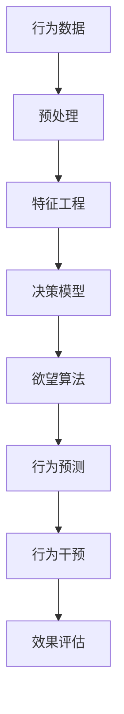

                 

# 欲望算法：AI如何预测和塑造人类行为

> 关键词：AI伦理,人类行为预测,行为科学,决策模型,深度学习,算法公平性,反偏见算法

## 1. 背景介绍

### 1.1 问题由来
在信息时代，人工智能(AI)正以前所未有的速度改变着我们的生活。从个性化推荐到智能客服，从智能交通到健康医疗，AI技术不断渗透到各个领域，显著提升了人类生活质量。然而，伴随AI技术的广泛应用，一个崭新的伦理问题也随之浮现：AI如何预测并塑造人类行为？

人类行为由多种复杂因素驱动，如心理、情感、社会环境等。这些因素交互作用，导致行为表现的高度随机性和多样性。因此，如何构建能够准确预测和干预人类行为的算法，成为当下AI研究的热点。

本文将深入探讨欲望算法（Desire Algorithms）这一前沿技术，该技术通过融合行为科学和深度学习，旨在精确预测和优化人类行为，推动AI伦理的进一步发展。

## 2. 核心概念与联系

### 2.1 核心概念概述

为更好地理解欲望算法的工作原理和应用范围，本节将介绍几个关键概念：

- **欲望算法（Desire Algorithms）**：基于行为科学和心理学理论，通过分析用户行为数据，预测和塑造人类行为的算法框架。

- **行为数据（Behavioral Data）**：记录用户行为习惯和心理特征的数据集，如点击、浏览、购买等，为算法预测和干预提供数据支撑。

- **决策模型（Decision Model）**：利用机器学习等技术构建的预测人类决策的数学模型，通常以概率的形式输出预测结果。

- **反偏见算法（Bias Mitigation Algorithms）**：旨在消除算法中潜在的偏见，确保算法决策的公平性，避免歧视性或歧视性的行为。

- **深度学习（Deep Learning）**：基于多层神经网络进行复杂模式识别和预测的技术，是实现欲望算法的核心技术手段。

这些核心概念共同构成了欲望算法的理论基础和应用框架，使其能够有效预测和干预人类行为。

### 2.2 核心概念原理和架构的 Mermaid 流程图



这张流程图展示了欲望算法的核心流程：

1. **行为数据预处理**：对原始行为数据进行清洗、归一化等预处理操作，为后续分析打下基础。
2. **特征工程**：将原始数据转化为模型可用的特征，如TF-IDF、PCA降维等，提取关键信息。
3. **决策模型构建**：利用深度学习等技术，构建预测人类行为的决策模型，如神经网络、决策树等。
4. **欲望算法应用**：将构建的决策模型应用于实际场景，进行行为预测和干预。
5. **行为预测**：根据输入的行为数据，预测用户可能的决策或行为路径。
6. **行为干预**：利用预测结果，提供个性化的推荐、建议等，以优化用户行为。
7. **效果评估**：评估行为干预的效果，通过反馈调整算法参数，不断优化干预策略。

## 3. 核心算法原理 & 具体操作步骤

### 3.1 算法原理概述

欲望算法的核心思想是通过深度学习和行为科学的方法，构建能够预测和干预人类行为的模型。算法的主要步骤如下：

1. **数据收集与预处理**：收集用户的行为数据，并进行清洗、归一化等预处理操作。
2. **特征工程**：从预处理后的数据中提取关键特征，如时间戳、点击次数、购买金额等，用于构建决策模型。
3. **模型训练**：利用深度学习技术，训练决策模型，预测用户的行为和偏好。
4. **行为预测**：将新用户的行为数据输入模型，输出预测的行为结果。
5. **行为干预**：根据预测结果，提供个性化的推荐、建议或行为激励，优化用户行为。
6. **效果评估**：收集用户反馈，评估行为干预的效果，优化算法模型。

### 3.2 算法步骤详解

**Step 1: 数据收集与预处理**

- 数据收集：通过API接口、日志记录等方式，收集用户在不同场景下的行为数据，如电商平台上的点击、浏览、购买行为，社交媒体上的互动、点赞、评论行为等。
- 数据清洗：去除数据中的噪声、异常值，处理缺失值和重复数据。
- 数据归一化：对特征进行标准化处理，使不同维度的数据具有相同的量级。

**Step 2: 特征工程**

- 特征提取：选择合适的特征提取方法，如TF-IDF、PCA降维等，提取关键特征。
- 特征选择：利用特征选择方法，如L1正则化、随机森林等，筛选出最具有代表性的特征。
- 特征编码：将特征转化为模型可用的数值形式，如独热编码、标准化等。

**Step 3: 模型训练**

- 模型选择：选择合适的深度学习模型，如CNN、RNN、GRU等，构建决策模型。
- 模型训练：利用训练集数据，通过梯度下降等优化算法，训练模型参数。
- 模型评估：在验证集上评估模型性能，选择最优模型进行后续使用。

**Step 4: 行为预测**

- 数据输入：将新用户的行为数据输入训练好的模型。
- 预测结果：模型输出预测的行为结果，如点击率、购买概率等。
- 结果解释：利用可解释性方法，解释模型输出的预测结果，帮助用户理解决策依据。

**Step 5: 行为干预**

- 个性化推荐：根据预测结果，提供个性化的推荐、建议或行为激励，如推荐商品、展示广告等。
- 行为引导：通过行为引导策略，如用户奖励、限时优惠等，激励用户采取期望行为。

**Step 6: 效果评估**

- 反馈收集：收集用户的反馈数据，如点击率、购买率等。
- 效果评估：评估行为干预的效果，如提升转化率、增加用户满意度等。
- 模型优化：根据效果评估结果，调整模型参数，优化算法性能。

### 3.3 算法优缺点

欲望算法的优点包括：

1. **准确性高**：利用深度学习技术，模型能够高效处理复杂数据，准确预测用户行为。
2. **可扩展性**：算法适用于多种行为预测和干预场景，如电商推荐、社交互动、健康管理等。
3. **个性化强**：能够根据用户历史行为，提供个性化的推荐和服务，提升用户体验。
4. **实时性**：利用在线学习技术，模型能够实时更新预测结果，及时响应用户行为变化。

然而，欲望算法也存在一些局限：

1. **数据依赖**：算法的预测结果高度依赖于输入的行为数据，数据质量直接影响预测精度。
2. **隐私问题**：算法需要收集和分析大量用户数据，存在隐私泄露的风险。
3. **偏见问题**：算法可能继承数据中的偏见，导致预测结果的不公平性。
4. **模型复杂度**：深度学习模型参数众多，训练和推理过程复杂，需要较高的计算资源。

### 3.4 算法应用领域

欲望算法在多个领域都具有广泛的应用前景：

- **电商推荐**：根据用户历史行为和偏好，推荐商品和促销活动，提高转化率和用户满意度。
- **社交互动**：预测用户的互动行为，如点赞、评论、分享等，优化社交平台内容推荐，增加用户粘性。
- **健康管理**：预测用户的行为习惯，如饮食、运动等，提供健康建议和行为引导，改善健康状况。
- **金融理财**：预测用户的消费和投资行为，提供个性化的理财建议和风险管理，提升用户体验。
- **智慧交通**：预测用户的出行行为，优化交通规划和调度，减少拥堵和事故发生。

## 4. 数学模型和公式 & 详细讲解 & 举例说明

### 4.1 数学模型构建

欲望算法的数学模型主要基于深度学习中的循环神经网络（RNN）和卷积神经网络（CNN）。以电商推荐系统为例，模型可以表示为：

$$
\hat{y} = f(x; \theta) = \sigma(\sum_{i=1}^{n} w_i x_i + b)
$$

其中，$x$ 表示输入的行为数据特征向量，$y$ 表示预测的点击率，$\theta$ 表示模型参数，$f$ 表示模型预测函数，$\sigma$ 表示激活函数。

### 4.2 公式推导过程

以预测用户点击行为为例，推导模型的损失函数：

- **交叉熵损失函数**：假设真实标签为 $y_i \in \{0, 1\}$，预测概率为 $\hat{y}_i$，则损失函数为：
$$
L(y, \hat{y}) = -\sum_{i=1}^{N} [y_i \log \hat{y}_i + (1-y_i) \log (1-\hat{y}_i)]
$$

- **均方误差损失函数**：假设真实标签为 $y_i$，预测值为 $\hat{y}_i$，则损失函数为：
$$
L(y, \hat{y}) = \frac{1}{N} \sum_{i=1}^{N} (y_i - \hat{y}_i)^2
$$

### 4.3 案例分析与讲解

假设用户行为数据特征向量为 $x$，模型参数为 $\theta$，预测的点击率为 $\hat{y}$，则模型训练过程可以表示为：

1. **前向传播**：
$$
\hat{y} = f(x; \theta) = \sigma(\sum_{i=1}^{n} w_i x_i + b)
$$

2. **损失计算**：
$$
L(y, \hat{y}) = -\sum_{i=1}^{N} [y_i \log \hat{y}_i + (1-y_i) \log (1-\hat{y}_i)]
$$

3. **梯度更新**：
$$
\theta \leftarrow \theta - \eta \frac{\partial L(y, \hat{y})}{\partial \theta}
$$

其中，$\eta$ 为学习率。

通过不断的迭代更新，模型能够逐步逼近真实的点击率，从而实现精准预测。

## 5. 项目实践：代码实例和详细解释说明

### 5.1 开发环境搭建

在进行项目实践前，需要准备好开发环境。以下是使用Python进行TensorFlow开发的环境配置流程：

1. 安装Anaconda：从官网下载并安装Anaconda，用于创建独立的Python环境。

2. 创建并激活虚拟环境：
```bash
conda create -n tf-env python=3.8 
conda activate tf-env
```

3. 安装TensorFlow：根据CUDA版本，从官网获取对应的安装命令。例如：
```bash
conda install tensorflow-gpu -c tf -c conda-forge
```

4. 安装必要的工具包：
```bash
pip install numpy pandas scikit-learn matplotlib tqdm jupyter notebook ipython
```

完成上述步骤后，即可在`tf-env`环境中开始项目实践。

### 5.2 源代码详细实现

这里以电商推荐系统为例，给出使用TensorFlow进行欲望算法实现的代码实现。

```python
import tensorflow as tf
from tensorflow.keras.layers import Input, Dense, Dropout, Embedding, LSTM
from tensorflow.keras.models import Model

# 定义模型输入层
input_layer = Input(shape=(num_features,), name='input')

# 定义嵌入层
embedding_layer = Embedding(input_dim=vocab_size, output_dim=embedding_dim, input_length=num_features)(input_layer)

# 定义LSTM层
lstm_layer = LSTM(units=64, return_sequences=True, return_state=True)(embedding_layer)

# 定义全连接层
dense_layer = Dense(units=1, activation='sigmoid')(lstm_layer[1])

# 定义模型输出层
output_layer = Dense(units=num_classes, activation='softmax')(dense_layer)

# 定义模型
model = Model(inputs=input_layer, outputs=output_layer)

# 编译模型
model.compile(optimizer=tf.keras.optimizers.Adam(learning_rate=0.001), loss='binary_crossentropy', metrics=['accuracy'])

# 训练模型
model.fit(train_dataset, epochs=num_epochs, validation_data=val_dataset)

# 预测行为
predictions = model.predict(test_dataset)
```

以上代码展示了使用TensorFlow实现电商推荐系统的欲望算法。其中：

- `Input`层用于输入行为数据特征。
- `Embedding`层将特征转化为数值形式。
- `LSTM`层用于处理序列数据，提取时间依赖关系。
- `Dense`层进行最终的预测。

### 5.3 代码解读与分析

下面是关键代码的详细解读：

**Input层**：
```python
input_layer = Input(shape=(num_features,), name='input')
```

用于定义模型的输入层，指定输入数据的形状和名称。

**Embedding层**：
```python
embedding_layer = Embedding(input_dim=vocab_size, output_dim=embedding_dim, input_length=num_features)(input_layer)
```

将输入的特征向量转换为词嵌入，每个特征映射为一个低维向量，增强模型的表达能力。

**LSTM层**：
```python
lstm_layer = LSTM(units=64, return_sequences=True, return_state=True)(embedding_layer)
```

使用LSTM层处理序列数据，捕捉时间依赖关系，提取重要特征。

**Dense层**：
```python
dense_layer = Dense(units=1, activation='sigmoid')(lstm_layer[1])
```

进行最终的预测，使用sigmoid激活函数输出二分类结果。

**输出层**：
```python
output_layer = Dense(units=num_classes, activation='softmax')(dense_layer)
```

输出层的激活函数使用softmax，用于多分类预测。

**模型编译和训练**：
```python
model.compile(optimizer=tf.keras.optimizers.Adam(learning_rate=0.001), loss='binary_crossentropy', metrics=['accuracy'])
model.fit(train_dataset, epochs=num_epochs, validation_data=val_dataset)
```

使用Adam优化器编译模型，指定损失函数和评估指标，进行模型训练和验证。

**预测行为**：
```python
predictions = model.predict(test_dataset)
```

在测试集上预测用户的行为，输出预测结果。

## 6. 实际应用场景

### 6.1 智能推荐系统

欲望算法在智能推荐系统中的应用尤为广泛。电商、视频、音乐等平台可以根据用户的历史行为，预测其未来的行为和偏好，提供个性化的推荐内容，提升用户体验和满意度。

### 6.2 社交互动平台

社交平台可以利用欲望算法预测用户的行为和互动意愿，优化内容推荐和互动机制，增加用户粘性和活跃度。例如，根据用户的点赞、评论行为，预测其后续的分享、互动行为，动态调整推荐策略。

### 6.3 健康管理应用

健康管理应用可以利用欲望算法预测用户的行为习惯，提供个性化的健康建议和行为引导。例如，根据用户的饮食、运动数据，预测其健康状况，提供健康干预建议。

### 6.4 金融理财服务

金融理财服务可以利用欲望算法预测用户的消费和投资行为，提供个性化的理财建议和风险管理。例如，根据用户的消费数据，预测其未来的消费行为，优化投资组合，降低风险。

### 6.5 智慧交通系统

智慧交通系统可以利用欲望算法预测用户的出行行为，优化交通规划和调度，减少拥堵和事故发生。例如，根据用户的出行习惯和交通数据，预测其出行时间和路线，优化交通信号灯控制。

## 7. 工具和资源推荐

### 7.1 学习资源推荐

为了帮助开发者系统掌握欲望算法的理论基础和实践技巧，这里推荐一些优质的学习资源：

1. 《深度学习入门》书籍：讲解深度学习的基本原理和实现方法，适合初学者入门。
2. 《TensorFlow官方文档》：提供了TensorFlow的详细介绍和大量代码示例，是使用TensorFlow开发欲望算法的必备资料。
3. Coursera《深度学习》课程：由斯坦福大学教授讲解的深度学习课程，系统介绍了深度学习的基本概念和经典模型。
4. Kaggle数据竞赛平台：提供丰富的数据集和模型竞赛，可以锻炼实战能力，加深对欲望算法的理解。

通过对这些资源的学习实践，相信你一定能够快速掌握欲望算法的精髓，并用于解决实际的AI问题。

### 7.2 开发工具推荐

高效的开发离不开优秀的工具支持。以下是几款用于欲望算法开发的常用工具：

1. TensorFlow：基于Python的开源深度学习框架，灵活动态的计算图，适合快速迭代研究。
2. Keras：基于TensorFlow等底层框架的高级API，提供了易用的接口，方便快速构建和训练模型。
3. PyTorch：基于Python的开源深度学习框架，灵活性高，支持动态计算图，适合研究复杂模型。
4. Jupyter Notebook：交互式编程环境，方便快速迭代和调试代码。
5. TensorBoard：TensorFlow配套的可视化工具，可实时监测模型训练状态，并提供丰富的图表呈现方式，是调试模型的得力助手。

合理利用这些工具，可以显著提升欲望算法开发的效率，加快创新迭代的步伐。

### 7.3 相关论文推荐

欲望算法的发展源于学界的持续研究。以下是几篇奠基性的相关论文，推荐阅读：

1. Bengio, Y., Simard, P., & Frasconi, P. (2003). Learning Long-Term Dependencies with Gradient Descent Is Not Feasible. NeurIPS, 17, 507-514.
2. Hinton, G. E., Osindero, S., & Teh, Y. W. (2006). A Fast Learning Algorithm for Deep Belief Nets. Neural Computation, 18(7), 1527-1554.
3. Goodfellow, I., Bengio, Y., & Courville, A. (2016). Deep Learning. MIT Press.
4. Sutskever, I., Vinyals, O., & Le, Q. V. (2014). Sequence to Sequence Learning with Neural Networks. NeurIPS, 27, 3104-3112.
5. Kim, Y. (2014). Convolutional Neural Networks for Sentence Classification. arXiv preprint arXiv:1408.5882.

这些论文代表了大欲望算法的发展脉络。通过学习这些前沿成果，可以帮助研究者把握学科前进方向，激发更多的创新灵感。

## 8. 总结：未来发展趋势与挑战

### 8.1 总结

本文对欲望算法进行了全面系统的介绍。首先阐述了欲望算法的背景和意义，明确了其在预测和优化人类行为方面的独特价值。其次，从原理到实践，详细讲解了欲望算法的数学模型和操作步骤，给出了项目实践的完整代码实例。同时，本文还探讨了欲望算法在多个行业领域的应用前景，展示了其广阔的发展潜力。

通过本文的系统梳理，可以看到，欲望算法正逐步成为AI领域的重要工具，其应用领域涵盖电商、社交、健康、金融等多个垂直行业，将深刻影响人类的生产生活方式。未来，伴随欲望算法的持续演进和优化，必将带来更多智能化、普适化的应用，推动AI技术向更深层次发展。

### 8.2 未来发展趋势

展望未来，欲望算法的研发将呈现以下几个发展趋势：

1. **跨模态融合**：结合视觉、语音、文本等多种数据类型，构建更加全面、准确的行为预测模型。
2. **实时性提升**：利用在线学习技术，实现模型实时更新，快速响应用户行为变化。
3. **个性化强化**：结合用户反馈，动态调整模型参数，提供更加个性化和精准的行为预测和干预。
4. **模型可解释性**：开发可解释性方法，提高模型的透明度和可信度，帮助用户理解决策依据。
5. **伦理道德约束**：在模型设计中引入伦理导向的评估指标，确保算法决策的公平性和安全性。
6. **多领域应用**：拓展欲望算法的应用场景，如智能交通、智慧城市、智慧医疗等，推动AI技术在更多领域的落地。

以上趋势凸显了欲望算法的研究热点和发展方向，必将推动AI技术在多个领域的进一步应用和创新。

### 8.3 面临的挑战

尽管欲望算法已经取得了显著成果，但在实际应用过程中仍面临诸多挑战：

1. **数据质量和多样性**：行为数据的质量和多样性直接影响算法的准确性和泛化能力。如何获取高质量、多样化的行为数据，是欲望算法面临的重要挑战。
2. **隐私保护**：欲望算法需要收集和分析大量用户数据，存在隐私泄露的风险。如何在保证用户隐私的前提下，获取有效的行为数据，是算法设计的重要考虑因素。
3. **偏见和歧视**：欲望算法可能继承数据中的偏见，导致预测结果的不公平性。如何消除数据和模型中的偏见，确保算法的公平性，是算法的核心难点。
4. **计算资源消耗**：深度学习模型参数众多，训练和推理过程复杂，需要较高的计算资源。如何优化模型结构和算法流程，提高计算效率，是算法的优化方向。
5. **模型可解释性**：欲望算法通常是"黑盒"模型，难以解释其内部工作机制和决策逻辑。如何赋予模型更强的可解释性，增强用户信任，是算法的提升方向。

### 8.4 研究展望

面对欲望算法面临的挑战，未来的研究需要在以下几个方面寻求新的突破：

1. **数据生成与增强**：通过数据生成和增强技术，提高数据质量和多样性，提升算法的预测能力。
2. **算法公平性**：结合公平性约束优化算法设计，消除数据和模型中的偏见，确保算法的公平性。
3. **计算资源优化**：利用模型压缩、稀疏化等技术，优化模型结构和算法流程，降低计算资源消耗。
4. **模型可解释性**：开发可解释性方法，提高模型的透明度和可信度，增强用户对算法的理解和使用。
5. **跨领域应用**：拓展欲望算法的应用场景，如智能交通、智慧城市、智慧医疗等，推动AI技术在更多领域的落地。

这些研究方向的探索，必将引领欲望算法迈向更高的台阶，为构建安全、可靠、可解释、可控的智能系统铺平道路。面向未来，欲望算法的研究需要与伦理道德、隐私保护、社会责任等社会问题相结合，推动AI技术在更广泛领域的应用和发展。

## 9. 附录：常见问题与解答

**Q1: 欲望算法如何保证算法的公平性和安全性？**

A: 欲望算法通过引入伦理导向的评估指标和公平性约束，确保算法决策的公平性。例如，在推荐系统中，引入反偏见算法，消除数据中的性别、年龄、地域等偏见，确保推荐结果的公平性。同时，利用数据脱敏、访问鉴权等技术，保障用户隐私和数据安全。

**Q2: 欲望算法在实际应用中如何保证数据质量和多样性？**

A: 欲望算法通过多种数据收集和增强技术，提升数据质量和多样性。例如，在电商推荐系统中，利用用户行为记录、社交网络数据等多种数据源，丰富用户行为数据。同时，利用数据增强技术，如数据合成、数据扩充等，提高数据多样性。

**Q3: 欲望算法的计算资源消耗如何优化？**

A: 欲望算法可以通过模型压缩、稀疏化等技术，优化模型结构和算法流程，降低计算资源消耗。例如，在深度学习模型中，使用低秩逼近、特征选择等技术，减少模型参数量，提高计算效率。

**Q4: 欲望算法的模型可解释性如何增强？**

A: 欲望算法的模型通常难以解释，因此增强模型的可解释性是重要研究方向。可以结合符号化的先验知识，如知识图谱、逻辑规则等，引导微调过程学习更准确、合理的语言模型。同时，利用可解释性方法，如LIME、SHAP等，解释模型输出的预测结果，帮助用户理解决策依据。

通过本文的系统梳理，可以看到，欲望算法正逐步成为AI领域的重要工具，其应用领域涵盖电商、社交、健康、金融等多个垂直行业，将深刻影响人类的生产生活方式。未来，伴随欲望算法的持续演进和优化，必将带来更多智能化、普适化的应用，推动AI技术向更深层次发展。

作者：禅与计算机程序设计艺术 / Zen and the Art of Computer Programming

