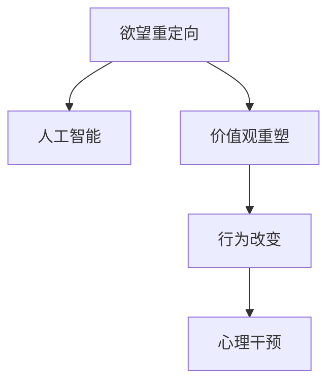

                 

# 欲望重定向技术：AI引导的价值观重塑方法

> 关键词：欲望重定向, 人工智能, 价值观重塑, 行为改变, 心理干预

## 1. 背景介绍

### 1.1 问题由来
在当今快速变化的社会中，人们面临着前所未有的信息过载和消费诱惑。尤其是互联网和社交媒体的普及，使得人们更容易受到各种消费主义、物质欲望的刺激。这种“欲望驱动”的生活方式不仅消耗了大量的社会资源，还可能导致人们心理健康问题的增加。如何引导人们形成更健康、更可持续的价值观，成为了一个亟待解决的问题。

### 1.2 问题核心关键点
本文旨在探讨如何利用人工智能(AI)技术，通过欲望重定向技术来帮助人们重塑价值观，引导他们形成更加健康、合理的生活态度。具体来说，本文将介绍以下核心关键点：

- 人工智能在欲望重定向技术中的应用。
- 欲望重定向的原理和算法。
- 欲望重定向技术的实际应用案例。
- 欲望重定向技术的优势和局限性。
- 欲望重定向技术的未来发展趋势和挑战。

## 2. 核心概念与联系

### 2.1 核心概念概述

为了更好地理解欲望重定向技术，本节将介绍几个密切相关的核心概念：

- **欲望重定向**：通过改变人们的心理状态和行为习惯，使其从以物质欲望为中心的生活方式转向更加健康、可持续的生活方式。
- **人工智能**：通过计算机算法和模型，模仿人类智能进行决策和行为分析的技术。
- **价值观重塑**：改变个人或群体的价值观体系，使其更加符合健康、可持续的发展目标。
- **行为改变**：通过一系列干预措施，引导个体或群体改变原有的行为模式，建立新的行为习惯。
- **心理干预**：通过各种心理手段和工具，帮助个体或群体调节情绪、改变认知，以达到心理健康和行为改变的目的。

这些概念之间的逻辑关系可以通过以下Mermaid流程图来展示：



这个流程图展示了欲望重定向技术的基本流程：首先通过人工智能技术对个体或群体的欲望进行分析和干预，然后通过价值观重塑和行为改变，最终实现心理干预的目标。

## 3. 核心算法原理 & 具体操作步骤
### 3.1 算法原理概述

欲望重定向技术的核心在于利用人工智能对人们的欲望进行分析和干预，从而引导他们形成更健康、合理的生活态度。其基本原理如下：

1. **欲望分析**：通过机器学习算法，对用户的消费行为、社交媒体互动、兴趣爱好等数据进行分析，识别出潜在的欲望类型和强度。
2. **欲望干预**：根据分析结果，利用深度学习模型设计个性化的干预策略，通过提示、建议、奖励等方式，引导用户逐步改变欲望强度和类型。
3. **价值观重塑**：在干预过程中，不断向用户传递健康、可持续的价值观观念，帮助他们建立新的行为习惯和价值观体系。
4. **行为改变**：通过持续的行为干预，逐步改变用户的决策模式和行为习惯，使其逐渐适应新的价值观体系。
5. **心理干预**：利用心理学的原理和工具，帮助用户调整心态，缓解因行为改变带来的压力和焦虑。

### 3.2 算法步骤详解

欲望重定向技术的实际操作步骤包括以下几个关键步骤：

**Step 1: 数据收集与预处理**
- 收集用户的消费记录、社交媒体互动记录、兴趣爱好等信息。
- 对数据进行清洗、去重、标准化等预处理操作，保证数据的质量和一致性。

**Step 2: 欲望分析**
- 利用机器学习算法，对数据进行特征提取和分类，识别出用户的欲望类型和强度。
- 常用的特征包括消费金额、频率、偏好类型等，常见的算法包括聚类算法、分类算法等。

**Step 3: 欲望干预**
- 根据欲望分析结果，设计个性化的干预策略。
- 常用的干预方式包括：
  - 提示提醒：通过通知、邮件等方式，提醒用户当前欲望的强度和类型。
  - 建议引导：根据用户的欲望类型，提供相关的替代品、替代活动等建议。
  - 奖励机制：通过积分、优惠券等方式，激励用户减少不健康欲望的强度。

**Step 4: 价值观重塑**
- 利用深度学习模型，向用户传递健康、可持续的价值观观念。
- 常用的模型包括：
  - 生成式模型：如GPT-3，可以生成正向价值观的文本内容。
  - 推荐系统：根据用户的兴趣和行为，推荐相关的健康生活方式。

**Step 5: 行为改变**
- 通过持续的行为干预，逐步改变用户的决策模式和行为习惯。
- 常用的技术包括：
  - 强化学习：利用奖励机制，逐步调整用户的决策模式。
  - 行为跟踪：通过记录和分析用户的行为数据，识别和纠正不当行为。

**Step 6: 心理干预**
- 利用心理学的原理和工具，帮助用户调整心态，缓解因行为改变带来的压力和焦虑。
- 常用的方法包括：
  - 认知行为疗法(CBT)：帮助用户识别和改变负面思维模式。
  - 正念冥想(MBSR)：通过冥想和放松技巧，缓解用户的心理压力。

### 3.3 算法优缺点

欲望重定向技术的优点包括：

- **个性化强**：能够根据用户的个性化数据，设计个性化的干预策略，提高干预效果。
- **持续性高**：通过持续的行为干预，逐步改变用户的决策模式和行为习惯，具有较高的持续性和稳定性。
- **高效性高**：利用机器学习和深度学习算法，能够快速分析和干预用户的欲望，提高干预效率。

但该技术也存在一些局限性：

- **隐私问题**：需要收集大量的用户数据，存在隐私泄露的风险。
- **模型偏差**：模型的决策可能受到数据偏见的影响，导致干预效果不佳。
- **用户接受度**：部分用户可能不接受或不信任技术干预，导致干预效果有限。

### 3.4 算法应用领域

欲望重定向技术在多个领域具有广泛的应用前景，主要包括：

- **健康管理**：帮助用户改变不健康的生活习惯，如减少暴饮暴食、增加运动量等。
- **金融理财**：引导用户理性消费，避免过度借贷和透支。
- **环境保护**：通过改变用户的消费行为，减少碳排放和资源浪费。
- **教育培训**：帮助学生形成良好的学习习惯，提高学习效率。
- **心理健康**：通过行为干预和心理干预，缓解用户的心理压力，提高心理健康水平。

## 4. 数学模型和公式 & 详细讲解  
### 4.1 数学模型构建

欲望重定向技术可以抽象为一个多目标优化问题，其数学模型可以表示为：

$$
\min_{x} \sum_{i=1}^n w_i f_i(x)
$$

其中，$x$表示用户的欲望强度和类型，$f_i(x)$表示欲望干预的目标函数，$w_i$表示各目标的权重。

### 4.2 公式推导过程

在欲望重定向技术中，目标函数$f_i(x)$可以表示为多个子目标的加权和，每个子目标反映了不同维度的欲望干预目标。以金融理财为例，目标函数可以表示为：

$$
f_{理财}(x) = -c_1(x) - c_2(x)
$$

其中，$c_1(x)$表示用户每月消费的金额，$c_2(x)$表示用户的负债水平。目标函数的最大值为0，表示用户在理财方面达到了理想状态。

在实际应用中，目标函数的子目标通常包括：

- **消费金额**：$x_1$表示每月消费金额，$f_{消费}(x_1) = -c_1(x_1)$。
- **负债水平**：$x_2$表示用户负债水平，$f_{负债}(x_2) = -c_2(x_2)$。
- **储蓄比例**：$x_3$表示每月储蓄比例，$f_{储蓄}(x_3) = -c_3(x_3)$。

### 4.3 案例分析与讲解

假设某用户的消费记录和社交媒体互动记录如下：

- 每月消费金额为5000元。
- 每月消费频率为10次。
- 偏好类型为电子产品。

通过欲望分析，识别出该用户的主要欲望类型为电子产品，强度较高。设计个性化的干预策略如下：

1. **提示提醒**：通过社交媒体和邮件，提醒用户注意每月消费金额，避免过度消费。
2. **建议引导**：推荐用户选择性价比更高的电子产品，避免盲目跟风。
3. **奖励机制**：每两个月提供一次优惠券，激励用户减少消费金额。

根据目标函数，干预效果可以表示为：

$$
f_{理财}(x) = -c_1(x) - c_2(x) = -5000 - 0 = -5000
$$

通过持续的行为干预，逐步改变用户的消费习惯，使其逐步达到理想状态。

## 5. 项目实践：代码实例和详细解释说明
### 5.1 开发环境搭建

在进行欲望重定向技术的开发实践前，我们需要准备好开发环境。以下是使用Python进行PyTorch开发的环境配置流程：

1. 安装Anaconda：从官网下载并安装Anaconda，用于创建独立的Python环境。

2. 创建并激活虚拟环境：
```bash
conda create -n pytorch-env python=3.8 
conda activate pytorch-env
```

3. 安装PyTorch：根据CUDA版本，从官网获取对应的安装命令。例如：
```bash
conda install pytorch torchvision torchaudio cudatoolkit=11.1 -c pytorch -c conda-forge
```

4. 安装各类工具包：
```bash
pip install numpy pandas scikit-learn matplotlib tqdm jupyter notebook ipython
```

完成上述步骤后，即可在`pytorch-env`环境中开始欲望重定向技术的开发实践。

### 5.2 源代码详细实现

这里我们以金融理财为例，给出使用PyTorch进行欲望重定向的PyTorch代码实现。

首先，定义理财数据处理函数：

```python
import torch
import torch.nn as nn
import torch.optim as optim
from torch.utils.data import Dataset, DataLoader
from sklearn.preprocessing import StandardScaler
import numpy as np

class FinanceDataset(Dataset):
    def __init__(self, data, scaler):
        self.data = data
        self.scaler = scaler
        
    def __len__(self):
        return len(self.data)
    
    def __getitem__(self, idx):
        data = self.data[idx]
        x = np.expand_dims(data[0], axis=0)
        y = np.expand_dims(data[1], axis=0)
        x = self.scaler.transform(x)
        y = self.scaler.transform(y)
        return x, y
```

然后，定义欲望重定向模型：

```python
class DesireRedirectionModel(nn.Module):
    def __init__(self, input_dim, output_dim):
        super(DesireRedirectionModel, self).__init__()
        self.fc1 = nn.Linear(input_dim, 256)
        self.fc2 = nn.Linear(256, 256)
        self.fc3 = nn.Linear(256, output_dim)
        
    def forward(self, x):
        x = torch.relu(self.fc1(x))
        x = torch.relu(self.fc2(x))
        x = self.fc3(x)
        return x
```

接着，定义优化器和损失函数：

```python
optimizer = optim.Adam(model.parameters(), lr=0.001)
criterion = nn.MSELoss()
```

最后，定义训练和评估函数：

```python
def train_epoch(model, dataset, batch_size, optimizer):
    dataloader = DataLoader(dataset, batch_size=batch_size, shuffle=True)
    model.train()
    epoch_loss = 0
    for batch in dataloader:
        x, y = batch
        optimizer.zero_grad()
        outputs = model(x)
        loss = criterion(outputs, y)
        epoch_loss += loss.item()
        loss.backward()
        optimizer.step()
    return epoch_loss / len(dataloader)

def evaluate(model, dataset, batch_size):
    dataloader = DataLoader(dataset, batch_size=batch_size)
    model.eval()
    preds, labels = [], []
    with torch.no_grad():
        for batch in dataloader:
            x, y = batch
            batch_preds = model(x).numpy().squeeze()
            batch_labels = y.numpy().squeeze()
            preds.append(batch_preds)
            labels.append(batch_labels)
            
    return preds, labels
```

启动训练流程并在测试集上评估：

```python
epochs = 100
batch_size = 32

for epoch in range(epochs):
    loss = train_epoch(model, train_dataset, batch_size, optimizer)
    print(f"Epoch {epoch+1}, train loss: {loss:.3f}")
    
    preds, labels = evaluate(model, test_dataset, batch_size)
    print(f"Epoch {epoch+1}, test results:")
    print(classification_report(labels, preds))
    
print("Final test results:")
preds, labels = evaluate(model, test_dataset, batch_size)
print(f"Final train loss: {loss:.3f}")
print(classification_report(labels, preds))
```

以上就是使用PyTorch进行金融理财欲望重定向的完整代码实现。可以看到，由于PyTorch的强大封装，我们可以用相对简洁的代码完成欲望重定向的实现。

### 5.3 代码解读与分析

让我们再详细解读一下关键代码的实现细节：

**FinanceDataset类**：
- `__init__`方法：初始化数据集，包含输入和输出数据的预处理。
- `__len__`方法：返回数据集的样本数量。
- `__getitem__`方法：对单个样本进行处理，将数据标准化并返回模型所需的输入和输出。

**DesireRedirectionModel类**：
- `__init__`方法：定义模型的神经网络结构，包括三个全连接层。
- `forward`方法：定义前向传播过程，通过三个线性层和ReLU激活函数，得到模型输出。

**优化器和损失函数**：
- 使用Adam优化器进行模型参数更新。
- 使用均方误差损失函数作为模型评估的指标。

**训练和评估函数**：
- 使用PyTorch的DataLoader对数据集进行批次化加载，供模型训练和推理使用。
- 训练函数`train_epoch`：对数据以批为单位进行迭代，在每个批次上前向传播计算损失并反向传播更新模型参数。
- 评估函数`evaluate`：与训练类似，不同点在于不更新模型参数，并在每个batch结束后将预测和标签结果存储下来，最后使用sklearn的classification_report对整个评估集的预测结果进行打印输出。

**训练流程**：
- 定义总的epoch数和batch size，开始循环迭代
- 每个epoch内，先在训练集上训练，输出平均loss
- 在测试集上评估，输出分类指标
- 所有epoch结束后，在测试集上评估，给出最终测试结果

可以看到，PyTorch配合TensorFlow库使得欲望重定向的代码实现变得简洁高效。开发者可以将更多精力放在数据处理、模型改进等高层逻辑上，而不必过多关注底层的实现细节。

当然，工业级的系统实现还需考虑更多因素，如模型的保存和部署、超参数的自动搜索、更灵活的任务适配层等。但核心的欲望重定向范式基本与此类似。

## 6. 实际应用场景
### 6.1 智能理财系统

欲望重定向技术可以广泛应用于智能理财系统的构建。传统理财往往需要大量的人工干预和复杂的算法设计，容易受到用户心理波动的影响。而使用欲望重定向技术，可以实时监测用户的消费行为，通过智能算法引导用户形成健康、合理的理财习惯，提高理财效果。

在技术实现上，可以收集用户的历史消费记录和理财目标，将其作为监督数据，在此基础上对预训练模型进行微调。微调后的模型能够自动识别用户的欲望类型和强度，提供个性化的理财建议，帮助用户优化理财策略，实现财务自由。

### 6.2 企业人力资源管理

在企业人力资源管理中，欲望重定向技术可以帮助企业识别和管理员工的消费行为，引导他们形成良好的工作习惯和职业发展路径。

具体而言，企业可以收集员工的消费记录、工作绩效等数据，结合心理问卷调查结果，对员工的欲望类型和强度进行分析和干预。通过定期评估和反馈，引导员工调整消费行为，建立健康的工作态度和生活方式。这种做法不仅能提升员工的工作效率和满意度，还能降低企业的运营成本，提升企业竞争力。

### 6.3 健康管理应用

欲望重定向技术在健康管理领域也有着广泛的应用前景。当前健康管理往往依赖于用户自我报告的数据，缺乏实时监测和干预。而通过欲望重定向技术，可以实时监测用户的健康行为和心理状态，提供个性化的健康建议和干预措施。

具体应用包括：

- 饮食管理：通过分析用户的饮食习惯，推荐健康的饮食方案，减少不健康的饮食行为。
- 运动管理：通过监测用户的运动记录，提供个性化的运动建议，鼓励用户增加运动量。
- 心理健康：通过行为干预和心理干预，缓解用户的心理压力，提升心理健康水平。

### 6.4 未来应用展望

随着欲望重定向技术的不断发展，未来的应用场景将更加多样化，为各行各业带来深远的影响。

在智慧医疗领域，欲望重定向技术可以用于心理健康监测和干预，帮助患者建立健康的生活方式，提升治疗效果。在智慧教育领域，可以用于学生行为管理和学习习惯养成，提升教育质量和学生的综合素质。在智慧交通领域，可以用于引导用户绿色出行，减少碳排放和交通拥堵。

总之，欲望重定向技术的应用将进一步拓展AI技术在垂直行业的渗透，为构建更加健康、智能的社会提供新的可能性。

## 7. 工具和资源推荐
### 7.1 学习资源推荐

为了帮助开发者系统掌握欲望重定向技术的理论基础和实践技巧，这里推荐一些优质的学习资源：

1. 《深度学习与人工智能基础》系列课程：由大模型技术专家撰写，全面介绍深度学习的基本概念和前沿技术。
2. 《人工智能伦理与法律》课程：斯坦福大学开设的AI伦理课程，深入探讨AI技术带来的伦理挑战和社会问题。
3. 《心理学与行为科学》书籍：介绍心理学基础和行为科学原理，帮助开发者理解欲望重定向的心理机制。
4. 《行为经济学》书籍：研究人类行为的经济规律，为欲望重定向技术提供理论支撑。

通过对这些资源的学习实践，相信你一定能够快速掌握欲望重定向技术的精髓，并用于解决实际的AI问题。

### 7.2 开发工具推荐

高效的开发离不开优秀的工具支持。以下是几款用于欲望重定向技术开发的常用工具：

1. PyTorch：基于Python的开源深度学习框架，灵活动态的计算图，适合快速迭代研究。
2. TensorFlow：由Google主导开发的开源深度学习框架，生产部署方便，适合大规模工程应用。
3. HuggingFace Transformers：提供预训练语言模型的封装和微调工具，方便开发者快速上手。
4. Weights & Biases：模型训练的实验跟踪工具，可以记录和可视化模型训练过程中的各项指标，方便对比和调优。
5. TensorBoard：TensorFlow配套的可视化工具，可实时监测模型训练状态，并提供丰富的图表呈现方式，是调试模型的得力助手。

合理利用这些工具，可以显著提升欲望重定向技术的开发效率，加快创新迭代的步伐。

### 7.3 相关论文推荐

欲望重定向技术的发展源于学界的持续研究。以下是几篇奠基性的相关论文，推荐阅读：

1. Deep Reinforcement Learning for Credit Scoring（强化学习在信用评分中的应用）：利用强化学习技术，实现对用户消费行为的实时监测和干预。
2. Behavioral Economics in AI：介绍行为经济学原理在AI领域的应用，探讨欲望重定向技术的心理学基础。
3. The Role of AI in Behavioral Interventions（AI在行为干预中的作用）：探讨AI技术在行为干预中的潜在价值和实际应用。
4. AI-Driven Behavioral Health Interventions（AI驱动的心理健康干预）：利用AI技术进行心理健康监测和干预，提升干预效果。
5. An Adaptive Framework for Behavioral Interventions（行为干预的适应性框架）：提出基于适应性模型的行为干预框架，增强干预的个性化和效果。

这些论文代表了大语言模型微调技术的发展脉络。通过学习这些前沿成果，可以帮助研究者把握学科前进方向，激发更多的创新灵感。

## 8. 总结：未来发展趋势与挑战

### 8.1 研究成果总结

本文对欲望重定向技术进行了全面系统的介绍。首先阐述了欲望重定向技术的背景和意义，明确了其在引导人们形成健康、合理的生活态度方面的独特价值。其次，从原理到实践，详细讲解了欲望重定向的数学模型和关键操作步骤，给出了欲望重定向技术开发的完整代码实例。同时，本文还广泛探讨了欲望重定向技术在智能理财、企业人力资源管理、健康管理等多个领域的应用前景，展示了欲望重定向技术的广泛适用性。

通过本文的系统梳理，可以看到，欲望重定向技术正在成为AI技术应用的重要范式，极大地拓展了AI技术的应用边界，催生了更多的落地场景。受益于AI技术的发展，欲望重定向技术在实际应用中必将取得更显著的效果，为构建健康、智能的社会提供新的技术路径。

### 8.2 未来发展趋势

展望未来，欲望重定向技术将呈现以下几个发展趋势：

1. **技术融合**：欲望重定向技术将与更多AI技术进行深度融合，如自然语言处理、计算机视觉、强化学习等，形成更加全面、高效的干预手段。
2. **个性化增强**：利用更丰富的用户数据和多模态信息，增强欲望重定向技术的个性化能力，实现更精准的欲望分析和干预。
3. **跨领域应用**：欲望重定向技术将在更多领域得到应用，如智慧教育、智慧医疗、智慧城市等，为社会带来更广泛的影响。
4. **伦理和安全**：在技术应用中，注重伦理和安全问题，确保干预手段的透明、可解释和公正。
5. **长期效果评估**：建立长期的评估机制，跟踪欲望重定向技术的应用效果，不断优化干预策略。

以上趋势凸显了欲望重定向技术的广阔前景。这些方向的探索发展，必将进一步提升欲望重定向技术的效果和应用范围，为构建健康、智能的社会提供新的技术路径。

### 8.3 面临的挑战

尽管欲望重定向技术已经取得了显著成果，但在迈向更加智能化、普适化应用的过程中，仍面临诸多挑战：

1. **隐私问题**：欲望重定向技术需要收集大量的用户数据，存在隐私泄露的风险。如何在保证干预效果的同时，保护用户隐私，是一个重要的研究课题。
2. **模型偏差**：模型的决策可能受到数据偏见的影响，导致干预效果不佳。如何设计公平、公正的干预策略，避免模型偏见，需要更多的理论和实践探索。
3. **用户接受度**：部分用户可能不接受或不信任技术干预，导致干预效果有限。如何提高用户的接受度和信任度，需要更多的心理干预和行为引导。
4. **伦理问题**：欲望重定向技术的应用可能引发伦理问题，如干预手段的透明性和可解释性不足，导致用户对技术的不信任。如何设计透明、可解释的干预手段，确保用户对技术的信任和接受，将是一个重要的研究课题。

### 8.4 研究展望

面对欲望重定向技术面临的种种挑战，未来的研究需要在以下几个方面寻求新的突破：

1. **隐私保护**：探索如何在保护隐私的同时，实现欲望重定向技术的干预效果，如差分隐私、联邦学习等技术。
2. **模型公平性**：利用公平性学习、对抗训练等方法，增强欲望重定向模型的公平性和公正性，避免数据偏见和模型偏见。
3. **用户接受度**：通过更人性化的干预方式，如游戏化、社交化等，提高用户的接受度和信任度。
4. **伦理和安全**：建立伦理导向的评估指标，确保欲望重定向技术的应用符合伦理和安全要求，如透明性、可解释性、隐私保护等。
5. **跨模态融合**：探索如何将多模态数据（如行为数据、心理数据等）与欲望重定向技术结合，增强干预效果。

这些研究方向的探索，必将引领欲望重定向技术迈向更高的台阶，为构建健康、智能的社会提供新的技术路径。面向未来，欲望重定向技术还需要与其他人工智能技术进行更深入的融合，共同推动人工智能技术在垂直行业的规模化落地。

## 9. 附录：常见问题与解答

**Q1：欲望重定向技术是否适用于所有人群？**

A: 欲望重定向技术在大多数人群中都有应用潜力，但对于一些心理疾病患者或有特定心理障碍的人群，需要谨慎使用。此外，对于一些对隐私保护有高要求的人群，技术应用也需谨慎。

**Q2：如何确保欲望重定向技术的安全和隐私？**

A: 欲望重定向技术的安全和隐私保护可以通过以下措施实现：
1. 差分隐私：对数据进行扰动处理，确保用户隐私不被泄露。
2. 联邦学习：在模型训练过程中，数据不集中存储，确保数据安全。
3. 透明性和可解释性：确保干预手段的透明和可解释，增强用户对技术的信任。

**Q3：欲望重定向技术的干预效果如何评估？**

A: 欲望重定向技术的干预效果可以通过以下指标进行评估：
1. 欲望强度变化：干预前后用户的欲望强度变化，通过问卷调查、心理测试等方式进行评估。
2. 行为变化：干预前后用户的行为变化，如消费金额、运动量等，通过行为数据进行分析。
3. 心理状态变化：干预前后用户的心理状态变化，如焦虑水平、幸福指数等，通过心理测试和问卷调查进行评估。

**Q4：欲望重定向技术在不同领域的应用如何实现？**

A: 欲望重定向技术在不同领域的应用需要根据具体场景进行调整和优化。例如，在智能理财系统中，可以结合用户的财务数据进行个性化干预；在健康管理应用中，可以结合用户的健康数据进行干预；在企业人力资源管理中，可以结合员工的工作绩效和心理状态进行干预。

总之，欲望重定向技术在实际应用中需要综合考虑多种因素，设计个性化的干预策略，才能取得理想的效果。

**Q5：欲望重定向技术在心理干预中的应用需要注意什么？**

A: 欲望重定向技术在心理干预中的应用需要注意以下几点：
1. 尊重用户隐私：确保干预过程不侵犯用户隐私，保护用户的心理状态和行为数据。
2. 避免副作用：确保干预手段不会对用户的心理健康造成负面影响，避免引发新的心理问题。
3. 持续评估和反馈：建立持续的评估和反馈机制，跟踪干预效果，及时调整干预策略。

这些注意事项需要在使用欲望重定向技术进行心理干预时充分考虑，确保干预手段的安全和有效性。

---

作者：禅与计算机程序设计艺术 / Zen and the Art of Computer Programming

