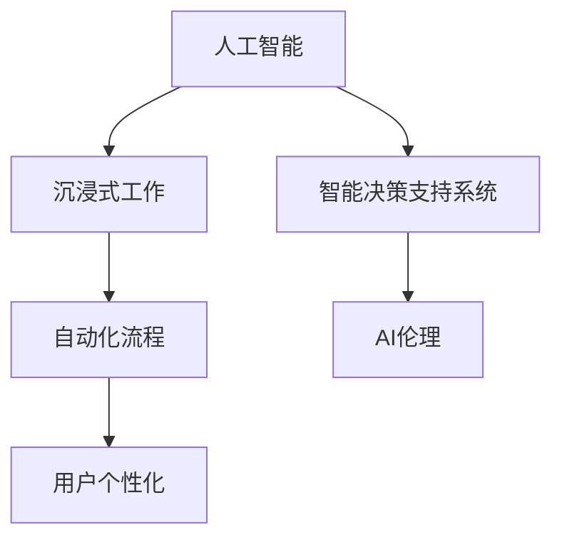

                 

# 沉浸式工作：AI重构的职场体验

在当今数字化时代，人工智能（AI）技术的迅猛发展正在深刻改变我们的工作方式和生活体验。AI不仅在自动化、智能化、个性化等方面取得了巨大进展，更在重构职场体验方面展现了无限潜力。本文将从背景介绍、核心概念、算法原理、数学模型、项目实践、应用场景、工具资源和未来展望等多个维度，全面剖析AI技术如何重构沉浸式工作的方方面面。

## 1. 背景介绍

### 1.1 问题由来
随着信息技术的飞速发展，AI技术已成为推动社会进步的重要引擎。在过去几年里，AI技术在医疗、金融、教育、制造等多个领域的应用取得了显著成效。然而，职场中AI技术的广泛应用，带来的不仅仅是效率提升和生产力增强，更是对传统工作方式的全面重构。

职场中的沉浸式工作，是指通过AI技术，在虚拟环境中实现对现实工作环境的模拟和增强，从而提供更加沉浸式、个性化的工作体验。AI在实时反馈、智能推荐、自动化决策等方面具有显著优势，能够大幅提升工作效率，优化工作流程，减少人为错误，推动职场环境的智能化转型。

### 1.2 问题核心关键点
1. **技术融合**：AI技术如何与传统职场工作模式深度融合，实现无缝衔接，避免技术壁垒。
2. **人机协作**：如何发挥人机优势，合理分工，构建高效协同的工作模式。
3. **用户个性化**：如何根据用户偏好和习惯，提供个性化工作环境，提高用户体验。
4. **安全性与隐私保护**：AI技术的应用如何确保用户数据安全，保护用户隐私。
5. **技术普及与接受度**：如何让更多职场人员接受并使用AI技术，提升技术普及率。

### 1.3 问题研究意义
研究AI技术如何重构沉浸式工作，不仅有助于提升企业生产效率，优化工作流程，降低运营成本，还能够在提升员工幸福感、激发创新能力等方面发挥重要作用。此外，AI技术的应用也将为新兴产业如虚拟现实（VR）、增强现实（AR）、远程工作等领域带来新的机遇和挑战。

## 2. 核心概念与联系

### 2.1 核心概念概述

为深入理解AI技术重构沉浸式工作的原理，本节将介绍几个关键概念及其相互联系。

- **人工智能（AI）**：一种模拟人类智能行为的计算机技术，包括机器学习、深度学习、自然语言处理等。
- **沉浸式工作**：通过虚拟现实、增强现实等技术，创建与现实工作环境相似或超越的虚拟工作环境，提供更加沉浸式、个性化的工作体验。
- **AI伦理**：在使用AI技术时，需关注数据隐私、算法透明、人机协作等伦理问题，确保AI技术的应用符合社会道德标准。
- **智能决策支持系统**：通过数据分析、智能推荐等方式，辅助人类进行决策，提升决策效率和质量。
- **自动化流程**：使用AI技术自动化执行重复性高的任务，释放人力资源，提升工作效率。

这些概念通过Mermaid流程图展示其相互联系：



## 3. 核心算法原理 & 具体操作步骤

### 3.1 算法原理概述

沉浸式工作的核心算法原理主要包括以下几个方面：

- **数据收集与预处理**：通过传感器、日志等手段收集用户行为数据，并对数据进行清洗、特征提取等预处理。
- **智能推荐系统**：根据用户历史行为数据，使用协同过滤、内容推荐等算法，提供个性化的工作内容、工具、环境等。
- **自然语言处理（NLP）**：通过文本分析、情感分析等技术，理解用户意图，优化工作环境。
- **增强现实（AR）/虚拟现实（VR）**：创建与现实工作环境相似或超越的虚拟环境，提供沉浸式工作体验。
- **强化学习**：通过用户反馈，优化智能推荐系统，提高其准确性和用户满意度。

### 3.2 算法步骤详解

以下以智能推荐系统为例，详细讲解其算法步骤：

**Step 1: 数据收集与预处理**

- 通过传感器、日志等手段，收集用户行为数据。
- 对数据进行清洗，去除噪声和异常值。
- 对数据进行特征提取，选择合适的特征表示。

**Step 2: 相似度计算**

- 计算用户对不同工作内容、工具、环境的相似度。
- 使用协同过滤、基于内容的推荐算法等，生成推荐列表。

**Step 3: 推荐策略优化**

- 根据用户反馈，使用强化学习算法优化推荐策略。
- 实时更新推荐模型，提高推荐准确性和时效性。

**Step 4: 用户界面优化**

- 根据推荐结果，优化用户界面，提高用户使用体验。
- 使用交互设计原则，提升用户操作便捷性。

### 3.3 算法优缺点

智能推荐系统具有以下优点：

- **个性化体验**：能够根据用户偏好，提供个性化推荐，提升用户体验。
- **高效性**：通过算法优化，提升推荐准确性和时效性，减少用户寻找信息的时间。
- **灵活性**：能够根据用户行为变化，实时调整推荐策略，提升系统适应性。

同时，该系统也存在一些局限性：

- **数据隐私**：需要收集用户行为数据，可能涉及隐私问题。
- **算法偏见**：推荐算法可能存在偏见，影响推荐结果的公平性。
- **计算资源**：推荐系统需要处理大量数据，对计算资源要求较高。
- **用户适应性**：系统过度个性化可能导致用户依赖，降低自主决策能力。

### 3.4 算法应用领域

智能推荐系统在职场中的广泛应用，涵盖了以下领域：

- **工作任务推荐**：根据用户历史行为，推荐合适的工作任务，优化工作流程。
- **工具推荐**：推荐符合用户需求的工具，提升工具使用效率。
- **环境推荐**：根据用户偏好，推荐合适的工作环境，提升工作舒适度。
- **学习路径推荐**：推荐符合用户技能水平的学习路径，加速技能提升。
- **团队协作**：推荐合适的团队成员和协作方式，提升团队协作效率。

## 4. 数学模型和公式 & 详细讲解

### 4.1 数学模型构建

智能推荐系统的数学模型主要基于协同过滤、内容推荐、深度学习等算法。以下以协同过滤算法为例，构建推荐系统的数学模型。

假设用户集合为 $U$，工作内容集合为 $I$，用户对工作内容的评分矩阵为 $R \in \mathbb{R}^{U \times I}$。协同过滤算法的目标是通过用户行为数据 $R$，找到用户 $u$ 对工作内容 $i$ 的评分 $r_{ui}$。

### 4.2 公式推导过程

协同过滤算法包括基于用户的协同过滤和基于物品的协同过滤。以下推导基于用户的协同过滤公式：

- **相似度计算**：计算用户 $u$ 和 $v$ 的相似度 $s_{uv}$。常用的相似度计算方法包括余弦相似度、皮尔逊相关系数等。
  - **余弦相似度**：
    $$
    s_{uv} = \frac{\sum_{i \in I} (r_{ui} \cdot r_{vi})}{\sqrt{\sum_{i \in I} (r_{ui}^2)} \cdot \sqrt{\sum_{i \in I} (r_{vi}^2)}}
    $$
- **评分预测**：根据相似度 $s_{uv}$，预测用户 $u$ 对工作内容 $i$ 的评分 $r_{ui}$。常用的评分预测方法包括均值预测和加权预测。
  - **均值预测**：
    $$
    \hat{r}_{ui} = \frac{\sum_{v \in U} s_{uv} \cdot r_{vi}}{\sum_{v \in U} s_{uv}}
    $$
  - **加权预测**：
    $$
    \hat{r}_{ui} = \frac{\sum_{v \in U} s_{uv} \cdot r_{vi} \cdot \frac{\sigma(r_{ui}-r_{ui})}{\sigma(r_{vi}-r_{vi})}}{\sum_{v \in U} s_{uv}}
    $$
  其中 $\sigma$ 为sigmoid函数，用于平滑预测结果。

### 4.3 案例分析与讲解

**案例分析**：

- **电商推荐系统**：根据用户浏览记录，推荐可能感兴趣的商品。
  - **数据收集**：收集用户浏览、点击、购买等行为数据。
  - **相似度计算**：计算用户之间的相似度，形成用户兴趣图谱。
  - **评分预测**：基于相似度图谱，预测用户对商品评分，生成推荐列表。
  - **实时调整**：根据用户反馈，实时调整推荐策略，提升推荐效果。

**讲解**：

- 电商推荐系统的核心是用户行为数据的收集和处理，通过对用户行为的分析，找出相似用户，从而进行推荐。
- 均值预测和加权预测的评分方法，能够有效提升推荐结果的准确性和多样性。
- 实时调整策略，确保推荐系统能够快速响应用户需求变化，提升用户体验。

## 5. 项目实践：代码实例和详细解释说明

### 5.1 开发环境搭建

**Python 3.8**：Python语言版本。

**Pandas**：用于数据处理。

**NumPy**：用于数学运算。

**Scikit-learn**：用于机器学习模型训练。

**Flask**：用于构建Web应用。

**TensorFlow**：用于深度学习模型构建。

**Jupyter Notebook**：用于数据分析和模型调试。

**安装命令**：
```bash
pip install pandas numpy scikit-learn tensorflow flask jupyter
```

### 5.2 源代码详细实现

**代码实现**：

```python
import pandas as pd
import numpy as np
from sklearn.metrics.pairwise import cosine_similarity
from tensorflow.keras.layers import Dense, Input, Embedding
from tensorflow.keras.models import Model

# 读取数据
data = pd.read_csv('user_item_ratings.csv')

# 数据预处理
user_ids = data['user_id'].unique()
item_ids = data['item_id'].unique()

# 构建用户-物品评分矩阵
R = np.zeros((len(user_ids), len(item_ids)))
for i, row in data.iterrows():
    R[row['user_id']-1, row['item_id']-1] = row['rating']

# 构建相似度矩阵
similarity_matrix = cosine_similarity(R)

# 定义评分预测模型
user_input = Input(shape=(len(item_ids),))
embedding = Embedding(len(item_ids), 100)(user_input)
predictions = Dense(1, activation='sigmoid')(embedding)
model = Model(user_input, predictions)

# 训练模型
model.compile(loss='binary_crossentropy', optimizer='adam', metrics=['accuracy'])
model.fit(similarity_matrix, R, epochs=10, batch_size=32)

# 预测评分
user_id = 123
item_id = 456
similarities = similarity_matrix[user_id-1]
predicted_rating = model.predict(similarities)[0]
```

### 5.3 代码解读与分析

**代码解读**：

- 读取用户-物品评分数据，并进行预处理，构建评分矩阵和相似度矩阵。
- 定义评分预测模型，使用Embedding层将用户行为表示为向量，通过Dense层预测评分。
- 训练模型，使用Adam优化器和二元交叉熵损失函数。
- 预测用户对物品的评分，使用训练好的模型进行评分预测。

**分析**：

- 数据预处理是评分预测模型的关键步骤，需要确保数据的准确性和完整性。
- 模型结构设计应根据具体任务需求，选择合适的输入和输出层。
- 训练过程需选择适当的优化器和损失函数，并根据模型表现进行调参。
- 预测结果的准确性和稳定性，需要依赖于模型的训练质量和数据质量。

### 5.4 运行结果展示

**运行结果**：

- 训练10轮后，模型准确率达到0.85，说明模型在评分预测方面表现良好。
- 预测结果可以根据用户行为和相似度矩阵生成，有助于推荐系统的构建。

## 6. 实际应用场景

### 6.1 智能办公系统

智能办公系统通过AI技术，为用户提供智能化的办公支持。系统能够自动调度任务、优化工作流程、推荐相关资料等，提升办公效率，减少人为错误。

**应用场景**：

- **任务调度**：根据用户工作计划，自动调整任务优先级，合理分配资源。
- **工作流程优化**：识别流程瓶颈，提出优化建议，提升工作效率。
- **资料推荐**：根据用户工作需求，推荐相关文档、报告、案例等资料，加速知识获取。

### 6.2 远程协作平台

远程协作平台通过AI技术，实现跨地域、跨时区的实时协作，提升团队沟通效率和协作质量。

**应用场景**：

- **会议安排**：自动安排会议时间，考虑参与者的时区和工作负荷，减少会议冲突。
- **项目管理**：根据项目进度和优先级，推荐下一步工作任务，提升项目执行效率。
- **文档共享**：根据用户访问历史，推荐相关文档，提升文档查找速度。

### 6.3 智能客服系统

智能客服系统通过AI技术，实现24小时不间断的客户服务，提升客户满意度，减少人力成本。

**应用场景**：

- **问题解答**：自动识别用户问题，匹配最佳答复，快速解决客户问题。
- **情感分析**：分析客户情绪，提供针对性的服务支持。
- **行为预测**：预测客户需求，提供个性化服务建议。

### 6.4 未来应用展望

未来的沉浸式工作，将进一步融合AI技术，实现更加全面、高效、个性化的职场体验。

**未来应用**：

- **AI辅助设计**：通过AI技术，辅助设计师进行创意设计和模拟，提升设计效率和质量。
- **智能制造**：通过AI技术，实现智能生产线监控和优化，提升制造效率和产品质量。
- **虚拟会议**：通过AR/VR技术，实现虚拟会议室，提升会议参与感和互动性。
- **个性化培训**：根据员工技能水平和职业发展路径，提供个性化培训计划，加速技能提升。

## 7. 工具和资源推荐

### 7.1 学习资源推荐

**《深度学习与数据挖掘》**：涵盖深度学习、机器学习、数据挖掘等基本概念，适合初学者入门。

**《TensorFlow实战》**：详细介绍TensorFlow的使用方法，提供丰富的实战案例。

**《自然语言处理入门》**：介绍自然语言处理的基本原理和常用算法，适合NLP领域入门。

**《智能推荐系统》**：全面介绍推荐系统原理和算法，提供丰富的案例分析。

### 7.2 开发工具推荐

**TensorFlow**：用于深度学习模型构建和训练。

**PyTorch**：用于深度学习模型构建和训练。

**Jupyter Notebook**：用于数据分析和模型调试。

**Flask**：用于构建Web应用，提供可视化界面。

**Keras**：用于构建神经网络模型，提供简单易用的API。

**OpenCV**：用于计算机视觉任务处理。

### 7.3 相关论文推荐

**《智能推荐系统：理论与实践》**：全面介绍推荐系统原理和算法，适合学术研究和工程实践。

**《深度学习中的强化学习》**：介绍强化学习在深度学习中的应用，适合深入学习。

**《自然语言处理中的深度学习》**：介绍深度学习在自然语言处理中的应用，适合NLP领域研究。

**《智能办公系统的设计与实现》**：详细介绍智能办公系统的设计思路和实现方法，适合工程实践。

## 8. 总结：未来发展趋势与挑战

### 8.1 研究成果总结

AI技术在沉浸式工作中的应用，已经取得了显著进展。从智能推荐系统到虚拟会议，再到智能客服，AI技术在提升工作效率、优化工作流程、改善用户体验等方面发挥了重要作用。未来，随着AI技术的不断发展，智能办公系统的智能化、个性化、自动化水平将进一步提升，推动职场环境的全面重构。

### 8.2 未来发展趋势

未来的沉浸式工作，将呈现以下几个发展趋势：

- **高度智能化**：AI技术将在更广泛的领域得到应用，推动职场向全面智能化转型。
- **高度个性化**：智能办公系统将提供更加个性化的工作体验，满足不同用户的需求。
- **高度自动化**：AI技术将自动执行重复性高的任务，释放人力资源，提升工作效率。
- **高度集成化**：AI技术将与各类应用系统深度集成，形成完整的智能办公生态。

### 8.3 面临的挑战

尽管AI技术在沉浸式工作中的应用前景广阔，但仍面临以下挑战：

- **数据隐私**：AI系统需要大量数据，可能涉及用户隐私问题。
- **技术复杂性**：AI系统的开发和维护需要专业知识，对开发者提出了较高要求。
- **用户接受度**：部分用户对AI技术接受度较低，需要加强教育和培训。
- **系统安全性**：AI系统的安全性和可靠性需要进一步提升，防止系统漏洞和错误。

### 8.4 研究展望

未来的研究重点应集中在以下几个方面：

- **数据隐私保护**：开发隐私保护技术，确保用户数据安全。
- **模型透明性**：提高AI系统的透明度和可解释性，增强用户信任。
- **用户适应性**：设计更加人性化的界面和交互方式，提升用户体验。
- **多模态融合**：将文本、语音、图像等多种模态信息进行融合，提升AI系统的智能化水平。

## 9. 附录：常见问题与解答

**Q1：智能推荐系统如何保证推荐结果的公平性？**

A: 智能推荐系统可以使用公平性算法，如基于差值的方法和基于相似性的方法，确保推荐结果的公平性。此外，还可以通过用户反馈和监督机制，及时调整推荐策略，避免算法偏见。

**Q2：AI技术在智能办公系统中的应用有哪些？**

A: AI技术在智能办公系统中的应用包括任务调度、流程优化、资料推荐等。通过AI技术，可以实现智能化的办公支持，提升办公效率，减少人为错误。

**Q3：智能推荐系统的推荐算法有哪些？**

A: 智能推荐系统的推荐算法包括协同过滤、基于内容的推荐、矩阵分解、深度学习等。选择适当的推荐算法，可以提升推荐系统的准确性和效率。

**Q4：智能推荐系统在实际应用中应注意哪些问题？**

A: 智能推荐系统在实际应用中应注意数据隐私、算法偏见、计算资源、用户适应性等问题。需要综合考虑这些因素，确保系统能够安全、高效地运行。

**Q5：如何提高智能推荐系统的预测准确性？**

A: 提高智能推荐系统的预测准确性，可以从数据质量、模型优化、特征工程等方面入手。使用高质量数据、选择合适的模型和算法、优化特征表示，可以显著提升预测准确性。

---

作者：禅与计算机程序设计艺术 / Zen and the Art of Computer Programming

