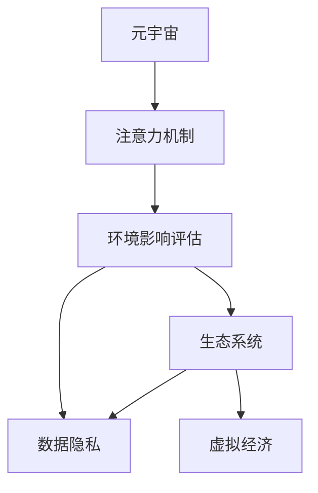

                 

# 注意力环境影响评估:元宇宙开发的生态考量

> 关键词：元宇宙, 注意力机制, 环境影响评估, 生态系统, 用户注意力, 数据隐私, 虚拟经济

## 1. 背景介绍

随着数字技术的飞速发展，元宇宙的概念逐渐从科幻走向现实。元宇宙是数字化、网络化、智能化高度融合的虚拟空间，通过多种感官、交互和虚拟元素的重组，构建出一个高度沉浸、自主、交互的虚拟世界。例如，Meta的Horizon Worlds，Roblox的虚拟世界等，都标志着元宇宙逐步进入大众视野。

元宇宙开发涉及大量技术，如3D渲染、虚拟交互、语音交互、人工智能等。其中，注意力机制作为元宇宙中用户行为分析的重要技术，对于增强用户沉浸感、优化用户体验、实现个性化推荐等方面至关重要。但与此同时，注意力机制也带来了环境影响、数据隐私、虚拟经济等生态问题，如何平衡这些矛盾，成为元宇宙开发的关键课题。

本文聚焦于注意力环境影响评估，探讨元宇宙开发中注意力机制的生态考量，希望通过学术研究与工程实践，为元宇宙的健康发展提供有力支持。

## 2. 核心概念与联系

### 2.1 核心概念概述

为更好地理解注意力机制及其生态影响，本节将介绍几个关键概念：

- 元宇宙(Metaverse)：通过数字化、网络化、智能化技术构建的虚拟空间，具备高度沉浸、自主、交互的特点，用户可以在其中进行各种活动。
- 注意力机制(Attention Mechanism)：在深度学习中，用于动态选择输入数据中的相关信息的一种机制，通过计算权重将信息聚焦到关键部分。
- 环境影响评估(Environmental Impact Assessment)：通过定量、定性分析，评估活动对环境的影响程度，从而提出改进措施。
- 生态系统(Ecosystem)：由生物与环境组成的自然系统，元宇宙中用户、平台、开发者、NFT等各角色构成的虚拟社会。
- 数据隐私(Data Privacy)：个人隐私信息在元宇宙中的保护，防止信息泄露和滥用。
- 虚拟经济(Virtual Economy)：元宇宙内外的经济活动，包括数字货币、虚拟资产、交易平台等。

这些核心概念之间的联系可以通过以下Mermaid流程图来展示：



这个流程图展示了大语言模型微调的核心概念及其之间的联系：

1. 元宇宙是注意力机制的应用场景。
2. 注意力机制优化了元宇宙的用户体验。
3. 环境影响评估用于评估注意力机制的环境影响。
4. 生态系统受到注意力机制的深刻影响。
5. 数据隐私和虚拟经济与注意力机制紧密相关。

## 3. 核心算法原理 & 具体操作步骤

### 3.1 算法原理概述

在元宇宙中，用户的注意力是交互与互动的核心，通过注意力机制，系统可以动态评估用户关注的内容，从而实现个性化推荐、提高用户体验。其基本原理是通过深度学习模型，如Transformer，计算输入数据的权重，将关键信息放大，无关信息缩小。

注意力机制的核心公式为：

$$
\text{Attention}(Q, K, V) = \text{Softmax}(\frac{QK^T}{\sqrt{d_k}})V
$$

其中 $Q$ 为查询向量，$K$ 和 $V$ 分别为键向量和值向量。$d_k$ 为缩放因子，防止计算过程中的数值不稳定。

### 3.2 算法步骤详解

基于注意力机制的元宇宙开发，一般包括以下几个关键步骤：

**Step 1: 设计注意力模型**
- 根据任务需求，选择合适的网络架构，如Transformer，设计注意力层。
- 确定注意力计算方法，选择合适的权重计算方式，如点积、双线性投影等。

**Step 2: 数据准备**
- 收集元宇宙中的交互数据，如用户行为日志、场景数据等，清洗并标注数据集。
- 进行数据增强，如数据增广、数据去重等，保证数据集的质量。

**Step 3: 模型训练**
- 使用标注数据集训练注意力模型，调整超参数，如学习率、批大小等。
- 引入正则化技术，如Dropout、L2正则等，防止模型过拟合。

**Step 4: 模型评估**
- 在测试集上评估模型性能，使用指标如准确率、召回率、F1值等。
- 分析模型输出结果，总结注意力权重分布，改进模型设计。

**Step 5: 部署应用**
- 将训练好的模型部署到元宇宙平台，实时计算用户注意力权重。
- 根据注意力结果，进行个性化推荐、交互优化等。

### 3.3 算法优缺点

基于注意力机制的元宇宙开发方法具有以下优点：
1. 动态优化。通过实时计算注意力权重，适应用户行为变化，提供个性化服务。
2. 提升用户体验。精准推荐和优化交互过程，提升用户满意度和忠诚度。
3. 模型泛化能力强。通过大量标注数据训练，模型具备较强的泛化能力，适应不同任务和场景。

同时，该方法也存在一定的局限性：
1. 依赖大量标注数据。注意力模型的训练和优化需要大量标注数据，成本较高。
2. 环境影响不易量化。注意力机制对环境影响的作用路径复杂，难以直接量化评估。
3. 可能加剧数字鸿沟。注意力模型的设计和使用可能进一步加剧数字鸿沟，加剧社会不平等。
4. 数据隐私风险高。用户行为数据和个人隐私信息的处理和存储，存在隐私泄露的风险。

尽管存在这些局限性，但就目前而言，基于注意力机制的元宇宙开发方法仍是大数据、人工智能和元宇宙融合的重要手段。未来相关研究的重点在于如何进一步降低对标注数据的依赖，提高模型的可解释性，同时兼顾环境保护和数据隐私等因素。

### 3.4 算法应用领域

基于注意力机制的元宇宙开发方法在多个领域都有应用：

- 个性化推荐系统：通过分析用户行为数据，实时推荐相关内容，提升用户满意度。
- 虚拟交互系统：通过实时计算用户关注点，优化交互体验，提供更好的用户沉浸感。
- 虚拟旅游平台：根据用户偏好，动态推荐景点和活动，优化旅游体验。
- 虚拟培训系统：根据学习行为，推荐学习资源，提升培训效果。
- 虚拟商品推荐：通过分析用户购买行为，推荐相关商品，提高销售额。

除了上述这些经典应用外，注意力机制还可应用于虚拟世界治理、智能合约、虚拟医疗等，为元宇宙的智能化、规范化发展提供新的可能性。

## 4. 数学模型和公式 & 详细讲解

### 4.1 数学模型构建

本节将使用数学语言对基于注意力机制的元宇宙开发过程进行更加严格的刻画。

记元宇宙中的用户行为数据为 $\{(x_i, y_i)\}_{i=1}^N$，其中 $x_i$ 为输入数据，$y_i$ 为标签。假设注意力模型为 $M_{\theta}$，其中 $\theta$ 为模型参数。

定义注意力模型 $M_{\theta}$ 在数据样本 $(x,y)$ 上的损失函数为 $\ell(M_{\theta}(x),y)$，则在数据集 $D$ 上的经验风险为：

$$
\mathcal{L}(\theta) = \frac{1}{N} \sum_{i=1}^N \ell(M_{\theta}(x_i),y_i)
$$

通过梯度下降等优化算法，微调过程不断更新模型参数 $\theta$，最小化损失函数 $\mathcal{L}$，使得模型输出逼近真实标签。

### 4.2 公式推导过程

以下我们以用户行为分类任务为例，推导注意力机制的损失函数及其梯度的计算公式。

假设模型 $M_{\theta}$ 在输入 $x$ 上的输出为 $\hat{y}=M_{\theta}(x) \in [0,1]$，表示用户属于正类的概率。真实标签 $y \in \{0,1\}$。则二分类交叉熵损失函数定义为：

$$
\ell(M_{\theta}(x),y) = -[y\log \hat{y} + (1-y)\log (1-\hat{y})]
$$

将其代入经验风险公式，得：

$$
\mathcal{L}(\theta) = -\frac{1}{N}\sum_{i=1}^N [y_i\log M_{\theta}(x_i)+(1-y_i)\log(1-M_{\theta}(x_i))]
$$

根据链式法则，损失函数对参数 $\theta_k$ 的梯度为：

$$
\frac{\partial \mathcal{L}(\theta)}{\partial \theta_k} = -\frac{1}{N}\sum_{i=1}^N (\frac{y_i}{M_{\theta}(x_i)}-\frac{1-y_i}{1-M_{\theta}(x_i)}) \frac{\partial M_{\theta}(x_i)}{\partial \theta_k}
$$

其中 $\frac{\partial M_{\theta}(x_i)}{\partial \theta_k}$ 可进一步递归展开，利用自动微分技术完成计算。

在得到损失函数的梯度后，即可带入参数更新公式，完成模型的迭代优化。重复上述过程直至收敛，最终得到适应元宇宙任务的最优模型参数 $\theta^*$。

## 5. 项目实践：代码实例和详细解释说明

### 5.1 开发环境搭建

在进行元宇宙开发实践前，我们需要准备好开发环境。以下是使用Python进行TensorFlow开发的环境配置流程：

1. 安装Anaconda：从官网下载并安装Anaconda，用于创建独立的Python环境。

2. 创建并激活虚拟环境：
```bash
conda create -n tensorflow-env python=3.8 
conda activate tensorflow-env
```

3. 安装TensorFlow：根据CUDA版本，从官网获取对应的安装命令。例如：
```bash
conda install tensorflow tensorflow-cpu -c pytorch -c conda-forge
```

4. 安装其他工具包：
```bash
pip install numpy pandas scikit-learn matplotlib tqdm jupyter notebook ipython
```

完成上述步骤后，即可在`tensorflow-env`环境中开始元宇宙开发实践。

### 5.2 源代码详细实现

下面我们以用户行为分类任务为例，给出使用TensorFlow对注意力模型进行训练的代码实现。

首先，定义数据处理函数：

```python
import tensorflow as tf
import numpy as np

def preprocess_data(data, batch_size):
    dataset = tf.data.Dataset.from_tensor_slices((data['features'], data['labels']))
    dataset = dataset.shuffle(buffer_size=10000)
    dataset = dataset.batch(batch_size)
    return iter(dataset)
```

然后，定义注意力模型：

```python
from tensorflow.keras.layers import Input, Dense, Dropout
from tensorflow.keras.models import Model

def build_model(input_dim, num_classes):
    inputs = Input(shape=(input_dim,))
    x = tf.keras.layers.Dense(512, activation='relu')(inputs)
    x = Dropout(0.5)(x)
    x = tf.keras.layers.Dense(256, activation='relu')(x)
    x = Dropout(0.5)(x)
    x = tf.keras.layers.Dense(num_classes, activation='softmax')(x)
    model = Model(inputs=inputs, outputs=x)
    return model
```

接着，定义训练和评估函数：

```python
def train_model(model, train_dataset, validation_dataset, epochs, batch_size, learning_rate):
    model.compile(optimizer=tf.keras.optimizers.Adam(learning_rate=learning_rate),
                  loss='categorical_crossentropy',
                  metrics=['accuracy'])

    history = model.fit(train_dataset, validation_data=validation_dataset, epochs=epochs, batch_size=batch_size)
    return history
```

最后，启动训练流程并在测试集上评估：

```python
epochs = 5
batch_size = 16

# 训练模型
model = build_model(input_dim=128, num_classes=2)
history = train_model(model, train_dataset, validation_dataset, epochs, batch_size, learning_rate=0.001)

# 评估模型
test_dataset = preprocess_data(test_data, batch_size=64)
loss, accuracy = model.evaluate(test_dataset)

print(f'Test Loss: {loss:.4f}')
print(f'Test Accuracy: {accuracy:.4f}')
```

以上就是使用TensorFlow对注意力模型进行训练的完整代码实现。可以看到，得益于TensorFlow的强大封装，我们可以用相对简洁的代码完成注意力模型的训练和评估。

### 5.3 代码解读与分析

让我们再详细解读一下关键代码的实现细节：

**preprocess_data函数**：
- 将原始数据集转换为TensorFlow Dataset，并进行随机打乱和批处理，为模型训练提供批量数据。

**build_model函数**：
- 定义模型输入层，经过两个全连接层后输出分类结果。
- 使用Dropout技术防止过拟合。
- 返回完整的模型对象。

**train_model函数**：
- 编译模型，定义损失函数和优化器。
- 使用训练集数据进行模型训练，记录训练和验证过程中的指标变化。

**训练流程**：
- 设置总的epoch数和batch size，开始循环迭代。
- 每个epoch内，首先在训练集上进行前向传播和后向传播计算梯度，更新模型参数。
- 在每个epoch结束后，在验证集上评估模型性能，记录准确率等指标。
- 所有epoch结束后，在测试集上评估模型性能，给出最终的测试结果。

可以看到，TensorFlow提供了强大的模型构建和训练功能，显著简化了注意力模型的开发流程。开发者可以将更多精力放在数据处理、模型改进等高层逻辑上，而不必过多关注底层的实现细节。

当然，工业级的系统实现还需考虑更多因素，如模型的保存和部署、超参数的自动搜索、更灵活的任务适配层等。但核心的模型训练和评估过程基本与此类似。

## 6. 实际应用场景

### 6.1 智能推荐系统

基于注意力机制的智能推荐系统，可以广泛应用于元宇宙中个性化推荐的任务。例如，在虚拟购物平台中，系统根据用户浏览历史和点击行为，实时计算关注点，动态推荐商品。通过个性化推荐，提升用户体验和购物效率。

在技术实现上，可以收集用户浏览、点击、收藏等行为数据，提取和商品相关的特征，输入到注意力模型中。模型根据用户注意力权重，实时计算商品推荐优先级，生成推荐列表。推荐系统还可以通过引入协同过滤、深度学习等技术，进一步提升推荐效果。

### 6.2 虚拟教学平台

虚拟教学平台可以通过注意力机制，实现对学习行为的动态监控和个性化推荐。例如，在虚拟课堂中，系统根据学生的注意力集中度和知识掌握情况，动态调整教学内容和难度。通过实时监控学生的注意力分布，优化教学效果，提升学习效果。

在技术实现上，可以收集学生的视频观看时间、互动频率等行为数据，提取和课程相关的特征，输入到注意力模型中。模型根据学生注意力权重，动态调整教学内容和推荐习题。推荐系统还可以通过引入推荐系统算法，进一步提升推荐效果。

### 6.3 虚拟医疗平台

虚拟医疗平台可以通过注意力机制，实现对患者病历数据的动态监控和个性化推荐。例如，在虚拟医院中，系统根据患者的病情记录和就诊记录，实时计算关注点，推荐合适的治疗方案。通过个性化推荐，提升诊疗效果，减少误诊风险。

在技术实现上，可以收集患者的病历数据、就诊记录等行为数据，提取和病情相关的特征，输入到注意力模型中。模型根据患者注意力权重，动态调整治疗方案和推荐药品。推荐系统还可以通过引入推荐系统算法，进一步提升推荐效果。

### 6.4 未来应用展望

随着注意力机制的不断演进，其在元宇宙中的应用将更加广泛和深入：

- 更加灵活的任务适配：除了传统推荐、分类等任务，注意力机制还能应用于语义理解、情感分析、虚拟助手等任务，提升元宇宙的智能化水平。
- 更加高效的资源利用：通过注意力机制，元宇宙中的资源利用率将大大提高，减少资源浪费，提高用户体验。
- 更加智能的决策支持：通过多模态数据的整合，注意力机制将能够更好地理解用户需求，提升决策的精准度和智能化水平。
- 更加全面的人机交互：通过实时监控用户的注意力分布，系统可以动态调整交互方式和内容，提升人机交互的流畅性和自然性。

此外，随着人工智能技术的不断进步，注意力机制还将与其他技术进行更深入的融合，如增强学习、强化学习等，形成更加全面、智能的元宇宙生态系统。

## 7. 工具和资源推荐

### 7.1 学习资源推荐

为了帮助开发者系统掌握注意力机制及其生态影响，这里推荐一些优质的学习资源：

1. 《深度学习与推荐系统》课程：清华大学开设的深度学习推荐系统课程，涵盖推荐系统原理、算法、实践等全流程。
2. 《TensorFlow官方文档》：TensorFlow官方提供的详细文档，包括模型构建、训练、评估等各个环节的详细说明。
3. 《Transformers: Attention is All You Need》论文：Transformer论文，介绍了自注意力机制的核心原理和应用，为理解深度学习中的注意力机制提供了理论基础。
4. 《深度学习基础》书籍：多位深度学习领域权威专家合著，系统介绍了深度学习基础、模型设计、优化算法等重要内容。
5. 《元宇宙开发手册》：针对元宇宙开发的技术和业务指南，包括注意力机制、多模态数据融合、虚拟经济等关键技术。

通过对这些资源的学习实践，相信你一定能够快速掌握注意力机制的精髓，并用于解决实际的元宇宙问题。

### 7.2 开发工具推荐

高效的开发离不开优秀的工具支持。以下是几款用于元宇宙开发中注意力机制实现的常用工具：

1. TensorFlow：由Google主导开发的深度学习框架，支持多种计算图和优化算法，适合大规模深度学习任务。
2. PyTorch：Facebook开发的深度学习框架，支持动态计算图，便于模型迭代和优化。
3. Keras：高层API，提供了简单易用的模型构建接口，适合快速原型开发。
4. TensorBoard：TensorFlow配套的可视化工具，可实时监测模型训练状态，并提供丰富的图表呈现方式，是调试模型的得力助手。
5. Weights & Biases：模型训练的实验跟踪工具，可以记录和可视化模型训练过程中的各项指标，方便对比和调优。

合理利用这些工具，可以显著提升元宇宙开发中注意力机制的开发效率，加快创新迭代的步伐。

### 7.3 相关论文推荐

注意力机制作为深度学习中的重要技术，其研究经历了多个阶段，发展至今已经非常成熟。以下是几篇奠基性的相关论文，推荐阅读：

1. Attention is All You Need：Transformer论文，提出了自注意力机制，改变了深度学习的计算范式。
2. Self-Attention with Transformer-XL：Transformer-XL论文，提出了长程自注意力机制，解决了长序列自注意力问题。
3. Transformer-XL：Transformer-XL论文，提出了一种层级自注意力机制，解决长序列训练问题。
4. Squeeze-and-Excitation Networks：提出了一种局部自注意力机制，提升了卷积神经网络的表达能力。
5. Spatial Transformer Networks：提出了一种空间自注意力机制，提升了视觉任务的表现。

这些论文代表了大语言模型微调技术的发展脉络。通过学习这些前沿成果，可以帮助研究者把握学科前进方向，激发更多的创新灵感。

## 8. 总结：未来发展趋势与挑战

### 8.1 总结

本文对基于注意力机制的元宇宙开发进行了全面系统的介绍。首先阐述了注意力机制在元宇宙中的重要地位及其带来的生态影响，明确了注意力机制在元宇宙开发中的关键作用。其次，从原理到实践，详细讲解了注意力模型的构建、训练和评估过程，给出了元宇宙开发的完整代码实例。同时，本文还广泛探讨了注意力机制在元宇宙开发中的多种应用场景，展示了注意力机制的广阔前景。

通过本文的系统梳理，可以看到，基于注意力机制的元宇宙开发方法正在成为元宇宙智能化、自动化发展的重要手段，极大地提升了元宇宙的用户体验和智能化水平。未来，伴随注意力机制的持续演进，元宇宙将能够提供更加丰富、智能、沉浸的虚拟世界。

### 8.2 未来发展趋势

展望未来，元宇宙中注意力机制的发展将呈现以下几个趋势：

1. 多模态注意力融合：注意力机制将与其他模态数据（如语音、图像）融合，提升对多模态数据的理解能力。
2. 分布式注意力：通过分布式计算，解决注意力计算中的资源消耗问题，提高注意力机制的计算效率。
3. 自适应注意力：通过自适应算法，动态调整注意力权重，提升模型的泛化能力和适应性。
4. 联邦学习：通过分布式、联邦化的学习方式，解决注意力模型训练中的数据隐私问题，保护用户隐私。
5. 异构注意力：通过异构模型（如RNN、CNN）与自注意力机制结合，提升注意力模型的应用范围和性能。

这些趋势将为元宇宙中注意力机制的应用带来新的突破，使其在更加复杂、多样化的场景中发挥更大的作用。

### 8.3 面临的挑战

尽管注意力机制在元宇宙开发中已经取得了重要进展，但在迈向更加智能化、普适化应用的过程中，它仍面临着诸多挑战：

1. 资源消耗高。大规模注意力模型的计算和存储需求较高，资源消耗大，难以在移动端和边缘设备上实时部署。
2. 环境影响难以量化。注意力机制对元宇宙环境的影响路径复杂，难以直接量化评估。
3. 数据隐私风险高。注意力模型在处理用户行为数据时，存在隐私泄露和滥用的风险。
4. 可解释性不足。注意力模型的决策过程难以解释，难以对其推理逻辑进行分析和调试。
5. 社会公平性问题。注意力机制在元宇宙中的设计和使用，可能加剧数字鸿沟，加剧社会不平等。

尽管存在这些挑战，但就目前而言，注意力机制在元宇宙中的应用仍是大规模深度学习和元宇宙发展的重要手段。未来相关研究的重点在于如何进一步降低注意力机制对计算资源的需求，提高模型的可解释性，同时兼顾环境保护和数据隐私等因素。

### 8.4 研究展望

面对注意力机制面临的挑战，未来的研究需要在以下几个方面寻求新的突破：

1. 探索分布式注意力计算方法。通过分布式计算，优化注意力机制的计算效率，支持元宇宙在边缘设备的实时部署。
2. 研究多模态注意力融合技术。通过多模态数据的整合，提升注意力机制的理解能力，支持元宇宙中多模态数据的交互。
3. 引入联邦学习技术。通过联邦化学习方式，保护用户隐私，支持元宇宙中分布式、协作化学习。
4. 改进注意力机制的可解释性。通过可解释性技术，提升注意力模型的推理逻辑，增强其可信度。
5. 缓解数字鸿沟。通过公平性设计，减少数字鸿沟，提升元宇宙的普适性。

这些研究方向的探索，必将引领元宇宙中注意力机制的应用迈向更高的台阶，为构建安全、可靠、可解释、可控的智能系统铺平道路。面向未来，注意力机制与元宇宙技术将继续紧密结合，共同推动元宇宙生态系统的全面发展。

## 9. 附录：常见问题与解答

**Q1：注意力机制是否适用于所有元宇宙任务？**

A: 注意力机制在大多数元宇宙任务中都能取得不错的效果，特别是对于需要实时动态监控用户行为的任务。但对于一些特定领域的任务，如复杂的游戏场景、高并发事件处理等，需要引入其他技术进行辅助。

**Q2：如何缓解注意力机制的计算资源消耗？**

A: 为了降低注意力机制的计算资源消耗，可以采用以下策略：
1. 分布式计算：通过分布式计算方式，将注意力计算分摊到多个计算节点上，减轻单个节点的计算负担。
2. 压缩算法：使用压缩算法，如量化、剪枝等，优化模型的计算效率。
3. 异步计算：采用异步计算方式，减少计算过程中的等待时间，提高计算效率。

**Q3：如何保护元宇宙中的数据隐私？**

A: 保护元宇宙中的数据隐私，需要采用以下措施：
1. 数据去标识化：对用户行为数据进行去标识化处理，防止用户隐私信息泄露。
2. 数据加密：采用数据加密技术，保护数据在传输和存储过程中的安全。
3. 联邦学习：采用联邦学习方式，保护数据隐私，防止数据泄露。
4. 隐私计算：采用隐私计算技术，保护用户隐私信息，防止数据滥用。

**Q4：如何解释元宇宙中注意力机制的决策过程？**

A: 解释元宇宙中注意力机制的决策过程，需要采用以下方法：
1. 可视化技术：通过可视化技术，展示注意力权重分布，帮助用户理解注意力机制的工作原理。
2. 可解释性算法：使用可解释性算法，如LIME、SHAP等，分析注意力模型的推理过程，提高其可解释性。
3. 元模型设计：通过设计元模型，将注意力机制的决策过程拆分为多个子过程，增强其可解释性。

这些措施将有助于提升注意力机制的可解释性，增强其可信度和可靠性。

**Q5：元宇宙中的注意力机制如何影响社会公平性？**

A: 元宇宙中的注意力机制可能加剧数字鸿沟，影响社会公平性。为缓解这一问题，可以采用以下措施：
1. 公平性设计：在注意力机制的设计和应用中，注重公平性，防止数据偏见和算法歧视。
2. 用户教育：通过用户教育，提升用户对注意力机制的认知，减少偏见和歧视。
3. 政策监管：政府和监管机构应出台相关政策，规范元宇宙中注意力机制的应用，防止不公平现象的发生。

这些措施将有助于缓解数字鸿沟，提升元宇宙的社会公平性。

---

作者：禅与计算机程序设计艺术 / Zen and the Art of Computer Programming

