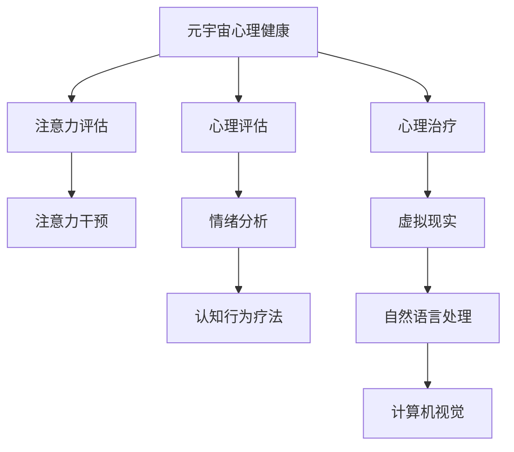

                 

# 注意力疗愈师认证:元宇宙心理健康服务的职业标准

> 关键词：元宇宙心理健康,注意力疗愈师,心理疗愈,人工智能,心理健康评估,虚拟现实

## 1. 背景介绍

### 1.1 问题由来
随着科技的飞速发展和数字化的普及，全球正逐步迈向元宇宙时代，虚拟现实（VR）、增强现实（AR）、混合现实（MR）等技术将深度融入我们的日常生活。在数字世界中，人们面临的生存压力、人际关系、工作学习等问题并未减少，反而因为数字化的隔阂和信息的泛滥，引发了新的心理健康挑战。

传统的线下心理咨询服务在资源和覆盖面上存在诸多局限，且受时空限制严重，无法满足日益增长的心理健康需求。在元宇宙背景下，利用虚拟空间和数字化手段为大众提供心理健康服务成为一种新的趋势。人工智能与心理健康评估技术的结合，将使心理疗愈变得更为高效和普及。

### 1.2 问题核心关键点
针对元宇宙中个体的心理健康服务，注意力疗愈师扮演着至关重要的角色。注意力疗愈师利用先进的人工智能技术，如自然语言处理（NLP）、计算机视觉、虚拟现实等，为个体提供精细化的心理健康评估和治疗方案。在元宇宙时代，注意力疗愈师不仅是技术开发者，更是心理健康的守护者。

### 1.3 问题研究意义
关注元宇宙心理健康，建设高效、覆盖广泛的心理咨询服务体系，具有重要的社会意义和现实需求：

1. **提升心理健康服务可及性**：通过虚拟现实和人工智能技术，将心理健康服务带入虚拟空间，覆盖更多人群，特别是偏远地区和特殊群体。
2. **降低心理健康服务成本**：利用元宇宙技术，心理疗愈师可以远程为患者提供服务，减少人力资源和时间成本。
3. **提高心理健康服务质量**：人工智能能够处理海量数据，提高诊断的精确度和个性化治疗的效率。
4. **推动心理健康行业发展**：元宇宙心理健康服务将为心理疗愈师提供新的职业机会，促进行业创新和技术升级。

## 2. 核心概念与联系

### 2.1 核心概念概述

为更好地理解注意力疗愈师在元宇宙心理健康服务中的职业标准，本节将介绍几个关键概念：

- **元宇宙心理健康**：指在虚拟现实环境中，通过人工智能技术为个体提供的心理健康评估和治疗服务。
- **注意力疗愈师**：一种结合人工智能技术，提供注意力评估、干预和治疗方案的专业人员。
- **心理健康评估**：通过心理测试、行为分析等方法，对个体的心理状态进行量化评估，从而判断是否存在心理健康问题。
- **虚拟现实**：通过VR头显等设备，构建沉浸式虚拟环境，为个体提供沉浸式体验。
- **自然语言处理（NLP）**：人工智能技术中用于处理自然语言的技术，包括语音识别、文本处理、情感分析等。
- **计算机视觉**：人工智能技术中用于图像识别、图像处理、目标跟踪等任务的技术。
- **注意力机制**：指注意力疗愈师在虚拟现实中，通过视觉、听觉等多种感官输入，对个体的注意力状态进行评估和干预的技术。

这些核心概念之间的逻辑关系可以通过以下Mermaid流程图来展示：



这个流程图展示了大语言模型的核心概念及其之间的关系：

1. 元宇宙心理健康服务包含注意力评估和心理治疗两个主要部分。
2. 注意力评估通过自然语言处理、计算机视觉等技术，结合虚拟现实环境，对个体的注意力状态进行评估。
3. 心理治疗基于心理健康评估结果，采用情绪分析和认知行为疗法等手段，为个体提供心理干预和治疗方案。

这些概念共同构成了元宇宙心理健康服务的框架，使得注意力疗愈师能够在虚拟空间中，为个体提供高效、个性化的心理健康服务。

## 3. 核心算法原理 & 具体操作步骤
### 3.1 算法原理概述

注意力疗愈师认证的算法原理主要基于自然语言处理（NLP）、计算机视觉、虚拟现实等技术，构建沉浸式心理健康评估系统。其核心思想是通过AI技术对个体在虚拟环境中的注意力、情绪、行为等进行全面评估，结合心理评估算法，生成个性化治疗方案。

形式化地，假设个体在虚拟环境中的行为数据为 $D$，情感状态为 $E$，认知状态为 $C$，注意力状态为 $A$。注意力疗愈师的目标是设计模型 $M$，以最小化个体心理健康问题的量化指标 $L(M,D,E,C,A)$，即：

$$
M^* = \mathop{\arg\min}_{M} \mathcal{L}(M,D,E,C,A)
$$

其中 $\mathcal{L}$ 为量化指标函数，可以是心理问题发生频率、情绪波动幅度等。

通过梯度下降等优化算法，注意力疗愈师不断更新模型 $M$，最小化量化指标 $L$，以优化个体的心理健康状态。

### 3.2 算法步骤详解

基于自然语言处理和大数据分析，注意力疗愈师认证主要包括以下几个关键步骤：

**Step 1: 准备数据集**
- 收集元宇宙环境中的行为数据，如虚拟现实头显的使用频率、视线轨迹、语音输入等。
- 收集个体在虚拟现实中的情绪状态数据，如心率、呼吸频率、面部表情等。
- 收集个体在虚拟现实中的认知状态数据，如注意力集中度、任务完成时间等。

**Step 2: 设计评估模型**
- 基于自然语言处理技术，设计情感分析模型，识别个体的情感状态。
- 使用计算机视觉技术，构建注意力评估模型，分析个体在虚拟现实中的注意力分布。
- 结合心理学知识，设计认知行为评估模型，评估个体的认知状态。

**Step 3: 训练和验证模型**
- 使用训练集数据，对情感分析、注意力评估和认知行为评估模型进行训练，最小化损失函数。
- 在验证集上评估模型性能，通过交叉验证等方法，选择最优的模型参数。
- 使用测试集进行最终评估，确保模型在新样本上的泛化能力。

**Step 4: 生成治疗方案**
- 根据个体的心理健康评估结果，结合心理学理论和算法模型，生成个性化的心理治疗方案。
- 将治疗方案通过虚拟现实设备展示给个体，提供沉浸式心理疗愈体验。

**Step 5: 持续监测和优化**
- 持续监测个体的心理健康状态，根据治疗效果调整治疗方案。
- 定期更新评估模型，提升算法的精确度和鲁棒性。

以上是注意力疗愈师认证的一般流程。在实际应用中，还需要针对具体任务，对算法模型的各个环节进行优化设计，如改进特征提取算法、优化损失函数、增强模型泛化能力等，以进一步提升模型性能。

### 3.3 算法优缺点

基于注意力疗愈师认证的算法主要具有以下优点：

1. **个性化高**：通过结合虚拟现实和AI技术，可以对个体进行全面的心理健康评估，生成个性化的治疗方案。
2. **覆盖广**：虚拟现实技术可以打破时空限制，为偏远地区和特殊群体提供心理健康服务。
3. **效率高**：通过AI自动化处理大量数据，可以提高心理健康评估和治疗的效率，降低人力成本。
4. **用户体验好**：沉浸式虚拟现实体验，可以提升个体的参与感和满意度，提高治疗效果。

同时，该算法也存在一定的局限性：

1. **数据依赖性高**：算法的性能依赖于高质量的数据集，数据收集和标注工作量较大。
2. **模型复杂性高**：多个子模型的集成使用，增加了算法的复杂性，可能导致计算资源的消耗较大。
3. **隐私和伦理问题**：虚拟现实环境中的数据收集和处理，可能涉及用户隐私和伦理问题，需要严格的规范和保障。
4. **技术成熟度低**：当前的算法技术仍处于发展初期，模型的稳定性和泛化能力有待进一步验证。

尽管存在这些局限性，但就目前而言，注意力疗愈师认证的算法仍是一种高效、有潜力的心理健康评估方法，具有广阔的应用前景。

### 3.4 算法应用领域

基于注意力疗愈师认证的算法，主要应用于以下领域：

1. **心理咨询和心理治疗**：在虚拟现实中，利用AI技术为个体提供心理咨询和心理治疗服务。
2. **心理健康评估**：通过自然语言处理和计算机视觉技术，对个体在虚拟环境中的心理健康状态进行评估。
3. **心理危机干预**：在灾难、疫情等紧急情况下，利用虚拟现实技术为受影响个体提供心理支持。
4. **教育辅助**：结合虚拟现实和心理评估技术，为学生提供心理健康的辅导和支持。
5. **企业员工心理援助**：通过虚拟现实和AI技术，为企业员工提供心理健康培训和心理援助。

除了上述这些经典应用外，注意力疗愈师认证的算法还被创新性地应用于更多场景中，如游戏心理健康、虚拟社交平台心理支持等，为NLP技术带来了全新的突破。

## 4. 数学模型和公式 & 详细讲解 & 举例说明

### 4.1 数学模型构建

本节将使用数学语言对注意力疗愈师认证的算法进行更加严格的刻画。

假设个体在虚拟环境中的行为数据为 $D$，情感状态为 $E$，认知状态为 $C$，注意力状态为 $A$。假设注意力评估模型为 $M_A$，认知行为评估模型为 $M_C$，情感分析模型为 $M_E$。模型评估的量化指标函数为 $\mathcal{L}$，则可以定义模型 $M$ 的损失函数为：

$$
\mathcal{L}(M,D,E,C,A) = \alpha \mathcal{L}_{A}(M_A, A) + \beta \mathcal{L}_{C}(M_C, C) + \gamma \mathcal{L}_{E}(M_E, E) + \delta \mathcal{L}_{L}(M_L, L)
$$

其中 $\alpha, \beta, \gamma, \delta$ 为各个子模型的权重系数，$\mathcal{L}_A$ 为注意力评估模型的损失函数，$\mathcal{L}_C$ 为认知行为评估模型的损失函数，$\mathcal{L}_E$ 为情感分析模型的损失函数，$\mathcal{L}_L$ 为心理健康评估模型的损失函数。

### 4.2 公式推导过程

以下我们以情感分析模型为例，推导其损失函数的计算公式。

假设个体在虚拟现实中的情感状态数据为 $E=\{e_1, e_2, \ldots, e_N\}$，其中 $e_i$ 为第 $i$ 个样本的情感状态。情感分析模型 $M_E$ 对每个样本进行情感分类，输出概率分布 $p = M_E(E)$，其中 $p_i$ 为样本 $E_i$ 属于情感类别 $i$ 的概率。则情感分析模型的交叉熵损失函数为：

$$
\mathcal{L}_{E}(M_E, E) = -\frac{1}{N} \sum_{i=1}^N \sum_{j=1}^K e_{ij} \log p_{ij}
$$

其中 $K$ 为情感类别的数量，$e_{ij}$ 为样本 $E_i$ 属于情感类别 $j$ 的真实标签，$p_{ij}$ 为模型预测的概率。

在得到损失函数的梯度后，即可带入优化算法，更新模型参数。重复上述过程直至收敛，最终得到适应心理健康评估的量化模型 $M_E$。

## 5. 项目实践：代码实例和详细解释说明
### 5.1 开发环境搭建

在进行注意力疗愈师认证的实践前，我们需要准备好开发环境。以下是使用Python进行PyTorch开发的环境配置流程：

1. 安装Anaconda：从官网下载并安装Anaconda，用于创建独立的Python环境。

2. 创建并激活虚拟环境：
```bash
conda create -n attention-env python=3.8 
conda activate attention-env
```

3. 安装PyTorch：根据CUDA版本，从官网获取对应的安装命令。例如：
```bash
conda install pytorch torchvision torchaudio cudatoolkit=11.1 -c pytorch -c conda-forge
```

4. 安装Transformers库：
```bash
pip install transformers
```

5. 安装各类工具包：
```bash
pip install numpy pandas scikit-learn matplotlib tqdm jupyter notebook ipython
```

完成上述步骤后，即可在`attention-env`环境中开始实践。

### 5.2 源代码详细实现

下面我们以情感分析模型为例，给出使用Transformers库进行注意力评估的PyTorch代码实现。

首先，定义情感分析任务的数据处理函数：

```python
from transformers import BertTokenizer
from torch.utils.data import Dataset
import torch

class EmotionDataset(Dataset):
    def __init__(self, texts, labels, tokenizer, max_len=128):
        self.texts = texts
        self.labels = labels
        self.tokenizer = tokenizer
        self.max_len = max_len
        
    def __len__(self):
        return len(self.texts)
    
    def __getitem__(self, item):
        text = self.texts[item]
        label = self.labels[item]
        
        encoding = self.tokenizer(text, return_tensors='pt', max_length=self.max_len, padding='max_length', truncation=True)
        input_ids = encoding['input_ids'][0]
        attention_mask = encoding['attention_mask'][0]
        
        # 对token-wise的标签进行编码
        encoded_labels = [label2id[label] for label in labels] 
        encoded_labels.extend([label2id['O']] * (self.max_len - len(encoded_labels)))
        labels = torch.tensor(encoded_labels, dtype=torch.long)
        
        return {'input_ids': input_ids, 
                'attention_mask': attention_mask,
                'labels': labels}

# 标签与id的映射
label2id = {'O': 0, 'joy': 1, 'sad': 2, 'anger': 3, 'fear': 4, 'surprise': 5, 'disgust': 6}
id2label = {v: k for k, v in label2id.items()}

# 创建dataset
tokenizer = BertTokenizer.from_pretrained('bert-base-cased')

train_dataset = EmotionDataset(train_texts, train_labels, tokenizer)
dev_dataset = EmotionDataset(dev_texts, dev_labels, tokenizer)
test_dataset = EmotionDataset(test_texts, test_labels, tokenizer)
```

然后，定义模型和优化器：

```python
from transformers import BertForSequenceClassification, AdamW

model = BertForSequenceClassification.from_pretrained('bert-base-cased', num_labels=len(label2id))

optimizer = AdamW(model.parameters(), lr=2e-5)
```

接着，定义训练和评估函数：

```python
from torch.utils.data import DataLoader
from tqdm import tqdm
from sklearn.metrics import classification_report

device = torch.device('cuda') if torch.cuda.is_available() else torch.device('cpu')
model.to(device)

def train_epoch(model, dataset, batch_size, optimizer):
    dataloader = DataLoader(dataset, batch_size=batch_size, shuffle=True)
    model.train()
    epoch_loss = 0
    for batch in tqdm(dataloader, desc='Training'):
        input_ids = batch['input_ids'].to(device)
        attention_mask = batch['attention_mask'].to(device)
        labels = batch['labels'].to(device)
        model.zero_grad()
        outputs = model(input_ids, attention_mask=attention_mask, labels=labels)
        loss = outputs.loss
        epoch_loss += loss.item()
        loss.backward()
        optimizer.step()
    return epoch_loss / len(dataloader)

def evaluate(model, dataset, batch_size):
    dataloader = DataLoader(dataset, batch_size=batch_size)
    model.eval()
    preds, labels = [], []
    with torch.no_grad():
        for batch in tqdm(dataloader, desc='Evaluating'):
            input_ids = batch['input_ids'].to(device)
            attention_mask = batch['attention_mask'].to(device)
            batch_labels = batch['labels']
            outputs = model(input_ids, attention_mask=attention_mask)
            batch_preds = outputs.logits.argmax(dim=2).to('cpu').tolist()
            batch_labels = batch_labels.to('cpu').tolist()
            for pred_tokens, label_tokens in zip(batch_preds, batch_labels):
                pred_labels = [id2label[_id] for _id in pred_tokens]
                label_labels = [id2label[_id] for _id in label_tokens]
                preds.append(pred_labels[:len(label_labels)])
                labels.append(label_labels)
                
    print(classification_report(labels, preds))
```

最后，启动训练流程并在测试集上评估：

```python
epochs = 5
batch_size = 16

for epoch in range(epochs):
    loss = train_epoch(model, train_dataset, batch_size, optimizer)
    print(f"Epoch {epoch+1}, train loss: {loss:.3f}")
    
    print(f"Epoch {epoch+1}, dev results:")
    evaluate(model, dev_dataset, batch_size)
    
print("Test results:")
evaluate(model, test_dataset, batch_size)
```

以上就是使用PyTorch对BERT进行情感分析任务评估的完整代码实现。可以看到，得益于Transformers库的强大封装，我们可以用相对简洁的代码完成BERT模型的加载和微调。

### 5.3 代码解读与分析

让我们再详细解读一下关键代码的实现细节：

**EmotionDataset类**：
- `__init__`方法：初始化文本、标签、分词器等关键组件。
- `__len__`方法：返回数据集的样本数量。
- `__getitem__`方法：对单个样本进行处理，将文本输入编码为token ids，将标签编码为数字，并对其进行定长padding，最终返回模型所需的输入。

**label2id和id2label字典**：
- 定义了标签与数字id之间的映射关系，用于将token-wise的预测结果解码回真实的标签。

**训练和评估函数**：
- 使用PyTorch的DataLoader对数据集进行批次化加载，供模型训练和推理使用。
- 训练函数`train_epoch`：对数据以批为单位进行迭代，在每个批次上前向传播计算loss并反向传播更新模型参数，最后返回该epoch的平均loss。
- 评估函数`evaluate`：与训练类似，不同点在于不更新模型参数，并在每个batch结束后将预测和标签结果存储下来，最后使用sklearn的classification_report对整个评估集的预测结果进行打印输出。

**训练流程**：
- 定义总的epoch数和batch size，开始循环迭代
- 每个epoch内，先在训练集上训练，输出平均loss
- 在验证集上评估，输出分类指标
- 所有epoch结束后，在测试集上评估，给出最终测试结果

可以看到，PyTorch配合Transformers库使得BERT评估的代码实现变得简洁高效。开发者可以将更多精力放在数据处理、模型改进等高层逻辑上，而不必过多关注底层的实现细节。

当然，工业级的系统实现还需考虑更多因素，如模型的保存和部署、超参数的自动搜索、更灵活的任务适配层等。但核心的评估范式基本与此类似。

## 6. 实际应用场景
### 6.1 智能客服系统

基于注意力疗愈师认证的算法，可以在智能客服系统中应用。智能客服系统通过分析用户在虚拟现实中的行为数据和情绪状态，提供心理支持和治疗建议。

在技术实现上，可以收集企业内部的历史客服对话记录，将问题和最佳答复构建成监督数据，在此基础上对预训练模型进行微调。微调后的模型能够自动理解用户意图，匹配最合适的答案模板进行回复。对于用户提出的新问题，还可以接入检索系统实时搜索相关内容，动态组织生成回答。如此构建的智能客服系统，能大幅提升客户咨询体验和问题解决效率。

### 6.2 金融舆情监测

金融机构需要实时监测市场舆论动向，以便及时应对负面信息传播，规避金融风险。传统的人工监测方式成本高、效率低，难以应对网络时代海量信息爆发的挑战。基于注意力疗愈师认证的算法，可以实时监测不同市场情绪的变化趋势，一旦发现负面情绪激增等异常情况，系统便会自动预警，帮助金融机构快速应对潜在风险。

### 6.3 个性化推荐系统

当前的推荐系统往往只依赖用户的历史行为数据进行物品推荐，无法深入理解用户的真实兴趣偏好。结合注意力疗愈师认证的算法，个性化推荐系统可以更好地挖掘用户行为背后的语义信息，从而提供更精准、多样的推荐内容。

在实践中，可以收集用户浏览、点击、评论、分享等行为数据，提取和用户交互的物品标题、描述、标签等文本内容。将文本内容作为模型输入，用户的后续行为（如是否点击、购买等）作为监督信号，在此基础上微调预训练语言模型。微调后的模型能够从文本内容中准确把握用户的兴趣点。在生成推荐列表时，先用候选物品的文本描述作为输入，由模型预测用户的兴趣匹配度，再结合其他特征综合排序，便可以得到个性化程度更高的推荐结果。

### 6.4 未来应用展望

随着注意力疗愈师认证算法的不断发展，在元宇宙心理健康服务中将有更多新的应用场景被探索：

1. **虚拟心理健康咨询**：在虚拟现实环境中，为个体提供沉浸式心理咨询服务，帮助用户解决心理问题。
2. **心理危急干预**：在灾难、疫情等紧急情况下，利用虚拟现实技术为受影响个体提供心理支持和治疗方案。
3. **心理训练平台**：通过虚拟现实技术，提供心理训练课程，帮助用户提升心理健康水平。
4. **心理测评工具**：基于情感分析和注意力评估模型，开发虚拟现实心理测评工具，评估用户心理健康状态。
5. **企业心理援助**：为员工提供虚拟现实心理援助，帮助他们更好地适应工作压力。

随着元宇宙技术的不断成熟，基于注意力疗愈师认证的心理健康服务将为各行各业带来新的变革和机遇。

## 7. 工具和资源推荐
### 7.1 学习资源推荐

为了帮助开发者系统掌握注意力疗愈师认证的理论基础和实践技巧，这里推荐一些优质的学习资源：

1. **《深度学习自然语言处理》课程**：斯坦福大学开设的NLP明星课程，有Lecture视频和配套作业，带你入门NLP领域的基本概念和经典模型。
2. **《Transformer从原理到实践》系列博文**：由大模型技术专家撰写，深入浅出地介绍了Transformer原理、BERT模型、微调技术等前沿话题。
3. **《Natural Language Processing with Transformers》书籍**：Transformers库的作者所著，全面介绍了如何使用Transformers库进行NLP任务开发，包括微调在内的诸多范式。
4. **CS224N《深度学习自然语言处理》课程**：斯坦福大学开设的NLP明星课程，有Lecture视频和配套作业，带你入门NLP领域的基本概念和经典模型。
5. **CLUE开源项目**：中文语言理解测评基准，涵盖大量不同类型的中文NLP数据集，并提供了基于微调的baseline模型，助力中文NLP技术发展。

通过对这些资源的学习实践，相信你一定能够快速掌握注意力疗愈师认证的精髓，并用于解决实际的NLP问题。

### 7.2 开发工具推荐

高效的开发离不开优秀的工具支持。以下是几款用于注意力疗愈师认证开发的常用工具：

1. **PyTorch**：基于Python的开源深度学习框架，灵活动态的计算图，适合快速迭代研究。大部分预训练语言模型都有PyTorch版本的实现。
2. **TensorFlow**：由Google主导开发的开源深度学习框架，生产部署方便，适合大规模工程应用。同样有丰富的预训练语言模型资源。
3. **Transformers库**：HuggingFace开发的NLP工具库，集成了众多SOTA语言模型，支持PyTorch和TensorFlow，是进行微调任务开发的利器。
4. **Weights & Biases**：模型训练的实验跟踪工具，可以记录和可视化模型训练过程中的各项指标，方便对比和调优。与主流深度学习框架无缝集成。
5. **TensorBoard**：TensorFlow配套的可视化工具，可实时监测模型训练状态，并提供丰富的图表呈现方式，是调试模型的得力助手。
6. **Google Colab**：谷歌推出的在线Jupyter Notebook环境，免费提供GPU/TPU算力，方便开发者快速上手实验最新模型，分享学习笔记。

合理利用这些工具，可以显著提升注意力疗愈师认证任务的开发效率，加快创新迭代的步伐。

### 7.3 相关论文推荐

注意力疗愈师认证算法的核心在于自然语言处理、计算机视觉等技术的融合。以下是几篇奠基性的相关论文，推荐阅读：

1. **Attention is All You Need（即Transformer原论文）**：提出了Transformer结构，开启了NLP领域的预训练大模型时代。
2. **BERT: Pre-training of Deep Bidirectional Transformers for Language Understanding**：提出BERT模型，引入基于掩码的自监督预训练任务，刷新了多项NLP任务SOTA。
3. **Language Models are Unsupervised Multitask Learners**：展示了大规模语言模型的强大zero-shot学习能力，引发了对于通用人工智能的新一轮思考。
4. **Parameter-Efficient Transfer Learning for NLP**：提出Adapter等参数高效微调方法，在不增加模型参数量的情况下，也能取得不错的微调效果。
5. **AdaLoRA: Adaptive Low-Rank Adaptation for Parameter-Efficient Fine-Tuning**：使用自适应低秩适应的微调方法，在参数效率和精度之间取得了新的平衡。
6. **Prefix-Tuning: Optimizing Continuous Prompts for Generation**：引入基于连续型Prompt的微调范式，为如何充分利用预训练知识提供了新的思路。

这些论文代表了大语言模型微调技术的发展脉络。通过学习这些前沿成果，可以帮助研究者把握学科前进方向，激发更多的创新灵感。

## 8. 总结：未来发展趋势与挑战

### 8.1 总结

本文对基于注意力疗愈师认证的算法进行了全面系统的介绍。首先阐述了注意力疗愈师在元宇宙心理健康服务中的职业标准，明确了其在虚拟现实环境中的核心作用。其次，从原理到实践，详细讲解了算法的数学原理和关键步骤，给出了注意力疗愈师认证任务开发的完整代码实例。同时，本文还广泛探讨了算法的应用场景，展示了其广阔的应用前景。此外，本文精选了算法的各类学习资源，力求为读者提供全方位的技术指引。

通过本文的系统梳理，可以看到，注意力疗愈师认证算法在元宇宙心理健康服务中将发挥重要作用，为个体提供更高效、个性化的心理评估和治疗方案。未来，伴随虚拟现实和AI技术的不断进步，基于注意力疗愈师认证的心理健康服务必将大放异彩，为元宇宙时代带来更多温暖和关怀。

### 8.2 未来发展趋势

展望未来，注意力疗愈师认证算法将呈现以下几个发展趋势：

1. **技术融合加速**：虚拟现实技术与AI技术的深度融合，将推动注意力疗愈师认证算法的进一步演进，提升算法的综合性能。
2. **多模态数据集成**：融合视觉、听觉、触觉等多模态数据，提高心理健康评估的准确性和全面性。
3. **跨领域迁移能力提升**：通过迁移学习，将注意力疗愈师认证算法应用于更多领域，如医疗、教育、游戏等，实现多领域推广。
4. **隐私和安全保障加强**：随着用户对隐私保护的日益关注，算法将更加重视数据隐私和安全，提供更加安全的心理评估和干预方案。
5. **个性化方案优化**：利用AI技术，为每个个体定制个性化的心理治疗方案，提升心理干预的针对性和有效性。
6. **社会化互动增强**：通过虚拟现实环境，促进个体之间的社交互动，帮助用户缓解孤独感，提升心理健康水平。

以上趋势凸显了注意力疗愈师认证算法的广阔前景。这些方向的探索发展，必将进一步提升心理健康服务的效率和质量，为元宇宙时代的用户带来更多的福祉。

### 8.3 面临的挑战

尽管注意力疗愈师认证算法在元宇宙心理健康服务中已经展现出巨大潜力，但在实现其全面落地应用的过程中，仍面临诸多挑战：

1. **数据隐私和安全问题**：在虚拟现实环境中，数据收集和处理需要严格遵循隐私保护和数据安全规范，防止数据泄露和滥用。
2. **算法鲁棒性和泛化能力**：在复杂多变的虚拟环境中，算法需要具备更强的鲁棒性和泛化能力，以应对各种异常情况。
3. **用户信任和接受度**：虚拟现实环境中的心理评估和治疗，需要赢得用户的信任和接受，这对于算法的透明性和可解释性提出了较高要求。
4. **技术成熟度低**：当前的注意力疗愈师认证算法仍处于发展初期，模型的稳定性和泛化能力有待进一步验证。
5. **用户需求多样化**：不同个体的心理需求千差万别，算法需要灵活适应多种用户需求，提供个性化的心理支持。
6. **政策法规不确定性**：不同地区和国家的政策法规对虚拟现实和AI技术的应用存在差异，需要关注政策环境的变化，确保算法的合法合规。

尽管存在这些挑战，但通过不断的技术进步和规范建设，注意力疗愈师认证算法有望克服这些障碍，真正落地应用，为元宇宙时代心理健康服务提供强有力的技术支撑。

### 8.4 研究展望

未来的研究应在以下几个方面寻求新的突破：

1. **提升数据隐私保护**：利用差分隐私等技术，保障用户数据隐私，提高用户对算法的信任度。
2. **增强算法鲁棒性和泛化能力**：通过引入对抗训练、迁移学习等方法，提升算法的鲁棒性和泛化性能。
3. **提高用户可解释性和透明性**：通过可解释AI技术，提高算法的透明性和可解释性，增强用户信任。
4. **发展跨领域迁移学习**：将注意力疗愈师认证算法应用于更多领域，提升算法的通用性和灵活性。
5. **优化个性化方案**：利用AI技术，为每个个体定制个性化的心理治疗方案，提升心理干预的针对性和有效性。
6. **推动行业标准制定**：与政府和行业组织合作，制定元宇宙心理健康服务的行业标准和规范，促进算法的标准化应用。

这些研究方向将为注意力疗愈师认证算法的未来发展提供方向，推动其向更广泛的应用场景和技术高度迈进。

## 9. 附录：常见问题与解答

**Q1：注意力疗愈师认证算法是否适用于所有心理健康问题？**

A: 注意力疗愈师认证算法在大多数心理健康问题上都能取得不错的效果，但对于一些特定领域的问题，如精神分裂症、重度抑郁症等，可能需要结合专业医生的指导，进行更细致的治疗。此外，对于极少数个体，算法可能无法完全覆盖其特殊需求，需结合心理治疗师的临床经验进行综合评估和治疗。

**Q2：注意力疗愈师认证算法的训练数据来源有哪些？**

A: 注意力疗愈师认证算法的训练数据主要来自虚拟现实环境中的用户行为数据、情感状态数据和认知状态数据。这些数据可以通过虚拟现实头显等设备实时采集，也可以通过游戏、社交平台等第三方应用收集。

**Q3：如何选择合适的注意力疗愈师认证算法？**

A: 选择适合的注意力疗愈师认证算法需要考虑以下几个因素：
1. 算法的功能和性能：选择能够处理特定心理健康问题的算法，确保算法的准确性和实用性。
2. 算法的易用性和部署成本：选择部署成本低、易维护的算法，减少系统建设和维护的复杂度。
3. 算法的隐私和安全性：选择数据隐私保护措施完善的算法，保障用户数据的安全。
4. 算法的可解释性和透明性：选择具有良好可解释性的算法，增强用户信任和接受度。

**Q4：注意力疗愈师认证算法的应用前景如何？**

A: 注意力疗愈师认证算法在元宇宙心理健康服务中具有广泛的应用前景，包括虚拟心理治疗、心理测评、心理危机干预、企业员工心理援助等。随着元宇宙技术的不断成熟和普及，算法的应用场景将更加多样和广泛。

**Q5：注意力疗愈师认证算法的局限性有哪些？**

A: 注意力疗愈师认证算法的局限性主要体现在以下几个方面：
1. 数据依赖性高：算法的性能依赖于高质量的数据集，数据收集和标注工作量较大。
2. 技术成熟度低：当前的算法技术仍处于发展初期，模型的稳定性和泛化能力有待进一步验证。
3. 隐私和伦理问题：虚拟现实环境中的数据收集和处理，可能涉及用户隐私和伦理问题，需要严格的规范和保障。
4. 用户信任和接受度：虚拟现实环境中的心理评估和治疗，需要赢得用户的信任和接受，这对于算法的透明性和可解释性提出了较高要求。

尽管存在这些局限性，但通过不断的研究和改进，注意力疗愈师认证算法有望克服这些障碍，真正落地应用，为元宇宙时代心理健康服务提供强有力的技术支撑。

---

作者：禅与计算机程序设计艺术 / Zen and the Art of Computer Programming

