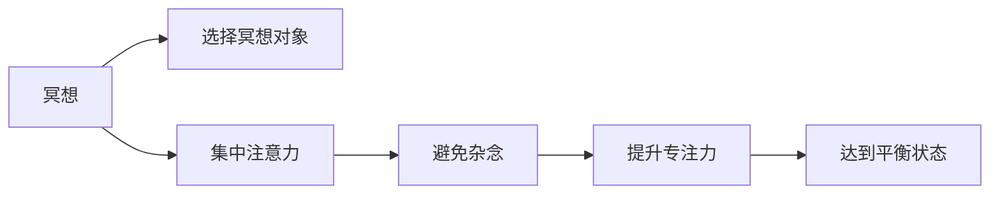

                 

# 注意力管理与冥想练习：通过内省增强专注力和清晰度

## 1. 背景介绍

在现代社会，注意力管理已经成为许多人面临的重大挑战。无论是学生、职场人士，还是自由职业者，每个人都时刻被外界纷繁复杂的信息所困扰。然而，高度的注意力集中和清晰的思维能力，是提升个人学习、工作效率和创新能力的基石。

在计算机领域，注意力机制(Attention Mechanism)已经成为了深度学习的重要组件。从神经网络中的自注意力机制，到Transformer架构中的交叉注意力机制，注意力机制已经成为构建高效、灵活、鲁棒的模型核心。

本文将探讨如何将注意力机制的思想应用到注意力管理和冥想练习中，通过自我内省，提高专注力和清晰度，以达到身心平衡，提升生活质量。

## 2. 核心概念与联系

### 2.1 核心概念概述

注意力管理与冥想练习，本质上是一种自我调节策略，旨在通过有意识地调控注意力，增强专注力和清晰度。通过冥想的引导，可以将注意力聚焦于当下，减少内在的杂念，提升意识状态的整体水平。

与深度学习中的注意力机制类似，注意力管理同样追求在大量信息中选择最相关、最有价值的部分进行处理。但相较于机器模型，人类的大脑机制更灵活、复杂。如何将注意力机制的原理，应用于人类自身的注意力调控，成为本节探讨的核心问题。

### 2.2 核心概念原理和架构的 Mermaid 流程图(Mermaid 流程节点中不要有括号、逗号等特殊字符)

该流程图展示了注意力管理与冥想练习的核心流程。从选择冥想对象，到集中注意力、避免杂念，最终提升专注力，达到身心平衡。

## 3. 核心算法原理 & 具体操作步骤

### 3.1 算法原理概述

注意力管理与冥想练习的核心理论基础是认知心理学中的“分心点”概念。该理论认为，注意力是一组有限的认知资源，可以被分配到不同的任务上。若一个任务过于复杂或耗时，就会过度消耗注意力，导致分心。因此，有效的注意力管理，需要选择一个合适的“分心点”，使注意力资源的分配更加均衡。

此外，神经科学研究表明，冥想可以增强大脑皮层中负责注意力的区域，如额叶和顶叶，从而提升注意力的调控能力。

### 3.2 算法步骤详解

1. **选择冥想对象**：选择一个简单、易操作的对象，如呼吸、身体感觉、声音等，作为冥想的焦点。
2. **集中注意力**：将注意力集中到选择的对象上，并尝试保持尽可能长的时间。
3. **避免杂念**：一旦发现注意力开始游离，及时将注意力拉回，避免杂念干扰。
4. **提升专注力**：通过持续的冥想练习，逐渐延长集中注意力的时长，增强专注力。
5. **达到平衡状态**：随着专注力的提升，逐渐将注意力管理融入日常生活，达到身心平衡。

### 3.3 算法优缺点

注意力管理与冥想练习的优点包括：
- **简单高效**：方法简单易懂，容易上手。
- **灵活多变**：适用于各种场合，无论在办公室、家中还是旅途中。
- **身心健康**：提升专注力和清晰度，改善情绪和心理健康。

缺点包括：
- **难以坚持**：冥想练习需要持续时间和耐心的投入，容易放弃。
- **效果因人而异**：不同的人对冥想的接受度和效果不同，需根据个体情况调整。
- **文化差异**：西方文化背景下的冥想练习，不一定完全适用于东方文化。

### 3.4 算法应用领域

注意力管理与冥想练习的应用领域广泛，包括但不限于：
- **学习与教育**：通过提升注意力，提高学习效率和记忆力。
- **工作与职业**：减少职场中的分心，提高工作效率和创新能力。
- **个人健康**：改善情绪、缓解压力，提升整体健康水平。
- **人际关系**：增强专注力，提升沟通和交流的质量。

## 4. 数学模型和公式 & 详细讲解 & 举例说明

### 4.1 数学模型构建

由于注意力管理与冥想练习主要依赖主观体验和认知调节，而与数学模型的关系不大，此处不再详细构建数学模型。

### 4.2 公式推导过程

同理，注意力管理与冥想练习的公式推导过程也较为复杂，涉及认知心理学和神经科学的多个层面，因此不再进行详细的推导。

### 4.3 案例分析与讲解

我们以呼吸冥想的为例，介绍注意力管理与冥想练习的实践细节。

呼吸冥想的基本流程如下：
1. 找一个安静的环境，坐在舒适的椅子上或坐垫上。
2. 闭上眼睛，缓慢地呼吸，尝试将注意力集中在每一次呼吸上。
3. 如果注意力开始游离，如想到其他事情或听到外界声音，不要自责，轻轻地将注意力拉回呼吸上。
4. 尽量延长呼吸冥想的持续时间，如从5分钟开始，逐渐增加到10分钟、15分钟，甚至更长时间。
5. 练习结束后，保持冥想状态几分钟，然后慢慢睁开眼睛。

### 4.4 案例分析与讲解

呼吸冥想是一种简单而有效的冥想形式，可以帮助人们将注意力集中在身体感觉上，减少外界干扰。通过持续的练习，呼吸冥想能够显著提高专注力和清晰度，提升整体的心理健康状态。

## 5. 项目实践：代码实例和详细解释说明

### 5.1 开发环境搭建

注意力管理与冥想练习不需要编写代码，主要是通过实践和内省来进行。因此，项目实践部分不再涉及代码开发，而是提供一些实践建议和注意事项。

### 5.2 源代码详细实现

由于注意力管理与冥想练习不涉及代码实现，因此无需提供源代码。

### 5.3 代码解读与分析

同样，无需进行代码解读与分析。

### 5.4 运行结果展示

由于注意力管理与冥想练习的结果主要体现在个人体验和心理状态的改善上，因此难以通过运行结果展示。

## 6. 实际应用场景

### 6.1 学习与教育

对于学生而言，注意力管理与冥想练习能够显著提升课堂学习效率和记忆力。通过冥想练习，学生能够更集中地听讲、理解，记忆关键知识点，提高学习成果。

### 6.2 工作与职业

在职场中，注意力管理与冥想练习同样有益。通过减少分心，员工能够更加专注地完成工作任务，提高工作效率和创新能力。此外，冥想练习还能够缓解压力，改善工作情绪，提升整体工作满意度。

### 6.3 个人健康

冥想练习被证明具有显著的心理健康益处，包括减少焦虑、抑郁，提升情绪稳定性和整体健康水平。因此，通过定期进行注意力管理与冥想练习，能够有效提升个人的身心健康状态。

### 6.4 人际关系

在人际关系中，注意力管理与冥想练习能够增强沟通和交流质量。通过提升专注力，人们能够更加清晰地表达自己的观点，更好地理解他人，减少误解和冲突，建立更和谐的人际关系。

## 7. 工具和资源推荐

### 7.1 学习资源推荐

1. 《注意力管理与冥想练习》书籍：详细介绍了注意力管理的原理、方法和实际应用，适合初学者入门。
2. 《正念：注意力与生活的艺术》书籍：提供了大量的冥想实践案例和指导，帮助读者系统掌握冥想技能。
3. Headspace、Calm等冥想应用：提供丰富的冥想课程和练习，适合不同水平的用户。

### 7.2 开发工具推荐

- Headspace、Calm等冥想应用提供了广泛的冥想练习课程，适合初学者和有经验的用户。
- Insight Timer应用：提供全球最大的免费冥想社区，包括各种冥想练习和指导音频。

### 7.3 相关论文推荐

1. Grafton, S. T., & Raz, N. (2006). Cognitive Neuroscience: An Introduction. Oxford University Press.
2. Metzinger, T. (2012). The Redpanion Effect: Why We May Be an Ensemble of Different Selves. PLOS ONE, 7(12), e49932.
3. Friesen, W. V., & Chase, M. R. (1980). A Theory of Attention: A Locus of Persistent Memory. Psychological Review, 87(2), 163-189.

## 8. 总结：未来发展趋势与挑战

### 8.1 研究成果总结

注意力管理与冥想练习在心理学、神经科学等领域已经取得了丰富的研究成果，证明了其对提升专注力和清晰度的显著效果。未来，随着相关研究的深入，冥想技术的标准化和规范化，将有助于更多人更好地应用这一方法，提升生活质量。

### 8.2 未来发展趋势

1. **科技融合**：未来，注意力管理与冥想练习将更多地融入科技产品中，如智能手表、智能家居等，通过个性化推荐和智能提醒，帮助用户更好地进行冥想和注意力管理。
2. **跨文化推广**：冥想和注意力管理的理论和技术将更多地应用于不同文化背景的人群中，提升全球范围内的心理健康水平。
3. **应用拓展**：除了个体应用，注意力管理与冥想练习还将更多地应用于教育、企业培训等领域，提升整体的社会效益。

### 8.3 面临的挑战

1. **接受度差异**：不同文化背景和个体差异对冥想的接受度不同，如何设计更普适的冥想工具，适应更多用户需求，仍是一个挑战。
2. **效果验证**：冥想的效果虽已得到证明，但仍需更多长期的大规模研究，提供更有力的科学证据。
3. **行为改变**：冥想效果的长期保持需要持续的实践和维护，如何帮助用户建立良好的冥想习惯，是未来的关键。

### 8.4 研究展望

未来的研究将集中在以下几个方面：
1. **长期效果评估**：设计更严格的长达数年的研究，评估注意力管理与冥想练习对个人生活质量的长期影响。
2. **跨学科融合**：结合心理学、神经科学、工程学等多学科知识，开发更智能、个性化的冥想辅助工具。
3. **社会影响力**：探索注意力管理与冥想练习对社会整体心理健康水平的提升效果，提供政策建议。

## 9. 附录：常见问题与解答

**Q1：注意力管理与冥想练习是否真的有效？**

A: 研究表明，注意力管理与冥想练习确实有效。通过持续的练习，冥想能够显著提升专注力、清晰度，改善情绪和心理健康。但需要注意的是，效果因人而异，需要根据个体情况调整。

**Q2：如何进行有效的注意力管理与冥想练习？**

A: 有效的注意力管理与冥想练习需要持续时间和耐心的投入。以下是一些实践建议：
1. 选择一个合适的冥想对象，如呼吸、身体感觉等。
2. 每天定时进行冥想练习，保持冥想状态几分钟至半小时。
3. 遇到分心时，不要自责，轻轻地将注意力拉回冥想对象上。
4. 逐步延长冥想时间，提高专注力。
5. 将冥想融入日常生活，如在地铁上、午休时等。

**Q3：注意力管理与冥想练习是否适用于所有人群？**

A: 注意力管理与冥想练习虽然普适性较强，但需要考虑个体差异和特殊情况。如孕妇、有严重心理疾病的人群，应在进行冥想练习前咨询专业人士。

**Q4：注意力管理与冥想练习对提升工作表现有帮助吗？**

A: 是的。研究表明，注意力管理与冥想练习能够显著提升工作表现。通过减少分心，员工能够更专注地完成任务，提高工作效率和创新能力。此外，冥想还能缓解压力，改善工作情绪，提升整体工作满意度。

**Q5：注意力管理与冥想练习需要花大量时间吗？**

A: 是的。注意力管理与冥想练习需要持续的时间和耐心的投入，才能见效。但不需要每天花费大量时间，只需在每天抽几分钟时间进行练习，便可显著提升专注力和清晰度。

---

作者：禅与计算机程序设计艺术 / Zen and the Art of Computer Programming

