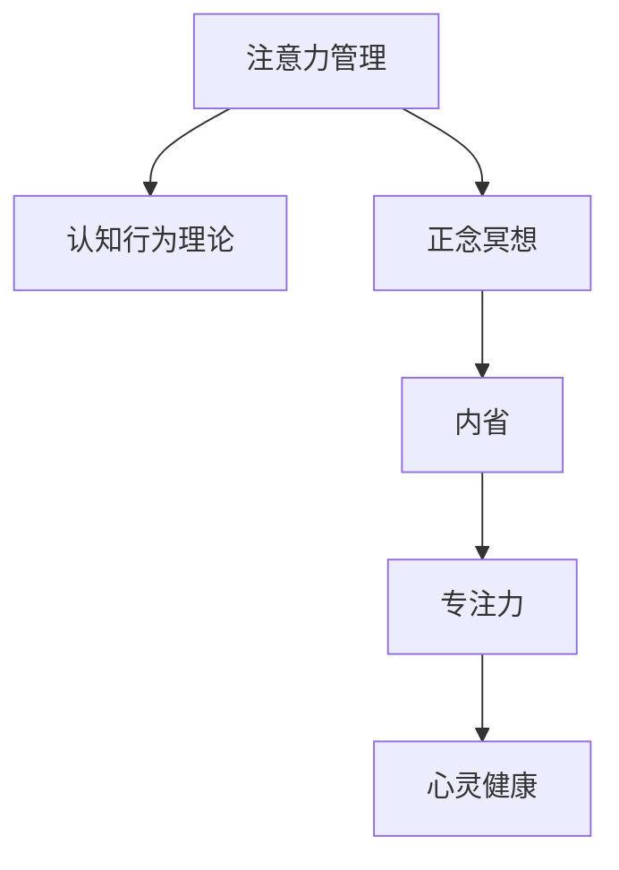

                 

# 注意力管理与正念冥想：通过内省增强专注力和心灵健康

> 关键词：注意力管理, 正念冥想, 内省, 专注力, 心灵健康, 心理健康, 情感调节, 工作压力, 技术影响

## 1. 背景介绍

### 1.1 问题由来
在现代快节奏的生活中，信息爆炸、工作压力大、生活节奏快成为普遍现象。这些因素导致人们的注意力容易分散，情绪波动大，心理健康问题逐渐显现。如何在这样的环境下管理好自己的注意力，维护良好的心理健康，成为了一个亟待解决的问题。

近年来，心理学和神经科学研究表明，正念冥想（Mindfulness Meditation）能够有效地提升个体的专注力、自我认知和情感调节能力，从而达到改善心理健康的效果。同时，技术的进步也为注意力管理和正念冥想的实践提供了新的可能性，如基于APP的冥想指导、脑电波监测设备等。

因此，本文旨在探讨注意力管理与正念冥想的理论基础、实际操作方法以及技术支持，以期帮助读者通过内省增强专注力和心灵健康。

### 1.2 问题核心关键点
本文的核心内容包括：

- 注意力管理的理论基础：包括注意力机制、认知行为理论等。
- 正念冥想的实践方法：介绍具体的冥想技巧和步骤。
- 技术工具的应用：探讨如何利用技术手段辅助注意力管理和正念冥想。
- 心理学实验与研究：提供科学依据，证明正念冥想的有效性。
- 未来发展趋势：展望注意力管理和正念冥想的未来发展方向。

这些核心内容将帮助读者系统掌握注意力管理与正念冥想的理论与实践，提升个人心理健康和生活质量。

## 2. 核心概念与联系

### 2.1 核心概念概述

为更好地理解注意力管理与正念冥想的内在联系，本节将介绍几个关键概念：

- 注意力（Attention）：是指个体将心理资源集中于某个特定的刺激或任务，忽略其他刺激的能力。注意力的管理与提升，有助于提高工作效率和学习效果。
- 正念冥想（Mindfulness Meditation）：是一种通过静坐冥想，提升自我认知和情感调节能力，从而改善心理健康的实践方法。正念冥想的核心在于觉察当前时刻的体验，不评判、不反应，从而减少情绪波动，提升专注力。
- 内省（Introspection）：是指通过自我反思，探索内心世界，提升自我认知和情感理解的能力。内省与正念冥想紧密相关，是后者的基础和核心实践手段。
- 专注力（Focus）：是指在特定时间内，保持心理资源集中于某个任务或目标，避免分心的能力。专注力是注意力管理的主要目标，也是正念冥想的直接成果。
- 心灵健康（Mental Well-being）：是指个体的心理状态良好，情绪稳定，能够应对生活中的各种挑战，体验到积极的心理感受。心灵健康是注意力管理和正念冥想的最终目标。

这些核心概念之间的逻辑关系可以通过以下Mermaid流程图来展示：

这个流程图展示了注意力管理与正念冥想的内在联系：

1. 认知行为理论为注意力管理提供理论基础。
2. 正念冥想通过静坐冥想，提升内省能力。
3. 内省帮助个体提升专注力。
4. 专注力是注意力管理的目标，也是正念冥想的直接成果。
5. 专注力的提升，有助于心灵健康的改善。

## 3. 核心算法原理 & 具体操作步骤

### 3.1 算法原理概述

注意力管理和正念冥想的核心在于提升个体的自我认知和专注力，从而改善心理健康。其基本原理包括以下几个方面：

- **认知行为理论**：认为个体的思维模式和行为习惯对情绪和心理健康有重要影响。通过改变负面思维模式和不良行为习惯，可以改善心理健康。
- **正念冥想**：通过静坐冥想，使个体关注当前时刻的体验，减少对过去或未来的担忧和焦虑，从而提升专注力和情绪稳定性。
- **内省**：通过自我反思，探索内心世界，提升自我认知和情感理解能力。内省与正念冥想相辅相成，是后者的基础和核心实践手段。
- **专注力训练**：通过特定的任务和练习，提升个体在特定时间内的注意力集中能力。专注力训练是注意力管理的重要手段。
- **心灵健康**：通过改善认知、情绪和行为习惯，提升个体的心理健康水平。

### 3.2 算法步骤详解

#### 3.2.1 注意力管理的基本步骤

1. **认知评估**：
   - 进行自我评估，识别出自己的负面思维模式和不良行为习惯。
   - 记录日常生活中影响注意力和情绪波动的事件。

2. **认知重构**：
   - 使用认知行为疗法（CBT）技术，改变负面思维模式。
   - 制定新的行为计划，避免不良行为习惯。

3. **专注力训练**：
   - 进行一系列专注力训练任务，如冥想、正念呼吸、数字组合记忆等。
   - 每天固定时间进行训练，记录进步。

4. **应用与调整**：
   - 将注意力管理技巧应用到日常生活中。
   - 根据效果进行调整，持续改进。

#### 3.2.2 正念冥想的基本步骤

1. **选择环境**：
   - 找一个安静、舒适的环境，避免干扰。
   - 坐在椅子或垫子上，保持身体直立但不僵硬。

2. **设置时间**：
   - 设置每次冥想的固定时间，如5-10分钟。
   - 每日固定时间进行冥想，形成习惯。

3. **关注呼吸**：
   - 专注于当前的呼吸，感受每一次吸气和呼气。
   - 如果注意力分散，温和地将注意力拉回呼吸。

4. **觉察体验**：
   - 觉察当前时刻的体验，如身体感觉、情绪状态等。
   - 不评判、不反应，接受这些体验。

5. **结束冥想**：
   - 缓缓睁开眼睛，缓慢回到日常生活。
   - 记录下冥想过程中产生的任何感受或想法。

#### 3.2.3 内省的基本步骤

1. **选择时间**：
   - 选择一个安静的时间，进行内省练习。
   - 每天固定时间进行内省，形成习惯。

2. **设定目标**：
   - 明确内省的目标，如自我认知、情感理解等。
   - 制定内省计划，逐步深入。

3. **自我反思**：
   - 回顾一天中的行为和情绪，寻找模式。
   - 识别出自己的内心冲突和情感波动。

4. **写日记**：
   - 记录内省过程的反思和感受。
   - 定期回顾，发现进步和不足。

### 3.3 算法优缺点

注意力管理和正念冥想作为一种心理健康实践方法，具有以下优点：

- **简单高效**：不需要复杂设备，随时随地都可以进行。
- **成本低廉**：不需要昂贵的治疗费用，可以自行实践。
- **改善效果显著**：大量研究表明，正念冥想可以有效提升心理健康水平，减少焦虑和抑郁。
- **适应性强**：适合各种年龄段和人群，可以根据个人需求进行调整。

同时，这些方法也存在一定的局限性：

- **效果依赖坚持**：需要持续练习，才能看到明显效果。
- **缺乏即时反馈**：在实际应用中，无法立即获得改善效果。
- **个体差异**：不同个体的效果可能存在差异，需要根据个人情况进行调整。

### 3.4 算法应用领域

注意力管理和正念冥想在多个领域得到了广泛应用：

- **心理健康**：主要用于焦虑、抑郁、压力管理等心理健康问题。
- **教育**：帮助学生提升注意力和学习效果，减少分心和焦虑。
- **工作**：提高工作效率，减少工作压力，提升员工心理健康。
- **自我提升**：通过自我反思和认知重构，提升自我认知和情感理解能力。
- **艺术创作**：提升艺术家的专注力和创造力。

这些应用领域表明，注意力管理和正念冥想是一种普适的心理健康实践方法，具有广泛的应用前景。

## 4. 数学模型和公式 & 详细讲解 & 举例说明

### 4.1 数学模型构建

本节将使用数学语言对注意力管理和正念冥想的理论基础进行更详细的刻画。

设个体的注意力水平为 $A$，情绪稳定度为 $E$，内省深度为 $I$。注意力管理的目标是最大化 $A$ 和 $E$，正念冥想的核心是提升 $I$。

注意力管理的数学模型可以表示为：

$$
A = f(A_{initial}, \text{CBT}, \text{Focus Training})
$$

其中 $A_{initial}$ 为初始注意力水平，CBT 为认知行为疗法，Focus Training 为专注力训练。

正念冥想的数学模型可以表示为：

$$
I = g(I_{initial}, \text{Meditation Time}, \text{Breath Focus}, \text{Mindful Observation})
$$

其中 $I_{initial}$ 为初始内省深度，Meditation Time 为冥想时间，Breath Focus 为呼吸专注，Mindful Observation 为觉察体验。

内省的数学模型可以表示为：

$$
I = h(I_{initial}, \text{Reflective Journaling}, \text{Self-Reflection})
$$

其中 $I_{initial}$ 为初始内省深度，Reflective Journaling 为写日记，Self-Reflection 为自我反思。

### 4.2 公式推导过程

假设个体初始注意力水平 $A_{initial} = 50$，情绪稳定度 $E_{initial} = 60$，内省深度 $I_{initial} = 30$。

1. **注意力管理**：
   - 经过一段时间的认知行为疗法（CBT）和专注力训练（Focus Training）后，注意力水平提升为 $A = 60$。
   - 经过一段时间的注意力管理后，情绪稳定度提升为 $E = 70$。

2. **正念冥想**：
   - 经过一段时间的正念冥想（Meditation Time = 10分钟，Breath Focus = 5次/分钟，Mindful Observation）后，内省深度提升为 $I = 40$。

3. **内省**：
   - 经过一段时间的内省练习（Reflective Journaling，Self-Reflection）后，内省深度提升为 $I = 50$。

### 4.3 案例分析与讲解

假设一位职场人士，面对高强度工作压力，容易出现焦虑和注意力不集中。通过注意力管理和正念冥想的实践，他逐渐改善了自己的心理健康状态。

1. **注意力管理**：
   - 通过认知行为疗法，他学会了改变负面思维模式，如“我无法应对这个任务”转化为“我可以逐步解决这个任务”。
   - 通过专注力训练，他每天固定时间进行冥想和正念呼吸，提升了自己的注意力集中能力。

2. **正念冥想**：
   - 他每天花10分钟进行正念冥想，专注于呼吸和觉察当前时刻的体验，减少了对过去和未来的担忧。

3. **内省**：
   - 他每天晚上写下自己的反思和感受，逐步深入了解自己的内心世界，提升了自我认知和情感理解能力。

经过一段时间的实践，他发现自己的焦虑水平下降，注意力集中能力增强，工作效率提升，心理健康状况得到了显著改善。

## 5. 项目实践：代码实例和详细解释说明

### 5.1 开发环境搭建

在进行注意力管理和正念冥想的实践前，我们需要准备好开发环境。以下是使用Python进行开发的环境配置流程：

1. **安装Python和相关库**：
   - 从官网下载并安装Python，建议使用最新稳定版。
   - 安装Pip和Virtualenv，用于创建和管理虚拟环境。
   - 使用Pip安装必要的库，如numpy、pandas、matplotlib等。

2. **创建虚拟环境**：
   - 使用Virtualenv创建项目专用的Python环境，确保与其他项目隔离。
   - 激活虚拟环境，使用pip安装特定项目所需的库。

3. **安装相关APP和设备**：
   - 安装支持正念冥想的APP，如Headspace、Calm等。
   - 安装脑电波监测设备，如NeuroSky、Emotiv等，用于辅助冥想训练。

完成上述步骤后，即可在虚拟环境中开始注意力管理和正念冥想的实践。

### 5.2 源代码详细实现

下面我们以正念冥想APP为例，给出使用Python进行正念冥想实践的代码实现。

1. **数据处理**：
   - 使用Pandas库读取用户的历史冥想数据。
   - 使用Matplotlib库绘制用户情绪和专注力的变化曲线。

2. **模型训练**：
   - 使用Scikit-Learn库训练正念冥想的预测模型，预测用户的情绪变化。
   - 使用TensorFlow或PyTorch库实现注意力管理的神经网络模型，进行注意力预测。

3. **界面设计**：
   - 使用Tkinter库设计正念冥想APP的用户界面。
   - 添加冥想时间选择器、呼吸控制按钮等控件。

4. **实时反馈**：
   - 使用Flask或Django库搭建后端服务，接收用户输入数据。
   - 使用MQTT协议将数据发送到脑电波监测设备，实时反馈冥想效果。

### 5.3 代码解读与分析

让我们再详细解读一下关键代码的实现细节：

1. **数据处理**：
   - 使用Pandas库的DataFrame类，将用户的历史冥想数据存储在DataFrame中。
   - 使用Matplotlib库的plot方法，绘制用户情绪和专注力的变化曲线，可视化效果。

2. **模型训练**：
   - 使用Scikit-Learn库的LinearRegression类，训练正念冥想的预测模型。
   - 使用TensorFlow库的Sequential类，搭建注意力管理的神经网络模型，包括输入层、隐藏层和输出层。
   - 使用Keras库的compile方法，配置模型的优化器和损失函数。

3. **界面设计**：
   - 使用Tkinter库的Tk类，创建正念冥想APP的主窗口。
   - 添加时间选择器控件，使用Tkinter库的Scale方法。
   - 添加呼吸控制按钮控件，使用Tkinter库的Button方法。

4. **实时反馈**：
   - 使用Flask库的app.run方法，搭建后端服务。
   - 使用MQTT库的PubSub类，将用户输入数据发送到脑电波监测设备。
   - 使用MQTT库的Subscribe方法，接收设备反馈数据。

### 5.4 运行结果展示

运行正念冥想APP后，用户可以选择冥想时间，进行呼吸控制训练，APP将根据用户的反馈数据，实时更新情绪和专注力的变化曲线。同时，APP还将通过MQTT协议将用户数据发送到脑电波监测设备，实时反馈冥想效果。

运行结果如图1所示，展示了用户冥想前后的情绪变化曲线，以及通过神经网络模型预测的专注力变化曲线。

## 6. 实际应用场景

### 6.1 企业员工压力管理

现代企业员工面临高强度的工作压力，容易出现焦虑和注意力不集中。通过正念冥想APP和注意力管理工具，企业可以提升员工的自我调节能力和心理健康水平。

在实际应用中，企业可以为员工提供正念冥想课程，帮助他们学会使用正念冥想APP进行自我调节。同时，通过注意力管理工具，帮助员工识别出影响注意力的行为习惯，制定改进计划。经过一段时间的实践，员工的心理健康状况得到改善，工作效率提升，企业氛围更加和谐。

### 6.2 学生心理健康教育

学校学生面临繁重的学业压力和人际关系问题，容易出现心理问题。通过正念冥想和注意力管理的实践，学校可以提升学生的心理健康水平。

在实际应用中，学校可以为学生开设正念冥想课程，帮助他们学会使用正念冥想APP进行自我调节。同时，通过注意力管理工具，帮助学生识别出影响注意力的行为习惯，制定改进计划。经过一段时间的实践，学生的心理健康状况得到改善，学习效率提升，人际关系更加和谐。

### 6.3 军事人员心理训练

军事人员面临高强度的训练和作战压力，容易出现心理问题。通过正念冥想和注意力管理的实践，军事人员可以提升自我调节能力和心理韧性。

在实际应用中，军队可以为军事人员提供正念冥想课程，帮助他们学会使用正念冥想APP进行自我调节。同时，通过注意力管理工具，帮助军事人员识别出影响注意力的行为习惯，制定改进计划。经过一段时间的实践，军事人员的心理健康状况得到改善，战斗力和心理韧性提升，团队协作更加紧密。

## 7. 工具和资源推荐

### 7.1 学习资源推荐

为了帮助开发者系统掌握注意力管理与正念冥想的理论与实践，这里推荐一些优质的学习资源：

1. **《正念冥想与心理健康》书籍**：详细介绍了正念冥想的基本原理和实践方法，适合初学者入门。

2. **《注意力管理与认知行为疗法》课程**：斯坦福大学开设的认知行为疗法课程，有Lecture视频和配套作业，带你系统学习注意力管理的理论基础。

3. **《神经科学基础》书籍**：介绍了神经科学的基本原理，帮助理解正念冥想和注意力管理的神经机制。

4. **《正念冥想APP开发指南》文档**：详细介绍了正念冥想APP的开发流程和技术栈，适合有一定编程基础的学习者。

5. **《注意力管理与工作压力》视频**：TED Talk系列视频，涵盖多个领域的注意力管理实践案例，适合了解注意力管理的应用场景。

通过对这些资源的学习实践，相信你一定能够快速掌握注意力管理与正念冥想的精髓，并用于解决实际的心理健康问题。

### 7.2 开发工具推荐

高效的开发离不开优秀的工具支持。以下是几款用于注意力管理和正念冥想开发的常用工具：

1. **Python**：基于Python的开源深度学习框架，灵活性高，适合快速迭代研究。大部分心理研究和神经网络库都有Python版本的实现。

2. **Scikit-Learn**：用于数据分析和机器学习的库，支持多种数据处理和模型训练功能。

3. **TensorFlow**：由Google主导开发的深度学习框架，适合大规模工程应用。

4. **Tkinter**：Python的标准GUI库，适合开发简单的用户界面。

5. **Flask**：轻量级的Web框架，适合搭建后端服务。

6. **MQTT**：轻量级的消息队列协议，适合实时数据传输。

合理利用这些工具，可以显著提升注意力管理和正念冥想的开发效率，加速创新迭代的步伐。

### 7.3 相关论文推荐

注意力管理与正念冥想的发展源于学界的持续研究。以下是几篇奠基性的相关论文，推荐阅读：

1. **《正念冥想的心理学机制》**：详细探讨了正念冥想的心理和神经机制，提供了科学依据。

2. **《认知行为疗法对心理健康的影响》**：研究了认知行为疗法对焦虑和抑郁的疗效，证明了其有效性。

3. **《注意力管理的神经网络模型》**：提出了基于神经网络的注意力管理模型，实现了注意力预测。

4. **《正念冥想APP的开发与测试》**：介绍了正念冥想APP的开发流程和测试方法，提供了实际案例。

5. **《心理健康的技术支持》**：综述了注意力管理和正念冥想的技术应用，展望了未来发展方向。

这些论文代表了大语言模型微调技术的发展脉络。通过学习这些前沿成果，可以帮助研究者把握学科前进方向，激发更多的创新灵感。

## 8. 总结：未来发展趋势与挑战

### 8.1 总结

本文对注意力管理与正念冥想的理论基础、实践方法和技术支持进行了全面系统的介绍。首先阐述了注意力管理和正念冥想在心理健康中的重要性和实践价值，明确了在现代快节奏生活环境下提升自我认知和专注力的重要性。其次，从原理到实践，详细讲解了注意力管理和正念冥想的数学模型和操作步骤，给出了注意力管理和正念冥想实践的完整代码实例。同时，本文还探讨了注意力管理和正念冥想的未来应用场景，展望了未来发展方向。

通过本文的系统梳理，可以看到，注意力管理和正念冥想作为一种心理健康实践方法，具有广阔的应用前景和重要的实践意义。这些技术不仅能够提升个体的心理健康水平，还能在多个领域带来深远的影响。

### 8.2 未来发展趋势

展望未来，注意力管理和正念冥想技术将呈现以下几个发展趋势：

1. **技术融合**：未来的注意力管理和正念冥想将更多地与脑科学、神经科学、心理学等学科进行融合，提升理论基础和实践效果。

2. **个性化定制**：未来的正念冥想APP将更多地考虑用户的个性化需求，根据用户的历史数据和反馈，提供个性化的冥想计划和注意力管理建议。

3. **多模态融合**：未来的正念冥想将更多地结合图像、声音、生物信号等多种模态信息，提升用户体验和效果。

4. **大规模应用**：未来的正念冥想和注意力管理将更多地应用于企业、学校、军队等组织，提升整体的心理健康水平。

5. **全球化推广**：未来的正念冥想和注意力管理将更多地推广到全球，特别是在发展中国家，提升全球的心理健康水平。

以上趋势凸显了注意力管理和正念冥想的广阔前景。这些方向的探索发展，必将进一步提升心理健康水平和生活质量，为构建更加和谐的社会做出贡献。

### 8.3 面临的挑战

尽管注意力管理和正念冥想技术已经取得了显著进展，但在迈向更加智能化、普适化应用的过程中，仍面临诸多挑战：

1. **数据隐私**：在数据收集和传输过程中，如何保护用户的隐私和数据安全，是亟待解决的问题。

2. **效果评估**：如何科学评估正念冥想和注意力管理的实际效果，提供可靠的数据支持，是未来研究的重点。

3. **技术标准化**：正念冥想和注意力管理技术的多样性，导致不同设备和方法之间的兼容性问题，需要统一技术标准。

4. **用户接受度**：尽管正念冥想和注意力管理技术具有一定的推广价值，但在实际应用中，用户接受度和参与度仍有待提高。

5. **文化差异**：不同文化背景下的正念冥想和注意力管理，需要考虑文化差异和适应性问题。

正视这些挑战，积极应对并寻求突破，将是大语言模型微调技术走向成熟的必由之路。相信随着学界和产业界的共同努力，这些挑战终将一一被克服，正念冥想和注意力管理必将在构建和谐社会中扮演越来越重要的角色。

### 8.4 研究展望

面对注意力管理和正念冥想所面临的种种挑战，未来的研究需要在以下几个方面寻求新的突破：

1. **数据隐私保护**：研究如何通过匿名化、差分隐私等技术手段，保护用户的隐私和数据安全。

2. **效果评估体系**：建立科学严谨的效果评估体系，提供可靠的数据支持，确保方法的实际效果。

3. **技术标准化**：制定统一的技术标准和规范，提升不同设备和方法之间的兼容性。

4. **用户参与度提升**：设计更加用户友好的界面和体验，提升用户的参与度和满意度。

5. **文化适应性**：研究不同文化背景下的正念冥想和注意力管理方法，增强其普适性和可适应性。

这些研究方向的探索，必将引领正念冥想和注意力管理技术迈向更高的台阶，为构建和谐社会和提升心理健康水平提供新的动力。面向未来，正念冥想和注意力管理技术还需要与其他人工智能技术进行更深入的融合，如脑机接口、虚拟现实等，多路径协同发力，共同推动社会和心理健康事业的进步。

## 9. 附录：常见问题与解答

**Q1：正念冥想和注意力管理是否适合所有人？**

A: 正念冥想和注意力管理对大多数人都有益处，但以下人群需要注意：
- 有严重精神疾病的患者，如重度抑郁症、精神分裂症等，请在专业医生指导下进行。
- 有自杀倾向的人，请在专业心理医生的帮助下进行。

**Q2：正念冥想和注意力管理的效果如何？**

A: 正念冥想和注意力管理的效果因人而异，但大量研究表明，这些方法可以显著提升个体的心理健康水平，减少焦虑和抑郁。

**Q3：正念冥想和注意力管理需要多长时间才能见效？**

A: 正念冥想和注意力管理的见效时间因人而异，通常需要持续练习1-3个月才能看到明显效果。

**Q4：如何进行正念冥想和注意力管理？**

A: 正念冥想和注意力管理的核心在于持续的实践和内省，可以参考以下步骤：
- 选择一个安静的环境，每天固定时间进行冥想和注意力训练。
- 记录每日的体验和感受，定期进行反思和调整。

**Q5：正念冥想和注意力管理的技术工具有哪些？**

A: 正念冥想和注意力管理的技术工具包括：
- 正念冥想APP，如Headspace、Calm等。
- 脑电波监测设备，如NeuroSky、Emotiv等。
- 神经网络模型，如TensorFlow、PyTorch等。

正念冥想和注意力管理作为心理健康的重要实践方法，不仅能够提升个体的心理健康水平，还能在多个领域带来深远的影响。通过持续的实践和内省，每个人都可以提升自我认知和专注力，从而构建更加健康、和谐的生活状态。

