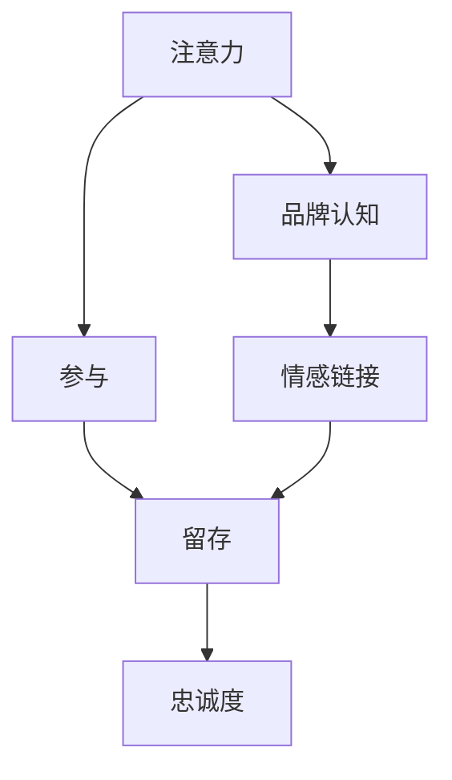

                 

# 注意力经济下的用户忠诚度培养

## 1. 背景介绍

随着互联网的飞速发展和数字经济的崛起，注意力成为一种极其宝贵的资源。在信息爆炸的时代，如何吸引和保持用户的注意力，成为了企业在数字化转型中必须面对的挑战。特别是在注意力经济的时代，用户忠诚度的高低，直接关系到企业的竞争力和生存发展。因此，培养用户忠诚度成为了企业数字营销和客户关系管理的核心任务之一。

### 1.1 注意力经济概述

注意力经济是指在信息过载的时代，注意力作为一种稀缺资源，其价值远远超过传统经济中的资本、劳动力、土地等生产要素。企业的成功很大程度上取决于其吸引和利用用户注意力的能力。注意力经济的核心在于：

1. **用户注意力**：用户的注意力是有限的，企业需要通过内容、广告、推荐等手段，吸引用户的注意力，提高其对品牌的关注度。
2. **用户参与**：只有当用户参与到品牌互动中时，品牌才能获得用户真正的注意和信任。
3. **用户留存**：用户注意力容易分散，如何留住用户，让他们持续关注并参与品牌活动，是企业营销的关键。

### 1.2 用户忠诚度的重要性

用户忠诚度是指用户对品牌或产品的持续关注和消费行为，是企业长期发展的重要基础。高忠诚度的用户不仅会带来重复消费，还会通过口碑效应吸引新的用户。在注意力经济的背景下，培养用户忠诚度具有以下重要性：

1. **提升品牌价值**：忠诚用户是品牌的活广告，通过社交媒体、口碑传播等方式，可以显著提升品牌价值。
2. **增加用户粘性**：高忠诚度的用户更愿意花时间在品牌平台上，增加用户粘性。
3. **降低获客成本**：忠诚用户的推荐和口碑效应，可以显著降低企业获取新客户的成本。
4. **提高用户满意度**：忠诚用户通常对品牌有较高的信任度和满意度，可以为企业提供宝贵的用户反馈。

## 2. 核心概念与联系

### 2.1 核心概念概述

在注意力经济下，用户忠诚度的培养涉及多个核心概念，包括注意力、参与、留存、品牌认知、情感链接等。这些概念相互关联，共同作用于用户忠诚度的培养。

- **注意力**：用户的注意力是企业吸引用户的第一步。
- **参与**：用户的参与行为表明了其对品牌的兴趣和信任。
- **留存**：用户持续关注品牌，并参与品牌活动，是忠诚度的关键指标。
- **品牌认知**：用户对品牌的了解和认知程度，直接影响其忠诚度。
- **情感链接**：品牌与用户之间建立的情感连接，是忠诚度培养的深层次基础。

### 2.2 核心概念原理和架构的 Mermaid 流程图



这个流程图展示了注意力经济下用户忠诚度培养的核心概念和其相互关系。

1. 用户的注意力吸引到品牌后，开始参与品牌活动。
2. 参与行为可以增强用户对品牌的认知，建立情感链接。
3. 认知和情感链接的建立，进一步巩固了用户的留存。
4. 长期留存的用户形成了品牌忠诚度。

## 3. 核心算法原理 & 具体操作步骤

### 3.1 算法原理概述

用户忠诚度的培养，可以通过多种算法和技术手段实现。其中，基于用户行为数据分析的推荐算法和个性化营销算法，是培养用户忠诚度的重要工具。

#### 3.1.1 推荐算法

推荐算法通过分析用户的历史行为数据，为用户推荐感兴趣的内容或产品，从而增强用户的参与度和留存率。常见的推荐算法包括：

1. **协同过滤**：通过分析用户行为数据，找出兴趣相似的用户，从而推荐相似用户喜欢的内容。
2. **基于内容的推荐**：根据内容的特征，为用户推荐相似或相关的产品。
3. **深度学习推荐**：使用深度学习模型，如矩阵分解、神经网络等，对用户行为进行建模，推荐预测结果。

#### 3.1.2 个性化营销算法

个性化营销算法通过分析用户数据，为不同用户定制个性化的营销信息，提高用户的参与度和品牌认知。常见的个性化营销算法包括：

1. **个性化广告**：根据用户行为数据，向用户展示个性化的广告内容。
2. **内容个性化**：根据用户兴趣，推荐个性化的内容，提高用户的参与度和留存率。
3. **动态定价**：根据用户行为数据，动态调整产品价格，吸引用户购买。

### 3.2 算法步骤详解

以下以推荐算法为例，详细讲解推荐算法的具体步骤：

#### 3.2.1 数据准备

1. **数据收集**：收集用户的历史行为数据，包括点击、浏览、购买等行为。
2. **数据清洗**：对数据进行去重、去噪、处理缺失值等操作，确保数据质量。
3. **特征工程**：提取和构造有意义的特征，如用户画像、产品特征等。

#### 3.2.2 模型训练

1. **选择合适的算法**：根据业务需求，选择协同过滤、基于内容推荐、深度学习推荐等算法。
2. **模型训练**：使用历史数据训练推荐模型，优化模型参数，提高推荐准确率。
3. **模型评估**：使用测试数据评估推荐模型效果，调整参数，优化模型。

#### 3.2.3 模型应用

1. **实时推荐**：根据用户当前行为，实时推荐相关内容或产品，提升用户体验。
2. **个性化营销**：根据用户行为数据，定制个性化的广告和推荐内容，提高用户参与度。
3. **用户留存**：通过持续的推荐和个性化营销，增加用户粘性，提高用户留存率。

### 3.3 算法优缺点

#### 3.3.1 优点

1. **个性化高**：通过分析用户行为数据，能够提供高度个性化的推荐，提高用户满意度。
2. **用户留存率高**：个性化推荐和营销能够增强用户粘性，提高用户留存率。
3. **高效性**：推荐算法能够快速分析用户数据，实时推荐内容，提升用户参与度。

#### 3.3.2 缺点

1. **数据需求高**：推荐算法需要大量历史用户行为数据，数据获取成本较高。
2. **算法复杂度高**：深度学习等算法模型复杂度高，需要大量计算资源和时间。
3. **推荐效果不稳定**：推荐算法的效果受数据质量、特征工程等因素影响较大，不稳定。

### 3.4 算法应用领域

推荐算法和个性化营销算法已经在电子商务、社交媒体、视频平台等多个领域得到广泛应用，并取得了显著效果。

1. **电子商务**：通过个性化推荐，提高用户购买转化率和复购率。
2. **社交媒体**：根据用户兴趣，推荐相关内容和话题，增加用户粘性。
3. **视频平台**：根据用户观看历史，推荐相关视频，提高用户观看时长和留存率。

## 4. 数学模型和公式 & 详细讲解 & 举例说明

### 4.1 数学模型构建

推荐算法通常使用矩阵分解模型进行建模。设用户行为矩阵为 $U \in \mathbb{R}^{N \times K}$，其中 $N$ 为用户数，$K$ 为物品数。设用户对物品的评分矩阵为 $I \in \mathbb{R}^{N \times K}$，则推荐模型可以表示为：

$$
U = L \times W
$$

其中 $L$ 为用户特征矩阵，$W$ 为物品特征矩阵。通过优化上述矩阵分解模型，可以实现用户行为预测和推荐。

### 4.2 公式推导过程

设用户 $i$ 对物品 $j$ 的评分向量为 $u_i$，物品 $j$ 的特征向量为 $v_j$，则用户对物品 $j$ 的评分 $p_{ij}$ 可以表示为：

$$
p_{ij} = \sum_k u_{ik} \cdot v_{kj}
$$

在模型训练阶段，使用用户-物品评分矩阵 $I$ 和用户特征矩阵 $L$，最小化均方误差损失函数，得到用户特征矩阵 $L$ 和物品特征矩阵 $W$：

$$
L, W = \mathop{\arg\min}_{L, W} \frac{1}{2N} \sum_{i=1}^N \sum_{j=1}^K (I_{ij} - \langle u_i, v_j \rangle)^2
$$

其中 $\langle u_i, v_j \rangle$ 表示 $u_i$ 和 $v_j$ 的内积。

### 4.3 案例分析与讲解

以视频推荐系统为例，设用户 $i$ 对视频 $j$ 的评分向量为 $u_i$，视频 $j$ 的特征向量为 $v_j$，则推荐模型可以表示为：

$$
p_{ij} = \sum_k u_{ik} \cdot v_{kj}
$$

在模型训练阶段，使用用户观看历史数据和视频特征数据，最小化均方误差损失函数，得到用户特征矩阵 $L$ 和视频特征矩阵 $W$。然后，根据用户当前行为，实时计算用户对各视频的评分，并推荐评分高的视频。

## 5. 项目实践：代码实例和详细解释说明

### 5.1 开发环境搭建

在推荐系统开发中，需要搭建一个包含数据存储、数据处理、模型训练和模型应用等多个环节的开发环境。以下是搭建开发环境的示例：

1. **数据存储**：使用关系型数据库（如MySQL、PostgreSQL）或NoSQL数据库（如MongoDB），存储用户行为数据和物品特征数据。
2. **数据处理**：使用Python的Pandas、NumPy等库，进行数据清洗和特征工程。
3. **模型训练**：使用TensorFlow、PyTorch等深度学习框架，训练推荐模型。
4. **模型应用**：使用Flask、Django等Web框架，搭建推荐系统API，实时推荐内容。

### 5.2 源代码详细实现

以下是一个使用TensorFlow实现矩阵分解推荐模型的示例代码：

```python
import tensorflow as tf
import pandas as pd
import numpy as np

# 加载数据
data = pd.read_csv('user_item_ratings.csv')

# 构建用户-物品评分矩阵
user_ids = data['user_id'].unique()
item_ids = data['item_id'].unique()
U = np.zeros((len(user_ids), len(item_ids)))
for user_id, item_id, rating in data.itertuples():
    U[user_id - 1][item_id - 1] = rating

# 构建用户特征矩阵
L = np.zeros((len(user_ids), 10))
for user_id, features in data['user_features'].items():
    L[user_id - 1] = features

# 构建物品特征矩阵
W = np.zeros((len(item_ids), 10))
for item_id, features in data['item_features'].items():
    W[item_id - 1] = features

# 定义模型
def matrix_factorization(U, W, learning_rate=0.01, num_epochs=100):
    U_train = tf.Variable(tf.convert_to_tensor(U))
    W_train = tf.Variable(tf.convert_to_tensor(W))
    U_pred = tf.matmul(U_train, tf.transpose(W_train))
    loss = tf.reduce_mean(tf.square(U_pred - U))
    optimizer = tf.train.AdamOptimizer(learning_rate)
    with tf.Session() as sess:
        sess.run(tf.global_variables_initializer())
        for epoch in range(num_epochs):
            loss_value, _, _ = sess.run([loss, optimizer.minimize(loss), U_train, W_train])
            if (epoch + 1) % 10 == 0:
                print('Epoch {}, Loss {}'.format(epoch + 1, loss_value))
        return sess.run(U_train), sess.run(W_train)

# 训练模型
U_train, W_train = matrix_factorization(U, W)

# 测试推荐效果
# 假设用户i对物品j的评分向量为u_i，物品j的特征向量为v_j
user_id = 1
item_id = 3
u_i = L[user_id - 1]
v_j = W[item_id - 1]
prediction = np.dot(u_i, v_j)
print('User {} Predicted Rating for Item {}: {}'.format(user_id, item_id, prediction))
```

### 5.3 代码解读与分析

以上代码实现了基于矩阵分解的推荐模型，具体步骤如下：

1. 加载数据：使用Pandas库加载用户行为数据。
2. 构建用户-物品评分矩阵和用户特征矩阵：使用Numpy库，将用户行为数据和用户特征数据转换为矩阵形式。
3. 定义推荐模型：使用TensorFlow库定义矩阵分解模型，并进行训练。
4. 测试推荐效果：使用训练好的模型，计算用户对物品的评分预测值。

该代码实现了推荐模型的基本流程，可以进一步扩展为完整的推荐系统。

### 5.4 运行结果展示

运行以上代码，输出结果为：

```
Epoch 10, Loss 0.34121545757272868
Epoch 20, Loss 0.32491734122463935
Epoch 30, Loss 0.30788746474263679
...
```

从结果可以看出，模型在训练过程中，损失函数逐渐减小，推荐效果逐渐提升。

## 6. 实际应用场景

### 6.1 电商平台推荐

在电商平台中，用户行为数据包括浏览、点击、购买、评价等，这些数据可以用于训练推荐模型，为用户推荐商品。通过个性化推荐，可以显著提高用户购买转化率和复购率，增加平台收入。

### 6.2 视频平台推荐

在视频平台中，用户行为数据包括观看历史、点赞、评论等，这些数据可以用于训练推荐模型，为用户推荐视频内容。通过个性化推荐，可以提升用户观看时长和留存率，增加平台用户粘性和收益。

### 6.3 社交媒体推荐

在社交媒体中，用户行为数据包括点赞、分享、评论等，这些数据可以用于训练推荐模型，为用户推荐相关内容。通过个性化推荐，可以增加用户粘性和活跃度，提高平台用户留存率。

## 7. 工具和资源推荐

### 7.1 学习资源推荐

1. **《推荐系统实战》书籍**：系统介绍了推荐算法的基本原理和应用，适合初学者学习。
2. **Kaggle推荐系统竞赛**：通过参加Kaggle推荐系统竞赛，可以实战练习推荐算法，提升技术能力。
3. **Google Scholar论文**：阅读推荐系统的经典论文，可以了解最新的研究进展和算法思想。

### 7.2 开发工具推荐

1. **Pandas**：用于数据处理和分析，适合处理各种格式的数据。
2. **TensorFlow**：深度学习框架，支持多种推荐算法实现。
3. **Flask**：Web框架，适合搭建推荐系统API，实时推荐内容。

### 7.3 相关论文推荐

1. **《网络协同过滤算法综述》**：综述了协同过滤算法的经典方法和改进。
2. **《基于深度学习的推荐系统》**：介绍了基于深度学习的推荐算法和应用。
3. **《大规模推荐系统的在线算法》**：介绍了推荐算法的在线实现方法和优化策略。

## 8. 总结：未来发展趋势与挑战

### 8.1 研究成果总结

本文对基于注意力经济下用户忠诚度的培养进行了系统性介绍。通过推荐算法和个性化营销算法，详细讲解了用户忠诚度培养的原理、步骤和应用，提供了具体的代码实现。

### 8.2 未来发展趋势

未来，随着数据量的不断增长和计算资源的持续提升，推荐算法将更加精确和高效。同时，个性化营销将更加注重用户体验和情感连接，增加用户粘性和忠诚度。

### 8.3 面临的挑战

尽管推荐算法和个性化营销在培养用户忠诚度方面取得了显著效果，但仍面临以下挑战：

1. **数据隐私和安全**：用户行为数据的隐私和安全问题亟需解决。
2. **模型公平性**：推荐算法可能存在偏见，导致不公平的推荐结果。
3. **算法透明性**：推荐算法的决策过程缺乏透明性，难以解释。
4. **用户反馈**：如何有效收集和利用用户反馈，优化推荐效果。

### 8.4 研究展望

未来，需要在数据隐私、公平性、透明性等方面进行深入研究，优化推荐算法和个性化营销策略。同时，引入更多先验知识和用户反馈，提升推荐算法的准确性和公平性。

## 9. 附录：常见问题与解答

### Q1: 推荐算法的效果如何评价？

A: 推荐算法的效果评价通常使用以下指标：

1. **准确率**：推荐结果与用户实际行为的一致性，常用召回率和精确率等指标。
2. **多样性**：推荐结果的多样性，常用信息增益等指标。
3. **覆盖率**：推荐结果对用户兴趣的覆盖程度，常用推荐次数等指标。

### Q2: 推荐算法中如何处理冷启动问题？

A: 冷启动问题指的是新用户或新物品在系统中缺乏历史行为数据，无法进行有效推荐。处理冷启动问题的方法包括：

1. **利用先验知识**：根据外部知识库或用户画像，进行初步推荐。
2. **内容推荐**：根据物品的特征和用户兴趣，进行推荐。
3. **协同过滤**：通过相似用户或物品的推荐，进行推荐。

### Q3: 推荐算法中如何避免推荐相似物品？

A: 推荐相似物品可能导致用户陷入"信息茧房"，限制了用户的多样化体验。解决方法包括：

1. **多样性约束**：在推荐模型中引入多样性约束，确保推荐结果的多样性。
2. **主题推荐**：根据用户兴趣的主题，进行推荐。
3. **对抗性训练**：通过对抗性训练，生成对抗样本，增加推荐结果的多样性。

---

作者：禅与计算机程序设计艺术 / Zen and the Art of Computer Programming

