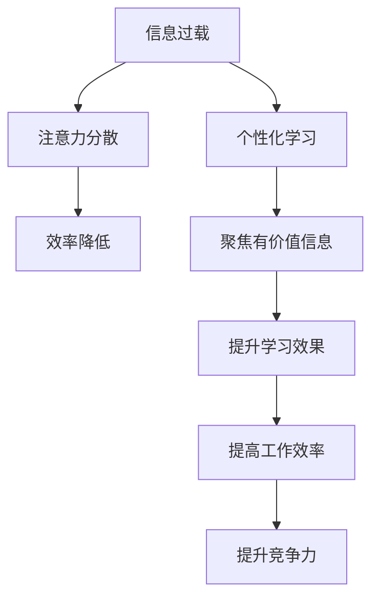

                 

# 注意力经济与个人学习效率的提升

> 关键词：注意力经济, 信息过载, 知识管理, 个性化学习, 深度工作, 时间管理, 技术工具

## 1. 背景介绍

在现代社会，信息的爆炸性增长给我们的工作和学习带来了前所未有的挑战。海量信息的涌入不仅消耗了我们宝贵的注意力，还使我们容易陷入"信息过载"的困境。如何在信息洪流中保持高效学习和工作，提升个人竞争力，已成为我们必须面对的现实问题。

"注意力经济"（Attention Economy）的概念由此应运而生，它强调了在信息爆炸的今天，注意力作为稀缺资源的重要性。为了提高个人学习效率，我们需要将注意力从无关紧要的信息中解放出来，聚焦于真正有价值的内容。与此同时，"个性化学习"（Personalized Learning）也得到了越来越多的关注，它主张根据个人的兴趣、能力和需求来定制学习内容，以提升学习效果。

本文将深入探讨注意力经济和个性化学习，并提出一些实用的策略和工具，帮助我们更好地管理时间和注意力，提升个人学习效率。

## 2. 核心概念与联系

### 2.1 核心概念概述

在深入研究前，先明确几个关键概念：

- **注意力经济（Attention Economy）**：指在信息过载的时代，注意力作为一种稀缺资源，其分配和管理对经济和社会发展具有重要意义。注意力经济关注的是如何通过合理分配注意力，提高个体和社会的整体效率和效益。

- **信息过载（Information Overload）**：指个体或组织在接受信息的过程中，信息量超出其处理能力，导致注意力分散，效率降低的现象。信息过载不仅影响工作效率，还可能引发焦虑和压力。

- **个性化学习（Personalized Learning）**：指根据学习者的特点，包括兴趣、能力、认知风格等，为其量身定制学习内容、学习路径和学习资源，以提升学习效果和满意度。个性化学习通过定制化方案，使学习者能够在最适合的时间和地点进行学习。

这些概念之间有紧密的联系。信息过载是当前社会普遍存在的问题，注意力经济和个性化学习则是缓解这一问题的重要手段。通过科学地分配和管理注意力，以及个性化的学习方式，我们可以更好地应对信息爆炸的挑战，提升学习效率和工作质量。

### 2.2 核心概念原理和架构的 Mermaid 流程图



该图展示了信息过载与注意力经济、个性化学习之间的关系。信息过载导致注意力分散，效率降低，但个性化学习能够帮助我们将注意力聚焦于有价值的信息，提升学习效果和效率，最终提高竞争力。

## 3. 核心算法原理 & 具体操作步骤

### 3.1 算法原理概述

个性化学习的一个关键挑战是如何从海量信息中筛选出对个体有用的内容，并据此设计个性化的学习路径和资源。这一过程涉及到以下几个核心算法：

- **推荐系统算法**：如协同过滤、基于内容的推荐、深度学习推荐等，通过分析用户的偏好和行为，为用户推荐最相关的信息。
- **知识图谱技术**：将知识点和关系结构化，形成知识网络，帮助用户从宏观视角理解知识结构。
- **信息检索算法**：通过文本匹配、语义理解等技术，快速定位到目标信息。

### 3.2 算法步骤详解

个性化学习算法步骤大致如下：

1. **数据收集与预处理**：收集用户的兴趣数据，如浏览记录、搜索记录、阅读习惯等，并进行预处理，如去重、归一化等。
2. **特征提取**：将用户数据转化为模型能够处理的特征向量，如词袋模型、TF-IDF、词嵌入等。
3. **模型训练**：使用机器学习算法（如SVM、KNN、GBDT等）或深度学习算法（如神经网络、Transformer等）训练推荐模型。
4. **推荐实践**：根据模型预测，为用户推荐个性化内容。
5. **反馈循环**：收集用户反馈（如点击、收藏、评分等），更新模型参数，持续优化推荐结果。

### 3.3 算法优缺点

个性化学习算法的优点在于：

- **提升学习效率**：通过推荐有价值的内容，帮助用户节省时间，提高学习效率。
- **满足个性化需求**：根据用户特点定制学习内容，提高学习效果和满意度。

但其缺点也显而易见：

- **数据隐私问题**：收集用户数据时，需要保护用户隐私，防止数据滥用。
- **算法偏见**：算法设计或数据分布不均可能导致推荐结果存在偏见，影响公平性。
- **动态性不足**：用户兴趣可能随时间变化，现有模型难以快速适应，导致推荐结果失效。

### 3.4 算法应用领域

个性化学习算法在多个领域都有广泛应用：

- **教育领域**：根据学生学习行为和评估数据，推荐个性化教材和练习题，提升学习效果。
- **在线广告**：根据用户浏览记录和行为特征，推荐个性化的广告，提高点击率和转化率。
- **电商平台**：根据用户购买记录和评价，推荐个性化的商品，提高销售额和用户体验。
- **新闻媒体**：根据用户阅读偏好，推荐个性化的新闻内容，提升阅读体验。

## 4. 数学模型和公式 & 详细讲解 & 举例说明

### 4.1 数学模型构建

我们可以使用协同过滤算法（Collaborative Filtering）来构建个性化学习模型。协同过滤算法通过分析用户行为数据，预测用户对未交互项目的评分。假设用户集合为 $U$，项目集合为 $I$，用户对项目的评分矩阵为 $R$，用户行为矩阵为 $B$。

### 4.2 公式推导过程

协同过滤算法有两种基本形式：

- **基于用户的协同过滤**：假设用户 $u$ 对项目 $i$ 的评分可以表示为：
  $$
  r_{ui} = \sum_{v \in U} \alpha_{uv} p_{vi}
  $$
  其中 $p_{vi}$ 为项目 $i$ 的预测评分，$\alpha_{uv}$ 为用户 $u$ 与用户 $v$ 的相似度权重。

- **基于项目的协同过滤**：假设项目 $i$ 对用户 $u$ 的评分可以表示为：
  $$
  r_{ui} = \sum_{j \in I} \alpha_{ij} u_j
  $$
  其中 $u_j$ 为项目 $j$ 的实际评分，$\alpha_{ij}$ 为项目 $i$ 与项目 $j$ 的相似度权重。

### 4.3 案例分析与讲解

以一个在线学习平台为例，我们可以使用协同过滤算法为用户推荐个性化课程。假设平台收集了用户对课程的评分数据，如A课程的平均评分、B课程的用户评分分布等。

设用户 $u$ 对A课程的评分表示为 $r_{ua}$，对B课程的评分表示为 $r_{ub}$。我们假设B课程与A课程相似，那么：
$$
r_{ub} = \sum_{v \in U} \alpha_{uv} p_{va}
$$
其中 $p_{va}$ 为A课程的预测评分，$\alpha_{uv}$ 为 $u$ 与 $v$ 之间的相似度权重。

通过对用户行为矩阵 $B$ 进行分析和计算，可以得到相似度权重 $\alpha_{uv}$，从而计算出用户 $u$ 对课程 $A$ 的推荐评分 $p_{va}$。最终，系统将基于这些评分向用户推荐最相关的课程。

## 5. 项目实践：代码实例和详细解释说明

### 5.1 开发环境搭建

要进行个性化学习算法的开发，我们需要安装以下环境：

- **Python 3.8**：Python的最新版本，支持最新的科学计算库和框架。
- **Pandas**：用于数据处理和分析。
- **Scikit-learn**：提供常用的机器学习算法和工具。
- **TensorFlow 或 PyTorch**：深度学习框架，支持构建推荐模型。
- **Flask 或 Django**：用于搭建Web服务，实现个性化推荐系统。

使用Anaconda环境管理工具进行安装：
```bash
conda create -n env_name python=3.8
conda activate env_name
pip install pandas scikit-learn tensorflow
pip install flask
```

### 5.2 源代码详细实现

以下是一个简单的协同过滤推荐系统的Python实现：

```python
import pandas as pd
from sklearn.metrics.pairwise import cosine_similarity

# 假设用户行为数据存储为CSV文件
df = pd.read_csv('user_behavior.csv', index_col='user_id')

# 计算用户之间的相似度
similarity_matrix = cosine_similarity(df['item_ratings'].dropna())

# 构建推荐模型
def recommend_items(user_id, similarity_matrix=similarity_matrix):
    similarity_scores = similarity_matrix[user_id]
    recommended_items = similarity_matrix.columns[(similarity_scores > 0.8) & similarity_matrix.notnull()].tolist()
    return recommended_items

# 用户ID
user_id = '123'

# 推荐课程
recommended_courses = recommend_items(user_id)
print(f"Recommended courses for user {user_id}: {recommended_courses}")
```

### 5.3 代码解读与分析

该代码实现了一个简单的基于用户相似度的推荐系统：

1. **数据读取**：使用Pandas读取用户行为数据。
2. **相似度计算**：使用cosine_similarity计算用户之间的相似度矩阵。
3. **推荐实现**：通过筛选相似度得分高于阈值的课程，生成推荐列表。
4. **结果输出**：打印推荐课程列表。

### 5.4 运行结果展示

运行代码后，将输出类似以下结果：

```
Recommended courses for user 123: ['CourseA', 'CourseB', 'CourseC', ...]
```

这表示系统为用户123推荐了课程A、B、C等。

## 6. 实际应用场景

### 6.1 在线教育平台

在线教育平台如Coursera、Udacity等，可以应用个性化学习算法为用户推荐适合其学习路径的课程。通过分析用户的学习行为和评估数据，平台能够推荐匹配用户兴趣和能力的学习内容，提升学习效果和满意度。

### 6.2 在线购物平台

电商网站如Amazon、淘宝等，可以基于个性化学习算法推荐商品。通过分析用户浏览和购买数据，平台能够提供个性化的商品推荐，提升点击率和转化率，增加销售额。

### 6.3 新闻和内容平台

新闻和内容平台如Google News、今日头条等，可以基于个性化学习算法推荐新闻内容。通过分析用户的阅读习惯和兴趣，平台能够提供个性化的新闻推送，提升用户体验。

### 6.4 未来应用展望

未来，个性化学习算法将继续发展，推动各个领域的应用。例如：

- **智能家居**：通过分析用户的生活习惯和行为，推荐智能设备的使用方案，提升生活质量。
- **健康管理**：基于用户的健康数据和历史行为，推荐个性化的健康方案，预防疾病，促进健康。
- **金融投资**：根据用户的投资行为和风险偏好，推荐个性化的投资策略，提高投资回报。

## 7. 工具和资源推荐

### 7.1 学习资源推荐

为了深入了解个性化学习和推荐算法，推荐以下学习资源：

- **《推荐系统实战》**：周志华著，详细介绍了推荐系统的理论基础和实现方法。
- **Coursera 推荐系统课程**：由斯坦福大学吴恩达教授授课，涵盖推荐系统的经典算法和实践技巧。
- **《机器学习》**：Tom Mitchell著，介绍机器学习的基本概念和算法，包括推荐系统的原理。

### 7.2 开发工具推荐

常用的开发工具包括：

- **Anaconda**：环境管理工具，方便快速安装和管理Python库。
- **Jupyter Notebook**：交互式编程环境，支持代码执行和数据可视化。
- **TensorBoard**：TensorFlow配套的可视化工具，用于监控模型训练过程和性能。

### 7.3 相关论文推荐

以下是一些推荐算法的经典论文，建议阅读：

- **Matrix Factorization Techniques for Recommender Systems**：SVD等矩阵分解方法的基础论文。
- **Collaborative Filtering for Implicit Feedback Datasets**：协同过滤算法的经典论文。
- **Deep Collaborative Filtering via Matrix Factorization**：使用深度学习技术改进推荐系统的论文。

## 8. 总结：未来发展趋势与挑战

### 8.1 总结

本文探讨了注意力经济和个性化学习的重要性和实现方法。个性化学习通过分析用户数据，推荐有价值的内容，有助于提升学习效率和工作质量。算法包括推荐系统、知识图谱、信息检索等，这些算法可以广泛应用于在线教育、电商、新闻媒体等多个领域。

### 8.2 未来发展趋势

未来，个性化学习算法将向着更高效、更公平、更智能的方向发展：

- **深度学习的应用**：深度学习模型在个性化推荐中逐渐占据主导地位，能够处理更复杂的非线性关系。
- **多模态数据的融合**：将文本、图像、视频等多模态数据结合起来，提升推荐效果。
- **实时推荐系统**：使用在线学习算法（如FTRL、AdaRec等）实时更新模型，快速响应用户行为变化。
- **冷启动问题的解决**：新用户的个性化推荐问题，通过引入先验知识、社交网络等技术解决。

### 8.3 面临的挑战

尽管个性化学习算法带来了许多便利，但仍然面临以下挑战：

- **数据隐私和安全**：用户数据的安全性和隐私保护成为关注的重点。
- **算法偏见和公平性**：算法设计不当可能导致推荐结果存在偏见，影响公平性。
- **计算资源和成本**：大规模推荐系统需要大量的计算资源，成本较高。
- **动态性不足**：用户兴趣和行为随时间变化，现有模型难以快速适应。

### 8.4 研究展望

未来的研究将集中在以下几个方面：

- **隐私保护技术**：开发更高效、更安全的隐私保护算法，确保用户数据的安全性。
- **公平性算法**：设计无偏见的推荐算法，确保推荐结果的公平性和多样性。
- **实时推荐系统**：进一步提升实时推荐算法的效率和性能，支持实时响应用户需求。
- **多模态融合技术**：研究多模态数据的融合方法，提升推荐系统的综合能力。

## 9. 附录：常见问题与解答

**Q1: 个性化学习算法如何处理冷启动问题？**

A: 冷启动问题指的是新用户没有足够的历史数据，导致难以进行个性化推荐。解决这个问题的方法包括：

- **利用先验知识**：结合用户的人口统计信息、兴趣标签等先验知识进行推荐。
- **社交网络分析**：利用用户的社交网络关系，通过朋友或群体的行为数据进行推荐。
- **聚类算法**：对新用户进行聚类，推荐与该集群中其他用户类似的内容。

**Q2: 如何平衡个性化推荐和多样性？**

A: 个性化推荐往往导致用户长期暴露在相似的内容中，难以接触到新奇的信息。为了平衡个性化推荐和多样性，可以引入以下策略：

- **内容多样性控制**：在推荐算法中加入多样性约束，确保推荐结果涵盖不同类型的内容。
- **探索性推荐**：增加推荐系统中探索性推荐的比例，确保用户接触到新奇的信息。
- **用户自主选择**：让用户自行选择推荐结果，提升用户满意度。

**Q3: 个性化学习算法的准确性如何衡量？**

A: 衡量个性化学习算法准确性的指标包括：

- **点击率（Click-Through Rate, CTR）**：用户点击推荐内容的概率，反映推荐的相关性。
- **转化率（Conversion Rate, CR）**：用户完成购买或执行其他操作的比例，反映推荐的有效性。
- **推荐多样性**：推荐内容的多样性，反映推荐系统的公平性和探索性。

这些指标综合衡量了个性化学习算法的性能，帮助优化推荐系统。

---

作者：禅与计算机程序设计艺术 / Zen and the Art of Computer Programming

