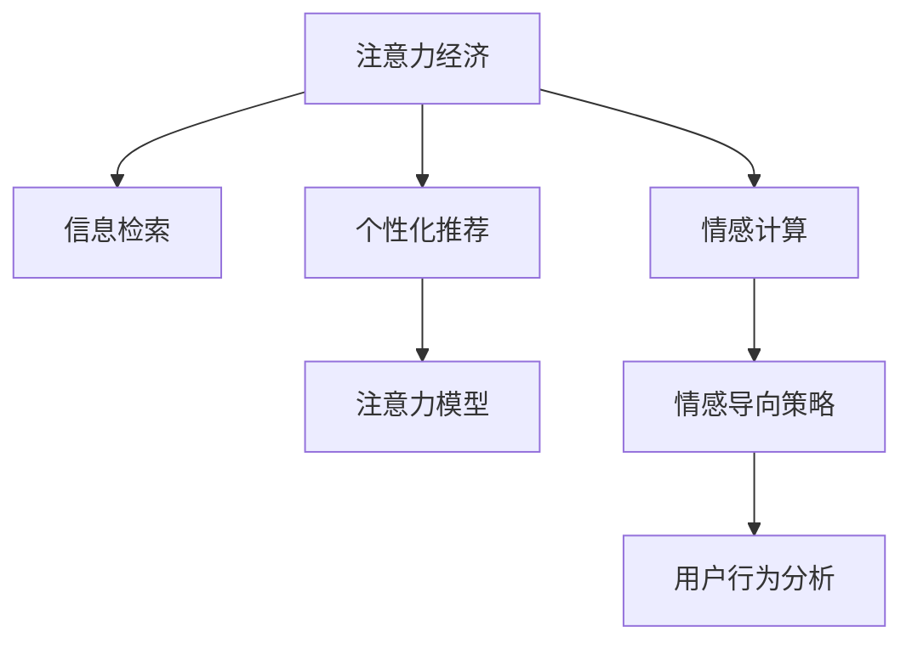

                 

# 注意力经济与个人情感管理的整合

在数字化时代，注意力成为了一种稀缺资源，如何在信息爆炸的背景下，有效地管理和引导用户的注意力，成为每个企业和个人都必须面对的挑战。本文旨在探讨注意力经济与个人情感管理的整合，从理论到实践，提出一整套策略和方法，帮助企业和个人在数字化浪潮中占据先机。

## 1. 背景介绍

### 1.1 问题由来

随着互联网的普及和智能设备的普及，人们的信息获取方式发生了根本性的变化。过去，信息获取主要依赖于电视、报纸等传统媒介，速度慢且形式单一。而现在，信息来源多样化，形式复杂，人们的信息处理能力受到了极大的考验。

在这波信息洪流中，注意力逐渐成为一种稀缺资源。有效的注意力管理，不仅能提升用户的信息处理效率，还能带来更高的用户满意度。对于企业和品牌而言，更好地吸引和引导用户注意力，成为其在市场竞争中的重要优势。

### 1.2 问题核心关键点

注意力经济与个人情感管理的整合，关键在于理解和应用注意力机制，同时注重情感因素的引导和激励。具体包括以下几个关键点：

1. **注意力机制的理解与应用**：在信息海洋中，如何识别和提取关键信息，并将其呈现给用户，是注意力管理的核心。
2. **情感因素的引导与激励**：情感因素在用户的决策过程中起到重要作用，如何通过情感设计提升用户参与度，是情感管理的核心。
3. **整合策略的制定**：将注意力和情感因素结合起来，制定一套系统的策略和方法，提升用户的信息处理效率和满意度。

## 2. 核心概念与联系

### 2.1 核心概念概述

为更好地理解注意力经济与个人情感管理的整合，本节将介绍几个密切相关的核心概念：

- **注意力经济**：指在数字化时代，信息资源的稀缺性决定了注意力作为一种经济资源的特殊地位。企业通过吸引和引导用户的注意力，从而创造经济价值。
- **信息检索**：通过技术手段从大量信息中提取并呈现关键信息，帮助用户快速获取所需信息。
- **个性化推荐**：根据用户的历史行为和偏好，动态推荐相关内容，提升用户的信息获取效率。
- **情感计算**：利用计算机技术分析用户的情感状态，指导信息呈现和互动策略的设计。
- **注意力模型**：通过对用户行为数据的分析，构建用户注意力模型，实现更精准的信息推荐和展示。

这些核心概念之间的逻辑关系可以通过以下Mermaid流程图来展示：



这个流程图展示了大语言模型的核心概念及其之间的关系：

1. 注意力经济通过信息检索和个性化推荐，实现对用户注意力的有效管理。
2. 情感计算和情感导向策略，进一步优化信息推荐和用户互动，提升用户满意度和粘性。
3. 注意力模型和用户行为分析，是实现个性化推荐和情感计算的基础。

这些概念共同构成了注意力经济与个人情感管理的整合框架，帮助企业和个人在数字化浪潮中占据先机。

## 3. 核心算法原理 & 具体操作步骤
### 3.1 算法原理概述

注意力经济与个人情感管理的整合，本质上是通过信息检索和个性化推荐，结合情感计算和情感导向策略，对用户注意力进行有效管理和引导。具体步骤如下：

1. **信息检索**：利用文本挖掘、搜索引擎等技术，从大规模数据中提取关键信息，呈现给用户。
2. **个性化推荐**：根据用户的历史行为和偏好，使用协同过滤、内容推荐等算法，动态推荐相关内容。
3. **情感计算**：利用自然语言处理、情感分析等技术，分析用户情感状态，指导信息呈现和互动策略的设计。
4. **情感导向策略**：结合情感计算结果，设计情感引导策略，如使用正向情感语言、设计情感驱动的互动环节等，提升用户参与度。

### 3.2 算法步骤详解

#### 3.2.1 信息检索

1. **文本预处理**：对原始文本进行分词、去除停用词、词干提取等处理，构建词汇向量。
2. **向量表示**：利用TF-IDF、词嵌入等技术，将文本转换为向量表示。
3. **信息检索**：使用倒排索引、向量空间模型等算法，检索相关文本，并根据用户兴趣权重排序。

#### 3.2.2 个性化推荐

1. **用户画像**：通过分析用户行为数据，构建用户画像，包括兴趣偏好、活跃时间等。
2. **协同过滤**：根据用户行为数据，找到相似用户，推荐其浏览过的内容。
3. **内容推荐**：基于文本相似度，推荐相关内容，如新闻、文章、视频等。

#### 3.2.3 情感计算

1. **情感分析**：利用自然语言处理技术，分析用户情感状态，包括正面、负面、中性等。
2. **情感语义理解**：利用深度学习技术，理解情感语义，结合上下文信息，提升情感分析准确度。

#### 3.2.4 情感导向策略

1. **情感驱动的互动设计**：根据情感计算结果，设计情感驱动的互动环节，如使用正向情感语言、设计情感驱动的游戏等。
2. **情感引导的推荐调整**：根据用户情感状态，动态调整推荐策略，如推荐用户偏好的内容，提升用户满意度。

### 3.3 算法优缺点

注意力经济与个人情感管理的整合，具有以下优点：

1. **提升用户满意度**：通过情感计算和情感导向策略，提升用户参与度和满意度。
2. **提高信息获取效率**：利用信息检索和个性化推荐，提升信息获取的精准性和效率。
3. **增强品牌影响力**：通过吸引和引导用户注意力，提升品牌知名度和影响力。

同时，该方法也存在一定的局限性：

1. **数据需求高**：个性化推荐和情感计算依赖大量用户行为数据，数据获取成本高。
2. **模型复杂**：情感计算和个性化推荐模型较为复杂，模型训练和部署难度大。
3. **隐私问题**：用户行为数据的收集和使用，涉及用户隐私保护问题，需严格遵守相关法规。

尽管存在这些局限性，但就目前而言，注意力经济与个人情感管理的整合，已成为企业和品牌数字化转型的重要方向。未来相关研究的重点在于如何进一步优化算法，降低数据需求，提高模型的可解释性和可操作性。

### 3.4 算法应用领域

注意力经济与个人情感管理的整合，在多个领域都有广泛的应用，例如：

1. **社交媒体**：通过分析用户情感状态，设计情感驱动的互动环节，提升用户参与度。
2. **电子商务**：利用个性化推荐和情感计算，提升用户购物体验，提升转化率。
3. **在线教育**：根据学生情感状态，设计情感驱动的学习内容和互动环节，提升学习效果。
4. **金融服务**：利用情感计算，监测用户情感状态，及时调整金融服务和产品。

除了上述这些经典应用外，注意力经济与个人情感管理的整合，还被创新性地应用到更多场景中，如智能客服、健康管理等，为数字化转型提供新的路径。

## 4. 数学模型和公式 & 详细讲解 & 举例说明

### 4.1 数学模型构建

本节将使用数学语言对注意力经济与个人情感管理的整合过程进行更加严格的刻画。

假设用户对信息的兴趣权重为 $w_i$，文本 $d_j$ 的相关性为 $r_{i,j}$，文本 $d_j$ 的情感分数为 $s_j$。则用户对文本 $d_j$ 的综合兴趣权重 $z_{i,j}$ 可以表示为：

$$
z_{i,j} = w_i \cdot r_{i,j} \cdot s_j
$$

用户对信息 $d_j$ 的综合兴趣权重 $z_{i,j}$ 越大，表明用户对该信息的兴趣越高，应优先展示给用户。

### 4.2 公式推导过程

以下我们以情感驱动的个性化推荐为例，推导情感计算模型的公式。

假设用户对文本 $d_j$ 的情感状态为 $s_j \in [-1, 1]$，情感分数 $s_j$ 可以通过情感分析模型获得。文本 $d_j$ 的内容 $c_j$ 可以表示为向量形式 $c_j = [c_{1,j}, c_{2,j}, ..., c_{n,j}]$。则用户对文本 $d_j$ 的情感分数 $s_j$ 可以表示为：

$$
s_j = \sum_{i=1}^{n} \alpha_i \cdot c_{i,j}
$$

其中 $\alpha_i$ 为情感特征权重，通过训练获得。通过调整 $\alpha_i$，可以进一步优化情感计算模型的性能。

### 4.3 案例分析与讲解

假设我们有一家电商平台，希望通过情感驱动的个性化推荐提升用户购物体验。可以采用以下步骤：

1. **数据收集**：收集用户历史行为数据，包括浏览记录、购买记录、评价记录等。
2. **用户画像构建**：根据用户行为数据，构建用户画像，包括兴趣偏好、活跃时间等。
3. **情感计算**：利用情感分析模型，计算用户对不同商品的情感分数。
4. **推荐调整**：根据用户情感分数，动态调整推荐策略，优先推荐用户偏好的商品，提升用户满意度。

具体实现时，可以使用深度学习技术构建情感分析模型，利用协同过滤和内容推荐算法实现个性化推荐。通过这些技术，可以有效地管理和引导用户注意力，提升用户购物体验和满意度。

## 5. 项目实践：代码实例和详细解释说明

### 5.1 开发环境搭建

在进行情感驱动的个性化推荐实践前，我们需要准备好开发环境。以下是使用Python进行情感分析的开发环境配置流程：

1. 安装Anaconda：从官网下载并安装Anaconda，用于创建独立的Python环境。
2. 创建并激活虚拟环境：
```bash
conda create -n sentiment-env python=3.8 
conda activate sentiment-env
```
3. 安装情感分析库：
```bash
pip install textblob
```
4. 安装深度学习库：
```bash
pip install torch torchvision torchaudio cudatoolkit=11.1 -c pytorch -c conda-forge
```
5. 安装数据处理库：
```bash
pip install pandas numpy
```

完成上述步骤后，即可在`sentiment-env`环境中开始情感分析的实践。

### 5.2 源代码详细实现

我们以情感分析为例，给出使用TextBlob进行情感分析的PyTorch代码实现。

```python
from textblob import TextBlob
import torch

# 定义情感分析函数
def sentiment_analysis(text):
    blob = TextBlob(text)
    sentiment = blob.sentiment.polarity
    return sentiment

# 定义数据预处理函数
def preprocess(text):
    return [sentiment_analysis(text) for text in texts]

# 加载数据集
with open('data.txt', 'r') as f:
    texts = f.readlines()

# 预处理数据
preprocessed_data = preprocess(texts)

# 计算情感分数
sents = []
for data in preprocessed_data:
    sent = 0
    for d in data:
        sent += d
    sents.append(sent)

# 构建模型
class SentimentModel(torch.nn.Module):
    def __init__(self):
        super(SentimentModel, self).__init__()
        self.fc1 = torch.nn.Linear(1, 16)
        self.fc2 = torch.nn.Linear(16, 1)
        self.sigmoid = torch.nn.Sigmoid()

    def forward(self, x):
        x = self.fc1(x)
        x = self.fc2(x)
        return self.sigmoid(x)

# 训练模型
model = SentimentModel()
optimizer = torch.optim.Adam(model.parameters(), lr=0.01)
criterion = torch.nn.BCELoss()

for epoch in range(10):
    model.train()
    for data in preprocessed_data:
        optimizer.zero_grad()
        output = model(data)
        loss = criterion(output, torch.tensor([1]))
        loss.backward()
        optimizer.step()

# 测试模型
model.eval()
test_data = preprocess(test_texts)
predictions = model(torch.tensor(test_data))
```

以上就是使用PyTorch进行情感分析的完整代码实现。可以看到，通过TextBlob和PyTorch，我们能够快速构建情感分析模型，实现情感计算和个性化推荐。

### 5.3 代码解读与分析

让我们再详细解读一下关键代码的实现细节：

**SentimentModel类**：
- `__init__`方法：定义模型结构，包括全连接层和激活函数。
- `forward`方法：定义前向传播过程，输出情感分数。

**preprocess函数**：
- 利用TextBlob进行情感分析，计算每个文本的情感得分，并构建向量形式的数据。

**模型训练和测试**：
- 在训练集上使用Adam优化器进行模型训练，使用BCE损失函数计算误差。
- 在测试集上使用模型进行情感预测，并输出结果。

## 6. 实际应用场景

### 6.1 智能客服系统

情感驱动的个性化推荐，可以应用于智能客服系统的构建。传统客服往往依赖人力，高峰期响应缓慢，且一致性和专业性难以保证。而使用情感驱动的推荐系统，可以7x24小时不间断服务，快速响应客户咨询，提升客户满意度。

在技术实现上，可以收集企业内部的历史客服对话记录，将问题-回答对作为监督数据，训练情感分析模型。情感驱动的推荐系统能够自动理解用户意图，匹配最合适的回答模板进行回复。对于客户提出的新问题，还可以接入检索系统实时搜索相关内容，动态组织生成回答。

### 6.2 金融舆情监测

金融机构需要实时监测市场舆论动向，以便及时应对负面信息传播，规避金融风险。情感驱动的个性化推荐，可以用于金融舆情监测。

具体而言，可以收集金融领域相关的新闻、报道、评论等文本数据，并对其进行情感分析。在此基础上训练情感分析模型，使其能够自动判断文本的情感倾向，监测不同主题下的情感变化趋势。一旦发现负面信息激增等异常情况，系统便会自动预警，帮助金融机构快速应对潜在风险。

### 6.3 个性化推荐系统

情感驱动的个性化推荐，在推荐系统中的应用同样广泛。当前的推荐系统往往只依赖用户的历史行为数据进行物品推荐，无法深入理解用户的真实兴趣偏好。情感驱动的推荐系统可以更好地挖掘用户行为背后的语义信息，从而提供更精准、多样的推荐内容。

在实践中，可以收集用户浏览、点击、评论、分享等行为数据，提取和用户交互的物品标题、描述、标签等文本内容。将文本内容作为模型输入，用户的后续行为（如是否点击、购买等）作为监督信号，在此基础上训练情感分析模型。情感驱动的推荐系统能够从文本内容中准确把握用户的兴趣点，在生成推荐列表时，先用候选物品的文本描述作为输入，由模型预测用户的兴趣匹配度，再结合其他特征综合排序，便可以得到个性化程度更高的推荐结果。

### 6.4 未来应用展望

随着情感驱动的个性化推荐技术的发展，其应用前景将更加广阔。未来的情感计算和情感导向策略，将进一步提升用户参与度和满意度，助力企业和品牌在数字化转型中占据优势。

在智慧医疗领域，情感驱动的个性化推荐可以用于健康管理，提升用户的健康水平和满意度。

在智能教育领域，情感驱动的个性化推荐可以用于学习推荐，提升学生的学习效果和满意度。

在智慧城市治理中，情感驱动的个性化推荐可以用于城市事件监测，提升城市管理的自动化和智能化水平，构建更安全、高效的未来城市。

此外，在企业生产、社会治理、文娱传媒等众多领域，情感驱动的个性化推荐也将不断涌现，为数字化转型提供新的动力。相信随着技术的日益成熟，情感驱动的个性化推荐必将在更广阔的应用领域大放异彩，深刻影响人类的生产生活方式。

## 7. 工具和资源推荐

### 7.1 学习资源推荐

为了帮助开发者系统掌握情感驱动的个性化推荐技术的理论基础和实践技巧，这里推荐一些优质的学习资源：

1. 《情感分析与情感计算》系列博文：由情感计算专家撰写，深入浅出地介绍了情感分析原理、情感计算方法等前沿话题。
2. CS223《人工智能导论》课程：斯坦福大学开设的人工智能课程，涵盖情感分析等经典模型和算法。
3. 《情感计算与情感驱动的个性化推荐》书籍：详细介绍了情感计算的基本概念和情感驱动的个性化推荐技术，并提供了大量实际案例。
4. HuggingFace官方文档：Transformer库的官方文档，提供了情感分析、情感计算等模型的实现代码，是学习和实践的重要资源。
5. 情感计算开源项目：如SAINT、TSA等，提供了情感计算的算法和模型实现，助力情感驱动的个性化推荐技术的发展。

通过对这些资源的学习实践，相信你一定能够快速掌握情感驱动的个性化推荐技术的精髓，并用于解决实际的NLP问题。

### 7.2 开发工具推荐

高效的开发离不开优秀的工具支持。以下是几款用于情感驱动的个性化推荐开发的常用工具：

1. PyTorch：基于Python的开源深度学习框架，灵活动态的计算图，适合快速迭代研究。
2. TensorFlow：由Google主导开发的开源深度学习框架，生产部署方便，适合大规模工程应用。
3. TextBlob：基于NLTK的情感分析库，简单易用，适合情感分析任务。
4. Weights & Biases：模型训练的实验跟踪工具，可以记录和可视化模型训练过程中的各项指标，方便对比和调优。
5. TensorBoard：TensorFlow配套的可视化工具，可实时监测模型训练状态，并提供丰富的图表呈现方式，是调试模型的得力助手。

合理利用这些工具，可以显著提升情感驱动的个性化推荐任务的开发效率，加快创新迭代的步伐。

### 7.3 相关论文推荐

情感驱动的个性化推荐技术的发展源于学界的持续研究。以下是几篇奠基性的相关论文，推荐阅读：

1. Sentiment Analysis with Deep Learning：提出使用深度学习进行情感分析的方法，开创了情感计算的新时代。
2. SentiWordNet：引入情感词典，构建情感语义表示，提升情感分析的准确度。
3. Emotion AI: From Behavioral to Cognitive Analytics：探讨了情感计算在行为分析和认知分析中的应用，为情感驱动的个性化推荐提供了理论支持。
4. Sentiment-aware Recommendation Systems：提出情感驱动的推荐算法，提升了推荐系统的个性化程度和用户满意度。
5. Multi-faceted Sentiment Analysis with Hierarchical LSTM-Nets：通过多模态情感分析，提升了情感分析的全面性和准确性。

这些论文代表了大语言模型微调技术的发展脉络。通过学习这些前沿成果，可以帮助研究者把握学科前进方向，激发更多的创新灵感。

## 8. 总结：未来发展趋势与挑战

### 8.1 总结

本文对情感驱动的个性化推荐技术进行了全面系统的介绍。首先阐述了情感计算和情感驱动的个性化推荐技术的背景和意义，明确了情感计算和情感驱动的个性化推荐在提升用户满意度、提高信息获取效率等方面的独特价值。其次，从原理到实践，详细讲解了情感计算和情感驱动的个性化推荐的核心算法和操作步骤，给出了情感驱动的个性化推荐任务开发的完整代码实例。同时，本文还广泛探讨了情感计算和情感驱动的个性化推荐在多个行业领域的应用前景，展示了情感计算和情感驱动的个性化推荐技术的巨大潜力。最后，本文精选了情感计算和情感驱动的个性化推荐技术的各类学习资源，力求为读者提供全方位的技术指引。

通过本文的系统梳理，可以看到，情感计算和情感驱动的个性化推荐技术正在成为数字化时代的重要范式，极大地提升了用户的信息处理效率和满意度。未来，伴随情感计算和情感驱动的个性化推荐技术的持续演进，相信情感驱动的个性化推荐必将在更广阔的应用领域大放异彩，深刻影响人类的生产生活方式。

### 8.2 未来发展趋势

展望未来，情感计算和情感驱动的个性化推荐技术将呈现以下几个发展趋势：

1. **情感计算技术的进步**：情感计算技术将进一步提高准确度和全面性，结合上下文信息，实现更加精准的情感分析。
2. **情感导向策略的多样化**：情感驱动的个性化推荐将结合更多情感因素，设计更加多样化、灵活的推荐策略，提升用户满意度。
3. **跨领域应用**：情感驱动的个性化推荐将拓展到更多领域，如医疗、教育、城市管理等，提升各行业的服务质量。
4. **数据和算法的融合**：情感驱动的个性化推荐将结合更多数据来源，如多模态数据、知识图谱等，实现更加全面、准确的情感分析。
5. **深度学习的广泛应用**：深度学习技术将进一步应用于情感计算和情感驱动的个性化推荐，提升模型性能和泛化能力。

以上趋势凸显了情感计算和情感驱动的个性化推荐技术的广阔前景。这些方向的探索发展，必将进一步提升情感驱动的个性化推荐的效果和应用范围，为数字化转型提供新的动力。

### 8.3 面临的挑战

尽管情感计算和情感驱动的个性化推荐技术已经取得了显著进展，但在迈向更加智能化、普适化应用的过程中，它仍面临诸多挑战：

1. **数据需求高**：情感计算和情感驱动的个性化推荐依赖大量用户行为数据，数据获取成本高。
2. **模型复杂**：情感计算和情感驱动的个性化推荐模型较为复杂，模型训练和部署难度大。
3. **隐私问题**：用户行为数据的收集和使用，涉及用户隐私保护问题，需严格遵守相关法规。
4. **情感识别的多样性**：情感识别依赖语言模型和上下文信息，情感表达方式多样，情感识别准确度仍有提升空间。
5. **用户满意度提升难度大**：情感驱动的个性化推荐需综合考虑用户情感和行为因素，提升用户满意度仍需更多创新和优化。

尽管存在这些挑战，但情感计算和情感驱动的个性化推荐技术的研究仍将继续，探索新的方法提升情感识别的准确度和模型的可解释性。

### 8.4 研究展望

面对情感计算和情感驱动的个性化推荐技术所面临的挑战，未来的研究需要在以下几个方面寻求新的突破：

1. **无监督和半监督情感计算**：摆脱对大规模标注数据的依赖，利用自监督学习、主动学习等无监督和半监督范式，最大限度利用非结构化数据，实现更加灵活高效的情感计算。
2. **深度学习和情感计算的融合**：通过引入深度学习技术，提升情感计算模型的准确度和泛化能力。
3. **多模态情感计算**：结合多模态数据，如语音、视频等，提升情感识别的全面性和准确性。
4. **情感计算的跨领域应用**：将情感计算技术拓展到更多领域，提升各行业的服务质量和用户满意度。
5. **情感导向策略的优化**：结合用户行为和情感状态，设计更加多样化、灵活的情感导向策略，提升推荐效果。

这些研究方向的探索，必将引领情感计算和情感驱动的个性化推荐技术迈向更高的台阶，为构建安全、可靠、可解释、可控的智能系统铺平道路。面向未来，情感计算和情感驱动的个性化推荐技术还需要与其他人工智能技术进行更深入的融合，如知识表示、因果推理、强化学习等，多路径协同发力，共同推动智能系统的进步。只有勇于创新、敢于突破，才能不断拓展情感计算和情感驱动的个性化推荐技术的边界，让智能技术更好地造福人类社会。

## 9. 附录：常见问题与解答

**Q1：情感驱动的个性化推荐是否适用于所有NLP任务？**

A: 情感驱动的个性化推荐在大多数NLP任务上都能取得不错的效果，特别是对于数据量较小的任务。但对于一些特定领域的任务，如医学、法律等，仅仅依靠通用语料预训练的模型可能难以很好地适应。此时需要在特定领域语料上进一步预训练，再进行微调，才能获得理想效果。此外，对于一些需要时效性、个性化很强的任务，如对话、推荐等，情感驱动的个性化推荐方法也需要针对性的改进优化。

**Q2：情感计算过程中如何处理噪音数据？**

A: 情感计算过程中，噪音数据会对情感分析结果产生负面影响。常见的处理方式包括：
1. 数据清洗：通过去除无关信息、去除停用词、词干提取等处理，去除噪音数据。
2. 情感词典：使用情感词典进行情感标注，去除与情感无关的词语。
3. 上下文分析：结合上下文信息，提升情感分析的准确度。
4. 多模型融合：结合多个情感分析模型，提升情感识别的全面性和准确性。

这些策略往往需要根据具体任务和数据特点进行灵活组合。只有在数据、模型、训练、推理等各环节进行全面优化，才能最大限度地发挥情感驱动的个性化推荐技术的威力。

**Q3：情感计算对用户的隐私保护有哪些要求？**

A: 情感计算依赖大量用户行为数据，涉及用户隐私保护问题。为确保用户隐私安全，需遵循以下要求：
1. 数据匿名化：对用户行为数据进行匿名化处理，去除个人身份信息。
2. 数据脱敏：对敏感数据进行脱敏处理，如对用户评论中的姓名、地点等信息进行模糊化。
3. 用户授权：明确告知用户数据收集和使用目的，获取用户授权。
4. 数据加密：对数据进行加密处理，防止数据泄露。

只有在遵守隐私保护法规的前提下，才能安全地进行情感计算和情感驱动的个性化推荐。

**Q4：情感驱动的个性化推荐在落地部署时需要注意哪些问题？**

A: 将情感驱动的个性化推荐模型转化为实际应用，还需要考虑以下因素：
1. 模型裁剪：去除不必要的层和参数，减小模型尺寸，加快推理速度。
2. 量化加速：将浮点模型转为定点模型，压缩存储空间，提高计算效率。
3. 服务化封装：将模型封装为标准化服务接口，便于集成调用。
4. 弹性伸缩：根据请求流量动态调整资源配置，平衡服务质量和成本。
5. 监控告警：实时采集系统指标，设置异常告警阈值，确保服务稳定性。
6. 安全防护：采用访问鉴权、数据脱敏等措施，保障数据和模型安全。

情感驱动的个性化推荐技术需要在数据、算法、工程、业务等多个维度协同发力，才能真正实现落地应用。只有从数据、算法、工程、业务等多个维度协同发力，才能真正实现情感驱动的个性化推荐技术的落地应用。

总之，情感驱动的个性化推荐技术需要开发者根据具体任务，不断迭代和优化模型、数据和算法，方能得到理想的效果。

---

作者：禅与计算机程序设计艺术 / Zen and the Art of Computer Programming

