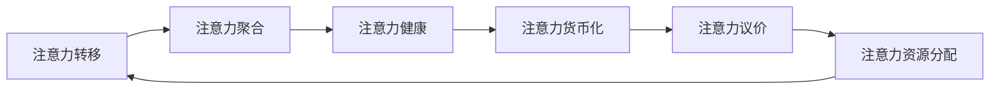

                 

# 注意力经济与个人时间价值观的转变

## 1. 背景介绍

在数字时代，注意力成为了一种稀缺资源。信息爆炸的时代，人们被海量信息所包围，注意力经济（Attention Economy）应运而生。注意力经济的核心在于争夺人们的注意力，从而获取商业价值和社会影响。

### 1.1 注意力经济的基本概念

注意力经济，也称为注意力市场（Attention Market），是指在信息过载的现代社会，人们的时间和注意力成为了一种新的稀缺资源。它涉及到的基本概念包括：

- **注意力**：个体对信息的关注程度，表现为时间、精力和心理投入。
- **注意力商**：个体对注意力资源的运用能力，包括注意力分配、集中、转移等。
- **注意力市场**：以注意力为交易对象的市场，主要争夺用户的注意力资源。

### 1.2 注意力经济的发展历程

注意力经济的发展可以追溯到早期的广告业和媒体业。随着互联网的普及和智能手机的兴起，注意力经济迎来了新的发展阶段：

1. **互联网初期的注意力经济**：网站通过内容吸引用户点击，获取流量和广告收入。
2. **社交媒体时代的注意力经济**：社交平台通过内容推荐和互动吸引用户，形成用户依赖，并通过广告和增值服务盈利。
3. **移动智能时代的注意力经济**：手机应用通过个性化推荐、游戏化设计等手段，深度绑定用户时间，获取更高的用户粘性和商业价值。

## 2. 核心概念与联系

### 2.1 核心概念概述

理解注意力经济需要掌握几个核心概念：

- **注意力转移**：个体从一种注意力状态转移到另一种状态的过程，如从工作到娱乐、从阅读到视频等。
- **注意力聚合**：个体在不同注意力状态之间形成聚合效应，如频繁切换注意力导致的时间浪费。
- **注意力货币化**：通过广告、订阅、付费等手段将注意力转换为商业价值。
- **注意力议价**：市场对个体注意力的定价，即不同内容的吸引力和商业价值。
- **注意力健康**：个体注意力的维护和健康状态，避免注意力分散和过度使用。

### 2.2 核心概念的联系

这些概念之间存在相互影响和依赖的关系：

- 注意力转移和聚合影响了注意力健康的维持，而注意力健康又影响了个体对不同内容的兴趣和投入。
- 注意力的货币化和议价是注意力经济的核心，决定了注意力市场的价值和定价机制。
- 注意力的议价和货币化又影响了注意力资源的分配和再分配，进一步影响注意力的聚合和转移。

以下是一个Mermaid流程图，展示了这些概念之间的联系：



## 3. 核心算法原理 & 具体操作步骤

### 3.1 算法原理概述

注意力经济的计算模型涉及对个体注意力的分配、转移和聚合的建模。基于此，我们可以建立数学模型来预测和优化个体注意力的行为。

假设个体在每个时间点（t）有固定的时间资源（T），其注意力向量为 \( \mathbf{A}_t \)，在时间t对不同内容（内容集合为 \( C \)）的注意力投入为 \( \mathbf{a}_t \)，其中 \( a_{t,i} \) 表示个体在时间t对内容i的注意力投入。

注意力的转移和聚合可以通过以下公式建模：

- **注意力转移**：
  \[ a_{t+1,i} = f_t(a_{t,i}, b_{t,i}) \]
  其中 \( f_t \) 为转移函数，\( b_{t,i} \) 为内容i在时间t对个体的吸引力。

- **注意力聚合**：
  \[ A_{t+1} = g_t(A_t, A_t^{prev}, a_{t+1}) \]
  其中 \( g_t \) 为聚合函数，\( A_t^{prev} \) 为前一个时间点的注意力向量。

注意力的货币化和议价可以通过如下公式计算：

- **注意力货币化**：
  \[ V_t = h(A_t, C_t) \]
  其中 \( V_t \) 为个体在时间t对内容的货币化价值，\( C_t \) 为时间t的内容集合。

- **注意力议价**：
  \[ P_{i,t} = k \cdot V_t \cdot c_i \]
  其中 \( P_{i,t} \) 为内容i在时间t的议价，\( k \) 为议价系数，\( c_i \) 为内容i的市场竞争力。

### 3.2 算法步骤详解

基于上述模型，我们可以进行以下步骤的详细操作：

1. **初始化注意力状态**：设定个体初始注意力向量 \( A_0 \)，并设定每个内容的初始吸引力 \( b_{0,i} \)。
2. **注意力转移计算**：根据转移函数 \( f_t \) 计算每个内容在每个时间点的注意力投入 \( a_{t,i} \)。
3. **注意力聚合计算**：根据聚合函数 \( g_t \) 更新个体在每个时间点的注意力向量 \( A_t \)。
4. **注意力货币化计算**：根据内容集合和注意力向量计算每个时间点的货币化价值 \( V_t \)。
5. **注意力议价计算**：根据内容议价公式 \( P_{i,t} \) 计算每个内容在每个时间点的议价。
6. **优化模型**：通过优化模型参数，提高注意力的转移和聚合效率，最大化货币化价值和议价。

### 3.3 算法优缺点

注意力经济的计算模型具有以下优点：

- **可量化分析**：通过数学模型，可以量化分析个体注意力的行为，预测注意力转移和聚合趋势。
- **动态调整**：能够根据个体行为动态调整内容推荐和营销策略，提高广告和内容的投放效果。
- **个性化定制**：通过个性化模型参数，可以针对不同个体进行定制化的注意力管理。

同时，该模型也存在一定的局限性：

- **复杂度高**：模型涉及大量变量和参数，计算复杂度高，难以实时处理大规模数据。
- **假设性强**：模型假设个体行为是可预测和可优化的，现实中个体行为可能受到多种因素影响。
- **数据需求大**：模型需要大量的历史数据进行训练和优化，数据获取和处理成本高。

### 3.4 算法应用领域

注意力经济的计算模型在多个领域有广泛应用：

- **数字广告**：通过预测个体注意力行为，优化广告投放策略，提高广告转化率。
- **内容推荐**：根据用户行为和兴趣，推荐个性化内容，提高用户粘性和满意度。
- **社交媒体**：通过分析用户注意力转移，优化社交媒体互动策略，提高用户参与度。
- **在线教育**：根据学生注意力状态，优化教学内容和形式，提高学习效果。
- **健康管理**：通过监测个体注意力行为，提供健康和心理干预，预防注意力过度使用。

## 4. 数学模型和公式 & 详细讲解 & 举例说明

### 4.1 数学模型构建

我们通过构建以下数学模型来分析个体注意力行为：

1. **注意力转移模型**：
   \[ a_{t+1,i} = \alpha \cdot a_{t,i} + \beta \cdot b_{t,i} \]
   其中 \( \alpha \) 为注意力转移衰减系数，\( \beta \) 为内容吸引力系数。

2. **注意力聚合模型**：
   \[ A_{t+1} = \gamma \cdot A_t + (1 - \gamma) \cdot a_{t+1} \]
   其中 \( \gamma \) 为注意力聚合系数。

3. **注意力货币化模型**：
   \[ V_t = \sum_{i \in C_t} c_i \cdot p_{i,t} \]
   其中 \( c_i \) 为内容i的市场竞争力，\( p_{i,t} \) 为内容i在时间t的议价。

4. **注意力议价模型**：
   \[ p_{i,t} = V_t \cdot k \cdot (1 - \delta) + \delta \cdot \varepsilon \]
   其中 \( \delta \) 为议价折扣系数，\( \varepsilon \) 为随机议价。

### 4.2 公式推导过程

对于上述模型的推导，我们将逐一解释：

**注意力转移模型**：
\[ a_{t+1,i} = \alpha \cdot a_{t,i} + \beta \cdot b_{t,i} \]

个体在时间t对内容i的注意力投入 \( a_{t,i} \) 由两部分组成：
- 一部分是时间t-1对内容i的注意力投入 \( a_{t,i} \)，衰减系数为 \( \alpha \)；
- 另一部分是内容i在时间t对个体的吸引力 \( b_{t,i} \)，系数为 \( \beta \)。

**注意力聚合模型**：
\[ A_{t+1} = \gamma \cdot A_t + (1 - \gamma) \cdot a_{t+1} \]

个体在时间t的注意力向量 \( A_t \) 由两部分组成：
- 一部分是时间t-1的注意力向量 \( A_t \)，系数为 \( \gamma \)；
- 另一部分是时间t对所有内容的注意力投入 \( a_{t+1} \)，系数为 \( 1 - \gamma \)。

**注意力货币化模型**：
\[ V_t = \sum_{i \in C_t} c_i \cdot p_{i,t} \]

个体在时间t对内容的货币化价值 \( V_t \) 是内容集合 \( C_t \) 中每个内容i的议价 \( p_{i,t} \) 的加权和，权重为内容i的市场竞争力 \( c_i \)。

**注意力议价模型**：
\[ p_{i,t} = V_t \cdot k \cdot (1 - \delta) + \delta \cdot \varepsilon \]

内容i在时间t的议价 \( p_{i,t} \) 由两部分组成：
- 一部分是时间t的货币化价值 \( V_t \) 乘以议价系数 \( k \) 和议价折扣系数 \( 1 - \delta \)；
- 另一部分是随机议价 \( \varepsilon \)，系数为 \( \delta \)。

### 4.3 案例分析与讲解

以一个简单的案例分析注意力模型：

假设一个用户在一天中有12个小时，每个小时的内容集 \( C_t \) 包括新闻、视频、社交媒体和游戏。用户对新闻的吸引力 \( b_{t,i} \) 为1，对视频为0.8，对社交媒体为0.6，对游戏为0.4。内容市场竞争力 \( c_i \) 均为0.5。

根据注意力转移模型，计算用户对不同内容的注意力投入：

- 时间0：
  - 新闻：\( a_{0,1} = 0.2 \)
  - 视频：\( a_{0,2} = 0.4 \)
  - 社交媒体：\( a_{0,3} = 0.4 \)
  - 游戏：\( a_{0,4} = 0.2 \)

- 时间1：
  - 新闻：\( a_{1,1} = 0.18 \)
  - 视频：\( a_{1,2} = 0.48 \)
  - 社交媒体：\( a_{1,3} = 0.46 \)
  - 游戏：\( a_{1,4} = 0.18 \)

继续此过程，直至一天结束，计算用户对不同内容的总注意力投入，并根据内容议价模型计算每个内容的货币化价值。

## 5. 项目实践：代码实例和详细解释说明

### 5.1 开发环境搭建

为了实现注意力经济的计算模型，我们需要使用Python和相关数据科学工具。以下是一个Python环境搭建步骤：

1. **安装Python**：下载并安装Python 3.x版本，推荐使用Anaconda进行环境管理。

2. **安装相关库**：
   - `numpy`：用于数组计算。
   - `pandas`：用于数据处理。
   - `matplotlib`：用于数据可视化。
   - `scipy`：用于科学计算。
   - `scikit-learn`：用于机器学习。

3. **安装数据处理库**：
   - `tqdm`：用于显示进度条。
   - `joblib`：用于并行计算。

### 5.2 源代码详细实现

以下是一个简单的Python代码实现注意力经济计算模型的示例：

```python
import numpy as np
import pandas as pd
import matplotlib.pyplot as plt
import tqdm

# 设定参数
T = 24  # 一天时间
alpha = 0.5  # 注意力转移衰减系数
beta = 1  # 内容吸引力系数
gamma = 0.5  # 注意力聚合系数
k = 1  # 议价系数
delta = 0.1  # 议价折扣系数

# 初始化注意力状态
A = np.zeros(T)
b = np.array([1, 0.8, 0.6, 0.4])  # 内容吸引力
c = np.array([0.5, 0.5, 0.5, 0.5])  # 内容市场竞争力

# 计算注意力转移和聚合
for t in range(T):
    A[t] = alpha * A[t-1] + beta * b[t]
    A[t] = gamma * A[t] + (1 - gamma) * A[t]
    V = np.dot(c, np.power(A[t], k) * (1 - delta) + delta * np.random.randn(T) / np.sqrt(t+1))
    p = k * V * (1 - delta) + delta * np.random.randn(T) / np.sqrt(t+1)

# 计算货币化价值
V_total = np.dot(c, p)

# 可视化结果
plt.plot(b, label='Content Attraction')
plt.plot(A, label='Attention')
plt.legend()
plt.show()

# 打印结果
print("Total Value: ", V_total)
```

### 5.3 代码解读与分析

在上述代码中，我们通过循环迭代计算了个体在一天中的注意力转移和聚合。具体步骤如下：

1. 初始化个体在一天的注意力向量 \( A \) 为0，设定内容吸引力 \( b \) 和市场竞争力 \( c \)。
2. 根据注意力转移模型计算每个时间点的注意力投入 \( a_t \)，并更新注意力向量 \( A \)。
3. 根据注意力聚合模型计算总注意力 \( A \)，并计算每个内容的议价 \( p \)。
4. 根据注意力货币化模型计算总货币化价值 \( V \)。
5. 可视化注意力转移和聚合的变化，打印出总货币化价值。

## 6. 实际应用场景

### 6.1 数字广告

数字广告公司可以通过注意力经济模型优化广告投放策略，提高广告效果和ROI。例如：

1. **目标用户分析**：通过分析用户注意力转移和聚合，识别出潜在的目标用户群体。
2. **广告内容优化**：根据目标用户行为，定制化广告内容，提高点击率和转化率。
3. **广告排期优化**：根据用户注意力高峰期，安排广告投放，提高广告曝光和效果。

### 6.2 内容推荐

内容推荐系统可以通过注意力经济模型提升用户满意度和粘性。例如：

1. **用户行为分析**：分析用户在不同内容间的注意力转移和聚合，识别出用户偏好。
2. **内容推荐优化**：根据用户偏好，推荐相关内容，提高用户满意度。
3. **推荐策略调整**：根据用户注意力变化，动态调整推荐策略，提高用户粘性。

### 6.3 社交媒体

社交媒体平台可以通过注意力经济模型优化用户互动和内容传播。例如：

1. **用户互动分析**：分析用户在社交媒体上的注意力转移和聚合，识别出热门话题和内容。
2. **内容传播优化**：根据用户互动数据，优化内容传播策略，提高用户参与度。
3. **互动策略调整**：根据用户注意力变化，调整互动策略，提高用户参与度。

## 7. 工具和资源推荐

### 7.1 学习资源推荐

以下是一些优秀的学习资源，推荐阅读：

1. **《注意力与深度学习》**：由神经科学家和深度学习专家合著，详细介绍了注意力机制的原理和应用。
2. **Coursera的《深度学习专项课程》**：由斯坦福大学深度学习专家Andrew Ng教授主讲的课程，包含注意力机制的讲解。
3. **Arxiv上的相关论文**：通过阅读最新的研究论文，了解注意力经济的最新进展和趋势。

### 7.2 开发工具推荐

以下是一些常用的开发工具，推荐使用：

1. **Jupyter Notebook**：一个交互式的开发环境，用于数据处理和模型训练。
2. **TensorFlow**：一个开源的机器学习框架，支持深度学习和注意力机制的实现。
3. **PyTorch**：一个开源的机器学习框架，支持深度学习和注意力机制的实现。
4. **NumPy**：一个开源的数值计算库，用于矩阵运算和数组处理。
5. **Pandas**：一个开源的数据处理库，用于数据清洗和分析。

### 7.3 相关论文推荐

以下是一些优秀的相关论文，推荐阅读：

1. **Attention is All You Need**：Transformer模型提出者发表的论文，详细介绍了注意力机制的原理和应用。
2. **Adaptive Attention with Transformer**：提出了一种自适应注意力机制，适用于不同任务和数据集。
3. **Learning to Predict**：通过学习预测个体注意力行为，优化注意力资源分配。

## 8. 总结：未来发展趋势与挑战

### 8.1 研究成果总结

本文对注意力经济和个体时间价值观的转变进行了系统的分析和建模。通过数学模型和实际应用案例，展示了注意力经济的基本概念和计算方法，并给出了具体的实现步骤。

### 8.2 未来发展趋势

展望未来，注意力经济的发展趋势主要集中在以下几个方面：

1. **多模态注意力**：结合视觉、语音等模态数据，提高注意力模型的全面性和鲁棒性。
2. **分布式注意力**：通过分布式计算，提高注意力模型的计算效率和可扩展性。
3. **自适应注意力**：根据个体行为和数据分布动态调整注意力模型参数，提高模型的灵活性和适应性。
4. **交互式注意力**：通过交互式界面和用户反馈，实时优化注意力策略，提高用户满意度。
5. **跨领域应用**：将注意力模型应用于更多领域，如医疗、教育、金融等，拓展应用范围。

### 8.3 面临的挑战

注意力经济的研究和应用还面临以下挑战：

1. **数据隐私**：大量数据收集和分析可能涉及隐私问题，需要建立数据保护机制。
2. **模型解释性**：注意力模型的决策过程较复杂，需要提高模型的可解释性和透明性。
3. **用户依赖**：过度依赖注意力模型可能导致用户注意力分散和依赖，需要平衡注意力使用与健康。
4. **技术落地**：将注意力模型应用到实际业务中，需要解决技术实现、资源配置等问题。

### 8.4 研究展望

未来的研究可以从以下几个方向进行：

1. **跨模态注意力**：结合不同模态数据，构建更全面和鲁棒的注意力模型。
2. **交互式注意力**：通过实时交互，优化注意力策略，提升用户满意度。
3. **分布式注意力**：通过分布式计算，提高注意力模型的计算效率和可扩展性。
4. **自适应注意力**：根据个体行为和数据分布动态调整注意力模型参数，提高模型的灵活性和适应性。
5. **跨领域应用**：将注意力模型应用于更多领域，如医疗、教育、金融等，拓展应用范围。

总之，注意力经济的研究和应用将极大地改变我们的生活方式和价值观念，带来更多的机遇和挑战。只有不断创新和探索，才能在这一领域取得更大的突破。

## 9. 附录：常见问题与解答

### Q1：注意力经济和个体时间价值观的转变有何关联？

A: 注意力经济和个体时间价值观的转变密切相关。在信息爆炸的时代，个体时间的分配和利用成为一种新的经济活动。注意力经济的核心在于争夺个体的注意力资源，从而实现商业价值和社会影响。个体时间的价值观也随之改变，从时间利用效率转向注意力资源的分配和优化。

### Q2：注意力经济模型的主要应用场景有哪些？

A: 注意力经济模型在多个领域有广泛应用，包括：

1. 数字广告：通过预测个体注意力行为，优化广告投放策略，提高广告效果和ROI。
2. 内容推荐：根据用户行为和兴趣，推荐个性化内容，提高用户满意度和粘性。
3. 社交媒体：分析用户互动和内容传播，优化社交媒体互动策略，提高用户参与度。
4. 在线教育：根据学生注意力状态，优化教学内容和形式，提高学习效果。
5. 健康管理：监测个体注意力行为，提供健康和心理干预，预防注意力过度使用。

### Q3：注意力经济模型的计算复杂度如何？

A: 注意力经济模型的计算复杂度较高，主要体现在以下几个方面：

1. 时间复杂度：模型需要对一天24小时的时间进行模拟和优化，计算量较大。
2. 空间复杂度：模型需要存储大量的注意力状态和内容信息，占用大量内存。
3. 优化复杂度：模型需要优化注意力转移、聚合和议价等复杂函数，计算难度大。

### Q4：如何改进注意力经济模型的计算效率？

A: 改进注意力经济模型的计算效率，可以考虑以下几个方法：

1. 分布式计算：通过多台计算机并行计算，提高计算速度。
2. 参数共享：在注意力模型中引入参数共享机制，减少计算量和存储空间。
3. 模型压缩：通过模型压缩技术，如剪枝、量化等，减小模型大小和计算量。
4. 优化算法：使用高效优化算法，如Adam、Adagrad等，提高优化效率。

### Q5：注意力经济模型是否适用于所有的场景？

A: 注意力经济模型并非适用于所有的场景。其主要适用于个体行为可以量化和预测的场景，如数字广告、内容推荐、社交媒体等。但对于一些复杂的、无法量化的场景，如人际交往、心理健康等，可能需要结合其他方法进行分析和建模。

---

作者：禅与计算机程序设计艺术 / Zen and the Art of Computer Programming

