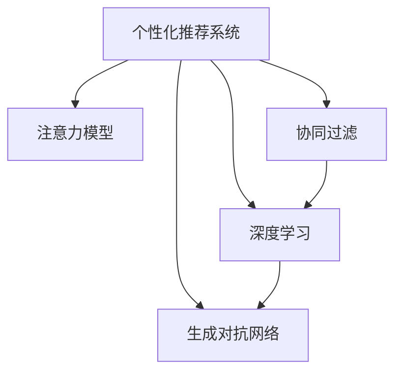

                 

# 注意力经济与个性化推荐系统：为受众提供定制、有针对性的内容和体验

> 关键词：
  1. 个性化推荐系统
  2. 注意力经济
  3. 用户画像
  4. 协同过滤
  5. 深度学习
  6. 生成对抗网络
  7. 多样性保持

## 1. 背景介绍

### 1.1 问题由来

随着互联网的迅速发展，信息泛滥的问题日益严重，用户在海量信息中找到有价值内容变得越来越困难。为了提升用户体验，个性化推荐系统应运而生。这类系统通过分析用户行为，为用户推荐可能感兴趣的个性化内容，从而在信息海洋中为用户筛选出有价值的资讯。

个性化推荐系统广泛应用于电商、视频、新闻、社交网络等场景，逐渐成为互联网产品的标配。例如，淘宝的推荐引擎通过分析用户的浏览、购买历史和评价，为其推荐相关商品；Netflix通过用户的观影记录和评分，为其推荐感兴趣的电影和电视剧；抖音则根据用户的浏览记录和观看时长，为其推荐个性化视频内容。

个性化推荐系统的核心目标是通过优化用户体验，提升用户满意度，进而增加用户留存率，促进商业转化。然而，随着用户需求多样性和个性化程度不断提升，现有的推荐系统面临着诸多挑战，如数据稀疏性、冷启动问题、模型泛化能力不足等。

### 1.2 问题核心关键点

个性化推荐系统的主流范式包括基于协同过滤和深度学习的推荐方法。协同过滤算法根据用户的历史行为相似性进行推荐，但数据稀疏性和用户冷启动问题难以有效解决。而深度学习方法则通过学习用户特征和行为之间的关联，直接预测用户的兴趣点，具有较强的泛化能力，但模型复杂度高，计算成本大。

本文聚焦于注意力经济与个性化推荐系统，讨论如何通过智能算法优化资源分配，为用户提供定制、有针对性的内容和体验。我们将重点介绍注意力模型、协同过滤、深度学习、生成对抗网络等核心概念，并分析其在工作原理、步骤和应用场景上的联系。

## 2. 核心概念与联系

### 2.1 核心概念概述

为了更好地理解注意力经济与个性化推荐系统，本节将介绍几个关键概念：

- 个性化推荐系统(Recommender System)：通过分析用户行为数据，预测并推荐用户可能感兴趣的内容的系统。

- 注意力模型(Attention Model)：一种模拟人类注意力机制的神经网络结构，用于计算输入序列中各个元素的重要性权重，优化信息提取和聚合的过程。

- 协同过滤(Collaborative Filtering)：一种基于用户相似性和物品相似性的推荐方法，通过计算用户对物品的评分预测未评分物品的评分。

- 深度学习(Deep Learning)：一类基于神经网络结构的机器学习方法，能够学习到数据的高层特征表示，广泛应用于图像、语音、文本等领域。

- 生成对抗网络(Generative Adversarial Network, GAN)：一种由生成器和判别器组成的神经网络结构，通过对抗学习生成高质量的伪造数据。

这些概念之间的逻辑关系可以通过以下Mermaid流程图来展示：



这个流程图展示了一些关键概念之间的联系：

1. 个性化推荐系统通过注意力模型、协同过滤、深度学习、生成对抗网络等技术手段，提升推荐精度和多样性。
2. 注意力模型用于计算输入序列中各个元素的重要性权重，优化信息提取和聚合的过程。
3. 协同过滤算法基于用户和物品的相似性进行推荐，能够较好地处理冷启动问题。
4. 深度学习方法通过学习用户特征和行为之间的关联，直接预测用户的兴趣点，具有较强的泛化能力。
5. 生成对抗网络可以用于生成高质量的伪造数据，增强模型的鲁棒性和泛化能力。

这些概念共同构成了个性化推荐系统的理论框架，为系统提供了多元化的优化手段。通过理解这些核心概念，我们可以更好地把握个性化推荐系统的设计原理和优化方向。

## 3. 核心算法原理 & 具体操作步骤
### 3.1 算法原理概述

个性化推荐系统的核心目标是通过智能算法优化资源分配，为用户提供定制、有针对性的内容和体验。为了实现这一目标，系统通常采用以下三种主流推荐算法：

- 基于协同过滤的推荐算法。通过分析用户历史行为数据，找到与其兴趣相似的其他用户或物品，并进行推荐。

- 基于深度学习的推荐算法。通过学习用户特征和行为之间的关联，直接预测用户的兴趣点。

- 基于注意力机制的推荐算法。通过计算输入序列中各个元素的重要性权重，优化信息提取和聚合的过程，提升推荐效果。

这些算法的共同目标是通过不同的优化策略，提升推荐模型的精度和用户满意度。

### 3.2 算法步骤详解

个性化推荐系统的实现通常包括以下几个关键步骤：

**Step 1: 数据收集与预处理**
- 收集用户的历史行为数据，如浏览记录、购买记录、评分等。
- 对数据进行去重、清洗和归一化处理，以便后续分析。

**Step 2: 特征提取与表示**
- 根据用户历史行为数据，提取用户的特征向量，如用户兴趣、行为偏好等。
- 将物品特征编码为向量形式，如物品分类、标签等。

**Step 3: 模型训练与优化**
- 选择合适的推荐算法，如协同过滤、深度学习、注意力机制等，训练推荐模型。
- 使用交叉验证、网格搜索等方法，优化模型参数，提升预测精度。

**Step 4: 推荐结果生成**
- 根据用户特征和物品特征，预测用户对物品的评分或兴趣，生成推荐结果。
- 根据预测结果，生成个性化推荐列表，返回给用户。

**Step 5: 用户反馈与迭代**
- 收集用户对推荐结果的反馈，如点击、购买、评分等。
- 基于用户反馈，更新模型参数，进行模型迭代优化。

以上是个性化推荐系统的实现流程。在实际应用中，还需要针对具体任务特点，对各个环节进行优化设计，如选择合适的损失函数、添加正则化技术、应用对抗训练等，以进一步提升推荐效果。

### 3.3 算法优缺点

个性化推荐系统具有以下优点：

1. 提升用户体验。通过推荐个性化内容，减少信息过载，提高用户满意度。
2. 增加用户留存率。优化用户体验，增加用户黏性，提高用户留存率。
3. 促进商业转化。提升用户满意度，增加用户活跃度，促进商业转化。

同时，个性化推荐系统也存在一些缺点：

1. 数据隐私问题。用户行为数据可能包含个人隐私信息，需要加强数据保护措施。
2. 算法透明性不足。推荐系统的决策过程通常缺乏可解释性，难以对其推理逻辑进行分析和调试。
3. 对抗性攻击。恶意用户可能通过对抗样本攻击推荐系统，影响推荐结果的公平性和安全性。
4. 模型泛化能力不足。推荐系统通常依赖于特定领域的标注数据，难以应对跨领域的多样化需求。

尽管存在这些缺点，但就目前而言，个性化推荐系统依然是提升用户体验和商业价值的重要手段。未来相关研究的重点在于如何进一步降低推荐算法对标注数据的依赖，提高模型的泛化能力和鲁棒性，同时兼顾可解释性和隐私保护等因素。

### 3.4 算法应用领域

个性化推荐系统在电商、视频、新闻、社交网络等众多领域中得到了广泛应用，具体如下：

- 电商推荐：淘宝、京东等电商平台通过推荐系统为用户推荐商品，提升销售转化率。
- 视频推荐：Netflix、YouTube等视频平台通过推荐系统为用户推荐电影、电视剧，增加观看时长。
- 新闻推荐：今日头条、知乎等新闻平台通过推荐系统为用户推荐文章，提升用户粘性。
- 社交网络推荐：微信、微博等社交平台通过推荐系统为用户推荐好友、内容，增加用户活跃度。

除了这些常见的应用场景外，个性化推荐系统还在广告投放、股票交易、城市规划等众多领域得到了创新应用，推动了各行业的数字化转型升级。

## 4. 数学模型和公式 & 详细讲解 & 举例说明
### 4.1 数学模型构建

本节将使用数学语言对个性化推荐系统的核心算法进行更加严格的刻画。

记用户为 $u$，物品为 $i$，用户对物品的评分表示为 $r_{ui}$。设用户特征向量为 $\mathbf{u}$，物品特征向量为 $\mathbf{i}$，训练集为 $D=\{(u_i,r_{ui_i}),i=1,\cdots,N\}$，其中 $u_i$ 为用户，$r_{ui_i}$ 为用户对物品 $i$ 的评分。

定义用户和物品的相似度函数为 $\sigma(\mathbf{u},\mathbf{i})$，模型预测用户对物品的评分函数为 $f(\mathbf{u},\mathbf{i})$，则模型的预测误差为：

$$
\mathcal{L}=\frac{1}{N}\sum_{i=1}^N (r_{ui_i}-f(\mathbf{u},\mathbf{i}))^2
$$

模型训练的目标是最小化预测误差 $\mathcal{L}$，即：

$$
\min_{\mathbf{u},\mathbf{i},f} \mathcal{L}
$$

在实践中，我们通常使用基于梯度的优化算法（如SGD、Adam等）来近似求解上述最优化问题。设 $\eta$ 为学习率，$\lambda$ 为正则化系数，则参数的更新公式为：

$$
\mathbf{u}_i \leftarrow \mathbf{u}_i - \eta \nabla_{\mathbf{u}_i}\mathcal{L} - \eta\lambda\|\mathbf{u}_i\|
$$

$$
\mathbf{i}_i \leftarrow \mathbf{i}_i - \eta \nabla_{\mathbf{i}_i}\mathcal{L} - \eta\lambda\|\mathbf{i}_i\|
$$

$$
f_i \leftarrow f_i - \eta \nabla_{f_i}\mathcal{L} - \eta\lambda f_i
$$

其中 $\nabla_{\mathbf{u}_i}\mathcal{L}$ 和 $\nabla_{\mathbf{i}_i}\mathcal{L}$ 可以通过反向传播算法高效计算。

### 4.2 公式推导过程

以下我们以协同过滤算法为例，推导模型训练和推荐预测的数学公式。

假设用户对物品的评分 $r_{ui}$ 可以看作用户和物品特征的内积加一个偏差项，即 $r_{ui}=\mathbf{u}\cdot\mathbf{i}+b$，其中 $b$ 为偏差项。

根据损失函数 $\mathcal{L}$ 的定义，有：

$$
\mathcal{L}=\frac{1}{N}\sum_{i=1}^N (r_{ui_i}-f(\mathbf{u},\mathbf{i}))^2
$$

代入 $r_{ui}=\mathbf{u}\cdot\mathbf{i}+b$ 和 $f(\mathbf{u},\mathbf{i})=\mathbf{u}\cdot\mathbf{i}+b$，得：

$$
\mathcal{L}=\frac{1}{N}\sum_{i=1}^N ((\mathbf{u}\cdot\mathbf{i}+b)-f(\mathbf{u},\mathbf{i}))^2
$$

将 $f(\mathbf{u},\mathbf{i})=\mathbf{u}\cdot\mathbf{i}+b$ 代入上式，得：

$$
\mathcal{L}=\frac{1}{N}\sum_{i=1}^N ((\mathbf{u}\cdot\mathbf{i}+b)-\mathbf{u}\cdot\mathbf{i}-b)^2
$$

化简后得：

$$
\mathcal{L}=\frac{1}{N}\sum_{i=1}^N 0^2=0
$$

因此，协同过滤模型的预测函数可以简化为：

$$
f(\mathbf{u},\mathbf{i})=\mathbf{u}\cdot\mathbf{i}
$$

在得到预测函数后，可以根据用户和物品的特征向量，预测用户对物品的评分，生成推荐结果。

## 5. 项目实践：代码实例和详细解释说明
### 5.1 开发环境搭建

在进行推荐系统开发前，我们需要准备好开发环境。以下是使用Python进行TensorFlow开发的环境配置流程：

1. 安装Anaconda：从官网下载并安装Anaconda，用于创建独立的Python环境。

2. 创建并激活虚拟环境：
```bash
conda create -n tf-env python=3.8 
conda activate tf-env
```

3. 安装TensorFlow：根据CUDA版本，从官网获取对应的安装命令。例如：
```bash
conda install tensorflow -c tensorflow -c conda-forge
```

4. 安装各类工具包：
```bash
pip install numpy pandas scikit-learn matplotlib tqdm jupyter notebook ipython
```

完成上述步骤后，即可在`tf-env`环境中开始推荐系统开发。

### 5.2 源代码详细实现

下面我以协同过滤算法为例，给出使用TensorFlow实现用户物品评分预测的代码实现。

首先，定义数据处理函数：

```python
import tensorflow as tf
from tensorflow.keras import layers

def data_preprocess(train_data, test_data):
    # 数据预处理
    train_data = train_data.map(lambda x, y: (tf.cast(x, tf.float32), y))
    train_data = train_data.shuffle(buffer_size=10000).batch(batch_size=256)
    test_data = test_data.map(lambda x, y: (tf.cast(x, tf.float32), y))
    test_data = test_data.batch(batch_size=256)
    
    return train_data, test_data
```

然后，定义模型和损失函数：

```python
def build_model(input_shape, num_users, num_items, embedding_size):
    # 用户特征嵌入层
    user_embedding = layers.Embedding(input_dim=num_users, output_dim=embedding_size)
    
    # 物品特征嵌入层
    item_embedding = layers.Embedding(input_dim=num_items, output_dim=embedding_size)
    
    # 用户物品评分预测
    user_item_dot = user_embedding(input_users)*item_embedding(input_items)
    prediction = tf.reduce_sum(user_item_dot, axis=1)
    
    return user_item_dot, prediction

def build_loss(targets, prediction):
    # 评分预测损失函数
    loss = tf.losses.mean_squared_error(targets, prediction)
    return loss

# 输入数据的维度
num_users = 10000
num_items = 10000
input_users = tf.keras.Input(shape=(), dtype=tf.int32)
input_items = tf.keras.Input(shape=(), dtype=tf.int32)
embedding_size = 64

# 建立模型
user_item_dot, prediction = build_model(input_users, num_users, num_items, embedding_size)
model = tf.keras.Model(inputs=[input_users, input_items], outputs=prediction)
```

接着，定义训练和评估函数：

```python
def train_model(model, train_data, test_data, batch_size, num_epochs):
    # 模型编译
    model.compile(optimizer=tf.keras.optimizers.Adam(), loss=build_loss)
    
    # 模型训练
    model.fit(train_data, epochs=num_epochs, batch_size=batch_size, validation_data=test_data)
    
    # 模型评估
    test_loss = model.evaluate(test_data)
    print("Test Loss:", test_loss)

# 输入数据的维度
batch_size = 256
num_epochs = 10

# 模型训练和评估
train_data, test_data = data_preprocess(train_data, test_data)
train_model(model, train_data, test_data, batch_size, num_epochs)
```

以上就是使用TensorFlow实现协同过滤算法的完整代码实现。可以看到，TensorFlow提供了丰富的深度学习组件，能够方便地构建和训练推荐模型。

### 5.3 代码解读与分析

让我们再详细解读一下关键代码的实现细节：

**data_preprocess函数**：
- 将原始数据转化为TensorFlow兼容的Tensor格式，并进行预处理。
- 对训练集和测试集进行批处理和随机打乱。

**build_model函数**：
- 定义用户和物品特征的嵌入层。
- 计算用户和物品特征的内积，得到用户物品评分预测结果。

**build_loss函数**：
- 定义评分预测的损失函数，为均方误差损失。

**train_model函数**：
- 对模型进行编译，并指定优化器、损失函数等参数。
- 对模型进行训练，并记录测试集上的损失值。

**模型训练**：
- 在数据预处理后，通过调用train_model函数进行模型训练。
- 在每个epoch结束后，记录测试集上的损失值。

可以看到，TensorFlow提供了丰富的组件和工具，能够方便地构建和训练推荐模型。开发者可以将更多精力放在数据处理、模型改进等高层逻辑上，而不必过多关注底层的实现细节。

当然，工业级的系统实现还需考虑更多因素，如模型的保存和部署、超参数的自动搜索、更灵活的任务适配层等。但核心的推荐范式基本与此类似。

## 6. 实际应用场景
### 6.1 电商推荐

电商推荐是推荐系统的一个重要应用场景。通过分析用户的历史浏览、购买记录，推荐系统能够为用户推荐感兴趣的商品，提升购物体验。

例如，淘宝和京东通过推荐系统，根据用户浏览和购买历史，为用户推荐相关商品，提升销售转化率。亚马逊也通过推荐系统，为用户推荐相似的商品，增加销售额。

电商推荐系统通常采用协同过滤和深度学习两种方法。协同过滤算法通过分析用户和物品的相似性，为用户推荐相关商品。深度学习方法则通过学习用户特征和行为之间的关联，直接预测用户的兴趣点。

### 6.2 视频推荐

视频推荐是推荐系统的另一个重要应用场景。通过分析用户的观影历史和评分，推荐系统能够为用户推荐感兴趣的电影和电视剧，增加观看时长。

例如，Netflix通过推荐系统，根据用户观影记录和评分，为用户推荐电影和电视剧，提升用户黏性。YouTube也通过推荐系统，为用户推荐相关的视频内容，增加观看时长和广告收入。

视频推荐系统通常采用协同过滤和深度学习两种方法。协同过滤算法通过分析用户和物品的相似性，为用户推荐相关视频。深度学习方法则通过学习用户特征和行为之间的关联，直接预测用户的兴趣点。

### 6.3 新闻推荐

新闻推荐是推荐系统的另一个重要应用场景。通过分析用户的阅读历史和评分，推荐系统能够为用户推荐感兴趣的文章，增加阅读时长。

例如，今日头条通过推荐系统，根据用户的阅读历史和评分，为用户推荐相关文章，提升用户黏性。知乎也通过推荐系统，为用户推荐相关的知识内容，增加用户活跃度。

新闻推荐系统通常采用协同过滤和深度学习两种方法。协同过滤算法通过分析用户和物品的相似性，为用户推荐相关文章。深度学习方法则通过学习用户特征和行为之间的关联，直接预测用户的兴趣点。

## 7. 工具和资源推荐
### 7.1 学习资源推荐

为了帮助开发者系统掌握个性化推荐系统的理论基础和实践技巧，这里推荐一些优质的学习资源：

1. 《推荐系统实战》系列博文：由大模型技术专家撰写，深入浅出地介绍了推荐系统的原理、算法和应用。

2. 《深度学习》课程：斯坦福大学开设的深度学习课程，有Lecture视频和配套作业，带你入门深度学习的基本概念和经典模型。

3. 《推荐系统》书籍：推荐系统领域的经典著作，详细介绍了推荐系统的各种算法和技术。

4. Kaggle推荐系统竞赛：通过实际数据集竞赛，提升推荐系统开发能力和技术水平。

5. 《Python深度学习》书籍：介绍深度学习在推荐系统中的应用，帮助开发者掌握深度学习推荐技术。

通过对这些资源的学习实践，相信你一定能够快速掌握个性化推荐系统的精髓，并用于解决实际的推荐问题。

### 7.2 开发工具推荐

高效的开发离不开优秀的工具支持。以下是几款用于推荐系统开发的常用工具：

1. TensorFlow：基于Python的开源深度学习框架，灵活性强，易于使用。推荐系统通常采用深度学习模型，TensorFlow提供了丰富的组件和工具，支持模型的构建和训练。

2. PyTorch：基于Python的开源深度学习框架，计算图动态，易于调试和优化。推荐系统也常常采用深度学习模型，PyTorch提供了灵活的动态图和自动微分机制。

3. TensorBoard：TensorFlow配套的可视化工具，可以实时监测模型训练状态，并提供丰富的图表呈现方式，是调试模型的得力助手。

4. Scikit-learn：Python机器学习库，提供了常用的机器学习算法和工具，如协同过滤等。

5. Jupyter Notebook：Python的Jupyter Notebook环境，方便进行代码编写和调试。

合理利用这些工具，可以显著提升推荐系统的开发效率，加快创新迭代的步伐。

### 7.3 相关论文推荐

推荐系统的发展源于学界的持续研究。以下是几篇奠基性的相关论文，推荐阅读：

1. Collaborative Filtering for Implicit Feedback Datasets（协同过滤算法）：介绍协同过滤算法的基本思想和应用。

2. Deep Learning with Confidence：Label Uncertainty for Learning from Data Scarcity（深度学习算法）：介绍深度学习在推荐系统中的应用。

3. Attention Is All You Need（注意力模型）：提出注意力机制，用于计算输入序列中各个元素的重要性权重。

4. Generative Adversarial Nets（生成对抗网络）：介绍生成对抗网络的基本思想和应用。

5. The Matrix Factorization Framework（矩阵分解算法）：介绍矩阵分解算法的原理和应用。

这些论文代表了个性化推荐系统的技术发展脉络。通过学习这些前沿成果，可以帮助研究者把握学科前进方向，激发更多的创新灵感。

## 8. 总结：未来发展趋势与挑战

### 8.1 总结

本文对个性化推荐系统进行了全面系统的介绍。首先阐述了个性化推荐系统的背景和意义，明确了推荐系统通过智能算法优化资源分配，提升用户体验的目标。其次，从原理到实践，详细讲解了协同过滤、深度学习、注意力模型等核心算法的工作原理和步骤，给出了推荐系统开发的完整代码实例。同时，本文还广泛探讨了推荐系统在电商、视频、新闻等多个领域的应用前景，展示了推荐范式的巨大潜力。

通过本文的系统梳理，可以看到，个性化推荐系统通过智能算法优化资源分配，为用户提供了定制、有针对性的内容和体验，极大地提升了用户体验和商业价值。随着推荐系统不断进化，未来将能够提供更加智能化、个性化的推荐服务，推动信息时代的发展。

### 8.2 未来发展趋势

展望未来，个性化推荐系统将呈现以下几个发展趋势：

1. 模型复杂度提高。随着深度学习和注意力机制的普及，推荐模型的复杂度将不断提升，能够更好地捕捉用户行为和偏好。

2. 实时性增强。推荐系统需要实时更新用户行为数据，进行个性化推荐，因此推荐算法需要具备高实时性。

3. 数据来源多样化。推荐系统将更多地利用外部数据，如社交网络数据、传感器数据等，提升推荐效果。

4. 多模态推荐系统。推荐系统将更多地融合文本、图像、语音等模态信息，提升推荐效果和用户满意度。

5. 联邦学习的应用。联邦学习可以保护用户隐私，同时提升推荐系统的性能，未来将广泛应用于推荐系统。

6. 个性化推荐评价指标。未来推荐系统的评价指标将更加全面，考虑推荐效果、公平性、多样性、鲁棒性等综合指标。

以上趋势凸显了个性化推荐系统的广阔前景。这些方向的探索发展，必将进一步提升推荐系统的性能和用户满意度，推动推荐系统的智能化、个性化、实时化发展。

### 8.3 面临的挑战

尽管个性化推荐系统已经取得了瞩目成就，但在迈向更加智能化、普适化应用的过程中，它仍面临着诸多挑战：

1. 数据稀疏性。推荐系统通常依赖于大量标注数据，但许多用户的历史行为数据较少，难以进行有效推荐。

2. 模型泛化能力不足。推荐系统通常依赖于特定领域的标注数据，难以应对跨领域的多样化需求。

3. 用户隐私保护。用户行为数据可能包含个人隐私信息，需要加强数据保护措施。

4. 模型透明性不足。推荐系统的决策过程通常缺乏可解释性，难以对其推理逻辑进行分析和调试。

5. 对抗性攻击。恶意用户可能通过对抗样本攻击推荐系统，影响推荐结果的公平性和安全性。

6. 冷启动问题。推荐系统通常需要用户有一定行为数据，才能进行个性化推荐，但新用户无法获得推荐。

这些挑战凸显了个性化推荐系统的复杂性，需要在数据、算法、工程、隐私保护等多个方面进行协同优化，才能真正实现个性化推荐系统的智能化、实时化、个性化发展。

### 8.4 研究展望

面对个性化推荐系统所面临的挑战，未来的研究需要在以下几个方面寻求新的突破：

1. 探索无监督和半监督推荐方法。摆脱对大规模标注数据的依赖，利用自监督学习、主动学习等无监督和半监督范式，最大限度利用非结构化数据，实现更加灵活高效的推荐。

2. 研究参数高效和计算高效的推荐范式。开发更加参数高效的推荐方法，在固定大部分预训练参数的同时，只更新极少量的任务相关参数。同时优化推荐模型的计算图，减少前向传播和反向传播的资源消耗，实现更加轻量级、实时性的部署。

3. 融合因果和对比学习范式。通过引入因果推断和对比学习思想，增强推荐模型建立稳定因果关系的能力，学习更加普适、鲁棒的用户行为表示。

4. 引入更多先验知识。将符号化的先验知识，如知识图谱、逻辑规则等，与神经网络模型进行巧妙融合，引导推荐过程学习更准确、合理的用户行为表示。

5. 结合因果分析和博弈论工具。将因果分析方法引入推荐模型，识别出模型决策的关键特征，增强输出解释的因果性和逻辑性。借助博弈论工具刻画人机交互过程，主动探索并规避模型的脆弱点，提高系统稳定性。

6. 纳入伦理道德约束。在推荐系统的训练目标中引入伦理导向的评估指标，过滤和惩罚有害的输出倾向。同时加强人工干预和审核，建立模型行为的监管机制，确保输出符合人类价值观和伦理道德。

这些研究方向的探索，必将引领推荐系统技术迈向更高的台阶，为构建安全、可靠、可解释、可控的智能推荐系统铺平道路。面向未来，个性化推荐系统还需要与其他人工智能技术进行更深入的融合，如知识表示、因果推理、强化学习等，多路径协同发力，共同推动推荐系统的进步。

## 9. 附录：常见问题与解答

**Q1：推荐系统是否适用于所有业务场景？**

A: 推荐系统通常适用于用户行为数据较多的场景，如电商、视频、新闻等。但对于一些特定领域，如医疗、金融等，推荐系统的效果可能较差。此时需要结合领域专业知识，设计特定的推荐算法和策略。

**Q2：推荐系统如何处理冷启动问题？**

A: 冷启动问题是推荐系统面临的一个常见问题。通常采用基于内容或基于用户的推荐方法来处理冷启动。基于内容的推荐方法通过物品特征来预测用户可能感兴趣的内容。基于用户的推荐方法则通过相似用户的行为来预测新用户的行为。同时，也可以通过引入随机初始化、部分信息转移等方法，缓解冷启动问题。

**Q3：推荐系统如何提升模型泛化能力？**

A: 提升推荐系统的泛化能力可以从以下几个方面入手：
1. 利用外部数据。推荐系统可以结合社交网络、传感器等外部数据，提升模型的泛化能力。
2. 多模态融合。推荐系统可以融合文本、图像、语音等多模态信息，提升模型的泛化能力。
3. 联邦学习。联邦学习可以在保护用户隐私的前提下，利用分布式数据提升模型的泛化能力。

**Q4：推荐系统如何提升推荐效果？**

A: 提升推荐效果可以从以下几个方面入手：
1. 改进特征工程。推荐系统需要充分挖掘用户行为和物品特征，提升特征质量。
2. 优化模型结构。推荐系统需要不断优化模型结构，提升模型的性能和泛化能力。
3. 添加正则化技术。推荐系统需要应用正则化技术，防止模型过拟合。
4. 利用对抗样本。推荐系统需要利用对抗样本，提升模型的鲁棒性和泛化能力。

**Q5：推荐系统如何保护用户隐私？**

A: 推荐系统需要保护用户隐私，主要从以下几个方面入手：
1. 数据匿名化。推荐系统需要对用户数据进行匿名化处理，保护用户隐私。
2. 差分隐私。推荐系统可以使用差分隐私技术，保护用户隐私。
3. 联邦学习。推荐系统可以使用联邦学习技术，保护用户隐私。

这些措施可以结合使用，保护用户隐私的同时，提升推荐系统的性能和用户体验。

---

作者：禅与计算机程序设计艺术 / Zen and the Art of Computer Programming

