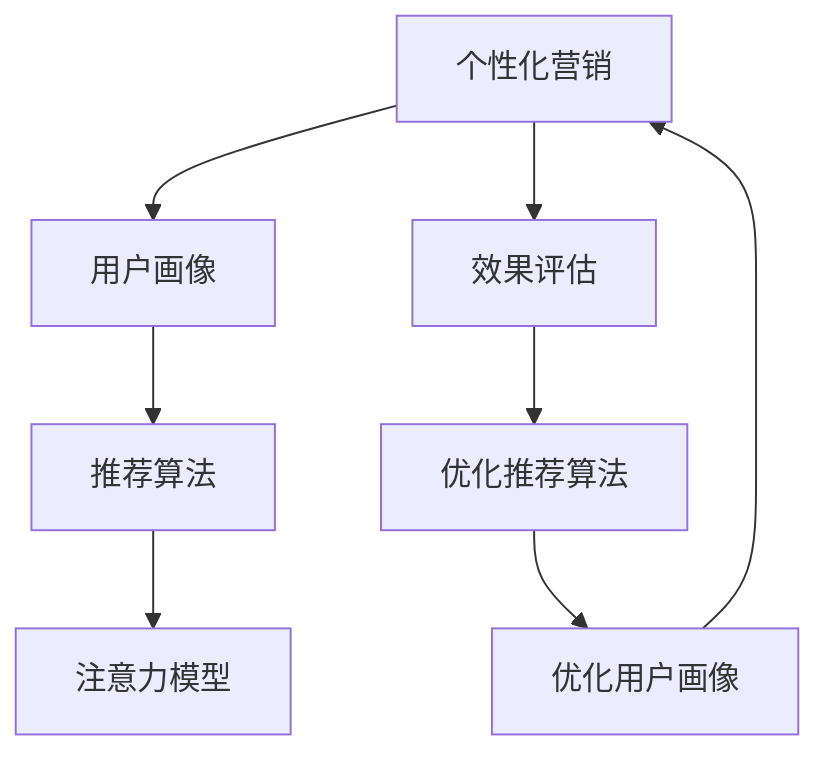

                 

# 注意力经济与个性化营销：如何针对受众定制你的信息

> 关键词：注意力经济,个性化营销,受众定制,推荐算法,广告投放,信息筛选

## 1. 背景介绍

### 1.1 问题由来

在数字化时代，信息爆炸和注意力稀缺的矛盾日益突出。以“注意力”为核心的新型经济形式，即注意力经济（Attention Economy），正在取代传统的“资源经济”，成为新一轮经济发展的主导力量。在此背景下，个性化营销（Personalized Marketing）成为了吸引和保持用户注意力的有效手段，是大数据和人工智能时代的重要商业策略。

“注意力经济”的兴起，一方面表现为消费者对信息的筛选和处理能力日益增强，注意力成为稀缺资源；另一方面也表现为商家通过精准营销吸引消费者注意力的需求日益迫切。基于此，本文将探讨如何运用注意力经济原理，通过个性化营销策略实现受众的精确定制，提升信息传播的效果和商业价值。

### 1.2 问题核心关键点

个性化营销的核心在于通过用户行为数据，构建用户画像，并基于画像进行信息定制，最终实现精准的营销推送。这主要包括三个核心环节：

1. **用户画像构建**：通过采集和分析用户的历史行为数据，挖掘用户的兴趣偏好和行为特征。
2. **信息定制推送**：将用户画像作为输入，构建推荐算法，生成个性化的推荐结果，并将其推送给用户。
3. **效果评估反馈**：通过用户的点击、转化等行为反馈，不断优化推荐算法和用户画像。

本文将围绕以上核心环节，详细介绍个性化营销的原理、算法和实现步骤。

## 2. 核心概念与联系

### 2.1 核心概念概述

为更好地理解个性化营销的原理，本节将介绍几个密切相关的核心概念：

- **个性化营销**：通过分析用户行为数据，构建用户画像，基于画像进行信息定制，最终实现精准营销推送的过程。
- **用户画像**：基于用户的历史行为数据，构建的用户兴趣偏好、行为特征的描述。
- **推荐算法**：通过分析用户画像，生成个性化的推荐结果的算法，如协同过滤、基于内容的推荐等。
- **注意力模型**：分析用户对信息注意力的模型，用于评估用户对推荐内容的兴趣程度。
- **效果评估**：通过用户的点击、转化等行为反馈，评估个性化营销的效果，优化推荐算法和用户画像。

这些核心概念之间的逻辑关系可以通过以下Mermaid流程图来展示：



这个流程图展示了个性化营销的核心概念及其之间的关系：

1. 个性化营销基于用户画像进行信息定制和推送。
2. 用户画像通过历史行为数据构建，包含用户的兴趣偏好和行为特征。
3. 推荐算法将用户画像作为输入，生成个性化推荐结果。
4. 注意力模型分析用户对推荐内容的兴趣程度。
5. 效果评估通过用户行为反馈，优化推荐算法和用户画像。

这些概念共同构成了个性化营销的核心框架，使其能够针对不同用户提供精准、有效的信息定制。

## 3. 核心算法原理 & 具体操作步骤
### 3.1 算法原理概述

个性化营销的算法原理，可以归纳为以下几个关键步骤：

1. **用户画像构建**：通过分析用户的历史行为数据，提取用户的兴趣偏好和行为特征，构建用户画像。
2. **推荐算法生成**：基于用户画像，使用推荐算法生成个性化的推荐结果。
3. **注意力模型评估**：通过分析用户对推荐内容的交互行为，评估用户的注意力程度，优化推荐算法。
4. **效果评估反馈**：通过用户的点击、转化等行为反馈，评估个性化营销的效果，优化用户画像和推荐算法。

这些步骤构成了一个闭环的系统，使得个性化营销能够不断迭代，提升信息定制的精准度和效果。

### 3.2 算法步骤详解

以下详细介绍个性化营销的具体算法步骤：

**Step 1: 用户画像构建**

用户画像的构建需要多维度的数据支持，包括但不限于用户的浏览历史、购买记录、搜索关键词等。构建过程可以分为以下几个子步骤：

1. **数据收集**：通过Web页面跟踪、购买记录等途径收集用户的行为数据。
2. **特征提取**：对收集到的数据进行清洗和预处理，提取有价值的行为特征。
3. **画像建模**：使用机器学习算法，如聚类、分类等，构建用户画像模型。

以浏览历史为例，可以使用协同过滤算法对用户的浏览行为进行聚类，找到相似用户群体，从而推测该用户的兴趣偏好。

**Step 2: 推荐算法生成**

推荐算法是个性化营销的核心。常见的推荐算法包括协同过滤、基于内容的推荐、混合推荐等。协同过滤算法通过分析用户的历史行为数据，找到兴趣相似的用户群体，并推荐相似用户喜欢的内容。基于内容的推荐算法则通过分析物品的特征，推荐与用户兴趣匹配的物品。混合推荐算法则是将不同推荐算法的优点结合起来，生成更加精确的推荐结果。

**Step 3: 注意力模型评估**

注意力模型用于评估用户对推荐内容的兴趣程度。常见的注意力模型包括TF-IDF、BERT、用户兴趣模型等。这些模型通过分析用户对内容的交互行为，计算用户对每个内容的注意力权重，从而优化推荐算法。

**Step 4: 效果评估反馈**

效果评估是不断优化推荐算法和用户画像的关键步骤。通过分析用户的点击、转化等行为反馈，评估个性化营销的效果，从而调整推荐算法和用户画像，提升推荐效果。

### 3.3 算法优缺点

个性化营销的算法具有以下优点：

1. **提升用户体验**：通过精准的推荐，满足用户个性化需求，提升用户满意度。
2. **增加商业价值**：精准的推荐能够有效提升点击率、转化率等关键指标，增加商家收益。
3. **数据驱动优化**：通过用户行为数据，不断优化推荐算法和用户画像，提升信息定制的精准度。

但同时也存在一些缺点：

1. **隐私风险**：用户画像的构建需要大量敏感数据，存在隐私泄露的风险。
2. **数据偏差**：用户画像和推荐算法的构建依赖于数据质量，存在数据偏差的问题。
3. **算法复杂性**：推荐算法和注意力模型的设计复杂，需要较强的技术背景。

尽管存在这些缺点，但个性化营销仍然是一种高效、精准的信息定制手段，值得广泛应用。

### 3.4 算法应用领域

个性化营销的应用领域非常广泛，涵盖了电商、社交、内容推荐等多个行业。具体应用场景包括：

- **电商推荐系统**：基于用户的浏览历史、购买记录，推荐相似商品。
- **社交网络内容推荐**：根据用户的历史互动行为，推荐相关内容。
- **视频网站推荐系统**：根据用户的观看历史和评分数据，推荐相似视频。

此外，个性化营销在广告投放、在线教育、健康医疗等领域也有着广泛的应用前景。

## 4. 数学模型和公式 & 详细讲解 & 举例说明

### 4.1 数学模型构建

个性化营销的数学模型，可以归纳为以下几个关键部分：

1. **用户画像模型**：通过历史行为数据，构建用户画像，描述用户的兴趣偏好和行为特征。
2. **推荐算法模型**：根据用户画像，使用推荐算法生成个性化推荐结果。
3. **注意力模型**：分析用户对推荐内容的注意力程度，评估推荐效果。

### 4.2 公式推导过程

以下以协同过滤算法为例，详细介绍推荐算法模型的公式推导过程。

协同过滤算法的基本思想是通过分析用户的历史行为数据，找到兴趣相似的用户群体，从而推荐相似用户喜欢的内容。假设用户集为 $U$，物品集为 $I$，用户对物品的评分矩阵为 $R \in \mathbb{R}^{m \times n}$，其中 $m$ 为用户数，$n$ 为物品数。协同过滤算法的目标是通过用户行为数据，找到用户间的相似度，从而推荐相似用户喜欢的物品。

协同过滤算法有两种形式：基于用户的协同过滤和基于物品的协同过滤。

**基于用户的协同过滤**：

$$
\hat{R}_{ui} = \frac{1}{\sum_{j=1}^{n} a_{uj}} \sum_{j=1}^{n} a_{uj} r_{uj}
$$

其中，$r_{uj}$ 表示用户 $u$ 对物品 $j$ 的评分，$a_{uj}$ 表示用户 $u$ 对物品 $j$ 的兴趣程度，$\hat{R}_{ui}$ 表示用户 $u$ 对物品 $i$ 的预测评分。

**基于物品的协同过滤**：

$$
\hat{R}_{ui} = \frac{1}{\sum_{j=1}^{m} b_{ij}} \sum_{j=1}^{m} b_{ij} r_{ij}
$$

其中，$r_{ij}$ 表示物品 $i$ 对用户 $j$ 的评分，$b_{ij}$ 表示物品 $i$ 对用户 $j$ 的兴趣程度，$\hat{R}_{ui}$ 表示用户 $u$ 对物品 $i$ 的预测评分。

### 4.3 案例分析与讲解

以Amazon网站为例，分析如何通过协同过滤算法实现个性化推荐。Amazon使用基于用户的协同过滤算法，构建用户画像，并基于画像生成个性化推荐结果。具体步骤如下：

1. **数据收集**：收集用户的历史浏览、购买记录等行为数据。
2. **特征提取**：将用户行为数据转化为用户对物品的评分矩阵 $R$。
3. **相似度计算**：计算用户间的相似度，找到兴趣相似的用户群体。
4. **推荐生成**：根据相似度计算结果，推荐相似用户喜欢的物品。

通过这样的流程，Amazon能够实现基于用户兴趣的个性化推荐，提升用户的购物体验和转化率。

## 5. 项目实践：代码实例和详细解释说明

### 5.1 开发环境搭建

在进行个性化营销的实践前，我们需要准备好开发环境。以下是使用Python进行PyTorch开发的环境配置流程：

1. 安装Anaconda：从官网下载并安装Anaconda，用于创建独立的Python环境。

2. 创建并激活虚拟环境：
```bash
conda create -n pytorch-env python=3.8 
conda activate pytorch-env
```

3. 安装PyTorch：根据CUDA版本，从官网获取对应的安装命令。例如：
```bash
conda install pytorch torchvision torchaudio cudatoolkit=11.1 -c pytorch -c conda-forge
```

4. 安装推荐系统相关的库：
```bash
pip install pandas scikit-learn scipy matplotlib numpy
```

5. 安装数据处理库：
```bash
pip install tqdm fastparquet fastcsv
```

6. 安装PyTorch相关的库：
```bash
pip install torchtext
```

完成上述步骤后，即可在`pytorch-env`环境中开始个性化营销的实践。

### 5.2 源代码详细实现

以下是使用PyTorch实现基于协同过滤算法的个性化推荐系统的代码实现。

首先，定义协同过滤算法的推荐函数：

```python
import torch
import torch.nn as nn
import torchtext.data as data
import torchtext.vocab as vocab

# 定义协同过滤算法
class CollaborativeFiltering(nn.Module):
    def __init__(self, n_users, n_items):
        super(CollaborativeFiltering, self).__init__()
        self.u2i = nn.Embedding(n_users, 128)
        self.i2u = nn.Embedding(n_items, 128)
        self.fc1 = nn.Linear(128, 128)
        self.fc2 = nn.Linear(128, n_items)
        self.dropout = nn.Dropout(0.2)
        
    def forward(self, u, i):
        u = self.u2i(u)
        i = self.i2i(i)
        x = torch.matmul(u, i.t())
        x = self.fc1(x)
        x = self.dropout(x)
        x = torch.sigmoid(self.fc2(x))
        return x
```

然后，定义数据集和模型训练函数：

```python
# 定义数据集
class MovieLensData(data.Dataset):
    def __init__(self, data_path):
        self.data_path = data_path
        self.data = fastparquet.read_parquet(self.data_path)
        
    def __getitem__(self, index):
        return self.data.iloc[index]
        
    def __len__(self):
        return len(self.data)
        
# 定义训练函数
def train_model(model, train_loader, device, optimizer, criterion, num_epochs):
    model.train()
    for epoch in range(num_epochs):
        for u, i, r in train_loader:
            u = u.to(device)
            i = i.to(device)
            r = r.to(device)
            pred = model(u, i)
            loss = criterion(pred, r)
            optimizer.zero_grad()
            loss.backward()
            optimizer.step()
```

最后，启动模型训练和评估：

```python
# 设置训练参数
n_users = 1000
n_items = 1000
batch_size = 128
num_epochs = 10
learning_rate = 0.001
device = torch.device('cuda' if torch.cuda.is_available() else 'cpu')

# 加载数据集
train_data = MovieLensData('train.csv')
test_data = MovieLensData('test.csv')
train_loader = data.DataLoader(train_data, batch_size=batch_size, shuffle=True)
test_loader = data.DataLoader(test_data, batch_size=batch_size, shuffle=False)

# 初始化模型和优化器
model = CollaborativeFiltering(n_users, n_items).to(device)
optimizer = torch.optim.Adam(model.parameters(), lr=learning_rate)
criterion = nn.BCELoss()

# 训练模型
train_model(model, train_loader, device, optimizer, criterion, num_epochs)

# 评估模型
model.eval()
with torch.no_grad():
    correct = 0
    total = 0
    for u, i, r in test_loader:
        u = u.to(device)
        i = i.to(device)
        r = r.to(device)
        pred = model(u, i)
        total += r.shape[0]
        correct += torch.sum((pred >= 0.5).float() * (r == 1).float())
    print(f'Test Accuracy: {correct / total * 100:.2f}%')
```

以上就是使用PyTorch实现基于协同过滤算法的个性化推荐系统的完整代码实现。可以看到，通过简单的代码实现，我们就能够构建一个基础的个性化推荐系统。

### 5.3 代码解读与分析

让我们再详细解读一下关键代码的实现细节：

**MovieLensData类**：
- `__init__`方法：初始化数据集，读取数据文件。
- `__getitem__`方法：返回单个样本。
- `__len__`方法：返回数据集大小。

**train_model函数**：
- 在每个epoch内，对数据集进行迭代训练。
- 前向传播计算预测值和损失。
- 反向传播更新模型参数。

**训练流程**：
- 定义模型和训练参数。
- 加载数据集，构建数据加载器。
- 初始化模型和优化器。
- 调用训练函数，进行模型训练。
- 在测试集上评估模型效果。

可以看到，PyTorch框架使得个性化推荐系统的开发变得简洁高效，开发者可以更加关注算法的核心逻辑和业务需求的实现。

## 6. 实际应用场景

### 6.1 电商平台推荐

电商平台如淘宝、京东等，通过个性化推荐系统，能够提升用户体验，增加销售额。具体而言，电商平台可以收集用户的历史浏览、购买、评价等行为数据，基于协同过滤算法构建用户画像，并根据画像生成个性化推荐结果。通过分析用户的点击、转化等行为反馈，不断优化推荐算法和用户画像，提升推荐效果。

### 6.2 视频网站推荐

视频网站如Netflix、YouTube等，通过个性化推荐系统，能够增加用户黏性，提升用户留存率。视频网站可以分析用户的历史观看记录、评分、搜索行为等数据，基于协同过滤算法和深度学习模型构建用户画像，并根据画像生成个性化推荐结果。通过用户的点击、播放等行为反馈，不断优化推荐算法和用户画像，提升推荐效果。

### 6.3 社交网络内容推荐

社交网络如Facebook、微博等，通过个性化推荐系统，能够提升用户互动，增加平台活跃度。社交网络可以分析用户的历史互动行为、兴趣标签、好友关系等数据，基于协同过滤算法和深度学习模型构建用户画像，并根据画像生成个性化内容推荐。通过用户的点赞、评论等行为反馈，不断优化推荐算法和用户画像，提升推荐效果。

## 7. 工具和资源推荐

### 7.1 学习资源推荐

为了帮助开发者系统掌握个性化营销的理论基础和实践技巧，这里推荐一些优质的学习资源：

1. 《推荐系统实践》一书：详细介绍了推荐系统的发展历程、理论基础和实践技巧，是推荐系统的入门必读。
2. Coursera《推荐系统》课程：斯坦福大学开设的推荐系统课程，涵盖推荐系统的基础理论和多种算法。
3. Kaggle推荐系统竞赛：通过参加Kaggle竞赛，可以实践推荐算法的实现和优化。
4. 《深度学习与推荐系统》书籍：介绍了深度学习在推荐系统中的应用，涵盖了协同过滤、矩阵分解等核心算法。
5. 《个性化推荐系统》一书：系统介绍了个性化推荐系统的构建流程和优化方法，包括推荐算法、效果评估等。

通过对这些资源的学习实践，相信你一定能够快速掌握个性化营销的精髓，并用于解决实际的推荐问题。

### 7.2 开发工具推荐

高效的开发离不开优秀的工具支持。以下是几款用于个性化推荐系统开发的常用工具：

1. PyTorch：基于Python的开源深度学习框架，灵活动态的计算图，适合快速迭代研究。
2. TensorFlow：由Google主导开发的开源深度学习框架，生产部署方便，适合大规模工程应用。
3. Spark MLlib：Apache Spark的机器学习库，支持大规模数据处理和分布式计算。
4. Scikit-learn：Python的机器学习库，提供了丰富的机器学习算法和工具。
5. Pandas：Python的数据处理库，支持数据的读写、清洗、分析等操作。

合理利用这些工具，可以显著提升个性化推荐系统的开发效率，加快创新迭代的步伐。

### 7.3 相关论文推荐

个性化推荐系统的发展源于学界的持续研究。以下是几篇奠基性的相关论文，推荐阅读：

1. "Collaborative Filtering for Implicit Feedback Datasets"（Dellinger等人，2007年）：介绍了协同过滤算法在推荐系统中的应用，并提出了基于矩阵分解的推荐方法。
2. "Factorization Machines"（Rendle等人，2010年）：提出了因子分解机模型，在推荐系统中取得了较好的效果。
3. "Deep Neural Networks for YouTube Recommendations"（Zhou等人，2016年）：展示了深度学习在推荐系统中的应用，提升了推荐系统的性能。
4. "Neural Collaborative Filtering"（He等人，2017年）：提出了基于深度学习的推荐模型，通过多层次特征提取，提升了推荐效果。
5. "Embedded Collaborative Filtering"（Chen等人，2018年）：结合了协同过滤和深度学习的优点，提升了推荐系统的鲁棒性和泛化能力。

这些论文代表了个性化推荐系统的发展脉络。通过学习这些前沿成果，可以帮助研究者把握学科前进方向，激发更多的创新灵感。

## 8. 总结：未来发展趋势与挑战

### 8.1 总结

本文对个性化营销的原理、算法和实现步骤进行了全面系统的介绍。首先阐述了个性化营销的发展背景和意义，明确了其在大数据和人工智能时代的价值。其次，从原理到实践，详细讲解了个性化营销的数学模型和关键步骤，给出了推荐系统的代码实现。同时，本文还探讨了个性化营销在电商、视频、社交等多个领域的应用前景，展示了其广泛的应用潜力。

通过本文的系统梳理，可以看到，个性化营销通过分析用户行为数据，构建用户画像，实现信息定制，是一种高效、精准的商业策略。未来，伴随技术的发展和应用的深化，个性化营销必将在更多领域发挥重要作用，进一步提升信息传播的精准度和商业价值。

### 8.2 未来发展趋势

展望未来，个性化营销将呈现以下几个发展趋势：

1. **多模态融合**：除了文本和行为数据外，未来还将融合图像、音频等多种模态数据，提升推荐系统的感知能力和泛化能力。
2. **深度学习普及**：深度学习技术将在个性化推荐中得到更广泛的应用，提升推荐算法的表现力。
3. **联邦学习**：通过联邦学习技术，保护用户隐私，同时实现跨设备、跨平台的数据共享和推荐模型优化。
4. **因果推断**：引入因果推断方法，更准确地评估推荐效果，并优化推荐算法。
5. **跨领域迁移**：通过迁移学习技术，将一个领域的推荐模型应用于另一个领域，提升模型的通用性和鲁棒性。

这些趋势凸显了个性化营销技术的广阔前景，使得其在电商、内容推荐、社交等多个领域具有更强的适应性和应用潜力。

### 8.3 面临的挑战

尽管个性化推荐系统已经取得了显著的进展，但在迈向更加智能化、普适化应用的过程中，它仍面临诸多挑战：

1. **数据隐私**：个性化推荐系统需要收集和分析用户数据，存在隐私泄露的风险。如何保护用户隐私，同时利用数据提升推荐效果，是一大难题。
2. **数据稀疏**：用户数据往往存在稀疏性，如何处理数据稀疏问题，提升推荐模型的泛化能力，仍需深入研究。
3. **算法复杂性**：推荐算法的设计和优化需要较强的技术背景，如何简化算法，提高其实现效率，是一大挑战。
4. **模型鲁棒性**：推荐模型在面对噪声数据和异常情况时，容易产生错误推荐，如何提高模型鲁棒性，保证推荐结果的准确性，是一大难点。
5. **公平性**：推荐模型容易产生偏见，导致不公平的推荐结果，如何保证推荐算法的公平性，是一大挑战。

这些挑战凸显了个性化推荐系统在实际应用中的复杂性和技术难度，需要在多方面进行深入研究。

### 8.4 研究展望

为了应对这些挑战，未来的研究需要在以下几个方面寻求新的突破：

1. **隐私保护技术**：开发更为安全的隐私保护技术，如差分隐私、同态加密等，保护用户隐私的同时，提升推荐系统的性能。
2. **数据增强方法**：通过数据增强技术，如数据合成、对抗样本生成等，提升推荐系统的泛化能力，处理数据稀疏问题。
3. **算法简化优化**：开发更为简单的推荐算法，如近似协同过滤算法、基于图的网络算法等，提高算法的实现效率和可解释性。
4. **模型公平性**：引入公平性约束，如算法对抗训练、公平性损失函数等，保证推荐算法的公平性和公正性。
5. **多任务学习**：将推荐系统与其它任务结合，如情感分析、知识图谱等，提升推荐模型的表现力和应用范围。

这些研究方向的探索，必将引领个性化推荐系统技术迈向更高的台阶，为构建智能推荐系统提供更多的技术支撑。面向未来，个性化推荐系统需要与其他人工智能技术进行更深入的融合，如自然语言处理、知识表示、强化学习等，多路径协同发力，共同推动推荐系统的进步。

## 9. 附录：常见问题与解答

**Q1：什么是个性化营销？**

A: 个性化营销是指通过分析用户行为数据，构建用户画像，并基于画像进行信息定制，最终实现精准的营销推送的过程。其核心在于提升用户体验和商家收益。

**Q2：个性化推荐算法有哪些？**

A: 常见的个性化推荐算法包括协同过滤、基于内容的推荐、混合推荐等。协同过滤算法通过分析用户的历史行为数据，找到兴趣相似的用户群体，从而推荐相似用户喜欢的内容。基于内容的推荐算法则通过分析物品的特征，推荐与用户兴趣匹配的物品。混合推荐算法则是将不同推荐算法的优点结合起来，生成更加精确的推荐结果。

**Q3：个性化营销的数学模型有哪些？**

A: 个性化营销的数学模型包括用户画像模型、推荐算法模型和注意力模型。用户画像模型通过历史行为数据，构建用户兴趣偏好和行为特征的描述。推荐算法模型通过用户画像，使用推荐算法生成个性化推荐结果。注意力模型分析用户对推荐内容的注意力程度，评估推荐效果。

**Q4：如何处理数据稀疏问题？**

A: 数据稀疏是推荐系统中的一个常见问题。处理数据稀疏问题的方法包括：

1. 数据合成：通过合成新的用户-物品对，增加训练数据的数量，提升模型的泛化能力。
2. 数据增强：如对抗样本生成、噪声注入等，增加训练数据的丰富性。
3. 矩阵分解：如SVD、PCA等，通过矩阵分解技术，减少数据稀疏的影响。
4. 深度学习：通过深度神经网络，利用丰富的特征表示，提升推荐模型的泛化能力。

**Q5：如何保证个性化推荐算法的公平性？**

A: 保证个性化推荐算法的公平性可以从以下几个方面入手：

1. 数据预处理：对用户数据进行标准化处理，减少偏见。
2. 模型训练：在训练过程中引入公平性约束，如算法对抗训练、公平性损失函数等。
3. 结果评估：在推荐结果评估过程中引入公平性指标，如多样性、覆盖率等。
4. 人工干预：通过人工干预和审核，确保推荐结果的公正性。

通过这些方法，可以提升个性化推荐算法的公平性和公正性，保障用户的权益。

---

作者：禅与计算机程序设计艺术 / Zen and the Art of Computer Programming

