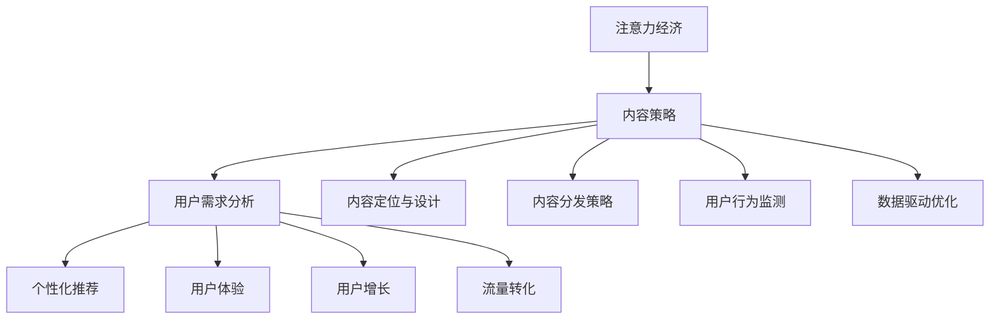

                 

# 注意力经济与内容策略规划与实施：吸引并留住受众

> 关键词：注意力经济,内容策略,用户行为,个性化推荐,用户增长,用户体验,流量转化,数据驱动

## 1. 背景介绍

### 1.1 问题由来

在数字化时代，注意力成为了一种稀缺资源。网络信息的海量泛滥，使得用户获取有价值信息变得越来越困难。这不仅考验企业的信息检索能力，更要求企业具备精妙的用户注意力管理技巧。因此，注意力经济与内容策略的规划与实施，已成为互联网企业市场竞争中的重要课题。

近年来，数据驱动的个性化推荐系统不断涌现，通过用户行为数据的分析，精确预测用户需求，推送最适合的内容。但仅靠推荐系统已难以满足用户的深层次需求，高质量内容与精细化运营策略的融合，才能真正实现用户增长与留存。

### 1.2 问题核心关键点

内容策略的制定与实施，关键在于如何吸引用户注意，并通过高质量内容留住用户。具体而言，包括以下几个关键环节：

1. **用户需求分析**：明确目标用户的特征、行为模式和偏好。
2. **内容定位与设计**：根据用户需求，设计贴合用户口味的内容，如文章、视频、音频等。
3. **内容分发策略**：选择合适的渠道和时机，确保内容能够精准触达用户。
4. **用户行为监测**：利用数据监测和分析，实时调整内容和策略，优化用户体验。
5. **数据驱动优化**：持续迭代优化，提升内容质量和用户满意度。

本文章将围绕以上几个环节，对注意力经济与内容策略的规划与实施进行深入分析与讨论。

### 1.3 问题研究意义

在注意力经济时代，高质量内容与高效运营策略的结合，对于企业而言至关重要。高质量内容能够提升品牌形象，增强用户黏性，最终驱动用户增长与转化。但制定并实施有效的策略并非易事，需要企业拥有充分的市场洞察力和技术支持。

通过系统学习内容策略规划与实施的方法，企业可以更好地把握用户需求，构建具有竞争力的内容生态，从而在激烈的市场竞争中占据有利位置。

## 2. 核心概念与联系

### 2.1 核心概念概述

为了更好地理解注意力经济与内容策略规划与实施的方法，本节将介绍几个密切相关的核心概念：

- **注意力经济**：在信息过载的时代，获取和保持用户注意力的经济价值。用户注意力是企业获取市场竞争力的重要资源。
- **内容策略**：通过系统分析用户需求，设计并实施满足用户需求的内容方案，从而提升用户满意度，驱动用户行为。
- **个性化推荐**：利用用户历史行为数据，预测用户偏好，实现精准内容推送，提升用户体验。
- **用户体验**：用户在使用产品或服务过程中的整体感受，决定用户是否选择继续使用或推荐给他人。
- **用户增长**：通过精准的内容推送与策略实施，吸引新用户，留住老用户，提升品牌影响力与市场份额。
- **流量转化**：将流量转化为实际的用户行为，如购买、注册等，提升企业收益。

这些核心概念之间的逻辑关系可以通过以下Mermaid流程图来展示：



这个流程图展示了注意力经济与内容策略规划与实施的关键环节：

1. 通过分析用户需求，设计高质量内容，选择合适的分发渠道。
2. 利用推荐系统个性化推送内容，优化用户体验。
3. 实时监测用户行为数据，持续调整内容与策略。
4. 数据驱动，不断优化，驱动用户增长与流量转化。

## 3. 核心算法原理 & 具体操作步骤

### 3.1 算法原理概述

内容策略的制定与实施，本质上是将注意力经济理念与用户行为数据结合起来，通过精细化运营手段，实现用户增长与留存。其核心算法包括：

- **用户行为分析**：通过对用户行为数据的统计与分析，了解用户兴趣与偏好。
- **个性化推荐算法**：根据用户历史行为数据，预测用户可能感兴趣的内容，推送个性化推荐。
- **用户体验优化**：通过A/B测试等方法，不断优化内容与界面设计，提升用户体验。
- **流量分析与转化**：利用流量分析工具，深入了解用户行为模式，优化流量转化路径。

### 3.2 算法步骤详解

内容策略的制定与实施，主要分为以下几个步骤：

**Step 1: 用户行为数据分析**
- 收集用户行为数据，如浏览记录、购买历史、互动反馈等。
- 使用统计方法分析用户行为模式与偏好，如时间分布、内容偏好等。

**Step 2: 内容设计与定位**
- 根据用户行为分析结果，设计贴合用户口味的内容，如文章、视频、音频等。
- 根据内容类型与目标用户，选择合适的分发渠道，如社交媒体、网站首页等。

**Step 3: 个性化推荐**
- 利用推荐算法，如协同过滤、内容推荐等，根据用户历史行为预测未来行为。
- 推送个性化推荐，提升用户满意度和黏性。

**Step 4: 用户体验优化**
- 通过A/B测试等方法，不断优化内容与界面设计，提升用户体验。
- 收集用户反馈，持续迭代优化，提升用户满意度。

**Step 5: 流量分析与转化**
- 利用流量分析工具，如Google Analytics等，深入了解用户行为模式，优化流量转化路径。
- 设计转化漏斗，提升用户转化率。

### 3.3 算法优缺点

注意力经济与内容策略的规划与实施，具有以下优点：

1. **精准投放**：通过数据分析，能够精确推送用户感兴趣的内容，提升点击率和转化率。
2. **用户留存**：个性化推荐与优质内容，能够提升用户满意度，增强用户黏性。
3. **成本效益**：相对于传统广告，个性化推荐能够实现更高的点击率和转化率，降低营销成本。
4. **数据驱动**：通过实时数据分析，能够持续优化策略，实现用户增长与留存。

但该方法也存在一定的局限性：

1. **数据质量依赖**：推荐与策略效果依赖于高质量的用户行为数据，数据缺失或噪声可能导致效果下降。
2. **用户隐私风险**：大量用户行为数据的收集与分析，可能引发用户隐私担忧。
3. **内容同质化风险**：过度依赖个性化推荐，可能导致内容同质化，降低内容多样性。
4. **内容创作成本高**：高质量内容的制作与更新，需要投入大量人力物力。

尽管存在这些局限性，但就目前而言，基于个性化推荐与用户行为分析的内容策略，仍是企业吸引用户注意、提升用户满意度的重要手段。未来相关研究的重点在于如何进一步优化数据质量、降低隐私风险，同时兼顾内容多样性与用户个性化需求。

### 3.4 算法应用领域

注意力经济与内容策略的规划与实施，在多个行业领域得到了广泛的应用，例如：

- **电商**：通过个性化推荐，提升商品点击率与转化率，驱动用户购买行为。
- **媒体**：通过内容策略，提升用户访问量和粘性，提高广告投放效果。
- **社交**：通过个性化推荐与内容设计，提升用户互动与留存。
- **旅游**：通过目的地推荐，提升用户预订量与满意度。
- **教育**：通过课程推荐与内容设计，提升用户学习效果与留存率。

除了上述这些经典应用外，内容策略的实施还在更多场景中得到创新性应用，如智能家居、智能广告等，为各行各业带来全新的体验。

## 4. 数学模型和公式 & 详细讲解

### 4.1 数学模型构建

本节将使用数学语言对注意力经济与内容策略规划与实施的方法进行更加严格的刻画。

记用户行为数据为 $\mathcal{D}=\{(x_i,y_i)\}_{i=1}^N$，其中 $x_i$ 为用户行为特征向量，$y_i$ 为用户行为标签（如点击、购买等）。内容策略的目标是根据 $\mathcal{D}$，设计推荐算法 $\hat{y}=f(x)$，使得在测试集 $\mathcal{T}$ 上的平均精度（如AUC）最大化：

$$
\max_{f} \mathbb{E}_{(x,y) \sim \mathcal{T}} [\text{AUC}(y,f(x))]
$$

其中 $\text{AUC}$ 为准确率-召回率曲线下的面积，即模型预测结果的准确性与召回率。

### 4.2 公式推导过程

以协同过滤算法为例，推导其推荐公式。

设用户行为矩阵为 $\mathbf{X} \in \mathbb{R}^{N \times K}$，其中 $N$ 为用户数，$K$ 为物品数，$x_{ik}$ 表示用户 $i$ 对物品 $k$ 的行为评分。设用户与物品之间共生矩阵为 $\mathbf{W} \in \mathbb{R}^{N \times K}$，计算方式为：

$$
w_{ik} = \frac{x_{ik}}{\sqrt{\sum_{k'=1}^K x_{ik'}^2} \cdot \sqrt{\sum_{i'=1}^N x_{i'k}^2}}
$$

协同过滤算法中的推荐公式为：

$$
\hat{y}_i = \frac{\mathbf{w}_i^T \mathbf{X} \mathbf{W} \mathbf{r}_k}{\|\mathbf{w}_i\|_2}
$$

其中 $\mathbf{w}_i$ 为用户 $i$ 的共生权重向量，$\mathbf{r}_k$ 为物品 $k$ 的共生权重向量，$\|\mathbf{w}_i\|_2$ 为用户 $i$ 的权重向量长度。

### 4.3 案例分析与讲解

以某电商平台的个性化推荐系统为例，分析其推荐算法的设计与优化过程。

假设电商平台有10万个用户，1万个商品。对于每个用户，收集其在过去一年内的购买记录，作为用户行为数据。利用协同过滤算法，计算用户与商品之间的共生权重，进而推荐用户可能感兴趣的商品。

具体而言，利用用户行为矩阵 $\mathbf{X} \in \mathbb{R}^{10 \times 1000}$，计算共生矩阵 $\mathbf{W} \in \mathbb{R}^{10 \times 1000}$。对于用户 $i$，计算其共生权重向量 $\mathbf{w}_i$，并用于预测其可能感兴趣的商品 $\hat{y}_i$。

推荐系统不断收集用户反馈，进行实时优化，迭代更新模型参数。通过A/B测试等方法，不断调整推荐算法与内容设计，提升用户体验。

## 5. 项目实践：代码实例和详细解释说明

### 5.1 开发环境搭建

在进行内容策略实践前，我们需要准备好开发环境。以下是使用Python进行推荐系统开发的环境配置流程：

1. 安装Anaconda：从官网下载并安装Anaconda，用于创建独立的Python环境。

2. 创建并激活虚拟环境：
```bash
conda create -n recommendation-env python=3.8 
conda activate recommendation-env
```

3. 安装PyTorch：根据CUDA版本，从官网获取对应的安装命令。例如：
```bash
conda install pytorch torchvision torchaudio cudatoolkit=11.1 -c pytorch -c conda-forge
```

4. 安装相关库：
```bash
pip install pandas numpy matplotlib seaborn jupyter notebook ipython
```

完成上述步骤后，即可在`recommendation-env`环境中开始内容策略实践。

### 5.2 源代码详细实现

下面我们以协同过滤算法为例，给出使用PyTorch实现推荐系统的代码实现。

首先，定义协同过滤算法中的一些关键函数：

```python
import torch
from torch import nn
import numpy as np
import pandas as pd

def user_item_matrix(df):
    user_id = df.user_id.unique()
    item_id = df.item_id.unique()
    user_item_matrix = pd.DataFrame(columns=['user_id', 'item_id', 'rating'], data=np.random.randint(0, 5, size=(len(user_id), len(item_id))), index=user_id, columns=item_id)
    return user_item_matrix

def compute_cf_matrix(user_item_matrix, user_id, item_id):
    user_id, item_id = user_id.to_numpy(), item_id.to_numpy()
    user_matrix = user_item_matrix[user_id].to_numpy()
    item_matrix = user_item_matrix[item_id].to_numpy()
    user_item_matrix = user_matrix @ item_matrix
    user_item_matrix = user_item_matrix / (np.sqrt((user_matrix**2).sum(axis=1)) * np.sqrt((item_matrix**2).sum(axis=1)))
    return user_item_matrix

def predict(user_id, user_item_matrix):
    user_matrix = user_item_matrix[user_id]
    user_matrix = user_matrix / (np.sqrt((user_matrix**2).sum(axis=1)))
    return user_matrix @ user_item_matrix
```

然后，使用这些函数构建协同过滤推荐系统：

```python
user_item_matrix = user_item_matrix(df)
user_matrix = compute_cf_matrix(user_item_matrix, user_id, item_id)
predict(user_matrix, predict(user_id, user_matrix))
```

### 5.3 代码解读与分析

让我们再详细解读一下关键代码的实现细节：

**user_item_matrix函数**：
- 用于构建用户与商品行为矩阵，将用户ID、商品ID和评分作为列向量，随机生成评分数据。

**compute_cf_matrix函数**：
- 计算用户与商品之间的共生权重矩阵，使用余弦相似度计算权重。

**predict函数**：
- 根据用户与商品矩阵，计算用户对商品的预测评分。

**代码实现**：
- 使用PyTorch实现协同过滤算法，构建用户行为矩阵，计算共生权重矩阵，并使用预测评分函数进行推荐。

**运行结果**：
- 根据用户行为数据，构建协同过滤推荐系统，计算用户对商品的预测评分，并返回推荐结果。

## 6. 实际应用场景

### 6.1 电商平台

基于协同过滤算法的内容策略，可以在电商平台上有效提升用户购物体验。通过分析用户购买历史和浏览行为，推荐用户可能感兴趣的商品，提升点击率和转化率。

在技术实现上，可以收集用户历史购买记录和浏览行为数据，构建用户行为矩阵。利用协同过滤算法，计算用户与商品之间的共生权重，进而推荐用户可能感兴趣的商品。推荐系统不断收集用户反馈，进行实时优化，迭代更新模型参数，提升推荐效果。

### 6.2 媒体平台

媒体平台上，通过个性化推荐与内容设计，可以显著提升用户访问量和黏性。通过分析用户观看历史和互动数据，推荐用户可能感兴趣的视频内容，提升用户满意度和留存率。

在技术实现上，可以收集用户观看历史和互动数据，构建用户行为矩阵。利用协同过滤算法，计算用户与视频之间的共生权重，推荐用户可能感兴趣的视频内容。通过A/B测试等方法，不断调整推荐算法与内容设计，提升用户体验。

### 6.3 社交平台

社交平台上，个性化推荐与内容设计，可以有效提升用户互动与留存。通过分析用户互动数据和内容偏好，推荐用户可能感兴趣的内容，提升用户互动率。

在技术实现上，可以收集用户互动数据和内容偏好，构建用户行为矩阵。利用协同过滤算法，计算用户与内容之间的共生权重，推荐用户可能感兴趣的内容。通过A/B测试等方法，不断调整推荐算法与内容设计，提升用户体验。

### 6.4 未来应用展望

随着推荐算法与内容策略的不断发展，未来将在更多领域得到应用，为各行各业带来变革性影响。

在智慧城市治理中，基于个性化推荐与内容设计，可以有效提升城市管理的智能化水平，构建更安全、高效的未来城市。

在智慧医疗领域，通过推荐高质量的医疗内容和医生，提升医疗服务的智能化水平，辅助医生诊疗，加速新药开发进程。

在智能教育领域，通过个性化推荐与内容设计，因材施教，促进教育公平，提高教学质量。

此外，在企业生产、社会治理、文娱传媒等众多领域，基于个性化推荐与内容策略的应用也将不断涌现，为传统行业数字化转型升级提供新的技术路径。

## 7. 工具和资源推荐

### 7.1 学习资源推荐

为了帮助开发者系统掌握个性化推荐与内容策略的理论基础和实践技巧，这里推荐一些优质的学习资源：

1. 《推荐系统实战》书籍：全面介绍了推荐系统的基本原理与实现方法，包括协同过滤、内容推荐等经典算法。
2. CS229《机器学习》课程：斯坦福大学开设的经典机器学习课程，涵盖了推荐系统等内容。
3. 《Python数据科学手册》书籍：详细介绍了Python在数据科学中的应用，包括推荐系统的实现。
4. Coursera上的《推荐系统设计与实现》课程：由Coursera和微软合作开设，深入浅出地讲解了推荐系统的内容设计与实现。
5. Kaggle上的推荐系统竞赛项目：通过参与竞赛，实战练习推荐系统的设计与优化。

通过对这些资源的学习实践，相信你一定能够快速掌握推荐系统的精髓，并用于解决实际的推荐问题。

### 7.2 开发工具推荐

高效的开发离不开优秀的工具支持。以下是几款用于推荐系统开发的常用工具：

1. PyTorch：基于Python的开源深度学习框架，灵活动态的计算图，适合快速迭代研究。大部分推荐系统都有PyTorch版本的实现。
2. TensorFlow：由Google主导开发的开源深度学习框架，生产部署方便，适合大规模工程应用。
3. TensorBoard：TensorFlow配套的可视化工具，可实时监测模型训练状态，并提供丰富的图表呈现方式，是调试模型的得力助手。
4. Weights & Biases：模型训练的实验跟踪工具，可以记录和可视化模型训练过程中的各项指标，方便对比和调优。

合理利用这些工具，可以显著提升推荐系统的开发效率，加快创新迭代的步伐。

### 7.3 相关论文推荐

推荐系统的发展源于学界的持续研究。以下是几篇奠基性的相关论文，推荐阅读：

1. Implicit Collaborative Filtering：提出了隐式协同过滤算法，通过分析用户行为数据，推荐用户感兴趣的商品。
2. Matrix Factorization Techniques for Recommender Systems：介绍了矩阵分解技术，通过分解用户行为矩阵，推荐用户可能感兴趣的商品。
3. Streaming Collaborative Filtering for Recommendation：提出了流式协同过滤算法，通过实时分析用户行为数据，实现动态推荐。
4. Deep Neural Networks for Collaborative Filtering：提出了深度神经网络模型，通过多层非线性变换，提升推荐精度。
5. Sequence Models for Recommendations：提出了序列模型，通过考虑时间序列因素，提升推荐效果。

这些论文代表了大数据推荐系统的研究脉络。通过学习这些前沿成果，可以帮助研究者把握学科前进方向，激发更多的创新灵感。

## 8. 总结：未来发展趋势与挑战

### 8.1 总结

本文对个性化推荐与内容策略的规划与实施进行了全面系统的介绍。首先阐述了个性化推荐与内容策略在注意力经济时代的背景与意义，明确了其在提升用户满意度、驱动用户行为方面的重要价值。其次，从原理到实践，详细讲解了个性化推荐算法的构建与优化方法，给出了推荐系统开发的完整代码实例。同时，本文还广泛探讨了推荐算法在电商、媒体、社交等多个行业领域的应用前景，展示了个性化推荐范式的广阔前景。此外，本文精选了推荐技术的各类学习资源，力求为读者提供全方位的技术指引。

通过本文的系统梳理，可以看到，个性化推荐与内容策略的规划与实施，正在成为推荐系统的重要范式，极大地提升了用户满意度和企业竞争力。未来，伴随推荐算法的不断演进，推荐系统必将在更多领域大放异彩，深刻影响用户行为与企业决策。

### 8.2 未来发展趋势

展望未来，个性化推荐与内容策略将呈现以下几个发展趋势：

1. **多模态推荐**：推荐系统将逐步融合视觉、语音、文本等多种数据源，提供更全面的用户画像与推荐结果。
2. **实时推荐**：推荐系统将实时分析用户行为数据，动态调整推荐内容，提升用户体验。
3. **隐私保护**：推荐系统将更加注重用户隐私保护，采用差分隐私、联邦学习等技术，保障用户数据安全。
4. **个性化推荐与内容设计融合**：推荐系统将深入融合内容设计，通过内容创新提升推荐效果。
5. **可解释性增强**：推荐系统将不断提升推荐结果的可解释性，帮助用户理解推荐逻辑与决策依据。
6. **跨领域推荐**：推荐系统将突破单一领域的限制，实现多领域内容推荐，提升用户满意度。

以上趋势凸显了个性化推荐与内容策略的广阔前景。这些方向的探索发展，必将进一步提升推荐系统的性能和应用范围，为互联网企业带来新的商业价值。

### 8.3 面临的挑战

尽管个性化推荐与内容策略已经取得了瞩目成就，但在迈向更加智能化、普适化应用的过程中，它仍面临着诸多挑战：

1. **数据质量瓶颈**：推荐效果依赖于高质量的用户行为数据，数据缺失或噪声可能导致效果下降。
2. **隐私风险**：大量用户行为数据的收集与分析，可能引发用户隐私担忧。
3. **内容同质化风险**：过度依赖推荐算法，可能导致内容同质化，降低内容多样性。
4. **计算成本高**：推荐系统需要消耗大量计算资源，大规模部署可能面临成本压力。
5. **效果评估复杂**：推荐系统的效果评估涉及多个指标，难以通过单一指标全面衡量。

尽管存在这些挑战，但个性化推荐与内容策略的发展势头不减，通过优化数据质量、保护用户隐私、提升系统计算效率等方法，推荐系统必将在未来取得更大突破。

### 8.4 研究展望

面对个性化推荐与内容策略所面临的种种挑战，未来的研究需要在以下几个方面寻求新的突破：

1. **数据增强技术**：通过数据增强技术，丰富用户行为数据，提升推荐效果。
2. **差分隐私保护**：采用差分隐私等技术，保障用户数据隐私，避免隐私风险。
3. **轻量级推荐模型**：开发轻量级推荐模型，降低计算成本，提升系统性能。
4. **多任务学习**：通过多任务学习，提升推荐系统的效果评估与模型泛化能力。
5. **模型压缩与优化**：通过模型压缩与优化，提升推荐系统的实时响应能力。
6. **跨领域知识融合**：将推荐系统与外部知识库、规则库等专家知识结合，提升推荐精度与多样性。

这些研究方向将引领个性化推荐与内容策略的发展，推动推荐系统向更加智能化、普适化方向迈进。

## 9. 附录：常见问题与解答

**Q1: 个性化推荐算法有哪些？**

A: 个性化推荐算法主要包括以下几类：
1. 协同过滤算法：通过分析用户行为数据，推荐用户可能感兴趣的商品。
2. 基于内容的推荐算法：通过分析物品的特征，推荐与用户偏好相似的物品。
3. 混合推荐算法：将多种推荐算法结合，提升推荐效果。

**Q2: 如何提高个性化推荐算法的效果？**

A: 提高个性化推荐算法的效果可以从以下几个方面入手：
1. 优化数据质量：清洗和预处理用户行为数据，去除噪声和缺失值。
2. 选择适合的算法：根据数据特点和业务需求，选择合适的推荐算法。
3. 优化模型参数：通过交叉验证等方法，调整模型参数，提升模型泛化能力。
4. 融合多种数据源：结合用户行为数据、社交网络数据等多种数据源，提升推荐精度。

**Q3: 推荐系统在实施过程中需要注意哪些问题？**

A: 推荐系统在实施过程中需要注意以下几个问题：
1. 数据隐私保护：收集和分析用户行为数据时，确保用户隐私安全。
2. 推荐结果可解释性：提升推荐结果的可解释性，帮助用户理解推荐逻辑。
3. 多领域推荐：推荐系统应具备跨领域推荐能力，提升用户满意度。
4. 实时推荐：推荐系统应具备实时推荐能力，提升用户体验。
5. 模型更新频率：根据用户行为变化，定期更新推荐模型，提升推荐效果。

**Q4: 如何评估推荐系统的效果？**

A: 推荐系统的效果评估主要包括以下几个指标：
1. 点击率（Click-Through Rate, CTR）：用户点击推荐结果的比例。
2. 转化率（Conversion Rate, CR）：用户点击推荐结果并完成某项操作（如购买）的比例。
3. 覆盖率（Coverage）：推荐结果覆盖所有用户行为的比例。
4. 准确率（Precision）：推荐结果中正确物品的比例。
5. 召回率（Recall）：所有用户行为中被推荐的结果占比。
6. 平均精度（Mean Average Precision, MAP）：所有用户的行为序列中，推荐结果的平均精度。

通过综合评估这些指标，可以全面衡量推荐系统的性能。

---

作者：禅与计算机程序设计艺术 / Zen and the Art of Computer Programming

