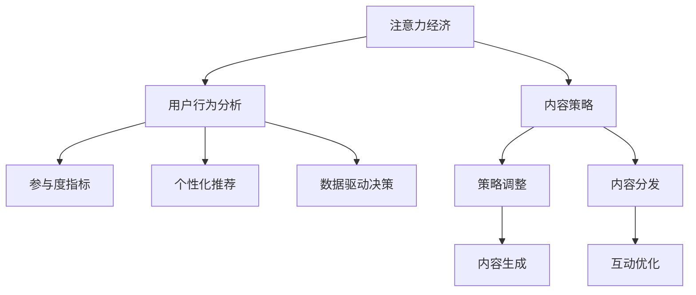

                 

# 注意力经济与内容策略：创建吸引并留住受众的参与内容

> 关键词：注意力经济,内容策略,受众参与,用户行为分析,数字营销

## 1. 背景介绍

### 1.1 问题由来

在信息爆炸的互联网时代，如何吸引并留住受众的注意力，成为各大平台和品牌争相解决的关键问题。尤其是在社交媒体、新闻聚合、内容推荐等数字营销领域，注意力经济更是一大挑战。当前，各大平台普遍采用基于大数据和机器学习的推荐算法，以期通过精准匹配提升用户参与度。然而，传统的推荐算法往往侧重于内容消费，而忽视了用户的长期留存和内容创造。

随着用户行为的多样化和个性化需求的提升，如何在内容和用户之间建立深度互动，实现用户与内容的双向交互，成为新的研究焦点。特别是如何利用注意力经济理论，设计更加互动、有趣、符合用户需求的内容策略，成为推动数字化转型的关键驱动力。

### 1.2 问题核心关键点

注意力经济的核心在于：如何通过内容设计和策略调整，最大化地获取并保持用户的注意力，从而形成长期的互动关系，实现商业价值的转化。本文聚焦于基于用户行为分析和模型驱动的内容策略优化，探讨如何通过智能化的内容生成与推荐，激发用户参与度，实现内容与受众的深度连接。

## 2. 核心概念与联系

### 2.1 核心概念概述

为更好地理解注意力经济与内容策略的实践，本节将介绍几个密切相关的核心概念：

- 注意力经济：指在数字时代，通过最大化用户注意力获取，以实现商业价值最大化的经济模式。注意力经济的核心在于争夺用户的注意焦点，通过精准的内容投放和互动，吸引用户停留并转化。

- 内容策略：指在特定业务目标下，对内容生产、分发、互动进行系统化设计和管理的策略。通过精细化的内容设计，结合数据分析和技术手段，提升内容的吸引力和用户参与度。

- 用户行为分析：指通过对用户在线行为数据的收集和分析，挖掘用户兴趣和需求，以指导内容生产和互动设计。用户行为分析的核心在于利用机器学习和数据挖掘技术，从海量数据中提取有用信息。

- 参与度指标：指衡量用户与内容互动程度的指标，如点击率、分享次数、评论数量等。参与度指标反映出用户对内容的兴趣和满意度，是评估内容策略效果的重要依据。

- 个性化推荐：指根据用户历史行为和兴趣，智能推荐符合用户需求的内容，提升用户参与度。个性化推荐依赖于深度学习模型和大数据分析，能够精准匹配用户需求。

- 数据驱动决策：指在内容策略制定和执行过程中，依赖于数据驱动的决策支持系统，进行科学化、定量化的决策。数据驱动决策的核心在于构建用户行为模型，通过数据分析评估内容策略效果。

这些核心概念之间的逻辑关系可以通过以下Mermaid流程图来展示：



这个流程图展示了大语言模型微调的模型训练过程：

1. 注意力经济通过内容策略吸引用户注意力。
2. 用户行为分析挖掘用户兴趣和需求。
3. 参与度指标评估用户互动效果。
4. 个性化推荐提升用户参与度。
5. 数据驱动决策进行策略优化调整。

这些概念共同构成了内容策略的设计框架，使得内容生产和互动设计可以更加科学、高效。通过理解这些核心概念，我们可以更好地把握内容策略的工作原理和优化方向。

## 3. 核心算法原理 & 具体操作步骤
### 3.1 算法原理概述

基于用户行为分析和模型驱动的内容策略优化，本质上是一个以用户为中心的决策支持系统。其核心思想是：通过收集和分析用户行为数据，构建用户兴趣模型，并在此基础上进行内容生成和互动优化，最大化用户参与度，实现商业价值的转化。

形式化地，假设用户行为数据为 $D=\{(x_i,y_i)\}_{i=1}^N$，其中 $x_i$ 为用户行为特征向量，$y_i$ 为行为结果（如点击、点赞、分享等）。内容策略的优化目标是最小化预期损失函数，即找到最优的内容生成和互动策略：

$$
\hat{\theta}=\mathop{\arg\min}_{\theta} \mathbb{E}[\ell(\theta,x)]
$$

其中 $\ell(\theta,x)$ 为模型在用户行为数据上的预测误差，$\theta$ 为策略模型参数。通过梯度下降等优化算法，内容策略不断更新模型参数，最小化预期损失函数，使得预测行为结果逼近真实行为结果。

### 3.2 算法步骤详解

基于用户行为分析和模型驱动的内容策略优化一般包括以下几个关键步骤：

**Step 1: 数据准备与预处理**
- 收集用户行为数据，包括点击、浏览、互动、购买等行为记录。
- 对数据进行清洗、去重、标准化处理，去除噪音数据。
- 划分训练集、验证集和测试集，确保数据集的完备性和代表性。

**Step 2: 构建用户兴趣模型**
- 利用机器学习算法（如协同过滤、基于内容的推荐等），从用户行为数据中构建用户兴趣模型。
- 通过特征提取技术，将用户行为数据转化为可建模的特征向量。
- 选择合适的模型（如LR、RF、神经网络等）进行训练，得到用户兴趣模型。

**Step 3: 内容生成与推荐**
- 根据用户兴趣模型，生成或推荐符合用户需求的内容。
- 设计内容生成策略，如自动摘要、机器翻译、文本生成等。
- 应用推荐算法，将生成或推荐的内容分发给目标用户。

**Step 4: 互动优化与反馈处理**
- 实时监控用户对内容的互动反馈，如点击率、点赞数、评论等。
- 分析互动数据，提取用户兴趣变化趋势和行为模式。
- 根据反馈数据调整内容策略，优化内容生成和推荐算法。

**Step 5: 评估与优化**
- 在测试集上评估策略效果，计算参与度指标（如点击率、互动率等）。
- 利用A/B测试等方法，对比不同策略的性能表现。
- 根据评估结果，迭代优化内容策略，提升用户参与度。

### 3.3 算法优缺点

基于用户行为分析和模型驱动的内容策略优化方法具有以下优点：
1. 数据驱动决策：利用大数据和机器学习技术，进行科学化决策，提高策略效果。
2. 精准匹配用户需求：通过用户行为模型，实现个性化推荐，提升用户参与度。
3. 互动优化：实时监控用户反馈，及时调整策略，增强用户粘性。
4. 提升商业价值：通过内容策略优化，提升用户留存和转化，实现商业价值最大化。

同时，该方法也存在一定的局限性：
1. 数据隐私问题：用户行为数据涉及隐私，数据收集和处理需遵循隐私保护法律法规。
2. 模型泛化能力：模型可能存在过拟合，对于未覆盖的用户行为数据表现较差。
3. 冷启动问题：新用户缺乏历史数据，策略效果可能不理想。
4. 技术复杂性：内容生成和互动优化涉及多领域知识，需具备较高的技术水平。
5. 实时性要求：内容推荐和互动优化需要实时处理用户行为数据，对系统架构和性能要求高。

尽管存在这些局限性，但就目前而言，基于用户行为分析和模型驱动的内容策略优化方法仍是大规模内容生成和互动设计的重要范式。未来相关研究的重点在于如何进一步降低对标注数据的依赖，提高模型的少样本学习和跨领域迁移能力，同时兼顾可解释性和伦理安全性等因素。

### 3.4 算法应用领域

基于用户行为分析和模型驱动的内容策略优化方法，在数字营销、社交媒体、内容推荐等领域已经得到了广泛的应用，覆盖了几乎所有常见任务，例如：

- 内容推荐系统：根据用户历史行为和兴趣，智能推荐符合用户需求的内容。
- 用户行为分析：通过分析用户行为数据，挖掘用户兴趣和需求，指导内容生产和互动设计。
- 广告投放策略：利用用户行为数据，优化广告投放效果，提升广告转化率。
- 社交媒体互动：根据用户互动数据，优化内容发布和互动策略，提升用户参与度。
- 智能客服系统：利用用户历史行为数据，优化内容生成和互动策略，提升客户满意度。

除了上述这些经典任务外，基于用户行为分析和模型驱动的内容策略优化方法也被创新性地应用到更多场景中，如推荐引擎优化、个性化搜索、智能推荐等，为数字化转型提供了新的技术路径。随着数据驱动决策和机器学习技术的不断进步，相信基于用户行为分析和模型驱动的内容策略优化方法将在更多领域得到应用，为数字经济的发展注入新的动力。

## 4. 数学模型和公式 & 详细讲解  
### 4.1 数学模型构建

本节将使用数学语言对基于用户行为分析和模型驱动的内容策略优化过程进行更加严格的刻画。

记用户行为数据为 $D=\{(x_i,y_i)\}_{i=1}^N$，其中 $x_i \in \mathbb{R}^d$ 为用户行为特征向量，$y_i \in \{0,1\}$ 为行为结果（如点击、点赞、分享等）。构建用户兴趣模型的目标是最大化预测准确率，即：

$$
\hat{y} = f(\theta,x)
$$

其中 $f(\theta,x)$ 为模型在用户行为数据上的预测函数，$\theta$ 为模型参数。通过最大化交叉熵损失函数，得到用户兴趣模型的优化目标：

$$
\mathcal{L}(\theta) = -\frac{1}{N}\sum_{i=1}^N y_i\log \hat{y_i} + (1-y_i)\log (1-\hat{y_i})
$$

其中 $\hat{y_i}$ 为模型预测结果。

### 4.2 公式推导过程

以下我们以推荐系统为例，推导交叉熵损失函数及其梯度的计算公式。

假设模型 $f(\theta,x)$ 在用户行为数据 $D$ 上的预测误差为 $\ell(\theta,x)$，则在数据集 $D$ 上的经验风险为：

$$
\mathcal{L}(\theta) = \frac{1}{N}\sum_{i=1}^N \ell(\theta,x_i)
$$

根据链式法则，损失函数对模型参数 $\theta$ 的梯度为：

$$
\frac{\partial \mathcal{L}(\theta)}{\partial \theta} = \frac{1}{N}\sum_{i=1}^N \frac{\partial \ell(\theta,x_i)}{\partial \theta}
$$

在得到损失函数的梯度后，即可带入模型参数更新公式，完成模型的迭代优化。重复上述过程直至收敛，最终得到适应用户行为数据的最优模型参数 $\theta^*$。

## 5. 项目实践：代码实例和详细解释说明
### 5.1 开发环境搭建

在进行内容策略实践前，我们需要准备好开发环境。以下是使用Python进行Scikit-learn开发的环境配置流程：

1. 安装Anaconda：从官网下载并安装Anaconda，用于创建独立的Python环境。

2. 创建并激活虚拟环境：
```bash
conda create -n recommendation-env python=3.8 
conda activate recommendation-env
```

3. 安装Scikit-learn：从官网获取对应的安装命令。例如：
```bash
conda install scikit-learn
```

4. 安装各类工具包：
```bash
pip install numpy pandas scikit-learn matplotlib tqdm jupyter notebook ipython
```

完成上述步骤后，即可在`recommendation-env`环境中开始内容策略实践。

### 5.2 源代码详细实现

下面我以推荐系统为例，给出使用Scikit-learn对用户行为数据进行模型训练和预测的Python代码实现。

首先，定义推荐系统的数据处理函数：

```python
from sklearn.model_selection import train_test_split
from sklearn.linear_model import LogisticRegression

def load_data(file_path):
    data = pd.read_csv(file_path)
    X = data.drop('y', axis=1)
    y = data['y']
    return X, y

def train_model(X, y, test_size=0.2, random_state=42):
    X_train, X_test, y_train, y_test = train_test_split(X, y, test_size=test_size, random_state=random_state)
    model = LogisticRegression()
    model.fit(X_train, y_train)
    return model, X_test, y_test
```

然后，定义模型评估和预测函数：

```python
from sklearn.metrics import accuracy_score
from sklearn.metrics import precision_recall_curve
from sklearn.metrics import roc_auc_score

def evaluate_model(model, X_test, y_test):
    y_pred = model.predict_proba(X_test)[:, 1]
    accuracy = accuracy_score(y_test, y_pred > 0.5)
    precision, recall, thresholds = precision_recall_curve(y_test, y_pred)
    auc = roc_auc_score(y_test, y_pred)
    return accuracy, precision, recall, thresholds, auc

def predict_model(model, X):
    y_pred = model.predict_proba(X)[:, 1]
    return y_pred
```

最后，启动训练流程并在测试集上评估：

```python
file_path = 'data/user_behavior.csv'
X, y = load_data(file_path)

model, X_test, y_test = train_model(X, y)

accuracy, precision, recall, thresholds, auc = evaluate_model(model, X_test, y_test)

print(f'Accuracy: {accuracy:.4f}')
print(f'Precision: {precision:.4f}')
print(f'Recall: {recall:.4f}')
print(f'AUC: {auc:.4f}')
```

以上就是使用Scikit-learn对推荐系统进行模型训练和评估的完整代码实现。可以看到，利用Scikit-learn，开发者可以非常便捷地构建并评估逻辑回归模型，进行用户行为分析和推荐策略优化。

### 5.3 代码解读与分析

让我们再详细解读一下关键代码的实现细节：

**load_data函数**：
- 定义数据读取和预处理函数，用于读取用户行为数据，并拆分成特征和标签。

**train_model函数**：
- 使用train_test_split函数将数据集划分训练集和测试集。
- 使用Logistic回归模型进行训练，并返回训练好的模型和测试集。

**evaluate_model函数**：
- 使用sklearn的evaluate_model函数计算模型的准确率、精确率、召回率、ROC曲线和AUC值。
- 返回模型评估指标，用于指导后续策略调整。

**predict_model函数**：
- 使用模型进行预测，返回每个用户的推荐概率。

这些函数提供了一个简单的框架，用于基于用户行为数据进行推荐策略优化。在实际应用中，开发者可以进一步扩展这个框架，加入用户行为分析、内容生成、互动优化等功能。

当然，工业级的系统实现还需考虑更多因素，如模型保存和部署、超参数自动搜索、多模型集成等。但核心的内容策略优化逻辑基本与此类似。

## 6. 实际应用场景
### 6.1 电商平台推荐系统

在电商平台中，推荐系统是提升用户购物体验、增加用户粘性的重要手段。传统推荐系统往往基于用户的浏览、购买历史进行推荐，难以适应新用户和个性化需求。基于用户行为分析和模型驱动的内容策略优化，可以更好地满足用户的个性化需求。

在实践中，可以收集用户的历史浏览记录、购买记录、搜索行为等数据，构建用户兴趣模型。利用机器学习算法（如协同过滤、深度学习等）进行内容生成和推荐。在推荐过程中，动态监控用户反馈（如点击率、停留时间等），及时调整推荐策略，提升用户满意度。

### 6.2 新闻聚合平台

新闻聚合平台通过智能推荐算法，为用户提供个性化的新闻推荐服务。然而，传统推荐算法往往侧重于新闻点击率，而忽视了用户的长期留存。基于用户行为分析和模型驱动的内容策略优化，可以实现新闻内容与用户需求的精准匹配，提升用户留存率。

具体而言，可以收集用户的阅读历史、点赞行为、评论互动等数据，构建用户兴趣模型。利用内容生成技术（如自动摘要、文本生成等）进行内容生成，并结合推荐算法进行智能推荐。在推荐过程中，实时监控用户反馈，及时调整推荐策略，提高用户参与度。

### 6.3 社交媒体互动系统

社交媒体互动系统旨在通过智能内容推荐，提升用户参与度。传统社交媒体互动系统往往基于用户互动数据进行推荐，难以形成长期互动。基于用户行为分析和模型驱动的内容策略优化，可以实现互动内容与用户需求的精准匹配，形成长期的互动关系。

在实践中，可以收集用户的点赞、评论、分享等互动数据，构建用户兴趣模型。利用内容生成技术进行互动内容生成，并结合推荐算法进行智能推荐。在推荐过程中，实时监控用户反馈，及时调整推荐策略，增强用户粘性。

### 6.4 未来应用展望

随着用户行为数据的不断积累和算法模型的不断优化，基于用户行为分析和模型驱动的内容策略优化方法将在更多领域得到应用，为数字化转型提供新的技术路径。

在智慧医疗领域，基于用户行为分析和模型驱动的内容策略优化，可以构建个性化的健康管理和医疗服务系统，提升用户体验。

在智能教育领域，利用用户行为数据，可以构建个性化学习推荐系统，提升学习效果和用户满意度。

在智慧城市治理中，基于用户行为数据，可以构建智能城市服务系统，提升城市管理的自动化和智能化水平。

此外，在企业生产、社会治理、文娱传媒等众多领域，基于用户行为分析和模型驱动的内容策略优化方法也将不断涌现，为数字化转型带来新的突破。相信随着技术的日益成熟，基于用户行为分析和模型驱动的内容策略优化方法必将在构建人机协同的智能时代中扮演越来越重要的角色。

## 7. 工具和资源推荐
### 7.1 学习资源推荐

为了帮助开发者系统掌握基于用户行为分析和模型驱动的内容策略优化的理论基础和实践技巧，这里推荐一些优质的学习资源：

1. 《机器学习实战》书籍：由李航等人撰写，深入浅出地介绍了机器学习的基本概念和常见算法，适合初学者入门。

2. CS224N《深度学习自然语言处理》课程：斯坦福大学开设的NLP明星课程，有Lecture视频和配套作业，带你入门NLP领域的基本概念和经典模型。

3. 《推荐系统实战》书籍：由陈斌等人撰写，全面介绍了推荐系统的工作原理和实现方法，适合进阶读者学习。

4. Kaggle在线竞赛平台：提供海量数据集和经典竞赛题目，通过实际竞赛项目锻炼数据处理和模型优化技能。

5. Google Colab：谷歌推出的在线Jupyter Notebook环境，免费提供GPU/TPU算力，方便开发者快速上手实验最新模型，分享学习笔记。

通过对这些资源的学习实践，相信你一定能够快速掌握基于用户行为分析和模型驱动的内容策略优化的精髓，并用于解决实际的推荐系统问题。

### 7.2 开发工具推荐

高效的开发离不开优秀的工具支持。以下是几款用于推荐系统开发的常用工具：

1. Scikit-learn：基于Python的开源机器学习库，提供了丰富的算法实现和评估工具，适合构建推荐系统。

2. TensorFlow：由Google主导开发的开源深度学习框架，适合构建复杂推荐系统模型。

3. PyTorch：基于Python的开源深度学习框架，灵活动态的计算图，适合快速迭代研究。

4. Weights & Biases：模型训练的实验跟踪工具，可以记录和可视化模型训练过程中的各项指标，方便对比和调优。

5. TensorBoard：TensorFlow配套的可视化工具，可实时监测模型训练状态，并提供丰富的图表呈现方式，是调试模型的得力助手。

6. Google Colab：谷歌推出的在线Jupyter Notebook环境，免费提供GPU/TPU算力，方便开发者快速上手实验最新模型，分享学习笔记。

合理利用这些工具，可以显著提升推荐系统开发效率，加快创新迭代的步伐。

### 7.3 相关论文推荐

推荐系统的研究源于学界的持续研究。以下是几篇奠基性的相关论文，推荐阅读：

1. 《Wide & Deep Learning for Recommender Systems》：提出Wide & Deep模型，通过宽表和深度网络结合，提升推荐系统效果。

2. 《Neural Collaborative Filtering》：提出基于神经网络的协同过滤推荐算法，提升推荐系统效果。

3. 《Adaptive Probabilistic Matrix Factorization》：提出自适应概率矩阵分解算法，实现更加精确的用户兴趣建模。

4. 《Deep Neural Networks for Unsupervised Feature Learning》：提出深度神经网络，利用自动编码器进行无监督特征学习，提升推荐系统效果。

5. 《PACS: Personalized Active News Selection》：提出基于用户兴趣的个性化新闻选择算法，提升新闻聚合平台的用户参与度。

6. 《Attention is All You Need》：提出Transformer模型，为推荐系统提供了一种新的深度学习架构。

这些论文代表了大语言模型微调技术的发展脉络。通过学习这些前沿成果，可以帮助研究者把握学科前进方向，激发更多的创新灵感。

## 8. 总结：未来发展趋势与挑战

### 8.1 总结

本文对基于用户行为分析和模型驱动的内容策略优化方法进行了全面系统的介绍。首先阐述了内容策略优化在数字化转型中的重要意义，明确了其目标是通过科学决策，最大化用户参与度，实现商业价值转化。其次，从原理到实践，详细讲解了内容策略优化的数学原理和关键步骤，给出了推荐系统开发的完整代码实例。同时，本文还广泛探讨了内容策略在电商、新闻、社交媒体等数字营销领域的应用前景，展示了其巨大的市场潜力和应用价值。

通过本文的系统梳理，可以看到，基于用户行为分析和模型驱动的内容策略优化方法正在成为推荐系统开发的重要范式，极大地拓展了推荐系统的应用边界，催生了更多的落地场景。受益于大数据和机器学习技术的不断进步，基于用户行为分析和模型驱动的内容策略优化方法必将在更广阔的应用领域大放异彩，深刻影响数字化经济的未来发展。

### 8.2 未来发展趋势

展望未来，基于用户行为分析和模型驱动的内容策略优化方法将呈现以下几个发展趋势：

1. 数据融合和跨模态分析：利用多源异构数据，融合图像、语音、文本等多种模态信息，提升内容策略效果。

2. 深度学习和强化学习结合：引入深度学习与强化学习，通过自我学习优化推荐策略，提升推荐系统效果。

3. 多任务学习：通过多任务学习，将推荐系统与用户行为预测、情感分析等任务结合，实现任务协同优化。

4. 实时推荐系统：构建实时推荐引擎，提升推荐系统响应速度和互动效果。

5. 用户隐私保护：引入差分隐私和联邦学习等技术，保护用户隐私，提升推荐系统可信度。

6. 推荐系统公平性：研究推荐系统公平性问题，确保不同用户群体的推荐效果一致。

以上趋势凸显了基于用户行为分析和模型驱动的内容策略优化方法的广阔前景。这些方向的探索发展，必将进一步提升推荐系统的效果和用户满意度，为数字化转型提供新的技术动力。

### 8.3 面临的挑战

尽管基于用户行为分析和模型驱动的内容策略优化方法已经取得了一定的成果，但在迈向更加智能化、普适化应用的过程中，它仍面临着诸多挑战：

1. 数据隐私问题：用户行为数据涉及隐私，数据收集和处理需遵循隐私保护法律法规。

2. 模型泛化能力：模型可能存在过拟合，对于未覆盖的用户行为数据表现较差。

3. 冷启动问题：新用户缺乏历史数据，策略效果可能不理想。

4. 技术复杂性：推荐系统涉及多领域知识，需具备较高的技术水平。

5. 实时性要求：推荐系统需实时处理用户行为数据，对系统架构和性能要求高。

6. 推荐系统公平性：需确保不同用户群体的推荐效果一致，避免算法偏见。

正视推荐系统面临的这些挑战，积极应对并寻求突破，将是大语言模型微调走向成熟的必由之路。相信随着学界和产业界的共同努力，这些挑战终将一一被克服，基于用户行为分析和模型驱动的内容策略优化方法必将在构建人机协同的智能时代中扮演越来越重要的角色。

### 8.4 研究展望

面对推荐系统面临的种种挑战，未来的研究需要在以下几个方面寻求新的突破：

1. 探索无监督和半监督推荐方法。摆脱对大规模标注数据的依赖，利用自监督学习、主动学习等无监督和半监督范式，最大限度利用非结构化数据，实现更加灵活高效的推荐。

2. 研究深度学习和强化学习结合。引入深度学习与强化学习，通过自我学习优化推荐策略，提升推荐系统效果。

3. 引入更多先验知识。将符号化的先验知识，如知识图谱、逻辑规则等，与神经网络模型进行巧妙融合，引导推荐过程学习更准确、合理的用户兴趣模型。

4. 结合因果分析和博弈论工具。将因果分析方法引入推荐系统，识别出推荐决策的关键特征，增强推荐系统的透明性和可解释性。

5. 纳入伦理道德约束。在推荐系统训练目标中引入伦理导向的评估指标，过滤和惩罚有害的输出倾向，确保系统的公平性和安全性。

这些研究方向的探索，必将引领推荐系统技术迈向更高的台阶，为构建安全、可靠、可解释、可控的智能系统铺平道路。面向未来，推荐系统技术还需要与其他人工智能技术进行更深入的融合，如知识表示、因果推理、强化学习等，多路径协同发力，共同推动智能推荐系统的进步。只有勇于创新、敢于突破，才能不断拓展推荐系统的边界，让智能技术更好地造福人类社会。

## 9. 附录：常见问题与解答

**Q1：用户行为数据如何获取？**

A: 用户行为数据的获取可以从多个渠道进行：
1. 网站日志：通过服务器日志记录用户点击、浏览、停留等行为。
2. 用户反馈：通过用户评论、评分、互动等方式获取用户反馈数据。
3. 社交媒体数据：通过社交媒体平台获取用户点赞、分享、评论等互动数据。
4. 电商平台数据：通过电商平台获取用户浏览、购买、搜索等行为数据。

**Q2：如何设计推荐策略？**

A: 推荐策略的设计需要根据具体业务场景进行：
1. 构建用户兴趣模型：利用机器学习算法（如协同过滤、深度学习等），从用户行为数据中构建用户兴趣模型。
2. 内容生成：利用内容生成技术（如自动摘要、文本生成等）进行内容生成。
3. 推荐算法：选择合适的推荐算法（如基于协同过滤、基于深度学习等）进行智能推荐。
4. 实时监控：实时监控用户反馈（如点击率、停留时间等），及时调整推荐策略。

**Q3：如何评估推荐系统效果？**

A: 推荐系统效果的评估可以从多个指标进行：
1. 点击率（CTR）：衡量用户对推荐内容的点击行为。
2. 互动率：衡量用户对推荐内容的互动行为，如点赞、评论、分享等。
3. 平均点击数（AVG CTR）：衡量平均每个用户的点击行为。
4. 平均停留时间（AVG dwell time）：衡量用户对推荐内容的停留时间。
5. 转化率：衡量用户对推荐内容的转化行为，如购买、注册等。

**Q4：如何应对推荐系统冷启动问题？**

A: 推荐系统冷启动问题可以通过以下方法解决：
1. 利用先验知识：利用用户的基本信息（如年龄、性别、地域等）进行初始化。
2. 基于内容的推荐：利用物品的基本信息进行推荐。
3. 利用协同过滤：利用相似用户的兴趣进行推荐。
4. 引入推荐模型：利用推荐模型进行冷启动预测，生成推荐内容。

**Q5：如何确保推荐系统公平性？**

A: 推荐系统公平性的确保可以从以下方面进行：
1. 数据收集：确保数据收集过程中不带有任何偏见。
2. 特征工程：去除可能导致偏见的特征。
3. 算法设计：确保算法设计过程中不引入任何偏见。
4. 评估指标：选择与公平性相关的评估指标，如性别、年龄等。

这些建议和解决方案可以帮助开发者设计更加公平、可靠、可解释的推荐系统，为推荐系统的公平性和安全性提供保障。

---

作者：禅与计算机程序设计艺术 / Zen and the Art of Computer Programming

