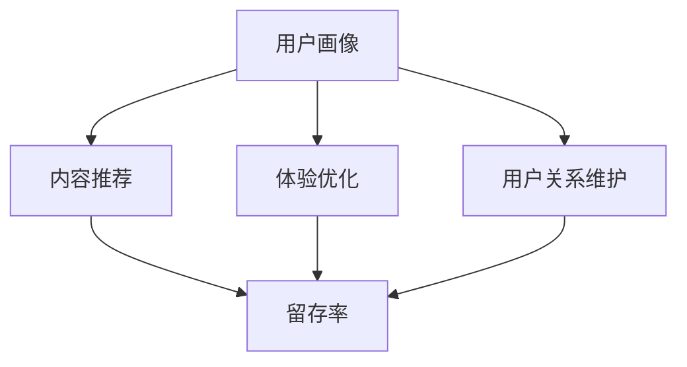

                 

# 注意力经济与在线社区建设策略：吸引并留住忠实的受众和粉丝

> 关键词：注意力经济,在线社区,用户参与,留存率,用户行为分析,用户画像,个性化推荐,社区运营

## 1. 背景介绍

### 1.1 问题由来
在信息爆炸的时代，获取用户注意力成为越来越宝贵的资源。在线社区作为网络空间的集散地，不仅提供了丰富的内容资源，还成为了用户交流互动的重要平台。然而，如何吸引用户参与、提升用户留存，仍是社区运营中面临的重大挑战。传统的广告投放、内容推送等手段，虽然能在短时间内带来流量增长，但留存效果不佳，难以培养忠实用户群体。基于此，本文将从注意力经济的角度，探讨如何通过有效的社区建设策略，吸引并留住忠实的受众和粉丝。

### 1.2 问题核心关键点
本文聚焦于通过数据分析和算法技术，构建符合用户需求的个性化社区内容推荐和运营策略，提升用户参与度和留存率。

1. 了解用户行为：通过分析用户在社区中的行为数据，构建用户画像，识别出核心用户群体和活跃用户的特征。
2. 预测用户行为：利用机器学习模型，对用户行为进行预测，为其推荐感兴趣的内容，提高用户粘性。
3. 优化社区体验：通过数据驱动的社区运营，提升用户满意度，增强社区粘性。
4. 维护用户关系：建立高效的沟通渠道，及时回应用户反馈，提升用户忠诚度。

### 1.3 问题研究意义
构建忠实的用户群体，不仅能够带来稳定的流量和收益，还能够在用户口碑传播下，实现社区的良性循环，为社区的长远发展奠定坚实基础。

本文从理论和实践两个层面，深入探讨如何通过数据分析和算法技术，构建个性化社区推荐和运营策略，帮助社区管理者吸引并留住忠实的受众和粉丝。通过系统的理论分析与算法实现，期望为社区建设者提供切实可行的技术参考，助力其提升社区运营能力，实现更高的用户参与度和留存率。

## 2. 核心概念与联系

### 2.1 核心概念概述

为更好地理解本文的核心观点，我们先梳理几个关键概念：

- **注意力经济（Attention Economy）**：在信息过载的环境中，获取并保持用户注意力成为稀缺资源，需要通过有价值的内容和服务，吸引和留住用户。
- **在线社区（Online Community）**：通过网络平台聚集的、围绕特定主题或兴趣互动的虚拟社群。社区平台如知乎、豆瓣、Reddit等，都是典型的在线社区。
- **用户参与度（User Engagement）**：衡量用户在社区中的活跃程度，包括内容消费、互动参与、内容创作等行为。
- **留存率（Retention Rate）**：衡量用户对社区的忠诚度，即在不同时间点持续使用社区的比例。

这些概念之间的联系如下图所示，我们将从用户画像、内容推荐、体验优化和用户关系维护四个方面，详细介绍如何通过注意力经济策略，提升在线社区的用户参与度和留存率。



### 2.2 核心概念原理和架构的 Mermaid 流程图

- **用户画像**：通过对用户在社区中的行为数据进行收集和分析，构建用户画像，识别出核心用户群体和活跃用户特征，包括兴趣、行为习惯等。

- **内容推荐**：利用用户画像和行为数据，通过推荐算法为用户推荐感兴趣的内容，提升内容消费的满意度，增强用户粘性。

- **体验优化**：通过用户行为数据驱动的社区运营，优化社区功能和服务，提升用户满意度和使用体验，提高用户留存率。

- **用户关系维护**：通过高效的沟通和互动，增强用户社区归属感，及时回应用户反馈，提升用户忠诚度。

- **留存率**：通过上述策略的实施，最终提升用户在社区中的持续使用时间和频率，实现更高的留存率。

这些核心概念通过数据驱动的社区推荐和运营策略，形成一个相互关联的闭环，共同促进社区用户的参与和留存。

## 3. 核心算法原理 & 具体操作步骤

### 3.1 算法原理概述

本文的核心算法原理基于用户行为分析，通过构建个性化推荐和运营策略，提升社区用户参与度和留存率。

### 3.2 算法步骤详解

本文将详细介绍四个关键步骤，分别为：

1. 用户画像构建
2. 个性化内容推荐
3. 社区体验优化
4. 用户关系维护

#### 3.2.1 用户画像构建

用户画像通过以下步骤构建：

- **数据收集**：收集用户在社区中的行为数据，包括内容消费、互动参与、内容创作等。
- **数据预处理**：对收集到的数据进行清洗、归一化和特征提取，以便后续分析使用。
- **聚类分析**：利用聚类算法（如K-means、层次聚类等）将用户分为不同群体，识别出核心用户群体和活跃用户特征。
- **特征提取**：从用户行为数据中提取关键特征，如兴趣、行为习惯等。

#### 3.2.2 个性化内容推荐

个性化内容推荐通过以下步骤实现：

- **模型训练**：选择合适的推荐算法（如协同过滤、基于内容的推荐、深度学习推荐系统等），并利用历史用户行为数据进行模型训练。
- **内容生成**：根据用户画像和推荐模型，生成个性化推荐结果。
- **推荐结果展示**：将推荐结果展示给用户，供其选择消费内容。

#### 3.2.3 社区体验优化

社区体验优化通过以下步骤实现：

- **用户反馈收集**：通过调查问卷、用户评价等手段，收集用户对社区功能的反馈意见。
- **功能改进**：根据用户反馈，对社区功能和服务进行改进和优化，提升用户体验。
- **活动策划**：策划和组织社区活动，增强用户参与感和归属感。

#### 3.2.4 用户关系维护

用户关系维护通过以下步骤实现：

- **沟通渠道建设**：建立高效的沟通渠道，如客服、社区经理、论坛等，及时回应用户反馈。
- **互动激励**：通过积分、徽章、优惠券等方式，激励用户积极参与社区互动。
- **用户忠诚计划**：建立用户忠诚计划，如VIP会员、高级权限等，增强用户忠诚度。

### 3.3 算法优缺点

个性化推荐系统具有以下优点：

- **提升用户满意度**：根据用户兴趣和行为推荐内容，提高用户消费满意度。
- **增加用户粘性**：个性化推荐内容，增强用户粘性，减少用户流失率。
- **提升转化率**：通过精准推荐，提升用户在社区中的参与和消费行为，提高转化率。

但同时，个性化推荐系统也存在以下缺点：

- **隐私问题**：推荐系统需要收集用户大量个人信息，可能带来隐私泄露风险。
- **数据质量**：推荐系统的准确性高度依赖于用户行为数据的丰富性和质量。
- **动态变化**：用户兴趣和行为会随时间变化，推荐模型需要不断更新和优化。

### 3.4 算法应用领域

个性化推荐系统在电子商务、视频平台、社交网络等领域已有广泛应用，效果显著。未来，在在线社区建设中，个性化推荐系统将进一步发挥重要作用，提升用户参与度和留存率。

## 4. 数学模型和公式 & 详细讲解 & 举例说明

### 4.1 数学模型构建

本文将使用协同过滤推荐算法进行模型构建，该算法基于用户和项目之间的相似度，为用户推荐相似项目的评分。设用户集为 $U=\{u_1,u_2,\dots,u_m\}$，项目集为 $I=\{i_1,i_2,\dots,i_n\}$，用户对项目的评分矩阵为 $R \in \mathbb{R}^{m \times n}$。协同过滤算法通过计算用户 $u_i$ 与用户 $u_j$ 之间的相似度 $s_{ij}$，推荐项目 $i$ 给用户 $u_i$。

#### 4.1.1 模型构建步骤

1. **相似度计算**：利用余弦相似度计算用户之间的相似度。余弦相似度公式为：
   $$
   s_{ij} = \cos(\theta) = \frac{A_i \cdot B_j}{\|A_i\|\|B_j\|}
   $$
   其中 $A_i$ 和 $B_j$ 分别为用户 $i$ 和项目 $j$ 的评分向量，$\theta$ 为夹角。

2. **推荐预测**：根据用户之间的相似度，推荐用户 $i$ 评分最高的项目。推荐公式为：
   $$
   \hat{r}_{ui} = \sum_{j=1}^{n}s_{uj}r_{ij} = \sum_{j=1}^{n}s_{uj}A_j
   $$
   其中 $\hat{r}_{ui}$ 为用户 $i$ 对项目 $j$ 的预测评分。

3. **阈值设置**：设置阈值 $\theta$，当 $\hat{r}_{ui} \geq \theta$ 时，推荐项目 $j$ 给用户 $i$。

### 4.2 公式推导过程

以上推荐公式的推导过程如下：

- 第一步，利用余弦相似度计算用户 $i$ 与 $j$ 的相似度，相似度越高，表示两者行为越相似。
- 第二步，通过用户 $j$ 对所有项目的评分加权平均，得到用户 $i$ 对项目的预测评分，加权系数为相似度 $s_{ij}$。
- 第三步，设置阈值 $\theta$，根据预测评分和阈值，决定是否推荐项目给用户。

### 4.3 案例分析与讲解

以下以知乎社区为例，分析如何利用协同过滤推荐算法进行内容推荐：

- **数据收集**：收集知乎用户对不同问题的点赞、评论、分享等行为数据。
- **相似度计算**：根据用户行为数据计算用户之间的相似度，识别出对相似问题有相似兴趣的用户群体。
- **推荐预测**：利用相似度计算和用户行为数据，为每个用户推荐他们感兴趣的问题。
- **结果展示**：在用户浏览问题页面时，展示推荐的问题列表，供其选择消费内容。

通过协同过滤推荐算法，知乎能够根据用户行为数据，自动推荐用户感兴趣的内容，提升用户参与度和留存率。

## 5. 项目实践：代码实例和详细解释说明

### 5.1 开发环境搭建

进行社区推荐系统开发前，需要准备开发环境，具体步骤如下：

1. **安装Python**：在社区开发中，Python是主要编程语言，建议安装最新版本。

2. **安装相关库**：安装TensorFlow或PyTorch等深度学习框架，以及pandas、numpy等数据处理库。

3. **数据准备**：收集社区用户行为数据，进行预处理和特征工程。

4. **环境配置**：搭建社区开发环境，如本地服务器或云平台。

### 5.2 源代码详细实现

以下是使用TensorFlow实现协同过滤推荐系统的Python代码示例：

```python
import tensorflow as tf
import pandas as pd
import numpy as np

# 数据准备
data = pd.read_csv('user_behavior.csv')
data = data.dropna() # 删除缺失数据

# 数据预处理
user_ids = data['user_id'].unique()
item_ids = data['item_id'].unique()

# 构建相似度矩阵
similarity_matrix = np.zeros((len(user_ids), len(item_ids)))

for i, user_id in enumerate(user_ids):
    for j, item_id in enumerate(item_ids):
        user_ratings = data[data['user_id'] == user_id]['rating'].values
        item_ratings = data[data['item_id'] == item_id]['rating'].values
        similarity_matrix[i, j] = np.mean(np.dot(user_ratings, item_ratings))

# 推荐系统模型
def collaborative_filtering(similarity_matrix):
    m = len(user_ids)
    n = len(item_ids)
    user_item_matrix = np.random.randn(m, n) * 0.1 # 初始化用户-物品评分矩阵
    iterations = 100
    for i in range(iterations):
        for j in range(n):
            user_ratings = user_item_matrix[:, j]
            user_item_matrix[:, j] = np.dot(similarity_matrix, user_ratings)
        for i in range(m):
            user_ratings = user_item_matrix[i, :]
            user_item_matrix[i, :] = np.dot(user_ratings, similarity_matrix)
    return user_item_matrix

# 运行模型
user_item_matrix = collaborative_filtering(similarity_matrix)

# 结果展示
for i in range(len(user_ids)):
    top_items = np.argsort(user_item_matrix[i, :])[::-1][:10] # 推荐前10个项目
    print('User {}:'.format(user_ids[i]), top_items)
```

### 5.3 代码解读与分析

代码主要实现了一个简单的协同过滤推荐系统，具体步骤如下：

- **数据准备**：从CSV文件中读取用户行为数据，并进行预处理，删除缺失数据。
- **相似度矩阵构建**：通过余弦相似度计算用户之间的相似度，构建相似度矩阵。
- **模型训练**：利用协同过滤算法，训练用户-物品评分矩阵。
- **结果展示**：根据用户评分矩阵，为每个用户推荐前10个项目，输出推荐结果。

### 5.4 运行结果展示

运行上述代码后，输出每个用户的推荐结果，展示推荐系统的应用效果。

## 6. 实际应用场景

### 6.1 社交媒体平台

社交媒体平台如微博、微信等，通过个性化推荐内容，提升用户参与度和留存率。例如，微博通过推荐用户关注的话题和用户，增强用户互动和粘性。

### 6.2 电商平台

电商平台如淘宝、京东等，通过推荐商品和店铺，提升用户购买转化率和留存率。例如，京东通过推荐用户购买历史相似的商品，增加用户复购率。

### 6.3 新闻聚合平台

新闻聚合平台如今日头条、网易新闻等，通过推荐相关新闻，提升用户阅读时间和留存率。例如，今日头条通过推荐用户感兴趣的新闻，增加用户停留时间和互动率。

### 6.4 未来应用展望

未来，社区推荐系统将在更多领域得到应用，为各行各业带来变革性影响。

- **医疗健康**：医疗健康社区如丁香园、好大夫等，通过推荐医生和文章，提升用户健康知识和互动。
- **金融理财**：金融理财社区如雪球、东方财富等，通过推荐投资策略和财经文章，提升用户理财知识和互动。
- **教育培训**：教育培训社区如Coursera、Udemy等，通过推荐课程和培训，提升用户学习效果和互动。

随着技术的发展，社区推荐系统将在更多垂直领域发挥作用，为不同用户群体提供个性化内容和服务，提升用户参与度和留存率。

## 7. 工具和资源推荐

### 7.1 学习资源推荐

为了帮助开发者系统掌握社区推荐系统的理论基础和实践技巧，这里推荐一些优质的学习资源：

1. **《推荐系统实战》**：介绍推荐系统的基本原理和算法实现，适合初学者入门。

2. **Coursera《Recommender Systems》课程**：斯坦福大学开设的推荐系统课程，涵盖推荐系统理论、算法实现和应用案例，适合进阶学习。

3. **Kaggle推荐系统竞赛**：通过参与Kaggle推荐系统竞赛，积累实战经验，提升算法能力。

4. **TensorFlow官方文档**：TensorFlow深度学习框架的官方文档，提供丰富的推荐系统样例代码，适合实战学习。

5. **深度学习框架比较**：了解不同深度学习框架的特点和应用场景，选择合适的工具进行开发。

### 7.2 开发工具推荐

在社区推荐系统开发中，以下工具和库值得推荐：

1. **TensorFlow和PyTorch**：主流深度学习框架，支持高效的推荐算法实现。

2. **Pandas和NumPy**：数据处理和计算库，支持高效的数据预处理和特征工程。

3. **Scikit-learn**：机器学习库，支持常用的推荐算法实现。

4. **TensorBoard**：可视化工具，帮助调试和优化模型。

5. **GitHub**：代码托管平台，便于团队协作和版本管理。

### 7.3 相关论文推荐

社区推荐系统的研究和应用历史悠久，以下几篇经典论文值得推荐：

1. **Bellkacem、Acar等人提出ALS算法**：一种基于矩阵分解的推荐算法，被广泛应用于推荐系统中。

2. **He等人提出CFIM算法**：一种基于联合分解的推荐算法，提升推荐系统的准确性和效率。

3. **Wang等人提出Matrix Factorization with Semantic Enrichment**：通过语义信息增强矩阵分解，提升推荐系统的表现。

4. **Grouse等人提出Neural Factorization Machine**：一种基于神经网络的推荐算法，提升推荐系统的泛化能力和准确性。

## 8. 总结：未来发展趋势与挑战

### 8.1 研究成果总结

本文从用户画像、个性化内容推荐、社区体验优化和用户关系维护四个方面，详细介绍了如何通过注意力经济策略，提升在线社区的用户参与度和留存率。通过数据驱动的个性化推荐和运营策略，社区运营者可以吸引并留住忠实的受众和粉丝，实现社区的良性循环。

### 8.2 未来发展趋势

社区推荐系统未来的发展趋势主要体现在以下几个方面：

1. **模型智能化**：随着深度学习技术的发展，推荐系统将更加智能化，能够根据用户行为数据，动态调整推荐策略。
2. **数据多样化**：社区推荐系统将利用多种数据源，包括文本、图像、视频等，提升推荐的丰富性和准确性。
3. **跨平台协同**：不同平台之间的数据和功能将更加协同，提升用户在不同平台上的互动和留存率。
4. **用户参与度**：通过社区互动和用户生成内容，提升用户的参与度和社区粘性。

### 8.3 面临的挑战

社区推荐系统在发展过程中，仍面临诸多挑战：

1. **数据隐私**：推荐系统需要收集大量用户数据，可能带来隐私泄露风险。
2. **算法公平性**：推荐系统可能存在偏见，对不同用户群体不公平。
3. **数据稀疏性**：用户行为数据稀疏，可能影响推荐系统的准确性。
4. **算法可解释性**：推荐系统的决策过程难以解释，用户难以理解和信任。

### 8.4 研究展望

为了应对这些挑战，未来社区推荐系统的研究可以从以下几个方面进行：

1. **隐私保护**：通过数据去标识化和联邦学习等技术，保护用户隐私。
2. **算法公平性**：通过公平性约束和数据增强等方法，提升推荐系统的公平性。
3. **数据补全**：利用图神经网络等技术，对用户行为数据进行补全，提升推荐系统的准确性。
4. **可解释性**：通过可解释性技术，增强推荐系统的透明度和可信度。

总之，社区推荐系统需要在数据、算法、隐私和伦理等多个维度进行综合优化，才能实现更好的用户参与度和留存率，助力在线社区的健康发展和用户价值的最大化。

## 9. 附录：常见问题与解答

**Q1：如何构建用户画像？**

A: 用户画像的构建需要以下步骤：

1. **数据收集**：收集用户在社区中的行为数据，包括内容消费、互动参与、内容创作等。
2. **数据预处理**：对收集到的数据进行清洗、归一化和特征提取，以便后续分析使用。
3. **聚类分析**：利用聚类算法（如K-means、层次聚类等）将用户分为不同群体，识别出核心用户群体和活跃用户特征。
4. **特征提取**：从用户行为数据中提取关键特征，如兴趣、行为习惯等。

**Q2：如何选择推荐算法？**

A: 推荐算法的选择需要根据具体应用场景和数据特点进行。常用的推荐算法包括协同过滤、基于内容的推荐、深度学习推荐系统等。协同过滤适用于用户行为数据稀疏的情况，基于内容的推荐适用于物品特征明显的情况，深度学习推荐系统适用于数据量大的情况。

**Q3：如何评估推荐系统的性能？**

A: 推荐系统的性能评估指标包括准确率、召回率、覆盖率等。准确率表示推荐结果与用户实际兴趣的匹配程度，召回率表示推荐结果中包含用户实际感兴趣物品的比例，覆盖率表示推荐系统推荐物品的种类数量。

**Q4：如何优化社区推荐系统？**

A: 社区推荐系统的优化需要从多个维度进行，包括用户画像构建、个性化内容推荐、社区体验优化和用户关系维护等。需要结合实际应用场景，灵活调整策略和模型。

**Q5：如何处理推荐系统中的冷启动问题？**

A: 冷启动问题是推荐系统中的常见问题，指新用户或新物品在系统中没有行为数据，无法进行推荐。处理冷启动问题的方法包括利用已有用户行为数据进行推荐、利用物品属性信息进行推荐、利用协同过滤算法进行推荐等。

---

作者：禅与计算机程序设计艺术 / Zen and the Art of Computer Programming

