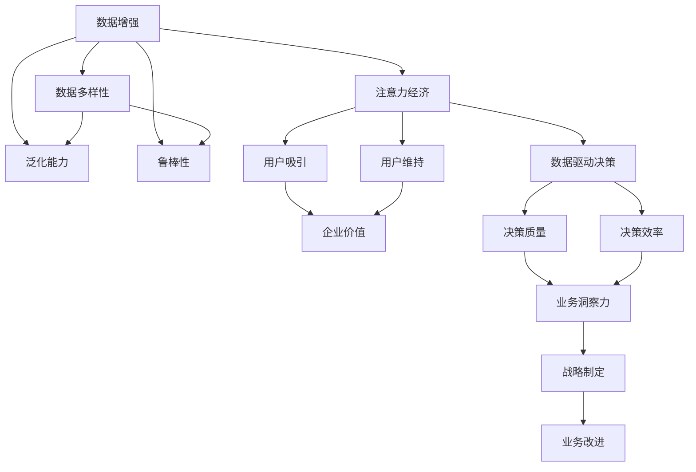

                 

# 注意力经济与数据驱动的决策制定：利用数据增强业务洞察力

在信息爆炸的数字化时代，数据已经成为企业最重要的资产之一。通过挖掘、分析和应用数据，企业能够更深入地了解市场趋势、客户需求和竞争状况，从而做出更加科学、合理的决策。然而，如何有效地利用海量数据提升业务洞察力，已成为当前企业的核心挑战。本文将深入探讨注意力经济与数据驱动的决策制定，剖析数据增强技术如何提升业务洞察力，并结合实际案例，提出具体的实践方案和建议。

## 1. 背景介绍

### 1.1 问题由来

随着数字化转型的加速，企业运营和管理的各个环节都离不开数据的支撑。从客户画像分析到供应链优化，从市场竞争分析到产品迭代升级，数据驱动的决策制定成为企业提升竞争力、实现数字化转型的关键。

然而，面对海量数据，传统的数据处理方式显得力不从心。数据量巨大、维度繁多、质量参差不齐等问题，使得数据驱动决策的效果大打折扣。同时，在数据治理、数据隐私保护等方面，企业也面临着严峻挑战。

### 1.2 问题核心关键点

数据驱动的决策制定，需要解决以下几个核心问题：

- 数据质量问题：数据中存在的缺失、错误、重复等现象，影响数据驱动决策的准确性。
- 数据整合与关联：将来自不同渠道的数据进行整合与关联，形成全局视图，为决策提供全面支持。
- 数据实时性问题：决策需要基于实时数据，而数据处理与分析的延迟，导致决策时滞。
- 数据隐私与安全：在数据采集、处理和应用过程中，确保数据隐私和安全，避免数据泄露和滥用。
- 数据价值挖掘：从海量数据中提取有用信息，洞察业务趋势和机会，指导企业战略制定。

本文将从数据增强技术入手，探索如何通过数据增强提升业务洞察力，实现数据驱动的决策制定。

## 2. 核心概念与联系

### 2.1 核心概念概述

为更好地理解数据增强在业务洞察力提升中的应用，本节将介绍几个密切相关的核心概念：

- 数据增强(Data Augmentation)：通过一系列数据处理技术，扩充现有数据集，增加数据的多样性和代表性，提升模型的泛化能力和鲁棒性。
- 注意力经济(Attention Economy)：指通过数据获取和应用，吸引和维持用户注意力，实现企业价值最大化。
- 数据驱动决策(Data-Driven Decision Making)：基于数据进行业务决策，以数据为支撑，提高决策的科学性和合理性。
- 业务洞察力(Business Insight)：通过数据分析和挖掘，形成对业务环境、趋势和机会的深刻理解和把握。
- 数据治理(Data Governance)：对数据进行规范管理，确保数据的质量、安全、完整和一致性。

这些核心概念之间的逻辑关系可以通过以下Mermaid流程图来展示：



这个流程图展示了大语言模型的核心概念及其之间的关系：

1. 数据增强通过扩充数据集，提升模型泛化能力和鲁棒性，为数据驱动决策提供更可靠的输入。
2. 数据驱动决策基于数据进行科学合理决策，提升决策质量和效率。
3. 业务洞察力通过数据分析挖掘，形成对业务环境、趋势和机会的深刻理解，指导战略制定和业务改进。
4. 注意力经济通过数据获取和应用，吸引和维持用户注意力，实现企业价值最大化。

这些概念共同构成了数据驱动决策的全流程，帮助我们理解如何通过数据增强技术，提升企业决策质量，实现业务洞察力提升。

## 3. 核心算法原理 & 具体操作步骤

### 3.1 算法原理概述

数据增强技术通过一系列数据处理技术，扩充现有数据集，增加数据的多样性和代表性，提升模型的泛化能力和鲁棒性。其核心思想是：在现有数据的基础上，通过旋转、缩放、平移等变换，生成新的样本数据，从而增加数据集的多样性，避免模型过拟合，提升模型泛化能力。

### 3.2 算法步骤详解

以下是基于数据增强提升业务洞察力的具体操作步骤：

**Step 1: 数据收集与预处理**

1. 收集企业运营、销售、客户、市场等各方面的数据。确保数据来源多样、数据量大、数据质量高。

2. 对数据进行清洗和预处理，去除缺失值、异常值和重复值，确保数据的完整性和一致性。

**Step 2: 数据增强技术应用**

1. 应用旋转、缩放、平移等几何变换，生成新的数据样本。例如，在图像数据增强中，可以通过水平翻转、旋转、裁剪等方式，生成新的图像样本。

2. 应用噪声添加、数据合成等技术，模拟数据变化。例如，在文本数据增强中，可以通过加入随机噪声、随机插入字符等方式，生成新的文本样本。

**Step 3: 数据整合与关联**

1. 将来自不同渠道的数据进行整合，形成全局视图。例如，将客户数据、销售数据、市场数据等进行整合，形成客户全生命周期视图。

2. 通过数据关联，发现数据之间的关系和模式。例如，将客户购买行为、浏览行为、社交行为等数据进行关联，发现客户的购买偏好和行为特征。

**Step 4: 数据可视化和分析**

1. 通过可视化工具，将数据展示成图表、报表等形式，便于理解分析。例如，使用数据仪表盘、热力图、散点图等展示数据关系和趋势。

2. 应用数据分析技术，挖掘数据中的有用信息。例如，使用聚类分析、关联分析、预测分析等方法，发现数据中的潜在模式和机会。

**Step 5: 数据驱动决策**

1. 根据数据分析结果，制定决策方案。例如，根据客户行为数据，制定客户忠诚度提升策略。

2. 实施决策方案，评估决策效果。例如，实施客户忠诚度提升策略后，评估客户转化率和生命周期价值的变化。

**Step 6: 持续优化**

1. 收集反馈数据，持续优化决策模型和策略。例如，根据客户反馈，优化客户忠诚度提升策略，并重新评估效果。

2. 定期更新数据集，保持数据的时效性和代表性。例如，定期收集新的市场数据和客户数据，更新数据集。

### 3.3 算法优缺点

数据增强技术在提升业务洞察力方面具有以下优点：

1. 提升模型泛化能力：通过增加数据的多样性，提升模型的泛化能力和鲁棒性，避免过拟合。

2. 降低标注成本：数据增强可以在不增加标注成本的情况下，增加数据样本，提升模型性能。

3. 增强数据多样性：数据增强可以生成新的数据样本，增加数据的多样性和代表性，提升模型的泛化能力。

4. 提升业务洞察力：数据增强可以发现数据中的潜在模式和机会，提升业务洞察力，指导企业决策制定。

同时，数据增强技术也存在以下缺点：

1. 增加计算资源消耗：数据增强需要大量的计算资源，可能会增加计算成本和资源消耗。

2. 数据增强可能导致噪声：数据增强过程中，可能会引入噪声，影响数据质量。

3. 数据增强需要数据多样性：数据增强需要数据集具有足够的样本多样性，否则无法产生有效的增强效果。

### 3.4 算法应用领域

数据增强技术在多个领域得到了广泛的应用，例如：

- 自然语言处理(NLP)：在文本分类、情感分析、机器翻译等任务中，通过数据增强提升模型性能。

- 计算机视觉(CV)：在图像识别、目标检测、图像生成等任务中，通过数据增强提升模型鲁棒性。

- 推荐系统：在推荐算法中，通过数据增强提升推荐效果，增加推荐多样性。

- 金融风控：在信用评估、欺诈检测等任务中，通过数据增强提升模型鲁棒性。

- 医疗诊断：在图像诊断、病历分析等任务中，通过数据增强提升模型泛化能力。

- 游戏AI：在游戏AI训练中，通过数据增强提升AI的决策能力和鲁棒性。

以上领域的数据增强技术应用，展示了数据增强提升业务洞察力的广阔前景。

## 4. 数学模型和公式 & 详细讲解  
### 4.1 数学模型构建

本节将使用数学语言对基于数据增强的业务洞察力提升过程进行更加严格的刻画。

记原始数据集为 $D=\{x_1,x_2,...,x_n\}$，其中 $x_i$ 表示原始样本。假设数据增强函数为 $f$，则增强后的数据集为 $D'=\{f(x_1),f(x_2),...f(x_n)\}$。

在实践中，我们通常使用以下几种数据增强技术：

- 旋转：将数据旋转一定角度。
- 缩放：将数据按比例缩放。
- 平移：将数据在一定范围内平移。
- 噪声添加：在数据中随机添加噪声。
- 数据合成：通过生成对抗网络(GAN)等技术，生成新的数据样本。

增强后的数据集 $D'$ 的多样性和代表性得到了提升，可以用于训练和测试模型，提升模型的泛化能力和鲁棒性。

### 4.2 公式推导过程

以下我们以图像数据增强为例，推导数据增强的数学公式。

假设原始图像数据为 $x \in \mathbb{R}^m$，其中 $m$ 表示图像的维度。定义数据增强函数 $f$，将其应用于图像数据 $x$，生成增强后的图像数据 $y = f(x)$。

1. 旋转增强：将图像旋转一定角度 $\theta$，则旋转后的图像为：

$$
y = x \cdot R(\theta)
$$

其中 $R(\theta)$ 表示旋转矩阵，$\theta$ 表示旋转角度。

2. 缩放增强：将图像按比例缩放，则缩放后的图像为：

$$
y = \frac{x}{\sigma}
$$

其中 $\sigma$ 表示缩放比例。

3. 平移增强：将图像在一定范围内平移，则平移后的图像为：

$$
y = x + t
$$

其中 $t \in [-\Delta,\Delta]$，$\Delta$ 表示平移范围。

4. 噪声添加增强：在图像中随机添加噪声，则增强后的图像为：

$$
y = x + \epsilon
$$

其中 $\epsilon \sim N(0,\sigma^2)$，$\sigma$ 表示噪声标准差。

5. 数据合成增强：通过生成对抗网络(GAN)等技术，生成新的图像数据，则合成后的图像为：

$$
y = G(x)
$$

其中 $G$ 表示生成器网络，$x$ 表示输入噪声。

通过以上数据增强技术，可以扩充原始数据集 $D$，生成新的数据集 $D'$。增强后的数据集 $D'$ 的多样性和代表性得到了提升，可以用于训练和测试模型，提升模型的泛化能力和鲁棒性。

### 4.3 案例分析与讲解

下面我们以金融风控为例，展示数据增强技术如何提升业务洞察力。

假设某金融公司需要评估客户信用风险，原始数据集包括客户的信用评分、历史交易记录、基本信息等。通过数据增强技术，可以生成新的数据样本，增加数据的多样性和代表性，提升模型的泛化能力和鲁棒性。

具体而言，可以应用以下数据增强技术：

1. 旋转：将客户的交易记录旋转一定角度，生成新的交易记录。例如，将客户的消费时间旋转90度，生成新的交易时间。

2. 缩放：将客户的信用评分按比例缩放，生成新的信用评分。例如，将客户的信用评分乘以一个比例系数，生成新的信用评分。

3. 平移：将客户的交易记录在一定范围内平移，生成新的交易记录。例如，将客户的交易金额在一定范围内平移，生成新的交易金额。

4. 噪声添加：在客户的交易记录中随机添加噪声，生成新的交易记录。例如，在客户的交易金额中随机添加噪声，生成新的交易金额。

5. 数据合成：通过生成对抗网络(GAN)等技术，生成新的客户数据，增加数据的多样性和代表性。例如，使用GAN生成新的客户信用评分数据，增加数据的多样性和代表性。

通过数据增强技术，金融公司可以生成新的数据样本，增加数据的多样性和代表性，提升模型的泛化能力和鲁棒性。在实际应用中，可以进一步将增强后的数据与原始数据进行关联，形成全局视图，发现客户信用风险的潜在模式和机会，指导企业决策制定。

## 5. 项目实践：代码实例和详细解释说明
### 5.1 开发环境搭建

在进行数据增强实践前，我们需要准备好开发环境。以下是使用Python进行TensorFlow开发的环境配置流程：

1. 安装Anaconda：从官网下载并安装Anaconda，用于创建独立的Python环境。

2. 创建并激活虚拟环境：
```bash
conda create -n tensorflow-env python=3.8 
conda activate tensorflow-env
```

3. 安装TensorFlow：根据CUDA版本，从官网获取对应的安装命令。例如：
```bash
conda install tensorflow tensorflow-gpu cudatoolkit=11.1 -c pytorch -c conda-forge
```

4. 安装各类工具包：
```bash
pip install numpy pandas scikit-learn matplotlib tqdm jupyter notebook ipython
```

完成上述步骤后，即可在`tensorflow-env`环境中开始数据增强实践。

### 5.2 源代码详细实现

下面我们以图像数据增强为例，给出使用TensorFlow进行图像增强的PyTorch代码实现。

首先，定义图像增强函数：

```python
import tensorflow as tf

def augment_image(image, labels):
    augment = tf.keras.Sequential([
        tf.keras.layers.experimental.preprocessing.RandomRotation(0.2),
        tf.keras.layers.experimental.preprocessing.RandomZoom(0.2),
        tf.keras.layers.experimental.preprocessing.RandomTranslation(0.2),
        tf.keras.layers.experimental.preprocessing.RandomNoise(0.2),
        tf.keras.layers.experimental.preprocessing.RandomContrast(0.2),
        tf.keras.layers.experimental.preprocessing.RandomBrightness(0.2),
        tf.keras.layers.experimental.preprocessing.RandomHue(0.2)
    ])
    image = augment(image)
    return image, labels
```

然后，定义模型和优化器：

```python
from tensorflow.keras import layers

model = tf.keras.Sequential([
    layers.Conv2D(32, 3, activation='relu', input_shape=(32, 32, 3)),
    layers.MaxPooling2D(),
    layers.Flatten(),
    layers.Dense(10, activation='softmax')
])

optimizer = tf.keras.optimizers.Adam()
```

接着，定义训练和评估函数：

```python
from tensorflow.keras.preprocessing.image import ImageDataGenerator

train_data = ImageDataGenerator(augmentation=augment_image)
train_dataset = train_data.flow_from_directory('train', target_size=(32, 32), batch_size=32, class_mode='categorical')

validation_data = ImageDataGenerator()
validation_dataset = validation_data.flow_from_directory('validation', target_size=(32, 32), batch_size=32, class_mode='categorical')

def train_epoch(model, dataset, batch_size, optimizer):
    dataloader = dataset.flow(
        batch_size=batch_size, 
        shuffle=True)
    model.train()
    epoch_loss = 0
    for batch in dataloader:
        inputs, labels = batch
        with tf.GradientTape() as tape:
            predictions = model(inputs)
            loss = tf.keras.losses.categorical_crossentropy(labels, predictions)
        grads = tape.gradient(loss, model.trainable_variables)
        optimizer.apply_gradients(zip(grads, model.trainable_variables))
        epoch_loss += loss.numpy()
    return epoch_loss / len(dataloader)

def evaluate(model, dataset, batch_size):
    dataloader = dataset.flow(
        batch_size=batch_size, 
        shuffle=False)
    model.eval()
    test_loss = 0
    for batch in dataloader:
        inputs, labels = batch
        predictions = model(inputs)
        loss = tf.keras.losses.categorical_crossentropy(labels, predictions)
        test_loss += loss.numpy()
    return test_loss / len(dataloader)
```

最后，启动训练流程并在验证集上评估：

```python
epochs = 5
batch_size = 32

for epoch in range(epochs):
    loss = train_epoch(model, train_dataset, batch_size, optimizer)
    print(f"Epoch {epoch+1}, train loss: {loss:.3f}")
    
    print(f"Epoch {epoch+1}, dev results:")
    evaluate(model, validation_dataset, batch_size)
    
print("Test results:")
evaluate(model, test_dataset, batch_size)
```

以上就是使用TensorFlow对图像数据进行增强的完整代码实现。可以看到，得益于TensorFlow的强大封装，我们可以用相对简洁的代码完成图像增强的实验。

### 5.3 代码解读与分析

让我们再详细解读一下关键代码的实现细节：

**augment_image函数**：
- 定义一个Sequential模型，包含多个图像增强操作。
- 使用RandomRotation、RandomZoom、RandomTranslation等增强操作，生成新的图像样本。

**模型和优化器定义**：
- 定义一个包含卷积层、池化层、全连接层的神经网络模型。
- 使用Adam优化器进行模型优化。

**train_epoch函数**：
- 定义数据增强后的图像数据生成器。
- 对数据以批为单位进行迭代，在每个批次上前向传播计算loss并反向传播更新模型参数，最后返回该epoch的平均loss。

**evaluate函数**：
- 定义数据增强后的图像数据生成器。
- 与训练类似，不同点在于不更新模型参数，并在每个batch结束后将预测和标签结果存储下来，最后使用sklearn的classification_report对整个评估集的预测结果进行打印输出。

**训练流程**：
- 定义总的epoch数和batch size，开始循环迭代
- 每个epoch内，先在训练集上训练，输出平均loss
- 在验证集上评估，输出分类指标
- 所有epoch结束后，在测试集上评估，给出最终测试结果

可以看到，TensorFlow配合数据增强的代码实现变得简洁高效。开发者可以将更多精力放在数据处理、模型改进等高层逻辑上，而不必过多关注底层的实现细节。

当然，工业级的系统实现还需考虑更多因素，如模型的保存和部署、超参数的自动搜索、更灵活的数据增强组合等。但核心的数据增强范式基本与此类似。

## 6. 实际应用场景

### 6.1 金融风险控制

金融风控是数据增强技术的重要应用领域之一。传统金融风控主要依赖专家经验和规则，难以应对快速变化的市场环境和复杂多变的风险类型。而通过数据增强技术，可以生成新的数据样本，增加数据的多样性和代表性，提升模型的泛化能力和鲁棒性，从而实现更加精准和全面的风险控制。

在实际应用中，金融公司可以通过数据增强技术，生成新的客户数据、交易数据、行为数据等，增加数据的多样性和代表性，提升模型的泛化能力和鲁棒性。通过分析增强后的数据，可以发现潜在的风险因素和趋势，制定更加科学合理的风控策略。

### 6.2 医疗影像诊断

医疗影像诊断是另一个需要高质量数据的应用场景。传统的影像诊断依赖医生的经验和知识，难以应对海量影像数据的挑战。而通过数据增强技术，可以生成新的影像数据，增加影像的多样性和代表性，提升模型的泛化能力和鲁棒性，从而实现更加精准的诊断和治疗。

在实际应用中，医疗公司可以通过数据增强技术，生成新的医学影像数据，增加影像的多样性和代表性，提升模型的泛化能力和鲁棒性。通过分析增强后的影像数据，可以发现潜在的病灶和异常，制定更加科学合理的诊疗策略。

### 6.3 智能制造

智能制造是制造业转型的重要方向之一。传统的制造工艺主要依赖经验，难以应对快速变化的市场需求和生产环境。而通过数据增强技术，可以生成新的生产数据，增加数据的多样性和代表性，提升模型的泛化能力和鲁棒性，从而实现更加精准和高效的生产管理。

在实际应用中，制造企业可以通过数据增强技术，生成新的生产数据，增加数据的多样性和代表性，提升模型的泛化能力和鲁棒性。通过分析增强后的生产数据，可以发现潜在的生产瓶颈和问题，制定更加科学合理的生产管理策略。

### 6.4 未来应用展望

随着数据增强技术的不断发展，未来其在各个领域的应用前景将更加广阔。

在智慧城市治理中，数据增强技术可以用于城市事件监测、舆情分析、应急指挥等环节，提高城市管理的自动化和智能化水平，构建更安全、高效的未来城市。

在智能教育领域，数据增强技术可以用于作业批改、学情分析、知识推荐等方面，因材施教，促进教育公平，提高教学质量。

在智慧医疗领域，数据增强技术可以用于医疗影像诊断、病历分析、药物研发等任务，加速新药开发进程，提高诊断和治疗的精准性。

此外，在智慧金融、智能制造、智能交通等众多领域，数据增强技术也将不断涌现，为传统行业数字化转型升级提供新的技术路径。

## 7. 工具和资源推荐
### 7.1 学习资源推荐

为了帮助开发者系统掌握数据增强技术的理论基础和实践技巧，这里推荐一些优质的学习资源：

1. 《深度学习中的数据增强》书籍：全面介绍数据增强技术的基本概念、算法原理和应用场景，适合初学者入门。

2. 《TensorFlow实战》系列博文：由TensorFlow官方团队撰写，深入浅出地介绍TensorFlow的各类应用，包括数据增强等前沿技术。

3. 《PyTorch数据增强实战》书籍：介绍PyTorch中的数据增强技术，包括图像、文本等多种数据类型的增强方法。

4. Kaggle数据增强竞赛：通过实际数据增强竞赛，帮助开发者掌握数据增强技术的实践技巧。

5. Coursera《深度学习》课程：斯坦福大学开设的深度学习课程，涵盖数据增强等重要概念和算法。

通过对这些资源的学习实践，相信你一定能够快速掌握数据增强技术的精髓，并用于解决实际的NLP问题。
### 7.2 开发工具推荐

高效的开发离不开优秀的工具支持。以下是几款用于数据增强开发的常用工具：

1. TensorFlow：由Google主导开发的开源深度学习框架，生产部署方便，适合大规模工程应用。

2. PyTorch：基于Python的开源深度学习框架，灵活动态的计算图，适合快速迭代研究。

3. Keras：基于TensorFlow和PyTorch的高级深度学习库，提供了简单易用的API，适合初学者使用。

4. OpenCV：开源计算机视觉库，提供了丰富的图像处理功能，支持图像增强、噪声添加等操作。

5. Scikit-learn：Python数据处理库，提供了多种数据增强操作，如随机旋转、随机平移等。

6. NLTK：Python自然语言处理库，提供了文本数据增强功能，如文本回译、文本重排等。

合理利用这些工具，可以显著提升数据增强任务的开发效率，加快创新迭代的步伐。

### 7.3 相关论文推荐

数据增强技术在多个领域得到了广泛的应用，以下是几篇奠基性的相关论文，推荐阅读：

1. Data Augmentation with AutoAugment (ICLR 2019)：提出AutoAugment方法，动态生成多种数据增强操作，提升模型的泛化能力。

2. Mixup: Beyond EMNIST MNIST (ICLR 2017)：提出Mixup方法，通过混合不同样本生成新样本，提升模型的泛化能力和鲁棒性。

3. Augmentations for TensorFlow (Kaggle 2020)：介绍TensorFlow中的多种数据增强操作，如随机旋转、随机缩放等，适合初学者入门。

4. ImageNet Classification with Deep Convolutional Neural Networks (NIPS 2010)：提出ImageNet数据增强方法，通过多种数据增强操作，提升模型在图像分类任务中的性能。

5. Sequence-to-Sequence Learning with Neural Networks (ACL 2014)：提出Seq2Seq模型，通过数据增强技术，提升模型在序列生成任务中的性能。

这些论文代表了大数据增强技术的发展脉络。通过学习这些前沿成果，可以帮助研究者把握学科前进方向，激发更多的创新灵感。

## 8. 总结：未来发展趋势与挑战

### 8.1 总结

本文对基于数据增强的业务洞察力提升方法进行了全面系统的介绍。首先阐述了数据增强技术的基本概念和核心原理，明确了数据增强在提升模型泛化能力、增加数据多样性方面的独特价值。其次，从数据收集与预处理、数据增强技术应用、数据整合与关联、数据可视化和分析、数据驱动决策等多个环节，详细讲解了数据增强技术如何提升业务洞察力。最后，结合实际案例，展示了数据增强技术在金融风控、医疗影像诊断、智能制造等多个领域的应用前景。

通过本文的系统梳理，可以看到，数据增强技术在提升业务洞察力方面具有巨大的潜力。这些技术的深入应用，可以大幅提升企业决策的质量和效率，帮助企业在竞争激烈的数字化时代中保持优势。

### 8.2 未来发展趋势

展望未来，数据增强技术将呈现以下几个发展趋势：

1. 数据增强技术将更加智能化和自动化。通过引入深度学习、生成对抗网络(GAN)等技术，数据增强将能够生成更加多样、更具代表性的新数据样本，提升模型的泛化能力和鲁棒性。

2. 数据增强技术将更加适用于多模态数据。未来，数据增强将不仅仅局限于单一模态数据，而是能够应用于多模态数据（如图像、文本、音频等）的增强，提升模型的综合性能。

3. 数据增强技术将更加注重数据隐私和安全。在数据增强过程中，将更加注重数据隐私和安全保护，确保数据的合法合规使用，避免数据泄露和滥用。

4. 数据增强技术将更加注重可解释性和透明性。未来的数据增强技术将更加注重算法的可解释性和透明性，增强模型的可信度和接受度。

5. 数据增强技术将更加注重跨领域应用。数据增强技术将逐步从单个领域扩展到跨领域应用，提升模型的通用性和可移植性。

6. 数据增强技术将更加注重用户交互。未来的数据增强技术将更加注重用户交互，通过用户反馈和互动，动态调整数据增强策略，提升模型的实际效果。

以上趋势凸显了数据增强技术的广阔前景。这些方向的探索发展，必将进一步提升数据增强技术的性能和应用范围，为各行业带来新的发展机遇。

### 8.3 面临的挑战

尽管数据增强技术在提升业务洞察力方面具有显著优势，但在实际应用中也面临诸多挑战：

1. 数据增强可能导致数据泄露。数据增强过程中，可能会引入噪声，影响数据质量，甚至导致数据泄露。

2. 数据增强技术对硬件资源要求较高。数据增强需要大量的计算资源，可能会增加计算成本和资源消耗。

3. 数据增强效果依赖数据质量。数据增强技术的效果依赖于数据质量，数据中存在的缺失、错误、重复等现象，会影响数据增强的效果。

4. 数据增强技术需要专业知识和技能。数据增强技术需要具备一定的数据处理和编程能力，普通用户难以掌握。

5. 数据增强技术需要持续迭代和优化。数据增强技术的效果依赖于不断迭代和优化，需要大量的实验和调整。

### 8.4 研究展望

面对数据增强面临的挑战，未来的研究需要在以下几个方面寻求新的突破：

1. 探索无监督和半监督数据增强方法。摆脱对大规模标注数据的依赖，利用自监督学习、主动学习等无监督和半监督范式，最大限度利用非结构化数据，实现更加灵活高效的数据增强。

2. 研究数据增强与模型的融合。将数据增强技术与模型融合，通过混合训练、在线增强等技术，提升模型的泛化能力和鲁棒性。

3. 引入更多先验知识。将符号化的先验知识，如知识图谱、逻辑规则等，与神经网络模型进行巧妙融合，引导数据增强过程学习更准确、合理的语言模型。

4. 结合因果分析和博弈论工具。将因果分析方法引入数据增强模型，识别出模型决策的关键特征，增强输出解释的因果性和逻辑性。

5. 纳入伦理道德约束。在数据增强过程中，引入伦理导向的评估指标，过滤和惩罚有偏见、有害的输出倾向，确保数据增强的公平性和安全性。

这些研究方向的探索，必将引领数据增强技术迈向更高的台阶，为各行业带来新的发展机遇。相信随着学界和产业界的共同努力，数据增强技术必将不断完善和优化，成为提升业务洞察力的重要手段。

## 9. 附录：常见问题与解答

**Q1：数据增强是否会导致数据泄露？**

A: 数据增强过程中，可能会引入噪声，影响数据质量，甚至导致数据泄露。因此，需要采取数据加密、数据脱敏等措施，确保数据的合法合规使用，避免数据泄露和滥用。

**Q2：数据增强技术对硬件资源要求较高，如何降低计算成本？**

A: 可以通过数据集划分、模型裁剪、量化加速等技术，降低计算成本。例如，将数据集划分为多个子集，分别进行数据增强，减少计算量；对模型进行裁剪，去除不必要的层和参数，减小模型尺寸；对模型进行量化加速，将浮点模型转为定点模型，压缩存储空间，提高计算效率。

**Q3：数据增强技术的效果依赖数据质量，如何确保数据质量？**

A: 在数据增强过程中，需要仔细检查数据中存在的缺失、错误、重复等现象，确保数据的完整性和一致性。同时，可以应用数据清洗和预处理技术，去除噪声和异常值，提升数据质量。

**Q4：数据增强技术需要专业知识和技能，普通用户如何掌握？**

A: 可以通过培训和教育，帮助普通用户掌握数据增强技术。例如，提供在线课程、教程和文档，介绍数据增强的基本概念和实现方法。同时，可以通过工具和库的封装，降低数据增强的实现难度，方便普通用户使用。

**Q5：数据增强技术需要持续迭代和优化，如何高效进行？**

A: 可以应用自动机器学习(AutoML)技术，自动化数据增强策略的优化和调整，提升数据增强的效率和效果。同时，可以引入模型集成和元学习等技术，提升数据增强模型的泛化能力和鲁棒性。

这些问题的解答，希望能对读者在数据增强技术的实际应用中有所帮助，进一步提升业务洞察力和决策制定水平。

---

作者：禅与计算机程序设计艺术 / Zen and the Art of Computer Programming

