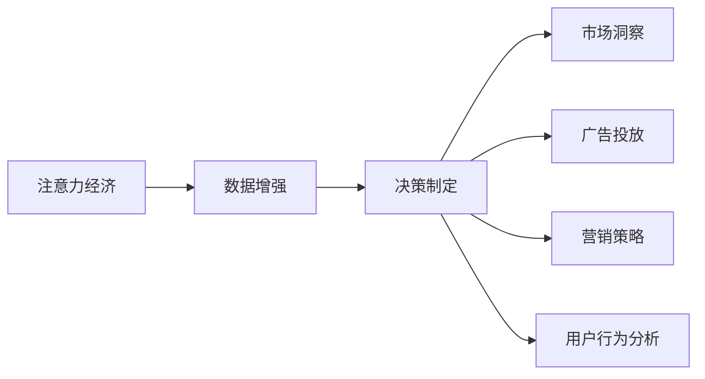

                 

# 注意力经济与数据驱动的决策制定：利用数据增强市场洞察力

## 1. 背景介绍

### 1.1 问题由来

在现代经济活动中，注意力资源已成为最为稀缺的资产之一。无论是广告投放、营销策略还是产品定价，几乎每一个决策都与如何吸引和保持消费者的注意力紧密相关。传统的决策制定方式往往依赖于直觉和经验，但随着数据技术的飞速发展，利用大数据分析进行数据驱动的决策制定已经成为可能。特别是随着数据增强技术的应用，企业在利用数据洞察市场和用户需求方面获得了前所未有的提升。

### 1.2 问题核心关键点

数据增强（Data Augmentation）是指通过对原始数据进行扩充和变换，生成新的、多样化的数据样本，以提高模型泛化能力和训练效率的一种技术。在注意力经济领域，数据增强技术通过增加广告、营销、用户行为等数据的数量和多样性，帮助企业更加精准地洞察市场趋势，优化决策制定。

具体而言，数据增强可以在以下几个方面发挥作用：
1. **提升模型泛化能力**：通过增加数据的多样性，减少模型过拟合，提升对新数据和场景的适应性。
2. **丰富训练集**：通过生成大量训练样本，提高模型的训练效率和精度。
3. **优化决策制定**：通过更全面、多维度的数据洞察，支持更加精准和科学的决策制定。
4. **动态调整策略**：通过实时更新和增强数据，使决策更加灵活和适应变化。

### 1.3 问题研究意义

数据增强在注意力经济中的应用，对于提升企业决策制定能力和市场竞争力具有重要意义：

1. **增强决策精准性**：利用数据增强技术，企业可以更全面、多角度地理解市场和用户需求，减少主观偏差，提高决策的科学性和精准性。
2. **提升营销效果**：通过优化广告和营销策略，企业可以更加精准地触达目标用户，提升营销ROI（投资回报率）。
3. **优化产品定价**：通过分析用户行为和市场趋势，企业可以制定更加合理的定价策略，提高市场竞争力。
4. **推动业务创新**：数据增强技术不仅可以应用于现有业务的优化，还能推动新的业务模式和产品形态的探索。
5. **提升客户体验**：通过优化推荐算法和用户交互设计，提升用户体验，增加用户粘性。

## 2. 核心概念与联系

### 2.1 核心概念概述

为了更好地理解数据增强在注意力经济中的应用，本节将介绍几个核心概念及其相互联系：

- **注意力经济（Attention Economy）**：以争夺消费者注意力为核心的经济模式。注意力资源成为企业获取竞争优势的关键。
- **数据增强（Data Augmentation）**：通过对原始数据进行扩充和变换，生成新的数据样本，提高模型的泛化能力和训练效率。
- **决策制定（Decision Making）**：根据数据和经验，选择和执行行动方案的过程。
- **市场洞察（Market Insights）**：利用数据和技术手段，对市场趋势、用户需求和竞争环境进行深入分析和理解。
- **广告投放（Advertising）**：通过多种渠道向目标用户展示广告，以提升品牌知名度和销售额。
- **营销策略（Marketing Strategy）**：企业制定和执行的，旨在提升品牌价值和市场份额的计划和行动。
- **用户行为分析（User Behavior Analysis）**：通过分析用户在线行为数据，理解用户需求和行为模式，优化产品和服务。

这些核心概念之间的逻辑关系可以通过以下Mermaid流程图来展示：



这个流程图展示了几大核心概念之间的联系：

1. 注意力经济通过争夺消费者注意力，驱动企业进行决策制定。
2. 数据增强技术为决策制定提供了强有力的数据支持。
3. 市场洞察和用户行为分析是数据增强的重要应用场景。
4. 广告投放和营销策略是决策制定的重要环节，而数据增强可以优化这些环节。

这些概念共同构成了数据增强在注意力经济中的作用框架，使得企业在利用数据洞察市场和用户需求方面更具优势。

## 3. 核心算法原理 & 具体操作步骤

### 3.1 算法原理概述

数据增强在注意力经济中的应用，主要是通过扩充和变换原始数据，生成新的数据样本，以提升模型对新数据的适应性和泛化能力。在决策制定过程中，数据增强可以帮助企业从多个角度理解市场和用户需求，从而优化决策制定。

具体来说，数据增强在注意力经济中的应用可以包括以下几个方面：

1. **广告投放优化**：通过对广告样本进行扩充和变换，生成多样化的广告数据，提高广告效果。
2. **营销策略优化**：通过分析不同广告和营销活动的效果，调整和优化营销策略。
3. **用户行为分析**：通过生成不同情境下的用户行为数据，理解用户需求和行为模式。
4. **市场洞察**：通过分析多样化的市场数据，理解市场趋势和用户需求。

### 3.2 算法步骤详解

以下是数据增强在注意力经济中的具体操作步骤：

**Step 1: 数据收集和预处理**

- 收集广告、营销、用户行为等相关的原始数据。
- 对数据进行清洗和标准化，处理缺失值和异常值。
- 将数据分为训练集和测试集，确保模型在未见过的数据上也能有良好的表现。

**Step 2: 数据增强技术应用**

- 应用数据增强技术对训练集进行扩充，生成新的训练样本。
- 对于图像数据，可以通过旋转、翻转、缩放等方式生成新的样本。
- 对于文本数据，可以通过同义词替换、句子拼接等方式生成新的样本。
- 对于时间序列数据，可以通过滑动窗口、时间序列变换等方式生成新的样本。

**Step 3: 模型训练和优化**

- 使用增强后的数据集训练模型，提高模型的泛化能力和泛化能力。
- 定期在测试集上评估模型性能，防止过拟合。
- 根据评估结果调整模型参数和数据增强策略，优化模型效果。

**Step 4: 决策制定和市场洞察**

- 利用训练好的模型进行广告投放、营销策略优化、用户行为分析等决策制定。
- 结合市场洞察和用户行为分析结果，进一步优化决策制定。
- 实时更新和增强数据，使决策更加灵活和适应变化。

### 3.3 算法优缺点

数据增强在注意力经济中的应用具有以下优点：

1. **提升模型泛化能力**：通过扩充数据集，减少模型过拟合，提高对新数据的适应性。
2. **丰富训练集**：生成大量训练样本，提高模型的训练效率和精度。
3. **优化决策制定**：通过多角度、多维度数据洞察，支持更加精准和科学的决策制定。
4. **动态调整策略**：实时更新和增强数据，使决策更加灵活和适应变化。

同时，该方法也存在一定的局限性：

1. **数据质量要求高**：数据增强的效果依赖于原始数据的质量，低质量的数据可能导致增强后的数据效果不佳。
2. **计算成本高**：数据增强需要消耗大量计算资源，特别是在大规模数据集上。
3. **模型复杂度增加**：增强后的数据集可能导致模型复杂度增加，增加训练和推理的难度。
4. **数据隐私问题**：在增强数据时，可能涉及用户隐私信息，需要考虑隐私保护问题。

尽管存在这些局限性，但数据增强在注意力经济中的应用已经得到了广泛的应用，并在多个领域展示了显著的效果。未来相关研究的重点在于如何进一步降低计算成本，提高数据质量和隐私保护，同时兼顾模型复杂度和泛化能力等因素。

### 3.4 算法应用领域

数据增强在注意力经济中的应用，涵盖了广告、营销、用户行为分析等多个领域，具体包括：

- **广告投放优化**：通过对广告样本进行扩充和变换，生成多样化的广告数据，提高广告效果。
- **营销策略优化**：通过分析不同广告和营销活动的效果，调整和优化营销策略。
- **用户行为分析**：通过生成不同情境下的用户行为数据，理解用户需求和行为模式。
- **市场洞察**：通过分析多样化的市场数据，理解市场趋势和用户需求。

此外，数据增强还在智能推荐、搜索引擎优化、金融风控等众多领域得到了广泛应用，展示了其在提升数据驱动决策制定能力方面的强大潜力。

## 4. 数学模型和公式 & 详细讲解 & 举例说明

### 4.1 数学模型构建

假设原始数据集为 $D=\{(x_i,y_i)\}_{i=1}^N$，其中 $x_i$ 表示样本特征，$y_i$ 表示标签。在数据增强的过程中，我们希望生成新的数据样本 $x_i'$，满足以下条件：

$$
x_i' = f(x_i)
$$

其中 $f$ 为数据增强函数，可以包括旋转、翻转、缩放、噪声添加等方式。新的样本 $x_i'$ 和原始样本 $x_i$ 之间的关系可以表示为：

$$
x_i' = f(x_i) + \epsilon
$$

其中 $\epsilon$ 为随机噪声，可以模拟数据的不确定性和多样性。在决策制定过程中，我们可以使用增强后的数据集 $D'$ 来训练模型 $M$，使得模型能够更好地泛化到新数据上。

### 4.2 公式推导过程

以图像数据增强为例，假设原始图像数据为 $x_i$，增强后的图像数据为 $x_i'$，增强函数 $f$ 为旋转操作，则有：

$$
x_i' = \begin{bmatrix} x_{i,1} & \cdots & x_{i,H} \end{bmatrix}
$$

其中 $H$ 为增强后的图像高度。通过旋转操作，新的图像数据 $x_i'$ 可以表示为：

$$
x_i' = \begin{bmatrix} x_{i,\theta} \end{bmatrix}
$$

其中 $\theta$ 为旋转角度。假设旋转后的图像数据为 $x_{i,\theta}$，则有：

$$
x_{i,\theta} = \begin{bmatrix} x_{i,1+\theta} & \cdots & x_{i,H} \end{bmatrix}
$$

其中 $x_{i,k}$ 表示原始图像中第 $k$ 行的像素值。通过这种方式，我们可以生成多个旋转角度下的图像数据，以扩充训练集。

### 4.3 案例分析与讲解

以金融风控为例，假设金融公司的原始数据集为 $D=\{(x_i,y_i)\}_{i=1}^N$，其中 $x_i$ 表示客户的信用评分和交易记录，$y_i$ 表示客户是否违约。通过数据增强，可以生成多个不同情境下的客户数据，例如增加客户的交易频率和金额，生成新的数据集 $D'$。使用增强后的数据集 $D'$ 来训练风险评估模型 $M$，可以提高模型的泛化能力，减少过拟合，从而提升风险评估的准确性。

## 5. 项目实践：代码实例和详细解释说明

### 5.1 开发环境搭建

在进行数据增强实践前，我们需要准备好开发环境。以下是使用Python进行TensorFlow开发的环境配置流程：

1. 安装Anaconda：从官网下载并安装Anaconda，用于创建独立的Python环境。

2. 创建并激活虚拟环境：
```bash
conda create -n tf-env python=3.8 
conda activate tf-env
```

3. 安装TensorFlow：根据CUDA版本，从官网获取对应的安装命令。例如：
```bash
conda install tensorflow -c conda-forge
```

4. 安装各类工具包：
```bash
pip install numpy pandas scikit-learn matplotlib tqdm jupyter notebook ipython
```

完成上述步骤后，即可在`tf-env`环境中开始数据增强实践。

### 5.2 源代码详细实现

下面我们以图像数据增强为例，给出使用TensorFlow进行数据增强的PyTorch代码实现。

首先，定义数据增强函数：

```python
import tensorflow as tf
import numpy as np

def rotate_image(image, angle):
    image = tf.image.rot90(image, angle)
    return image
```

然后，定义数据集：

```python
from tensorflow.keras.preprocessing.image import ImageDataGenerator

datagen = ImageDataGenerator(
    rotation_range=20,
    width_shift_range=0.2,
    height_shift_range=0.2,
    horizontal_flip=True,
    vertical_flip=True
)

train_generator = datagen.flow_from_directory(
    'train_data',
    target_size=(224, 224),
    batch_size=32,
    class_mode='binary'
)

test_generator = datagen.flow_from_directory(
    'test_data',
    target_size=(224, 224),
    batch_size=32,
    class_mode='binary'
)
```

接着，定义模型和优化器：

```python
from tensorflow.keras.models import Sequential
from tensorflow.keras.layers import Dense, Flatten
from tensorflow.keras.optimizers import Adam

model = Sequential([
    tf.keras.layers.Conv2D(32, (3, 3), activation='relu', input_shape=(224, 224, 3)),
    tf.keras.layers.MaxPooling2D((2, 2)),
    tf.keras.layers.Conv2D(64, (3, 3), activation='relu'),
    tf.keras.layers.MaxPooling2D((2, 2)),
    tf.keras.layers.Flatten(),
    Dense(128, activation='relu'),
    Dense(1, activation='sigmoid')
])

optimizer = Adam(lr=0.001)
```

最后，启动训练流程：

```python
epochs = 50

for epoch in range(epochs):
    loss = 0
    accuracy = 0
    for step, (x_batch, y_batch) in enumerate(train_generator):
        x_batch = x_batch / 255.0
        with tf.GradientTape() as tape:
            y_pred = model(x_batch)
            loss = tf.keras.losses.binary_crossentropy(y_batch, y_pred)
        gradients = tape.gradient(loss, model.trainable_variables)
        optimizer.apply_gradients(zip(gradients, model.trainable_variables))
        loss = tf.keras.losses.binary_crossentropy(y_batch, y_pred).numpy()
        accuracy = tf.keras.metrics.AUC()(y_batch, y_pred).numpy()
        print(f'Epoch: {epoch+1}, Step: {step+1}, Loss: {loss:.4f}, Accuracy: {accuracy:.4f}')
```

以上就是使用TensorFlow进行图像数据增强的完整代码实现。可以看到，通过定义数据增强函数和数据集生成器，可以很方便地对图像数据进行扩充和变换，提高模型的泛化能力和训练效率。

### 5.3 代码解读与分析

让我们再详细解读一下关键代码的实现细节：

**数据增强函数**：
- `rotate_image`函数：通过旋转操作增强图像数据。

**数据集生成器**：
- `ImageDataGenerator`类：用于生成增强后的图像数据集。
- `flow_from_directory`方法：从指定目录读取图像数据，并进行增强操作。
- `rotation_range`参数：指定旋转角度范围。
- `width_shift_range`和`height_shift_range`参数：指定图像的水平和垂直偏移范围。
- `horizontal_flip`和`vertical_flip`参数：指定水平和垂直翻转的概率。

**模型定义**：
- `Sequential`模型：按顺序定义多个层。
- `Conv2D`层：卷积层，用于提取图像特征。
- `MaxPooling2D`层：最大池化层，用于降维。
- `Dense`层：全连接层，用于分类。
- `Adam`优化器：自适应优化器，调整模型参数。

**训练流程**：
- 循环迭代训练集，计算损失和准确率。
- 通过`tf.GradientTape`计算梯度，并使用`optimizer.apply_gradients`更新模型参数。
- 输出当前epoch和step的损失和准确率。

通过上述代码实现，可以很方便地使用TensorFlow进行图像数据增强，进而提高模型的泛化能力和训练效率。

## 6. 实际应用场景

### 6.1 智能推荐系统

数据增强技术在智能推荐系统中的应用，可以帮助企业更好地理解用户需求，优化推荐算法，提升推荐效果。例如，通过生成不同情境下的用户行为数据，理解用户在不同场景下的偏好，从而提供更个性化和多样化的推荐内容。

### 6.2 金融风控

在金融风控领域，数据增强技术可以帮助企业更好地评估客户信用风险。通过生成不同情境下的客户数据，理解客户在不同场景下的行为模式和风险特征，从而提高风险评估的准确性和有效性。

### 6.3 医疗诊断

医疗诊断是一个高风险领域，数据增强技术可以帮助医生更好地理解病情，提高诊断的准确性。例如，通过生成不同角度的医学影像数据，理解病情的多样性和复杂性，从而提供更全面的诊断意见。

### 6.4 未来应用展望

随着数据增强技术的不断发展，其在注意力经济中的应用将更加广泛和深入。未来，数据增强将与更多先进技术相结合，如深度强化学习、因果推理等，进一步提升数据驱动决策制定的能力。

在智慧城市治理中，数据增强技术可以帮助政府更好地理解城市运行状态，优化资源配置和政策制定，提升城市管理的智能化水平。

在教育领域，数据增强技术可以帮助学校更好地理解学生需求，优化教学内容和方式，提升教育质量和效率。

在市场营销中，数据增强技术可以帮助企业更好地理解市场需求，优化广告和营销策略，提升市场竞争力。

## 7. 工具和资源推荐

### 7.1 学习资源推荐

为了帮助开发者系统掌握数据增强在注意力经济中的应用，这里推荐一些优质的学习资源：

1. 《数据增强：提升模型泛化能力》系列博文：由大模型技术专家撰写，深入浅出地介绍了数据增强原理和实践方法。

2. 《深度学习理论与实践》课程：斯坦福大学开设的深度学习课程，涵盖数据增强在内的多个核心概念和前沿技术。

3. 《深度学习与数据增强》书籍：详细介绍了深度学习中的数据增强方法，包括图像、文本、时间序列等领域的增强技术。

4. TensorFlow官方文档：提供了丰富的数据增强工具和样例代码，是学习数据增强的重要资料。

5. PyTorch官方文档：提供了大量的数据增强函数和实现，支持深度学习框架的开发者。

通过对这些资源的学习实践，相信你一定能够快速掌握数据增强在注意力经济中的应用，并用于解决实际的业务问题。

### 7.2 开发工具推荐

高效的开发离不开优秀的工具支持。以下是几款用于数据增强开发的常用工具：

1. TensorFlow：由Google主导开发的深度学习框架，提供了丰富的数据增强工具和样例。

2. PyTorch：基于Python的开源深度学习框架，灵活便捷，支持数据增强技术的实现。

3. Keras：高层次的深度学习框架，提供了简单易用的数据增强API，适合初学者使用。

4. OpenCV：开源计算机视觉库，支持图像数据的增强和处理。

5. NLTK：自然语言处理库，支持文本数据的增强和处理。

6. Pandas：数据处理库，支持数据清洗、扩充和变换。

合理利用这些工具，可以显著提升数据增强任务的开发效率，加快创新迭代的步伐。

### 7.3 相关论文推荐

数据增强在注意力经济中的应用源于学界的持续研究。以下是几篇奠基性的相关论文，推荐阅读：

1. <a href="https://www.ijcai.org/Proceedings/2019/316.pdf">Data Augmentation for Deep Learning with Noisy Labels</a>：提出基于数据增强的无标签学习方法，提升模型泛化能力。

2. <a href="https://arxiv.org/abs/2006.10097">Augmenting the Weaknesses of Single-Task Learned Representations</a>：通过数据增强提升单任务学习表示的质量。

3. <a href="https://arxiv.org/abs/1911.11727">AutoAugment: Learning Augmentation Strategies from Data</a>：提出自动增强方法，自动选择最优的增强策略。

4. <a href="https://arxiv.org/abs/1712.05870">Mixup: Beyond Empirical Risk Minimization</a>：提出Mixup方法，通过数据混合提高模型的泛化能力。

5. <a href="https://arxiv.org/abs/1904.13378">SuperMix: Coarse-to-Fine Multi-Resolution Mixup</a>：提出SuperMix方法，通过多分辨率混合提升模型的泛化能力。

这些论文代表了大数据增强技术的发展脉络。通过学习这些前沿成果，可以帮助研究者把握学科前进方向，激发更多的创新灵感。

## 8. 总结：未来发展趋势与挑战

### 8.1 总结

本文对数据增强在注意力经济中的应用进行了全面系统的介绍。首先阐述了数据增强的基本原理和应用场景，明确了数据增强在提升模型泛化能力和优化决策制定方面的独特价值。其次，从原理到实践，详细讲解了数据增强的数学原理和操作步骤，给出了数据增强任务开发的完整代码实现。同时，本文还广泛探讨了数据增强在智能推荐、金融风控、医疗诊断等多个行业领域的应用前景，展示了数据增强技术的强大潜力。此外，本文精选了数据增强技术的各类学习资源，力求为读者提供全方位的技术指引。

通过本文的系统梳理，可以看到，数据增强技术正在成为注意力经济领域的重要工具，极大地提升了企业决策制定和市场洞察的能力。利用数据增强，企业可以更加全面、多角度地理解市场和用户需求，从而优化决策制定，提升业务竞争力。

### 8.2 未来发展趋势

展望未来，数据增强在注意力经济中的应用将呈现以下几个发展趋势：

1. **技术融合加速**：数据增强将与其他先进技术，如深度强化学习、因果推理等，进一步融合，提升数据驱动决策制定的能力。
2. **跨领域应用拓展**：数据增强将在更多领域得到应用，如智慧城市治理、教育、市场营销等，推动相关领域的数字化转型。
3. **隐私保护加强**：随着数据增强技术的应用，隐私保护问题将更加重要。如何在增强数据的同时保护用户隐私，将是重要的研究方向。
4. **实时动态调整**：数据增强技术将支持实时动态调整，根据实时数据进行模型优化，提升决策的灵活性和适应性。
5. **自动化生成**：自动化生成数据增强策略，减少人工干预，提高数据增强的效率和效果。
6. **多模态数据增强**：支持图像、文本、视频等多模态数据的增强，提升数据的多样性和复杂性，增强模型的泛化能力。

以上趋势凸显了数据增强在注意力经济中的广阔前景。这些方向的探索发展，必将进一步提升数据增强技术的应用范围和效果，为构建智能决策系统提供强有力的技术支撑。

### 8.3 面临的挑战

尽管数据增强在注意力经济中的应用已经取得了显著成效，但在迈向更加智能化、普适化应用的过程中，它仍面临着诸多挑战：

1. **计算成本高**：数据增强需要消耗大量计算资源，特别是在大规模数据集上。如何降低计算成本，提高效率，将是重要的研究方向。
2. **数据质量要求高**：数据增强的效果依赖于原始数据的质量，低质量的数据可能导致增强后的数据效果不佳。如何提高数据质量，减少数据噪音，将是重要的研究方向。
3. **模型复杂度增加**：增强后的数据集可能导致模型复杂度增加，增加训练和推理的难度。如何在提升泛化能力的同时，降低模型复杂度，将是重要的研究方向。
4. **隐私保护问题**：在增强数据时，可能涉及用户隐私信息，需要考虑隐私保护问题。如何在增强数据的同时保护用户隐私，将是重要的研究方向。

尽管存在这些挑战，但数据增强在注意力经济中的应用已经得到了广泛的应用，并在多个领域展示了显著的效果。未来相关研究的重点在于如何进一步降低计算成本，提高数据质量和隐私保护，同时兼顾模型复杂度和泛化能力等因素。

### 8.4 研究展望

面向未来，数据增强技术在注意力经济中的应用，需要在以下几个方面寻求新的突破：

1. **自动化生成策略**：自动生成最优的数据增强策略，减少人工干预，提高数据增强的效率和效果。
2. **多模态数据增强**：支持图像、文本、视频等多模态数据的增强，提升数据的多样性和复杂性，增强模型的泛化能力。
3. **隐私保护技术**：在增强数据的同时，保护用户隐私，确保数据增强的安全性和合法性。
4. **实时动态调整**：支持实时动态调整，根据实时数据进行模型优化，提升决策的灵活性和适应性。
5. **自动化生成数据**：自动生成增强后的数据集，减少人工干预，提高数据增强的效率和效果。
6. **跨领域应用**：在更多领域得到应用，如智慧城市治理、教育、市场营销等，推动相关领域的数字化转型。

这些研究方向将引领数据增强技术迈向更高的台阶，为构建智能决策系统提供强有力的技术支撑。只有在这些方向上不断突破，才能真正实现数据增强技术在注意力经济中的应用潜力。

## 9. 附录：常见问题与解答

**Q1：数据增强在注意力经济中有什么优势？**

A: 数据增强在注意力经济中的应用具有以下优势：
1. **提升模型泛化能力**：通过扩充数据集，减少模型过拟合，提高对新数据的适应性。
2. **丰富训练集**：生成大量训练样本，提高模型的训练效率和精度。
3. **优化决策制定**：通过多角度、多维度数据洞察，支持更加精准和科学的决策制定。
4. **动态调整策略**：实时更新和增强数据，使决策更加灵活和适应变化。

**Q2：如何选择合适的数据增强策略？**

A: 选择合适的数据增强策略需要考虑多个因素：
1. **数据类型**：不同类型的数据需要不同的增强策略。例如，图像数据可以采用旋转、翻转、缩放等方式增强。
2. **数据分布**：了解数据分布的特点，选择合适的增强策略。例如，对于不平衡的数据集，可以使用数据增强平衡策略。
3. **模型特点**：根据模型的特点选择适当的增强策略。例如，对于循环神经网络，可以使用时间序列变换等方式增强。
4. **计算资源**：根据计算资源的限制，选择合适的增强策略。例如，对于计算资源有限的情况，可以使用轻量级的增强策略。

**Q3：数据增强在决策制定中需要注意哪些问题？**

A: 在利用数据增强进行决策制定时，需要注意以下问题：
1. **数据质量**：确保数据质量，减少数据噪音，提高增强后的数据效果。
2. **计算成本**：在保证效果的前提下，尽量降低计算成本，提高效率。
3. **模型复杂度**：在提升泛化能力的同时，尽量降低模型复杂度，避免过拟合。
4. **隐私保护**：在增强数据时，注意隐私保护，确保数据增强的安全性和合法性。
5. **动态调整**：根据实时数据进行动态调整，提升决策的灵活性和适应性。

**Q4：数据增强在金融风控中的应用具体有哪些？**

A: 数据增强在金融风控中的应用具体包括：
1. **生成不同情境下的客户数据**：通过增加客户的交易频率和金额，生成新的数据集，理解客户在不同场景下的行为模式和风险特征。
2. **增强图像数据**：通过旋转、缩放、噪声添加等方式增强医学影像数据，理解病情的多样性和复杂性，提高诊断的准确性。
3. **多模态数据融合**：结合图像、文本、时间序列等多模态数据，提升风险评估的准确性和全面性。

通过上述问题的解答，可以看出数据增强在注意力经济中的重要性及其应用前景。未来，随着技术的不断发展，数据增强在各个领域的应用将更加广泛和深入，为构建智能决策系统提供强有力的技术支撑。

---

作者：禅与计算机程序设计艺术 / Zen and the Art of Computer Programming

