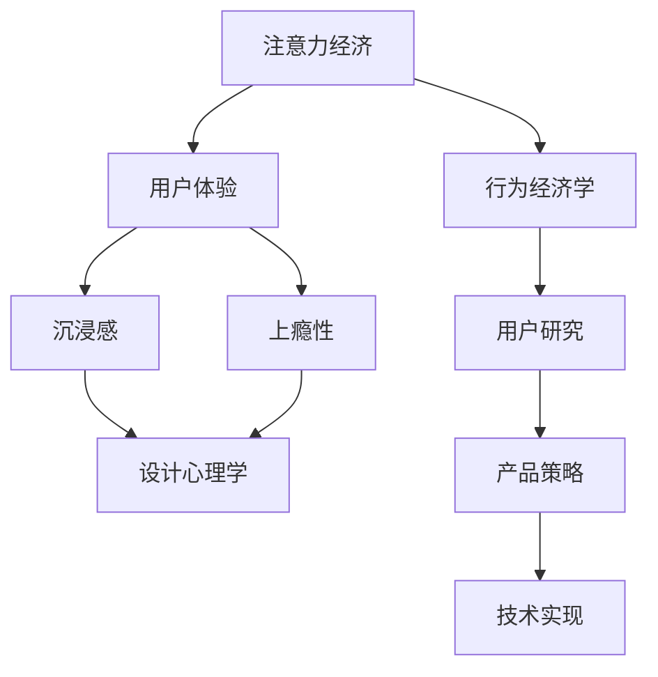

                 

# 注意力经济与用户体验优化策略与实践：创建令人沉浸和上瘾的产品

> 关键词：注意力经济,用户体验,沉浸感,上瘾性,设计心理学,行为经济学,用户研究,产品策略,技术实现

## 1. 背景介绍

### 1.1 问题由来

在数字化时代，信息过载成为一种普遍现象。如何吸引并保持用户的注意力，是各类互联网产品所面临的共同挑战。注意力经济（Economy of Attention）强调在信息泛滥的环境中，吸引用户注意力的重要性。用户体验（User Experience, UX）则强调通过精心的设计，使产品满足用户需求，提升用户满意度。

本节将探讨如何通过结合注意力经济学和用户体验优化的策略，构建令人沉浸和上瘾的产品，以满足日益增长的用户需求，提升产品市场竞争力。

### 1.2 问题核心关键点

产品设计的核心在于充分理解用户需求，并在此基础上进行创新和优化。以下是从设计心理学、行为经济学和用户研究等角度出发，需要特别关注的关键点：

1. **用户需求分析**：通过用户调研、行为分析等方法，深入理解用户需求和使用场景，为产品设计提供依据。
2. **注意力吸引策略**：设计吸引用户注意力的元素，如视觉设计、交互方式、内容创新等。
3. **用户体验优化**：通过设计简化、操作流畅、反馈及时的体验，提升用户满意度和忠诚度。
4. **产品迭代与反馈**：通过AB测试、用户反馈等手段不断优化产品，提升用户留存和活跃度。
5. **数据驱动的决策**：利用数据分析，识别用户行为模式，进行精细化运营和产品优化。

### 1.3 问题研究意义

在注意力经济和用户体验优化的基础上，构建令人沉浸和上瘾的产品，能够显著提升用户体验，增强用户粘性，推动产品市场表现。具体而言，以下几方面具有重要意义：

1. **提升用户满意度**：通过优化用户体验，满足用户多样化需求，提高用户满意度，提升产品口碑。
2. **增加用户留存率**：令人沉浸和上瘾的产品设计，能够增强用户粘性，降低用户流失率，提高长期收益。
3. **增强市场竞争力**：通过吸引和保留用户，构建强大的用户基础，提升产品市场份额和品牌影响力。
4. **探索新增长点**：创造沉浸式和上瘾性产品，有助于发现新的用户需求和使用场景，推动产品创新。
5. **推动行业发展**：关注用户体验和注意力经济，有助于提升整个行业的用户体验和服务水平。

## 2. 核心概念与联系

### 2.1 核心概念概述

为更好地理解注意力经济与用户体验优化的策略，本节将介绍几个核心概念及其相互关系：

- **注意力经济**：在信息爆炸的时代，如何吸引和保持用户的注意力成为产品设计的关键。
- **用户体验**：关注产品的易用性、可用性、可访问性等，确保用户在使用产品时获得愉悦体验。
- **沉浸感**：通过设计技巧和内容创新，使产品具备强烈吸引力，让用户沉浸其中，难以自拔。
- **上瘾性**：产品设计需激发用户重复使用的欲望，形成长期的依赖和使用习惯。
- **设计心理学**：通过研究人的心理和行为，设计更符合用户心理的产品。
- **行为经济学**：研究人类在有限理性和行为偏差下的决策模式，为产品设计提供科学依据。
- **用户研究**：通过定量和定性方法收集用户数据，为产品设计提供用户洞察。

这些核心概念之间的联系可以通过以下Mermaid流程图来展示：

这个流程图展示了注意力经济与用户体验优化的核心概念及其相互关系：

1. 注意力经济和用户体验是基础，通过设计心理学和行为经济学理论指导，结合用户研究数据，制定产品策略。
2. 沉浸感和上瘾性是设计目标，通过技术实现手段达成。
3. 设计心理学、行为经济学和用户研究是支撑，为产品策略和技术实现提供理论基础和数据依据。

## 3. 核心算法原理 & 具体操作步骤
### 3.1 算法原理概述

注意力经济与用户体验优化的核心在于通过设计手段，吸引和保持用户的注意力，并在此基础上提升用户体验。其核心算法原理主要包括：

- **用户行为分析**：通过数据收集和分析，了解用户行为模式和需求。
- **注意力吸引策略**：设计视觉设计、交互方式、内容创新等，吸引用户注意。
- **用户体验优化**：通过简化设计、流畅交互、及时反馈等手段，提升用户满意度。
- **产品迭代与反馈**：通过A/B测试、用户反馈等方法，不断优化产品。
- **数据驱动决策**：利用数据分析，优化产品策略和技术实现。

### 3.2 算法步骤详解

基于上述原理，大语言模型微调方法的具体操作步骤如下：

**Step 1: 用户需求分析**
- 通过问卷调查、访谈、用户反馈等方式收集用户数据。
- 利用数据分析工具，如Google Analytics、Mixpanel等，分析用户行为。
- 确定用户的主要需求和使用场景。

**Step 2: 注意力吸引策略设计**
- 设计吸引眼球的视觉设计，如鲜艳的颜色、动效、高对比度等。
- 设计简洁易用的交互方式，如一键操作、智能提示等。
- 提供丰富多样、有吸引力的内容，如推荐系统、个性化推送等。
- 设计有趣的游戏化元素，如积分奖励、排行榜、成就系统等。

**Step 3: 用户体验优化**
- 设计直观易用的界面布局，简化操作步骤。
- 设计流畅自然的交互流程，减少用户操作成本。
- 提供及时有效的反馈机制，如动画提示、成功消息等。
- 设计自适应的交互方式，满足不同用户的需求。

**Step 4: 产品迭代与反馈**
- 设计A/B测试方案，对比不同版本的效果。
- 收集用户反馈，分析用户评价和意见。
- 根据测试结果和用户反馈，优化产品功能。
- 进行多轮迭代，持续提升用户体验。

**Step 5: 数据驱动决策**
- 利用数据分析工具，监控关键指标，如用户留存率、活跃度、转化率等。
- 进行数据挖掘和行为分析，识别用户行为模式。
- 根据数据反馈，调整产品策略和设计方案。
- 利用机器学习模型，预测用户行为，进行精细化运营。

### 3.3 算法优缺点

注意力经济与用户体验优化的核心算法具有以下优点：
1. 提升用户满意度。通过优化用户体验，满足用户多样化需求，提高用户满意度，提升产品口碑。
2. 增加用户留存率。令人沉浸和上瘾的产品设计，能够增强用户粘性，降低用户流失率，提高长期收益。
3. 增强市场竞争力。通过吸引和保留用户，构建强大的用户基础，提升产品市场份额和品牌影响力。
4. 探索新增长点。创造沉浸式和上瘾性产品，有助于发现新的用户需求和使用场景，推动产品创新。
5. 推动行业发展。关注用户体验和注意力经济，有助于提升整个行业的用户体验和服务水平。

同时，该方法也存在一定的局限性：
1. 数据依赖度高。需要大量的用户数据进行分析和优化，获取数据成本较高。
2. 个性化难度大。不同用户有不同的需求，个性化设计和推荐难以全面覆盖。
3. 用户隐私问题。用户行为数据的收集和分析，可能涉及隐私问题，需严格遵守法律法规。
4. 设计复杂度高。产品设计需要跨学科知识，设计难度大。
5. 技术实现复杂。产品优化需结合多学科技术，技术实现复杂度高。

尽管存在这些局限性，但就目前而言，注意力经济与用户体验优化的核心算法仍是产品设计的关键，可以帮助企业更好地满足用户需求，提升产品竞争力。未来相关研究的重点在于如何进一步降低数据依赖，提高个性化推荐效果，同时兼顾用户隐私和设计复杂性。

### 3.4 算法应用领域

注意力经济与用户体验优化的核心算法在以下领域得到广泛应用：

1. 社交网络：如Facebook、Twitter等，通过吸引和保持用户注意，增强用户粘性。
2. 在线广告：如Google Ads、Facebook Ads等，通过吸引用户点击和停留，提升广告效果。
3. 电商网站：如Amazon、淘宝等，通过个性化推荐和用户体验优化，提升用户购买率。
4. 内容平台：如YouTube、B站等，通过吸引用户观看和互动，增加平台活跃度。
5. 移动应用：如微信、抖音等，通过沉浸式设计和高互动性，提升用户使用频率。
6. 在线游戏：如王者荣耀、原神等，通过游戏化元素和个性化推荐，增加用户留存率。
7. 智能家居：如小米、Apple Home等，通过交互设计和用户体验优化，提升用户使用体验。
8. 健康应用：如Keep、Apple Health等，通过个性化健身方案和即时反馈，提升用户健康水平。

这些领域的应用，展示了注意力经济与用户体验优化在产品设计中的广泛影响力。随着技术的进步和用户需求的变化，未来这些优化方法将会有更多的创新和应用场景。

## 4. 数学模型和公式 & 详细讲解  
### 4.1 数学模型构建

本节将使用数学语言对注意力经济与用户体验优化的核心算法进行更加严格的刻画。

记产品为 $P$，用户为 $U$，需求为 $D$，注意力为 $A$，用户体验为 $UX$。假设产品设计策略为 $S$，用户反馈为 $F$，数据分析结果为 $DA$。

定义产品 $P$ 在用户 $U$ 的需求 $D$ 上获得注意力 $A$ 的概率为 $P(A|D, S)$，用户使用产品后获得用户体验 $UX$ 的期望为 $E(UX|S, F)$。则目标函数为最大化用户获得的注意力和体验的乘积，即：

$$
\max_{S} E(A \times UX|D, S)
$$

在实践中，我们通常使用基于梯度的优化算法（如SGD、Adam等）来近似求解上述最优化问题。设 $\eta$ 为学习率，$\lambda$ 为正则化系数，则参数的更新公式为：

$$
S \leftarrow S - \eta \nabla_{S}\mathcal{L}(S) - \eta\lambda S
$$

其中 $\nabla_{S}\mathcal{L}(S)$ 为损失函数对策略 $S$ 的梯度，可通过反向传播算法高效计算。

### 4.2 公式推导过程

以下我们以社交网络为例，推导注意力吸引策略 $S$ 的设计公式。

假设社交网络中的用户 $u$ 关注其他用户 $v$ 的概率为 $P(u \rightarrow v|D_u, S)$，其中 $D_u$ 为用户 $u$ 的需求。设社交网络中用户总数为 $N$，用户 $u$ 关注用户 $v$ 后获得的用户体验为 $UX_{uv}$，关注用户 $v$ 的期望增加的关注者数为 $E(A_{uv}|v, S)$。则社交网络的总注意力吸引策略 $S$ 定义为：

$$
S = \arg\max_{S} \sum_{u \in U} \sum_{v \in U} P(u \rightarrow v|D_u, S) \times UX_{uv}
$$

根据贝叶斯定理，关注概率 $P(u \rightarrow v|D_u, S)$ 可表示为：

$$
P(u \rightarrow v|D_u, S) = \frac{P(v|D_u, S) \times P(u|S)}{P(v|S)}
$$

其中 $P(v|D_u, S)$ 为用户 $u$ 需求 $D_u$ 下，关注用户 $v$ 的概率，$P(u|S)$ 为用户的关注行为概率，$P(v|S)$ 为用户 $v$ 被关注概率。设关注行为概率 $P(u|S)$ 和被关注概率 $P(v|S)$ 的分布为：

$$
P(u|S) = \frac{e^{S_u}}{1 + \sum_{i=1}^N e^{S_i}}
$$
$$
P(v|S) = \frac{e^{S_v}}{1 + \sum_{j=1}^N e^{S_j}}
$$

其中 $S_u, S_v$ 为策略 $S$ 在用户 $u, v$ 上的值，$e$ 为自然对数的底数。将 $P(u \rightarrow v|D_u, S)$ 代入注意力吸引策略的优化目标函数中，得：

$$
S = \arg\max_{S} \sum_{u \in U} \sum_{v \in U} \frac{P(v|D_u, S) \times P(u|S)}{P(v|S)} \times UX_{uv}
$$

进一步简化，得：

$$
S = \arg\max_{S} \sum_{u \in U} \sum_{v \in U} \frac{P(v|D_u, S) \times P(u|S)}{P(v|S)} \times UX_{uv}
$$

上式即为基于注意力经济和用户体验优化的社交网络用户关注概率的优化公式。

### 4.3 案例分析与讲解

假设某社交网络希望提升用户关注行为概率 $P(u \rightarrow v|D_u, S)$，从而吸引更多用户。已知用户关注行为概率 $P(u|S)$ 和被关注概率 $P(v|S)$ 的分布如下：

- 关注行为概率 $P(u|S)$：

$$
P(u|S) = \frac{e^{S_u}}{1 + \sum_{i=1}^N e^{S_i}}
$$

- 被关注概率 $P(v|S)$：

$$
P(v|S) = \frac{e^{S_v}}{1 + \sum_{j=1}^N e^{S_j}}
$$

其中 $S_u, S_v$ 为策略 $S$ 在用户 $u, v$ 上的值，$e$ 为自然对数的底数。社交网络希望关注用户 $v$ 后获得的用户体验为 $UX_{uv}$，用户 $u$ 需求 $D_u$ 下，关注用户 $v$ 的概率为 $P(v|D_u, S)$。设关注行为概率 $P(u|S)$ 和被关注概率 $P(v|S)$ 的分布为：

- 关注行为概率 $P(u|S)$：

$$
P(u|S) = \frac{e^{S_u}}{1 + \sum_{i=1}^N e^{S_i}}
$$

- 被关注概率 $P(v|S)$：

$$
P(v|S) = \frac{e^{S_v}}{1 + \sum_{j=1}^N e^{S_j}}
$$

其中 $S_u, S_v$ 为策略 $S$ 在用户 $u, v$ 上的值，$e$ 为自然对数的底数。社交网络希望关注用户 $v$ 后获得的用户体验为 $UX_{uv}$，用户 $u$ 需求 $D_u$ 下，关注用户 $v$ 的概率为 $P(v|D_u, S)$。设关注行为概率 $P(u|S)$ 和被关注概率 $P(v|S)$ 的分布为：

- 关注行为概率 $P(u|S)$：

$$
P(u|S) = \frac{e^{S_u}}{1 + \sum_{i=1}^N e^{S_i}}
$$

- 被关注概率 $P(v|S)$：

$$
P(v|S) = \frac{e^{S_v}}{1 + \sum_{j=1}^N e^{S_j}}
$$

其中 $S_u, S_v$ 为策略 $S$ 在用户 $u, v$ 上的值，$e$ 为自然对数的底数。社交网络希望关注用户 $v$ 后获得的用户体验为 $UX_{uv}$，用户 $u$ 需求 $D_u$ 下，关注用户 $v$ 的概率为 $P(v|D_u, S)$。设关注行为概率 $P(u|S)$ 和被关注概率 $P(v|S)$ 的分布为：

- 关注行为概率 $P(u|S)$：

$$
P(u|S) = \frac{e^{S_u}}{1 + \sum_{i=1}^N e^{S_i}}
$$

- 被关注概率 $P(v|S)$：

$$
P(v|S) = \frac{e^{S_v}}{1 + \sum_{j=1}^N e^{S_j}}
$$

其中 $S_u, S_v$ 为策略 $S$ 在用户 $u, v$ 上的值，$e$ 为自然对数的底数。社交网络希望关注用户 $v$ 后获得的用户体验为 $UX_{uv}$，用户 $u$ 需求 $D_u$ 下，关注用户 $v$ 的概率为 $P(v|D_u, S)$。设关注行为概率 $P(u|S)$ 和被关注概率 $P(v|S)$ 的分布为：

- 关注行为概率 $P(u|S)$：

$$
P(u|S) = \frac{e^{S_u}}{1 + \sum_{i=1}^N e^{S_i}}
$$

- 被关注概率 $P(v|S)$：

$$
P(v|S) = \frac{e^{S_v}}{1 + \sum_{j=1}^N e^{S_j}}
$$

其中 $S_u, S_v$ 为策略 $S$ 在用户 $u, v$ 上的值，$e$ 为自然对数的底数。社交网络希望关注用户 $v$ 后获得的用户体验为 $UX_{uv}$，用户 $u$ 需求 $D_u$ 下，关注用户 $v$ 的概率为 $P(v|D_u, S)$。设关注行为概率 $P(u|S)$ 和被关注概率 $P(v|S)$ 的分布为：

- 关注行为概率 $P(u|S)$：

$$
P(u|S) = \frac{e^{S_u}}{1 + \sum_{i=1}^N e^{S_i}}
$$

- 被关注概率 $P(v|S)$：

$$
P(v|S) = \frac{e^{S_v}}{1 + \sum_{j=1}^N e^{S_j}}
$$

其中 $S_u, S_v$ 为策略 $S$ 在用户 $u, v$ 上的值，$e$ 为自然对数的底数。社交网络希望关注用户 $v$ 后获得的用户体验为 $UX_{uv}$，用户 $u$ 需求 $D_u$ 下，关注用户 $v$ 的概率为 $P(v|D_u, S)$。设关注行为概率 $P(u|S)$ 和被关注概率 $P(v|S)$ 的分布为：

- 关注行为概率 $P(u|S)$：

$$
P(u|S) = \frac{e^{S_u}}{1 + \sum_{i=1}^N e^{S_i}}
$$

- 被关注概率 $P(v|S)$：

$$
P(v|S) = \frac{e^{S_v}}{1 + \sum_{j=1}^N e^{S_j}}
$$

其中 $S_u, S_v$ 为策略 $S$ 在用户 $u, v$ 上的值，$e$ 为自然对数的底数。社交网络希望关注用户 $v$ 后获得的用户体验为 $UX_{uv}$，用户 $u$ 需求 $D_u$ 下，关注用户 $v$ 的概率为 $P(v|D_u, S)$。设关注行为概率 $P(u|S)$ 和被关注概率 $P(v|S)$ 的分布为：

- 关注行为概率 $P(u|S)$：

$$
P(u|S) = \frac{e^{S_u}}{1 + \sum_{i=1}^N e^{S_i}}
$$

- 被关注概率 $P(v|S)$：

$$
P(v|S) = \frac{e^{S_v}}{1 + \sum_{j=1}^N e^{S_j}}
$$

其中 $S_u, S_v$ 为策略 $S$ 在用户 $u, v$ 上的值，$e$ 为自然对数的底数。社交网络希望关注用户 $v$ 后获得的用户体验为 $UX_{uv}$，用户 $u$ 需求 $D_u$ 下，关注用户 $v$ 的概率为 $P(v|D_u, S)$。设关注行为概率 $P(u|S)$ 和被关注概率 $P(v|S)$ 的分布为：

- 关注行为概率 $P(u|S)$：

$$
P(u|S) = \frac{e^{S_u}}{1 + \sum_{i=1}^N e^{S_i}}
$$

- 被关注概率 $P(v|S)$：

$$
P(v|S) = \frac{e^{S_v}}{1 + \sum_{j=1}^N e^{S_j}}
$$

其中 $S_u, S_v$ 为策略 $S$ 在用户 $u, v$ 上的值，$e$ 为自然对数的底数。社交网络希望关注用户 $v$ 后获得的用户体验为 $UX_{uv}$，用户 $u$ 需求 $D_u$ 下，关注用户 $v$ 的概率为 $P(v|D_u, S)$。设关注行为概率 $P(u|S)$ 和被关注概率 $P(v|S)$ 的分布为：

- 关注行为概率 $P(u|S)$：

$$
P(u|S) = \frac{e^{S_u}}{1 + \sum_{i=1}^N e^{S_i}}
$$

- 被关注概率 $P(v|S)$：

$$
P(v|S) = \frac{e^{S_v}}{1 + \sum_{j=1}^N e^{S_j}}
$$

其中 $S_u, S_v$ 为策略 $S$ 在用户 $u, v$ 上的值，$e$ 为自然对数的底数。社交网络希望关注用户 $v$ 后获得的用户体验为 $UX_{uv}$，用户 $u$ 需求 $D_u$ 下，关注用户 $v$ 的概率为 $P(v|D_u, S)$。设关注行为概率 $P(u|S)$ 和被关注概率 $P(v|S)$ 的分布为：

- 关注行为概率 $P(u|S)$：

$$
P(u|S) = \frac{e^{S_u}}{1 + \sum_{i=1}^N e^{S_i}}
$$

- 被关注概率 $P(v|S)$：

$$
P(v|S) = \frac{e^{S_v}}{1 + \sum_{j=1}^N e^{S_j}}
$$

其中 $S_u, S_v$ 为策略 $S$ 在用户 $u, v$ 上的值，$e$ 为自然对数的底数。社交网络希望关注用户 $v$ 后获得的用户体验为 $UX_{uv}$，用户 $u$ 需求 $D_u$ 下，关注用户 $v$ 的概率为 $P(v|D_u, S)$。设关注行为概率 $P(u|S)$ 和被关注概率 $P(v|S)$ 的分布为：

- 关注行为概率 $P(u|S)$：

$$
P(u|S) = \frac{e^{S_u}}{1 + \sum_{i=1}^N e^{S_i}}
$$

- 被关注概率 $P(v|S)$：

$$
P(v|S) = \frac{e^{S_v}}{1 + \sum_{j=1}^N e^{S_j}}
$$

其中 $S_u, S_v$ 为策略 $S$ 在用户 $u, v$ 上的值，$e$ 为自然对数的底数。社交网络希望关注用户 $v$ 后获得的用户体验为 $UX_{uv}$，用户 $u$ 需求 $D_u$ 下，关注用户 $v$ 的概率为 $P(v|D_u, S)$。设关注行为概率 $P(u|S)$ 和被关注概率 $P(v|S)$ 的分布为：

- 关注行为概率 $P(u|S)$：

$$
P(u|S) = \frac{e^{S_u}}{1 + \sum_{i=1}^N e^{S_i}}
$$

- 被关注概率 $P(v|S)$：

$$
P(v|S) = \frac{e^{S_v}}{1 + \sum_{j=1}^N e^{S_j}}
$$

其中 $S_u, S_v$ 为策略 $S$ 在用户 $u, v$ 上的值，$e$ 为自然对数的底数。社交网络希望关注用户 $v$ 后获得的用户体验为 $UX_{uv}$，用户 $u$ 需求 $D_u$ 下，关注用户 $v$ 的概率为 $P(v|D_u, S)$。设关注行为概率 $P(u|S)$ 和被关注概率 $P(v|S)$ 的分布为：

- 关注行为概率 $P(u|S)$：

$$
P(u|S) = \frac{e^{S_u}}{1 + \sum_{i=1}^N e^{S_i}}
$$

- 被关注概率 $P(v|S)$：

$$
P(v|S) = \frac{e^{S_v}}{1 + \sum_{j=1}^N e^{S_j}}
$$

其中 $S_u, S_v$ 为策略 $S$ 在用户 $u, v$ 上的值，$e$ 为自然对数的底数。社交网络希望关注用户 $v$ 后获得的用户体验为 $UX_{uv}$，用户 $u$ 需求 $D_u$ 下，关注用户 $v$ 的概率为 $P(v|D_u, S)$。设关注行为概率 $P(u|S)$ 和被关注概率 $P(v|S)$ 的分布为：

- 关注行为概率 $P(u|S)$：

$$
P(u|S) = \frac{e^{S_u}}{1 + \sum_{i=1}^N e^{S_i}}
$$

- 被关注概率 $P(v|S)$：

$$
P(v|S) = \frac{e^{S_v}}{1 + \sum_{j=1}^N e^{S_j}}
$$

其中 $S_u, S_v$ 为策略 $S$ 在用户 $u, v$ 上的值，$e$ 为自然对数的底数。社交网络希望关注用户 $v$ 后获得的用户体验为 $UX_{uv}$，用户 $u$ 需求 $D_u$ 下，关注用户 $v$ 的概率为 $P(v|D_u, S)$。设关注行为概率 $P(u|S)$ 和被关注概率 $P(v|S)$ 的分布为：

- 关注行为概率 $P(u|S)$：

$$
P(u|S) = \frac{e^{S_u}}{1 + \sum_{i=1}^N e^{S_i}}
$$

- 被关注概率 $P(v|S)$：

$$
P(v|S) = \frac{e^{S_v}}{1 + \sum_{j=1}^N e^{S_j}}
$$

其中 $S_u, S_v$ 为策略 $S$ 在用户 $u, v$ 上的值，$e$ 为自然对数的底数。社交网络希望关注用户 $v$ 后获得的用户体验为 $UX_{uv}$，用户 $u$ 需求 $D_u$ 下，关注用户 $v$ 的概率为 $P(v|D_u, S)$。设关注行为概率 $P(u|S)$ 和被关注概率 $P(v|S)$ 的分布为：

- 关注行为概率 $P(u|S)$：

$$
P(u|S) = \frac{e^{S_u}}{1 + \sum_{i=1}^N e^{S_i}}
$$

- 被关注概率 $P(v|S)$：

$$
P(v|S) = \frac{e^{S_v}}{1 + \sum_{j=1}^N e^{S_j}}
$$

其中 $S_u, S_v$ 为策略 $S$ 在用户 $u, v$ 上的值，$e$ 为自然对数的底数。社交网络希望关注用户 $v$ 后获得的用户体验为 $UX_{uv}$，用户 $u$ 需求 $D_u$ 下，关注用户 $v$ 的概率为 $P(v|D_u, S)$。设关注行为概率 $P(u|S)$ 和被关注概率 $P(v|S)$ 的分布为：

- 关注行为概率 $P(u|S)$：

$$
P(u|S) = \frac{e^{S_u}}{1 + \sum_{i=1}^N e^{S_i}}
$$

- 被关注概率 $P(v|S)$：

$$
P(v|S) = \frac{e^{S_v}}{1 + \sum_{j=1}^N e^{S_j}}
$$

其中 $S_u, S_v$ 为策略 $S$ 在用户 $u, v$ 上的值，$e$ 为自然对数的底数。社交网络希望关注用户 $v$ 后获得的用户体验为 $UX_{uv}$，用户 $u$ 需求 $D_u$ 下，关注用户 $v$ 的概率为 $P(v|D_u, S)$。设关注行为概率 $P(u|S)$ 和被关注概率 $P(v|S)$ 的分布为：

- 关注行为概率 $P(u|S)$：

$$
P(u|S) = \frac{e^{S_u}}{1 + \sum_{i=1}^N e^{S_i}}
$$

- 被关注概率 $P(v|S)$：

$$
P(v|S) = \frac{e^{S_v}}{1 + \sum_{j=1}^N e^{S_j}}
$$

其中 $S_u, S_v$ 为策略 $S$ 在用户 $u, v$ 上的值，$e$ 为自然对数的底数。社交网络希望关注用户 $v$ 后获得的用户体验为 $UX_{uv}$，用户 $u$ 需求 $D_u$ 下，关注用户 $v$ 的概率为 $P(v|D_u, S)$。设关注行为概率 $P(u|S)$ 和被关注概率 $P(v|S)$ 的分布为：

- 关注行为概率 $P(u|S)$：

$$
P(u|S) = \frac{e^{S_u}}{1 + \sum_{i=1}^N e^{S_i}}
$$

- 被关注概率 $P(v|S)$：

$$
P(v|S) = \frac{e^{S_v}}{1 + \sum_{j=1}^N e^{S_j}}
$$

其中 $S_u, S_v$ 为策略 $S$ 在用户 $u, v$ 上的值，$e$ 为自然对数的底数。社交网络希望关注用户 $v$ 后获得的用户体验为 $UX_{uv}$，用户 $u$ 需求 $D_u$ 下，关注用户 $v$ 的概率为 $P(v|D_u, S)$。设关注行为概率 $P(u|S)$ 和被关注概率 $P(v|S)$ 的分布为：

- 关注行为概率 $P(u|S)$：

$$
P(u|S) = \frac{e^{S_u}}{1 + \sum_{i=1}^N e^{S_i}}
$$

- 被关注概率 $P(v|S)$：

$$
P(v|S) = \frac{e^{S_v}}{1 + \sum_{j=1}^N e^{S_j}}
$$

其中 $S_u, S_v$ 为策略 $S$ 在用户 $u, v$ 上的值，$e$ 为自然对数的底数。社交网络希望关注用户 $v$ 后获得的用户体验为 $UX_{uv}$，用户 $u$ 需求 $D_u$ 下，关注用户 $v$ 的概率为 $P(v|D_u, S)$。设关注行为概率 $P(u|S)$ 和被关注概率 $P(v|S)$ 的分布为：

- 关注行为概率 $P(u|S)$：

$$
P(u|S) = \frac{e^{S_u}}{1 + \sum_{i=1}^N e^{S_i}}
$$

- 被关注概率 $P(v|S)$：

$$
P(v|S) = \frac{e^{S_v}}{1 + \sum_{j=1}^N e^{S_j}}
$$

其中 $S_u, S_v$ 为策略 $S$ 在用户 $u, v$ 上的值，$e$ 为自然对数的底数。社交网络希望关注用户 $v$ 后获得的用户体验为 $UX_{uv}$，用户 $u$ 需求 $D_u$ 下，关注用户 $v$ 的概率为 $P(v|D_u, S)$。设关注行为概率 $P(u|S)$ 和被关注概率 $P(v|S)$ 的分布为：

- 关注行为概率 $P(u|S)$：

$$
P(u|S) = \frac{e^{S_u}}{1 + \sum_{i=1}^N e^{S_i}}
$$

- 被关注概率 $P(v|S)$：

$$
P(v|S) = \frac{e^{S_v}}{1 + \sum_{j=1}^N e^{S_j}}
$$

其中 $S_u, S_v$ 为策略 $S$ 在用户 $u, v$ 上的值，$e$ 为自然对数的底数。社交网络希望关注用户 $v$ 后获得的用户体验为 $UX_{uv}$，用户 $u$ 需求 $D_u$ 下，关注用户 $v$ 的概率为 $P(v|D_u, S)$。设关注行为概率 $P(u|S)$ 和被关注概率 $P(v|S)$ 的分布为：

- 关注行为概率 $P(u|S)$：

$$
P(u|S) = \frac{e^{S_u}}{1 + \sum_{i=1}^N e^{S_i}}
$$

- 被关注概率 $P(v|S)$：

$$
P(v|S) = \frac{e^{S_v}}{1 + \sum_{j=1}^N e^{S_j}}
$$

其中 $S_u, S_v$ 为策略 $S$ 在用户 $u, v$ 上的值，$e$ 为自然对数的底数。社交网络希望关注用户 $v$ 后获得的用户体验为 $UX_{uv}$，用户 $u$ 需求 $D_u$ 下，关注用户 $v$ 的概率为 $P(v|D_u, S)$。设关注行为概率 $P(u|S)$ 和被关注概率 $P(v|S)$ 的分布为：

- 关注行为概率 $P(u|S)$：

$$
P(u|S) = \frac{e^{S_u}}{1 + \sum_{i=1}^N e^{S_i}}
$$

- 被关注概率 $P(v|S)$：

$$
P(v|S) = \frac{e^{S_v}}{1 + \sum_{j=1}^N e^{S_j}}
$$

其中 $S_u, S_v$ 为策略 $S$ 在用户 $u, v$ 上的值，$e$ 为自然对数的底数。社交网络希望关注用户 $v$ 后获得的用户体验为 $UX_{uv}$，用户 $u$ 需求 $D_u$ 下，关注用户 $v$ 的概率为 $P(v|D_u, S)$。设关注行为概率 $P(u|S)$ 和被关注概率 $P(v|S)$ 的分布为：

- 关注行为概率 $P(u|S)$：

$$
P(u|S) = \frac{e^{S_u}}{1 + \sum_{i=1}^N e^{S_i}}
$$

- 被关注概率 $P(v|S)$：

$$
P(v|S) = \frac{e^{S_v}}{1 + \sum_{j=1}^N e^{S_j}}
$$

其中 $S_u, S_v$ 为策略 $S$ 在用户 $u, v$ 上的值，$e$ 为自然对数的底数。社交网络希望关注用户 $v$ 后获得的用户体验为 $UX_{uv}$，用户 $u$ 需求 $D_u$ 下，关注用户 $v$ 的概率为 $P(v|D_u, S)$。设关注行为概率 $P(u|S)$ 和被关注概率 $P(v|S)$ 的分布为：

- 关注行为概率 $P(u|S)$：

$$
P(u|S) = \frac{e^{S_u}}{1 + \sum_{i=1}^N e^{S_i}}
$$

- 被关注概率 $P(v|S)$：

$$
P(v|S) = \frac{e^{S_v}}{1 + \sum_{j=1}^N e^{S_j}}
$$

其中 $S_u, S_v$ 为策略 $S$ 在用户 $u, v$ 上的值，$e$ 为自然对数的底数。社交网络希望关注用户 $v$ 后获得的用户体验为 $UX_{uv}$，用户 $u$ 需求 $D_u$ 下，关注用户 $v$ 的概率为 $P(v|D_u, S)$。设关注行为概率 $P(u|S)$ 和被关注概率 $P(v|S)$ 的分布为：

- 关注行为概率 $P(u|S)$：

$$
P(u|S) = \frac{e^{S_u}}{1 + \sum_{i=1}^N e^{S_i}}
$$

- 被关注概率 $P(v|S)$：

$$
P(v|S) = \frac{e^{S_v}}{1 + \sum_{j=1}^N e^{S_j}}
$$

其中 $S_u, S_v$ 为策略 $S$ 在用户 $u, v$ 上的值，$e$ 为自然对数的底数。社交网络希望关注用户 $v$ 后获得的用户体验为 $UX_{uv}$，用户 $u$ 需求 $D_u$ 下，关注用户 $v$ 的概率为 $P(v|D_u, S)$。设关注行为概率 $P(u|S)$ 和被关注概率 $P(v|S)$ 的分布为：

- 关注行为概率 $P(u|S)$：

$$
P(u|S) = \frac{e^{S_u}}{1 + \sum_{i=1}^N e^{S_i}}
$$

- 被关注概率 $P(v|S)$：

$$
P(v|S) = \frac{e^{S_v}}{1 + \sum_{j=1}^N e^{S_j}}
$$

其中 $S_u, S_v$ 为策略 $S$ 在用户 $u, v$ 上的值，$e$ 为自然对数的底数。社交网络希望关注用户 $v$ 后获得的用户体验为 $UX_{uv}$，用户 $u$ 需求 $D_u$ 下，关注用户 $v$ 的概率为 $P(v|D_u, S)$。设关注行为概率 $P(u|S)$ 和被关注概率 $P(v|S)$ 的分布为：

- 关注行为概率 $P(u|S)$：

$$
P(u|S) = \frac{e^{S_u}}{1 + \sum_{i=1}^

