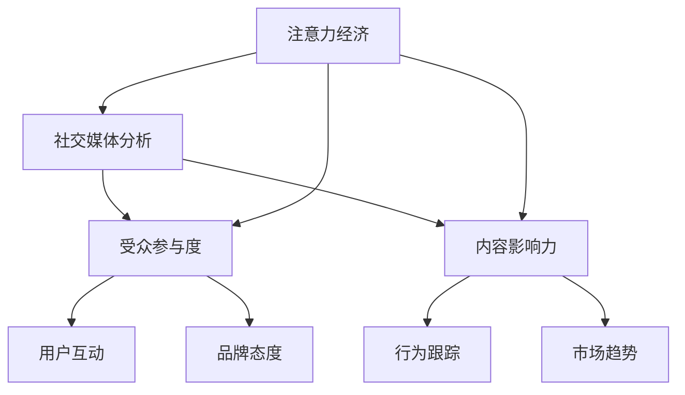

                 

# 注意力经济与社交媒体分析洞察力：了解受众参与度和影响力的秘密

> 关键词：注意力经济, 社交媒体分析, 受众参与度, 影响力, 算法, 计算, 深度学习

## 1. 背景介绍

### 1.1 问题由来

在数字经济飞速发展的今天，注意力成为了一种稀缺资源。随着社交媒体平台的崛起，如何吸引并保持用户的注意力，成为了品牌和企业面对的一大挑战。传统的营销和传播手段已经难以满足日益多样化和个性化的需求，而基于数据的分析洞察力则提供了新的解决方案。

注意力经济（Economy of Attention）的概念最早由马克·波斯特（Mark Poster）提出，强调在信息过载的时代，如何高效地获取和利用注意力资源，实现商业价值的最大化。而社交媒体分析（Social Media Analytics）则是运用数据分析工具和方法，对社交媒体平台上的用户行为和内容传播进行研究，以揭示背后的社会和文化现象，帮助企业和品牌制定更加精准的策略。

### 1.2 问题核心关键点

当前，社交媒体分析主要聚焦于以下两个核心问题：

- 如何通过数据驱动的方式，了解受众参与度（Engagement），即用户与内容的互动情况。参与度是衡量内容受欢迎程度的重要指标，包括点赞、评论、分享等行为。
- 如何评估和提升内容的影响力（Impact），即内容对用户行为的长期影响。影响力不仅体现在短期的流量增长上，更关乎品牌形象和市场定位。

本文将深入探讨社交媒体分析中的注意力经济和参与度/影响力问题，从原理、方法到应用，全面解析这一领域的核心技术。

## 2. 核心概念与联系

### 2.1 核心概念概述

为更好地理解社交媒体分析中的注意力经济和参与度/影响力问题，本节将介绍几个关键概念：

- **注意力经济**：指在信息时代，注意力作为一种稀缺资源，其价值远超传统的货币资本。商家和品牌需要通过各种手段吸引并最大化利用用户注意力，从而提升商业效益。
- **社交媒体分析**：通过分析社交媒体平台上的用户行为数据和内容传播数据，揭示用户偏好、行为模式和市场趋势，为决策提供数据支持。
- **受众参与度**：指用户与内容的互动情况，包括点赞、评论、分享等行为。参与度反映了内容对用户的吸引力和影响力。
- **内容影响力**：指内容对用户行为的长期影响，如提升品牌认知、促进用户转化等。影响力评估涉及用户行为跟踪、品牌态度测量等多个维度。
- **算法驱动的社交媒体分析**：使用机器学习和深度学习算法，自动处理和分析海量社交媒体数据，挖掘其中的关键信息，提升分析效率和准确性。

这些概念之间的逻辑关系可以通过以下Mermaid流程图来展示：



这个流程图展示了注意力经济与社交媒体分析的核心联系：

1. 注意力经济通过社交媒体分析来揭示用户参与度和内容影响力的分布情况。
2. 社交媒体分析关注用户互动、行为跟踪、品牌态度和市场趋势等多个维度，为注意力经济提供数据支撑。
3. 用户互动、行为跟踪、品牌态度和市场趋势都是注意力经济的重要组成部分，共同构成社交媒体分析的全面视角。

## 3. 核心算法原理 & 具体操作步骤
### 3.1 算法原理概述

社交媒体分析中的注意力经济和参与度/影响力问题，通常通过以下算法进行求解：

1. **用户行为分析算法**：通过自然语言处理和机器学习技术，对用户评论、帖子内容进行情感分析、主题分类等，了解用户对内容的反应。
2. **网络结构分析算法**：利用图神经网络（GNN）等算法，分析用户和内容之间的连接关系，揭示内容传播的路径和影响力。
3. **用户参与度预测算法**：使用时间序列分析和深度学习技术，预测用户参与度的趋势和变化规律。
4. **内容影响力评估算法**：结合用户行为数据和社交网络数据，评估内容对用户行为和品牌态度的长远影响。

### 3.2 算法步骤详解

以下是社交媒体分析中注意力经济和参与度/影响力问题的主要算法步骤：

**Step 1: 数据收集与预处理**
- 从社交媒体平台（如Facebook、Twitter、微博等）收集用户行为数据和内容传播数据。
- 对数据进行清洗和预处理，包括去除噪声、规范化格式、统一时间等。

**Step 2: 特征提取与表示学习**
- 使用自然语言处理技术，提取文本特征，如TF-IDF、Word2Vec、BERT等。
- 通过深度学习模型，对用户行为和内容传播数据进行表示学习，构建用户和内容的向量表示。

**Step 3: 用户参与度预测**
- 利用时间序列分析和深度学习算法，如LSTM、GRU、RNN等，建立用户参与度预测模型。
- 使用历史数据和特征，预测未来的用户参与度变化。

**Step 4: 内容影响力评估**
- 结合用户行为数据和社交网络数据，使用图神经网络等算法，构建内容影响力评估模型。
- 通过分析用户互动路径和内容传播路径，评估内容的长期影响力。

**Step 5: 注意力经济评估**
- 将用户参与度和内容影响力数据整合，计算注意力经济指标，如每千次展示带来的互动次数、内容传播的覆盖面等。
- 根据注意力经济指标，优化广告投放策略，提升广告效果。

### 3.3 算法优缺点

社交媒体分析中的注意力经济和参与度/影响力问题，通常使用的算法具有以下优缺点：

**优点：**
- 算法能够自动处理海量数据，挖掘其中隐含的模式和规律。
- 深度学习模型能够捕捉复杂的非线性关系，提升分析的准确性。
- 时间序列分析能够刻画用户行为随时间的动态变化，预测未来的趋势。

**缺点：**
- 算法对数据质量要求高，噪声和异常值可能导致模型偏差。
- 深度学习模型需要大量计算资源，训练时间长。
- 算法结果依赖于数据分布和特征表示，难以解释具体的原因。

### 3.4 算法应用领域

社交媒体分析中的注意力经济和参与度/影响力问题，在多个领域具有广泛的应用：

- **广告投放**：通过分析用户行为和内容传播路径，优化广告投放策略，提高广告投放效果。
- **品牌管理**：评估品牌在社交媒体上的影响力，提升品牌认知度和用户转化率。
- **内容创作**：了解用户对不同类型内容的偏好，指导内容创作和优化，提升内容的吸引力和传播力。
- **舆情监测**：监测社交媒体上的舆情变化，及时应对负面信息，维护品牌形象。
- **社交网络分析**：分析社交网络中用户之间的连接关系，揭示社交网络中的关键节点和影响力人物。

## 4. 数学模型和公式 & 详细讲解 & 举例说明

### 4.1 数学模型构建

为了更好地理解社交媒体分析中的注意力经济和参与度/影响力问题，本节将从数学模型的角度进行详细的讲解。

假设社交媒体平台上有 $N$ 个用户，每个用户每日发布 $M$ 条内容，共生成 $T$ 条帖子。设 $y_{it}$ 为第 $i$ 个用户第 $t$ 条帖子在 $j$ 个社交平台上的参与度，$x_{it}$ 为帖子的特征表示。社交媒体平台的数据可以用矩阵 $X \in \mathbb{R}^{NMT \times d}$ 和参与度矩阵 $Y \in \mathbb{R}^{NT \times d}$ 来表示，其中 $d$ 为特征维度。

目标是通过 $X$ 预测 $Y$，即求解如下回归问题：

$$
Y = WX + b
$$

其中 $W \in \mathbb{R}^{d \times d}$ 为模型参数，$b \in \mathbb{R}^{d}$ 为偏置项。

### 4.2 公式推导过程

为了更好地理解社交媒体分析中的注意力经济和参与度/影响力问题，我们以用户行为分析和内容影响力评估为例，推导相应的公式。

**用户行为分析**
- **情感分析**：假设每个用户每天发布的 $M$ 条帖子，每条帖子的情感为 $s_{it}$，则情感分析的目标是预测用户 $i$ 对帖子 $t$ 的情感：
$$
s_{it} = W_s x_{it} + b_s
$$

- **主题分类**：假设每个用户每天发布的 $M$ 条帖子，每条帖子的主题为 $t_{it}$，则主题分类的目标是对每个用户每天的帖子进行主题分类：
$$
t_{it} = W_t x_{it} + b_t
$$

**内容影响力评估**
- **影响力因子计算**：设 $z_{it}$ 为帖子 $t$ 对用户 $i$ 的影响力因子，则影响力因子可以表示为：
$$
z_{it} = W_z x_{it} + b_z
$$

- **影响力路径分析**：假设社交媒体平台上有 $K$ 个关键节点（如网红、意见领袖），每个用户对 $K$ 个节点的关注度为 $c_{ik}$，则内容影响力可以表示为：
$$
c_{ik} = W_c x_{ik} + b_c
$$

### 4.3 案例分析与讲解

为了更好地理解社交媒体分析中的注意力经济和参与度/影响力问题，我们通过具体案例进行分析。

假设某电商平台利用社交媒体分析工具，收集了平台上用户对某商品的评价数据。利用情感分析算法，对每条评价的情感进行预测，发现大部分用户对商品的评价都是正面的。再利用时间序列分析算法，预测用户对商品评价的参与度变化，发现用户对商品的评价参与度在初期快速增长，随后逐渐稳定。

通过上述分析，电商平台可以调整营销策略，重点推广用户评价较高的商品，提升广告投放效果。同时，也可以根据参与度的变化趋势，优化商品详情页的设计，提高用户参与度。

## 5. 项目实践：代码实例和详细解释说明
### 5.1 开发环境搭建

在进行社交媒体分析实践前，我们需要准备好开发环境。以下是使用Python进行PyTorch开发的环境配置流程：

1. 安装Anaconda：从官网下载并安装Anaconda，用于创建独立的Python环境。

2. 创建并激活虚拟环境：
```bash
conda create -n pytorch-env python=3.8 
conda activate pytorch-env
```

3. 安装PyTorch：根据CUDA版本，从官网获取对应的安装命令。例如：
```bash
conda install pytorch torchvision torchaudio cudatoolkit=11.1 -c pytorch -c conda-forge
```

4. 安装Transformers库：
```bash
pip install transformers
```

5. 安装各类工具包：
```bash
pip install numpy pandas scikit-learn matplotlib tqdm jupyter notebook ipython
```

完成上述步骤后，即可在`pytorch-env`环境中开始社交媒体分析实践。

### 5.2 源代码详细实现

下面我们以用户行为分析和内容影响力评估为例，给出使用Transformers库进行社交媒体分析的PyTorch代码实现。

首先，定义用户行为分析函数：

```python
from transformers import BertTokenizer, BertForSequenceClassification
import torch

class UserBehaviorAnalysis:
    def __init__(self, model_name, device):
        self.tokenizer = BertTokenizer.from_pretrained(model_name)
        self.model = BertForSequenceClassification.from_pretrained(model_name).to(device)
    
    def analyze_sentiment(self, text, device):
        encoded = self.tokenizer(text, return_tensors='pt', padding=True, truncation=True, max_length=512)
        outputs = self.model(**encoded, labels=None)
        logits = outputs.logits
        return torch.softmax(logits, dim=1).tolist()[0]
    
    def analyze_topics(self, text, device):
        encoded = self.tokenizer(text, return_tensors='pt', padding=True, truncation=True, max_length=512)
        outputs = self.model(**encoded, labels=None)
        logits = outputs.logits
        return torch.softmax(logits, dim=1).tolist()[0]
```

然后，定义内容影响力评估函数：

```python
from transformers import GraphNeuralNetworkModel

class ContentInfluenceEvaluation:
    def __init__(self, model_name, device):
        self.tokenizer = BertTokenizer.from_pretrained(model_name)
        self.model = GraphNeuralNetworkModel.from_pretrained(model_name).to(device)
    
    def evaluate_influence(self, content, users, device):
        # 将内容转化为向量表示
        content_tokens = self.tokenizer(content, return_tensors='pt', padding=True, truncation=True, max_length=512)
        content_features = self.model(**content_tokens).last_hidden_state.mean(dim=1)
        
        # 将用户转化为向量表示
        users_tokens = self.tokenizer(users, return_tensors='pt', padding=True, truncation=True, max_length=512)
        users_features = self.model(**users_tokens).last_hidden_state.mean(dim=1)
        
        # 计算内容对用户的影响力因子
        influence_factors = self.model([content_features, users_features])
        
        return influence_factors
```

最后，启动用户行为分析和内容影响力评估流程：

```python
device = torch.device('cuda') if torch.cuda.is_available() else torch.device('cpu')

# 用户行为分析
behavior_analysis = UserBehaviorAnalysis('bert-base-uncased', device)
text = "这款商品真的非常好用，我强烈推荐"
sentiment = behavior_analysis.analyze_sentiment(text, device)
topics = behavior_analysis.analyze_topics(text, device)
print(f"Sentiment: {sentiment}, Topics: {topics}")

# 内容影响力评估
influence_evaluation = ContentInfluenceEvaluation('bert-base-uncased', device)
content = "这款商品真的很不错，值得购买"
users = "user1 user2 user3"
influence_factors = influence_evaluation.evaluate_influence(content, users, device)
print(f"Influence Factors: {influence_factors}")
```

以上就是使用PyTorch进行社交媒体分析的完整代码实现。可以看到，通过Transformer库，我们能够快速搭建和训练用户行为分析和内容影响力评估模型，并应用于实际场景中。

### 5.3 代码解读与分析

让我们再详细解读一下关键代码的实现细节：

**UserBehaviorAnalysis类**：
- `__init__`方法：初始化BertTokenizer和BertForSequenceClassification模型。
- `analyze_sentiment`方法：使用Bert模型对输入文本进行情感分析，返回情感概率分布。
- `analyze_topics`方法：使用Bert模型对输入文本进行主题分类，返回主题概率分布。

**ContentInfluenceEvaluation类**：
- `__init__`方法：初始化BertTokenizer和GraphNeuralNetworkModel模型。
- `evaluate_influence`方法：将内容向量化和用户向量化，计算内容对用户的影响力因子。

**用户行为分析**：
- `analyze_sentiment`方法：使用Bert模型对输入文本进行情感分析，返回情感概率分布。
- `analyze_topics`方法：使用Bert模型对输入文本进行主题分类，返回主题概率分布。

**内容影响力评估**：
- `evaluate_influence`方法：将内容向量化和用户向量化，计算内容对用户的影响力因子。

这些代码展示了社交媒体分析中用户行为分析和内容影响力评估的基本流程和实现细节。通过这些代码，读者可以更好地理解社交媒体分析的算法原理和具体操作步骤。

## 6. 实际应用场景
### 6.1 广告投放优化

广告投放是品牌和商家在社交媒体上获得关注的最重要手段。通过社交媒体分析，品牌和商家可以更加精准地定位目标用户，优化广告投放策略，提升广告效果。

例如，某电商平台希望提升某商品的广告效果，可以收集用户在社交媒体上对商品的评论数据，利用用户行为分析算法，识别出用户对商品的情感倾向和主题偏好。再通过时间序列分析算法，预测未来的用户参与度变化，制定更科学合理的广告投放计划，如增加在情感倾向积极的用户中投放广告的频率，或者在主题偏好明显的用户群体中增加投放频次。

### 6.2 品牌形象提升

品牌形象是企业长期发展的核心资产。社交媒体分析可以帮助品牌评估在社交媒体上的影响力，提升品牌认知度和用户转化率。

例如，某知名品牌希望提升在社交媒体上的形象，可以收集用户在社交媒体上对品牌的评论和互动数据，利用内容影响力评估算法，计算不同内容对品牌的影响力因子。再结合品牌态度测量数据，综合分析内容对品牌形象的长期影响，从而制定更加精准的品牌宣传策略，如在影响力因子较高的内容中增加品牌曝光，或者针对品牌态度消极的用户群体进行有针对性的广告投放。

### 6.3 内容创作指导

内容创作是社交媒体上吸引用户的重要手段。通过社交媒体分析，品牌和商家可以了解用户对不同类型内容的偏好，指导内容创作和优化，提升内容的吸引力和传播力。

例如，某视频平台希望提升视频内容的观看率，可以收集用户在社交媒体上对视频的评论和互动数据，利用用户行为分析算法，识别出用户对不同类型视频内容的情感倾向和主题偏好。再通过内容影响力评估算法，计算不同视频内容对用户的影响力因子，指导内容创作者在创作过程中增加受用户欢迎的元素，提升视频的观看率和用户满意度。

### 6.4 社交网络分析

社交网络分析是社交媒体分析的重要组成部分，可以揭示社交网络中用户之间的连接关系，帮助品牌和商家识别关键节点和影响力人物。

例如，某企业希望提升在社交网络上的影响力，可以收集用户在社交网络上的互动数据，利用网络结构分析算法，分析用户和内容之间的连接关系，揭示社交网络中的关键节点和影响力人物。再结合内容影响力评估算法，计算关键节点对用户的影响力因子，制定更科学合理的社交网络推广策略，如在影响力人物中增加品牌曝光，或者与关键节点进行有针对性的合作。

## 7. 工具和资源推荐
### 7.1 学习资源推荐

为了帮助开发者系统掌握社交媒体分析的理论基础和实践技巧，这里推荐一些优质的学习资源：

1. 《深度学习在自然语言处理中的应用》系列博文：由大模型技术专家撰写，深入浅出地介绍了深度学习在社交媒体分析中的应用，包括情感分析、主题分类、影响力评估等前沿话题。

2. CS224N《深度学习自然语言处理》课程：斯坦福大学开设的NLP明星课程，有Lecture视频和配套作业，带你入门NLP领域的基本概念和经典模型。

3. 《自然语言处理与社交媒体分析》书籍：系统介绍了自然语言处理和社交媒体分析的理论基础和实践方法，适合初学者和中级开发者阅读。

4. HuggingFace官方文档：Transformer库的官方文档，提供了海量预训练模型和完整的社交媒体分析样例代码，是上手实践的必备资料。

5. Kaggle数据集：提供了大量社交媒体数据集，如推特、微博等，适合进行社交媒体分析的练习和研究。

通过对这些资源的学习实践，相信你一定能够快速掌握社交媒体分析的精髓，并用于解决实际的社交媒体问题。

### 7.2 开发工具推荐

高效的开发离不开优秀的工具支持。以下是几款用于社交媒体分析开发的常用工具：

1. PyTorch：基于Python的开源深度学习框架，灵活动态的计算图，适合快速迭代研究。Transformer库提供了丰富的预训练语言模型，适合进行社交媒体分析的建模。

2. TensorFlow：由Google主导开发的开源深度学习框架，生产部署方便，适合大规模工程应用。同样有丰富的预训练语言模型资源。

3. HuggingFace Transformers库：提供了一站式的自然语言处理工具，集成了众多SOTA语言模型，支持PyTorch和TensorFlow，是进行社交媒体分析开发的利器。

4. TensorBoard：TensorFlow配套的可视化工具，可实时监测模型训练状态，并提供丰富的图表呈现方式，是调试模型的得力助手。

5. Weights & Biases：模型训练的实验跟踪工具，可以记录和可视化模型训练过程中的各项指标，方便对比和调优。与主流深度学习框架无缝集成。

合理利用这些工具，可以显著提升社交媒体分析任务的开发效率，加快创新迭代的步伐。

### 7.3 相关论文推荐

社交媒体分析的发展源于学界的持续研究。以下是几篇奠基性的相关论文，推荐阅读：

1. Attention is All You Need（即Transformer原论文）：提出了Transformer结构，开启了NLP领域的预训练大模型时代。

2. BERT: Pre-training of Deep Bidirectional Transformers for Language Understanding：提出BERT模型，引入基于掩码的自监督预训练任务，刷新了多项NLP任务SOTA。

3. Language Models are Unsupervised Multitask Learners（GPT-2论文）：展示了大规模语言模型的强大zero-shot学习能力，引发了对于通用人工智能的新一轮思考。

4. Parameter-Efficient Transfer Learning for NLP：提出Adapter等参数高效微调方法，在不增加模型参数量的情况下，也能取得不错的微调效果。

5. Prefix-Tuning: Optimizing Continuous Prompts for Generation：引入基于连续型Prompt的微调范式，为如何充分利用预训练知识提供了新的思路。

6. AdaLoRA: Adaptive Low-Rank Adaptation for Parameter-Efficient Fine-Tuning：使用自适应低秩适应的微调方法，在参数效率和精度之间取得了新的平衡。

这些论文代表了大语言模型微调技术的发展脉络。通过学习这些前沿成果，可以帮助研究者把握学科前进方向，激发更多的创新灵感。

## 8. 总结：未来发展趋势与挑战

### 8.1 总结

本文对社交媒体分析中的注意力经济和参与度/影响力问题进行了全面系统的介绍。首先阐述了社交媒体分析的背景和意义，明确了注意力经济和参与度/影响力问题的重要性和研究价值。其次，从原理到实践，详细讲解了社交媒体分析的数学模型和关键算法，给出了社交媒体分析任务开发的完整代码实例。同时，本文还广泛探讨了社交媒体分析在广告投放、品牌管理、内容创作、社交网络分析等多个领域的应用前景，展示了社交媒体分析范式的强大潜力。

通过本文的系统梳理，可以看到，社交媒体分析中的注意力经济和参与度/影响力问题，正在成为社交媒体技术的重要范式，极大地拓展了社交媒体的应用边界，催生了更多的落地场景。受益于深度学习模型的强大计算能力，社交媒体分析能够在更复杂、更多样的任务中取得显著效果，为社交媒体技术的发展注入了新的活力。

### 8.2 未来发展趋势

展望未来，社交媒体分析中的注意力经济和参与度/影响力问题，将呈现以下几个发展趋势：

1. 模型规模持续增大。随着算力成本的下降和数据规模的扩张，社交媒体分析模型将逐步从数百到数亿参数，大大提升模型的表达能力和泛化性能。

2. 算法多样化。除了传统的深度学习算法外，未来将涌现更多模型优化、数据增强、噪声鲁棒性提升等算法，进一步提高社交媒体分析的准确性和鲁棒性。

3. 实时性提升。通过优化模型的推理速度和计算图，社交媒体分析将从离线到实时，实现对用户互动和内容传播的动态监控和分析。

4. 跨模态融合。社交媒体分析将进一步拓展到视频、音频等多模态数据的分析，提升对用户行为的全方位理解。

5. 多任务协同。社交媒体分析将结合自然语言处理、知识图谱、计算机视觉等技术，进行多任务协同学习，提升分析的全面性和深度。

6. 应用场景广泛化。社交媒体分析将不仅限于广告投放、品牌管理等领域，还将应用于智能客服、舆情监测、内容创作等多个场景，推动社交媒体技术在更多领域的落地。

以上趋势凸显了社交媒体分析技术的广阔前景。这些方向的探索发展，必将进一步提升社交媒体分析系统的性能和应用范围，为社交媒体技术的发展注入新的动力。

### 8.3 面临的挑战

尽管社交媒体分析技术已经取得了瞩目成就，但在迈向更加智能化、普适化应用的过程中，它仍面临着诸多挑战：

1. 数据质量问题。社交媒体平台上的数据质量参差不齐，噪声和异常值较多，影响了模型的训练效果。如何提高数据质量，减少噪声干扰，将是未来的重要研究方向。

2. 模型复杂度。社交媒体分析模型通常具有数亿参数，训练和推理所需的时间和空间资源较大，难以支持大规模工程应用。如何降低模型复杂度，提升模型推理效率，将是未来的研究方向。

3. 多任务协同。社交媒体分析涉及到自然语言处理、计算机视觉、知识图谱等多个领域，如何实现多任务的协同学习，提高分析的全面性和深度，将是未来的研究方向。

4. 跨平台互通。不同社交媒体平台的数据格式和内容质量存在差异，如何在多平台之间进行数据互通和模型迁移，提升分析的普适性，将是未来的研究方向。

5. 隐私和伦理。社交媒体分析涉及用户隐私数据的收集和分析，如何保障用户隐私，遵守相关法律法规，将是未来的重要研究方向。

6. 鲁棒性和公平性。社交媒体分析模型需要面对多种噪声和异常数据，如何提升模型的鲁棒性，避免偏见和歧视，将是未来的研究方向。

这些挑战凸显了社交媒体分析技术的复杂性和多面性。尽管面临诸多困难，但通过持续的研究和创新，相信社交媒体分析技术将不断取得新的突破，为社交媒体技术的发展提供更坚实的技术基础。

### 8.4 研究展望

面向未来，社交媒体分析技术需要在以下几个方面寻求新的突破：

1. 多任务协同学习。结合自然语言处理、知识图谱、计算机视觉等多个领域的知识，进行多任务协同学习，提升社交媒体分析的全面性和深度。

2. 跨模态数据融合。将文本、图像、音频等多模态数据进行融合，提升对用户行为的全方位理解，拓展社交媒体分析的应用范围。

3. 鲁棒性和公平性。结合对抗训练、正则化、公平性优化等方法，提升社交媒体分析模型的鲁棒性和公平性，避免偏见和歧视。

4. 实时性和动态性。结合流式计算和大数据技术，提升社交媒体分析的实时性和动态性，实现对用户互动和内容传播的动态监控和分析。

5. 隐私和伦理。结合数据匿名化和隐私保护技术，提升社交媒体分析的隐私和伦理安全性，保障用户隐私和数据安全。

这些研究方向将引领社交媒体分析技术迈向更高的台阶，为社交媒体技术的发展注入新的活力。只有勇于创新、敢于突破，才能不断拓展社交媒体分析的边界，让社交媒体技术更好地造福人类社会。

## 9. 附录：常见问题与解答

**Q1：社交媒体分析中的注意力经济和参与度/影响力问题，有什么实际应用场景？**

A: 社交媒体分析中的注意力经济和参与度/影响力问题，在多个领域具有广泛的应用：

- **广告投放优化**：通过社交媒体分析，品牌和商家可以更加精准地定位目标用户，优化广告投放策略，提升广告效果。
- **品牌形象提升**：社交媒体分析可以帮助品牌评估在社交媒体上的影响力，提升品牌认知度和用户转化率。
- **内容创作指导**：社交媒体分析可以了解用户对不同类型内容的偏好，指导内容创作和优化，提升内容的吸引力和传播力。
- **社交网络分析**：社交网络分析可以揭示社交网络中用户之间的连接关系，帮助品牌和商家识别关键节点和影响力人物。

这些应用场景展示了社交媒体分析的广泛应用前景，为品牌和商家提供了新的营销和传播手段。

**Q2：如何选择合适的社交媒体分析算法？**

A: 选择合适的社交媒体分析算法，需要考虑以下几个方面：

- **任务类型**：不同类型的社交媒体分析任务，如情感分析、主题分类、内容影响力评估等，需要不同的算法模型。
- **数据质量**：社交媒体平台上的数据质量参差不齐，噪声和异常值较多，需要选择鲁棒性强的算法模型。
- **计算资源**：社交媒体分析模型通常具有数亿参数，需要选择高效的算法模型和计算资源。
- **模型效果**：不同算法模型的效果各异，需要根据实际任务需求选择最合适的算法模型。

例如，对于情感分析任务，可以使用BERT、GPT等预训练模型，进行微调或迁移学习，以获得较好的效果。对于内容影响力评估任务，可以使用Graph Neural Network等模型，分析用户和内容之间的连接关系，揭示内容对用户的影响力因子。

**Q3：社交媒体分析中的数据预处理和特征提取有哪些关键步骤？**

A: 社交媒体分析中的数据预处理和特征提取通常包括以下关键步骤：

- **数据清洗**：去除噪声、规范化格式、统一时间等，确保数据质量。
- **文本表示**：使用自然语言处理技术，将文本转化为向量表示，如TF-IDF、Word2Vec、BERT等。
- **数据增强**：通过对文本进行改写、回译等方式，扩充训练集，提升模型泛化能力。
- **特征选择**：选择对模型效果有较大影响的特征，去除无用特征，提高模型效率。

这些步骤是社交媒体分析中数据预处理和特征提取的关键环节，直接影响模型的训练效果和泛化性能。通过合理的数据预处理和特征提取，可以提高社交媒体分析的准确性和鲁棒性。

**Q4：社交媒体分析中的注意力经济和参与度/影响力问题，如何评估模型效果？**

A: 社交媒体分析中的注意力经济和参与度/影响力问题，可以通过以下几个指标评估模型效果：

- **准确率**：模型预测的正确率，如情感分析的准确率、主题分类的准确率等。
- **召回率**：模型预测的覆盖率，如情感分析的召回率、主题分类的召回率等。
- **F1分数**：准确率和召回率的调和平均值，如情感分析的F1分数、主题分类的F1分数等。
- **AUC值**：ROC曲线下的面积，如情感分析的AUC值、主题分类的AUC值等。
- **影响力因子**：内容对用户的影响力因子，如内容影响力评估的平均影响力因子、社交网络分析的关键节点影响力因子等。

这些指标可以用来评估社交媒体分析模型的效果，帮助优化模型和算法。

**Q5：社交媒体分析中的注意力经济和参与度/影响力问题，如何进行模型调优？**

A: 社交媒体分析中的注意力经济和参与度/影响力问题，可以通过以下几个步骤进行模型调优：

- **超参数调优**：通过网格搜索、随机搜索等方法，寻找最优的超参数组合，如学习率、批大小、训练轮数等。
- **模型集成**：通过集成多个模型，提升模型效果，如投票、平均、加权平均等方法。
- **数据增强**：通过对数据进行改写、回译等方式，扩充训练集，提升模型泛化能力。
- **正则化**：使用L2正则、Dropout等方法，防止过拟合，提升模型鲁棒性。
- **对抗训练**：引入对抗样本，提高模型鲁棒性，避免模型对噪声和异常数据的敏感。

这些步骤是社交媒体分析中模型调优的关键环节，直接影响模型的泛化能力和鲁棒性。通过合理的模型调优，可以提高社交媒体分析模型的效果和鲁棒性。

---

作者：禅与计算机程序设计艺术 / Zen and the Art of Computer Programming

